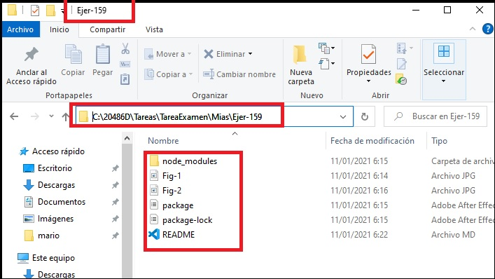
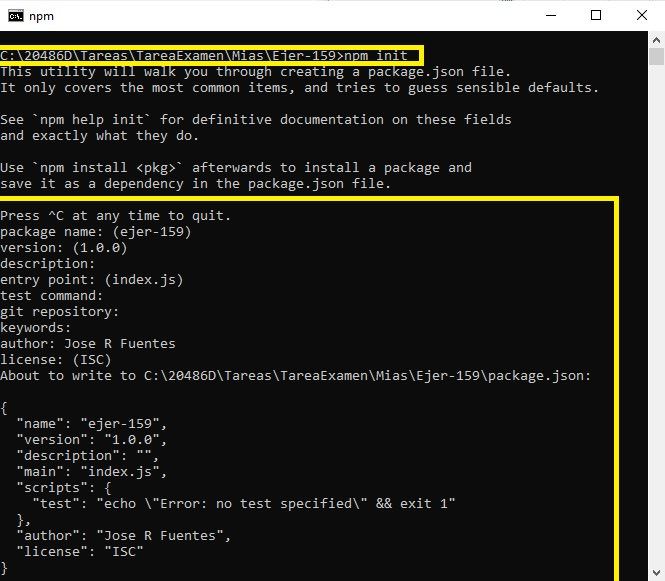
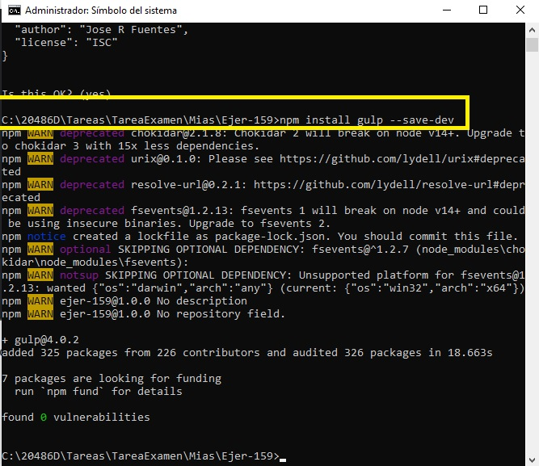
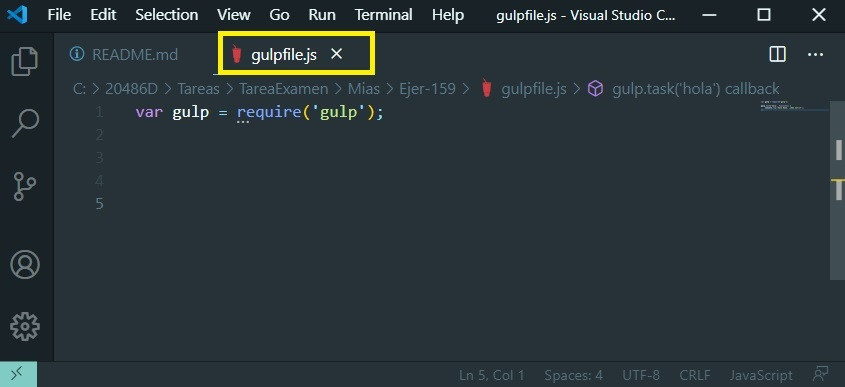
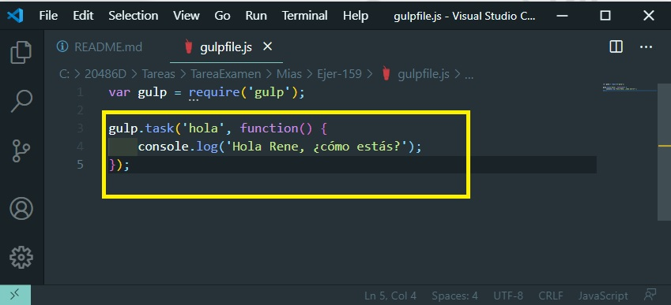
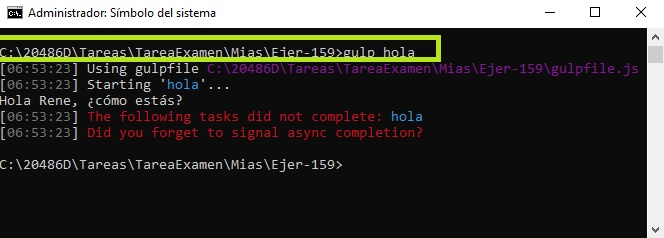

# QUESTION 159

### DRAG DROP
You are developing an ASP.NET Core web application in Microsoft Visual Studio. The project uses a file named package.json in reusable packages.
You must automate the build process to use a script minification strategy. Script minification must happen in parallel.
You need to ensure you can share and distribute packages and run the minification strategy.
Which tools should you use? To answer, drag the appropriate tools to the correct scenarios. Each tool may be used once, more than once, or not at all. You may need to drag the split bar between panes or scroll to view content.
NOTE: Each correct selection is worth one point.

Respuesta:

### Primero tenemos que crear un proyecto
1. Primero, crearemos una carpeta llamada proyecto a servidor como raíz de nuestro proyecto a medida que avanzamos en este tutorial. Para ello tenemos que ejecutar el comando npm init desde dentro del directorio del ejercicio:




2. Tenemos que ejecutar el comando npm para crear el proyecto siguiente:

```
  $ npm init
```


El comando npm init crea un archivo package.json para su proyecto que almacena información sobre el proyecto, como las dependencias utilizadas en el proyecto (Gulp es un ejemplo de una dependencia).

3. Una vez que se crea el archivo package.json, podemos instalar Gulp en el proyecto usando el siguiente comando:

```
  $ npm install gulp --save-dev
```




4. Creamos el archivo **gulpfile.js** en la raíz del directorio del proyecto:





5. Escribir una tarea Gulp. Para ello:

- Definimos una variable: **var gulp = require('gulp');**
- Creamos una tarea: 

```
    gulp.task('nombre-de-la-tarea', function() {
    // algún código aquí
    });
```
- Probando la tarea, creamos la tarea 'hola':

```
    gulp.task('hola', function() {
     console.log('Hola Rene, ¿cómo estás?');
    });
```




- Ejecutando la tarea 'hola':

```
    gulp hola
```




6. Podemos usar gulp-sass para crear una tarea que sea destinada a compilar Sass en CSS, llamémoslo sass.

```
    gulp.task('sass', function(){
    return gulp.src('source-files')
        .pipe(sass()) // Using gulp-sass
        .pipe(gulp.dest('destination'))
    });
```

### Respuesta

#### Target 1: npm
#### Target 2: Gulp