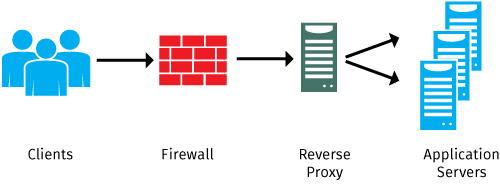
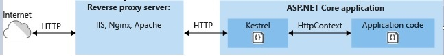

# QUESTION 160

You are developing an ASP.NET Core web application. The application includes a secure area only accessible to authenticated users.

The application must:
   - Reside on the same server as the reverse proxy.
   - Use a reverse proxy for caching and serving static content. Use basic authentication for the secure area.
   - Use the HTTPS protocol for the secure area.
   - Use the HTTPS protocol for all non-secure content.
You need to deploy the application.

Which two actions should you perform? Each correct answer presents part of the solution.

## Respuesta A:

### A. Usar el métoddo RewriteMiddleware de Microsoft.AspNetCore.Rewrite, ya que este permite:

1. Primero, Redireccionamiento y reescritura de URL.
    - La reescritura de URL es una operación del lado servidor que proporciona un recurso desde una dirección de recursos distinta a la que el cliente ha solicitado.
    - Permite redirigir solicitudes distintas de **www** a **www**.

2. Redirección de URL a un punto de conexión segura.

    - Se usa AddRedirectToHttps para redirigir las solicitudes HTTP al mismo host y ruta de acceso mediante el protocolo HTTPS.
    - Permite redirigir las solicitudes no seguras al mismo host y ruta de acceso mediante el protocolo HTTPS seguro en el puerto 443.

3. Reescritura de URL:

    - Usamos AddRewrite para crear una regla para reescribir URL.

4. Reescritura de URL en Nginx

### D. Usar el métoddo RewriteMiddleware de Microsoft.AspNetCore.Rewrite, este permite:

Las reglas de reescritura de NGINX (los mismos métodos funcionan tanto para NGINX Plus como para el software de código abierto NGINX) cambian parte o la totalidad la URL en una solicitud de cliente, generalmente con uno de dos propósitos:

    - Informar a los clientes que el recurso que están solicitando ahora reside en una ubicación diferente. Un ejemplo es cuando el nombre de dominio de su sitio web ha cambiado, cuando desea que los clientes usen un formato de URL canónico (con o sin el prefijo www) y/o cuando se desea detectar y corregir errores ortográficos comunes de su nombre de dominio.
    - Para controlar el flujo de procesamiento dentro de NGINX y NGINX Plus, por ejemplo, para reenviar solicitudes a un servidor de aplicaciones cuando el contenido debe generarse dinámicamente.

### Respuesta D

El término proxy inverso se aplica normalmente a un servicio que se encuentra frente a uno o más servidores (como un servidor web), aceptando solicitudes de los clientes para los recursos ubicados en los servidores. Desde el punto de vista del cliente, el proxy inverso parece ser el servidor web y, por lo tanto, es totalmente transparente para el usuario remoto.

Kestrel es un servidor web multiplataforma de ASP.NET Core. Kestrel es el servidor web que se incluye de forma predeterminada en las plantillas de proyecto de ASP.NET Core.

Kestrel admite los siguientes escenarios:
    - HTTPS
    - Actualización opaca para habilitar WebSockets
    - Sockets de Unix para alto rendimiento detrás de Nginx
    - HTTP/2 (excepto en macOS†)

Kestrel se puede usar por sí solo o con un servidor proxy inverso, tal y como se ve en la siguiente imagen:

### Respuesta Correcta

#### **AD**