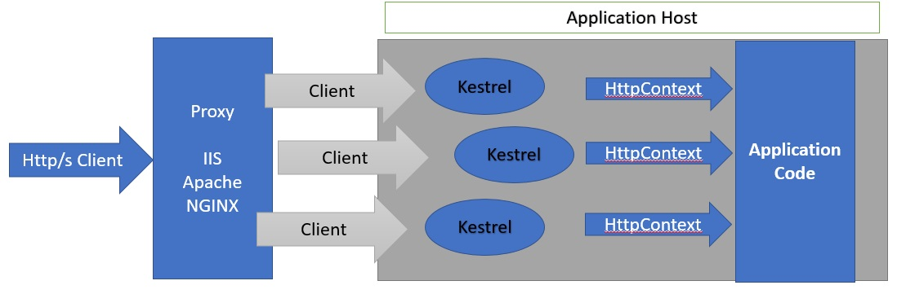
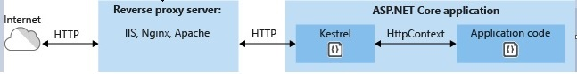

# QUESTION 161

**Note:** This question is part of a series of questions that present the same scenario. Each question in the series contains a unique solution that might meet the stated goals. Some questions sets might have more than one correct solution, while others might not have a correct solution.

After you answer a question in this section, you will NOT be able to return to it. As a result, these questions will not appear in the review screen.

You are developing an ASP.NET Core MVC web application.
The application must be exposed to external users over ports 80 and 443 and must meet the following requirements:

   - Handle more than 1024 simultaneous connections. 
   - Support Windows authentication. - si con http 1.1
   - Support HTTP/2 over TLS. - no
   - Include response caching. - si
   - Protect against denial-of-service attacks. - no

You need to deploy the application to an on-premises web server. 

Solution: You deploy the application to a standalone Kestrel server. Does the solution meet the goal?

## Respuesta: NO

### Kestrel
Kestrel es un servidor web de código abierto, multiplataforma, liviano y predeterminado que se utiliza para las aplicaciones Asp.Net Core. Las aplicaciones Asp.Net Core ejecutan el servidor web Kestrel como servidor en proceso para manejar la solicitud web. El servidor web Kestrel se basa en una biblioteca de E / S asíncrona llamada libuv desarrollada principalmente para Node.js.

De forma predeterminada, todas las plantillas de proyectos principales de Asp.Net incluyen el servidor web Kestrel cuando creamos nuevos proyectos principales de Asp.Net. Como se dijo antes, Kestrel es un servidor web muy ligero que no tiene todas las funciones avanzadas de los servidores web como IIS, Nginx, Apache, etc. Debido a su naturaleza liviana, Kestrel proporciona un mejor rendimiento de procesamiento de solicitudes a las aplicaciones Asp.Net Core. Algunas características de Kestrel,

    - Kestrel no admite varias aplicaciones que comparten el mismo puerto de forma similar a IIS, donde las aplicaciones se diferencian por el valor del encabezado del host.
    - Kestrel es multiplataforma, se ejecuta en Windows, LINUX y Mac.
    - El servidor web Kestrel admite SSL.
    - La autenticación de Windows no es compatible con HTTP/2.  Los desafíos de autenticación se pueden enviar en respuestas HTTP/2, pero el cliente debe cambiar a HTTP/1.1 antes de autenticarse.

Comprendamos que hay un nuevo servidor web llamado Kestrel cuando ya tenemos un IIS de servidor web más utilizado y con muchas funciones.

Kestrel se puede usar por sí solo o con un servidor proxy inverso, tal y como se ve en la siguiente imagen:

### Respuesta Correcta

#### **NO**

### References :

- https://docs.microsoft.com/en-us/dotnet/core/compatibility/aspnet-core/5.0/kestrel-disables-http2-over-tls

- https://docs.microsoft.com/en-us/windows/win32/secauthn/tls-cipher-suites-in-windows-8-1

- https://docs.microsoft.com/en-us/aspnet/core/security/authentication/windowsauth?view=aspnetcore-3.1&tabs=visual-studio