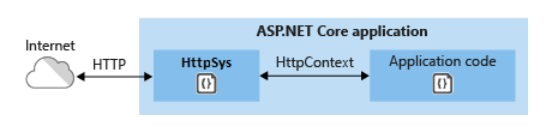
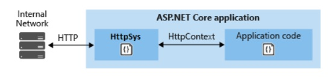

# QUESTION 162

**Note:** This question is part of a series of questions that present the same scenario. Each question in the series contains a unique solution that might meet the stated goals. Some questions sets might have more than one correct solution, while others might not have a correct solution.

After you answer a question in this section, you will NOT be able to return to it. As a result, these questions will not appear in the review screen.

You are developing an ASP.NET Core MVC web application.
The application must be exposed to external users over ports 80 and 443 and must meet the following requirements:

   - Handle more than 1024 simultaneous connections. si
   - Support Windows authentication. - si 
   - Support HTTP/2 over TLS. - si
   - Include response caching. - si
   - Protect against denial-of-service attacks. - si

You need to deploy the application to an on-premises web server. 

Solution: You deploy the application to a standalone Kestrel server. Does the solution meet the goal?

## Respuesta: SI

HTTP.sys es un servidor web de ASP.NET Core que solo se ejecuta en Windows. HTTP.sys supone una alternativa al servidor Kestrel y ofrece algunas características que este no facilita.

HTTP.sys no es compatible con el módulo ASP.NET Core y no se puede usar con IIS o IIS Express.

HTTP.sys admite las siguientes características:

    - Autenticación de Windows
    - Uso compartido de puertos
    - HTTPS con SNI
    - HTTP/2 a través de TLS (Windows 10 o posterior)
    - Transmisión directa de archivos
    - Almacenamiento en caché de respuestas
    - WebSockets (Windows 8 o posterior)

Versiones de Windows compatibles:

    - Windows 7 o posterior
    - Windows Server 2008 R2 o posterior

HTTP.sys resulta útil para implementaciones en las que:

Es necesario exponer el servidor directamente a Internet sin usar IIS, tal y como se ve en la siguiente imagen:

Una implementación interna requiere una característica que no está disponible en Kestrel, como Autenticación de Windows, tal y como se ve en la siguiente imagen:

### Respuesta Correcta

#### **SI**

### References :

- https://docs.microsoft.com/es-es/aspnet/core/fundamentals/servers/httpsys?view=aspnetcore-5.0

- https://docs.microsoft.com/en-us/aspnet/core/fundamentals/servers/httpsys?view=aspnetcore-2.1

