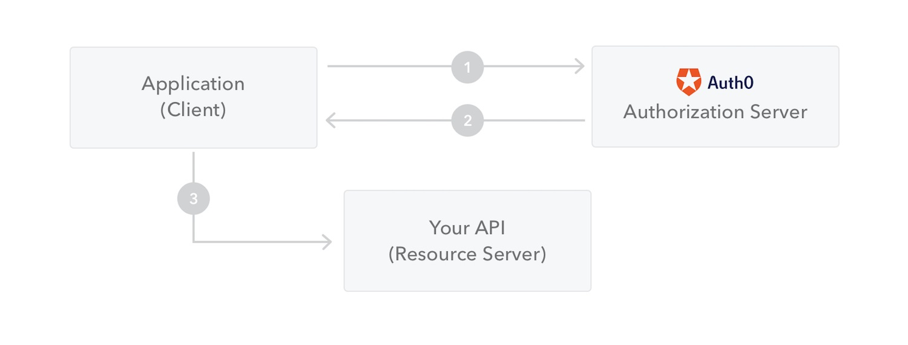

# QUESTION 164

You are developing an ASP.NET Core Web API.

API methods must use JSON Web Tokens (JWT) to authenticate the method caller. You need to implement JWT authentication.

How should you complete the code? To answer, select the appropriate options in the answer area.

NOTE: Each correct selection is worth one point.

## Explicación:

JSON Web Token (JWT) es un estándar abierto (RFC 7519) que define una forma compacta y autónoma de transmitir información de forma segura entre las partes como un objeto JSON. Esta información se puede verificar y confiar porque está firmada digitalmente.

La comunicación entre el servidor y un cliente se estable por un protocolo que sigue los siguientes pasos:

Estos son algunos escenarios en los que los tokens web JSON son útiles:

    1. Autenticación: este es el escenario típico para usar JWT, una vez que el usuario ha iniciado sesión, cada solicitud posterior incluirá el JWT, lo que le permitirá acceder a rutas, servicios y recursos permitidos con ese token. El inicio de sesión único es una función que utiliza ampliamente JWT en la actualidad, debido a su pequeña sobrecarga y su capacidad para ser utilizada fácilmente entre sistemas de diferentes dominios.

    2. Intercambio de información: los JWT son una buena forma de transmitir información de forma segura entre las partes, ya que como se pueden firmar, por ejemplo, utilizando un par de claves pública/privada, puede estar seguro de que el remitente es quien dice ser. Además, como la firma se calcula mediante el encabezado y la carga útil, también puede verificar que el contenido no haya cambiado.

#
### Respuesta Correcta

##

    - AddAuthentication
    - AddJwtBearer
    - UseAuthentication

### References :

- https://www.c-sharpcorner.com/article/jwt-json-web-token-authentication-in-asp-net-core/

