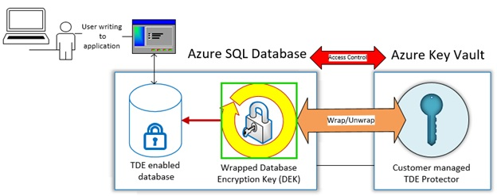
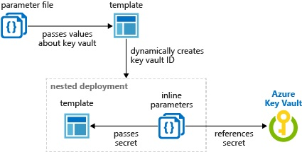

# QUESTION 165

## DRAG DROP
You are developing an ASP.NET Core web application that uses sensitive configuration data. 

You plan to develop the application locally and then deploy the application to a Microsoft Azure App Services Web App for testing and production.

You must securely store sensitive configuration data and be able to share the data across multiple projects. You need to ensure that sensitive data is stored in local configuration files.

Which technologies should you implement? To answer, drag the appropriate technologies to the correct environments. Each technology may be used once, more than once, or not at all. 

You may need to drag the split bar between panes or scroll to view content.

NOTE: Each correct selection is worth one point.

## Explicación:

### Caja 1. Secret Manager Tool

    - La herramienta 'Secret Manager' oculta los detalles de implementación, como dónde y cómo se almacenan los valores. Puede utilizar la herramienta sin conocer estos detalles de implementación.

    - La herramienta 'Secret Manager' no cifra los secretos almacenados y no debe tratarse como un almacen de confianza. Es solo para fines de desarrollo. Las claves y los valores se almacenan en un archivo de configuración JSON en el directorio de perfil de usuario. (https://docs.microsoft.com/en-us/aspnet/core/security/app-secrets?view=aspnetcore-2.1&tabs=windows)

### Caja 2. Azure Key Vault configuration provider

    - Azure Key Vault almacena solo las claves, no los datos. Entonces Azure KV como respuesta es correcta.

    - Adicionalmente ... al leer de AzureKeyVault, las claves se cargan en la configuración de la aplicación.

Ubicación del Azure key Vault graficamente:

### Caja 3. Azure Key Vault configuration provider

Despliegue anidado usando el Azure Key Vault:7

### Respuesta Correcta

#### Caja 1. Secret Manager Tool
#### Caja 2. Azure Key Vault configuration provider
#### Caja 3. Azure Key Vault configuration provider

#

### Referencias:

- https://docs.microsoft.com/es-ES/aspnet/core/security/app-secrets?view=aspnetcore-2.1&tabs=windows

- https://docs.microsoft.com/es-es/aspnet/core/security/key-vault-configuration?view=aspnetcore-5.0

- https://docs.microsoft.com/en-us/dotnet/api/overview/azure/extensions.aspnetcore.configuration.secrets-readme

