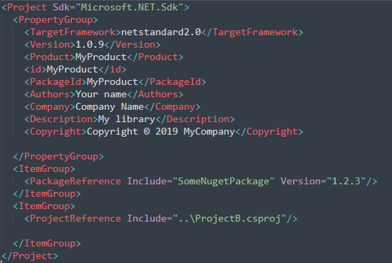

# QUESTION 167

You are developing a NuGet package that will be used by applications that target multiple .NET runtime environments.

You need to include NuGet package references within application project files.

What should you use?

    A. a PackageReference node

    B. the packages.config file

    C. the .nupkg folder name

    D. the project.json file


## Explicación:

Por supuesto, dentro de un paquete NuGet real, se implementan muchas características útiles con las que otros usuarios pueden compilar aplicaciones. Pero en este tutorial no escribirá código adicional porque para crear un paquete es suficiente con una biblioteca de clases desde la plantilla. No obstante, si desea algún código funcional para el paquete, use lo siguiente:

```cs
    namespace AppLogger
    {
        public class Logger
        {
            public void Log(string text)
            {
                Console.WriteLine(text);
            }
        }
    }
```
Ejemplo de como se estructura diferentes carpetas para admitir cuatro versiones de un ensamblado que son específicas de la plataforma:

```config
    \lib
        \net46
            \MyAssembly.dll
        \net461
            \MyAssembly.dll
        \uap
            \MyAssembly.dll
        \netcore
            \MyAssembly.dll
```

Si se tiene ensamblados específicos de la arquitectura (es decir, ensamblados independientes que tienen como destino ARM, x86 y x64), debe colocarlos en una carpeta denominada runtimes dentro de subcarpetas denominadas {platform}-{architecture}\lib\{framework} o {platform}-{architecture}\native. 

```config
    \runtimes
        \win10-arm
            \native
            \lib\uap10.0
        \win10-x86
            \native
            \lib\uap10.0
        \win10-x64
            \native
            \lib\uap10.0
```

Ejemplo de un packagereference file:



1. PackageReference node

    PackageReference es una nueva forma de permitir que NuGet administre las referencias de sus proyectos. Antes de esto, agregar un paquete NuGet actualizaría ambos paquetes. Las referencias de paquetes, con el nodo PackageReference, administran las dependencias de NuGet directamente en los archivos de proyecto (a diferencia de un archivo packages.config independiente). El uso de PackageReference, como así se llama, no afecta a otros aspectos de NuGet; por ejemplo, las opciones de los archivos NuGet.config (incluidos los orígenes de paquetes) se siguen aplicando como se explica en las configuraciones comunes de NuGet.

2. packages.config file
    El archivo packages.config se usa en algunos tipos de proyecto para mantener la lista de paquetes a los que hace referencia el proyecto. Esto permite que NuGet restaure fácilmente las dependencias del proyecto cuando el proyecto se debe transportar a otro equipo (por ejemplo, a un servidor de compilación) sin todos estos paquetes.

3. .nupkg folder name

    La carpeta .nupkg es donde NuGet instala cualquier paquete descargado. Cada paquete se expande completamente en una subcarpeta que coincide con el identificador del paquete y el número de versión. Los proyectos que usan el formato PackageReference siempre usan paquetes directamente desde esta carpeta. Al usar los paquetes.
    
    El archivo de configuración debería verse así:

```xml
    <settings>
        <repositoryPath>../libs/packages</repositoryPath>
    </settings>

```
4. project.json file

    El archivo project.json mantiene una lista de paquetes usados en un proyecto, conocido como formato de administración de paquetes. Reemplaza a los paquetes. config pero, a su vez, es reemplazado por PackageReference con NuGet 4.0+. El archivo ... json (descrito a continuación) también se usa en proyectos que emplean project.

```json
    {
        "dependencies": {
            "PackageID" : "{version_constraint}"
        },
        "frameworks" : {
            "TxM" : {}
        },
        "runtimes" : {
            "RID": {}
        },
        "supports" : {
            "CompatibilityProfile" : {}
        }
    }
```


### Respuesta Correcta

#### Opción A: *PackageReference node*


### References :

- https://docs.microsoft.com/es-es/nuget/quickstart/create-and-publish-a-package-using-visual-studio?tabs=netcore-cli

- https://docs.microsoft.com/es-es/nuget/create-packages/supporting-multiple-target-frameworks


