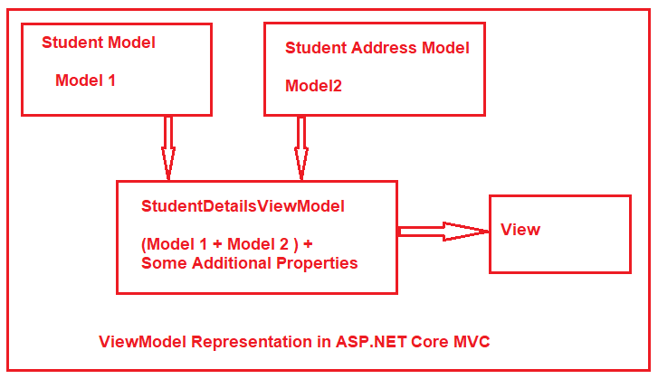

# QUESTION 168

You are designing an ASP.NET Core MVC application.

You need to combine two existing models to create a view.

Which MVC component should you use?

    A. ViewComponent 
    B. View
    C. Controller 
    D. Model


## Explicación:

Para combinar dos modelos existentes para crear una vista, más mo menos tenemos que hacer lo siguiente:

Representación gráfica de lo que queremos conseguir:




Digamos que tenemos dos modelos, tal y como sigue:

```cs
  public partial class Model1
    {
        public int ID { get; set; }
        public int StudentID { get; set; }
        public int CoachID { get; set; }
        public String StudentName {get;set;}
    }
```
Y un segundo Model como se muestra a continuación:

```cs

public partial class Model2
    {
        public int CoachID { get; set; }
        public String CoachName { get; set; }
    }
```


1. Cree una clase como StudentCoachViewModel con exactamente las propiedades que necesita para mostrar, nada más y nada menos.

```cs 
    public class StudentCoachViewModel
    {
    public string CoachName { get; set; }
    public string StudentName { get;set; }
    }
```

2. Complete una lista de este modelo de vista en su controlador y envíelo a su vista. Ejemplo de código a seguir en breve. En el controlador tendremos algo parecido como:

```cs
    public ActionResult Index()
    {
    // asumimos que ya tenemos el código para popular los modelos model1 y model2

    var viewModels = (from m in model1List
            join r in model2List on m.CoachId equals r.CoachId 
            select new StudentCoachViewModel(){ StudentName=m.StudentName, 
                CoachName = r.CoachName }).ToList();

    return View(viewModels);
    }
```

3. Enumera esa lista en tu vista.

Algo parecido para poder formatear y usar el diseño, la tabla, etc. donde pueden ser generados automáticamente por Visual Studio. Algo parecido a:

```cs
    @model IEnumerable<StudentCoachViewModel>
    //otro contenido html aquí

    @foreach(var viewModel in Model)
    {
    @Html.DisplayFor(o=>o.CoachName)   @Html.DisplayFor(o=>o.StudentName)
    }
```

Ahora, si solo quiere uno aquí en lugar de una lista, es aún más fácil

```cs
public ActionResult Index(int id)
{
  //código para cargar model1 y model2 ya se supone que están en su lugar. también asumiendo que cargó estos datos de una base de datos mediante el campo de identificación que se pasa a este método.
  return View(new StudentCoachViewModel(){ StudentName = model1.StudentName, CoachName = model2.CoachName});
}
```

Y la vista se vuelve entonces simplificada:

```cs
    @model StudentCoachViewModel
    //otro html aquí, h1, divs, etc lo que se vaya en la vista como contenido html.
```


### Respuesta Correcta

#### Opción **B**


### References :

- https://stackoverflow.com/questions/21772876/join-two-models-to-get-data-into-a-view

- https://dotnettutorials.net/lesson/view-model-asp-net-core-mvc/

- https://docs.microsoft.com/en-us/aspnet/core/tutorials/first-mvc-app/adding-controller?view=aspnetcore-2.1


