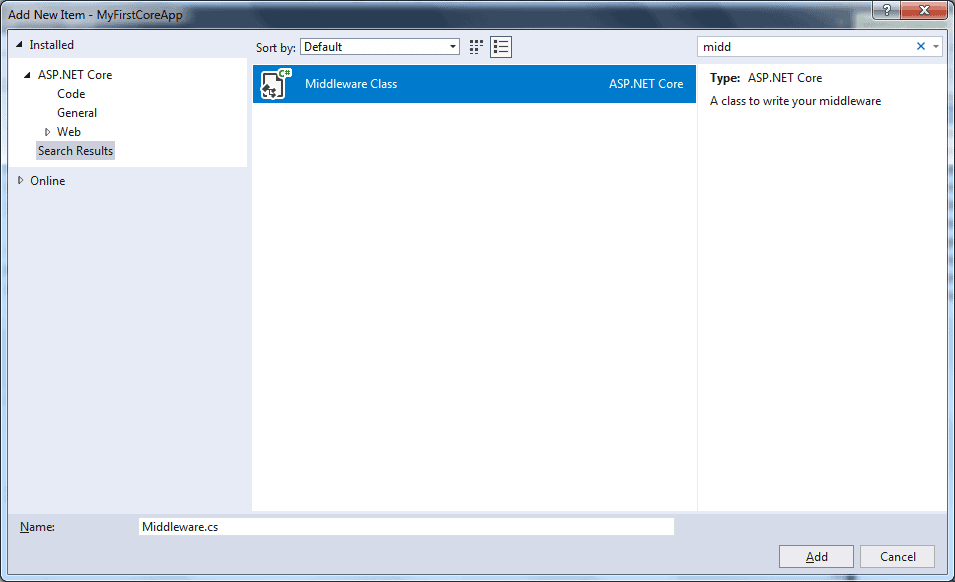

# QUESTION 169


## DRAG DROP

You are developing a .NET Core library that will be used by multiple applications. The library contains ASP.NET Core middleware named EnsureSecurityMiddleware.

EnsureSecurityMiddleware must always run prior to other middleware.

You need to configure the middleware.

How should you complete the code? 


## Explicación:

    - IApplicationBuilder Interface - Define una clase que proporciona los mecanismos para configurar la canalización de solicitudes de una aplicación.

Visualización gráfica de la organización de los middlewares:


Agregamos un middleware siguiendo los siguientes pasos:

El componente de middleware personalizado es como cualquier otra clase .NET con el método Invoke (). Sin embargo, para ejecutar el siguiente middleware en una secuencia, debe tener el parámetro de tipo RequestDelegate en el constructor.

Visual Studio incluye una plantilla para crear una clase de middleware estándar. Para esto, haga clic derecho en el proyecto o carpeta donde desea crear la clase de middleware y seleccione Agregar -> Nuevo elemento. Esto abrirá la ventana emergente Agregar nuevo elemento. Busque la palabra "middleware" en el cuadro de búsqueda superior derecho como se muestra a continuación.


Visualización gráfica de como agregar un middleware con visual studio:



Seleccione el elemento Middleware Class, asígnele un nombre y haga clic en el botón Agregar. Esto agregará una nueva clase para el middleware con el método de extensión como se muestra a continuación.

El código creado en nuestro middleware sería:


```cs
    // pueda que se necesite instalar the Microsoft.AspNetCore.Http.Abstractions package en el proyecto
    public class MyMiddleware
    {
        private readonly RequestDelegate _next;

        public MyMiddleware(RequestDelegate next)
        {
            _next = next;
        }

        public Task Invoke(HttpContext httpContext)
        {
            return _next(httpContext);
        }
    }


    // Método de Extension method usadoa para agregar el middleware a la canalización de la petición HTTP.
    public static class MyMiddlewareExtensions
    {
        public static IApplicationBuilder UseMyMiddleware(this IApplicationBuilder builder)
        {
            return builder.UseMiddleware<MyMiddleware>();
        }
    } 

```

Como puede ver arriba, el método Invoke() no es asincrónico. Por lo tanto, lo cámbiamos a asíncrono y escribimos su lógica personalizada antes de llamar a next();

```cs
    public class MyMiddleware
    {
        private readonly RequestDelegate _next;
        private readonly ILogger _logger;

        public MyMiddleware(RequestDelegate next, ILoggerFactory logFactory)
        {
            _next = next;

            _logger = logFactory.CreateLogger("MyMiddleware");
        }

        public async Task Invoke(HttpContext httpContext)
        {
            _logger.LogInformation("MyMiddleware en ejecución..");

            await _next(httpContext); // calling next middleware

        }
    }

    // Método de Extension method usadoa para agregar el middleware a la canalización de la petición HTTP.
    public static class MyMiddlewareExtensions
    {
        public static IApplicationBuilder UseMyMiddleware(this IApplicationBuilder builder)
        {
            return builder.UseMiddleware<MyMiddleware>();
        }
    } 
```

Ahora, debemos agregar nuestro middleware personalizado en la canalización de solicitudes mediante el método Extension como se muestra a continuación.

```cs
    public void Configure(IApplicationBuilder app, IHostingEnvironment env)
    {
        app.UseMyMiddleware();

        app.Run(async (context) =>
        {
            await context.Response.WriteAsync("Hello World!");
        });
    }
```

También podemos agregar middleware usando el método *app.UseMiddleware<MyMiddleware>()* de *IApplicationBuilder*.

Por lo tanto, podemos agregar middleware personalizado en la aplicación ASP.NET Core.

### Respuesta Correcta

#### *Caja 1: IStartupFilter*
#### *Caja 2: IApplicationBuilder*
#### *Caja 3: IApplicationBuilder*
ver: https://docs.microsoft.com/en-us/dotnet/api/microsoft.aspnetcore.hosting.istartupfilter.configure?view=aspnetcore-3.1


### References :

- https://docs.microsoft.com/es-es/aspnet/core/fundamentals/middleware/write?view=aspnetcore-5.0

- https://www.c-sharpcorner.com/article/create-a-custom-middleware-in-an-asp-net-core-application/

- https://docs.microsoft.com/es-es/aspnet/core/fundamentals/middleware/?view=aspnetcore-5.0

- https://www.tutorialsteacher.com/core/how-to-add-custom-middleware-aspnet-core

-https://www.variablenotfound.com/2015/12/custom-middlewares-en-aspnet-5.html


