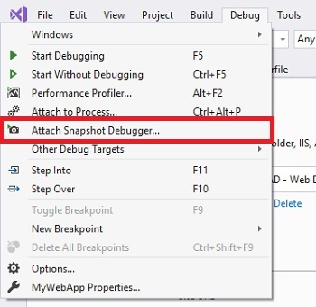
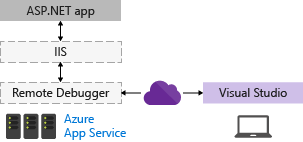
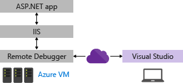

# QUESTION 163

You are developing an ASP.NET MVC application by using Microsoft Visual Studio Professional. You plan to deploy the app to a Microsoft Azure App Services Web App.

You must be able to edit files in the web application directly without having to redeploy or use other means of connecting to the web application.

You need to update the Web.config file to enable remote error messages.

What should you do?

    A. Download the publish settings file from Azure portal. Create an FTP connection to the Azure Web App and update the file.
    B. Use Visual Studio to remotely debug and update the file. 
    C. Create a Web.config transform and deploy a debug build.
    D. Use the Visual Studio Server Explorer remote view feature to update the file.


## Exsplicación:

Lo que buscamos es hacer una depuración remota.

Puede depurar una aplicación de Visual Studio usamos depuradores remoto de Visual Studio.

La configuración de una aplicación ASP.NET Core en Visual Studio, es la implementación en IIS con Azure y agregar el depurador remoto de Visual Studio.

El método recomendado para la depuración remota en Azure dependerá de su escenario:

    - Para depurar ASP.NET Core en Azure App Service, se puede hacer Depuración de aplicaciones de Azure con Snapshot Debugger. Éste es el método recomendado. Snapshot Debugger toma una instantánea de las aplicaciones en producción cuando se ejecuta el código que le interesa. Para indicar al depurador que tome una instantánea, establezca puntos de acoplamiento y puntos de registro en el código. El depurador le permite ver exactamente qué salió mal, sin afectar el tráfico de la aplicación de producción. El Depurador de instantáneas puede permitirle disminuir considerablemente el tiempo que tarda en resolver los problemas que se producen en los entornos de producción.

Representación visual de la Depuración remota de ASP.NET Core en Azure App con Snapshot Debugger


    

    - Para depurar ASP.NET Core en Azure App Service usando características de depuración más tradicionales. Desde Visual Studio puede publicar y depurar rápidamente la aplicación en una instancia totalmente aprovisionada de IIS. Sin embargo, la configuración de IIS está preestablecida y no se puede personalizar. 
    
Representación visual de la Depuración remota de ASP.NET Core en Azure App Service.


    
    
    - Si necesita personalizar IIS, se puede efectuar la depuración con una máquina virtual de Azure.

Representación visual de la Depuración remota de ASP.NET Core en Azure con una máquina virtual de Azure.



    - En este escenario debe implementar la aplicación desde Visual Studio en Azure, pero no es necesario instalar ni configurar manualmente IIS o el depurador remoto (estos componentes se representan con líneas de puntos), tal y como se muestra en la siguiente ilustración.

Un simple archivo de configuración se muestra a continuación:

```xml
    <!-- Web.Config Configuration File -->

    <configuration>
        <system.web>
            <customErrors mode="RemoteOnly" defaultRedirect="mycustompage.htm"/>
        </system.web>
    </configuration>
```

### Respuesta Correcta

#### *Opción B: Usar el Visual Studio remoto para actualizar y depurar el archivo config*


### References :

- https://docs.microsoft.com/es-es/visualstudio/debugger/remote-debugging-azure?view=vs-2019#remote_debug_azure_vm

- https://docs.microsoft.com/es-es/visualstudio/debugger/remote-debugging-azure?view=vs-2019#remote_debug_azure_app_service

- https://docs.microsoft.com/es-es/visualstudio/debugger/debug-live-azure-applications?view=vs-2019


