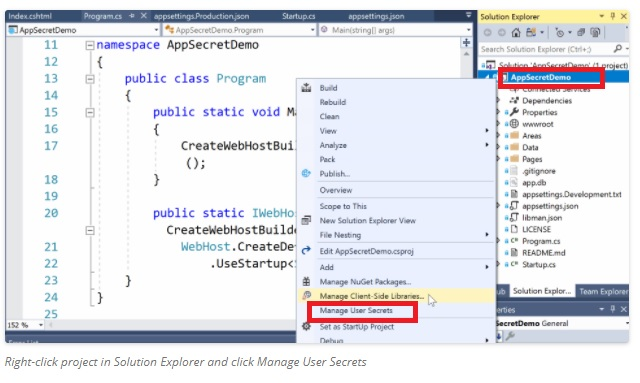
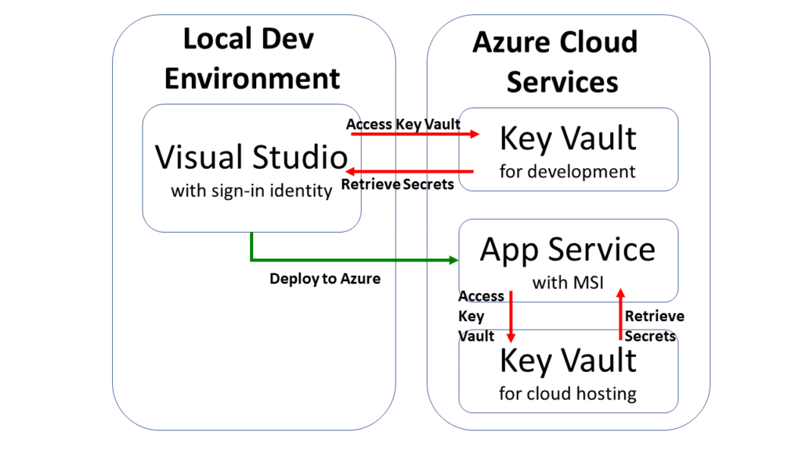
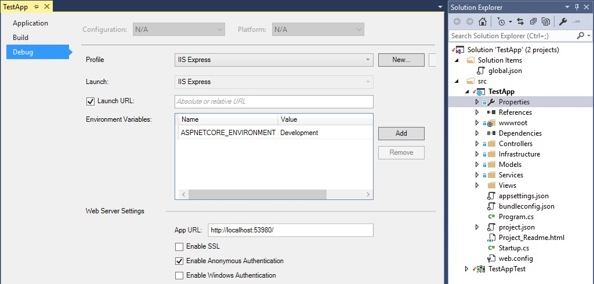

# QUESTION 171

You are developing an ASP.NET Core web application. The web application requires sensitive configuration data.

The web application will be tested in an Acceptance Test environment. 

The Acceptance Test environment must be identical to the production environment.

You need to protect the configuration data.

What should you use?

    A. Secret Manager tool
    B. Configuration API
    C. Microsoft Azure Key Vault configuration provider
    D. environment variables

## Explicación:

Las contraseñas y otros datos confidenciales nunca se almacenan en el código fuente del proyecto. Los secretos de producción no deben usarse para desarrollo o prueba/test.

- El Secret Manager tool - permite a los desarrolladores almacenar y recuperar datos confidenciales durante el desarrollo de una aplicación ASP.NET Core. Los datos confidenciales se almacenan en una ubicación separada del código fuente de la aplicación. Los datos confidenciales se almacenan en un archivo JSON como un par clave-valor.

Implementación del Secret Manager Tool:

- La Configuration API proporciona un lugar central para que los módulos almacenen datos de configuración. Estos datos pueden ser una configuración simple, como el nombre de su sitio, o información más compleja administrada con entidades de configuración, como vistas y tipos de contenido. ... La diferencia clave es que la API de configuración es el caso de uso de singleton

- Azure Key Vault es un servicio basado en la nube que ayuda a proteger las claves criptográficas y los secretos que usan las aplicaciones y los servicios. Entre los escenarios comunes para usar Azure Key Vault con ASP.NET Core aplicaciones se incluyen:
    - Controlar el acceso a los datos de configuración confidenciales.
    - Cumplir los requisitos de los módulos de seguridad de hardware (HSM) de FIPS 140-2 nivel 2 validados al almacenar los datos de configuración.

    Visualización gráfica del Azure Key Vault:

- Las variables de entorno se utilizan para evitar el almacenamiento de secretos de aplicaciones en código o en archivos de configuración local. Las variables de entorno anulan los valores de configuración para todas las fuentes de configuración especificadas anteriormente.

Considere una aplicación web ASP.NET Core en la que la seguridad de las cuentas de usuario individuales está habilitada. Se incluye una cadena de conexión de base de datos predeterminada en el archivo appsettings.json del proyecto con la clave DefaultConnection. La cadena de conexión predeterminada es para LocalDB, que se ejecuta en modo de usuario y no requiere contraseña. Durante la implementación de la aplicación, el valor de la clave DefaultConnection se puede anular con el valor de una variable de entorno. La variable de entorno puede almacenar la cadena de conexión completa con credenciales sensibles.

Implementación de la variables de entorno en una ASP.NET Core web application:

### Respuesta Correcta

#### **D**

### References :

- https://docs.microsoft.com/es-es/aspnet/core/fundamentals/configuration/?view=aspnetcore-5.0#evcp

- https://docs.microsoft.com/en-us/aspnet/core/security/app-secrets?view=aspnetcore-2.2&tabs=windows

-

