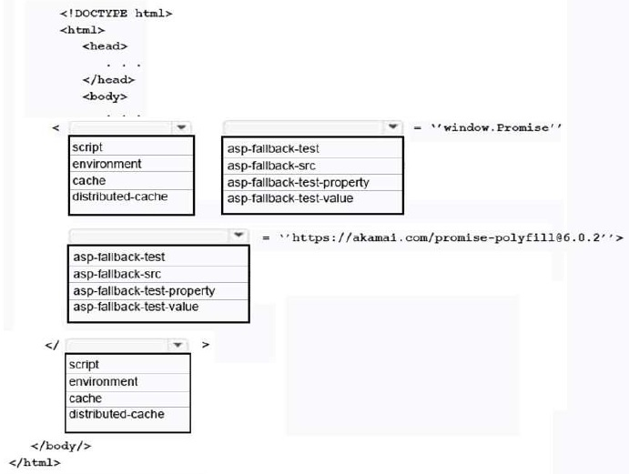
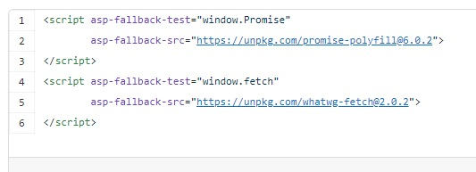

# QUESTION 172

## HOTSPOT

You are developing an ASP.NET Core MVC web application.

The web application must support older web browsers and implemented JavaSript features. You must use a
polyfill to support the JavaScript Promise object in all browsers.

You need to implement a built-in ASP.NET Core tag Helper to support polyfills.

How should you complete the markup? To answer, select the appropriate options in the answer area.

## Explicación:

El caso de uso principal para los fallbacks en Script Tag Helper es verificar si un CDN está inactivo y cargar un script local en su lugar. Otro caso de uso es que puede usar alternativas para facilitar el relleno múltiple de las funciones de JavaScript que faltan en los navegadores más antiguos, sin que sus usuarios que utilizan los últimos navegadores se vean afectados por la red.

Ejemplo de la implementación del 'fallback' de la web dada en la referencia:

### Respuesta Correcta

#### *Caja 1:* *<script*
#### *Caja 2:* asp-fallback-test
#### *Caja 3:* asp-fallback-src
#### *Caja 4:* &lt;/script&gt;

---

### References :

- https://scottsauber.com/2017/01/30/using-the-asp-net-core-script-taghelper-to-polyfill-the-latest-javascript-features/

-

-
