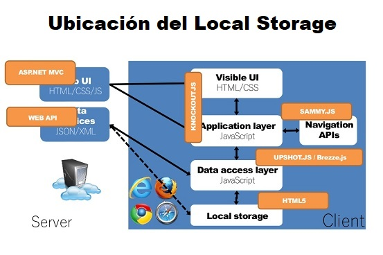

# QUESTION 173

You develop a new ASP.NET MVC application. You use local storage to maintain state.

The localStorage object’s setItem method is failing to store a value.

Which two scenarios will cause the failure? Each correct answer presents a complete solution.

NOTE: Each correct selection is worth one point.

    A. The user has disabled local storage in the browser.
    B. The value being stored is a JavaScript array.
    C. The newValue property was used prior to calling the setItem method.
    D. The value being stored exceeds 10MB in size.


## Explicación:

Un almacenamiento local es un archivo creado por un sitio web en su dispositivo. Las cookies son solo un tipo de almacenamiento local, pero hay otros. Es importante que los conozca para poder bloquearlos o eliminar los datos almacenados por ellos:

    - Almacenamiento local del navegador. Algunos sitios web utilizan "sessionStorage" y "localStorage" del navegador para almacenar datos; "sessionStorage" se almacena temporalmente, pero el "localStorage" es persistente. Puede borrarlos eliminando el historial de su navegador.
    - Almacenamiento local Flash ("Objetos compartidos locales Flash"). Flash es un complemento de navegador que se utiliza para agregar contenido interactivo y multimedia en sitios web. Flash puede almacenar datos en su dispositivo.
    - Almacenamiento local de Silverlight ("Objetos aislados"). Silverlight es un complemento de navegador que se utiliza para agregar contenido interactivo y multimedia en sitios web. Silverlight puede almacenar datos en su dispositivo.
    - Una baliza web es un método de seguimiento que consiste en una imagen incrustada en un sitio web. Cuando su navegador se conecta al servidor donde se encuentra la imagen para descargarla, se rastrea su acceso. En ocasiones, las balizas web son imágenes muy pequeñas o transparentes, por lo que el usuario no las conoce.

Para habilitar o inhabilitar el almacenamieto local de un web dependiendo en tipo del navegador que se tenga.

Representación gráfica de la ubicación del local storage:



Cómo almacenar valores en localStorage: setItem():

Tal como su nombre lo indica, este método le permite almacenar valores en el objeto localStorage. Toma dos parámetros: una clave y un valor. Se puede hacer referencia a la clave más adelante para obtener el valor que se le atribuye.

Entonces, para almacenar un objeto javascript completo, primero debemos serializarlo (con JSON.stringify, por ejemplo):

```cs
    // almacenamos un objeto pero primero lo serializamos
    localStorage.setItem('user', JSON.stringify(user));
    // Lo retomamos y lo convertimos nuevamente en un objeto
    var user = JSON.parse(localStorage.getItem('user'));
    // Si lo queremos borrar todas las entradas en el almacen hacemos
    localStorage.clear();
```

La Opción A no es correcta ya que un usuario puede disabilitar el local storage de su navegador por lo tanto esto no dispara ningún error.
La Opción B es correcta ya que por lo visto en el código anterior los datos son almacenado en la forma clave-valor y no como Script array.
La Opción C es correcta ya que hablamos del método setItem y este toma parametros del tipo 'clave-valor' y no como es dado con una propiedad.
La Opción D no es correcta ya que la capacidad no tiene nada que ver con el objeto setItem del local Storage.


### Respuesta Correcta

#### **Opción B y C**


### References :

- https://www.bfischool.org/cookies-and-local-storage-policy

- https://coderwall.com/p/ewxn9g/storing-and-retrieving-objects-with-localstorage-html5


