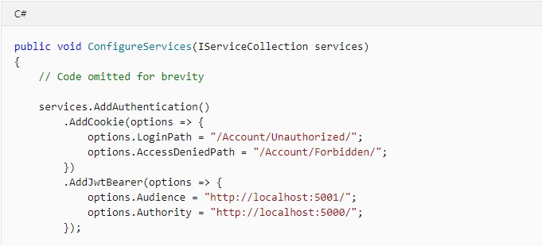

# QUESTION 163

## DRAG DROP

You are developing an ASP.NET Core MVC web application for AdventureWorks Cycles.

You need to ensure that users can authenticate with Contoso Ltd., an OpenID Connect authentication provider.

How should you complete the code? To answer, drag the appropriate code segments to the correct locations.

Each code segment may be used once, more than once, or not at all.

## Explicación:

En algunos escenarios, como las aplicaciones de una sola página (Spa), es habitual usar varios métodos de autenticación. Por ejemplo, la aplicación puede usar la cookie autenticación basada en para iniciar sesión y la autenticación de portador de JWT para solicitudes de JavaScript. 

En algunos casos, la aplicación puede tener varias instancias de un controlador de autenticación. Por ejemplo, dos cookie Controladores donde uno contiene una identidad básica y uno se crea cuando se desencadena una autenticación multifactor (MFA). MFA se puede desencadenar porque el usuario solicitó una operación que requiere seguridad adicional. 

Un esquema de autenticación se denomina cuando el servicio de autenticación se configura durante la autenticación. Por ejemplo:

### Respuesta Correcta

#### *Caja no. 1:* 'AddJwtBearer' 
#### *Caja no. 2:* 'Authority'
#### *Caja no. 3:* 'Audience'

### References :

- https://docs.microsoft.com/es-es/aspnet/core/security/authorization/limitingidentitybyscheme?view=aspnetcore-5.0

-

-
