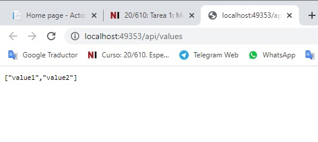
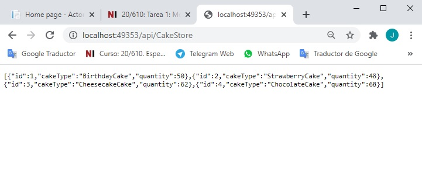
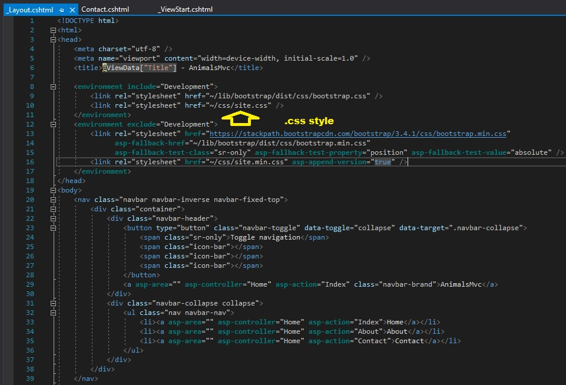

# Módulo 1: Explorando el núcleo MVC de ASP.NET

Fichero de Instrucciones: Instructions\20486D_MOD01_LAK.md

Entregar el url de GitHub con la solución y un readme con las siguiente información:

1. **Nombres y apellidos:** José René Fuentes Cortez
2. **Fecha:** 24 de Noviembre 2020.
3. **Resumen del LAK 1:** Este módulo consta de tres ejercicios:
    - En el primer ejercio nos ayuda a entender como usar la metodología de las páginas Razor en una aplicación en Visual Studio.
    - En el ejercicio 2 la práctica nos ayuda a construir una aplicación API Web en Visual Studio.
    - En el tercer ejercicio aprendemos a construir una simple aplicación MVC en Visual Studio.


4. **Dificultad o problemas presentados y como se resolvieron:** En el ejercicio 1, la interfase a usarse no tiene el nombre de acceso 'public' y da el error CS0051 por lo que al inicio es un poco desconcertante. En el ejercicio 2 se pide que se evalue un Controller el cual no existe en el proyecto.

**NOTA**: Si no hay descripcion de problemas o dificultades, y al yo descargar el código para realizar la comprobacion y el código no funcionar, el resultado de la califaciación del laboratorio será afectado.

---

# Ejericicio 1: Explorando a ASP.NET Core MVC 

### Configuración del Lab

Estimated Time: **90 minutes**

### Pasos de preparación 

1. Ensure that you have cloned the **20486D** directory from GitHub. It contains the code segments for the labs and demos in this course. (**https://github.com/MicrosoftLearning/20486D-DevelopingASPNETMVCWebApplications/tree/master/Allfiles**)

### Exercise 1: Explorando una Aplicación con páginas Razor

#### Task 1: Creando una Aplicación con páginas Razor


1. Inicie Visual Studio 2019.

2. En la ventana **Página de inicio - Microsoft Visual Studio**, en el menú **Archivo**, apunta a **Nuevo**, y luego haz clic en **Proyecto**.

3. En el cuadro de diálogo **Nuevo Proyecto**, en el panel de navegación, expanda **Instalado**, y luego haga clic en **Visual C#**.

4. En el cuadro de diálogo **Nuevo Proyecto**, en el panel de resultados, haga clic en **Aplicación Web Principal de ASP.NET**.

5. En el cuadro **Nombre**, escriba **ActoresRazorPages**.

6. Reemplaza el contenido del cuadro **Localización** por **[Repository Root]\Allfiles\Mod01\Labfiles\01_ActorsRazorPages_begin**, y luego haz clic en **OK**.

7. En el panel de resultados de la caja de diálogo **Nueva Aplicación Web ASP.NET Core - ActorsRazorPages**, selecciona **ASP.NET Core 2.1** del menú desplegable en la parte superior de la caja de diálogo.

7. En el panel de resultados del cuadro de diálogo **Nueva Aplicación Web Principal ASP.NET - Páginas Razorras de Actores**, asegúrese de que la casilla de verificación **Configurar para HTTPS** no esté seleccionada.

8. En el cuadro de diálogo **Nueva Aplicación Web Principal ASP.NET - ActoresPáginasAzotadoras**, en el panel de resultados, haga clic en **Aplicación Web**, y luego en **OK**.

9. En la ventana **ActorsRazorPages - Microsoft Visual Studio**, en el menú **DEBUG**, haga clic en **Iniciar sin depuración**.

10. En Microsoft Edge, en la barra de direcciones, anota el número de puerto que aparece al final del URL **http://localhost:[port]**. Usarás el número de puerto durante este laboratorio.

- La representación visual a la respuesta del último ejercicio se muestra en la siguiente imagen:

 

11. En Microsoft Edge, en la barra de navegación, haz clic en **Contact** para revisar su contenido.

12. En Microsoft Edge, haz clic en **Cerrar**.
 
#### Tarea 2: Explorar la estructura de la aplicación

1. En la ventana **ActorsRazorPages - Microsoft Visual Studio**, en **Solution Explorer**, expandir **Pages**, y luego hacer clic en **_ViewStart.cshtml**.

2. En la ventana de código **_ViewStart.cshtml**, observe que el value de **Layout** es **"_Layout "**.

    >**Nota**: Esto indica que todos los archivos dentro de la carpeta **Pages** usan el mismo archivo de diseño, **~/Pages/_Layout.cshtml**.

- La representación visual a la respuesta del último ejercicio se muestra en la siguiente imagen:

 

3. En la ventana **ActorsRazorPages - Microsoft Visual Studio**, en **Solution Explorer**, en **Pages**, haga clic en **Contact.cshtml**.

4. En la ventana de **Contact.cshtml** código, examinar el código Razor, y verificar que no hay enlaces a los archivos .css.

- La representación visual a la respuesta del último ejercicio se muestra en la siguiente imagen:

 


5. En la ventana **ActorsRazorPages - Microsoft Visual Studio**, en **Solution Explorer**, expanda **Pages**, expanda **Shared**, y luego haga clic en **_Layout.cshtml**.

6. En la ventana de código **_Layout.cshtml**, en el elemento **HEAD**, observe que hay un enlace a **~/css/site.css**.


- La representación visual a la respuesta del último ejercicio se muestra en la siguiente imagen:

 

7. En la ventana **ActorsRazorPages - Microsoft Visual Studio**, en **Solution Explorer**, en **ActorsRazorPages**, expandir **wwwwroot**, expandir **css**, y luego hacer clic en **site.css**

    >**Nota**: Este es el archivo de hoja de estilo CSS que se aplica en el **_Layout.cshtml**.

- La representación visual a la respuesta del último ejercicio se muestra en la siguiente imagen:

 

#### Tarea 3: Añadir una simple funcionalidad

1. En la ventana **ActorsRazorPages - Microsoft Visual Studio**, en **Solution Explorer**, haga clic con el botón derecho del ratón en **Pages**, apunte a **Add**, y luego haga clic en **New Item**.

2. En el cuadro de diálogo **Agregar nuevo elemento - ActorsRazorPages**, haga clic en **Página Razor**.

3. En la caja de diálogo **Agregar nuevo ítem - ActorsRazorPages**, en la caja **Nombre**, escriba **Test Page**, y luego haga clic en **Agregar**. 

4. En la ventana **ActorsRazorPages - Microsoft Visual Studio**, en la ventana de código **TestPage.cshtml**, reemplace el contenido debajo de **@línea de modelo** con el siguiente código:
  ```cs
       @{
        ViewData["Title"] = "Test Page";
       }

       <h1>@ViewData["Title"]</h1>
       <h2>This is a Test Page</h2>
  ```

5. En la ventana **ActorsRazorPages - Microsoft Visual Studio**, en **Explorador de Soluciones**, expandir **Páginas**, expandir **Shared** y luego hacer clic en **_Layout.cshtml**.

6. En la ventana de código **_Layout.cshtml**, localice el siguiente código:
  ```cs
       <li><a asp-page="/Contact">Contact</a></li>
  ```

7. Coloca el cursor después del código localizado, presiona Enter, y luego escribe el siguiente código:
  ```cs
       <li><a asp-page="/TestPage">Test Page</a></li>
  ```

8. En la ventana **ActorsRazorPages - Microsoft Visual Studio**, en **Solution Explorer**, haga clic con el botón derecho en **ActorsRazorPages**, apunte a **Add**, y luego haga clic en **New Folder**.

9. En el cuadro **Nueva Carpeta**, escriba **Modelos**, y luego presione Enter.

10. En la ventana **ActorsRazorPages - Microsoft Visual Studio**, en **Solution Explorer**, haz clic con el botón derecho del ratón en **Models**, apunta a **Add**, y luego haz clic en **Class**.

11. En el cuadro de diálogo **Agregar nuevo elemento - ActorsRazorPages**, en el cuadro **Nombre**, escriba **Actor**, y luego haga clic en **Agregar**.
    
12. En el bloque de código **Actor.cs**, coloque el cursor después del segundo signo **{** (llaves de apertura), presione Enter, y luego escriba el siguiente código:
  ```cs
       public int Id { get; set; }
       public string FirstName { get; set; }
       public string LastName { get; set; }
       public string KnownFor { get; set; }
       public bool OscarWinner { get; set; }
       public string ImageName { get; set; }
  ```
13. En la ventana de **ActorsRazorPages - Microsoft Visual Studio**, en **Solution Explorer**, haga clic con el botón derecho del ratón en **Models**, apunte a **Add**, y luego haga clic:

  ```cs
       List<Actor> ActorsList { get; set; }
       List<Actor> ActorsInitializeData();
       Actor GetActorById(int? id);
  ```

18. En la ventana **ActorsRazorPages - Microsoft Visual Studio**, en **Solution Explorer**, haga clic con el botón derecho del ratón en **Models**, apunte a **Add**, y luego seleccione **Existing Item**.

19. En el cuadro de diálogo navegar a **[Repository Root]\Allfiles\Mod01\Labfiles\01_ActorsRazorPages_begin**, apunta a **Data.cs**, y luego selecciona **Agregar**.

    >**Nota**: Examinar el contenido de la clase **Data.cs**.

20. En la ventana **ActorsRazorPages - Microsoft Visual Studio**, en **Solution Explorer**, bajo **wwwwroot**, haga clic con el botón derecho del ratón en **imágenes**, apunte a **Agregar**, y luego haga clic en **Agregar elemento existente**.

21. En el cuadro de diálogo, navega a **[Repository Root]\Allfiles\Mod01\Labfiles\01_ActorsRazorPages_begin\Images**, selecciona todas las imágenes, y luego haz clic en **Agregar**.

22. En la ventana de **ActorsRazorPages - Microsoft Visual Studio**, en **Solution Explorer**, haz clic con el botón derecho del ratón en **Pages**, apunta a **Add**, y luego selecciona **Nueva carpeta**.

23. En el cuadro **NewFolder**, escriba **Actors**, y luego presione Enter.

24. En la ventana **ActorsRazorPages - Microsoft Visual Studio**, en **Solution Explorer**, en **Pages**, haga clic con el botón derecho del ratón en **Actors**, señale a **Add**, y luego haga clic en **New Item**. 

25. En el cuadro de diálogo **Agregar nuevo elemento - ActorsRazorPages**, haga clic en **Web**, y luego, en el panel de resultados, haga clic en **Páginas Razor**.

26. En la caja de diálogo **Agregar nuevo ítem - ActorsRazorPages**, en la caja **Nombre**, escriba **Índice**, y luego haga clic en **Agregar**.

27. En la ventana **ActorsRazorPages - Microsoft Visual Studio**, en **Solution Explorer**, expanda **Index.cshtml**, haga clic en **Index.cshtml.cs**, seleccione el siguiente código y luego presione Suprimir.
  ```cs
       public void OnGet()
       {
       }
  ```

28. En la ventana del código **Index.cshtml.cs**, coloque el cursor al final del código del espacio de nombres **using Microsoft.AspNetCore.Mvc.RazorPages**, presione Enter, y luego escriba el siguiente código:
  ```cs
       using ActorsRazorPages.Models;
  ```

29. En el bloque de código **Index.cshtml.cs**, coloque el cursor después del segundo signo **{** (llaves), pulse Intro, y luego escriba el siguiente código:
  ```cs
       private IData _data;

       public IndexModel(IData data)
       {
           _data = data;
       }

       public IList<Actor> Actors { get; set; }

       public void OnGet()
       {
          Actors = _data.ActorsInitializeData();
       }
  ```

30. En la ventana **ActorsRazorPages - Microsoft Visual Studio**, en **Solution Explorer**, en **Pages**, en **Actors**, haga clic en **Index.cshtml**.

31. En la ventana **ActorsRazorPages - Microsoft Visual Studio**, en la ventana de código **Index.cshtml**, reemplace el contenido debajo de **@línea de modelo** con el siguiente código:
  ```cs
       @{
           ViewData["Title"] = "Index";
       }

       <h2>Index</h2>

       <table class="table">
            <thead>
                <tr>
                    <th>
                        @Html.DisplayNameFor(model => model.Actors[0].FirstName)
                    </th>
                    <th>
                        @Html.DisplayNameFor(model => model.Actors[0].LastName)
                    </th>
                    <th></th>
                </tr>
            </thead>
            <tbody>
                @foreach (var item in Model.Actors)
                {
                <tr>
                    <td>
                        @Html.DisplayFor(modelItem => item.FirstName)
                    </td>
                    <td>
                        @Html.DisplayFor(modelItem => item.LastName)
                    </td>
                    <td>
                        <a asp-page="./Details" asp-route-id="@item.Id">Details</a>
                    </td>
                </tr>
                }
            </tbody>
       </table>
  ```

32. En la ventana **ActorsRazorPages - Microsoft Visual Studio**, en **Solution Explorer**, en **Pages**, haga clic con el botón derecho en **Actors**, apunte a **Add**, y luego haga clic en **Existing Item**.

33. En el cuadro de diálogo, navega a **[Repository Root]\Allfiles\Mod01\Labfiles\01_ActorsRazorPages_begin\Pages**, selecciona **Details.cshtml.cs** y **Details.cshtml**, y luego haz clic en **Agregar**. 

    >**Nota**: Examine el contenido de los archivos **Details.cshtml.cs** y **Details.cshtml**.

34. En la ventana **ActorsRazorPages - Microsoft Visual Studio**, en **Solution Explorer**, haga clic en **Startup.cs**.

35. Asegúrate de que el cursor está al final del código del espacio de nombres **using Microsoft.Extensions.DependencyInjection**, presiona Enter, y luego escribe el siguiente código:
  ```cs
       using ActorsRazorPages.Models;
  ```

36. Ponga el cursor después del signo **{** (abra las abrazaderas) del método **ConfigureServices**, presione Enter y luego escriba el siguiente código:
  ```cs
      services.AddSingleton<IData, Data>();
  ``` 

37. En la ventana **ActorsRazorPages - Microsoft Visual Studio**, en **Solution Explorer**, expandir **Pages**, expandir **Shared**, y luego hacer doble clic en **_Layout.cshtml**.

38. En la ventana de código **_Layout.cshtml**, localiza el siguiente código:
  ```cs
       <li><a asp-page="/TestPage">Test Page</a></li>
  ```


39. Ponga el cursor después del código localizado, presione Enter, y luego escriba el siguiente código:
  ```cs
       <li><a asp-page="/Actors/Index">Actors</a></li>
  ```

#### Tarea 4: Ejecutar la aplicación

1. En la ventana **ActorsRazorPages - Microsoft Visual Studio**, en el menú **FILE**, haga clic en **Save All**.

2. En la ventana **ActorsRazorPages - Microsoft Visual Studio**, en el menú **DEBUG**, haga clic en **Iniciar sin depuración**.

3. En Microsoft Edge, en la barra de navegación, haga clic en **Test Page** para ver su contenido.

    >**Nota**: La ventana del navegador muestra el título **Test Page** y el texto **&quot;Esta es una Test Page&quot;**. 

- La representación visual a la respuesta del último ejercicio se muestra en la siguiente imagen:

 

4. En la ventana de **Test Page**, en la barra de navegación, haga clic en **Actores** para ver su contenido.

    >**Nota**: La ventana del navegador muestra la página **Index.cshtml** bajo la carpeta **Actores**.

- La representación visual a la respuesta del último ejercicio se muestra en la siguiente imagen:

 

5. En la ventana **Actores**, seleccione un actor, y luego haga clic en **Details** para ir a la página **Details**.

- La representación visual a la respuesta del último ejercicio se muestra en la siguiente imagen:

 

    >**Nota**: La ventana del navegador muestra la página **Details.cshtml** bajo la carpeta **Actores**.
 
6. Verifique que el diseño y los estilos estándar del sitio se han aplicado a todas las páginas.

- La representación visual a la respuesta del último ejercicio se muestra en la siguiente imagen:

 

7. En Microsoft Edge, haga clic en **Cerrar**.

8. En la ventana **ActorsRazorPages - Microsoft Visual Studio**, en el menú **FILE**, haz clic en **Salir**.

>**Resultados**: Al final de este ejercicio, serás capaz de construir una simple aplicación de Razor Pages en Visual Studio.

### Ejercicio 2: Exploración de una aplicación Web API

#### Tarea 1: Crear una aplicación Web API

1. Inicie Visual Studio 2019.

2. En la ventana **Página de inicio - Microsoft Visual Studio**, en el menú **Archivo**, apunta a **Nuevo**, y luego haz clic en **Proyecto**.

3. En el cuadro de diálogo **Nuevo Proyecto**, en el panel de navegación, expanda **Instalado**, y luego haga clic en **Visual C#**.

4. En el cuadro de diálogo **Nuevo Proyecto**, en el panel de resultados, haga clic en **Aplicación Web Principal de ASP.NET**.

5. En el cuadro **Nombre**, escriba **CakeStoreApi**.

6. En la casilla **Localización**, reemplace su contenido con **[Repository Root]\Allfiles\Mod01\Labfiles\02_CakeStoreApi_begin**, y luego haga clic en **OK**.

7. En el panel de resultados del cuadro de diálogo **Nueva Aplicación Web Principal ASP.NET - CakeStoreApi**, asegúrate de que la casilla de verificación **Configurar para HTTPS** no esté seleccionada.

8. En el cuadro de diálogo **Nueva Aplicación Web Principal ASP.NET - CakeStoreApi**, en el panel de resultados, haga clic en **API**, y luego en **OK**.
 
#### Tarea 2: Explorar la estructura de la aplicación

1. En la ventana **CakeStoreApi - Microsoft Visual Studio**, en **Solution Explorer**, expandir **Controllers**, y luego hacer clic en **valueesController.cs**.

    >**Nota**: El método **Get()** devuelve **value1** y **value2**.

2. En la ventana **CakeStoreApi - Microsoft Visual Studio**, en el menú **DEBUG**, haga clic en **Iniciar sin depuración**. 

    >**Nota**: El navegador muestra **"["value1","value2"]"**.
- La representación visual a la respuesta del último ejercicio se muestra en la siguiente imagen:

 


3. En Microsoft Edge, haga clic en **Cerrar**.

#### Tarea 3: Añadir una simple funcionalidad

1. En la ventana **CakeStoreApi - Microsoft Visual Studio**, en **Solution Explorer**, haga clic con el botón derecho **CakeStoreApi**, apunte a **Add**, y luego haga clic en **New Folder**.

2. En el cuadro **Nueva Carpeta**, escriba **Modelos**, y luego presione Enter.

3. En la ventana **CakeStoreApi - Microsoft Visual Studio**, en **Solution Explorer**, haz clic con el botón derecho del ratón en **Models**, apunta a **Add**, y luego haz clic en **Class**.

4. En el cuadro de diálogo **Agregar nuevo elemento - CakeStoreApi**, en el cuadro **Nombre**, escriba **CakeStore**, y luego haga clic en **Agregar**.
    
5. En el bloque de código **CakeStore.cs**, coloque el cursor después del segundo signo **{** (abra abrazaderas), presione Enter, y luego escriba el siguiente código:
  ```cs
       public int Id { get; set; }
       public string CakeType { get; set; }
       public int Quantity { get; set; }
  ```

- La representación visual a la respuesta del último ejercicio se muestra en la siguiente imagen:

 

6. En la ventana **CakeStoreApi - Microsoft Visual Studio**, en **Solution Explorer**, haga clic con el botón derecho del ratón en **Models**, apunte a **Add**, y luego haga clic en **New Item**.

7. En el cuadro de diálogo **Agregar nuevo ítem - CakeStoreApi**, haga clic en **Interfaz**.

8. En el cuadro de diálogo **Agregar nuevo elemento - CakeStoreApi**, en el cuadro **Nombre**, escriba **IDatos**, y luego haga clic en **Agregar**.

9. En el bloque de código **IData.cs**, coloca el cursor antes de la palabra **interfaz**, y luego escribe **público**.

10. En el bloque de código **IData.cs**, coloque el cursor después del segundo signo **{** (corchetes de apertura), pulse Intro, y luego escriba el siguiente código:
  ```cs
       List<CakeStore> CakesList { get; set; }
       List<CakeStore> CakesInitializeData();
       CakeStore GetCakeById(int? id);
  ```
- La representación visual a la respuesta del último ejercicio se muestra en la siguiente imagen:

 


11. En la ventana **CakeStoreApi - Microsoft Visual Studio**, en **Solution Explorer**, haga clic con el botón derecho del ratón en **Models**, apunte a **Add**, y seleccione **Existing Item**.

12. En el cuadro de diálogo, navega a **[Repository Root]\Allfiles\Mod01\Labfiles\02_CakeStoreApi_begin**, apunta a **Data.cs**, y luego haz clic en **Agregar**.

    >**Nota**: Examinar el contenido de **Data.cs**.

- La representación visual a la respuesta del último ejercicio se muestra en la siguiente imagen:

 

13. En la ventana **CakeStoreApi - Microsoft Visual Studio**, en **Solution Explorer**, haga clic con el botón derecho del ratón en **Controllers**, apunte a **Agregar**, y luego haga clic en **Controller**.

14. En la lista de **Plantilla**, haga clic en **API Controller - Empty**, y luego haga clic en **Agregar**.

15. En el cuadro de diálogo **Agregar Controller API vacío**, en el cuadro **Nombre del Controller**, escriba **CakeStoreApiController**, y luego haga clic en **Agregar**.

16. En el bloque de código **CakeStoreApiController.cs**, asegúrese de que el cursor esté al final del **utilizando el código del espacio de nombres de Microsoft.AspNetCore.Mvc**, presione Intro y luego escriba el siguiente código:
  ```cs
       using CakeStoreApi.Models;
  ```
17. En el bloque de código **CakeStoreApiController.cs**, coloque el cursor después del segundo signo **{** (abrazaderas), presione Enter, y luego escriba el siguiente código:

  ```cs
       private IData _data;

       public CakeStoreApiController(IData data)
       {
           _data = data;
       }
        
       [HttpGet("/api/CakeStore")]
       public ActionResult<List<CakeStore>> GetAll()
       {
           return _data.CakesInitializeData();
       }
        
       [HttpGet("/api/CakeStore/{id}", Name = "GetCake")]
       public ActionResult<CakeStore> GetById(int? id)
       {
          var item = _data.GetCakeById(id);
          if (item == null)
          {
              return NotFound();
          }
          return new ObjectResult(item);
       }
  ```

>**Nota**: El contenido dentro de los atributos **HttpGet** indica la URL que el usuario debe escribir para llegar a la acción correspondiente.

- La representación visual a la respuesta del último ejercicio se muestra en la siguiente imagen:

 

18. En la ventana **CakeStoreApi - Microsoft Visual Studio**, en **Solution Explorer**, haga clic en **Startup.cs**.

19. Asegúrese de que el cursor está al final del código del espacio de nombres **usando Microsoft.Extensions.Options**, presione Enter, y luego escriba el siguiente código:
  ```cs
      using CakeStoreApi.Models;
  ```

20. Ponga el cursor después del signo **{** (abra las abrazaderas) del método **ConfigurarServicios**, presione Enter, y luego escriba el siguiente código:
  ```cs
      services.AddSingleton<IData, Data>();
  ``` 

#### Tarea 4: Ejecutar la aplicación

1. En la ventana **CakeStoreApi - Microsoft Visual Studio**, en el menú **FILE**, haga clic en **Save All**.

2. En la ventana **CakeStoreApi - Microsoft Visual Studio**, en el menú **DEBUG**, haga clic en **Iniciar sin depuración**.

3. En Microsoft Edge, en la barra de direcciones, escribe **http://localhost:[port]/api/CakeStore**, y luego presiona Enter.

    >**Nota**: El navegador muestra una lista de pasteles en formato JSON.

- La representación visual a la respuesta del último ejercicio se muestra en la siguiente imagen:

 

4. En Microsoft Edge, en la barra de direcciones, escriba **http://localhost:[port]/api/CakeStore/1**, y luego presione Enter.

    >**Nota**: El navegador muestra el primer pastel en formato JSON.

- La representación visual a la respuesta del último ejercicio se muestra en la siguiente imagen:

 

5. En Microsoft Edge, pulsa **Cerrar**.

6. En la ventana **CakeStoreApi - Microsoft Visual Studio**, en el menú **FILE**, haga clic en **Salir**.

>**Resultados**: Al final de este ejercicio, podrás construir una simple aplicación Web API en Visual Studio.

### Ejercicio 3: Explorando una aplicación MVC

#### Tarea 1: Crear una aplicación MVC

1. Inicie Visual Studio 2019.

2. En la ventana **Página de inicio - Microsoft Visual Studio**, en el menú **Archivo**, apunta a **Nuevo**, y luego haz clic en **Proyecto**.

3. En el cuadro de diálogo **Nuevo Proyecto**, en el panel de navegación, expanda **Instalado**, y luego haga clic en **Visual C#**.

4. En el cuadro de diálogo **Nuevo Proyecto**, en el panel de resultados, haga clic en **Aplicación Web Principal de ASP.NET**.

5. En el cuadro **Nombre**, escriba **AnimalsMvc**.

6. En la casilla **Localización**, reemplace el contenido con **[Repository Root]\Allfiles\Mod01\Labfiles\03_AnimalsMvc_begin**, y luego haga clic en **OK**.

7. En el panel de resultados del cuadro de diálogo **Nueva Aplicación Web Principal ASP.NET - AnimalsMvc**, asegúrate de que la casilla de verificación **Configurar para HTTPS** no esté seleccionada.

7. En el cuadro de diálogo **Nueva Aplicación Web Principal ASP.NET**, en el panel de resultados, haga clic en **Aplicación Web (Modelo-Vista-Controller)**, y luego haga clic en **OK**.

8. En la ventana **AnimalsMvc - Microsoft Visual Studio**, en el menú **DEBUG**, haga clic en **Iniciar sin depuración**.

9. En Microsoft Edge, en la barra de navegación, haga clic en **Contact** para revisar su contenido.

- La representación visual a la respuesta del último ejercicio se muestra en la siguiente imagen:

 

10. En Microsoft Edge, haz clic en **Cerrar**.
 
#### Tarea 2: Explorar la estructura de la aplicación

1. En la ventana **AnimalsMvc - Microsoft Visual Studio**, en **Solution Explorer**, expandir **Views**, y luego hacer clic en **_ViewStart.cshtml**.

2. En la ventana de código **_ViewStart.cshtml**, anotar que el value de **Layout** es **"_Layout";**.

- La representación visual a la respuesta del último ejercicio se muestra en la siguiente imagen:

 

3. En la ventana **AnimalsMvc - Microsoft Visual Studio**, en **Solution Explorer**, en **Views**, expandir **Home**, y luego hacer clic en **Contact.cshtml**.

4. En la ventana de código **Contact.cshtml**, observe que no hay archivos con la extensión .css.

- La representación visual a la respuesta del último ejercicio se muestra en la siguiente imagen:

 


5. En la ventana **AnimalsMvc - Microsoft Visual Studio**, en **Solution Explorer**, en **Views**, colapse **Home**, expanda **Compartido**, y luego haga clic en **_Layout.cshtml.**

6. En la ventana de código **_Layout.cshtml**, observe que en el elemento **HEAD** hay un enlace a **~/css/site.css**.

- La representación visual a la respuesta del último ejercicio se muestra en la siguiente imagen:

 

7. En la ventana **AnimalsMvc - Microsoft Visual Studio**, en **Solution Explorer**, en **AnimalsMvc**, expandir **wwwwroot**, expandir **css**, y luego hacer clic en **site.css**.

    >**Nota**: Este es el archivo de hoja de estilo CSS que se aplicó en el **_Layout.cshtml**.

#### Tarea 3: Añadir funcionalidad simple

1. En la ventana **AnimalsMvc - Microsoft Visual Studio**, en **Solution Explorer**, expandir **Controllers**, hacer clic en **HomeController.cs**, y luego localizar el siguiente código:

  ```cs
       public IActionResult Error()
       {
           return View(new ErrorViewModel { RequestId = Activity.Current?.Id ?? HttpContext.TraceIdentifier });
       }
  ```

2. Ponga el cursor después del signo **}** (llaves de cierre) del código localizado, presione Enter, y luego escriba el siguiente código:
  ```cs
       public IActionResult TestPage()
       {
           return View();
       }
  ```

3. Haga clic con el botón derecho del ratón en el código que acaba de agregar y luego haga clic en **Agregar vista**.

4. En el cuadro de diálogo **Agregar Vista MVC**, asegúrate de que el value del cuadro **Nombre de la vista** es **Test Page**.  

- La representación visual a la respuesta del último ejercicio se muestra en la siguiente imagen:

 


5. En el cuadro de diálogo **Agregar vista MVC**, asegúrese de que la plantilla **Vacío (sin modelo)** esté seleccionada.

6. En el cuadro de diálogo **Agregar vista MVC**, asegúrese de que la casilla de verificación **Crear como una vista parcial** está desactivada y la casilla de verificación **Utilizar una página de diseño** está seleccionada y, a continuación, haga clic en **Agregar**.

7. En la ventana de código **TestPage.cshtml**, seleccione el siguiente código:
  ```cs
       <h2>TestPage</h2>
  ```

8. Reemplazar el código seleccionado por el siguiente código: 
  ```cs
      <h2>This is a Test Page</h2>
  ```

9. En la ventana **AnimalsMvc - Microsoft Visual Studio**, en **Solution Explorer**, en **Views**, expandir **Compartido**, y luego hacer clic en **_Layout.cshtml.**

10. En la ventana de código **_Layout.cshtml**, localice el siguiente código: 
  ```cs
       <li><a asp-area="" asp-controller="Home" asp-action="Contact">Contact</a></li>
  ```
11. Ponga el cursor después del código localizado, presione Enter, y luego escriba el siguiente código:
  ```cs
       <li><a asp-area="" asp-controller="Home" asp-action="TestPage">Test Page</a></li>
  ```
12. En la ventana **AnimalsMvc - Microsoft Visual Studio**, en **Solution Explorer**, haz clic con el botón derecho del ratón en **Models**, apunta a **Add**, y luego haz clic en **Class**.

13. En el cuadro de diálogo **Agregar nuevo elemento - AnimalsMvc**, en el cuadro **Nombre**, escriba **Animal**, y luego haga clic en **Agregar**.
    
14. En el bloque de código **Animal.cs**, coloque el cursor después del segundo signo **{** (abra las abrazaderas), pulse Intro, y luego escriba el siguiente código:
  ```cs
       public int Id { get; set; }
       public string Name { get; set; }
       public string ImageName { get; set; }
       public string UniqueInformation { get; set; }
       public string Category { get; set; }
  ```

15. En la ventana **AnimalsMvc - Microsoft Visual Studio**, en **Solution Explorer**, haga clic con el botón derecho del ratón en **Models**, apunte a **Add**, y luego haga clic en **New Item**. 

16. En el cuadro de diálogo **Agregar nuevo elemento - AnimalsMvc**, haz clic en **Interfaz**. 

17. En el cuadro de diálogo **Agregar nuevo elemento - AnimalsMvc**, en el cuadro **Nombre**, escriba **IDatos**, y luego haga clic en **Agregar**.

18. En el bloque de código de la interfaz **IDatos**, coloca el cursor antes de la palabra **interfaz**, y luego escribe **público**.

19. En el bloque de código de interfaz **IDatos**, coloque el cursor después del segundo signo **{** (llaves de apertura), pulse Intro y escriba el siguiente código:
  ```cs
       List<Animal> AnimalsList { get; set; }
       List<Animal> AnimalsInitializeData();
       Animal GetAnimalById(int? id);
  ```
20. En la ventana **AnimalsMvc - Microsoft Visual Studio**, en **Solution Explorer**, haga clic con el botón derecho del ratón en **Models**, apunte a **Add**, y luego haga clic en **Existing Item**.

21. En el cuadro de diálogo, navega a **[Repository Root]\Allfiles\Mod01\Labfiles\03_AnimalsMvc_begin**, apunta a **Data.cs**, y luego haz clic en **Agregar**.

    >**Nota**: Examinar el contenido de **Data.cs** .

22. En la ventana **AnimalsMvc - Microsoft Visual Studio**, en **Solution Explorer**, haga clic con el botón derecho en los **Modelos**, apunte a **Agregar**, y luego haga clic en **Clase**.

23. En el cuadro de diálogo **Agregar nuevo elemento - AnimalsMvc**, en el cuadro **Nombre**, escriba **IndexViewModel**, y luego haga clic en **Agregar**.

24. En el bloque de código **IndexViewModel.cs**, coloque el cursor después del segundo signo **{** (llaves de apertura), pulse Intro, y luego escriba el siguiente código:
  ```cs
       public List<Animal> Animals { get; set; }
  ```

25. En la ventana **AnimalsMvc - Microsoft Visual Studio**, en **Solution Explorer**, haga clic con el botón derecho **Controllers**, apunte a **Agregar**, y luego haga clic en **Controller**.

26. En el cuadro de diálogo **Agregar andamiaje**, haga clic en **Controller MVC - Vaciar**, y luego haga clic en **Agregar**.

27. En el cuadro de diálogo **Añadir Controller MVC vacío**, en el cuadro **Nombre del Controller**, escriba **Controller de animales** y, a continuación, haga clic en **Añadir**.

28. En la ventana de código **AnimalsController.cs**, asegúrese de que el cursor está al final del **utilizando el código de espacio de nombres de Microsoft.AspNetCore.Mvc**, pulse Intro y, a continuación, escriba el siguiente código:
  ```cs
       using AnimalsMvc.Models;
  ```
29. En la ventana del código **AnimalsController.cs**, seleccione el siguiente código, y luego presione Borrar.
  "cs
       public IActionResult Index()
       {
           return View();
       }
  ```

30. En el bloque de código **AnimalsController.cs**, coloque el cursor después del segundo signo **{** (abrazaderas), pulse Intro, y luego escriba el siguiente código:

  ```cs
       private IData _tempData;
       public AnimalsController(IData tempData)
       {
            _tempData = tempData;
       }

       public IActionResult Index()
       {
            List<Animal> animals = _tempData.AnimalsInitializeData();
            IndexViewModel indexViewModel = new IndexViewModel();
            indexViewModel.Animals = animals;
            return View(indexViewModel);
       }

       public IActionResult Details(int? id)
       {
            var model = _tempData.GetAnimalById(id);
            if (model == null)
            {
                return NotFound();
            }
            return View(model);
       }   
  ``` 

31. En la ventana **AnimalsMvc - Microsoft Visual Studio**, en **Solution Explorer**, expandir **wwwwroot**, hacer clic con el botón derecho en las **imágenes**, apuntar a **Add**, y luego hacer clic en **Existing Item**.

32. En el cuadro de diálogo, navega a **[Raíz del Repositorio]\Ntodos los archivos\Mod01\Labfiles\03_AnimalsMvc_begin\Imágenes**, selecciona todas las imágenes, y luego haz clic en **Agregar**.

33. En la ventana del código de **AnimalsController.cs**, localiza el siguiente código, haz clic con el botón derecho del ratón en el código, y luego haz clic en **Add View**.
  ```cs
       public IActionResult Index()
  ```
34. En el cuadro de diálogo **Añadir vista de MVC**, asegúrese de que el value en el cuadro **Nombre de la vista** es **Index**.

35. En el cuadro de diálogo **Agregar vista MVC**, asegúrese de que la plantilla **Vacío (sin modelo)** esté seleccionada.

36. En el cuadro de diálogo **Agregar vista MVC**, asegúrese de que la casilla de verificación **Crear como una vista parcial** está desactivada y la casilla de verificación **Utilizar una página de diseño** está seleccionada y, a continuación, haga clic en **Agregar**.

37. En el **Index.cshtml**, borre todo el contenido de la ventana y escriba el siguiente código:
  ```cs
       @model AnimalsMvc.Models.IndexViewModel
       @{
            ViewData["Title"] = "Index";
       }

       <h2>Index</h2>

       <table class="table">
            <thead>
                <tr>
                    <th>
                        @Html.DisplayNameFor(model => model.Animals[0].Name)
                    </th>
                    <th>
                        @Html.DisplayNameFor(model => model.Animals[0].Category)
                    </th>
                    <th></th>
                </tr>
            </thead>
            <tbody>
                @foreach (var item in Model.Animals)
                {
                    <tr>
                        <td>
                            @Html.DisplayFor(modelItem => item.Name)
                        </td>
                        <td>
                            @Html.DisplayFor(modelItem => item.Category)
                        </td>
                        <td>
                            <a asp-action="Details" asp-route-id="@item.Id">Details</a>
                        </td>
                    </tr>
                }
            </tbody>
       </table>
  ```

38. En la ventana **AnimalsMvc - Microsoft Visual Studio**, en el Explorador de soluciones, en **Controllers**, haga clic en **AnimalsController.cs**.

39. En la ventana de código **AnimalsController.cs**, localice el siguiente código, haga clic con el botón derecho del ratón en el código y luego haga clic en **Add View**.
  ```cs
       public IActionResult Details(int? id)
  ```
40. En el cuadro de diálogo **Añadir vista de MVC**, asegúrese de que el value en el cuadro **Nombre de la vista** es **Details**.  

41. 41. En el cuadro de diálogo **Agregar vista MVC**, asegúrese de que la plantilla **Vacío (sin modelo)** esté seleccionada.

42. En el cuadro de diálogo **Agregar vista MVC**, asegúrese de que la casilla de verificación **Crear como una vista parcial** está desactivada y la casilla de verificación **Utilizar una página de diseño** está seleccionada y, a continuación, haga clic en **Agregar**.

43.  En **Details.cshtml**, borre todo el contenido de la ventana y escriba el siguiente código:

  ```cs
       @model AnimalsMvc.Models.Animal
       @{
            ViewData["Title"] = "Details";
       }

       <h2>Details</h2>

       <div>
            <h4>Animal</h4>
            <hr />
            <dl class="dl-horizontal">
                <dt>
                    @Html.DisplayNameFor(model => model.Name)
                </dt>
                <dd>
                    @Html.DisplayFor(model => model.Name)
                </dd>
                <dt>
                    @Html.DisplayNameFor(model => model.Category)
                </dt>
                <dd>
                    @Html.DisplayFor(model => model.Category)
                </dd>
                <dt>
                    @Html.DisplayNameFor(model => model.UniqueInformation)
                </dt>
                <dd>
                    @Html.DisplayFor(model => model.UniqueInformation)
                </dd>
            </dl>

            <div style="padding:10px;">
                @if (Model.ImageName != "")
                {
                    
                }

            </div>
       </div>
       <div>
            <a asp-action="Index">Back to List</a>
       </div>
  ```


44. En la ventana **AnimalsMvc - Microsoft Visual Studio**, en **Solution Explorer**, en **Views**, en **Shared**, haga clic en **_Layout.cshtml.**


45. En la ventana **_Layout.cshtml** código, localice el siguiente código: 
  ```cs
       <li><a asp-area="" asp-controller="Home" asp-action="TestPage">Test Page</a></li>
  ```
46. Ponga el cursor después del código localizado, presione Enter y luego escriba el siguiente código:
  ```cs
       <li><a asp-area="" asp-controller="Animals" asp-action="Index">Animals</a></li>
  ```

47. En la ventana **AnimalsMvc - Microsoft Visual Studio**, en **Solution Explorer**, haga clic en **Startup.cs**.

48. Asegúrate de que el cursor está al final del código del espacio de nombres **usando Microsoft.Extensions.DependencyInjection**, presiona Enter, y luego escribe el siguiente código:
  ```cs
      using AnimalsMvc.Models;
  ```
   
49. Ponga el cursor después del signo **{** (abra las abrazaderas) del método **ConfigurarServicios**, presione Enter y luego escriba el siguiente código:
  ```cs
      services.AddSingleton<IData, Data>();
  ``` 

#### Tarea 4: Ejecutar la aplicación

1. En la ventana **AnimalsMvc - Microsoft Visual Studio**, en el menú **FILE**, haga clic en **Save All**.

2. En la ventana **AnimalsMvc - Microsoft Visual Studio**, en el menú **DEBUG**, haga clic en **Iniciar sin depuración**.

3. En Microsoft Edge, en la barra de navegación, haga clic en **Test Page** para revisar su contenido.

    >**Nota**: La ventana del navegador muestra el texto **&quot;Esta es una Test Page&quot;**.

- La representación visual a la respuesta del último ejercicio se muestra en la siguiente imagen:

 

4. En la ventana de **Test Page**, en la barra de navegación, haga clic en **Animales** para ver su contenido.

    >**Nota**: La ventana del navegador muestra la página **Index.cshtml**, bajo la carpeta **Animales**.

5. En la ventana **Animales**, seleccione un animal, y luego haga clic en **Details** para ir a la página **Details**.
 
    >**Nota**: La ventana del navegador muestra la página **Details.cshtml**, bajo la carpeta **Animales**.

- La representación visual a la respuesta del último ejercicio se muestra en la siguiente imagen:

 

6. Verifique que el diseño y los estilos estándar del sitio se han aplicado a todas las páginas.

- La representación visual a la respuesta del último ejercicio se muestra en la siguiente imagen:

 

- La representación visual a la respuesta del último ejercicio se muestra en la siguiente imagen:

 

11. En Microsoft Edge, haga clic en **Cerrar**.

12. En la ventana **AnimalsMvc - Microsoft Visual Studio**, en el menú **FILE**, haz clic en **Salir**.

>**Resultados**: Al final de este ejercicio, serás capaz de construir una simple aplicación MVC en Visual Studio.


