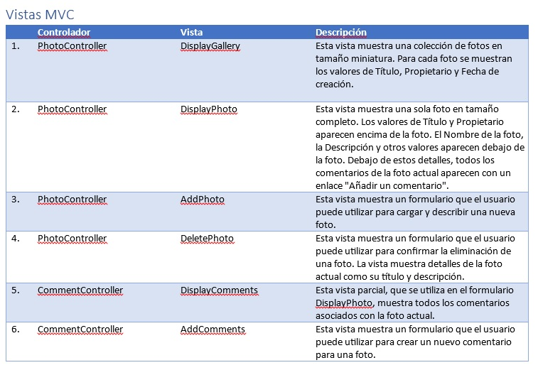
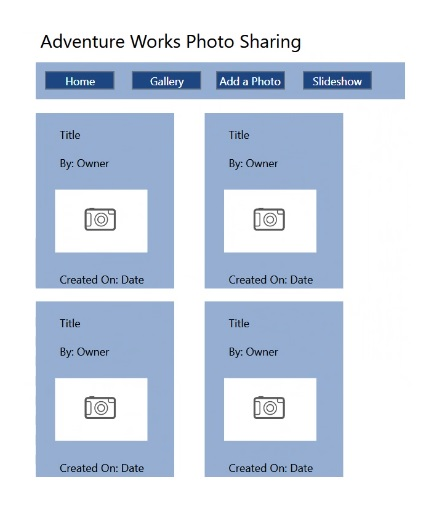

# Módulo 2: Diseño de aplicaciones web ASP.NET Core MVC

Dondequiera que la ruta de un archivo comience con *[Raíz del repositorio]*, reemplácela con la ruta absoluta de la carpeta en la que reside el repositorio 20486. Por ejemplo, si clonaste o extrajiste el repositorio 20486 a **C:\Usuarios\John Doe\Descargas\20486**, cambia la ruta: **[Repository Root]\AllFiles\20486D\Mod01** a **C:\Users\John Doe\Downloads\20486\AllFiles\20486D\Mod01**.

Fichero de Instrucciones: Instructions\20486D_MOD01_LAK.md

Entregar el url de GitHub con la solución y un readme con las siguiente información:

1. **Nombres y apellidos:** José René Fuentes Cortez
2. **Fecha:** 24 de Noviembre 2020.
3. **Resumen del LAK 1:** Este módulo consta de tres ejercicios:
    - En el primer ejercio nos ayuda a crear proposiciones para un modelo y configurar las propiedades y tipos de datos del modelo de clases.
    - En el ejercicio 2 la práctica nos ayuda a construir una aplicación API Web en Visual Studio.
    - En el tercer ejercicio aprendemos a construir una simple aplicación MVC en Visual Studio.


4. **Dificultad o problemas presentados y como se resolvieron:** En el ejercicio 1, la interfase a usarse no tiene el nombre de acceso 'public' y da el error CS0051 por lo que al inicio es un poco desconcertante. En el ejercicio 2 se pide que se evalue un Controller el cual no existe en el proyecto.

**NOTA**: Si no hay descripcion de problemas o dificultades, y al yo descargar el código para realizar la comprobacion y el código no funcionar, el resultado de la califaciación del laboratorio será afectado.

---

# Laboratorio: Diseñando aplicaciones web ASP.NET Core MVC

### Configuración del Lab

Tiempo estimado: **60 minutos**

### Pasos de Preparación

Asegúrate de que has clonado el directorio 20486D de GitHub. Contiene los segmentos de código para los laboratorios y demostraciones de este curso. (**https://github.com/MicrosoftLearning/20486D-DevelopingASPNETMVCWebApplications/tree/master/Allfiles**)

### Ejercicio 1: Planificación de clases modelo

#### Tarea 1: Examinar la investigación inicial


1. Ve a **[Repository Root]\Allfiles\Mod02\Labfiles\01_DesignProject_begin** y haz doble clic en **InvestigaciónInicial.docx**.

2. En la ventana **Investigación Inicial - Microsoft Word**, en la pestaña **Ver**, en la sección **Mostrar**, asegúrate de que la casilla de verificación **Panel de Navegación** esté seleccionada.

3. En el panel de **Navegación**, haga clic en **Introducción** y lea el contenido.

4. En el panel **Navegación**, haga clic en **Description general de la aplicación web para compartir fotografías** y lea el contenido.

5. En el panel **Navegación**, haga clic en **Utilizar casos** y lea el contenido.

6. En la ventana **Investigación Inicial - Microsoft Word**, revise **Figura 1: Resumen del uso del caso**.

7. En la ventana **Investigación inicial - Microsoft Word**, haga clic en **Cerrar**.


#### Tarea 2: Planificar la clase de modelo fotográfico

1. En la barra de tareas, haga clic en **Explorador de archivos**.

2. En la ventana **[Repository Root]\Allfiles\Mod02\Labfiles\01_DesignProject_begin**, haz doble clic en **DetailedPlanningDocument.docx**.

3. En la ventana **DetailedPlanningDocument - Microsoft Word**, localiza la sección **MVC Model**.

4. En la sección **MVC Model**, localice la **Tabla 1: MVC Model**.

5. En la **Tabla 1: Modelo MVC**, en la fila 1, en la columna **Clase de Modelo**, escriba **Photo**.

6. En la fila 1, en la columna **Description**, escriba **La clase de modelo de foto representa una foto que los usuarios autentificados pueden subir al sitio web.**

7. En la fila 1, en la columna **Propiedades**, escriba **Fotoidentificación**.

8. En la fila 1, en la columna **Tipos de datos**, escriba **Integer**.

9. En la fila 2, en la columna **Propiedades**, escriba **Title**.

- La representación visual a la respuesta del último ejercicio se muestra en la siguiente imagen:

 

10. En la fila 2, en la columna **Tipos de Datos**, escriba **string**.
- La representación visual a la respuesta del último ejercicio se muestra en la siguiente imagen:

 

11. En la fila 3, en la columna **Propiedades**, escriba **PhotoFile**.

12. En la fila 3, en la columna **Tipos de Datos**, escriba **byte**.
- La representación visual a la respuesta del último ejercicio se muestra en la siguiente imagen:

 

13. En la fila 4, en la columna **Propiedades**, escriba **Description**.

14. En la fila 4, en la columna **Tipos de Datos**, escriba **string**.

- La representación visual a la respuesta del último ejercicio se muestra en la siguiente imagen:

 

15. En la fila 5, en la columna **Propiedades**, escriba **CreatedDate**.

16. En la fila 5, en la columna **Tipos de Datos**, escriba **DateTime**.

- La representación visual a la respuesta del último ejercicio se muestra en la siguiente imagen:

 

17. En la fila 6, en la columna **Propiedades**, escriba **Owner**.

18. En la fila 6, en la columna **Tipos de Datos**, escriba **string**.
- La representación visual a la respuesta del último ejercicio se muestra en la siguiente imagen:

 

19. En **Tabla 1: Modelo MVC**, en la columna **Clase de modelo**, seleccionar las celdas 1 a 6, hacer clic con el botón derecho del ratón y luego seleccionar **Fusionar celdas**.

- La representación visual a la respuesta del último ejercicio se muestra en la siguiente imagen:

 

20. En **Tabla 1: Modelo MVC**, en la columna **Description**, seleccionar las celdas 1 a 6, hacer clic con el botón derecho del ratón, y luego seleccionar **Fusionar celdas**.

    >**Nota**: Mantener la ventana **Documento de Planificación Detallada - Microsoft Word** abierta para futuras tareas en este laboratorio.

21. Iniciar Microsoft Visual Studio 2019.

22.	En la ventana **Página de inicio - Microsoft Visual Studio**, en el menú **Archivo**, apunte a **Nuevo**, y luego haga clic en **Proyecto**.

23.	En el cuadro de diálogo **Nuevo Proyecto**, en el panel de navegación, expanda **Instalado**, y luego haga clic en **Visual C#**.

24.	En el cuadro de diálogo **Nuevo Proyecto**, en el panel de resultados, haga clic en **WPF App (.NET Framework)**.

25.	En el cuadro **Nombre**, escriba **DesignProject**.	

26. En la casilla **Localización**, asegúrese de que la ubicación especificada es **[Repository Root]\Allfiles\Mod02\Labfiles**, y luego haga clic en **OK**.

27. En la ventana **DesignProject - Microsoft Visual Studio**, en el Explorador de soluciones, haga clic con el botón derecho en **DesignProject**, apunte a **Agregar**, y luego seleccione **Nuevo elemento**.

28. En el cuadro de diálogo **Agregar nuevo elemento - DesignProject**, en el panel de navegación, expanda **Instalado**, expanda **Visual C#**, y luego haga clic en **General**.

29. En el cuadro de diálogo **Agregar nuevo elemento - DesignProyecto**, en la categoría **General**, haga clic en **Diagrama de clase**.

30. En el cuadro de diálogo **Add New Item - DesignProject**, en el cuadro **Name**, escriba **ModelDesign**, y luego haga clic en **Add**.
 
31. Si la ventana **Toolbox** no está abierta, haga clic en **Ver**, y luego haga clic en **Toolbox**.

32. En la ventana de **Toolbox**, expande **Class Designer**, y luego arrastra **Class** a la ventana del código.

33. En el cuadro de diálogo **Nueva Clase**, en la casilla **Nombre de la Clase**, escribe **Foto**, y luego haz clic en **OK**.

34. En el Explorador de soluciones, haz doble clic en **ModelDesign.cd**. 

35. Haga clic con el botón derecho del ratón en la clase **Foto**, seleccione **Agregar**, seleccione **Propiedad**, y póngale un nombre **FotoID**.

36. Haga clic con el botón derecho del ratón en la clase **Foto**, seleccione **Agregar**, seleccione **Propiedad**, y nómbrela **Title**.

37. Haga clic con el botón derecho del ratón en la propiedad **Title**, y luego seleccione **Detalles de la clase**.

    >**Nota**: Note que se abre una ventana de detalles de la clase. Note también que, por defecto, la propiedad **PhotoID** está establecida en **int**.

38. En la pestaña **Detalles de la Clase - Foto**, bajo el encabezado **propiedades**, verifique que la propiedad **Title** esté seleccionada.

39. Bajo la columna **Tipo**, localiza **int**, y cámbialo a **string**.

40. Haga clic con el botón derecho del ratón en la clase **Foto**, seleccione **Agregar**, seleccione **Propiedad**, y póngale un nombre **FotoArchivo**.

41. En el panel **Detalles de la clase - Foto**, bajo el encabezado **Propiedades**, localiza la propiedad **Archivo de fotos**, y luego en la columna **Tipo**, selecciona **Byte**.


42. Haz clic con el botón derecho del ratón en la clase de **Photo**, haz clic en **Agregar**, haz clic en **Propiedad**, y llámala **Description**.

43. En el panel de **Detalles de la clase - Foto**, haga doble clic en la propiedad **Description**, y luego en la columna **Tipo**, seleccione **string**.

44. Haga clic con el botón derecho del ratón en la clase **Foto**, seleccione **Agregar**, seleccione **Propiedad**, y nómbrela **CreatedDate**.

45. En el panel **Detalles de la clase - Foto**, localiza la propiedad **CreatedDate**, y luego en la columna **Tipo**, selecciona **DateTime**.

46. Haga clic con el botón derecho del ratón en la clase **Foto**, seleccione **Agregar**, seleccione **Propiedad**, y nómbrela **Owner**.

47. En el panel **Detalles de la clase - Foto**, localizar la propiedad **Owner**, y luego en la columna **Tipo**, seleccionar **string**.
    >**Nota**: Mantener la ventana **DesignProject - Microsoft Visual Studio** abierta para futuras tareas en este laboratorio.

48. En **Solution Explorer**, haga clic en **Photo.cs**.

49. En el bloque de código de propiedades **Title**, seleccione el siguiente código:
  ```cs
    get => default(int);
  ```

50. Reemplaza el código seleccionado por el siguiente código:
  ```cs
    get => default(string);
  ```

51. Dentro del bloque de código de propiedad **PhotoFile**, seleccione el siguiente código:
  ```cs
    get => default(int);
  ```

52. Sustituya el código seleccionado por el siguiente código:
  ```cs
    get => default(byte);
  ```

53. Dentro del bloque de código de propiedad **Description**, seleccione el siguiente código:
  ```cs
    get => default(int);
  ```

54. Sustituya el código seleccionado por el siguiente código:
  ```cs
    get => default(string);
  ```

55. Dentro del bloque de código de propiedad **CreatedDate**, seleccione el siguiente código:
  ```cs
    get => default(int);
  ```

56. Sustituya el código seleccionado por el siguiente código:
  ```cs
    get => default(Sistema.DateTime);
  ```

57. Dentro del bloque de código de propiedad **Owner**, seleccione el siguiente código:
  ```cs
    get => default(int);
  ```

58. Sustituya el código seleccionado por el siguiente código:
  ```cs
    get => default(string);
  ```
  - La representación visual a la respuesta del último ejercicio se muestra en la siguiente imagen:

 


#### Tarea 3: Planificar la clase de modelo de Comments

1. En la barra de tareas, haga clic en **Documento de planificación detallada - Microsoft Word**.

2. En la ventana **Documento de Planificación Detallada - Microsoft Word**, localice la sección **MVC Model**.

3. En la ventana **Documento de Planificación Detallada - Microsoft Word**, localice la tabla **Tabla 1: Modelo MVC**.

4. En la **Tabla 1: Modelo MVC**, en la fila 7, en la columna **Clase de Modelo**, escriba **Comment**.

5. En la fila 7, en la columna **Description**, escriba **La clase modelo de Comment representa un Comment que los usuarios autentificados pueden añadir a las fotos. Esto permite a los usuarios discutir las fotos de otros. Cada Comment está asociado a una sola foto.**

6. En la fila 7, en la columna **Propiedades**, escriba **CommentID**.

7. En la fila 7, en la columna **Tipos de datos**, escriba **Entero**.

8. En la fila 8, en la columna **Propiedades**, escriba **Usuario**.

9. En la fila 8, en la columna **Tipos de Datos**, escriba **string**.

10. En la fila 9, en la columna **Propiedades**, escriba **Asunto**.

11. En la fila 9, en la columna **Tipos de Datos**, escriba **string**.

12. En la fila 10, en la columna **Propiedades**, escriba **Body**.

13. En la fila 10, en la columna **Tipos de Datos**, escriba **string**.

14. En la fila 11, en la columna **Propiedades**, escriba **Fotoidentificación**.

15. En la fila 11, en la columna **Tipos de Datos**, escriba **Entero**.

16. En **Tabla 1: Modelo MVC**, en la columna **Clase de modelo**, seleccionar las celdas 7 a 11, hacer clic con el botón derecho del ratón y luego seleccionar **Fusionar celdas**.

 - La representación visual a la respuesta del último ejercicio se muestra en la siguiente imagen:

 

17. En **Tabla 1: Modelo MVC**, en la columna **Description**, seleccionar las celdas 7 a 11, hacer clic con el botón derecho del ratón, y luego seleccionar **Fusionar celdas**.


19. En la barra de tareas, haga clic en **DesignProject - Microsoft Visual Studio**.

20. En el menú **Archivo** de la ventana **DesignProject - Microsoft Visual Studio**, hacer clic en **Guardar todo**.

21. Desde la caja de herramientas, arrastrar otra clase a la ventana de **Class Designer**.

22. En la nueva ventana que se abrió, haga clic en la casilla **Nombre de la clase**, escriba **Comment**, y luego haga clic en **OK**.

23. En la ventana **Caja de herramientas**, de la lista de **Diseñador de la Clase**, haga clic en el tipo **Asociación** de la caja de herramientas, haga clic en la clase **Foto**, y luego haga clic en la clase **Comment**.

24. Haga doble clic en el cuadro de texto que representa el nombre de la asociación que se muestra cerca de la flecha de asociación, cambie el valor a **FotoComments**, y luego presione Enter para terminar.

25. En el panel **Explorador de soluciones**, haga clic en **Photo.cs**.

26. Seleccione el siguiente código:

  ```cs
    public Comment PhotoComments
  ```


27. Reemplazar el código seleccionado por el siguiente código: 
  ```cs
    Lista pública<Comment> FotoComments
  ```

28. Seleccione el siguiente código:
  ```cs
    get => default(Comment);
  ```

29. Reemplazar el código seleccionado por el siguiente código:
  ```cs
    get => default(Lista<Comment>);
  ```

 - La representación visual a la respuesta del último ejercicio se muestra en la siguiente imagen:

 

30. En **Solution Explorer**, haga doble clic en **ModelDesign.cd**.

    >**Nota**: Note que hay una propiedad **FotoComments** bajo la clase **Foto**. No hay asociación entre las clases **Foto** y **Comment**.


31. Haga clic con el botón derecho del ratón en la propiedad **FotoComments**, y luego seleccione **Mostrar como asociación de colección**.

    >**Nota**: Ver que la asociación tiene dos puntas de flecha en lugar de una. Es una asociación de colección entre la clase **Foto** y la clase **Comment**. Esto indica que la clase **Foto** tiene una propiedad **FotoComments** que contiene una colección de objetos **Comments**.


 - La representación visual a la respuesta del último ejercicio se muestra en la siguiente imagen:

 

32. En la ventana de **Clase Diseñador**, haga clic con el botón derecho del ratón en la clase **Comment**, seleccione **Agregar**, seleccione **Propiedad**, y luego nómbrela **CommentID**.

33. En la ventana **Diseñador de la Clase**, haga clic con el botón derecho del ratón en la clase **Comment**, seleccione **Agregar**, luego seleccione **Propiedad**, y luego nómbrela **Usuario**.

34. En el panel **Detalles de la clase - Comment** de la clase **Comment**, encontrar la propiedad **Usuario**, y en el correspondiente cuadro **Tipo**, escribir **string**.

35. En la ventana **Diseñador de la clase**, haz clic con el botón derecho del ratón en la clase **Comment**, selecciona **Agregar**, selecciona **Propiedad**, y luego nombra la propiedad **Asunto**.

36. En el panel **Detalles de la clase - Comment** de la clase **Comment**, encontrar la propiedad **Asunto**, y luego la correspondiente casilla **Tipo**, escribir **string**.

37. En la ventana **Diseñador de la clase**, haga clic con el botón derecho del ratón en la clase **Comment**, seleccione **Agregar**, seleccione **Propiedad**, y luego nómbrela **Body**.

38. En el panel **Detalles de la clase - Comment** de la clase **Comment**, encontrar la propiedad **Body**, y en el correspondiente cuadro **Tipo**, escribir **string**.

39. En la ventana **Diseñador de la Clase**, haz clic con el botón derecho del ratón en la clase **Comment**, selecciona **Agregar**, selecciona **Propiedad**, y luego nómbrela **PhotoID**.

40. En **Explorador de Soluciones**, haz clic en **Comment.cs**.

41. En el bloque de código de propiedad **Usuario**, seleccione el siguiente código:
  ```cs
    get => default(int);
  ```

42. Sustituya el código seleccionado por el siguiente código:
  ```cs
    get => default(string);
  ```

43. Dentro del bloque de código de propiedad **Subjeto**, seleccione el siguiente código:
  ```cs
    get => default(int);
  ```

44. Sustituya el código seleccionado por el siguiente código:
  ```cs
    get => default(string);
  ```

45. Dentro del bloque de código de propiedad **Body**, seleccione el siguiente código:
  ```cs
    get => default(int);
  ```

46. Sustituya el código seleccionado por el siguiente código:
  ```cs
    get => default(string);
  ```

 - La representación visual a la respuesta del último ejercicio se muestra en la siguiente imagen:

 


47. En el menú **FILE** de la ventana **DesignProject - Microsoft Visual Studio**, haga clic en **Save All**.
    

>**Resultados**: Después de completar este ejercicio, podrá crear propuestas para un modelo y configurar las propiedades y los tipos de datos de las clases de modelo.

### Ejercicio 2: Controlleres de planificación

#### Tarea 1: Planificar el Controller de fotos

1. En la barra de tareas, haga clic en **Documento de planificación detallada - Microsoft Word**.

2. En la ventana **Documento de Planificación Detallada - Microsoft Word**, localice la sección **Controlleres MVC**.

3. En la ventana **Documento de Planificación Detallada - Microsoft Word**, localice la **Tabla 2: Controlleres MVC**.

4. En la **Tabla 2: Controlleres MVC**, en la fila 1, en la columna **Controller**, escriba **PhotoController**.

5. En la fila 1, en la columna **Acción**, escribe **DisplayGallery (GET)**.

6. En la fila 1, en la columna **Description**, escriba **La acción se ejecuta cuando el usuario solicita la página de la Galería de Fotos. La acción obtiene todas las fotos de la base de datos y las pasa a la View de la DisplayGallery.**

7. En la fila 2, en la columna **Acción**, escriba **DisplayRecent (GET)**.

8. En la fila 2, en la columna **Description**, escriba **Esta acción es similar a la acción DisplayGallery, salvo que sólo se obtienen las fotos más recientes de la base de datos. Esta colección más pequeña de fotos se pasa a la View de DisplayGallery.**

9. En la fila 3, en la columna **Acción**, escriba **DisplayPhoto (GET)**.

10. En la fila 3, en la columna **Description**, escriba **Esta acción se ejecuta cuando el usuario hace clic en el enlace "Detalles" de una foto en una galería. La acción obtiene todos los detalles de una sola foto de la base de datos y la pasa a la View DisplayPhoto.**

11. En la fila 4, en la columna **Acción**, escriba **AddPhoto (GET)**.

12. En la fila 4, en la columna **Description**, escriba **Esta acción se ejecuta cuando el usuario hace clic en el enlace "Añadir una foto". La acción crea una nueva instancia de la clase de modelo Photo y la pasa a la View AddPhoto.** 


13. En la fila 5, en la columna de **Acción**, escriba **AddPhoto (POST)**.

14. En la fila 5, en la columna **Description**, escriba **Esta acción se ejecuta cuando el usuario hace clic en "Guardar" en la View AddPhoto. La acción guarda el archivo y los detalles de la nueva foto en la base de datos y redirige al usuario a la View DisplayGallery.** 

15. En la fila 6, en la columna **Acción**, escriba **BorrarFoto (GET)**.

16. En la fila 6, en la columna **Description**, escriba **Esta acción se ejecuta cuando el usuario hace clic en un enlace "Eliminar esta foto" en la View DisplayPhoto. La acción muestra la View DeletePhoto, que pide confirmación para la eliminación.**

17. En la fila 7, en la columna **Acción**, escriba **BorrarFoto (POST)**.

18. En la fila 7, en la columna **Description**, escriba **Esta acción se ejecuta cuando el usuario hace clic en "Delete" en la View DeletePhoto. La acción elimina la foto actual, con sus Comments asociados, de la base de datos y redirige al usuario a la View DisplayGallery**. 

19. En **Tabla 2: Controlleres MVC**, en la columna **Controller**, seleccione las celdas 1 a 7, haga clic con el botón derecho y luego seleccione **Fusionar celdas**.


 - La representación visual a la respuesta del último ejercicio se muestra en la siguiente imagen:

 

#### Tarea 2: Planificar el Controller de Comments

1. En la tabla **Tabla 2: Controlleres MVC**, en la columna **Controller**, en la fila 8, debajo de **PhotController**, escriba **CommentController**.

2. En la **Tabla 2: Controlleres MVC**, en la fila 8, en la columna **Acción**, escriba **DisplayComments (GET)**.

3. En la fila 8, en la columna **Description**, escriba **Esta acción se ejecuta cuando se muestra la View DisplayPhoto. La acción requiere el PhotoID actual como parámetro y lo utiliza para obtener todos los Comments de la foto actual de la base de datos. La acción devuelve la View parcial _DisplayComments.**

4. En la fila 9, en la columna **Acción**, escriba **AgregarComment (GET)**.

5. En la fila 9, en la columna **Description**, escriba **Esta acción se ejecuta cuando el usuario hace clic en el enlace "Agregar un Comment" en la View DisplayPhoto. La acción crea una nueva instancia de la clase modelo Comment y establece su PhotoID como el ID de la foto actual. Pasa este nuevo Comment a la View AddComment.**

6. En la fila 10, en la columna **Acción**, escribe **Agregar Comment (POST)**.

7. En la fila 10, en la columna **Description**, escribe **Esta acción se ejecuta cuando el usuario hace clic en "Enviar" en la View AddComment. La acción guarda los detalles del nuevo Comment en la base de datos y redirige al usuario a la View DisplayPhoto.**

8. En **Tabla 2: Controlleres MVC**, en la columna **Controller**, seleccione las celdas 8 a 10, haga clic con el botón derecho y luego seleccione **Fusionar celdas**.

9. En el menú **Archivo** de la ventana **Documento de planificación detallada - Word**, haga clic en **Guardar**.

>**Resultados**: Después de completar este ejercicio, podrá crear propuestas para los Controlleres y configurar sus propiedades y tipos de datos.

### Ejercicio 3: Views de planificación

#### Tarea 1: Definir las Views

1. En la barra de tareas, haga clic en **Documento de planificación detallada - Microsoft Word**.

2. En la ventana **Documento de Planificación Detallada - Microsoft Word**, localice la sección **Views MVC**, y luego localice **Tabla 3: Views MVC**.

3. En la fila 1, en la columna **Controller**, escribe **PhotoController**.

4. En la fila 1, en la columna **View**, escribe **ViewGalería**.

5. En la fila 1, en la columna **Description**, escriba **Esta View muestra una colección de fotos en tamaño miniatura. Para cada foto se muestran los valores de Title, Owner y CreatedDate.**

6. En la fila 2, en la columna **View**, escriba **VisualizarFoto**.

7. En la fila 2, en la columna **Description**, escriba **Esta View muestra una sola foto en tamaño completo. Los valores de Title y Owner aparecen encima de la foto. El Nombre de la foto, la Description y otros valores aparecen debajo de la foto. Debajo de estos detalles, todos los Comments de la foto actual aparecen con un enlace "Añadir un Comment".**.

8. En la fila 3, en la columna **Ver**, escriba **Agregar Foto**.

9. En la fila 3, en la columna **Description**, escriba **Esta View muestra un formulario que el usuario puede utilizar para cargar y describir una nueva foto.**

10. En la fila 4, en la columna **Ver**, escriba **BorrarFoto**.

11. En la fila 4, en la columna **Description**, escriba **Esta View muestra un formulario que el usuario puede utilizar para confirmar la eliminación de una foto. La View muestra detalles de la foto actual como su Title y Description.**

12. En **Tabla 3: Views MVC**, en la columna **Controller**, seleccione las celdas 1 a 4, haga clic con el botón derecho y luego seleccione **Fusionar celdas**.

13. En la fila 5, en la columna **Controller**, escribe **CommentController**.

14. En la fila 5, en la columna **Ver**, escribe **Visualizar Comments**.

15. En la fila 5, en la columna **Description**, escriba **Esta View parcial, que se utiliza en el formulario DisplayPhoto, muestra todos los Comments asociados con la foto actual.**

16. En la fila 6, en la columna **View**, escriba **Agregar Comment**.

17. En la fila 6, en la columna **Description**, escriba **Esta View muestra un formulario que el usuario puede utilizar para crear un nuevo Comment para una foto.**

18. En **Tabla 3: Views MVC**, en la columna **Controller**, seleccione las celdas 5 a 6, haga clic con el botón derecho y luego seleccione **Fusionar celdas**.


19. En la ventana **Documento de planificación detallada - Word**, en el menú **Archivo**, haga clic en **Guardar**.

 - La representación visual a la respuesta del último ejercicio se muestra en la siguiente imagen:

 

#### Tarea 2: Diseñar la View de la foto única

1. En la barra de tareas, haga clic en **DesignProject - Microsoft Visual Studio**.

2. En la ventana **DesignProject - Microsoft Visual Studio**, en el Explorador de soluciones, haga clic con el botón derecho en **DesignProject**, apunte a **Agregar**, y luego seleccione **Nuevo elemento**.

3. En el cuadro de diálogo **Agregar nuevo elemento - DesignProject**, apunte a **Ventana (WPF)**.

4. En el cuadro de diálogo **Agregar nuevo elemento - DesignProject**, en el cuadro **Nombre**, escriba **SinglePhotoView**, y luego haga clic en **Agregar**.

 - La representación visual a la respuesta del último ejercicio se muestra en la siguiente imagen:

 

5. En la ventana **DesignProject - Microsoft Visual Studio**, en el menú **Ver**, haga clic en **Ventana de propiedades**.

6. En la ventana **DesignProject - Microsoft Visual Studio**, en el menú **Ver**, apunte a **Otras ventanas**, y luego haga clic en **Contorno del documento**.

7. En la ventana **Contorno del documento**, haga clic en la fila **[Ventana]**.

8. En la ventana **Propiedades**, debajo de la casilla **Tipo**, establezca **Organizar por** en **Categoría**.

9. En la ventana **Propiedades**, amplíe la categoría **Layout**.

10. En la casilla **Ancho**, escriba **500** y en la casilla **Altura**, escriba **1100**.

 - La representación visual a la respuesta del último ejercicio se muestra en la siguiente imagen:

 

11. En la ventana **Propiedades**, en la categoría **Apariencia**, cambie el **Estilo de ventana** a **Ninguno**.

12. Desde la caja de herramientas, arrastre una etiqueta a la ventana principal, debajo de la esquina superior izquierda.

13. En la ventana **Propiedades**, bajo la categoría **Común**, cambia el valor de la casilla cerca de la casilla **Contenido** a **Compartir fotos de trabajos de aventura**.

14. En la ventana **Propiedades**, bajo la categoría **Texto**, cambiar el tamaño del texto a **20 px**.

 - La representación visual a la respuesta del último ejercicio se muestra en la siguiente imagen:

 

15. Desde la caja de herramientas, arrastra un lienzo a la ventana principal debajo de la etiqueta. (Alinéalo con el lado izquierdo de la etiqueta).

16. En la ventana **Propiedades**, bajo la categoría **Brush**, haga clic en el texto **Background** para seleccionar esta línea.

17. Debajo de la línea **Background**, hay cinco etiquetas. Coloque el puntero del ratón en una pestaña para ver su nombre.

18. Haz clic en la pestaña **Brush de color sólido**. Asegúrate de que la línea **Background** sigue seleccionada.

19. Junto al cuadro de selección de color, hay cuatro cuadros de texto.

20. En el cuadro **R**, escriba **150**.

21. En el cuadro **G**, escriba **175**.

22. En la casilla **B**, escriba **207**.

23. En la categoría **Layout**, en la casilla **Ancho**, escriba **400**.

 - La representación visual a la respuesta del último ejercicio se muestra en la siguiente imagen:

 

24. En la categoría **Distribución**, en la casilla **Altura**, escriba **40**.

 - La representación visual a la respuesta del último ejercicio se muestra en la siguiente imagen:

 

25. Verifique que el lienzo esté seleccionado, en la caja de herramientas, arrastre un botón al lado izquierdo del lienzo.

26. En la ventana **Propiedades**, en la categoría **Común**, cambie el valor en la casilla **Contenido** a **Home**.

27. En la categoría **Brush**, haga clic en el texto **Background** para seleccionar esta línea.

28. Debajo de la línea **Background**, junto al cuadro de selección de color, hay cuatro cuadros de texto.

29. En el cuadro **R**, escriba **31**.

30. En la casilla **G**, escribe **71**.

31. En la casilla **B**, escriba **125**.

 - La representación visual a la respuesta del último ejercicio se muestra en la siguiente imagen:

 

32. En la categoría **Brush**, haga clic en el texto **Foreground** para seleccionar esta línea.

33. Debajo de la línea **Foreground**, junto al cuadro de selección de color, hay cuatro cuadros de texto.

34. En el cuadro **R**, escriba **255**.

35. En la casilla **G**, escribe **255**.

36. En la casilla **B**, escriba **255**.

37. Copia el botón y pégalo. Aparecerá sobre el botón actual. Muévelo a la derecha del botón actual.

38. En la ventana de **Propiedades**, bajo la categoría **Común**, cambia el valor de la casilla **Contenido** a **Galería**.

39. Copia el botón y pégalo. Aparecerá justo encima del botón actual. Muévelo a la derecha del botón actual.

40. En la ventana **Propiedades**, en la categoría **Común**, cambia el valor de la casilla **Contenido** a **Añadir una foto**.

41. Copie el botón y péguelo. Aparecerá justo encima del botón actual. Muévelo a la derecha del botón actual.

42. En la ventana de **Propiedades**, bajo la categoría **Común**, cambia el valor de la casilla **Contenido** a **SlideShow**.

 - La representación visual a la respuesta del último ejercicio se muestra en la siguiente imagen:

 

43. Desde la caja de herramientas, arrastra una etiqueta a la esquina superior izquierda debajo del último lienzo que has pegado.

44. En la ventana de **Propiedades**, bajo la categoría **Común**, cambia el valor de la casilla **Contenido** a **Title**.

45. En la ventana **Propiedades**, en la categoría **Texto**, cambia el valor de la casilla de tamaño de texto a **20 px**.

46. Desde la caja de herramientas, arrastre otra etiqueta a la ventana principal, debajo de la anterior.

47. En la ventana **Propiedades**, bajo la categoría **Común**, cambie el valor de la casilla **Contenido** a **By: Owner**.

48. En la ventana **DesignProject - Microsoft Visual Studio**, en el Explorador de soluciones, haga clic con el botón derecho del ratón en el archivo de proyecto **DesignProject**, apunte a **Agregar**, y luego seleccione **Artículo existente**.
    
49. En el cuadro de diálogo **Agregar elemento existente - DesignProject**, en la lista de tipos de archivo, seleccione **Todos los archivos(_*_.*)**, vaya a la siguiente ruta **[Repository Root]\Allfiles\Mod02\Labfiles\01\_DesignProject\_begin**, seleccione el archivo **photo.jpg**, y luego haga clic en **Add**.


50. Desde la caja de herramientas, arrastra una imagen a la ventana principal debajo de la etiqueta anterior.

51. En la ventana **Propiedades**, en la categoría **Común**, cambia el valor de la casilla **Fuente** a **foto.jpg**, y luego pulsa Intro.

52. En la categoría **Diseño**, en la casilla **Ancho**, escriba **400**.

53. En la categoría **Diseño**, en la casilla **Altura**, escriba **240**.

54. Desde la caja de herramientas, arrastre otra etiqueta a la ventana principal, debajo del lado izquierdo de la imagen.

55. En la ventana **Propiedades**, bajo la categoría **Común**, cambie el valor de la casilla **Contenido** a **Description**.

56. Desde la caja de herramientas, arrastra otra etiqueta a la ventana principal debajo de la otra etiqueta que acabas de añadir.

57. En la ventana **Propiedades**, bajo la categoría **Común**, cambie el valor de la casilla **Contenido** a **Description fotográfica...**.

58. En la categoría **Diseño**, haga clic en la casilla **Ancho** y escriba **300**.

59. En la categoría **Diseño**, haga clic en la casilla **Altura** y escriba **150**.

60. En la ventana **Propiedades**, en la categoría **Brush**, haga clic en el texto **Brush de borde** para seleccionar esta línea.

61. Debajo de la línea **BorderBrush**, hay cinco pestañas. Coloque el puntero del ratón en una pestaña para ver su nombre.

62. Haga clic en la pestaña **Brush de color sólido**. Asegúrese de que la línea **BorderBrush** sigue seleccionada.

63. Junto al selector de color, hay cuatro cuadros de texto.

64. En el cuadro **R**, escriba **150**.

65. En la casilla **G**, escriba **175**.

66. En la casilla **B**, escriba **207**.

67. En la categoría **Apariencia**, haga clic en la flecha que apunta hacia abajo. Cerca del cuadro **Grueso de la frontera**, hay cuatro cuadros de texto. Escriba **2** en cada uno de ellos.

68. Desde la caja de herramientas, arrastra otra etiqueta a la ventana principal, debajo de la parte izquierda de la etiqueta **Description de la foto**.

 - La representación visual a la respuesta del último ejercicio se muestra en la siguiente imagen:

 

69. En la ventana **Propiedades**, bajo la categoría **Común**, cambie el valor de la casilla **Contenido** a **Comments:**.

 - La representación visual a la respuesta del último ejercicio se muestra en la siguiente imagen:

 

70. Desde la caja de herramientas, arrastre un lienzo a la ventana principal, debajo de la última etiqueta añadida.

71. Alinee el lado izquierdo del lienzo con el lado izquierdo de la etiqueta **Description fotográfica**.

72. En la ventana de **Propiedades**, bajo la categoría **Brush**, haga clic en el texto **Background** para seleccionar esta línea.

73. Debajo de la línea **Background**, hay cinco pestañas. Coloca el puntero del ratón en una pestaña para ver su nombre.

74. Haga clic en la pestaña **Brocha de color sólido**. Asegúrate de que la línea **Background** sigue seleccionada.

75. Junto al selector de color, hay cuatro cajas de texto.

76. En el cuadro **R**, escriba **150**.

77. En la casilla **G**, escriba **175**.

78. En la casilla **B**, escriba **207**.

79. En la categoría **Layout**, haga clic en **Ancho** y escriba **300**.

80. En la categoría **Layout**, haga clic en **Altura** y escriba **130**.

81. Verifique que el lienzo esté seleccionado, en la caja de herramientas, arrastre una etiqueta a la parte superior izquierda del lienzo.

82. En la ventana **Propiedades**, en la categoría **Común**, cambie el valor de la casilla **Contenido** a **By:**.

83. Verifique que el lienzo esté seleccionado, en la caja de herramientas, arrastre una etiqueta al lienzo y luego coloque la nueva etiqueta debajo de la anterior.

84. En la ventana **Propiedades**, en la categoría **Común**, cambia el valor de la casilla **Contenido** a **Sujeto:**.

85. Verifique que el lienzo esté seleccionado, en la caja de herramientas, arrastre una etiqueta al lienzo y luego coloque la nueva etiqueta debajo de la anterior.

86. En la ventana **Propiedades**, en la categoría **Común**, cambia el valor de la casilla **Contenido** a **Body:**.

87. Copie el lienzo y péguelo debajo del último lienzo copiado.

88. Desde la caja de herramientas, arrastre un Bloque de texto a la ventana principal debajo del último lienzo copiado.

89. En la ventana **Propiedades**, bajo la categoría **Común**, cambia el valor de la casilla **Texto** a **Add Comment**.

90. En la ventana **Propiedades**, bajo la categoría **Brush**, haga clic en el texto **Foreground** para seleccionar esta línea.

91. Debajo de la línea **Foreground**, hay cinco pestañas. Coloque el puntero del ratón en una pestaña para ver su nombre.

92. Haz clic en la pestaña **Brush de color sólido**. Asegúrate de que la línea **Foreground** sigue seleccionada.

93. Junto al selector de color, hay cuatro cuadros de texto.

94. En el cuadro **R**, escribe **0**.

95. En la casilla **G**, escribe **0**.

96. En la casilla **B**, escriba **255**.

97. En la categoría **Texto**, hay un botón de letra **U** con un subrayado debajo, haga clic en este botón.

98. En la ventana **DesignProject - Microsoft Visual Studio**, en el menú **FILE**, haga clic en **Save All**. 

- La representación visual a la respuesta del último ejercicio se muestra en la siguiente imagen:

 

#### Tarea 3: Diseñar la View de la galería

1. En la ventana **DesignProject - Microsoft Visual Studio**, en el Explorador de soluciones, haga clic con el botón derecho **DesignProject**, apunte a **Agregar**, y luego seleccione **Ventana**.


2.	En el cuadro de diálogo **Add New Item - DesignProject**, haga clic en **Window (WPF)**, en el cuadro **Name**, escriba **PhotoGalleryView**, y luego haga clic en **Add**.

3. En la ventana **Contorno del documento**, haga clic en la fila **[Ventana]**.

4. En la ventana **Propiedades**, verifique que cerca del texto **Tipo**, se muestre la palabra **Ventana**.

5. En la categoría **Layout**, haga clic en **Ancho**, y escriba **500**.

6. Bajo la categoría **Diseño**, haga clic en **Altura**, y escriba **600**.

7. En la ventana **Propiedades**, bajo la categoría **Apariencia**, cambie el **Estilo de Ventana** a **Ninguno**.

8. Desde la caja de herramientas, arrastra una etiqueta a la esquina superior izquierda de la ventana de **Diseñador de clase**.

9. En la ventana de **Propiedades**, en la categoría **Común**, cambia el valor de la casilla **Contenido** a **Compartir fotos de trabajos de aventura**.

10. En la ventana **Propiedades**, en la categoría **Texto**, cambiar el tamaño del texto a **20 px**.

11. En el Explorador de soluciones, haz clic en **SinglePhotoView.xaml**.

- La representación visual a la respuesta del último ejercicio se muestra en la siguiente imagen:

 

12. En la ventana **Class Designer**, haz clic con el botón derecho del ratón en el lienzo superior, y luego selecciona **Copiar**.

13. En Solution Explorer, haz clic en **PhotoGalleryView.xaml**. 

- La representación visual a la respuesta del último ejercicio se muestra en la siguiente imagen:

 

14. En la ventana **Clasificador**, en la ventana de diseño, haz clic con el botón derecho del ratón en un área vacía, y luego haz clic en **Pegar**.

15. Desde la ventana de la caja de herramientas, arrastra otro lienzo, y colócalo debajo del anterior, sobre el lado izquierdo de la ventana. 

16. En la ventana de **Propiedades**, bajo la categoría **Brush**, haga clic en el texto **Background** para seleccionar esta línea.

17. Debajo de la línea **Background**, hay cinco pestañas. Coloque el puntero del ratón sobre una pestaña para ver su nombre.

18. Haz clic en la pestaña **Brocha de color sólido**. Asegúrate de que la línea **Background** sigue seleccionada.

19. Junto al cuadro de selección de color, hay cuatro cuadros de texto.

20. En el cuadro **R**, escriba **150**.

21. En el cuadro **G**, escriba **175**.

22. En la casilla **B**, escriba **207**.

23. En la categoría **Layout**, en la casilla **Ancho**, escriba **150**.

24. En la categoría **Diseño**, en la casilla **Altura**, escriba **190**.

25. Verifique que el último lienzo creado esté seleccionado, en la caja de herramientas, arrastre una etiqueta al lienzo y coloque la nueva etiqueta en la esquina superior izquierda del lienzo.

26. En la ventana **Propiedades**, en la categoría **Común**, cambia el valor de la casilla **Contenido** a **Title**.

27. Verifique que el último lienzo creado esté seleccionado, en la caja de herramientas, arrastre una etiqueta al lienzo y coloque la nueva etiqueta en la esquina superior izquierda del lienzo.

28. En la ventana **Propiedades**, en la categoría **Común**, cambia el valor de la casilla **Contenido** a **By: Owner**.

29. Verifique que el lienzo esté seleccionado, en la caja de herramientas, arrastre una imagen al lienzo y colóquela debajo de las etiquetas.

30. En la ventana **Propiedades**, en la categoría **Común**, cambie el valor de la casilla **Fuente** a **foto.jpg**, y pulse Intro.

31. En la categoría **Diseño**, en la casilla **Ancho**, escriba **100**.

32. En la categoría **Diseño**, en la casilla **Altura**, escriba **100**.

33. Verificar que el lienzo está seleccionado, en la caja de herramientas, arrastrar una etiqueta al lienzo y colocar la nueva etiqueta debajo de la imagen.

34. En la ventana **Propiedades**, en la categoría **Común**, cambie el valor de la casilla **Contenido** a **Creado en: Fecha**.

35. Haz clic con el botón derecho del ratón en el último lienzo creado y selecciona **Copiar**.

36. En la ventana de **Diseñador de clase**, en la ventana de diseño, haga clic con el botón derecho en un área vacía, y luego seleccione **Pegar**.    
>**Nota**: Note que el lienzo pegado puede cubrir el lienzo original.

37. Mueve el lienzo pegado al lado derecho del lienzo original.

38. En la ventana de **Class Designer**, en la ventana de diseño, haz clic con el botón derecho del ratón en un área vacía, y luego selecciona **Pegar**.    
>**Nota**: Observa que el lienzo pegado puede cubrir el lienzo original.

39. Mueve el lienzo pegado debajo del lienzo previamente pegado.

40. En la ventana de **Class Designer**, en la ventana de diseño, haz clic con el botón derecho del ratón en un área vacía, y luego selecciona **Pegar**.    
>**Nota**: Observa que el lienzo pegado puede cubrir el lienzo original.

41. Mueve el lienzo pegado al lado izquierdo del último lienzo pegado.

- La representación visual a la respuesta del último ejercicio se muestra en la siguiente imagen:

 

42. En la ventana **DesignProject - Microsoft Visual Studio**, en el menú **FILE**, haga clic en **Save All**.

>**Resultados**: Después de completar este ejercicio, crearás propuestas para las Views y sus diseños.

- La representación visual a la respuesta del último ejercicio se muestra en la siguiente imagen:

 

### Ejercicio 4: Arquitectura de una aplicación web MVC

#### Tarea 1: Opción de hospedaje

1. En la barra de tareas, haga clic en el icono **Documento de Planificación Detallada - Microsoft Word**.

2. En la ventana **Documento de Planificación Detallada - Microsoft Word**, localice la sección **Recomendaciones de Alojamiento**, y luego localice la sección **Servidor Web**.
3. En **Servidor web**, escriba **El autor recomienda usar Microsoft Azure para alojar la aplicación de compartir fotos. Microsoft Azure puede alojar cualquier sitio web ASP.NET, incluyendo la aplicación ASP.NET Core MVC propuesta en este documento. El escalado es muy simple porque Microsoft, no Adventure Works, es responsable de agregar recursos del servidor en momentos de alto tráfico. Los costos son mínimos: dependen de la cantidad de datos servidos a los visitantes pero no es necesario mantener nuestro propio hardware.**

#### Tarea 2: Elegir un almacén de datos

1. En la ventana **DetailedPlanningDocument - Microsoft Word**, en la sección **Database**, escriba **El autor recomienda utilizar la base de datos SQL, dentro de Microsoft Azure, para alojar la aplicación de compartición de fotografías subyacente a la base de datos. En cuanto al servidor web, esta recomendación asegura una alta disponibilidad de alojamiento para la base de datos con una buena relación calidad-precio.  Esto tiene especial sentido si el sitio web está alojado en Microsoft Azure**.

2. En la ventana de **Documento de Planificación Detallada - Microsoft Word**, haga clic en **Cerrar**. 

3. En el cuadro de diálogo **Microsoft word**, haga clic en **Guardar** para guardar los cambios.

>**Resultados**: Después de completar este ejercicio, podrá crear propuestas para arreglos de hospedaje.


