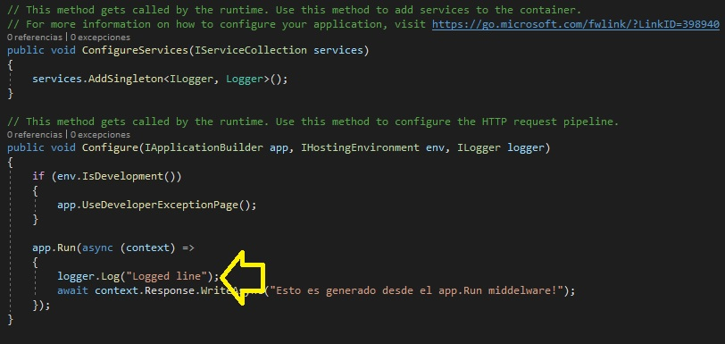

# Módulo 3: Configuración del middleware y los servicios en el ASP.NET Core


Siempre cuando un camino comienza con  *[Repository Root]*, reemplacelo con el camino absoluto en el que el repositorio 20486 reside. Por ejemplo, si tu has cloneado o extraido el repositorio 20486 en la carpeta **C:\Users\John Doe\Downloads\20486**, cambiar la ruta de: **[Repository Root]\AllFiles\20486D\Mod01** a **C:\Users\John Doe\Downloads\20486\AllFiles\20486D\Mod01**.

Fichero de Instrucciones: Instructions\20486D_MOD03_DEMO.md

**Información:**

1. **Nombres y apellidos:** José René Fuentes Cortez
2. **Fecha:** 24 de Noviembre 2020
3. **Resumen del Ejercicio:** (Respondiendo a la siguiente pregunta: ¿Cuál es el objetivo del ejercicio? y los pasos realizados para su cumplimiento.
4. **Dificultad o problemas presentados y como se resolvieron:** Errores en la consola del programa, la página web no realizaba los cambios solicitados, etc.

**NOTA**: Si no hay descripcion de problemas o dificultades, y al yo descargar el código para realizar la comprobacion y el código no funcionar, el resultado de la califaciación del laboratorio será afectado.


# Lección 1: Configuración del Middleware

### Demonstration: Cómo crear un middleware personalizado

#### Pasos de preparación 

Asegúrate de que has clonado el directorio **20486D** de GitHub. Contiene los segmentos de código para los laboratorios y demostraciones de este curso. (**https://github.com/MicrosoftLearning/20486D-DevelopingASPNETMVCWebApplications/tree/master/Allfiles**).


#### Pasos de la demostración


1. Inicie Visual Studio 2017.

2. En la ventana **Página de inicio - Microsoft Visual Studio**, en el menú **Archivo**, apunta a **Nuevo**, y luego haz clic en **Proyecto**.

3. En el cuadro de diálogo **Nuevo Proyecto**, en el panel de navegación, expanda **Instalado**, y luego haga clic en **Visual C#**.

4. En el cuadro de diálogo **Nuevo Proyecto**, en el panel de resultados, haga clic en **Aplicación Web Principal de ASP.NET**.

5. En el cuadro **Nombre**, escriba **ConfigureMiddlewareExample**.

6. En la casilla **Localización**, escribe **[Repository Root]\Allfiles\Mod03\Democode\01_ConfigureMiddlewareExample_begin**, y luego haz clic en **OK**. 

7. En el cuadro de diálogo **Nueva Aplicación Web Principal ASP.NET - ConfigurarMiddlewareExample**, en el panel de resultados, haga clic en **Vacío**, asegúrese de que las casillas de verificación están despejadas, y luego haga clic en **OK**.

8. En la ventana **ConfigureMiddlewareExample - Microsoft Visual Studio**, en el menú **DEBUG**, haga clic en **Start Without Debugging**.

9. En Microsoft Edge, en la barra de direcciones, anote el número de puerto que aparece al final del URL **http://localhost:[port]**. Usará el número de puerto durante esta demostración.

- La representación visual a la respuesta del último ejercicio se muestra en la siguiente imagen:

 

10. En Microsoft Edge, haga clic en **Cerrar**.

11. En la ventana **ConfigureMiddlewareExample - Microsoft Visual Studio**, en **Solution Explorer**, haga clic en **Startup.cs**.

12. En la ventana de código **Startup.cs**, borre cualquier comentario existente en el archivo.

13. 13. En la ventana del código **Startup.cs**, elimine el método **Configurar** con su contenido.

14. En la ventana del código **Startup.cs**, coloque el cursor debajo del método **ConfigureServices** y escriba el siguiente código:
  ```cs
    vacío público Configurar(IApplicationBuilder app)
    {
        app.Run(async (context) =>
        {
            espera contexto.Respuesta.WriteAsync("Este texto fue generado por el middleware app.Run");
        });
    }
  ```

15. En la ventana **ConfigureMiddlewareExample - Microsoft Visual Studio**, en el menú **FILE**, haga clic en **Save All**.

16. En la ventana **ConfigureMiddlewareExample - Microsoft Visual Studio**, en el menú **DEBUG**, haga clic en **Start Without Debugging**. 

17. En Microsoft Edge, en la barra de direcciones, escriba **http://localhost:[port]/UrlTest1**, y luego presione Enter.
    >**Nota**: El navegador aparece: **Este texto fue generado por el app.Run middleware.**

- La representación visual a la respuesta del último ejercicio se muestra en la siguiente imagen:

 

18. En Microsoft Edge, en la barra de direcciones, escriba **http://localhost:[port]/UrlTest2**, y luego presione Enter.
    >**Nota**: El navegador aparece: **Este texto fue generado por la app.Run middleware.**

- La representación visual a la respuesta del último ejercicio se muestra en la siguiente imagen:

 

19. En Microsoft Edge, haga clic en **Cerrar**.

20. En la ventana del código **Startup.cs**, localiza el siguiente código:
  ```cs
    vacío público Configurar(IApplicationBuilder app)
    {
  ```

21. Ponga el cursor después del signo **{** (abra las abrazaderas), pulse Intro, escriba el siguiente código y luego pulse Intro.
  ```cs
    app.Use(async (context, next) =>
    {
        await context.Response.WriteAsync("Este texto fue generado por la aplicación. Use middleware. La ruta de la solicitud es: " + context.Request.Path.Value + "<br />");
    });
  ```
- La representación visual a la respuesta del último ejercicio se muestra en la siguiente imagen:

 

22. En la ventana **ConfigureMiddlewareExample - Microsoft Visual Studio**, en el menú **FILE**, haga clic en **Save All**.

23. En la ventana **ConfigureMiddlewareExample - Microsoft Visual Studio**, en el menú **DEBUG**, haga clic en **Start Without Debugging**.

24. En Microsoft Edge, en la barra de direcciones, escriba **http://localhost:[port]/UrlTest1**, y luego presione Enter.
    >**Nota**: El navegador aparece: **Este texto fue generado por la aplicación.Use el middleware. La ruta de la solicitud es: /UrlTest1**.

- La representación visual a la respuesta del último ejercicio se muestra en la siguiente imagen:

 

25. En Microsoft Edge, en la barra de direcciones, escribe **http://localhost:[port]/UrlTest2**, y luego pulsa Intro.
    >**Nota**: El navegador aparece: **Este texto fue generado por la aplicación.Use el middleware. La ruta de la solicitud es: /UrlTest2**.


- La representación visual a la respuesta del último ejercicio se muestra en la siguiente imagen:

 

26. En Microsoft Edge, haz clic en **Cerrar**.

27. En la ventana del código **Startup.cs**, localiza el siguiente código:
  ```cs
    espera contexto.Respuesta.WriteAsync("Este texto fue generado por la aplicación.Use middleware. La ruta de la solicitud es: " + context.Request.Path.Value + "<br />");
  ```

- La representación visual a la respuesta del último ejercicio se muestra en la siguiente imagen:

 

28. Ponga el cursor al final del código localizado, presione Enter y luego escriba el siguiente código:
```cs
    await next.Invoke();
```

29. En la ventana **ConfigureMiddlewareExample - Microsoft Visual Studio**, en el menú **FILE**, haga clic en **Save All**.


30. En la ventana **ConfigureMiddlewareExample - Microsoft Visual Studio**, en el menú **DEBUG**, haga clic en **Start Without Debugging**.
    >**Nota**: El navegador aparece: <br />
						 **Este texto fue generado por la aplicación.Use el middleware. La ruta de la solicitud es: / <br />
Este texto fue generado por la aplicación. Ejecuta el middleware.


31. En Microsoft Edge, haga clic en **Cerrar**.

32. En la ventana del código **Startup.cs**, seleccione el siguiente código:

  ```cs
    app.Use(async (context, next) =>
    {
        await context.Response.WriteAsync("This text was generated by the app.Use middleware. Request path is: " + context.Request.Path.Value + "<br />");
        await next.Invoke();
    });
  ```


33. Haga clic con el botón derecho del ratón en el código seleccionado y luego haga clic en **Corte**.

34. En la ventana del código **Startup.cs**, localice el siguiente código:
  ```cs
    app.Run(async (context) =>
    {
        await context.Response.WriteAsync("Este texto fue generado por el middleware app.Run");
    });
  ```

35. Coloca el cursor al final del código localizado, pulsa Intro dos veces, haz clic con el botón derecho del ratón en el lugar del cursor y luego pulsa **Pegar**.

36. En la ventana **ConfigureMiddlewareExample - Microsoft Visual Studio**, en el menú **FILE**, haga clic en **Save All**.

37. 37. En la ventana **ConfigureMiddlewareExample - Microsoft Visual Studio**, en el menú **DEBUG**, haga clic en **Iniciar sin depuración**.
    >**Nota**: El navegador aparece: **Este texto fue generado por el app.Run middleware.**

- La representación visual a la respuesta del último ejercicio se muestra en la siguiente imagen:

 

38. En Microsoft Edge, haga clic en **Cerrar**.

39. En la ventana del código **Startup.cs**, seleccione el siguiente código:
  ```cs
    app.Run(async (context) =>
    {
        espera contexto.Respuesta.WriteAsync("Este texto fue generado por el middleware app.Run");
    });
  ```

40. Haga clic con el botón derecho del ratón en el código seleccionado y luego haga clic en **Corte**.

41. En la ventana del código **Startup.cs**, localice el siguiente código:
  ```cs
    app.Use(async (context, next) =>
    {
        espera contexto.Respuesta.WriteAsync("Este texto fue generado por la aplicación.Use middleware. La ruta de la solicitud es: " + context.Request.Path.Value + "<br />");
        espera next.Invoke();
    });
  ```

42. Coloca el cursor al final del código localizado, pulsa Intro dos veces, haz clic con el botón derecho del ratón en el lugar del cursor y luego pulsa **Pegar**.

43. En la ventana **ConfigureMiddlewareExample - Microsoft Visual Studio**, en el menú **FILE**, haga clic en **Save All**.

44. 44. En la ventana **ConfigureMiddlewareExample - Microsoft Visual Studio**, en el menú **ARCHIVO**, haga clic en **Salir**.

# Lección 1: Configuración del Middleware

### Demonstration: Cómo trabajar con archivos estáticos

#### Pasos de preparación 

Asegúrate de que has clonado el directorio **20486D** de GitHub. Contiene los segmentos de código para los laboratorios y demostraciones de este curso. (**https://github.com/MicrosoftLearning/20486D-DevelopingASPNETMVCWebApplications/tree/master/Allfiles**).


#### Pasos de la demostración

1. Inicie Visual Studio 2019.

2. En la ventana **Página de inicio - Microsoft Visual Studio**, en el menú **Archivo**, apunta a **Nuevo**, y luego haz clic en **Proyecto**.

3. En el cuadro de diálogo **Nuevo Proyecto**, en el panel de navegación, expanda **Instalado**, y luego haga clic en **Visual C#**.

4. En el cuadro de diálogo **Nuevo Proyecto**, en el panel de resultados, haga clic en **Aplicación Web Principal de ASP.NET**.

5. En el cuadro **Nombre**, escriba **Ejemplo de archivos estáticos**.

6. En la casilla **Localización**, escribe **[Repository Root]\Allfiles\Mod03\Democode\02_StaticFilesExample_begin**, y luego haz clic en **OK**. 

7. En el cuadro de diálogo **Nueva Aplicación Web Principal ASP.NET - StaticFilesExample**, en el panel de resultados, haz clic en **Vacío**, asegúrate de que las casillas de verificación están despejadas, y luego haz clic en **OK**.
    >**Nota**: En **Solution Explorer** de la ventana **StaticFilesExample - Microsoft Visual Studio**, observe que la carpeta **wwwwroot** está vacía.

- La representación visual a la respuesta del último ejercicio se muestra en la siguiente imagen:

 


8. En la ventana **Explorador de Archivos**, ve a **[Repository Root]\Allfiles\Mod03\Democode\02_StaticFilesExample_begin**.

9. En la ventana **02_StaticFilesExample_begin**, selecciona los archivos **html-file.html** y los archivos **image-file.jpg**.
 
10. Haga clic con el botón derecho del ratón en los archivos seleccionados y luego haga clic en **Copiar**.

11. En la ventana **Explorador de Archivos**, ve a **[Repository Root]\Allfiles\Mod03\Democode\02_StaticFilesExample_begin\StaticFilesExample\StaticFilesExample\wwwroot**.

12. En la ventana **wwwwroot**, haz clic con el botón derecho del ratón en un espacio vacío, y luego haz clic en **Pegar**.
    >**Nota**: 13. En la ventana **StaticFilesExample - Microsoft Visual Studio**, en **Solution Explorer**, asegúrese de que la carpeta **wwwwroot** contiene los archivos copiados (Puede que necesite expandir el directorio wwwroot para ver los archivos).

- La representación visual a la respuesta del último ejercicio se muestra en la siguiente imagen:

 

13. En la ventana **StaticFilesExample - Microsoft Visual Studio**, en **Solution Explorer**, haga clic en **Startup.cs**.

14. En la ventana de código **Startup.cs**, borre cualquier comentario existente en el archivo.

15. En la ventana del código **Startup.cs**, elimine el método **Configurar** con su contenido.

16. En la ventana del código **Startup.cs**, coloque el cursor debajo del método **ConfigureServices** y escriba el siguiente código:
  ```cs
    vacío público Configurar(IApplicationBuilder app)
    {
        app.Run(async (context) =>
        {
            espera contexto.Respuesta.WriteAsync("Este texto fue generado por el middleware app.Run");
        });
    }
  ```
17. En la ventana **StaticFilesExample - Microsoft Visual Studio**, en el menú **FILE**, haga clic en **Save All**.

18. En la ventana **StaticFilesExample - Microsoft Visual Studio**, en el menú **DEBUG**, haga clic en **Start Without Debugging**.

19. En Microsoft Edge, en la barra de direcciones, escriba **http://localhost:[port]/html-file.html**, y luego presione Enter.
    >**Nota**: El navegador muestra **Este texto fue generado por el app.Run middleware.**

- La representación visual a la respuesta del último ejercicio se muestra en la siguiente imagen:

 


20. En Microsoft Edge, en la barra de direcciones, escriba **http://localhost:[port]/image-file.jpg** y luego presiona Enter.


  > **Nota**: El navegador muestra **Este texto fue generado por el app.Run middleware.**

20. En Microsoft Edge, en la barra de direcciones, escribe **http://localhost:[port]/image-file.jpg**, y luego presiona Enter.
    >**Nota**: El navegador muestra **Este texto fue generado por la app.Run middleware.**

- La representación visual a la respuesta del último ejercicio se muestra en la siguiente imagen:

 

21. En Microsoft Edge, en la barra de direcciones, escriba **http://localhost:[port]/nonexisting-path.jpg**, y luego presione Enter.
    >**Nota**: El navegador muestra **Este texto fue generado por la aplicación.Run middleware.**

- La representación visual a la respuesta del último ejercicio se muestra en la siguiente imagen:

 

22. En Microsoft Edge, pulse **Cerrar**.

23. En **Solution Explorer**, haz clic en **Startup.cs**.

24. En la ventana del código **Startup.cs**, localiza el siguiente código:
  ```cs
    vacío público Configurar(IApplicationBuilder app)
    {
  ```

25. Ponga el cursor después del signo **{** (abra las abrazaderas), pulse Intro, y luego escriba el siguiente código:
  ```cs
    app.UseStaticFiles();
  ```
26. En la ventana **StaticFilesExample - Microsoft Visual Studio**, en el menú **FILE**, haga clic en **Save All**.

27. En la ventana **StaticFilesExample - Microsoft Visual Studio**, en el menú **DEBUG**, haga clic en **Start Without Debugging**.

28. En Microsoft Edge, en la barra de direcciones, escriba **http://localhost:[port]/html-file.html**, y luego presione Enter.
    >**Nota**: El navegador muestra el contenido del archivo HTML: **Hola desde el archivo HTML!**

- La representación visual a la respuesta del último ejercicio se muestra en la siguiente imagen:

 

29. En Microsoft Edge, en la barra de direcciones, escriba **http://localhost:[port]/image-file.jpg**, y luego presione Enter.
    >**Nota**: El navegador muestra el archivo de imagen.

- La representación visual a la respuesta del último ejercicio se muestra en la siguiente imagen:

 


30. En Microsoft Edge, en la barra de direcciones, escriba **http://localhost:[port]/nonexisting-path.jpg**, y luego presione Enter.
    >**Nota**: El navegador muestra **Este texto fue generado por el app.Run middleware**.

- La representación visual a la respuesta del último ejercicio se muestra en la siguiente imagen:

 

31. En Microsoft Edge, haga clic en **Cerrar**.

32. En la ventana **StaticFilesExample - Microsoft Visual Studio**, en el menú **FILE**, haga clic en **Salir**.

# Lección 2: Configuración de Servicios

### Demonstration: Cómo usar la inyección de dependencia

#### Pasos de preparación 

Asegúrate de que has clonado el directorio **20486D** de GitHub. Contiene los segmentos de código para los laboratorios y demostraciones de este curso. (**https://github.com/MicrosoftLearning/20486D-DevelopingASPNETMVCWebApplications/tree/master/Allfiles**).


#### Pasos de la demostración

1. Inicie Visual Studio 2017.

2. En la ventana **Página de inicio - Microsoft Visual Studio**, en el menú **Archivo**, apunta a **Nuevo**, y luego haz clic en **Proyecto**.

3. En el cuadro de diálogo **Nuevo Proyecto**, en el panel de navegación, expanda **Instalado**, y luego haga clic en **Visual C#**.

4. En el cuadro de diálogo **Nuevo Proyecto**, en el panel de resultados, haga clic en **Aplicación Web Principal de ASP.NET**.

5. En el cuadro **Nombre**, escriba **ConfigurarEjemplo de Servicio**.

6. En la casilla **Localización**, escriba **[Raíz del repositorio]\Ntodos los archivos\NMod03\Democode\N- ConfigureServiceExample_begin**, y luego haga clic en **OK**. 

7. En el cuadro de diálogo **Nueva Aplicación Web Principal ASP.NET - Configurar Servicio de Ejemplo**, en el panel de resultados, haga clic en **Vacío**, asegúrese de que las casillas de verificación están despejadas, y luego haga clic en **OK**.

8. En la ventana **ConfigureServiceExample - Microsoft Visual Studio**, en **Solution Explorer**, haga clic en **Startup.cs**.

9. En la ventana de código **Startup.cs**, borre cualquier comentario existente en el archivo.

10. En la ventana del código **Startup.cs**, elimine el método **Configurar** con su contenido.

11. En la ventana del código **Startup.cs**, coloque el cursor debajo del método **ConfigureServices** y escriba el siguiente código:
  ```cs
    vacío público Configurar(IApplicationBuilder app)
    {
        app.Run(async (context) =>
        {
            espera contexto.Respuesta.WriteAsync("Este texto fue generado por el middleware app.Run");
        });
    }
  ```

12. En la ventana **ConfigureServiceExample - Microsoft Visual Studio**, en **Solution Explorer**, haga clic con el botón derecho **ConfigureServiceExample**, apunte a **Add**, y luego haga clic en **New Folder**.

13.	En el cuadro **NuevaCarpeta**, escriba **Servicios**, y luego presione Enter.


- La representación visual a la respuesta del último ejercicio se muestra en la siguiente imagen:

 

14. En **Explorador de soluciones**, haga clic con el botón derecho del ratón en **Servicios**, señale a **Agregar**, y luego haga clic en **Clase**.

15. En el cuadro de diálogo **Agregar nuevo elemento - Configurar ejemplo de servicio**, en el cuadro **Nombre**, escriba **Logger**, y luego haga clic en **Agregar**.

16. En la ventana de código **Logger.cs**, localice el siguiente código:
  ```cs
    using System.Threading.Tasks;
  ```

17. Ponga el cursor al final del código localizado, presione Enter, y luego escriba el siguiente código:
  ```cs
    using System.IO;
  ```

- La representación visual a la respuesta del último ejercicio se muestra en la siguiente imagen:

 

18. En la ventana del código **Logger.cs**, localiza el siguiente código:
  ```cs
    public class Logger
    {
  ```

19. Ponga el cursor al final del código localizado, presione Enter y luego escriba el siguiente código:
  ```cs
    string _fileName;
  ```

20. Ponga el cursor al final del campo **_fileName**, presione Enter dos veces, y luego escriba el siguiente código:
  ```cs
    public Logger()
    {
    }
  ```

21. Ponga el cursor dentro del bloque de código de construcción **Logger**, pulse Intro, y luego escriba el siguiente código:
  ```cs
    _fileName = $"{DateTime.UtcNow.ToString("yyyy-dd-MM--HH-mm-ss")}.log";
  ```

22. Ponga el cursor al final del constructor **Logger**, presione Enter dos veces, y luego escriba el siguiente código:
  ```cs
    public void Log(string logData)
    {
        File.AppendAllText(_fileName, $"{DateTime.UtcNow}: {logData}");
    }
  ```
- La representación visual a la respuesta del último ejercicio se muestra en la siguiente imagen:

 


23. En la ventana **ConfigureServiceExample - Microsoft Visual Studio**, en el menú **FILE**, haga clic en **Save All**.

24. En la ventana del código **Logger.cs**, localice el siguiente código:
  ```cs
    public class Logger
  ```

25. Haga clic con el botón derecho del ratón en el nombre de la clase **Logger**, haga clic en **Acciones Rápidas y Refactorizaciones...**, y luego haga clic en **Extraer Interfaz...**.

26. 26. En la ventana de diálogo **Extract Interface**, haga clic en **OK**.

27. En la ventana **ConfigureServiceExample - Microsoft Visual Studio**, en **Solution Explorer**, haga clic en **Startup.cs**.

28. En la ventana del código **Startup.cs**, localice el siguiente código:
  ```cs
    using Microsoft.Extensions.DependencyInjection;
  ```

29. Ponga el cursor al final del código localizado, presione Enter, y luego escriba el siguiente código:
  ```cs
    using ConfigureServiceExample.Services;
  ```

30. Ponga el cursor dentro del bloque de método **ConfigurarServicios**, presione Enter, y luego escriba el siguiente código:
  ```cs
    services.AddSingleton<ILogger, Logger>();
  ```
- La representación visual a la respuesta del último ejercicio se muestra en la siguiente imagen:

 

31. En la ventana del código **Startup.cs**, seleccione el siguiente código:
  ```cs
    public void Configure(IApplicationBuilder app)
  ```

32. Sustituya el código seleccionado por el siguiente código:
  ```cs
    public void Configure(IApplicationBuilder app, ILogger logger)
  ```

33. En el método **Configure**, localice el siguiente código:
  ```cs
    app.Run(async (context) =>
    {
  ```

34. Ponga el cursor después del signo **{** (abra las abrazaderas), pulse Intro, y luego escriba el siguiente código:
  ```cs
    logger.Log("Logged line");
  ```
- La representación visual a la respuesta del último ejercicio se muestra en la siguiente imagen:

 

35. En la ventana **ConfigureServiceExample- Microsoft Visual Studio**, en el menú **FILE**, haga clic en **Save All**.

36. En la ventana **ConfigureServiceExample - Microsoft Visual Studio**, en el menú **DEBUG**, haga clic en **Iniciar sin depuración**.
    >**Nota**: El navegador aparece: **Este texto fue generado por el app.Run middleware.** <br/>
    En **Solution Explorer**, en el directorio principal del proyecto, verifique que se haya creado un archivo de registro. 

37. En Microsoft Edge, haga clic en **Cerrar**.

38. En **Solution Explorer**, haga doble clic en el recién creado archivo **XXXX-XX-XX--XX-XX-XX.log**.
    >**Nota**: El texto dentro del archivo de registro es: *[DateTime]***: Línea de registro**.

- La representación visual a la respuesta del último ejercicio se muestra en la siguiente imagen:

 

39. En la ventana **ConfigureServiceExample - Microsoft Visual Studio**, en el menú **FILE**, haga clic en **Salir**.


