# Módulo 6: Desarrollo de modelos


Fichero de Instrucciones: Instructions\20486D_MOD06_DEMO.md

Entregar el url de GitHub con la solución y un readme con las siguiente información:

1. **Nombres y apellidos:** José René Fuentes Cortez
2. **Fecha:** 24 de Noviembre 2020.
3. **Resumen del Modulo 6:** Este módulo consta de dos ejercicios:
    -  En el primer ejercio nos ayuda a entender como usar la metodología del ASP.NET Identity.
    - En el ejercicio 2 la práctica nos ayuda a entender como autorizar el acceso a aciones del controlador.


4. **Dificultad o problemas presentados y como se resolvieron:** Ninguna.

**NOTA**: Si no hay descripcion de problemas o dificultades, y al yo descargar el código para realizar la comprobacion y el código no funcionar, el resultado de la califaciación del laboratorio será afectado.

---

Siempre que la ruta a un archivo comience con *[Raíz del repositorio]*, reemplácela con la ruta absoluta a la carpeta en la que reside el repositorio 20486. Por ejemplo, si clonó o extrajo el repositorio 20486 en **C:\Users\John Doe\Downloads\20486**, cambiar el camino a: **[Repository Root]\AllFiles\20486D\Mod01** al **C:\Users\John Doe\Downloads\20486\AllFiles\20486D\Mod01**

# Lección 1: Crear modelos MVC

### Demonstration: Cómo unir las vistas a las clases modelo

#### Pasos de preparación 


1. Asegúrese de haber clonado el directorio **20486D** de GitHub. Contiene los segmentos de código para los laboratorios y demostraciones de este curso.
**(https://github.com/MicrosoftLearning/20486D-DevelopingASPNETMVCWebApplications/tree/master/Allfiles)**

2. Navega a **[Repository Root]\Allfiles\Mod06\Democode\01_BindViewsExample_begin**, y luego abre el **BindViewsExample.sln**.

    >**Nota**: Si aparece un cuadro de diálogo de **Aviso de seguridad para BindViewsExample**, verifique que la casilla de verificación **Ask me for each project in this solution** esté despejada, y luego haga clic en OK.

3. En la ventana **BindViewsExample - Microsoft Visual Studio**, en el menú **DEBUG**, haga clic en **Start Without Debugging**.

4. En Microsoft Edge, en la barra de direcciones, anota el número de puerto que aparece al final del URL **http://localhost:[port]**. Usará el número de puerto durante esta demostración.

- La representación visual del codigo del ejercicio se muestra en la siguiente imagen:

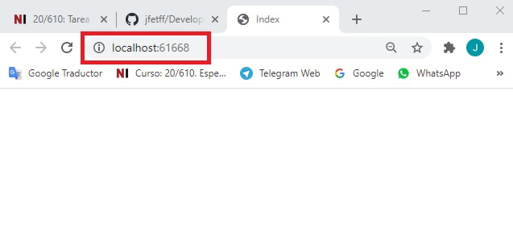

5. En Microsoft Edge, haga clic en **Cerrar**.

#### Pasos de la demostración


1. Ve a **[Repository Root]\Allfiles\Mod06\Democode\01_BindViewsExample_begin**, y luego haz doble clic en **BindViewsExample.sln**.

    >**Nota**: Si aparece un cuadro de diálogo de **Aviso de seguridad para BindViewsExample**, verifique que la casilla de verificación **Ask me for each project in this solution** esté despejada, y luego haga clic en OK.

2. En **Solution Explorer**, haga clic con el botón derecho en **BindViewsExample**, apunte a **Add**, y luego haga clic en **New Folder**.

3. En el cuadro **Nueva Carpeta**, escriba **Modelos**, y luego presione Enter.

4. En la ventana **BindViewsExample - Microsoft Visual Studio**, en **Solution Explorer**, haz clic con el botón derecho del ratón en **Models**, apunta a **Add**, y luego haz clic en **Class**.

5. En el cuadro de diálogo **Agregar nuevo elemento - BindViewsExample**, en el cuadro **Nombre**, escriba **Restaurante**, y luego haga clic en **Agregar**.

- La representación visual del codigo del ejercicio se muestra en la siguiente imagen:

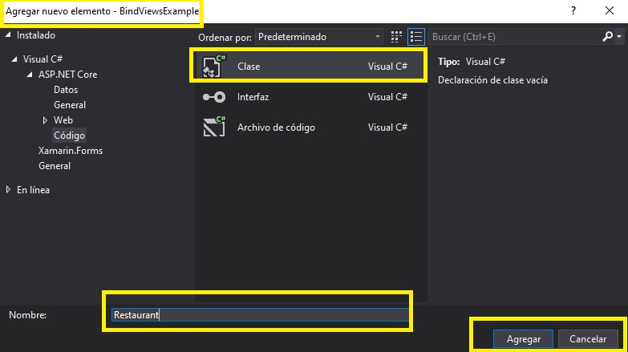

6. En el bloque de código **Restaurante.cs**, coloque el cursor después del segundo signo **{** (abra abrazaderas), pulse Intro y luego escriba el siguiente código:
  ```cs
       public int Id { get; set; }
       public string Name { get; set; }
       public string Address { get; set; }
       public bool Open { get; set; }
       public string Speciality { get; set; }
       public int Review { get; set; }
  ```

- La representación visual del codigo del ejercicio se muestra en la siguiente imagen:

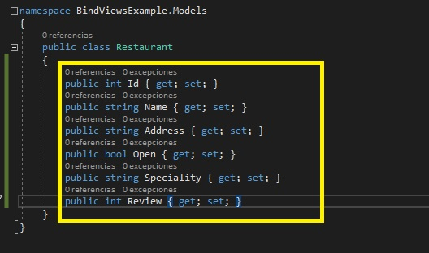

7. En la ventana **BindViewsExample - Microsoft Visual Studio**, en **Solution Explorer**, en **BindViewsExample**, amplíe **Controladores**, y luego haga clic en **HomeController.cs**.

8. En la ventana de código **HomeController.cs**, localice el siguiente código:
  ```cs
       using Microsoft.AspNetCore.Mvc;
  ```

9. Asegúrate de que el cursor está al final del espacio de nombres **Microsoft.AspNetCore.Mvc**, presiona Enter, y luego escribe el siguiente código:
  ```cs
       using BindViewsExample.Models;
  ```

10. En el bloque de código de acción **Index**, seleccione el siguiente código:
  ```cs
       return View();
  ```

11. Reemplazar el código seleccionado por el siguiente código:
  ```cs
       Restaurant restaurant = new Restaurant() {Id = 1, Name = "My Kitchen 1",Address = "New Brunswick, 2657 Webster Street", Speciality = "Hamburgers", Open = true, Review = 4 }; 
       return View(restaurant);
  ```

12. En el bloque de código de acción **AnotherWayToDisplay**, seleccione el siguiente código:
  ```cs
       return View();
  ```

13. Sustituya el código seleccionado por el siguiente código:
  ```cs
       Restaurant restaurant = new Restaurant() { Id = 2, Name = "My Kitchen 2", Address = "New Brunswick, 4175 Echo Lane Street", Speciality = "Sushi", Open = true, Review = 3 };
       return View(restaurant);
  ```

- La representación visual del codigo del ejercicio se muestra en la siguiente imagen:

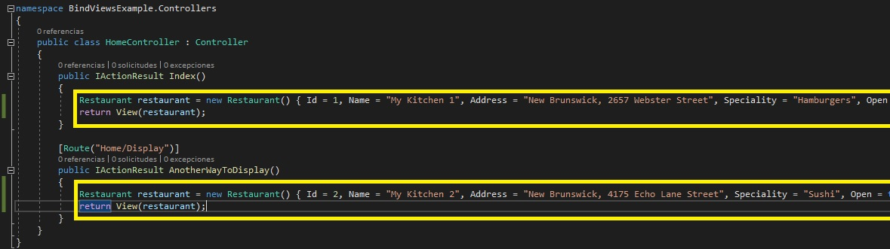

14. En la ventana **BindViewsExample - Microsoft Visual Studio**, en **Solution Explorer**, expandir **Views**, expandir **Home**, y luego hacer clic en **Index.cshtml**.

15. En la ventana **Index.cshtml** code, coloque el cursor al principio del documento, escriba el siguiente código y luego presione Enter.
  ```cs
       @model BindViewsExample.Models.Restaurant
  ```

16. En el elemento **BODY** de la ventana de códigos **Index.cshtml**, escriba el siguiente código:
  ```cs
       <h1>Restaurant Information</h1>
       <div>
       </div>
       <p id="remark">The first way to pass a model from an action to a view</p>
  ```

17. En el elemento **DIV** de la ventana de códigos **Index.cshtml**, escriba el siguiente código:
  ```cs
       <p><b>Name</b>: @Model.Name</p>
       <hr />
       <p><b>Address</b>: @Model.Address</p>
       <hr />
       <p><b>Speciality</b>: @Model.Speciality</p>
       <hr />
       <p><b>Is Open</b>: @Model.Open</p>
       <hr />
       <p><b>Rating</b>: @Model.Review</p>
  ```
- La representación visual del codigo del ejercicio se muestra en la siguiente imagen:

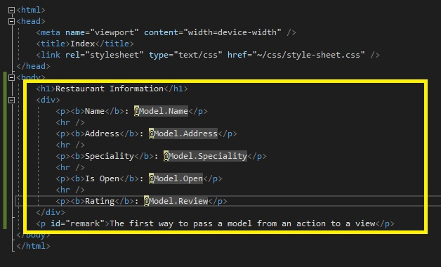

18. En la ventana **BindViewsExample - Microsoft Visual Studio**, en **Solution Explorer**, en **Views**, en **Home**, haga clic en **AnotherWayToDisplay.cshtml**.

19. En la ventana de código **AnotherWayToDisplay.cshtml**, coloque el cursor al principio del documento, escriba el siguiente código y pulse Intro.
  ```cs
       @model BindViewsExample.Models.Restaurant
  ```

20. En el elemento **BODY** de la ventana de código **AnotherWayToDisplay.cshtml**, escriba el siguiente código:
  ```cs
       <h1>Restaurant Information</h1>
       <div>
       </div>
       <p id="remark">The second way to pass a model from an action to a view</p>
  ```
21. En el elemento **DIV** de la ventana del código **AnotherWayToDisplay.cshtml**, escriba el siguiente código:

  ```cs
       @Html.EditorForModel()
  ```
- La representación visual del codigo del ejercicio se muestra en la siguiente imagen:

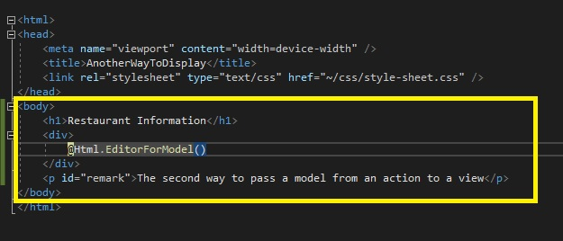

22. En la ventana **BindViewsExample - Microsoft Visual Studio**, en el menú **FILE**, haga clic en **Save All**.

23. En el menú **DEBUG**, haga clic en **Iniciar sin depuración**.

       >**Nota**: La ventana del navegador muestra la vista **Index.cshtml**. 

- La representación visual del codigo del ejercicio se muestra en la siguiente imagen:

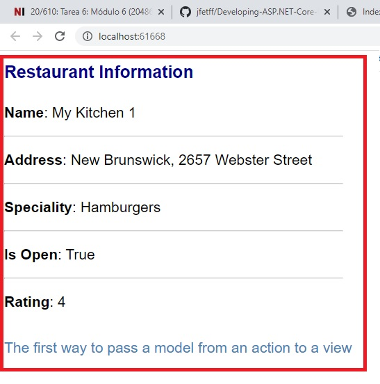

24. En Microsoft Edge, en la barra de direcciones, escribe **http://localhost:[port]/Home/Display**, y luego pulsa Intro.

      >**Nota**: La ventana del navegador muestra la vista **AnotherWayToDisplay.cshtml**. 

- La representación visual del codigo del ejercicio se muestra en la siguiente imagen:

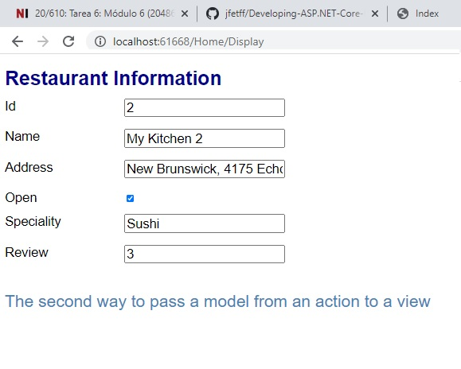

25. Pulsa **Cerrar**.

26. En la ventana **BindViewsExample - Microsoft Visual Studio**, en el menú **FILE**, haga clic en **Salir**.

# Lección 2: Trabajando con las formas

### Demonstration: Cómo utilizar las anotaciones de datos de visualización y edición

#### Pasos de preparación 

Asegúrate de que has clonado el directorio 20486D de GitHub (**https://github.com/MicrosoftLearning/20486D-DevelopingASPNETMVCWebApplications/tree/master/Allfiles**). Contiene los segmentos de código para los laboratorios y demostraciones de este curso. 

#### Pasos de la demostración

1. Ve a **[Repository Root]\Allfiles\Mod06\Democode\02_DataAnnotationsExample_begin**, y luego haz doble clic en **DataAnnotationsExample.sln**.

    >**Nota**: Si aparece el cuadro de diálogo **Aviso de seguridad para DatosAnotóticos-Ejemplo**, verifique que la casilla de verificación **Pregúntame por cada proyecto de esta solución** esté desactivada, y luego haga clic en OK.

2. En la ventana **DataAnnotationsExample - Microsoft Visual Studio**, en **Solution Explorer**, expanda **Models**, y luego haga clic en **User.cs**.

3. En la ventana **Código de usuario.cs**, localice el siguiente código:
  ```cs
      using System.Threading.Tasks;
  ```

4. Asegúrate de que el cursor está al final del espacio de nombres **System.Threading.Tasks**, presiona Enter, y luego escribe el siguiente código:
  ```cs
      using System.ComponentModel.DataAnnotations;
  ```

5. En la ventana del código **Usuario.cs**, coloque el cursor al final del código de propiedad **Usuario.cs**, pulse dos veces Intro y luego escriba el siguiente código:
  ```cs
      [Display(Name = "Full Name:")]
  ```

6. Ponga el cursor al final del código de propiedad **NombreCompleto**, presione Enter dos veces, y luego escriba el siguiente código:
  ```cs
      [Display(Name = "Email Address:")]
      [DataType(DataType.EmailAddress)]
  ```

7. Ponga el cursor al final del código de propiedad **Email**, presione Enter dos veces, y luego escriba el siguiente código:
  ```cs
      [Display(Name = "Birthdate:")]
      [DataType(DataType.Date)]
  ```

8. Ponga el cursor al final del código de propiedad **Fecha de nacimiento**, presione Enter dos veces, y luego escriba el siguiente código:
  ```cs
      [Display(Name = "Password:")]
      [DataType(DataType.Password)]
  ```
- La representación visual del codigo del ejercicio se muestra en la siguiente imagen:

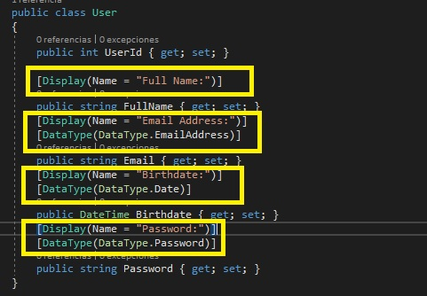

9. En la ventana **DataAnnotationsExample - Microsoft Visual Studio**, en **Solution Explorer**, expandir **Views**, expandir **Home**, y luego hacer clic en **Index.cshtml**. 

10. En la ventana **Index.cshtml** código, coloque el cursor al principio del documento, escriba el siguiente código, y luego presione Enter.
  ```cs
       @model DataAnnotationsExample.Models.User
  ```

11. En el elemento **BODY** de la ventana de códigos **Index.cshtml**, escriba el siguiente código:
  ```cs
       <div class="container">
           <h1>Create an account</h1>
       </div>
  ```

12. En el elemento **DIV** de la ventana de códigos **Index.cshtml**, después del elemento **H1**, escriba el siguiente código:
  ```cs
       <form asp-action="Details" method="post">
            <label asp-for="FullName"></label>
            <input asp-for="FullName" />
            <br />
            <label asp-for="Email"></label>
            <input asp-for="Email" />
            <br />
            <label asp-for="Birthdate"></label>
            <input asp-for="Birthdate" />
            <br />
            <label asp-for="Password"></label>
            <input asp-for="Password" />
            <br />
            <input type="submit" value="Register" />
        </form>
  ```
- La representación visual del codigo del ejercicio se muestra en la siguiente imagen:

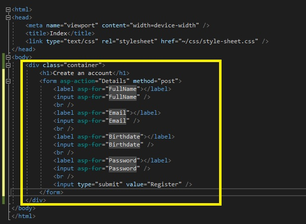

13. En la ventana **DataAnnotationsExample - Microsoft Visual Studio**, en **Solution Explorer**, en **Views**, en **Home**, haga clic en **Details.cshtml**.

14. En la ventana **Details.cshtml** code, coloque el cursor al principio del documento, escriba el siguiente código y luego pulse Intro.
  ```cs
       @model DataAnnotationsExample.Models.User
  ```

15. En el elemento **BODY** de la ventana del código **Details.cshtml**, escriba el siguiente código:

  ```cs
       <div class="container">
           <h1>User Details</h1>
       </div>
  ```


16. En el elemento **DIV** de la ventana de códigos **Details.cshtml**, después del elemento **H1**, escriba el siguiente código:
  ```cs
       <div>
            <span class="display-prop-name">
                @Html.DisplayNameFor(model => model.FullName)
            </span>
            <br />
            <span class="display-prop-value">
                @Html.DisplayFor(model => model.FullName)
            </span>
        </div>
        <div>
            <span class="display-prop-name">
                @Html.DisplayNameFor(model => model.Email)
            </span>
            <br />
            <span class="display-prop-value">
                @Html.DisplayFor(model => model.Email)
            </span>
        </div>
        <div>
            <span class="display-prop-name">
                @Html.DisplayNameFor(model => model.Birthdate)
            </span>
            <br />
            <span class="display-prop-value">
                @Html.DisplayFor(model => model.Birthdate)
            </span>
        </div>
  ```
>**Nota**: Este bloque de código genera diferentes marcas HTML dependiendo del tipo de datos de la propiedad que se está renderizando.

- La representación visual del codigo del ejercicio se muestra en la siguiente imagen:

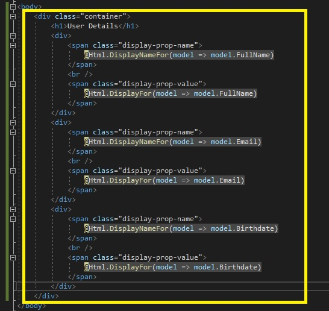

17. En la ventana **DataAnnotationsExample - Microsoft Visual Studio**, en el menú **FILE**, haga clic en **Save All**.

18. En el menú **DEBUG**, haga clic en **Iniciar sin depuración**.

19. En la página **Crear una cuenta**, en el cuadro **Nombre completo**, escriba **&lt;A full name of your choice&gt;**.

20. En la casilla **Email Address**, escriba **Email Address** box, type **&lt;An email address of your choice&gt;**.

21. En la casilla **Birthdate**, elija **&lt;A birthdate of your choice&gt;**.

22. En la casilla **Password**, escriba **&lt;A password of your choice&gt;**, y luego haga clic en **Registrarse**.

- La representación visual del codigo del ejercicio se muestra en la siguiente imagen:

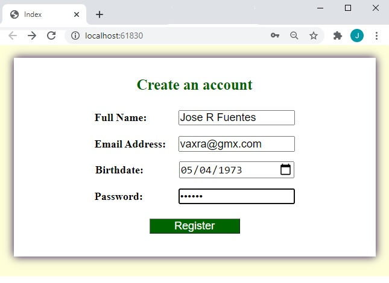

      >**Nota**: Verifique los datos del usuario recién registrado.

- La representación visual del codigo del ejercicio se muestra en la siguiente imagen:

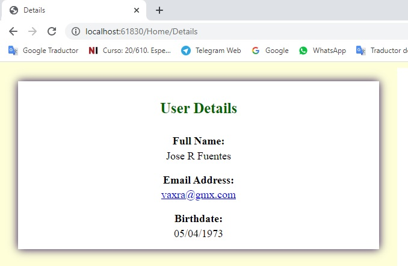

23. En Microsoft Edge, haga clic en **Cerrar**.

24. En la ventana **DataAnnotationsExample - Microsoft Visual Studio**, en el menú **FILE**, haga clic en **Salir**.

# Lección 3: Validación de las aplicaciones MVC

### Demonstration: Cómo validar la entrada del usuario con anotaciones de datos

#### Pasos de preparación 

Asegúrate de que has clonado el directorio 20486D de GitHub (**https://github.com/MicrosoftLearning/20486D-DevelopingASPNETMVCWebApplications/tree/master/Allfiles**). Contiene los segmentos de código para los laboratorios y demostraciones de este curso. 


#### Pasos de la demostración

1. Ve a **[Repository Root]\Allfiles\Mod06\Democode\03_DataAnnotationsValidationExample_begin**, y luego haz doble clic en **DataAnnotationsExample.sln**.

    >**Nota**: Si aparece el cuadro de diálogo **Aviso de seguridad para DatosAnotóticos-Ejemplo**, verifique que la casilla de verificación **Aviso para cada proyecto de esta solución** esté desactivada, y luego haga clic en OK.

2. En la ventana **DataAnnotationsExample - Microsoft Visual Studio**, en **Solution Explorer**, expanda **Models**, y luego haga clic en **Person.cs**.

3. En la ventana de código **Person.cs**, localiza el siguiente código:
  ```cs
      using System.Threading.Tasks;
  ```
4. Asegúrate de que el cursor está al final del espacio de nombres **System.Threading.Tasks**, presiona Enter, y luego escribe el siguiente código:
  ```cs
      using System.ComponentModel.DataAnnotations;
  ```

5. En la ventana del código **Person.cs**, coloque el cursor al final del código de propiedad **PersonId**, presione Enter dos veces, y luego escriba el siguiente código:
  ```cs
      [DataType(DataType.Text)]
      [Display(Name = "First Name:")]
      [Required(ErrorMessage = "Please enter your first name.")]
  ```
6. Ponga el cursor al final del código de propiedad **FirstName**, presione Enter dos veces, y luego escriba el siguiente código:
  ```cs
      [DataType(DataType.Text)]
      [Display(Name = "Last Name:")]
      [Required(ErrorMessage = "Please enter your last name.")]
  ```

7. Ponga el cursor al final del código de propiedad **Apellido**, presione Enter dos veces, y luego escriba el siguiente código:
  ```cs
      [Range(15, 50)]
      [Display(Name = "Age:")]
  ```

8. Ponga el cursor al final del código de propiedad **Edad**, presione Enter dos veces, y luego escriba el siguiente código:
  ```cs
      [StringLength(10)]
      [Display(Name = "Description:")]
  ```

- La representación visual del codigo del ejercicio se muestra en la siguiente imagen:

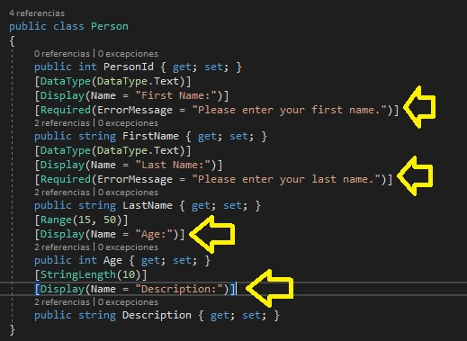

9. En la ventana **DataAnnotationsExample - Microsoft Visual Studio**, en **Solution Explorer**, expandir **Controllers**, y luego hacer clic en **HomeController.cs**.

10. En la ventana de código **HomeController.cs**, localice el siguiente código:
  ```cs
      public IActionResult Details(Person person)
      {
  ```
11. Ponga el cursor después del signo **{** (abra las abrazaderas), pulse Intro, y luego escriba el siguiente código:
  ```cs
      if (!ModelState.IsValid)
      {
          return View("Index", person);
      }
  ```

- La representación visual del codigo del ejercicio se muestra en la siguiente imagen:

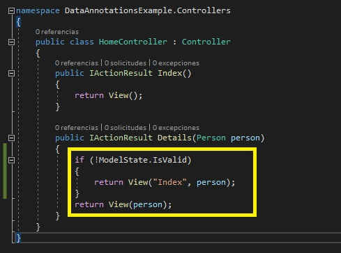

12. En la ventana **DataAnnotationsExample - Microsoft Visual Studio**, en **Solution Explorer**, expandir **Views**, expandir **Home**, y luego hacer clic en **Index.cshtml**. 

13. En la ventana **Index.cshtml** código, coloque el cursor al principio del documento, escriba el siguiente código, y luego presione Enter.
  ```cs
       @model DataAnnotationsExample.Models.Person
  ```

14. En el elemento **Body** de la ventana del código **Index.cshtml** escriba el siguiente código:
  ```cs
       <div class="container">
           <h1>Submit Personal Information</h1>
       </div>
  ```

15. En el elemento **DIV** de la ventana del código de **Index.cshtml**, después del elemento **H1**, escriba el siguiente código:

  ```cs
       <form asp-action="Details">
            <div asp-validation-summary="All"></div>
            <div class="form-field">
                <label asp-for="FirstName"></label>
                <span class="input-span">
                    <input asp-for="FirstName" />
                    <span asp-validation-for="FirstName"></span>
                </span>
            </div>
            <div class="form-field">
                <label asp-for="LastName"></label>
                <span class="input-span">
                    <input asp-for="LastName" />
                    <span asp-validation-for="LastName"></span>
                </span>
            </div>
            <div class="form-field">
                <label asp-for="Age"></label>
                <span class="input-span">
                    <input asp-for="Age" />
                    <span asp-validation-for="Age"></span>
                </span>
            </div>
            <div class="form-field">
                <label asp-for="Description"></label>
                <span class="input-span">
                    <textarea asp-for="Description"></textarea>
                    <span asp-validation-for="Description"></span>
                </span>
            </div>
            <div>
                <input type="submit" value="Submit" />
            </div>
        </form>
  ```
- La representación visual del codigo del ejercicio se muestra en la siguiente imagen:


16. En la ventana **DataAnnotationsExample - Microsoft Visual Studio**, en **Solution Explorer**, en **Views**, en **Home**, examine el contenido del archivo **Details.cshtml**.

17. En el menú **Archivo**, haga clic en **Guardar todo**.

18. En el menú **DEBUG**, haga clic en **Iniciar sin depuración**.

19. En la página **Submit Personal Information**, en el cuadro **First Name**, dejar el campo en blanco.

20. En la casilla **Apellido**, deje el campo en blanco.

21. En la casilla **Edad**, escriba **5**.

22. En la casilla **Descripción**, escriba **&lt;Una descripción de su elección con más de diez caracteres&gt;**.

- La representación visual del codigo del ejercicio se muestra en la siguiente imagen:

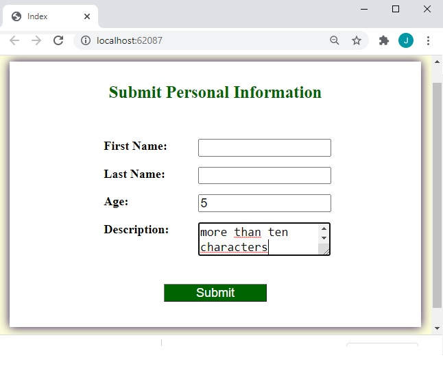

  >**Nota**: La ventana del navegador muestra la vista **Index.cshtml** con mensajes de validación.

- La representación visual del codigo del ejercicio se muestra en la siguiente imagen:

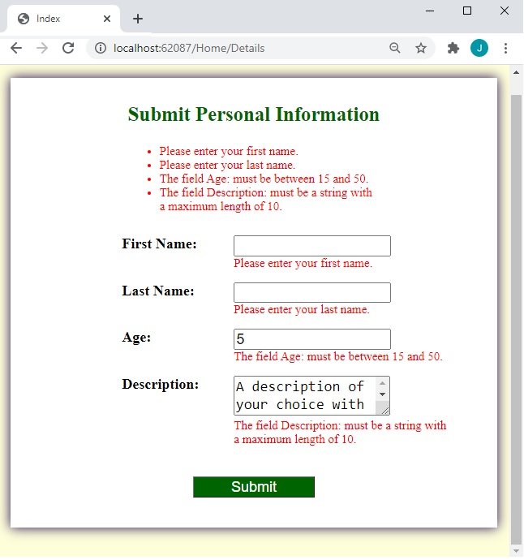

23. En la página **Submit Personal Information**, en el cuadro **First Name**, escriba **&lt;Un nombre de su elección con al menos un carácter&gt;**.

24. En la casilla **Apellido**, escriba **&lt;A last name of your choice at least one character&gt;**.

25. En la casilla **Edad**, escriba **20**.

26. En la casilla **Descripción**, escriba **&lt;A description of your choice with less than ten characters&gt;**, y luego haga clic en **Submit**.

- La representación visual del codigo del ejercicio se muestra en la siguiente imagen:

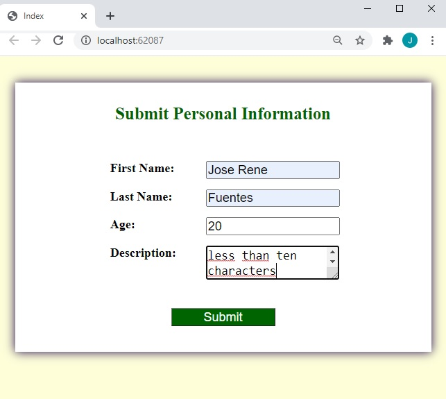

    > **Nota**: La ventana del navegador muestra la vista **Detalles.cshtml** con la información personal recién enviada.

- La representación visual del codigo del ejercicio se muestra en la siguiente imagen:

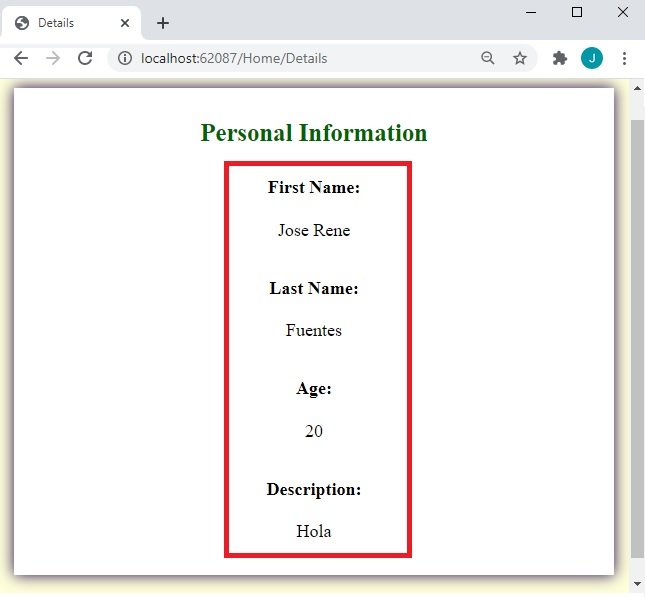

27. En Microsoft Edge, haga clic en **Cerrar**.

28.En la ventana **DataAnnotationsExample - Microsoft Visual Studio**, en el menú **FILE**, haga clic en **Salir**.

# Lección 3: Validación de las aplicaciones MVC

### Demonstration: Cómo añadir validaciones personalizadas

#### Pasos de preparación 

Asegúrate de que has clonado el directorio 20486D de GitHub (**https://github.com/MicrosoftLearning/20486D-DevelopingASPNETMVCWebApplications/tree/master/Allfiles**). Contiene los segmentos de código para los laboratorios y demostraciones de este curso. 


#### Pasos de la demostración

1. Ve a **[Repository Root]\Allfiles\Mod06\Democode\04_DataAnnotationsCustomValidationExample_begin**, y luego haz doble clic en **DataAnnotationsExample.sln**.

    >**Nota**: Si aparece un cuadro de diálogo **Aviso de seguridad para datosAnotacionesEjemplo**, verifique que la casilla de verificación **Aviso para cada proyecto de esta solución** esté desactivada, y luego haga clic en OK.

2. En la ventana **DataAnnotationsExample - Microsoft Visual Studio**, en **Solution Explorer**, haga clic con el botón derecho en **DataAnnotationsExample**, apunte a **Add**, y luego haga clic en **New Folder**.

3. En el cuadro **Nueva Carpeta**, escriba **Validadores**, y luego presione Enter.

4. En la ventana **DataAnnotationsExample - Microsoft Visual Studio**, en **Solution Explorer**, haz clic con el botón derecho del ratón en **Validators**, apunta a **Add**, y luego haz clic en **Class**.

5. En el cuadro de diálogo **Agregar nuevo elemento - Ejemplo de anotaciones de datos**, en el cuadro **Nombre**, escriba **Atributo de validación de la universidad**, y luego haga clic en **Agregar**.

6. En la ventana de código **InUniversityValidationAttribute.cs**, localice el siguiente código:
  ```cs
      using System.Threading.Tasks;
  ```
7. Asegúrate de que el cursor está al final del espacio de nombres **System.Threading.Tasks**, presiona Enter, y luego escribe el siguiente código:
  ```cs
      using DataAnnotationsExample.Models;
      using System.ComponentModel.DataAnnotations;
  ```
8. En la ventana del código **InUniversityValidationAttribute.cs**, localice el siguiente código:
  ```cs
      public class InUniversityValidationAttribute
  ```
9.  Añada el siguiente código a la línea de código existente.
  ```cs
      : ValidationAttribute
  ```

10. En el bloque de código **InUniversityValidationAttribute.cs**, presione Enter, y luego escriba el siguiente código:
  ```cs
      protected override ValidationResult IsValid(object value, ValidationContext validationContext)
      {
      }
  ```

11. En el bloque de código del método **IsValid**, presione Enter, y luego escriba el siguiente código:
  ```cs
      Student student = (Student)validationContext.ObjectInstance;
      if (!student.UniversityStudent)
      {
         return new ValidationResult("Sorry you must be a student of the university in order to submit");
      }
      return ValidationResult.Success;
  ```

- La representación visual del codigo del ejercicio se muestra en la siguiente imagen:

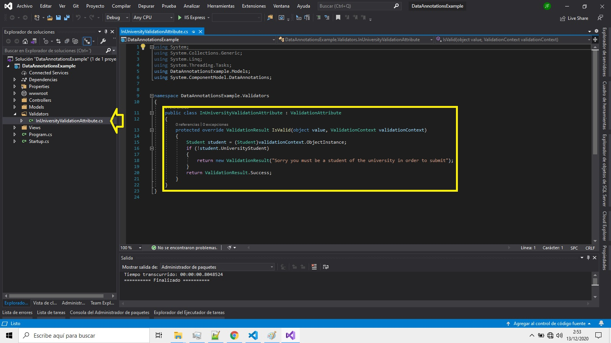

>**Nota**: Este bloque de código valida si el estudiante es universitario o no.

12. En la ventana **DataAnnotationsExample - Microsoft Visual Studio**, en **Solution Explorer**, expandir **Models**, y luego hacer clic en **Student.cs**.

13. En la ventana de código **Student.cs**, localice el siguiente código:
  ```cs
      using System.Threading.Tasks;
  ```
14. Asegúrate de que el cursor está al final del espacio de nombres **System.Threading.Tasks**, presiona Enter, y luego escribe el siguiente código:
  ```cs
      using DataAnnotationsExample.Validators;
  ```

15. En la ventana del código **Student.cs**, coloque el cursor al final del código de propiedad **Birthdate**, presione Enter dos veces, y luego escriba el siguiente código:

  ```cs
      [Display(Name = "Are you a university student?")]
      [InUniversityValidation]
  
  ```

- La representación visual del codigo del ejercicio se muestra en la siguiente imagen:

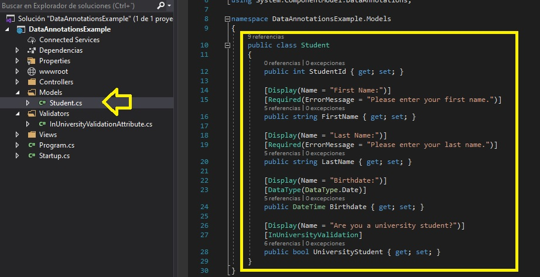

16. En la ventana **DataAnnotationsExample - Microsoft Visual Studio**, en el menú **FILE**, haga clic en **Save All**.

17. En el menú **DEBUG**, haga clic en **Iniciar sin depuración**.

18. En la página **Someta la información del estudiante**, en el cuadro **Nombre**, escriba **&lt;Un nombre de pila de su elección con al menos un carácter&gt;**.

19. En la casilla **Apellido**, escriba **&lt;Un apellido de su elección con al menos un carácter&gt;**.

20. En la casilla **Fecha de nacimiento**, elija **&lt;Una fecha de nacimiento de su elección&gt;**.

21. Asegúrese de que la casilla de verificación **¿Es usted estudiante universitario?** no esté seleccionada, y luego haga clic en **Submit**.

- La representación visual del codigo del ejercicio se muestra en la siguiente imagen:

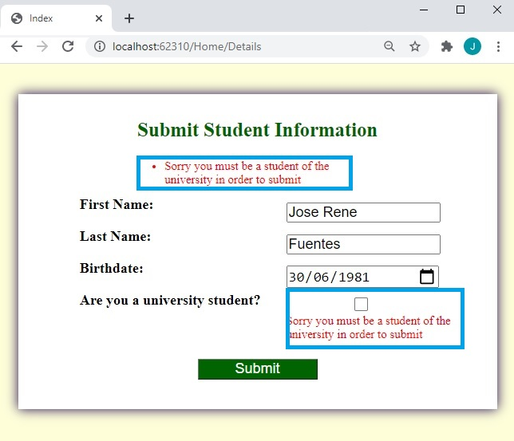

  > **Nota**: La ventana del navegador muestra la vista **Index.cshtml** con el mensaje de validación personalizado debajo de la casilla de verificación **¿Es usted un estudiante universitario?**.

22. Asegúrese de que la casilla de verificación **¿Es usted un estudiante universitario?** esté seleccionada, y luego haga clic en **Enviar**. 
- La representación visual del codigo del ejercicio se muestra en la siguiente imagen:

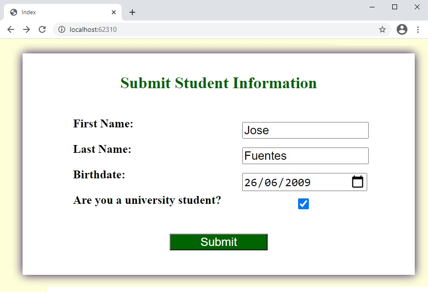

      >**Nota**: Verificar la información del estudiante recién enviado.
- La representación visual del codigo del ejercicio se muestra en la siguiente imagen:

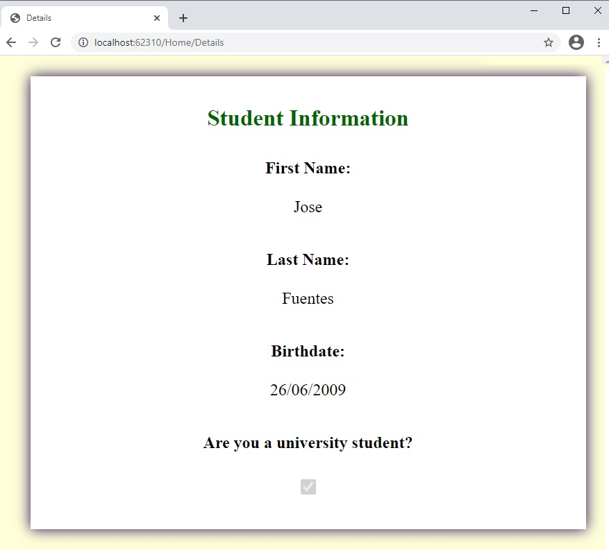

23. En Microsoft Edge, haga clic en **Cerrar**.

24. En la ventana **DataAnnotationsExample - Microsoft Visual Studio**, en el menú **FILE**, haga clic en **Salir**.


