# Module 7: Usando Entity Framework Core en ASP.NET Core

Siempre cuando un camino comienza con  *[Repository Root]*, reemplacelo con el camino absoluto en el que el repositorio 20486 reside. Por ejemplo, si tu has cloneado o extraido el repositorio 20486 en la carpeta **C:\Users\John Doe\Downloads\20486**, cambiar la ruta de: **[Repository Root]\AllFiles\20486D\Mod01** a **C:\Users\John Doe\Downloads\20486\AllFiles\20486D\Mod01**.

Fichero de Instrucciones: Instructions\20486D_MOD05_LAK.md

**Información:**

1. **Nombres y apellidos:** José René Fuentes Cutz
2. **Fecha:** 24 de Noviembre 2020.
3. **Resumen del Ejercicio:** Este laboratorio consta de 2 ejercicio:
- En el Primer ejercicio nos ayuda a  crear Controllers MVC que implementen acciones comunes para la clase de modelo **City** de la aplicación.
- En el Segundo ejercicio nos ayuda a entender como podemos registrar nuevas rutas personalizadas en el canal de solicitud de Controllers de la aplicación..
- En el Tercer ejercicio creamos una clase de filtro de acción que registre los detalles de las acciones, los Controllers y los parámetros en un archivo externo cada vez que se llame a una acción..

4. **Dificultad o problemas presentados y como se resolvieron:** Ninguno.

**NOTA**: Si no hay descripcion de problemas o dificultades, y al yo descargar el código para realizar la comprobacion y el código no funcionar, el resultado de la califaciación del laboratorio será afectado.

---


# Lección 2: Trabajando con el Entity Framework Core

### Demonstration: Cómo utilizar el Entity Framework Core

#### Pasos de preparación 

Asegúrate de que has clonado el directorio 20486D de GitHub (**https://github.com/MicrosoftLearning/20486D-DevelopingASPNETMVCWebApplications/tree/master/Allfiles**). Contiene los segmentos de código para los laboratorios y demostraciones de este curso. 

#### Pasos de la demostración

1. Ve a **[Repository Root]\Allfiles\Mod07\Democode\01_EntityFrameworkExample_begin**, y luego haz doble clic en **EntityFrameworkExample.sln**.

    >**Nota**: Si aparece un cuadro de diálogo **Advertencia de seguridad para EntityFrameworkExample**, verifique que la casilla de verificación **Ask me for every project in this solution** (Preguntarme por cada proyecto de esta solución) esté desactivada y luego haga clic en OK.

2. En la ventana **EntityFrameworkExample - Microsoft Visual Studio**, en **Solution Explorer**, haga clic con el botón derecho en **EntityFrameworkExample**, y luego haga clic en **Manage NuGet Packages**.

3. En el **Gestor de paquetes NuGet: EntityFrameworkExample**, haga clic en **Browse**.

4. En el cuadro **Búsqueda**, escriba **Microsoft.EntityFrameworkCore.Sqlite**, y luego presione Enter.

5. Haga clic en **Microsoft.EntityFrameworkCore.Sqlit**, seleccione la versión **2.1.0** y, a continuación, haga clic en **Instalar**.

6. Si aparece un cuadro de diálogo **Vista previa de los cambios**, haga clic en **OK**.

7. Si aparece un cuadro de diálogo **Aceptación de licencia**, haga clic en **Acepto**.

8. Cierre el Administrador de paquetes **NuGet: EntityFrameworkExample**.

- La representación visual del codigo del ejercicio se muestra en la siguiente imagen:

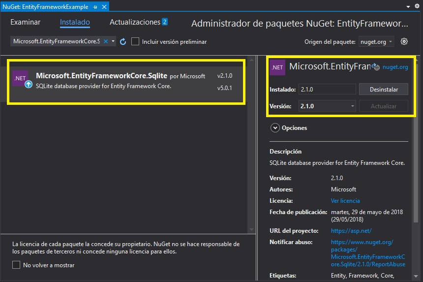

9. 9. En la ventana **EntityFrameworkExample - Microsoft Visual Studio**, en **Solution Explorer**, expanda **Data**, y luego haga clic en **PersonContext.cs**.

10. En la ventana del código **PersonContext.cs**, localice el siguiente código:
  ```cs
      using System.Threading.Tasks;
  ```

11. Asegúrate de que el cursor está al final del espacio de nombres **System.Threading.Tasks**, presiona Enter, y luego escribe el siguiente código:
  ```cs
      using EntityFrameworkExample.Models;
      using Microsoft.EntityFrameworkCore;
  ```

12. En la ventana del código **PersonContext.cs**, localice el siguiente código:
  ```cs
      public class PersonContext
  ```

13. Añada el siguiente código a la línea de código existente:
  ```cs
      : DbContext
  ```

14. En el bloque de código **PersonContext.cs**, coloque el cursor después del segundo signo **{** (abra las abrazaderas), pulse Intro, y luego escriba el siguiente código:
  ```cs
      public PersonContext(DbContextOptions<PersonContext> options) 
          : base(options)
      {
      }

      public DbSet<Person> People { get; set; }
  ```
 
15. Ponga el cursor inmediatamente después del último signo escrito **}** (cerrando las llaves), presione Enter dos veces, y luego escriba el siguiente código:
  ```cs
      protected override void OnModelCreating(ModelBuilder modelBuilder)
      {
          modelBuilder.Entity<Person>().HasData(
            new Person
            {
                PersonId = 1,
                FirstName = "Tara",
                LastName = "Brewer",
                City = "Ocala",
                Address = "317 Long Street"
            },
            new Person
            {
                PersonId = 2,
                FirstName = "Andrew",
                LastName = "Tippett",
                City = "Anaheim",
                Address = "3163 Nickel Road"
            });
      }
  ```

- La representación visual del codigo del ejercicio se muestra en la siguiente imagen:

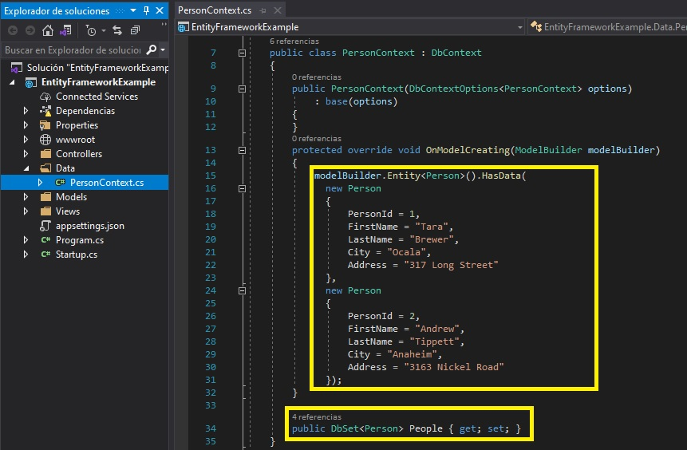

16. En la ventana **EntityFrameworkExample - Microsoft Visual Studio**, en **Solution Explorer**, haga clic en **Startup.cs**.

17. En la ventana del código **Startup.cs**, localice el siguiente código:
  ```cs
      using Microsoft.Extensions.DependencyInjection;
  ```

18. Asegúrate de que el cursor está al final del espacio de nombres **Microsoft.Extensions.DependencyInjection**, presiona Enter y luego escribe el siguiente código:

  ```cs
      using Microsoft.EntityFrameworkCore;
      using EntityFrameworkExample.Data;
  ```


19. En la ventana del código **Startup.cs**, en el método **ConfigureServices**, coloque el cursor después del signo **{** (abrazaderas), presione Enter, escriba el siguiente código y luego presione Enter.
  ```cs
      services.AddDbContext<PersonContext>(options =>
             options.UseSqlite("Data Source=person.db"));
  ```

20. En la ventana del código **Startup.cs**, seleccione el siguiente código:
  ```cs
       public void Configure(IApplicationBuilder app)
  ```
21. Reemplazar el código seleccionado por el siguiente código:
  ```cs
       public void Configure(IApplicationBuilder app, PersonContext personContext)
  ```

22. En la ventana del código **Startup.cs**, en el método **Configurar**, coloque el cursor después del primer signo **{** (abrazaderas), pulse Intro, escriba el siguiente código y luego pulse Intro.
  ```cs
      personContext.Database.EnsureDeleted();
      personContext.Database.EnsureCreated();
  ```

- La representación visual del codigo del ejercicio se muestra en la siguiente imagen:

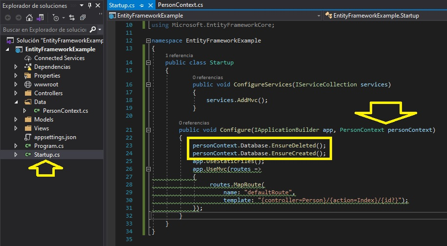

23. En la ventana **EntityFrameworkExample - Microsoft Visual Studio**, en **Solution Explorer**, expanda **Controllers**, y luego haga clic en **PersonController.cs**.

24. En la ventana de código de **PersonController.cs**, localice el siguiente código:
  ```cs
      using Microsoft.AspNetCore.Mvc;
  ```
25. Asegúrate de que el cursor está al final del espacio de nombres **Microsoft.AspNetCore.Mvc**, presiona Enter, y luego escribe el siguiente código:
  ```cs
      using EntityFrameworkExample.Data;
      using EntityFrameworkExample.Models;
  ```

26. En el bloque de código **PersonController.cs**, coloque el cursor después del segundo signo **{** (abrazaderas), pulse Intro, escriba el siguiente código y luego pulse Intro.
  ```cs
      private readonly PersonContext _context;

      public PersonController(PersonContext context)
      {
         _context = context;
      }
  ```

27. En el bloque de código **PersonController.cs**, en el bloque de código de acción **Index**, seleccione el siguiente código:
  ```cs
       return View();
  ```

28. Reemplazar el código seleccionado por el siguiente código:
  ```cs
       return View(_context.People.ToList());
  ```

29. Asegúrate de que el cursor está al final del bloque de código de acción **Index**, presiona Enter dos veces, y luego escribe el siguiente código:
  ```cs
       public IActionResult Edit(int id)
       {
       }
  ```

30. En el bloque de código de acción **Editar**, escriba el siguiente código:
  ```cs
       var person = _context.People.SingleOrDefault(m => m.PersonId == id);
       person.FirstName = "Brandon";
       _context.Update(person);
       _context.SaveChanges();
       return RedirectToAction(nameof(Index));
  ```

31. Asegúrate de que el cursor está al final del bloque de código de acción **Editar**, pulsa Intro dos veces, y luego escribe el siguiente código:
  ```cs
       public IActionResult Create()
       {
       }
  ```

32. En el bloque de código de acción **Crear**, escriba el siguiente código:
  ```cs
       _context.Add(new Person() { FirstName = "Robert", LastName = "Berends", City = "Birmingham", Address = "2632 Petunia Way" });
       _context.SaveChanges();
       return RedirectToAction(nameof(Index));
  ```

33. Asegúrate de que el cursor está al final del bloque de código de acción **Crear**, pulsa Intro dos veces, y luego escribe el siguiente código:
  ```cs
       public IActionResult Delete(int id)
       {
       }
  ```

34. En el bloque de código de acción **Borrar**, escriba el siguiente código:
  ```cs
      var person = _context.People.SingleOrDefault(m => m.PersonId == id);
      _context.People.Remove(person);
      _context.SaveChanges();
      return RedirectToAction(nameof(Index));
  ```
- La representación visual del codigo del ejercicio se muestra en la siguiente imagen:

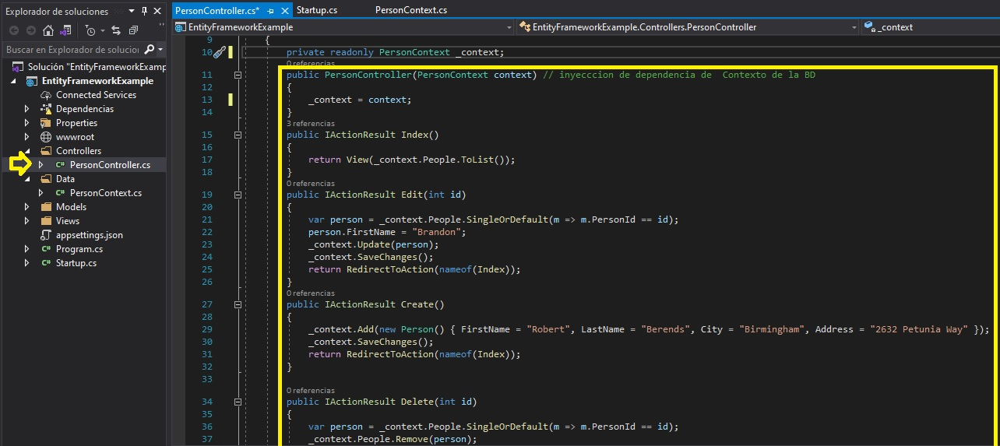

35. En la ventana **EntityFrameworkExample - Microsoft Visual Studio**, en el menú **FILE**, haga clic en **Save All**.

36. En el menú **DEBUG**, haga clic en **Iniciar sin depuración**.

- La representación visual del codigo del ejercicio se muestra en la siguiente imagen:

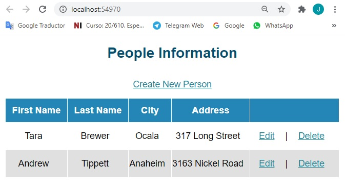

37. En el borde de Microsoft, haga clic en **Crear nueva persona**.


- La representación visual del codigo del ejercicio se muestra en la siguiente imagen:

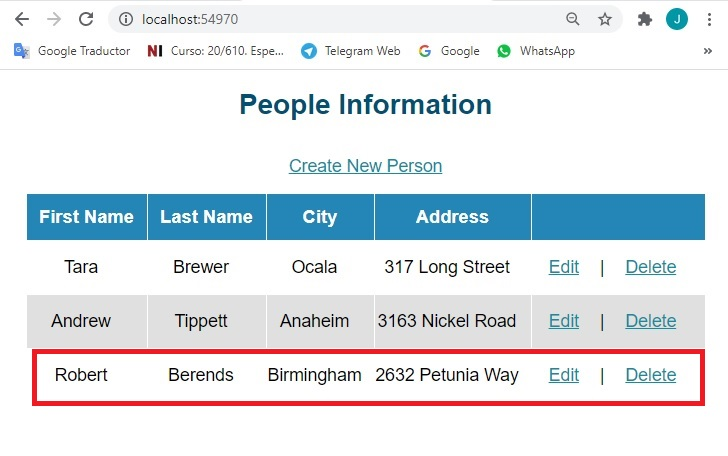

38. Selecciona una persona de tu elección, y luego haz clic en **Editar**.

- La representación visual del codigo del ejercicio se muestra en la siguiente imagen:

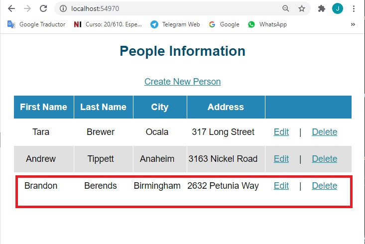

39. Seleccione una persona de su elección, y luego haga clic en **Borrar**.
- La representación visual del codigo del ejercicio se muestra en la siguiente imagen:


40. En Microsoft Edge, haz clic en **Cerrar**.

41. En la ventana **EntityFrameworkExample - Microsoft Visual Studio**, en el menú **FILE**, haga clic en **Salir**.

# Lección 3: Uso del núcleo de Entity Framework para conectarse a Microsoft SQL Server

### Demonstration: Cómo aplicar el patrón del repositorio

#### Pasos de preparación 

Asegúrate de que has clonado el directorio 20486D de GitHub (**https://github.com/MicrosoftLearning/20486D-DevelopingASPNETMVCWebApplications/tree/master/Allfiles**). Contiene los segmentos de código para los laboratorios y demostraciones de este curso. 

#### Pasos de la demostración

1. Ve a **[Repository Root]\Allfiles\Mod07\Democode\02_RepositoryExample_begin**, y luego haz doble clic en **EntityFrameworkExample.sln**.

    >**Nota**: Si aparece un cuadro de diálogo **Advertencia de seguridad para EntityFrameworkExample**, verifique que la casilla de verificación **Ask me for every project in this solution** (Preguntarme por cada proyecto de esta solución) esté desactivada y luego haga clic en OK.

2. En la ventana **EntityFrameworkExample - Microsoft Visual Studio**, en **Solution Explorer**, expanda **Repositorios**, y luego haga clic en **IRepository.cs**.

3. En la ventana del código de **IRepository.cs**, localiza el siguiente código:

  ```cs
      using System.Threading.Tasks;
  ```


4. Asegúrate de que el cursor está al final del espacio de nombres **System.Threading.Tasks**, presiona Enter, y luego escribe el siguiente código:
  ```cs
      using EntityFrameworkExample.Models;
  ```

5. En el bloque de código **IRepository.cs**, coloque el cursor después del segundo signo **{** (abra abrazaderas), pulse Intro, y luego escriba el siguiente código:
  ```cs
      IEnumerable<Person> GetPeople();
      void CreatePerson();
      void UpdatePerson(int id);
      void DeletePerson(int id);
  ```
  - La representación visual del codigo del ejercicio se muestra en la siguiente imagen:

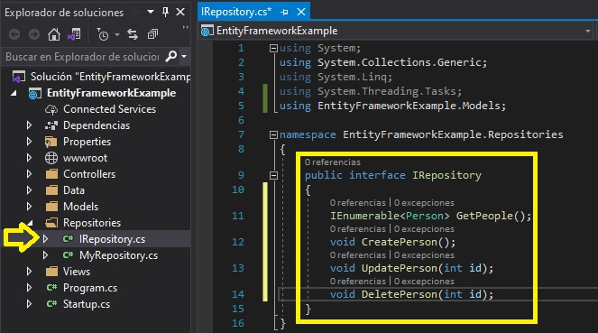

6. En la ventana **EntityFrameworkExample - Microsoft Visual Studio**, en **Solution Explorer**, en **Repositorios**, haga clic en **MiRepositorio.cs**.

7. En la ventana de código **MyRepository.cs**, localice el siguiente código:
  ```cs
      using System.Threading.Tasks;
  ```

8. Asegúrate de que el cursor está al final del espacio de nombres **System.Threading.Tasks**, presiona Enter, y luego escribe el siguiente código:
  ```cs
      using EntityFrameworkExample.Data;
      using EntityFrameworkExample.Models;
  ```
9. En la ventana del código **MyRepository.cs**, localice el siguiente código:
  ```cs
      public class MyRepository
  ```
10. Añada el siguiente código a la línea de código existente:
  ```cs
      : IRepository
  ```

11. En el bloque de código **MyRepository.cs**, coloque el cursor después del segundo signo **{** (abra abrazaderas), pulse Intro, y luego escriba el siguiente código:
  ```cs
      private PersonContext _context;

      public MyRepository(PersonContext context)
      {
            _context = context;
      }
  ```
12. Asegúrate de que el cursor está al final del bloque de código **constructor**, presiona Enter dos veces, y luego escribe el siguiente código:
  ```cs
      public IEnumerable<Person> GetPeople()
      {
           return _context.People.ToList();
      }
  ```

13. Asegúrate de que el cursor está al final del bloque de código del método **GetPeople**, presiona Enter dos veces, y luego escribe el siguiente código:
  ```cs
      public void CreatePerson()
      {
           _context.Add(new Person() { FirstName = "Robert ", LastName = "Berends", City = "Birmingham", Address = "2632 Petunia Way" });
           _context.SaveChanges();
      }
  ```

14. Asegúrate de que el cursor está al final del bloque de código del método **CreatePerson**, presiona Enter dos veces, y luego escribe el siguiente código:
  ```cs
      public void UpdatePerson(int id)
      {
           var person = _context.People.SingleOrDefault(m => m.PersonId == id);
           person.FirstName = "Brandon";
           _context.Update(person);
           _context.SaveChanges();
      }
  ```
15. Asegúrate de que el cursor está al final del bloque de código del método **UpdatePerson**, presiona Enter dos veces, y luego escribe el siguiente código:
  ```cs
      public void DeletePerson(int id)
      {
          var person = _context.People.SingleOrDefault(m => m.PersonId == id);
          _context.People.Remove(person);
          _context.SaveChanges();
      }
  ```

  - La representación visual del codigo del ejercicio se muestra en la siguiente imagen:

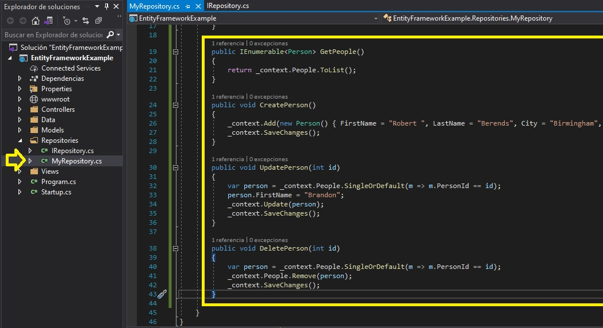

16. En la ventana **EntityFrameworkExample - Microsoft Visual Studio**, en **Solution Explorer**, haga clic con el botón derecho en **EntityFrameworkExample**, apunte a **Add**, y luego haga clic en **New Item**.

17. En Navegación, en **Instalado**, haz clic en **Centro ASP.NET**. 18. En el panel de resultados, haga clic en **Archivo de configuración de la aplicación**, y luego haga clic en **Agregar**.

18. En la ventana de código **appsettings.json**, seleccione el siguiente código:
  ```cs
      "DefaultConnection": "Server=(localdb)\\MSSQLLocalDB;Database=_CHANGE_ME;Trusted_Connection=True;MultipleActiveResultSets=true"
  ```

19. Reemplace el código seleccionado por el siguiente código:
  ```cs
      "DefaultConnection": "Server=(localdb)\\MSSQLLocalDB;Database=PersonDB;Trusted_Connection=True;MultipleActiveResultSets=true"
  ``` 
  - La representación visual del codigo del ejercicio se muestra en la siguiente imagen:

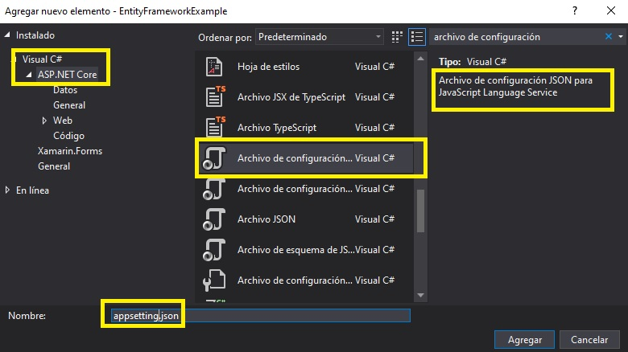

20. En la ventana **EntityFrameworkExample - Microsoft Visual Studio**, en **Solution Explorer**, haga clic en **Startup.cs**.

21. En la ventana del código **Startup.cs**, localice el siguiente código:
  ```cs
      using Microsoft.Extensions.DependencyInjection;
  ```

22. Asegúrate de que el cursor está al final del espacio de nombres **Microsoft.Extensions.DependencyInjection**, presiona Enter, y luego escribe el siguiente código:
  ```cs
      using EntityFrameworkExample.Data;
      using Microsoft.EntityFrameworkCore;
      using EntityFrameworkExample.Repositories;
  ```

23. En la ventana del código **Startup.cs**, en el método **ConfigureServices**, coloque el cursor después del signo **{** (abrazaderas), presione Enter, escriba el siguiente código y luego presione Enter.

  ```cs
      services.AddDbContext<PersonContext>(options =>
                 options.UseSqlServer(_configuration.GetConnectionString("DefaultConnection")));

      services.AddScoped<IRepository, MyRepository>();
  ```


24. In the **Startup.cs** code window, select the following code:
  ```cs
       public void Configure(IApplicationBuilder app)
  ```
25. Replace the selected code with the following code:
  ```cs
       public void Configure(IApplicationBuilder app, PersonContext personContext)
  ```

26. In the **Startup.cs** code window, in the **Configure** method, place the cursor after the **{** (opening braces) sign, press Enter, type the following code, and then press Enter.
  ```cs
      personContext.Database.EnsureDeleted();
      personContext.Database.EnsureCreated();
  ```
  - La representación visual del codigo del ejercicio se muestra en la siguiente imagen:

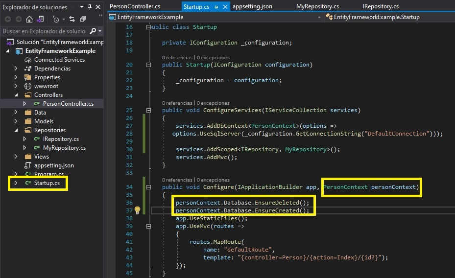

27. In the **EntityFrameworkExample - Microsoft Visual Studio** window, in **Solution Explorer**, expand **Controllers**, and then click **PersonController.cs**.

28. In the **PersonController.cs** code window, locate the following code:
  ```cs
      using Microsoft.AspNetCore.Mvc;
  ```

29. Ensure that the cursor is at the end of the  **Microsoft.AspNetCore.Mvc** namespace, press Enter, and then type the following code:
  ```cs
      using EntityFrameworkExample.Repositories;
  ```

30. In the **PersonController.cs** code block, place the cursor after the second **{** (opening braces) sign, press Enter, type the following code, and then press Enter.
  ```cs
      private IRepository _repository;

      public PersonController(IRepository repository)
      {
           _repository = repository;
      }
  ```

31. In the **PersonController.cs** code block, in the **Index** action code block, select the following code:
  ```cs
       return View();
  ```
32. Replace the selected code with the following code:
  ```cs
       var list = _repository.GetPeople();
       return View(list);
  ```
33. Ensure that the cursor is at the end of the **Index** action code block, press Enter two times, and then type the following code:
  ```cs
       public IActionResult Create()
       {
       }
  ```

34. In the **Create** action code block, type the following code:
  ```cs
       _repository.CreatePerson();
       return RedirectToAction(nameof(Index));
  ```

35. Ensure that the cursor is at the end of the **Create** action code block, press Enter two times, and then type the following code:
  ```cs
       public IActionResult Edit(int id)
       {
       }
  ```

36. In the **Edit** action code block, type the following code:
  ```cs
       _repository.UpdatePerson(id);
       return RedirectToAction(nameof(Index));
  ```

37. Ensure that the cursor is at the end of the **Edit** action code block, press Enter two times, and then type the following code:
  ```cs
       public IActionResult Delete(int id)
       {
       }
  ```
38. In the **Delete** action code block, type the following code:
  ```cs
      _repository.DeletePerson(id);
      return RedirectToAction(nameof(Index));
  ```


39. In the **EntityFrameworkExample - Microsoft Visual Studio** window, on the **FILE** menu, click **Save All**.

40. On the **DEBUG** menu, click **Start Without Debugging**.

- La representación visual del codigo del ejercicio se muestra en la siguiente imagen:


41. In Microsoft Edge, click **Create New Person**.


- La representación visual del codigo del ejercicio se muestra en la siguiente imagen:


42. Select a person of your choice, and then click **Edit**.

- La representación visual del codigo del ejercicio se muestra en la siguiente imagen:


43. Select a person of your choice, and then click **Delete**.

- La representación visual del codigo del ejercicio se muestra en la siguiente imagen:


44. In Microsoft Edge, click **Close**.

45. In the **EntityFrameworkExample - Microsoft Visual Studio** window, on the **FILE** menu, click **Exit**.


