# Módulo 9: Desarrollo del lado del cliente

Siempre cuando un camino comienza con  *[Repository Root]*, reemplacelo con el camino absoluto en el que el repositorio 20486 reside. Por ejemplo, si tu has cloneado o extraido el repositorio 20486 en la carpeta **C:\Users\John Doe\Downloads\20486**, cambiar la ruta de: **[Repository Root]\AllFiles\20486D\Mod01** a **C:\Users\John Doe\Downloads\20486\AllFiles\20486D\Mod01**.

Fichero de Instrucciones: Instructions\20486D_MOD09_LAK.md

**Información:**

1. **Nombres y apellidos:** José René Fuentes Cortez
2. **Fecha:** 24 de Diciembre 2020.
3. **Resumen del Ejercicio:** Este laboratorio consta de 3 ejercicios:
- En el Primer ejercicio usamos gulp para copiar, empaquetar y minificar archivos JavaScript, y añadir tareas de vigilancia.
- En el Segundo ejercicio nos ayuda a crear los archivos Sass y añadir tareas gulp para compilarlos, agruparlos y minarlos.
- En el Tercer ejercicio creamos una aplicación para la compañía de helados en la que los usuarios pueden ver los detalles de los helados, y también comprar algunos.

4. **Dificultad o problemas presentados y como se resolvieron:** Ninguno.

**NOTA**: Si no hay descripcion de problemas o dificultades, y al yo descargar el código para realizar la comprobacion y el código no funcionar, el resultado de la califaciación del laboratorio será afectado.

---

# Laboratorio: Desarrollo del lado del cliente

### Configuración del Lab

Tiempo estimado: **60 minutos**

### Preparation Steps

1. Asegúrate de que has clonado el directorio **20486D** de GitHub. Contiene los segmentos de código para los laboratorios y demostraciones de este curso. 
**(https://github.com/MicrosoftLearning/20486D-DevelopingASPNETMVCWebApplications/tree/master/Allfiles)**

### Ejercicio 1: Usando el trago para ejecutar las tareas 

#### Tarea 1: Usar npm para instalar gulp

1. En el Explorador de Archivos, navega a **[Repository Root]\Allfiles\Mod09\Labfiles\01_IceCreamCompany_begin\IceCreamCompany** y luego copia la dirección en la barra de direcciones.

2. Selecciona el botón **Inicio**, y luego escribe **cmd**.

3. En **Best match**, haga clic con el botón derecho **Command Prompt**, y luego haga clic en **Run as administrator**.

4. En el cuadro de diálogo **Control de cuentas de usuario**, haga clic en **Sí**.

5. En el cuadro de diálogo **Administrador: Command Prompt**, escriba el siguiente comando y luego pulse Intro.
  ```cs
       cd {copia de la ruta de la carpeta}
  ```

>**Nota**: Si la *{Directorio Raíz de la carpeta copiada }* es diferente de la unidad de disco en la que se encuentra el símbolo del sistema, deberá escribir *{pista de disco}:* antes de escribir el comando **cd** *{Directorio Raíz de la carpeta copiada }*.

6. En el **Administrador: Command Prompt**, escriba el siguiente comando y, a continuación, pulse Intro.
  ```cs
       npm instalar
  ```
>**Nota**: Si se muestran mensajes de advertencia en la línea de comandos, puede ignorarlos.

- La representación visual del codigo del ejercicio se muestra en la siguiente imagen:

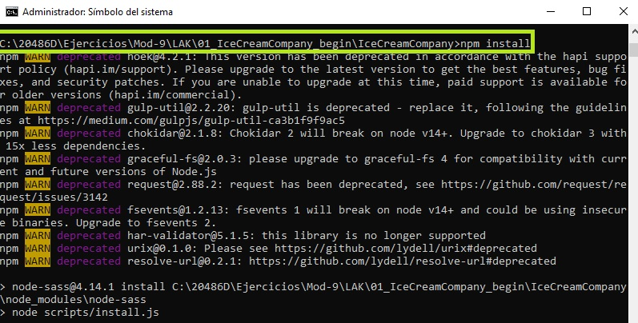

7. Cierre la ventana.

8. En el Explorador de Archivos, navega a **[Repository Root]\Allfiles\Mod09\Labfiles\01_IceCreamCompany_begin**, y luego haz doble clic en **IceCreamCompany.sln**.

    >**Nota**: Si aparece un cuadro de diálogo de **Aviso de Seguridad para IceCreamCompany**, verifique que la casilla de verificación **Pregúntame por cada proyecto de esta solución** esté despejada, y luego haga clic en OK.

9. En la ventana **IceCreamCompany - Microsoft Visual Studio**, en el menú **TOOLS**, haga clic en **Opciones**.

10. En el cuadro de diálogo **Opciones**, en la casilla **Opciones de búsqueda**, escriba **Gestión de paquetes web**, y luego pulse Intro.

11. En el cuadro de lista **Ubicaciones de herramientas externas**, seleccione **$(PATH)**, presione el botón de la flecha hacia arriba hasta que **$(PATH)** esté en la parte superior de la lista, y luego presione **OK**.

- La representación visual del codigo del ejercicio se muestra en la siguiente imagen:

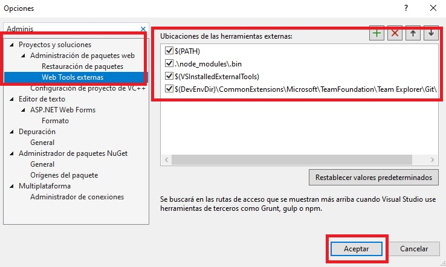

12. En la ventana **IceCreamCompany - Microsoft Visual Studio**, en el Solution Explorer, haga clic en **package.json**.

13. Examinar la ventana de código **package.json**.

      >**Nota**: Hay dependencias en los paquetes **gulp**, **gulp-concat**, **gulp-cssmin**, **gulp-sass**, **gulp-uglify** que aparecen en la sección **devDependencias** y los paquetes **bootstrap**, **hoek**, **jquery**, **lodash**, **popper.js** que aparecen en la sección **Dependencias**.

- La representación visual del codigo del ejercicio se muestra en la siguiente imagen:

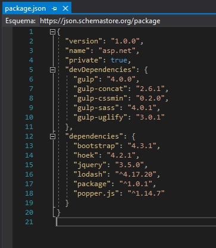

#### Tarea 2: Escribir una tarea para copiar un archivo JavaScript

1. En la ventana **IceCreamCompany - Microsoft Visual Studio**, en el Explorador de soluciones, haga clic con el botón derecho **IceCreamCompany**, apunte a **Agregar**, y luego haga clic en **Nuevo elemento**.

2. En el cuadro de diálogo **Add New Item - IceCreamCompany**, apunte a **Web**, y luego en el panel de resultados, apunte a **JavaScript File**.

3. En el cuadro de diálogo **Add New Item - IceCreamCompany**, en el cuadro **Name**, escriba **gulpfile**, y luego haga clic en **Add**.

- La representación visual del codigo del ejercicio se muestra en la siguiente imagen:

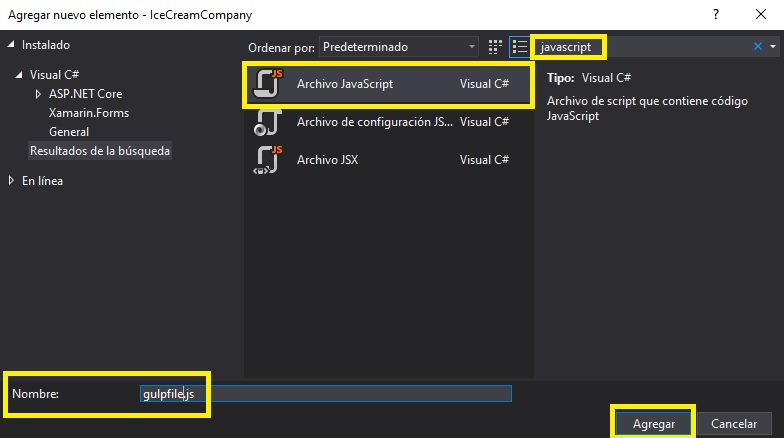

4. En la ventana de código **gulpfile.js**, escriba el siguiente código:

  ```cs
       var gulp = require('gulp');

       var paths = {
           webroot: "./wwwroot/",
           nodeModules: "./node_modules/"
       };

       paths.jqueryjs = paths.nodeModules + "jquery/dist/jquery.js";
       paths.destinationjsFolder = paths.webroot + "scripts/";

       gulp.task("copy-js-file", function() {
           return gulp.src(paths.jqueryjs)
                .pipe(gulp.dest(paths.destinationjsFolder));
       });
  ```
- La representación visual del codigo del ejercicio se muestra en la siguiente imagen:

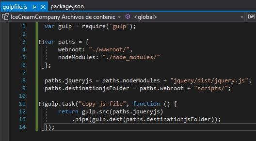

#### Tarea 3: Ejecutar la tarea

1. En la ventana de **IceCreamCompany - Microsoft Visual Studio**, en el menú **FILE**, haga clic en **Save All**.

2. En la ventana **IceCreamCompany - Microsoft Visual Studio**, en el Explorador de soluciones, haga clic con el botón derecho en **gulpfile.js**, y luego haga clic en **Task Runner Explorer**.

- La representación visual del codigo del ejercicio se muestra en la siguiente imagen:

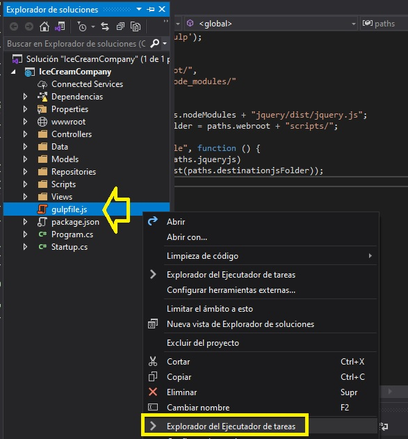

      >**Nota**: Si la lista de **Tareas** no contiene una tarea llamada **copia-js-archivo**, haga clic en **Actualizar**.

- La representación visual del codigo del ejercicio se muestra en la siguiente imagen:

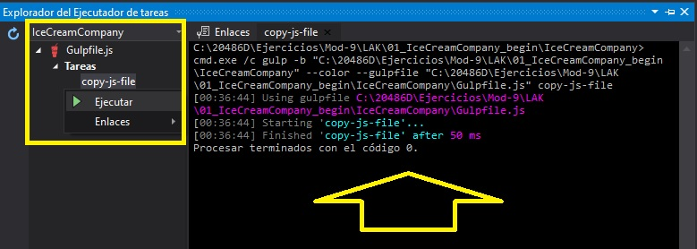

3. En **Task Runner Explorer**, en **Tasks**, haga clic con el botón derecho del ratón en **copy-js-file**, y luego haga clic en **Run**.

    >**Nota**: En Solution Explorer, en **wwwwroot**, se ha añadido una nueva carpeta llamada **scripts** con un archivo JavaScript llamado **jquery.js**

- La representación visual del codigo del ejercicio se muestra en la siguiente imagen:

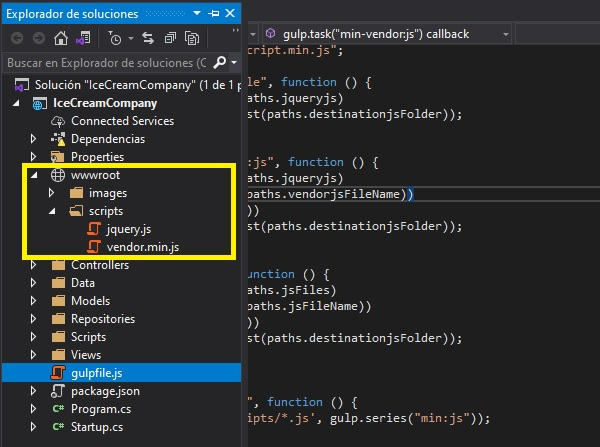

#### Tarea 4: Escribir una tarea para minificar un archivo JavaScript

1. En la ventana del código **gulpfile.js**, localice el siguiente código:
  ```cs
       var gulp = require('gulp');
  ```
2. Ponga el cursor al final del código localizado, presione Enter, y luego escriba el siguiente código:
  ```cs
       var concat = require('gulp-concat');
       var uglify = require('gulp-uglify');
  ```

3. En la ventana del código **gulpfile.js**, localice el siguiente código: 
  ```cs
       paths.destinationjsFolder = paths.webroot + "scripts/";
  ```
4. Ponga el cursor al final del código localizado, presione Enter, y luego escriba el siguiente código:
  ```cs
       paths.vendorjsFileName = "vendor.min.js";
  ```
5. En la ventana del código **gulpfile.js**, localice el siguiente código: 
  ```cs
       gulp.task("copy-js-file", function() {
           return gulp.src(paths.jqueryjs)
                .pipe(gulp.dest(paths.destinationjsFolder));
       });
  ```
6. Ponga el cursor al final del código localizado, presione Enter dos veces, y luego escriba el siguiente código:
  ```cs
       gulp.task("min-vendor:js", function() {
           return gulp.src(paths.jqueryjs)
                .pipe(concat(paths.vendorjsFileName))
                .pipe(uglify())
                .pipe(gulp.dest(paths.destinationjsFolder));
       });
  ```

#### Tarea 5: Escribir una tarea para agrupar y minificar todos los archivos JavaScript en una carpeta

1. En la ventana del código **gulpfile.js**, localice el siguiente código:
  ```cs
       paths.vendorjsNombre del archivo = "vendor.min.js";
  ```
2. Ponga el cursor al final del código localizado, presione Enter, y luego escriba el siguiente código:
  ```cs
       paths.jsFiles = "./Scripts/*.js";
       paths.jsFileName = "script.min.js";
  ```

3. En la ventana del código **gulpfile.js**, localice el siguiente código:
  ```cs
       gulp.task("min-vendor:js", function() {
           return gulp.src(paths.jqueryjs)
                .pipe(concat(paths.vendorjsFileName))
                .pipe(uglify())
                .pipe(gulp.dest(paths.destinationjsFolder));
       });
  ```
4. Ponga el cursor al final del código localizado, presione dos veces la tecla Enter y luego escriba el siguiente código:
  ```cs
       gulp.task("min:js", function() {
           return gulp.src(paths.jsFiles)
                .pipe(concat(paths.jsFileName))
                .pipe(uglify())
                .pipe(gulp.dest(paths.destinationjsFolder));
       });
  ```

#### Tarea 6: Añadir una tarea de vigilancia

1. En la ventana del código **gulpfile.js**, localice el siguiente código: 
  ```cs
      gulp.task("min:js", function() {
          return gulp.src(paths.jsFiles)
                .pipe(concat(paths.jsFileName))
                .pipe(uglify())
                .pipe(gulp.dest(paths.destinationjsFolder));
       });
  ```
2. Ponga el cursor al final del código localizado, presione Enter dos veces, y luego escriba el siguiente código:


  ```cs
      gulp.task("js-watcher", function() {
          gulp.watch('./Scripts/*.js', gulp.series("min:js"));
      });
  ```

#### Tarea 7: Ejecutar las tareas

1. En la ventana de **IceCreamCompany - Microsoft Visual Studio**, en el menú **FILE**, haga clic en **Save All**.

2. En la ventana **IceCreamCompany - Microsoft Visual Studio**, en el Explorador de soluciones, haga clic con el botón derecho en **gulpfile.js**, y luego haga clic en **Task Runner Explorer**.

      >**Nota**: Si la lista de **Tareas** no contiene las tareas **min:js**, **min-vendor:js** y **js-watcher**, haga clic en **Actualizar**.

3. En **Task Runner Explorer**, en **Tasks**, haga clic con el botón derecho en **min-vendor:js**, y luego haga clic en **Run**.

- La representación visual del codigo del ejercicio se muestra en la siguiente imagen:

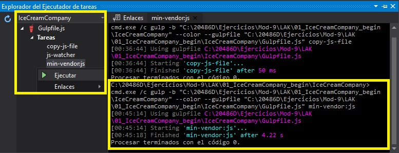
      >**Nota**: En Solution Explorer, en **wwwwroot**, en **scripts**, se ha añadido un nuevo archivo llamado **vendor.min.js**. Fíjese que este archivo es una versión minificada del archivo **jquery.js**.

4. En la ventana **IceCreamCompany - Microsoft Visual Studio**, en el Explorador de soluciones, expanda **Scripts**, y luego haga clic en **payment-calc.js**.

      >**Nota**: En la cuarta línea hay un error: **forma-control-error**.

5. En **Task Runner Explorer**, en **Tasks**, haga clic con el botón derecho **min:js**, y luego haga clic en **Run**.

- La representación visual del codigo del ejercicio se muestra en la siguiente imagen:

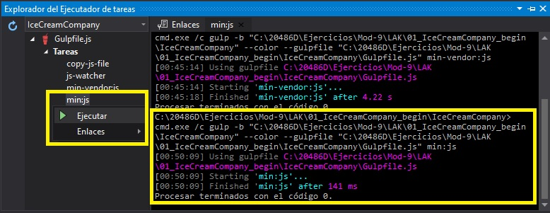

  > **Nota**: En el Solution Explorer, en **wwwwroot**, en **scripts**, se ha añadido un nuevo archivo llamado **script.min.js**.  
- La representación visual del codigo del ejercicio se muestra en la siguiente imagen:

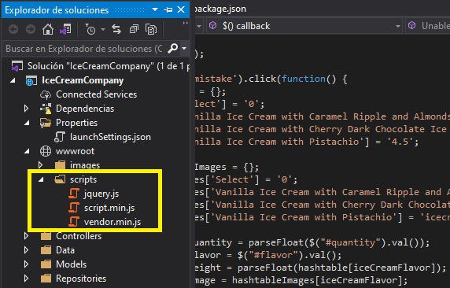

6. En la ventana **IceCreamCompany - Microsoft Visual Studio**, en el Solution Explorer, bajo **wwwwroot**, bajo **scripts**, haga clic en **script.min.js**.

      >**Nota**: El archivo **script.min.js** es una versión minificada del archivo **payment-calc.js**. Contiene la cadena **forma-control-error**.

7. En **Task Runner Explorer**, en **Tasks**, haga clic con el botón derecho del ratón en **js-watcher**, y despues hacer clic en **Run**.

- La representación visual del codigo del ejercicio se muestra en la siguiente imagen:

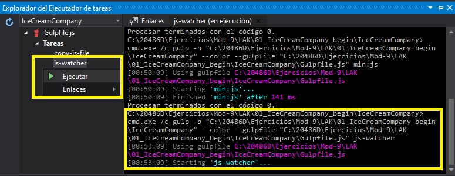

8. En la ventana **IceCreamCompany - Microsoft Visual Studio**, en el Solution Explorer, en **Scripts**, haga clic en **payment-calc.js**.

9. En la ventana del código **payment-calc.js**, seleccione el siguiente código:
  ```cs
       $('.form-control-mistake')
  ```

10. Reemplace el código seleccionado por el siguiente código:
  ```cs
       $('.form-control')
  ```


11. En la ventana de **IceCreamCompany - Microsoft Visual Studio**, en el menú **FILE**, haga clic en **Save payment-calc.js**.

12. En el cuadro de diálogo **Microsoft Visual Studio**, haga clic en **Sí a todo**.

13. En la ventana **IceCreamCompany - Microsoft Visual Studio**, en el Solution Explorer, en **wwwwroot**, en **scripts**, haga clic en **script.min.js**.

      >**Nota**: En el archivo **script.min.js**, la cadena **form-control-merror** fue reemplazada por **form-control**.
- La representación visual del codigo del ejercicio se muestra en la siguiente imagen:

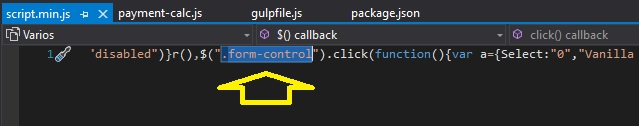

>**Resultados**: En este ejercicio, usaste gulp para copiar, empaquetar y minificar archivos JavaScript, y añadir tareas de vigilancia.

### Ejercicio 2: Estilo usando Sass 

#### Tarea 1: Añadir un nuevo archivo de Sass al proyecto

1. En la ventana **IceCreamCompany - Microsoft Visual Studio**, en el Explorador de soluciones, haga clic con el botón derecho en **IceCreamCompany**, apunte a **Agregar**, y luego haga clic en **Nueva carpeta**.

2. En el cuadro **Nueva Carpeta**, escriba **Estilos**, y luego presione Enter.

- La representación visual del codigo del ejercicio se muestra en la siguiente imagen:

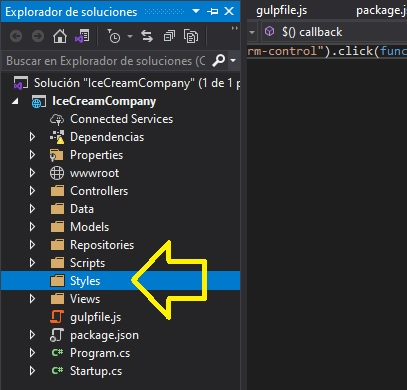

3. En la ventana **IceCreamCompany - Microsoft Visual Studio**, en el Explorador de soluciones, haga clic con el botón derecho del ratón en **Estilos**, apunte a **Agregar**, y luego haga clic en **Nuevo elemento**.

4. En el cuadro de diálogo **Add New Item - IceCreamCompany**, en el cuadro de búsqueda, escriba **scss**, y luego presione Enter.

- La representación visual del codigo del ejercicio se muestra en la siguiente imagen:

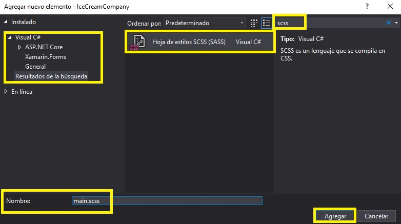

5. En el cuadro de diálogo **Agregar nuevo ítem - Compañía de Helados**, en el cuadro de búsqueda, escriba **SCSS Hoja de Estilo (SASS)**.

6. En el cuadro de diálogo **Agregar nuevo ítem - Compañía de Helados**, en el cuadro **Nombre**, escriba **principal**, y luego haga clic en **Agregar**. 

7. En la ventana **código principal.scss**, seleccione el siguiente código: 
  ```cs
       body {
       }
  ```
8. Reemplazar el código seleccionado por el siguiente código:
  ```cs
       $highlights: #124eab;

       @mixin normalized-text() {
          font-family: "Playfair Display", Arial, Tahoma, sans-serif;
          text-align: center;
       }

       @mixin normalized-image() {
          width: 100%;
          height: auto;
       }
  ```

9. En la ventana del código **main.scss**, localiza el siguiente código: 
  ```cs
       @mixin normalized-image() {
          width: 100%;
          height: auto;
       }
  ```
10. Ponga el cursor al final del código localizado, presione Enter dos veces, y luego escriba el siguiente código:

  ```cs
       div {
           h1 {
               @include normalized-text();
               font-size: 45px;
               line-height: 50px;
               font-weight: 400;
               letter-spacing: 1px;
               color: #736454;
               margin: 60px;
           }
       }

       .main-title {
           background-image: url("/images/banner-1.jpg");
           width: 100%;
           background-size: cover;
           background-position: center center;
           min-height: 400px;
           display: flex;
           flex-direction: column;
           justify-content: center;
           align-items: center;

           h1 {
               @include normalized-text();
               color: $highlights;
               font-size: 50px;
               text-shadow: 0px 2px 5px #aba8a8;
               font-weight: bolder;
               text-align: center;
           }

           button {
               @include normalized-text();
               transition: none;
               color: lighten(#ffffff,90%);
               text-align: inherit;
               line-height: 13px;
               border: 1px solid #d3c0c0;
               margin: 0px;
               padding: 12px 24px;
               letter-spacing: 0px;
               font-weight: 400;
               font-size: 16px;
               font-weight: bold;
               background-color: #736454;
           }
       }
  ```

11. Coloque el cursor inmediatamente después del último signo escrito **}** (corchete de cierre), presione Enter dos veces, y luego escriba el siguiente código:
  ```cs
       .img-container {
           display: flex;
           flex-wrap: wrap;
           justify-content: space-around;
           align-items: flex-end;

           .item {
               color: white;
               width: 200px;
               display: flex;
               flex-direction: column;
               justify-content: space-between;

               h3 {
                  @include normalized-text();
                  color: #736454;
                  font-size: 20px;
               }

               div {
                   img {
                        @include normalized-image();
                   }
               }

               div {
                   p {
                        @include normalized-text();
                        color: #736454;
                        font-size: 20px;
                        margin: 70px;
                   }
               }
           }
       }

       .container {
           .checkout {
                border: 1px solid #ccc;
                box-shadow: 0 0 5px #ccc;
                padding: 20px;
                width: 800px;
                margin: 0 auto;
                border-radius: 4px;
                background-color: #f9f9f9;

                .row justify-content-center intro-row {
                    font-weight: bold;
                }
           }
       }
  ```

12. Coloque el cursor inmediatamente después del último signo escrito **}** (corchete de cierre), presione Enter dos veces, y luego escriba el siguiente código:
  ```cs
       .justify-content-center {
           justify-content: center !important;
           align-items: center;
       }

       nav {
           width: 450px;
       }

       img {
           height: 35px;
           width: 35px;
       }

       .navbar-nav > li {
           float: left;
           position: relative;
       }

       .row {
           margin: 10px;
       }

       .imageDisplay {
           @include normalized-image();
       }
  ```

- La representación visual del codigo del ejercicio se muestra en la siguiente imagen:

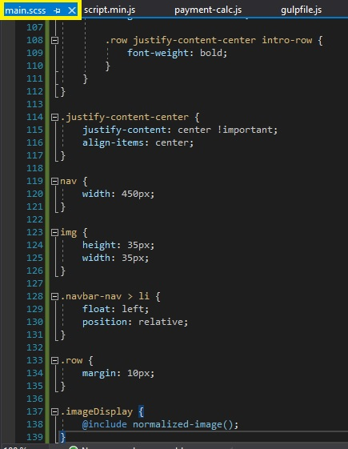

#### Tarea 2: Añadir tareas de trago para manejar los archivos de Sass 

1. En la ventana **IceCreamCompany - Microsoft Visual Studio**, en el Explorador de Soluciones, haga clic en **gulpfile.js**.

2. En la ventana del código **gulpfile.js**, localice el siguiente código:
  ```cs
       var gulp = require('gulp');
       var concat = require('gulp-concat');
       var uglify = require('gulp-uglify');
  ```
3. Ponga el cursor al final del código localizado, presione Enter, y luego escriba el siguiente código:
  ```cs
       var sass = require('gulp-sass');
       var cssmin = require('gulp-cssmin');
  ```

4. En la ventana del código **gulpfile.js**, localice el siguiente código:
  ```cs
       paths.jsFileName = "script.min.js";
  ```

5. Ponga el cursor al final del código localizado, presione Enter, y luego escriba el siguiente código:
  ```cs
       paths.sassFiles = "./Styles/*.scss";
       paths.compiledCssFileName = "main.min.css";
       paths.destinationCssFolder = paths.webroot + "css/";
  ```

6. En la ventana del código **gulpfile.js**, localice el siguiente código: 

  ```cs
       gulp.task("min:js", function() {
           return gulp.src(paths.jsFiles)
                .pipe(concat(paths.jsFileName))
                .pipe(uglify())
                .pipe(gulp.dest(paths.destinationjsFolder));
       });
  ```


7. Ponga el cursor al final del código localizado, presione Enter dos veces, y luego escriba el siguiente código:
  ```cs
       gulp.task("min:scss", function() {
           return gulp.src(paths.sassFiles)
               .pipe(sass().on('error', sass.logError))
               .pipe(concat(paths.compiledCssFileName))
               .pipe(cssmin())
               .pipe(gulp.dest(paths.destinationCssFolder));
       });
  ```
8. En la ventana del código **gulpfile.js**, localice el siguiente código: 
  ```cs
       gulp.task("js-watcher", function() {
           gulp.watch('./Scripts/*.js', gulp.series("min:js"));
       });
  ```
9. Ponga el cursor al final del código localizado, presione dos veces la tecla Enter y luego escriba el siguiente código:
  ```cs
       gulp.task("sass-watcher", function() {
           gulp.watch('./Styles/*.scss', gulp.series("min:scss"));
       });
  ```


#### Tarea 3: Ejecutar las tareas

1. En la ventana de **IceCreamCompany - Microsoft Visual Studio**, en el menú **FILE**, haga clic en **Save All**.

2. En la ventana **IceCreamCompany - Microsoft Visual Studio**, en el Explorador de soluciones, haga clic con el botón derecho en **gulpfile.js**, y luego haga clic en **Task Runner Explorer**.

      >**Nota**: Si la lista de **Tareas** no contiene las tareas **min:scss** y **sass-watcher**, haga clic en **Actualizar**.

3. En **Task Runner Explorer**, en **Tasks**, haga clic con el botón derecho **min:scss**, y luego haga clic en **Run**.

- La representación visual del codigo del ejercicio se muestra en la siguiente imagen:

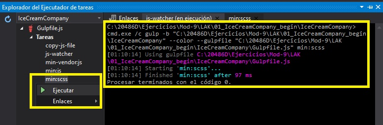

  > **Nota**: En el Solution Explorer, en **wwwwroot**, en **css**, se ha añadido un nuevo archivo css llamado **main.min.css**.

- La representación visual del codigo del ejercicio se muestra en la siguiente imagen:

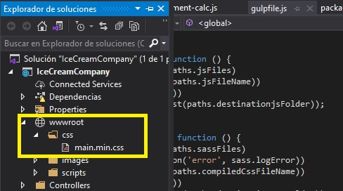

4. En **Task Runner Explorer**, en **Tasks**, haga clic con el botón derecho del ratón en **sass-watcher**, y luego haga clic en **Run**.

- La representación visual del codigo del ejercicio se muestra en la siguiente imagen:

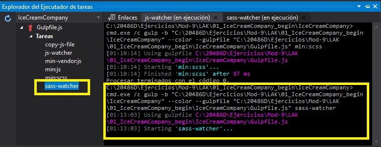

  > **Nota**: A partir de ahora cada vez que cambies el archivo **main.scss**, el archivo **main.min.css** se cambiará automáticamente.

>**Resultados**: En este ejercicio, creaste los archivos Sass y añadiste tareas gulp para compilarlos, agruparlos y minarlos.

### Ejercicio 3: Usando Bootstrap

#### Tarea 1: Actualizar gulpfile.js para manejar Bootstrap 

1. En la ventana **IceCreamCompany - Microsoft Visual Studio**, en el Explorador de Soluciones, haga clic en **gulpfile.js**.

2. En la ventana del código **gulpfile.js**, localice el siguiente código:
  ```cs
       paths.jqueryjs = paths.nodeModules + "jquery/dist/jquery.js";
  ```
3. Ponga el cursor al final del código localizado, presione Enter, y luego escriba el siguiente código:
  ```cs
       paths.popperjs = paths.nodeModules + "popper.js/dist/umd/popper.js";
       paths.bootstrapjs = paths.nodeModules + "bootstrap/dist/js/bootstrap.js";
       paths.vendorjs = [paths.jqueryjs, paths.popperjs, paths.bootstrapjs];
  ```

4. En la ventana del código **gulpfile.js**, seleccione el siguiente código: 
  ```cs
       gulp.task("min-vendor:js", function() {
           return gulp.src(paths.jqueryjs)
  ```
5. Reemplazar el código seleccionado por el siguiente código:
  ```cs
       gulp.task("min-vendor:js", function() {
           return gulp.src(paths.vendorjs)
  ```

6. En la ventana del código **gulpfile.js**, localice el siguiente código:
  ```cs
       paths.destinationCssFolder = paths.webroot + "css/";
  ```

7. Ponga el cursor al final del código localizado, presione Enter, y luego escriba el siguiente código:
  ```cs
       paths.bootstrapCss = paths.nodeModules + "bootstrap/dist/css/bootstrap.css";
       paths.vendorCssFileName = "vendor.min.css";
  ```
8. En la ventana del código **gulpfile.js**, localice el siguiente código: 
  ```cs
      gulp.task("min:scss", function() {
           return gulp.src(paths.sassFiles)
                .pipe(sass().on('error', sass.logError))
                .pipe(concat(paths.compiledCssFileName))
                .pipe(cssmin())
                .pipe(gulp.dest(paths.destinationCssFolder));
      });
  ```
9. Ponga el cursor al final del código localizado, presione dos veces la tecla Enter y luego escriba el siguiente código:

  ```cs
      gulp.task("min-vendor:css", function() {
           return gulp.src(paths.bootstrapCss)
                .pipe(concat(paths.vendorCssFileName))
                .pipe(cssmin())
                .pipe(gulp.dest(paths.destinationCssFolder));
      });
  ```

#### Tarea 2: Ejecutar las tareas

1. En la ventana de **IceCreamCompany - Microsoft Visual Studio**, en el menú **FILE**, haga clic en **Save All**.

2. En la ventana **IceCreamCompany - Microsoft Visual Studio**, en el Explorador de soluciones, haga clic con el botón derecho en **gulpfile.js**, y luego haga clic en **Task Runner Explorer**.

      >**Nota**: Si la lista de **Tareas** no contiene la tarea **min-vendor:css**, haga clic en **Actualizar**.

3. En **Task Runner Explorer**, en **Tasks**, haga clic con el botón derecho del ratón en **min-vendor:css**, y luego haga clic en **Run**.

- La representación visual del codigo del ejercicio se muestra en la siguiente imagen:

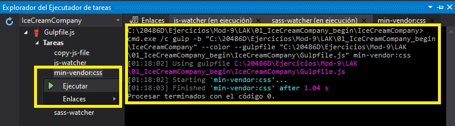

  > **Nota**: En el Solution Explorer, en **wwwwroot**, en **css**, se ha añadido un nuevo archivo css llamado **vendor.min.css**.

- La representación visual del codigo del ejercicio se muestra en la siguiente imagen:

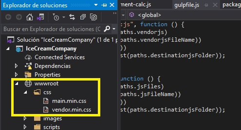

4. En **Task Runner Explorer**, en **Tasks**, haga clic con el botón derecho del ratón en **min-vendor:js**, y luego haga clic en **Run**.

- La representación visual del codigo del ejercicio se muestra en la siguiente imagen:

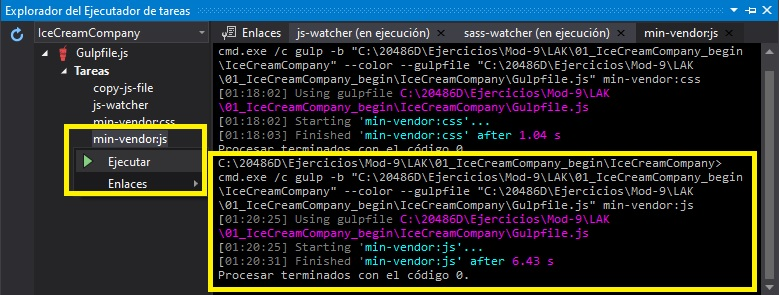

5. En el cuadro de diálogo **Microsoft Visual Studio**, haga clic en **Sí**.

      >**Nota**: En el Explorador de soluciones, en **wwwwroot**, en **scripts**, se actualizó un archivo llamado **vendor.min.js**.

#### Tarea 3: Estilizar la aplicación usando Bootstrap

1. En la ventana **IceCreamCompany - Microsoft Visual Studio**, en el Explorador de Soluciones, expanda **Vistas**, expanda **Compartido**, y luego haga clic en **_Disposición.cshtml**.

2. En la ventana de código **_Layout.cshtml**, localice el siguiente código:
  ```cs
       <title>@ViewBag.Title</title>
  ```
3. Coloque el cursor después del signo **>** (mayor que) de la etiqueta **&lt;/title&gt;**, presione Enter y luego escriba el siguiente código: 
  ```cs
       <script src="~/scripts/vendor.min.js"></script>
       <script src="~/scripts/script.min.js"></script>
       <link href="~/css/vendor.min.css" rel="stylesheet" />
       <link href="~/css/main.min.css" rel="stylesheet" />
  ```

4. En la ventana del código **_Layout.cshtml**, localice el siguiente código:
  ```cs
       <div>
           @RenderBody()
       </div>
  ```

5. Coloque el cursor antes del signo **<** (menos de) de la etiqueta **&lt;div&gt;**, pulse Intro, presione la tecla de flecha arriba y escriba el siguiente código:
  ```cs
       <div>
          <nav class="navbar navbar-expand-lg navbar-light bg-light mx-auto">
              <a class="navbar-brand" href="@Url.Action("Index", "IceCream")">
                  
                  Ice Cream of Dreams
              </a>
              <div class="collapse navbar-collapse" id="nav-content">
                  <ul class="navbar-nav" id="nav-content">
                      <li class="nav-item active">
                          <a class="nav-link" href="@Url.Action("Index", "IceCream")">Home <span class="sr-only">(current)</span></a>
                      </li>
                      <li class="nav-item">
                          <a class="nav-link" href="@Url.Action("Buy", "IceCream")">Buy Ice Cream</a>
                      </li>
                  </ul>
              </div>
          </nav>
       </div>
       <div class="main-title">
            <h1>The Best Ice Cream You Will Taste in Your Life</h1>
            <button type="button" onclick="location.href='@Url.Action("Buy", "IceCream")'">Buy Ice Cream</button>
       </div>
  ```

6. En la ventana **IceCreamCompany - Microsoft Visual Studio**, en el Explorador de Soluciones, expanda **Controladores**, y luego haga clic en **IceCreamController.cs**.

7. En la ventana de código **IceCreamController.cs**, haga clic con el botón derecho del ratón en el siguiente código, y luego haga clic en **Add View**.
  ```cs
       [HttpGet]
       public IActionResult Buy()
  ```

8. En el cuadro de diálogo **Añadir vista de MVC**, asegúrese de que el valor en el cuadro **Nombre de la vista** es **Comprar**.

9. En el cuadro de diálogo **Agregar vista MVC**, asegúrese de que la plantilla **Vacío (sin modelo)** esté seleccionada.

10. En el cuadro de diálogo **Agregar vista MVC**, asegúrese de que la casilla de verificación **Crear como una vista parcial** está desactivada y la casilla de verificación **Utilizar una página de diseño** está seleccionada y, a continuación, haga clic en **Agregar**.

- La representación visual del codigo del ejercicio se muestra en la siguiente imagen:

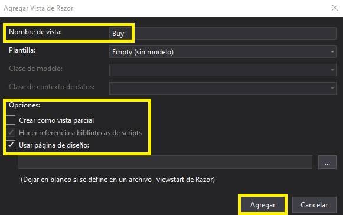

11. En la ventana de código **Buy.cshtml**, coloque el cursor al principio del documento, escriba el siguiente código y, a continuación, pulse Intro.
  ```cs
       @model IceCreamCompany.Models.Customer
  ```

12. En la ventana del código **Buy.cshtml**, seleccione el siguiente código:
  ```cs
       <h2>Buy</h2>
  ```
13. Sustituya el código seleccionado por el siguiente código:

  ```cs
       <div class="container">
           <h1>Choose Your Flavor</h1>
           <div class="checkout">
               <div class="row justify-content-center intro-row">
                   <div class="col-4">Ice Cream Flavors</div>
                   <div class="col-2">Buy Bulk(lbs)</div>
                   <div class="col-2">Total Amount</div>
                   <div class="col-2"></div>
               </div>
               <div class="row justify-content-center">
                   <div class="col-4">
                       <select class="form-control" id="flavor">
                           <option>Select</option>
                           <option>Vanilla Ice Cream with Caramel Ripple and Almonds</option>
                           <option>Vanilla Ice Cream with Cherry Dark Chocolate Ice Cream</option>
                           <option>Vanilla Ice Cream with Pistachio</option>
                       </select>
                   </div>
                   <div class="col-2">
                       <select class="form-control" id="quantity">
                           <option>1</option>
                           <option>1.5</option>
                           <option>2</option>
                           <option>3</option>
                           <option>4</option>
                       </select>
                   </div>
                   <div class="col-2">
                       <div id="totalAmount"></div>
                   </div>
                   <div class="col-2">
                       <div>
                           
                       </div>
                   </div>
               </div>
           </div>
       </div>
  ``` 

14. En la ventana del código **Buy.cshtml**, coloque el cursor antes del signo **<** (menos de) de la última etiqueta **&lt;/div&gt;**, pulse Intro, presione la tecla de flecha arriba y escriba el siguiente código:

  ```cs
       <div class="row justify-content-center">
           <div class="col-5">
               <form method="post" enctype="multipart/form-data" asp-action="Buy">
                   <div class="form-group row">
                       <label asp-for="FirstName" class="col-sm-4 col-form-label"></label>
                       <div class="col-sm-6">
                           <input asp-for="FirstName" type="text" class="form-control" placeholder="First Name" required>
                       </div>
                   </div>
                   <div class="form-group row">
                       <label asp-for="LastName" class="col-sm-4 col-form-label"></label>
                       <div class="col-sm-6">
                           <input asp-for="LastName" type="text" class="form-control" placeholder="Last Name" required>
                       </div>
                   </div>
                   <div class="form-group row">
                       <label asp-for="Address" class="col-sm-4 col-form-label"></label>
                       <div class="col-sm-6">
                           <input asp-for="Address" type="text" class="form-control" placeholder="Address" required>
                       </div>
                   </div>
                   <div class="form-group row">
                       <label asp-for="Email" class="col-sm-4 col-form-label"></label>
                       <div class="col-sm-6">
                           <input asp-for="Email" type="email" class="form-control" placeholder="email@example.com" required>
                       </div>
                   </div>
                   <div class="form-group row">
                       <label asp-for="PhoneNumber" class="col-sm-4 col-form-label"></label>
                       <div class="col-sm-6">
                           <input asp-for="PhoneNumber" type="number" class="form-control" placeholder="Phone Number" required>
                       </div>
                   </div>
                   <div class="form-group row">
                       <div class="col-sm-10">
                           <button id="formButton" type="submit" class="btn btn-outline-primary">
                               Make a Purchase
                           </button>
                       </div>
                   </div>
               </form>
           </div>
       </div>
  ```
- La representación visual del codigo del ejercicio se muestra en la siguiente imagen:

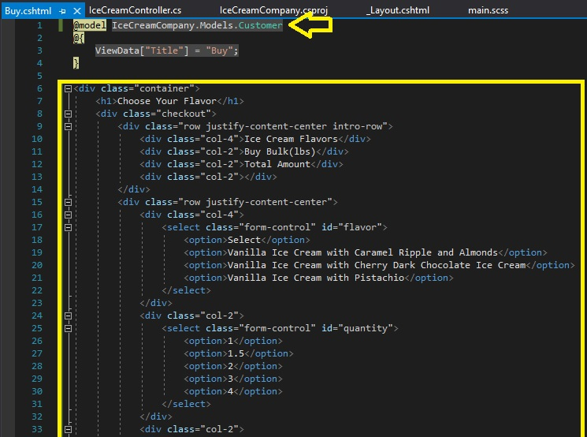

#### Tarea 4: Ejecutar la aplicación

1. En la ventana de **IceCreamCompany - Microsoft Visual Studio**, en el menú **FILE**, haga clic en **Save All**.

2. En la ventana **IceCreamCompany - Microsoft Visual Studio**, en el menú **DEBUG**, haga clic en **Iniciar sin depuración**.

- La representación visual del codigo del ejercicio se muestra en la siguiente imagen:


3. En **Microsoft Edge**, haga clic en **Comprar Helado**.
 
4. En la página **Comprar Helado**, en la lista de **Sabores de Helado**, seleccione _&lt;Un sabor de helado de su elección&gt;._

5. En la página **Comprar Helados**, en la lista de **Comprar a granel(lbs)**, seleccione _&lt;Un bulto de su elección&gt;._

6. En la página **Comprar Helados**, en la casilla **Nombre**, escriba _&lt;Un nombre de su elección&gt;._

7. En la página de **Comprar Helado**, en la casilla **Apellido**, escriba _&lt;Un apellido de su elección&gt;._

8. En la página **Comprar Helado**, en la casilla **Dirección**, escriba _&lt;Una dirección de su elección&gt;._

9. En la página de **Comprar Helados**, en la casilla **Correo electrónico**, escriba _&lt;Un correo electrónico de su elección&gt;._

10. En la página **Comprar Helado**, en la casilla **Número de teléfono**, escriba _&lt;Un número de teléfono de su elección&gt;._ y luego haga clic en **Hacer una compra**.

- La representación visual del codigo del ejercicio se muestra en la siguiente imagen:

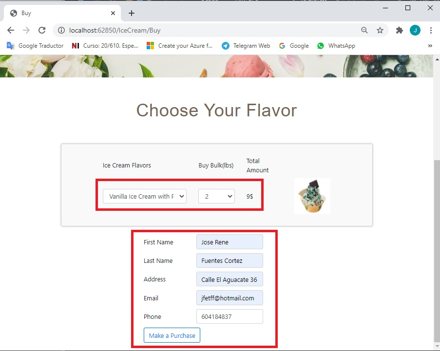

11. 12. En la página **Gracias por la compra,¡espera que disfrutes del helado!**, en la barra de menú, pulsa **Home**, y examina el contenido del navegador.

- La representación visual del codigo del ejercicio se muestra en la siguiente imagen:

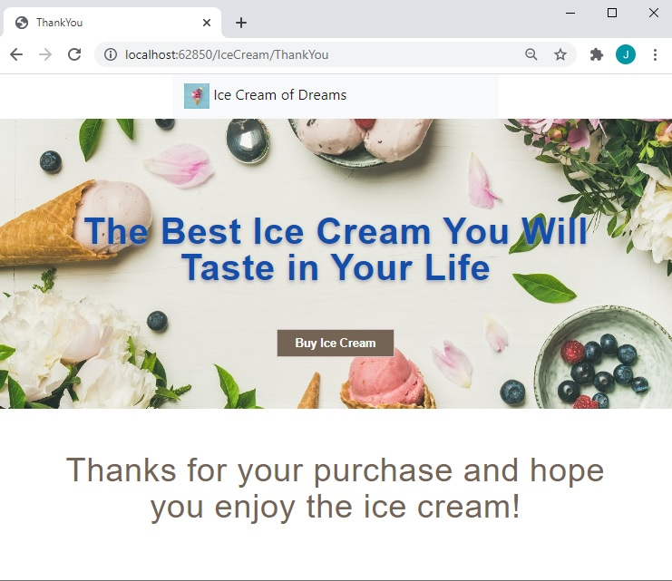

12. En Microsoft Edge, haz clic en **Cerrar**.

13. En la ventana de **IceCreamCompany - Microsoft Visual Studio**, en el menú **Archivo**, haga clic en **Salir**.

>**Resultados**: En este ejercicio, creaste una aplicación para la compañía de helados en la que los usuarios pueden ver los detalles de los helados, y también comprar algunos.
