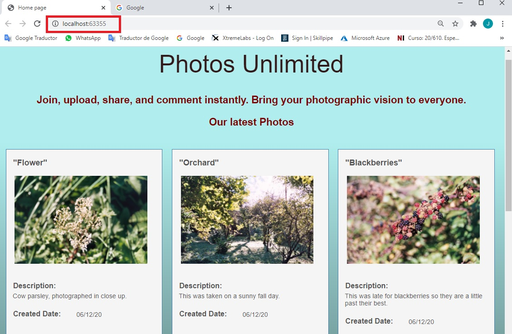
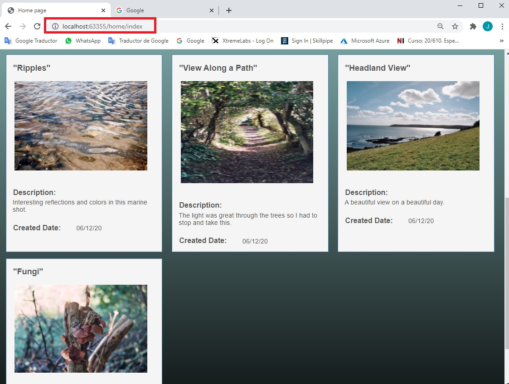
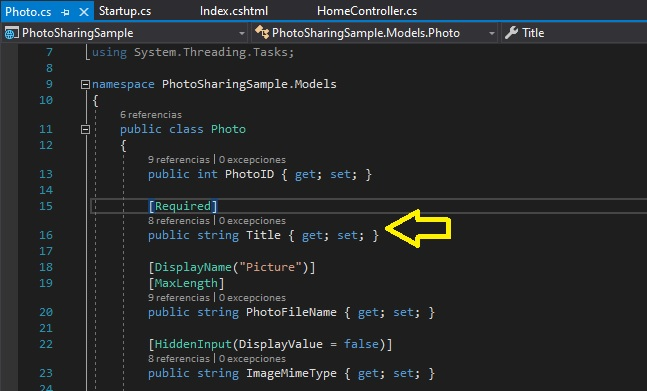
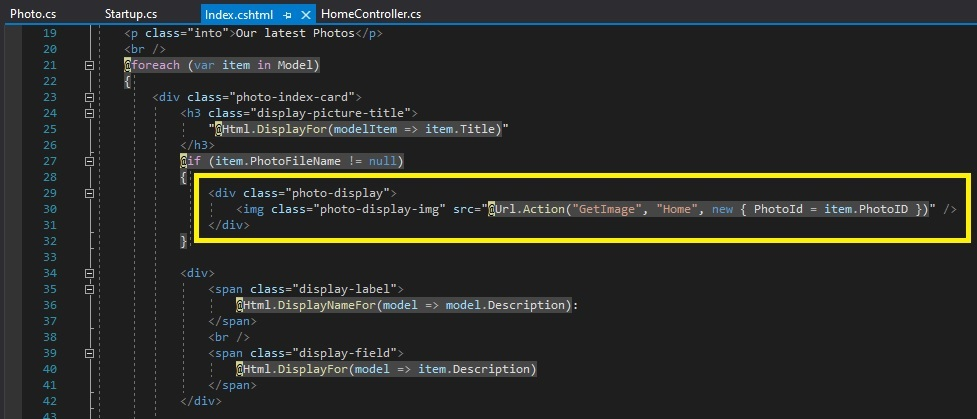

# Módulo 1: Explorando el núcleo MVC de ASP.NET

Fichero de Instrucciones: Instructions\20483C_MOD01_DEMO.md

Entregar el url de GitHub con la solución y un readme con las siguiente información:

1. **Nombres y apellidos:** José René Fuentes Cortez
2. **Fecha:** 24 de Noviembre 2020.
3. **Resumen del MOC 1:** Este MOC exploramos el nucleo de las aplicaciones ASP.NET usando el Modelo-Vista-Controlador (MVC). 


4. **Dificultad o problemas presentados y como se resolvieron:** Ninguna.

**NOTA**: Si no hay descripcion de problemas o dificultades, y al yo descargar el código para realizar la comprobacion y el código no funcionar, el resultado de la califaciación del laboratorio será afectado.

---

Wherever a path to a file starts with *[Repository Root]*, replace it with the absolute path to the folder in which the 20486 repository resides. For example, if you cloned or extracted the 20486 repository to **C:\Users\John Doe\Downloads\20486**, change the path: **[Repository Root]\AllFiles\20486D\Mod01** to **C:\Users\John Doe\Downloads\20486\AllFiles\20486D\Mod01**.

# Lección 3: Introducción a ASP.NET Core MVC 

### Demonstration: Cómo explorar una aplicación ASP.NET Core MVC

#### Pasos de preparación 

1. Ensure that you have cloned the **20486D** directory from GitHub. It contains the code segments for the labs and demos in this course.
**(https://github.com/MicrosoftLearning/20486D-DevelopingASPNETMVCWebApplications/tree/master/Allfiles)**

2. Navega hasta **[Repository Root]\Allfiles\Mod01\Democode\01_PhotoSharingSample**, y entonces abre **PhotoSharingSample.sln**.

    >**Nota**: Si aparece un cuadro de diálogo de **Aviso de seguridad para compartir fotos**, verifique que la casilla de verificación **Pregúnteme por cada proyecto de esta solución** esté desactivada, y luego haga clic en OK.

3. En la ventana **PhotoSharingSample - Microsoft Visual Studio**, en el menú **DEBUG**, haga clic en **Start Without Debugging**.

4. En Microsoft Edge, en la barra de direcciones, anota el número de puerto que aparece al final del URL **http://localhost:[port]**. Usará el número de puerto durante esta demostración.

- La representación visual a la respuesta del último ejercicio se muestra en la siguiente imagen:

 

5. En Microsoft Edge, haga clic en **Cerrar**.

#### Pasos de la demostración


1. En la ventana de **PhotoSharingSample - Microsoft Visual Studio**, en **Solution Explorer**, expandir **PhotoSharingSample**.

    >**Nota**: La aplicación PhotoSharingSample no tiene **default.html**, **default.aspx** o **default.cshtml** para actuar como página de inicio.

2. En **Solution Explorer**, en **PhotoSharingSample**, expanda **Controllers**, y luego haga clic en **HomeController.cs**.

3. En la ventana del código **HomeController.cs**, localice el siguiente código:
  ```cs
       public IActionResult Index()
       {
          return View(_dbContext.Photos.ToList());
       }
  ```

>**Nota**: Este bloque de código envía una lista de fotos a la vista. 

4. En **Solution Explorer**, expandir **Views**, expandir **Home**, y luego hacer clic en **Index.cshtml**.

5. En la ventana del código **Index.cshtml**, localiza el siguiente código:
  ```cs
       @model IEnumerable<PhotoSharingSample.Models.Photo>
  ```

>**Nota**: Este bloque de código representa cómo la vista acepta la lista de fotos de la acción **Index**.

6. En la ventana **PhotoSharingSample - Microsoft Visual Studio**, en el menú **DEBUG**, haga clic en **Start Without Debugging**.

    >**Nota**: El navegador muestra la página de inicio por default. Ha llegado a la acción **Index** del controlador **Home**.  

- La representación visual a la respuesta del último ejercicio se muestra en la siguiente imagen:

 

7. En la barra de tareas, haga clic en el icono **Microsoft Visual Studio**.

8. En la ventana **Compartir Fotomuestra - Microsoft Visual Studio**, en **Explorador de Soluciones**, haga clic en **Inicio.cs**.

9. En la ventana del código **Startup.cs**, localiza el siguiente código:
  ```cs
       app.UseMvcWithDefaultRoute();
  ```

>**Nota**: Este bloque de código añade MVC a la tubería de ejecución de la solicitud, con una ruta por default que contiene la siguiente plantilla: **{controller=Home}/{action=Index}/{id?}**.

10. En la barra de tareas, haz clic en el icono **Borde de Microsoft**.

11. En Microsoft Edge, en la barra de direcciones, escriba el URL **http://localhost:[port]/home/index**, y luego presione Enter.

    >**Nota**: La ventana del navegador muestra la página **home** de la aplicación web **PhotoSharingSample**.

- La representación visual a la respuesta del último ejercicio se muestra en la siguiente imagen:

 

12. En la barra de tareas, haga clic en el icono **Microsoft Visual Studio**.

13. En la ventana **PhotoSharingSample - Microsoft Visual Studio**, en **Solution Explorer**, expanda **Models**, y luego haga clic en **Photo.cs**.

14. En la ventana del código de **Photo.cs**, localice el siguiente código:
  ```cs
       [Required]
       public string Title { get; set;}
  ```

>**Nota**: Este bloque de código representa la propiedad **Título** de una foto almacenada en la aplicación.

- La representación visual a la respuesta del último ejercicio se muestra en la siguiente imagen:

 

15. En **Solution Explorer**, en **Controllers**, haga clic en **HomeController.cs**.

16. En la ventana del código **HomeController.cs**, localice el siguiente código:
  ```cs
       public class HomeController : Controller
  ```

>**Nota**: Este bloque de código indica que el **HomeController** hereda de la clase base **Controller**, que está en el **Microsoft.AspNetCore.Mvc** namespace.

17. En la ventana de código **HomeController.cs**, localiza el siguiente código:
  ```cs
       Photo requestedPhoto = _dbContext.Photos.FirstOrDefault(p => p.PhotoID == PhotoId);
       if (requestedPhoto != null)
       {
            string webRootpath = _environment.WebRootPath;
            string folderPath = "\\images\\";
            string fullPath = webRootpath + folderPath + requestedPhoto.PhotoFileName;

            FileStream fileOnDisk = new FileStream(fullPath, FileMode.Open);
            byte[] fileBytes;
            using (BinaryReader br = new BinaryReader(fileOnDisk))
            {
                fileBytes = br.ReadBytes((int)fileOnDisk.Length);
            }
            return File(fileBytes, requestedPhoto.ImageMimeType);
       }
       else
       {
            return NotFound();
       }
   ```

>**Nota**: Este bloque de código representa la acción **GetImage** de la clase **HomeController**.

- La representación visual a la respuesta del último ejercicio se muestra en la siguiente imagen:

 

18. En **Solution Explorer**, en **Views**, en **Home**, haga clic en **Index.cshtml**.

19. En la ventana del código **Index.cshtml**, localice el siguiente código:

  ```cs
       <div class="photo-display">
          
       </div>
  ```


>**Nota**: El motor de la vista de la página Razor ejecuta este código y muestra la imagen de **Foto**.

- La representación visual a la respuesta del último ejercicio se muestra en la siguiente imagen:

 

20. En Microsoft Edge, haz clic en **Cerrar**.

21. En la ventana de **Compartir Foto Muestra - Microsoft Visual Studio**, en el menú **Archivo**, haga clic en **Salir**.


