# Módulo 10: Prueba y resolución de problemas


Fichero de Instrucciones: Instructions\20483C_MOD10_DEMO.md

Entregar el url de GitHub con la solución y un readme con las siguiente información:

1. **Nombres y apellidos:** José René Fuentes Cortez
2. **Fecha:** 24 de Diciembre 2020.
3. **Resumen del Modulo 10:** Este módulo consta de dos ejercicios:
    - En el primer ejercio haremos pruebas de aplicaciones MVC.
    - En el ejercicio 2 implementamos estrategias para la implementación del Manedo de errores.
    - En el tercer ejericio aprendemos como registrar aplicaciones MVC.


4. **Dificultad o problemas presentados y como se resolvieron:** Ninguna.

**NOTA**: Si no hay descripcion de problemas o dificultades, y al yo descargar el código para realizar la comprobacion y el código no funcionar, el resultado de la califaciación del laboratorio será afectado.

---

Siempre que la ruta a un archivo comience con *[Raíz del repositorio]*, reemplácela con la ruta absoluta a la carpeta en la que reside el repositorio 20486. Por ejemplo, si clonó o extrajo el repositorio 20486 en **C:\Users\John Doe\Downloads\20486**, cambiar el camino a: **[Repository Root]\AllFiles\20486D\Mod01** al **C:\Users\John Doe\Downloads\20486\AllFiles\20486D\Mod01**


# Lección 1: Prueba de aplicaciones MVC

### Demostración: cómo ejecutar pruebas unitarias

#### Pasos de preparación
 
Asegúrese de haber clonado el directorio 20483C de GitHub. Contiene los segmentos de código para los laboratorios y demostraciones de este curso. **(https://github.com/MicrosoftLearning/20486D-DevelopingASPNETMVCWebApplications/tree/master/Allfiles)**


#### Pasos de demostración


1. En el Explorador de archivos, navegue hasta **[Repository Root]\Allfiles\Mod10\Democode\01_UnitTestingExample_begin**, y luego, haga clic en **UnitTestingExample.sln**.

> ** Nota **: Si aparece un cuadro de diálogo ** Advertencia de seguridad para el ProductsWebsite **, verifique que la casilla de verificación ** Preguntarme por cada proyecto en esta solución ** esté desactivada y luego haga clic en ** Aceptar **.


2. En la ventana **UnitTestingExample - Microsoft Visual Studio**, en el Explorador de Soluciones, haga clic con el botón derecho **Solución 'UnitTestingExample'**, apunte a **Agregar**, y luego haga clic en **Nuevo Proyecto**.

3. En el cuadro de diálogo **Agregar nuevo proyecto**, en el panel de navegación, expandir **Instalado**, expandir **Visual C#**, y luego hacer clic en **.NET Core**.

4. En el cuadro de diálogo **Agregar nuevo proyecto**, en el panel de resultados, haga clic en **Proyecto de prueba de MSTest(.NET Core)**.

5. En el cuadro de diálogo **Agregar nuevo proyecto**, en el cuadro **Nombre**, escriba **ProductsWebsite.Tests**, y luego haga clic en **OK**.

- La representación visual del codigo del ejercicio se muestra en la siguiente imagen:

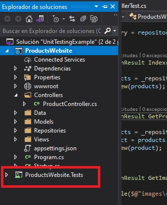

6. En la ventana **UnitTestingExample - Microsoft Visual Studio**, en Solution Explorer, en **ProductsWebsite.Tests**, haga clic con el botón derecho del ratón en **Dependencies**, y luego haga clic en **Add Reference**.

7. En el cuadro de diálogo **Reference Manager - ProductsWebsite.Tests**, en el panel de navegación, amplíe **Projects**, y luego haga clic en **Solution**.

8. En el cuadro de diálogo **Gestor de referencias - ProductsWebsite.Tests**, en el panel de resultados, seleccione la casilla de verificación **ProductsWebsite**, y luego haga clic en **OK**.

- La representación visual del codigo del ejercicio se muestra en la siguiente imagen:

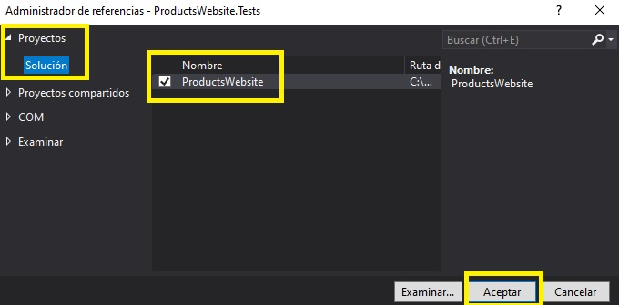

9. En la ventana **UnitTestingExample - Microsoft Visual Studio**, en Solution Explorer, en **ProductsWebsite.Tests**, haga clic con el botón derecho del ratón en **UnitTest1.cs**, y luego haga clic en **Rename**.

- La representación visual del codigo del ejercicio se muestra en la siguiente imagen:

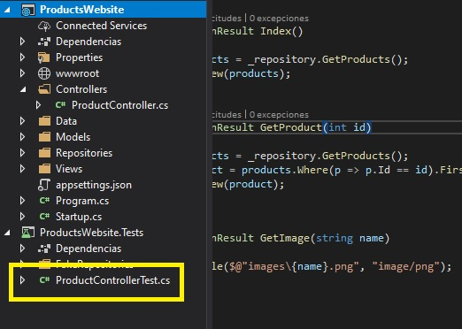

10. En el cuadro **UnitTest1.cs**, escriba **ProductControllerTest.cs**, y luego presione Enter.

11. En el cuadro de diálogo **Microsoft Visual Studio**, haga clic en **Sí**.

12. En la ventana **UnitTestingExample - Microsoft Visual Studio**, en el menú **TOOLS**, apunte a **NuGet Package Manager**, y luego haga clic en **Package Manager Console**. 

   > **Nota**: En la Consola del Administrador de Paquetes, si se le pide **Sólo ejecutar scripts de editores de confianza** escriba **R** y luego presione Enter".

13. En la ventana **Consola del Administrador de paquetes**, escriba el siguiente texto y luego presione Intro.
  ```cs
    Install-Package Microsoft.AspNetCore.Mvc -ProjectName ProductsWebsite.Tests
  ```
- La representación visual del codigo del ejercicio se muestra en la siguiente imagen:

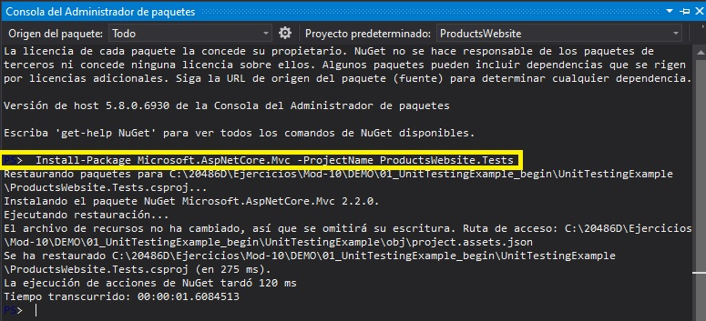

14. En la ventana **UnitTestingExample - Microsoft Visual Studio**, en el Solution Explorer, haga clic con el botón derecho en **ProductsWebsite.Tests**, apunte a **Add**, y luego haga clic en **New Folder**.

15. En el cuadro **Nueva Carpeta**, escriba **Falsos Depósitos**, y luego presione Enter.

- La representación visual del codigo del ejercicio se muestra en la siguiente imagen:

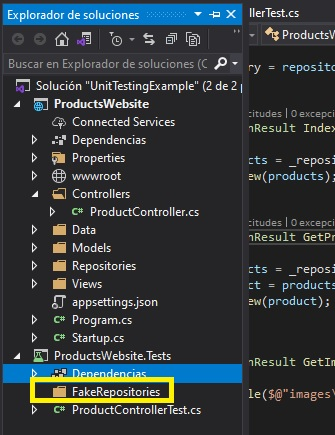


16. En la ventana **UnitTestingExample - Microsoft Visual Studio**, en el Explorador de soluciones, haga clic con el botón derecho en **FakeRepositories**, apunte a **Add**, y luego haga clic en **Class**.

17. En el cuadro de diálogo **Agregar nuevo elemento - ProductsWebsite.pruebas**, en el cuadro **Nombre**, escriba **Falso Repositorio de Productos**, y luego haga clic en **Agregar**.

- La representación visual del codigo del ejercicio se muestra en la siguiente imagen:

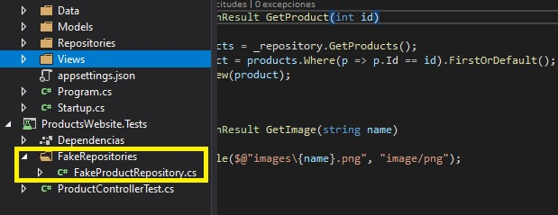

18. En la ventana del código de **FakeProductRepository.cs**, localiza el siguiente código:
  ```cs
    using System.Text;
  ```

19. Asegúrese de que el cursor esté al final del código localizado, pulse Intro, y luego escriba el siguiente código:
  ```cs
    using ProductsWebsite.Repositories;
    using ProductsWebsite.Models;
  ```

20. En la ventana del código de **FakeProductRepository.cs**, seleccione el siguiente código:
  ```cs
    class FakeProductRepository
  ```

21. Reemplazar el código seleccionado por el siguiente código:
  ```cs
        internal class FakeProductRepository : IProductRepository
  ```

22. En la ventana del código de **FakeProductRepository.cs**, localiza el siguiente código:
  ```cs
    internal class FakeProductRepository : IProductRepository
    {
  ```

23. Asegúrate de que el cursor esté al final del código localizado, pulsa Intro, y luego escribe el siguiente código:
  ```cs
    public IEnumerable<Product> GetProducts()
    {
        return new List<Product>()
        {
            new Product{ Id = 1, Name = "Product1's name", BasePrice = 1.1F, Description = "A description for product 1.", ImageName = "image-name-1" },
            new Product{ Id = 2, Name = "Product2's name", BasePrice = 2.2F, Description = "A description for product 2.", ImageName = "image-name-2" },
            new Product{ Id = 3, Name = "Product3's name", BasePrice = 3.3F, Description = "A description for product 3.", ImageName = "image-name-3" }
        };
    }
  ```

- La representación visual del codigo del ejercicio se muestra en la siguiente imagen:

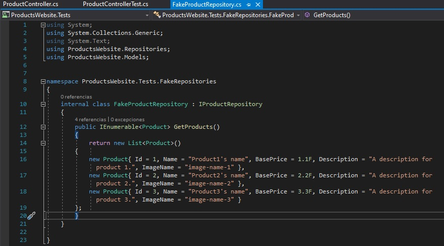

24. En la ventana del código **ProductControllerTest.cs**, localice el siguiente código:
  ```cs
    using Microsoft.VisualStudio.TestTools.UnitTesting;
  ```

25. Asegúrate de que el cursor esté al final del código localizado, pulsa Intro, y luego escribe el siguiente código:
  ```cs
    using System.Collections.Generic;
    using Microsoft.AspNetCore.Mvc;
    using ProductsWebsite.Controllers;
    using ProductsWebsite.Models;
    using ProductsWebsite.Repositories;
    using ProductsWebsite.Tests.FakeRepositories;
  ```

26. En la ventana del código **ProductControllerTest.cs**, seleccione el siguiente código:
  ```cs
    public void TestMethod1()
    {
    }
  ```

27. Reemplaza el código seleccionado por el siguiente código:
  ```cs
    public void IndexModelShouldContainAllProducts()
    {
        // Arrange
        IProductRepository fakeProductRepository = new FakeProductRepository();
        ProductController productController = new ProductController(fakeProductRepository);
        // Act
        ViewResult viewResult = productController.Index() as ViewResult;
        List<Product> products = viewResult.Model as List<Product>;
        // Assert
        Assert.AreEqual(products.Count, 3);
    }
  ```

28. En la ventana del código **ProductControllerTest.cs**, localice el siguiente código:
  ```cs
        Assert.AreEqual(products.Count, 3);
    }
  ```

29. Asegúrate de que el cursor esté al final del código localizado, pulsa Enter dos veces, y luego escribe el siguiente código:
  ```cs
    [TestMethod]
    public void GetProductModelShouldContainTheRightProduct()
    {
        // Arrange
        var fakeProductRepository = new FakeProductRepository();
        var productController = new ProductController(fakeProductRepository);
        // Act
        var viewResult = productController.GetProduct(2) as ViewResult;
        Product product = viewResult.Model as Product;
        // Assert
        Assert.AreEqual(product.Id, 2);
    }
  ```

- La representación visual del codigo del ejercicio se muestra en la siguiente imagen:

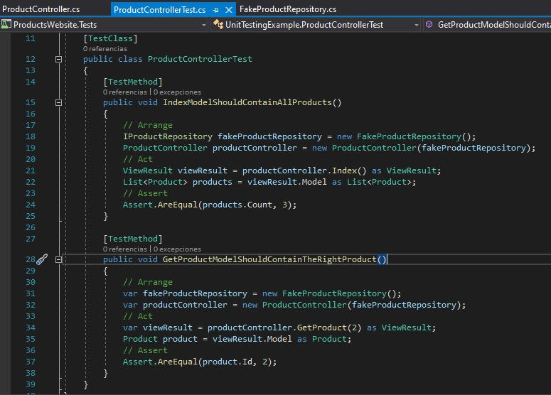

30. En la ventana **UnitTestingExample - Microsoft Visual Studio**, en el menú **FILE**, haga clic en **Save All**.

31. En la ventana **UnitTestingExample - Microsoft Visual Studio**, en el menú **TEST**, apunte a **Run**, y luego haga clic en **All Tests**.
   > **Nota**: El **Explorador de pruebas** muestra una prueba fallida: **GetProductModelShouldContainTheRightProduct**, y una prueba superada: **IndexModelShouldContainAllProducts**.


- La representación visual del codigo del ejercicio se muestra en la siguiente imagen:

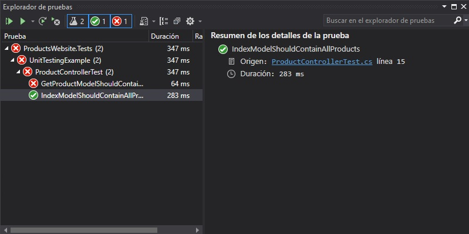

32. En la ventana **UnitTestingExample - Microsoft Visual Studio**, en Solution Explorer, en **ProductsWebsite**, amplíe **Controllers**, y luego haga clic en **ProductController.cs**. 

33. En la ventana **Código del Controlador de Productos.cs**, seleccione el siguiente código:
  ```cs
    var product = products.Where(p => p.Id != id).FirstOrDefault();
  ```

34. Sustituya el código seleccionado por el siguiente código:
  ```cs
    var product = products.Where(p => p.Id == id).FirstOrDefault();
  ```

- La representación visual del codigo del ejercicio se muestra en la siguiente imagen:

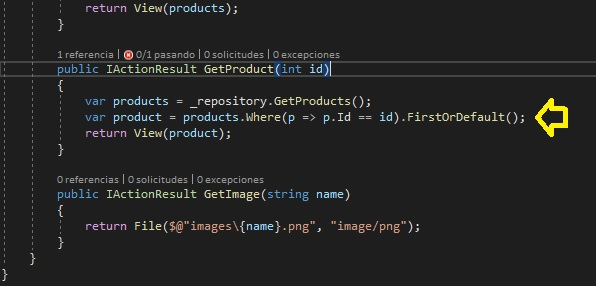

35. En la ventana **UnitTestingExample - Microsoft Visual Studio**, en el menú **FILE**, haga clic en **Save All**.

36. En la ventana **UnitTestingExample - Microsoft Visual Studio**, en el menú **TEST**, apunte a **Run**, y luego haga clic en **All Tests**.
   > **Nota**: El **Explorador de pruebas** muestra dos pruebas aprobadas: **GetProductModelShouldContainTheRightProduct** y **IndexModelShouldContainAllProducts**.

- La representación visual del codigo del ejercicio se muestra en la siguiente imagen:

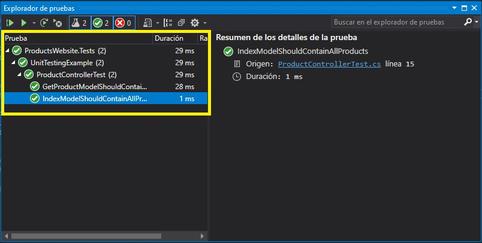

37. En la ventana **UnitTestingExample - Microsoft Visual Studio**, en el menú **FILE**, haga clic en **Salir**.


# Lección 2: Implementación de una estrategia de manejo de excepciones

### Demonstration: Cómo configurar el manejo de excepciones
#### Pasos de preparación

Asegúrate de que has clonado el directorio **20486D** de GitHub. Contiene los segmentos de código para los laboratorios y demostraciones de este curso. (**https://github.com/MicrosoftLearning/20486D-DevelopingASPNETMVCWebApplications/tree/master/Allfiles**)

#### Pasos de demostración

1. Navega a **[Repository Root]\Allfiles\Mod10\Democode\02_ErrorHandlingExample_begin**, y luego haz doble clic en **ErrorHandlingExample.sln**.

   > **Nota**: Si aparece un cuadro de diálogo de **Aviso de Seguridad para el ErrorHandlingExample**, verifique que la casilla de verificación **Pregúntame por cada proyecto de esta solución** esté despejada, y luego haga clic en **OK**. 

2. En la ventana **ErrorHandlingExample - Microsoft Visual Studio**, en la barra de herramientas, haga clic en la flecha junto al botón **Iniciar depuración**, y luego haga clic en **Producción**.

3. En la ventana **ErrorHandlingExample - Microsoft Visual Studio**, en el menú **DEBUG**, haga clic en **Iniciar sin depuración**.

   > **Nota**: El navegador muestra una página de error del servidor interno.

4. En Microsoft Edge, haga clic en **Cerrar**.

5. En la ventana **ErrorHandlingExample - Microsoft Visual Studio**, en la barra de herramientas, haga clic en la flecha junto al botón **Iniciar depuración**, y luego haga clic en **Desarrollo**.

6. En la ventana **ErrorHandlingExample - Microsoft Visual Studio**, en el menú **DEBUG**, haga clic en **Iniciar sin depuración**.

7. En Microsoft Edge, localiza el siguiente texto:
  ```cs
ErrorHandlingExample.Startup+<>c__DisplayClass1_0+<<Configure>b__0>d.MoveNext() in Startup.cs
	+	38.  cnt.IncrementRequestPathCount(context.Request.GetDisplayUrl());
  ```

8. En Microsoft Edge, haga clic en el signo **+** (más) cerca de **38**, y luego inspeccione el código.

9. En Microsoft Edge, localiza el siguiente texto:
  ```cs
    ErrorHandlingExample.Services.Counter IncrementRequestPathCount(string requestPath) in Counter.cs
	+ 19.            UrlCounter[requestPath]++;
  ```

10. En Microsoft Edge, haz clic en el signo **+** (más) cerca de **19**, y luego inspecciona el código.

11. En Microsoft Edge, haz clic en **Cerrar**.

12. En la ventana **ErrorHandlingExample - Microsoft Visual Studio**, en el Explorador de soluciones, expande **Servicios**, y luego haz clic en **Contador.cs**.

13. En la ventana de código **Counter.cs**, seleccione el siguiente código:
  ```cs
    UrlCounter[requestPath]++;
  ```

14. Reemplazar el código seleccionado por el siguiente código:
  ```cs
    if (UrlCounter.ContainsKey(requestPath))
    {
        UrlCounter[requestPath]++;
    }
    else
    {
        UrlCounter.Add(requestPath, 1);
    }
  ```

15. En la ventana **ErrorHandlingExample - Microsoft Visual Studio**, en el menú **FILE**, haga clic en **Save All**.

16. En la ventana **ErrorHandlingExample - Microsoft Visual Studio**, en el menú **DEBUG**, haga clic en **Start Without Debugging**.

17. En Microsoft Edge, haz clic en **16**.
     
18. En Microsoft Edge, localiza el siguiente texto:
  ```cs
    ErrorHandlingExample.Controllers.HomeController.GetDividedNumber(int id) in HomeController.cs
        +	32.  DivisionResult divisionResult = _numberCalculator.GetDividedNumbers(id);
   ```

19. En Microsoft Edge, haz clic en el signo **+** (más) cerca de **32**, y luego inspecciona el código.

20. En Microsoft Edge, localiza el siguiente texto:
  ```cs
ErrorHandlingExample.Services.DivisionCalculator.GetDividedNumbers(int number) in DivisionCalculator.cs
	+	20.  if (number % i == 0)
  ```

21. En Microsoft Edge, haga clic en el signo **+** (más) cerca de **20**, y luego inspeccione el código.

22. En Microsoft Edge, haz clic en **Cerrar**.

23. En la ventana **ErrorHandlingExample - Microsoft Visual Studio**, en el Solution Explorer, en **Services**, haga clic en **DivisionCalculator.cs**.

24. En la ventana del código **DivisionCalculator.cs**, seleccione el siguiente código:
  ```cs
    for (int i = 0; i < (number / 2) + 1; i++)
  ```

25. Reemplaza el código seleccionado por el siguiente código:
  ```cs
    for (int i = 1; i < (number / 2) + 1; i++)
  ```

26. En la ventana **ErrorHandlingExample - Microsoft Visual Studio**, en el menú **FILE**, haga clic en **Save All**.

27. En la ventana **ErrorHandlingExample - Microsoft Visual Studio**, en la barra de herramientas, haga clic en la flecha junto al botón **Iniciar depuración**, y luego haga clic en **Producción**.

28. En la ventana **ErrorHandlingExample - Microsoft Visual Studio**, en el menú **DEBUG**, haga clic en **Iniciar sin depuración**.

29. En Microsoft Edge, haz clic en **16**.
   > **Nota**: El navegador muestra los números por los que se puede dividir **16**.

30. En Microsoft Edge, haz clic en **Cerrar**.

31. En la ventana **ErrorHandlingExample - Microsoft Visual Studio**, en el menú **FILE**, haga clic en **Salir**.

# Lección 3: Registro de aplicaciones MVC

### Demonstration: Cómo registrar una solicitud de MVC

#### Pasos de preparación

Asegúrate de que has clonado el directorio **20486D** de GitHub. Contiene los segmentos de código para los laboratorios y demostraciones de este curso. (**https://github.com/MicrosoftLearning/20486D-DevelopingASPNETMVCWebApplications/tree/master/Allfiles**)

#### Pasos de demostración

1. Navega a **[Repository Root]\Allfiles\Mod10\Democode\03_LoggingExample_begin**, y luego haz doble clic en **LoggingExample.sln**.

   > **Nota**: Si aparece un cuadro de diálogo de **Advertencia de seguridad para el LoggingExample**, verifique que la casilla de verificación **Ask me for each project in this solution** esté despejada, y luego haga clic en **OK**. 

2. En la ventana **LoggingExample - Microsoft Visual Studio**, en el Explorador de soluciones, haga clic en **Program.cs**. 

3. En la ventana **Program.cs** code, localice el siguiente código:
  ```cs
    WebHost.CreateDefaultBuilder(args)
  ```

4. Ponga el cursor al final del código localizado, presione Enter, y luego escriba el siguiente código:
  ```cs
    .ConfigureLogging((hostingContext, logging) =>
    {
        var env = hostingContext.HostingEnvironment;
        var config = hostingContext.Configuration.GetSection("Logging");

        logging.ClearProviders();

        if (env.IsDevelopment())
        {
            logging.AddConfiguration(config);
            logging.AddConsole();
        }
        else
        {
            logging.AddFile(config);
        }
    })
  ```

5. En el Explorador de Soluciones, expande **appsettings.json**, y luego haz clic en **appsettings.development.json**.

6. Coloque el cursor después del signo **{** (llaves de apertura), pulse Intro y luego escriba el siguiente código:
  ```cs
    "Logging": {
       "LogLevel": {
         "Default": "Trace"
       }
    }
  ```

7. En el Explorador de Soluciones, haga clic en **appsettings.production.json**.

8. Coloque el cursor después del signo **{** (abrazaderas), pulse Intro y luego escriba el siguiente código:
  ```cs
    "Logging": {
      "PathFormat": "myLog.txt",
      "LogLevel": {
        "Default": "Warning"
      }
    }
  ```

9. En el Explorador de soluciones, amplíe **Controladores**, y luego haga clic en **HomeController.cs**. 

10. En la ventana del código **HomeController.cs**, localice el siguiente código:
  ```cs
    ICounter _counter;
  ```

11. Ponga el cursor al final del código localizado, presione Enter y luego escriba el siguiente código:
  ```cs
    ILogger _logger;
  ```

12. En la ventana del código **HomeController.cs**, seleccione el siguiente código:
  ```cs
    public HomeController(IDivisionCalculator numberCalculator, ICounter counter)
  ```

13. Sustituya el código seleccionado por el siguiente código:
  ```cs
    public HomeController(IDivisionCalculator numberCalculator, ICounter counter, ILogger<HomeController> logger)
  ```

14. En la ventana del código **HomeController.cs**, localice el siguiente código:
  ```cs
    _numberCalculator = numberCalculator;
  ```

15. Ponga el cursor al final del código localizado, presione Enter, y luego escriba el siguiente código:
  ```cs
    _logger = logger;
  ```

16. En la ventana del código **HomeController.cs**, localice el siguiente código:
  ```cs
    ViewBag.CounterSucceeded = false;
  ```

17. Ponga el cursor al final del código localizado, presione Enter, y luego escriba el siguiente código:
  ```cs
    try
    {
        _counter.IncrementNumberCount(id);
        ViewBag.NumberOfViews = _counter.NumberCounter[id];
        ViewBag.CounterSucceeded = true;
        _logger.LogError("GetDividedNumber - Success");
    }
    catch (Exception ex)
    {
        _logger.LogError(ex, $"An error occured while trying to increase or retrieve the page display count. Number parameter is: {id}");
    }
  ```

18. En la ventana **LoggingExample - Microsoft Visual Studio**, en el menú **FILE**, haga clic en **Save All**.

19. En la ventana **Ejemplo de registro - Microsoft Visual Studio**, en la barra de herramientas, haga clic en la flecha junto al botón **Iniciar depuración**, y luego haga clic en **Producción**.

20. En la ventana **Ejemplo de registro - Microsoft Visual Studio**, en el menú **DEBUG**, haga clic en **Iniciar sin depuración**.

21. En Microsoft Edge, haz clic en **16**.

   > **Nota**: El navegador no muestra cuántas veces se ha visto el número **16**.

22. En Microsoft Edge, haz clic en **Cerrar**.

23. En el Explorador de Archivos, navega a **[Repository Root]\Allfiles\Mod10\Democode\03_LoggingExample_begin\LoggingExample**, y luego haz doble clic en **miLog-XXXXXXXX - Bloc de notas**.

   > **Nota**: Inspecciona el rastro de la pila de **KeyNotFoundException**.

24. En la ventana **miLog-XXXXXXXX - Bloc de notas**, haga clic en **Cerrar**.

25. En el Explorador de soluciones, expandir **Servicios**, y luego hacer clic en **Contador.cs**. 

26. En la ventana del código **Counter.cs**, seleccione el siguiente código:
  ```cs
    NumberCounter[number]++;
  ```

27. Reemplaza el código seleccionado por el siguiente código:
  ```cs
    if (NumberCounter.ContainsKey(number))
    {
        NumberCounter[number]++;
        _logger.LogDebug($"The number of times the page was displayed for the number {number} was increased to {NumberCounter[number]}.");
    }
    else
    {
        NumberCounter.Add(number, 1);
        _logger.LogDebug($"The number {number} was added to the page display count dictionary.");
    }
  ```
28. En la ventana **LoggingExample - Microsoft Visual Studio**, en el menú **FILE**, haga clic en **Save All**.

29. En la ventana **Ejemplo de registro - Microsoft Visual Studio**, en la barra de herramientas, haga clic en la flecha junto al botón **Iniciar depuración**, y luego haga clic en **Desarrollo**.

30. En la ventana **Ejemplo de registro - Microsoft Visual Studio**, en el menú **DEBUG**, haga clic en **Iniciar sin depuración**.

31. En Microsoft Edge, haga clic en **16**.

32. En la ventana **LoggingExample - Microsoft Visual Studio**, en el menú **View**, haga clic en **Output**.

33. En la pestaña **Salida**, en el cuadro **Mostrar salida de**, seleccione **Servidor Web Principal de ASP.NET**.

34. En la ventana **LoggingExample - Microsoft Visual Studio**, en la pestaña **Output**, presione **Ctrl + F**, y luego localice el siguiente texto:
  ```cs
    The number 16 was added to the page display count dictionary.
  ```

35. En Microsoft Edge, haga clic en **Cerrar**.

36. En la ventana **Ejemplo de registro - Microsoft Visual Studio**, en la barra de herramientas, haga clic en la flecha junto al botón **Iniciar depuración**, y luego haga clic en **Producción**.

37. En la ventana **Ejemplo de registro - Microsoft Visual Studio**, en el menú **DEBUG**, haga clic en **Iniciar sin depuración**.

38. En Microsoft Edge, haz clic en **16**.

   > **Nota**: El navegador muestra los números por los que se puede dividir **16**.

39. En Microsoft Edge, haz clic en **Cerrar**.

40. En el Explorador de Archivos, navega a **[Repository Root]\Allfiles\Mod10\Democode\03_LoggingExample_begin\LoggingExample**, y luego haz doble clic en **myLog-XXXXXXXX.txt**.

   > **Nota**: Presiona **Ctrl + F**, y luego localiza la siguiente frase **GetDividedNumber - Success**.

41. En la ventana **myLog-XXXXXXXX - Notepad**, presione **Cerrar**.

42. En la ventana **LoggingExample - Microsoft Visual Studio**, en el menú **FILE**, haga clic en **Salir**.