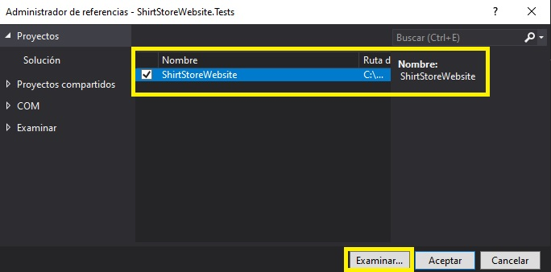
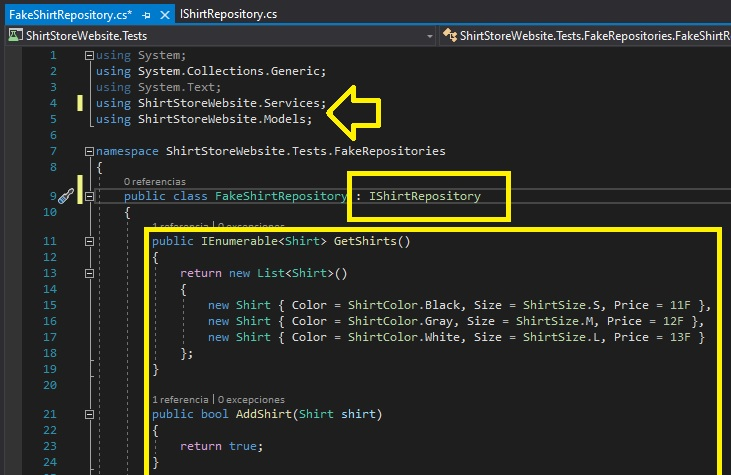
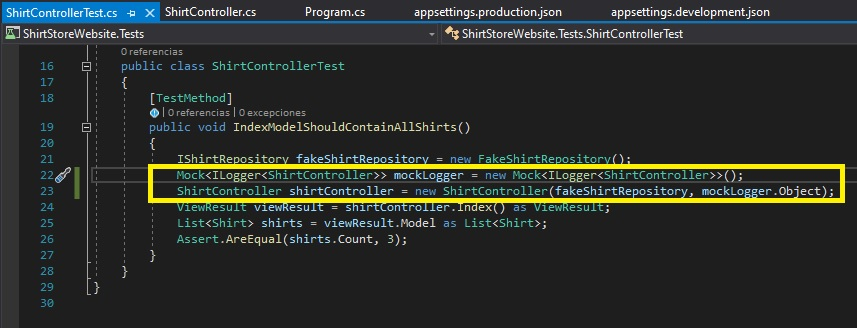
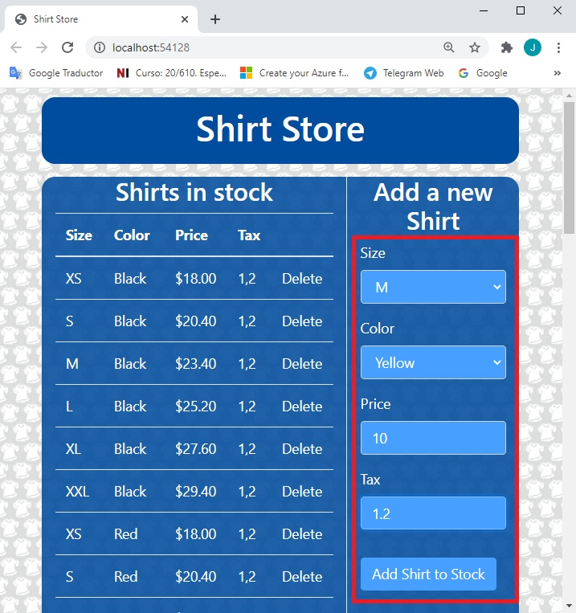

# Module 10: Testing and Troubleshooting

Siempre cuando un camino comienza con  *[Repository Root]*, reemplacelo con el camino absoluto en el que el repositorio 20486 reside. Por ejemplo, si tu has cloneado o extraido el repositorio 20486 en la carpeta **C:\Users\John Doe\Downloads\20486**, cambiar la ruta de: **[Repository Root]\AllFiles\20486D\Mod01** a **C:\Users\John Doe\Downloads\20486\AllFiles\20486D\Mod01**.

Fichero de Instrucciones: Instructions\20486D_MOD10_LAK.md

**Información:**

1. **Nombres y apellidos:** José René Fuentes Cortez
2. **Fecha:** 24 de Diciembre 2020.
3. **Resumen del Ejercicio:** Este laboratorio consta de 5 ejercicios:
- En el Primer ejercicio nos ayuda a crear un proyecto de prueba y probar un modelo mientras se fija su código, como en un entorno de desarrollo dirigido por pruebas.
- En el Segundo ejercicio probamos un controlador usando un repositorio falso.
- En el Tercer ejercicio desarrollamos un repositorio para tener una aplicación MVC funcional.
- En el cuarto ejercicio agregamos manejo de errores a una aplicación MVC. Visualizamos estos errores personalizados en una página de error o en una página de error del desarrollador si la excepción se dispara.
- En el último ejercicio hacemos registros en diferentes entidades de niveles de registros, mostrando errores o información en archivos log o en una consola de salida en un formato deseado. Creamos un sustituto simulado con una marco de referencia.

4. **Dificultad o problemas presentados y como se resolvieron:** Ninguno.

**NOTA**: Si no hay descripcion de problemas o dificultades, y al yo descargar el código para realizar la comprobacion y el código no funcionar, el resultado de la califaciación del laboratorio será afectado.

---

# Laboratorio: Prueba y solución de problemas

### Lab Setup

Tiempo estimado: **60 minutos**

### Preparation Steps

1. Asegúrate de que has clonado el directorio **20486D** de GitHub. Contiene los segmentos de código para los laboratorios y demostraciones de este curso. (**https://github.com/MicrosoftLearning/20486D-DevelopingASPNETMVCWebApplications/tree/master/Allfiles**)

2. Navega a **[Repository Root]\Allfiles\Mod10\Labfiles\01_ShirtStore_begin**, y luego abre el **ShirtStore.sln**.

    >**Nota**: Si aparece un cuadro de diálogo de **Aviso de Seguridad para ShirtStore**, verifique que la casilla de verificación **Pregúntame por cada proyecto de esta solución** esté despejada, y luego haga clic en OK.

3. En la ventana **ShirtStore - Microsoft Visual Studio**, en el menú **DEBUG**, haga clic en **Iniciar sin depuración**.

4. En Microsoft Edge, en la barra de direcciones, anote el número de puerto que aparece al final del URL **http://localhost:[port]**. Usarás el número de puerto durante este laboratorio.

- La representación visual del codigo del ejercicio se muestra en la siguiente imagen:


5. En Microsoft Edge, haz clic en **Cerrar**.

### Ejercicio 1: Prueba de un modelo

#### Tarea 1: Añadir un proyecto de prueba

1. Navega a **[Repository Root]\Allfiles\Mod10\Labfiles\01_ShirtStore_begin**, y luego haz doble clic en **ShirtStore.sln**.

    >**Nota**: Si aparece un cuadro de diálogo de **Aviso de Seguridad para ShirtStore**, verifique que la casilla de verificación **Pregúntame por cada proyecto de esta solución** esté despejada, y luego haga clic en OK.

2. En la ventana **ShirtStore - Microsoft Visual Studio**, en el Explorador de soluciones, haga clic con el botón derecho del ratón en **Solución 'ShirtStore'**, apunte a **Agregar**, y luego haga clic en **Nuevo proyecto**.

3. En el cuadro de diálogo **Agregar nuevo proyecto**, en el panel de navegación, expandir **Instalado**, expandir **Visual C#**, y luego hacer clic en **.NET Core**.

4. En el cuadro de diálogo **Agregar nuevo proyecto**, en el panel de resultados, haga clic en **Proyecto de prueba de MSTest (.NET Core)**.

5. En el cuadro de diálogo **Agregar nuevo proyecto**, en el cuadro **Nombre**, escriba **ShirtStoreWebsite.Tests**, y luego haga clic en **OK**.

- La representación visual del codigo del ejercicio se muestra en la siguiente imagen:


6. En el Explorador de soluciones, en **ShirtStoreWebsite.Tests**, haga clic con el botón derecho del ratón en **Dependencias**, y luego haga clic en **Agregar referencia**.

7. En el cuadro de diálogo **Reference Manager - ShirtStoreWebsite.Tests**, en el panel de navegación, expandir **Projects**, y luego hacer clic en **Solution**.

8. En el cuadro de diálogo **Manager de Referencias - ShirtStoreWebsite.Tests**, en el panel de resultados, seleccione la casilla de verificación **ShirtStoreWebsite**, y luego haga clic en **OK**.


- La representación visual del codigo del ejercicio se muestra en la siguiente imagen:



#### Tarea 2: Escribir una prueba para un modelo

1. En el Explorador de soluciones, haga clic con el botón derecho del ratón en **ShirtStoreWebsite.Tests**, apunte a **Agregar**, y luego haga clic en **Nueva carpeta**.

2. En el cuadro **Nueva Carpeta**, escriba **Modelos**, y luego presione Enter.

- La representación visual del codigo del ejercicio se muestra en la siguiente imagen:


3. En el Explorador de soluciones, en **ShirtStoreWebsite.Tests**, haga clic con el botón derecho del ratón en **UnitTest1.cs**, y luego haga clic en **Rename**.

4. En el cuadro **UnitTest1**, escriba **ShirtTest**, y luego presione Enter.

5. En el cuadro de diálogo **Microsoft Visual Studio**, haga clic en **Sí**.

6. En el Explorador de soluciones, haga clic con el botón derecho del ratón en **ShirtTest.cs**, y luego haga clic en **Cortar**.

7. En el Explorador de soluciones, haga clic con el botón derecho del ratón en **Models**, y luego haga clic en **Paste**.

8. En la ventana del código **ShirtTest.cs**, localice el siguiente código:
  ```cs
    using Microsoft.VisualStudio.TestTools.UnitTesting;
  ```

9. Asegúrese de que el cursor esté al final del código localizado, pulse Intro, y luego escriba el siguiente código:
  ```cs
    using ShirtStoreWebsite.Models;
  ```

10. En la ventana del código **ShirtTest.cs**, seleccione el siguiente código:
  ```cs
    public void TestMethod1()
    {
    }
  ```

11. Reemplazar el código seleccionado por el siguiente código:
  ```cs
    public void IsGetFormattedTaxedPriceReturnsCorrectly()
    {
        Shirt shirt = new Shirt
        {
            Price = 10F,
            Tax = 1.2F
        };

        string taxedPrice = shirt.GetFormattedTaxedPrice();

        Assert.AreEqual("$12.00", taxedPrice);
  ```

- La representación visual del codigo del ejercicio se muestra en la siguiente imagen:


12. En la ventana de **ShirtStore - Microsoft Visual Studio**, en el menú **FILE**, haga clic en **Save All**.

#### Tarea 3: Ejecutar la prueba de la unidad - debería fallar

1. En la ventana de **ShirtStore - Microsoft Visual Studio**, en el menú **TEST**, apunta a **Run**, y luego haz clic en **All Tests**.

- La representación visual del codigo del ejercicio se muestra en la siguiente imagen:


  > **Nota**: El **Explorador de pruebas** muestra una prueba fallida: **Ingeniería de formato, precio de los impuestos, devoluciones correctas**.

- La representación visual del codigo del ejercicio se muestra en la siguiente imagen:


#### Tarea 4: Implementar la clase modelo para que la prueba pase

1. En la ventana **ShirtStore - Microsoft Visual Studio**, en el Explorador de soluciones, en **ShirtStoreWebsite**, expandir **Models**, y luego hacer clic en **Shirt.cs**. 

2. En la ventana de código **Shirt.cs**, seleccione el siguiente código:
  ```cs
    return Price.ToString($"C2", CultureInfo.GetCultureInfo("en-US"));
  ```

3. Reemplazar el código seleccionado por el siguiente código:

  ```cs
    return (Price * Tax).ToString($"C2", CultureInfo.GetCultureInfo("en-US"));
  ```

- La representación visual del codigo del ejercicio se muestra en la siguiente imagen:


4. En la ventana de **ShirtStore - Microsoft Visual Studio**, en el menú **FILE**, haga clic en **Save All**.

#### Tarea 5: Ejecutar la prueba de la unidad - tiene éxito

1. En la ventana de **ShirtStore - Microsoft Visual Studio**, en el menú **TEST**, apunta a **Run**, y luego haz clic en **All Tests**.


    >**Nota**: El **Explorador de pruebas** muestra una prueba superada: **Ingeniería de formato, precio de los impuestos, devoluciones correctas**.

>**Resultados**: Después de completar este ejercicio, podrá crear un proyecto de prueba y probar un modelo mientras se fija su código, como en un entorno de desarrollo dirigido por pruebas.

### Ejercicio 2: Probando un controlador usando un repositorio falso

#### Tarea 1: Crear un repositorio de la interfaz

1. En la ventana **ShirtStore - Microsoft Visual Studio**, en el Explorador de soluciones, haga clic con el botón derecho en **ShirtStoreWebsite**, apunte a **Agregar**, y luego haga clic en **Nueva carpeta**.

2. En el cuadro **Nueva Carpeta**, escriba **Servicios**, y luego presione Enter.

- La representación visual del codigo del ejercicio se muestra en la siguiente imagen:


3. En la ventana **ShirtStore - Microsoft Visual Studio**, en el Explorador de soluciones, haga clic con el botón derecho del ratón en **Servicios**, apunte a **Agregar**, y luego haga clic en **Nuevo elemento**.

4. En el cuadro de diálogo **Agregar nuevo elemento - ShirtStoreWebsite**, haga clic en **Interfaz**.

5. En el cuadro de diálogo **Agregar nuevo artículo - ShirtStoreWebsite**, en el cuadro **Nombre**, escriba **IShirtRepository**, y luego haga clic en **Agregar**.

- La representación visual del codigo del ejercicio se muestra en la siguiente imagen:


6. En la ventana del código **IShirtRepository.cs**, localice el siguiente código:
  ```cs
    using System.Threading.Tasks;
  ```

7. Asegúrate de que el cursor esté al final del código localizado, pulsa Intro, y luego escribe el siguiente código:
  ```cs
    using ShirtStoreWebsite.Models;
  ```

8. En la ventana del código **IShirtRepository.cs**, seleccione el siguiente código:
  ```cs
    interface IShirtRepository
    {
    }
  ```

9. Reemplazar el código seleccionado por el siguiente código:
  ```cs
    public interface IShirtRepository
    {
        IEnumerable<Shirt> GetShirts();
        bool AddShirt(Shirt shirt);
        bool RemoveShirt(int id);
    }
  ```

- La representación visual del codigo del ejercicio se muestra en la siguiente imagen:


#### Tarea 2: Implementar el repositorio de la interfaz utilizando un repositorio falso

1. En la ventana **ShirtStore - Microsoft Visual Studio**, en el Explorador de soluciones, haga clic con el botón derecho en **ShirtStoreWebsite.Tests**, apunte a **Agregar**, y luego haga clic en **Nueva carpeta**.

2. En el cuadro **Nueva Carpeta**, escriba **FakeRepositories**, y luego presione Enter.

- La representación visual del codigo del ejercicio se muestra en la siguiente imagen:


3. En la ventana **ShirtStore - Microsoft Visual Studio**, en el Explorador de soluciones, haga clic con el botón derecho en **FakeRepositories**, apunte a **Add**, y luego haga clic en **Class**.

 4. En el cuadro de diálogo **Add New Item - ShirtStoreWebsite.Tests**, en el cuadro **Name**, escriba **FakeShirtRepository**, y luego haga clic en **Add**.

5. En la ventana de código de **FakeShirtRepository.cs**, localice el siguiente código:
  ```cs
    using System.Text;
  ```

6. Asegúrese de que el cursor esté al final del código localizado, pulse Intro, y luego escriba el siguiente código:
  ```cs
    using ShirtStoreWebsite.Services;
    using ShirtStoreWebsite.Models;
  ```

7. En la ventana del código de **FakeShirtRepository.cs**, seleccione el siguiente código:
  ```cs
    class FakeShirtRepository
  ```

8. Reemplazar el código seleccionado por el siguiente código:
  ```cs
    internal class FakeShirtRepository : IShirtRepository
  ```

9. En la ventana del código del **FakeShirtRepository.cs**, localiza el siguiente código:
  ```cs
    internal class FakeShirtRepository : IShirtRepository
    {
  ```

10. Asegúrese de que el cursor esté al final del código localizado, pulse Intro, y luego escriba el siguiente código:
  ```cs
    public IEnumerable<Shirt> GetShirts()
    {
        return new List<Shirt>()
        {
            new Shirt { Color = ShirtColor.Black, Size = ShirtSize.S, Price = 11F },
            new Shirt { Color = ShirtColor.Gray, Size = ShirtSize.M, Price = 12F },
            new Shirt { Color = ShirtColor.White, Size = ShirtSize.L, Price = 13F }
        };
    }

    public bool AddShirt(Shirt shirt)
    {
        return true;
    }

    public bool RemoveShirt(int id)
    {
        return true;
    }
  ```


- La representación visual del codigo del ejercicio se muestra en la siguiente imagen:



#### Tarea 3: Pasar el falso depósito al constructor de un controlador

1. En la ventana **ShirtStore - Microsoft Visual Studio**, en el Explorador de soluciones, expandir **Controladores**, y luego hacer clic en **ShirtController.cs**.

2. En la ventana del código **ShirtController.cs**, localice el siguiente código:
  ```cs
    using ShirtStoreWebsite.Models;
  ``` 

3. Ponga el cursor al final del código localizado, presione Enter, y luego escriba el siguiente código:
  ```cs
    using ShirtStoreWebsite.Services;
  ``` 

4. En la ventana del código **ShirtController.cs**, localice el siguiente código:
  ```cs
    public class ShirtController : Controller
    {
  ``` 

5. Ponga el cursor después del signo **{** (abra las abrazaderas), pulse Intro, y luego escriba el siguiente código:
  ```cs
    private IShirtRepository _repository;

    public ShirtController(IShirtRepository repository)
    {
        _repository = repository;
    }
  ```

- La representación visual del codigo del ejercicio se muestra en la siguiente imagen:


#### Tarea 4: Escribir una prueba para un controlador

1. En la ventana **ShirtStore - Microsoft Visual Studio**, en el menú **TOOLS**, apunta a **NuGet Package Manager**, y luego haz clic en **Package Manager Console**. 

2. En la ventana **Package Manager Console**, escriba el siguient texto y presione Enter.
  ```cs
    Install-Package Microsoft.AspNetCore.Mvc 2.1.1 -ProjectName ShirtStoreWebsite.Tests
  ```

- La representación visual del codigo del ejercicio se muestra en la siguiente imagen:


3. En el Explorador de soluciones, haga clic con el botón derecho del ratón en **ShirtStoreWebsite.Tests**, apunte a **Agregar**, y luego haga clic en **Nueva carpeta**.

4. En el cuadro **Nueva Carpeta**, escriba **Controladores**, y luego presione Enter.

- La representación visual del codigo del ejercicio se muestra en la siguiente imagen:


5. En la ventana **ShirtStore - Microsoft Visual Studio**, en el Explorador de soluciones, haga clic con el botón derecho del ratón en **Controladores**, apunte a **Agregar**, y luego haga clic en **Clase**.

6. En el cuadro de diálogo **Add New Item - ShirtStoreWebsite.Tests**, en el cuadro **Name**, escriba **ShirtControllerTest**, y luego haga clic en **Add**.

7. En la ventana del código **ShirtControllerTest.cs**, busque el siguiente código:
  ```cs
    using System;
    using System.Collections.Generic;
    using System.Text;
  ``` 

8. Ponga el cursor al final del código localizado, presione Enter y luego escriba el siguiente código:
  ```cs
    using Microsoft.VisualStudio.TestTools.UnitTesting;
    using Microsoft.AspNetCore.Mvc;
    using ShirtStoreWebsite.Controllers;
    using ShirtStoreWebsite.Models;
    using ShirtStoreWebsite.Services;
    using ShirtStoreWebsite.Tests.FakeRepositories;
  ```

9. En la ventana del código **ShirtControllerTest.cs**, seleccione el siguiente código:
  ```cs
    class ShirtControllerTest
    {
    }
  ``` 

10. Reemplace el código seleccionado por el siguiente código:
  ```cs
    [TestClass]
    public class ShirtControllerTest
    {
        [TestMethod]
        public void IndexModelShouldContainAllShirts()
        {
            IShirtRepository fakeShirtRepository = new FakeShirtRepository();
            ShirtController shirtController = new ShirtController(fakeShirtRepository);
            ViewResult viewResult = shirtController.Index() as ViewResult;
            List<Shirt> shirts = viewResult.Model as List<Shirt>;
            Assert.AreEqual(shirts.Count, 3);
        }
    }
  ```

- La representación visual del codigo del ejercicio se muestra en la siguiente imagen:


11. En la ventana de **ShirtStore - Microsoft Visual Studio**, en el menú **FILE**, haga clic en **Save All**.

#### Tarea 5: Ejecutar la prueba de la unidad - debería fallar

1. En la ventana de **ShirtStore - Microsoft Visual Studio**, en el menú **TEST**, apunta a **Run**, y luego haz clic en **All Tests**.

    >**Nota**: El **Explorador de pruebas** muestra una prueba fallida: **IndexModelShouldContainAllShirts**, y una prueba superada: **Consigue el formato de los precios impuestos y devuelve correctamente**.

- La representación visual del codigo del ejercicio se muestra en la siguiente imagen:


#### Tarea 6: Implementar la clase de controlador para que la prueba pase

1. En la ventana **ShirtStore - Microsoft Visual Studio**, en el Explorador de soluciones, en **ShirtStoreWebsite**, en **Controladores**, haga clic en **ShirtController.cs**.

2. En la ventana de código **ShirtController.cs**, seleccione el siguiente código:
  ```cs
    return View();
  ``` 

3. Reemplazar el código seleccionado por el siguiente código:
  ```cs
    IEnumerable<Shirt> shirts = _repository.GetShirts();
    return View(shirts);
  ```

4. En la ventana del código **ShirtController.cs**, localice el siguiente código:
  ```cs
    public IActionResult AddShirt(Shirt shirt)
    {
  ``` 

5. Ponga el cursor al final del código localizado, presione Enter, y luego escriba el siguiente código:
  ```cs
    _repository.AddShirt(shirt);
  ``` 

6. En la ventana del código **ShirtController.cs**, localice el siguiente código:
  ```cs
    public IActionResult Delete(int id)
    {
  ``` 

7. Ponga el cursor al final del código localizado, presione Enter, y luego escriba el siguiente código:
  ```cs
    _repository.RemoveShirt(id);
  ```

8. En la ventana de **ShirtStore - Microsoft Visual Studio**, en el menú **FILE**, haga clic en **Save All**.

#### Tarea 7: Ejecutar la prueba de la unidad - tiene éxito

1. En la ventana de **ShirtStore - Microsoft Visual Studio**, en el menú **TEST**, apunta a **Run**, y luego haz clic en **All Tests**.

    >**Nota**: El **Explorador de pruebas** muestra dos pruebas aprobadas: **IndexModelShouldContainAllShirts** y **IsGetFormattedTaxedPriceReturnsCorrectly**.


>**Resultados**: Después de completar este ejercicio, podrás probar un controlador usando un repositorio falso.

### Ejercicio 3: Implementando un repositorio en el Proyecto MVC

#### Tarea 1: Implementar el repositorio de la interfaz en una clase de repositorio

1. En la ventana **ShirtStore - Microsoft Visual Studio**, en el Explorador de soluciones, haga clic con el botón derecho en **Servicios**, apunte a **Agregar**, y luego haga clic en **Clase**.

2. En el cuadro de diálogo **Agregar nuevo elemento - ShirtStoreWebsite**, en el cuadro **Nombre**, escriba **ShirtRepository**, y luego haga clic en **Agregar**.

3. En la ventana del código **ShirtRepository.cs**, localice el siguiente código:
  ```cs
    using System.Threading.Tasks;
  ```

4. Asegúrate de que el cursor esté al final del código localizado, pulsa Intro, y luego escribe el siguiente código:
  ```cs
    using ShirtStoreWebsite.Models;
    using ShirtStoreWebsite.Data;
  ```

5. En la ventana del código **ShirtRepository.cs**, seleccione el siguiente código:
  ```cs
    public class ShirtRepository
  ```

6. Sustituya el código seleccionado por el siguiente código:
  ```cs
    public class ShirtRepository : IShirtRepository
  ```

7. En la ventana del código de **ShirtRepository.cs**, localiza el siguiente código:
  ```cs
    public class ShirtRepository : IShirtRepository
    {
  ```

8. Asegúrate de que el cursor esté al final del código localizado, presiona Enter, y luego escribe el siguiente código:
  ```cs
    private ShirtContext _context;

    public ShirtRepository(ShirtContext context)
    {
        _context = context;
    }

    public IEnumerable<Shirt> GetShirts()
    {
        return _context.Shirts.ToList();
    }

    public bool AddShirt(Shirt shirt)
    {
        _context.Add(shirt);
        int entries = _context.SaveChanges();
        if(entries > 0)
        {
            return true;
        }
        else
        {
            return false;
        }
    }
    
    public bool RemoveShirt(int id)
    {
        var shirt = _context.Shirts.SingleOrDefault(m => m.Id == id);
        _context.Shirts.Remove(shirt);
        int entries = _context.SaveChanges();
        if (entries > 0)
        {
            return true;
        }
        else
        {
            return false;
        }
    }
  ```
- La representación visual del codigo del ejercicio se muestra en la siguiente imagen:


#### Tarea 2: Registrar el depósito como un servicio

1. En la ventana **ShirtStore - Microsoft Visual Studio**, en el Explorador de soluciones, haga clic en **Startup.cs**.

2. En la ventana del código **Startup.cs**, localice el siguiente código:
  ```cs
    using Microsoft.EntityFrameworkCore;
  ```

3. Asegúrate de que el cursor está al final del código localizado, pulsa Intro, y luego escribe el siguiente código:
  ```cs
    using ShirtStoreWebsite.Services;
  ```

4. En la ventana del código **Startup.cs**, localiza el siguiente código:
  ```cs
    services.AddDbContext<ShirtContext>(options =>
        options.UseSqlServer(_configuration.GetConnectionString("DefaultConnection")));
  ```

5. Asegúrate de que el cursor esté al final del código localizado, pulsa Enter dos veces, y luego escribe el siguiente código:
  ```cs
	services.AddScoped<IShirtRepository, ShirtRepository>();
  ```

6. En la ventana de **ShirtStore - Microsoft Visual Studio**, en el menú **FILE**, haga clic en **Save All**.

#### Tarea 3: Ejecutar la aplicación MVC

1. En la ventana de **ShirtStore - Microsoft Visual Studio**, en el menú **DEBUG**, haga clic en **Start Without Debugging**.
    >**Nota**: El navegador muestra la página de **Shirt Store**.

- La representación visual del codigo del ejercicio se muestra en la siguiente imagen:


2. En Microsoft Edge, haga clic en **Cerrar**.

>**Resultados**: Después de completar este ejercicio, has desarrollado un repositorio para tener una aplicación MVC funcional.

### Ejercicio 4: Añadir el manejo de excepciones

#### Tarea 1: Añadir el manejo de excepciones en Startup.cs

1. En la ventana **ShirtStore - Microsoft Visual Studio**, en el Explorador de soluciones, en la ventana de código **Startup.cs**, localice el siguiente código:
  ```cs
    public void Configure(IApplicationBuilder app, IHostingEnvironment env, ShirtContext shirtContext)
    {
  ```

2. Asegúrate de que el cursor esté al final del código localizado, pulsa Enter dos veces, y luego escribe el siguiente código:
  ```cs
    if (env.IsDevelopment())
    {
        app.UseDeveloperExceptionPage();
    }
    else
    {
        app.UseExceptionHandler("/error.html");
    }
  ```
- La representación visual del codigo del ejercicio se muestra en la siguiente imagen:


#### Tarea 2: Crear una excepción temporal para las pruebas

1. En la ventana **ShirtStore - Microsoft Visual Studio**, en el Explorador de soluciones, en **Controladores**, haga clic en **ShirtController.cs**.

2. En la ventana de código **ShirtController.cs**, seleccione el siguiente código:
  ```cs
    _repository.RemoveShirt(id);
  ```

3. Reemplazar el código seleccionado por el siguiente código:
  ```cs
    _repository.RemoveShirt(-1);
  ```
- La representación visual del codigo del ejercicio se muestra en la siguiente imagen:


4. En la ventana de **ShirtStore - Microsoft Visual Studio**, en el menú **FILE**, haga clic en **Save All**.

#### Tarea 3: Ejecutar la aplicación en el entorno de desarrollo

1. En la ventana de **ShirtStore - Microsoft Visual Studio**, en la barra de herramientas, haga clic en la flecha junto al botón **Iniciar depuración**, y luego haga clic en **Desarrollo**.

2. En la ventana **ShirtStore - Microsoft Visual Studio**, en el menú **DEBUG**, haga clic en **Iniciar sin depuración**.

3. En Microsoft Edge, en la parte superior de la tabla de **Shirts in stock**, haga clic en el enlace **Borrar**.
    >**Nota**: El navegador muestra la página de **excepción detallada**.

- La representación visual del codigo del ejercicio se muestra en la siguiente imagen:


4. En Microsoft Edge, haz clic en **Cerrar**.

#### Tarea 4: Ejecutar la aplicación en el entorno de producción

1. En la ventana de **ShirtStore - Microsoft Visual Studio**, en la barra de herramientas, haga clic en la flecha junto al botón **Iniciar depuración**, y luego haga clic en **Producción**.

- La representación visual del codigo del ejercicio se muestra en la siguiente imagen:


2. En la ventana **ShirtStore - Microsoft Visual Studio**, en el menú **DEBUG**, haga clic en **Iniciar sin depuración**.

3. En Microsoft Edge, en la parte superior de la tabla de **Shirts in stock**, haz clic en el enlace **Borrar**.
    >**Nota**: El navegador muestra una página de error personalizada **error.html**, que se encuentra en la carpeta **wwwwroot**.

- La representación visual del codigo del ejercicio se muestra en la siguiente imagen:


4. En Microsoft Edge, haga clic en **Cerrar**.

#### Tarea 5: Eliminar la excepción temporal

1. En la ventana **ShirtStore - Microsoft Visual Studio**, en el Explorador de soluciones, en **Controladores**, haga clic en **ShirtController.cs**.

2. En la ventana de código **ShirtController.cs**, seleccione el siguiente código:
  ```cs
    _repository.RemoveShirt(-1);
  ```

3. Reemplazar el código seleccionado por el siguiente código:
  ```cs
    _repository.RemoveShirt(id);
  ```

4. En la ventana de **ShirtStore - Microsoft Visual Studio**, en el menú **FILE**, haga clic en **Save All**.

>**Resultados**: Después de completar este ejercicio, has añadido el manejo de excepciones a una aplicación MVC, mostrando una página de error personalizada o la página de excepción del desarrollador si se lanza una excepción.

### Ejercicio 5: Añadir el registro

#### Tarea 1: Añadir el registro a la aplicación MVC

1. En la ventana **ShirtStore - Microsoft Visual Studio**, en el Explorador de soluciones, haga clic con el botón derecho en **ShirtStoreWebsite**, apunte a **Add**, y luego haga clic en **New Item**.

2. En el cuadro de diálogo **Agregar nuevo elemento - ShirtStoreWebsite**, en el panel de navegación, en **Instalado**, ampliar **ASP.NET Core**, y luego hacer clic en **Web**.

3. En el cuadro de diálogo **Agregar nuevo elemento - ShirtStoreWebsite**, en el panel de resultados, haga clic en **Archivo de configuración de aplicaciones**.


- La representación visual del codigo del ejercicio se muestra en la siguiente imagen:


4. En el cuadro de diálogo **Add New Item - ShirtStoreWebsite**, en el cuadro **Name**, escriba **appsettings.development.json**, y luego haga clic en **Add**.

5. En la ventana de código **appsettings.development.json**, seleccione el siguiente código:
  ```cs
    "ConnectionStrings": {
        "DefaultConnection": "Server=(localdb)\\MSSQLLocalDB;Database=_CHANGE_ME;Trusted_Connection=True;MultipleActiveResultSets=true"
    }
  ```

6. Sustituya el código seleccionado por el siguiente código:
  ```cs
    "Logging": {
        "LogLevel": {
            "Default": "Trace"
        }
    }
  ```

- La representación visual del codigo del ejercicio se muestra en la siguiente imagen:


7. En la ventana **ShirtStore - Microsoft Visual Studio**, en el Explorador de soluciones, haga clic con el botón derecho en **ShirtStoreWebsite**, apunte a **Add**, y luego haga clic en **New Item**.

8. En el cuadro de diálogo **Agregar nuevo elemento - ShirtStoreWebsite**, en el panel de navegación, en **Instalado**, ampliar **ASP.NET Core**, y luego hacer clic en **Web**.

9. En el cuadro de diálogo **Agregar nuevo elemento - ShirtStoreWebsite**, en el panel de resultados, haga clic en **Archivo de configuración de aplicaciones**.

- La representación visual del codigo del ejercicio se muestra en la siguiente imagen:


10. En el cuadro de diálogo **Add New Item - ShirtStoreWebsite**, en el cuadro **Name**, escriba **appsettings.production.json**, y luego haga clic en **Add**.

11. En la ventana de código **appsettings.production.json**, seleccione el siguiente código:
  ```cs
    "ConnectionStrings": {
        "DefaultConnection": "Server=(localdb)\\MSSQLLocalDB;Database=_CHANGE_ME;Trusted_Connection=True;MultipleActiveResultSets=true"
    }
  ```

12. Reemplazar el código seleccionado por el siguiente código:
  ```cs
    "Logging": {
      "PathFormat": "shirt_store_logs.txt",
      "LogLevel": {
        "Default": "Warning"
      }
    }
  ```
- La representación visual del codigo del ejercicio se muestra en la siguiente imagen:


13. En la ventana **ShirtStore - Microsoft Visual Studio**, en el Explorador de soluciones, haga clic en **Program.cs**. 

14. En la ventana del código **Program.cs**, localice el siguiente código:
  ```cs
    WebHost.CreateDefaultBuilder(args)
  ```

15. Ponga el cursor al final del código localizado, presione Enter, y luego escriba el siguiente código:
  ```cs
    .ConfigureLogging((hostingContext, logging) =>
    {
        var env = hostingContext.HostingEnvironment;
        var config = hostingContext.Configuration.GetSection("Logging");

        logging.ClearProviders();

        if (env.IsDevelopment())
        {
            logging.AddConfiguration(config);
            logging.AddConsole();
        }
        else
        {
            logging.AddFile(config);
        }
    })
  ```
- La representación visual del codigo del ejercicio se muestra en la siguiente imagen:


16. En el Explorador de soluciones, en **Controladores**, haga clic en **ShirtController.cs**. 

17. En la ventana del código **ShirtController.cs**, localice el siguiente código:
  ```cs
    using ShirtStoreWebsite.Services;
  ```

18. Ponga el cursor al final del código localizado, presione Enter y luego escriba el siguiente código:
  ```cs
    using Microsoft.Extensions.Logging;
  ```

19. En la ventana del código de **ShirtController.cs**, localiza el siguiente código:
  ```cs
    private IShirtRepository _repository;
  ```

20. Ponga el cursor al final del código localizado, presione Enter, y luego escriba el siguiente código:
  ```cs
    private ILogger _logger;
  ```

21. En la ventana del código **ShirtController.cs**, seleccione el siguiente código:
  ```cs
    public ShirtController(IShirtRepository repository)
  ```

22. Reemplazar el código seleccionado por el siguiente código:
  ```cs
    public ShirtController(IShirtRepository repository, ILogger<ShirtController> logger)
  ```

23. En la ventana del código **ShirtController.cs**, localice el siguiente código:
  ```cs
    _repository = repository;
  ```

24. Ponga el cursor al final del código localizado, presione Enter, y luego escriba el siguiente código:
  ```cs
    _logger = logger;
  ```

25. En la ventana del código **ShirtController.cs**, localice el siguiente código:
  ```cs
    _repository.AddShirt(shirt);
  ```

26. Ponga el cursor al final del código localizado, presione Enter y luego escriba el siguiente código:
  ```cs
    _logger.LogDebug($"A {shirt.Color.ToString()} shirt of size {shirt.Size.ToString()} with a price of {shirt.GetFormattedTaxedPrice()} was added successfully.");
  ```

27. En la ventana del código **ShirtController.cs**, seleccione el siguiente código:
  ```cs
    _repository.RemoveShirt(id);
    return RedirectToAction("Index");
  ```

28. Reemplazar el código seleccionado por el siguiente:

  ```cs
    try
    {
        _repository.RemoveShirt(id);
        _logger.LogDebug($"A shirt with id {id} was removed successfully.");
        return RedirectToAction("Index");
    }
    catch (Exception ex)
    {
        _logger.LogError(ex, $"An error occured while trying to delete shirt with id of {id}.");
        throw ex;
    }
  ```
- La representación visual del codigo del ejercicio se muestra en la siguiente imagen:


29. En la ventana de **ShirtStore - Microsoft Visual Studio**, en el menú **FILE**, haga clic en **Save All**.

#### Tarea 2: Probar el controlador utilizando un marco de burla

1. En la ventana **ShirtStore - Microsoft Visual Studio**, en el menú **TOOLS**, apunta a **NuGet Package Manager**, y luego haz clic en **Package Manager Console**.  

2. En la ventana **Package Manager Console**, escriba el siguiente texto, y luego presione Enter.
  ```cs
    Install-Package Moq -Version 4.9.0 -ProjectName ShirtStoreWebsite.Tests
  ```

- La representación visual del codigo del ejercicio se muestra en la siguiente imagen:


3. En la ventana **ShirtStore - Microsoft Visual Studio**, en el Explorador de soluciones, en **ShirtStoreWebsite.Tests**, haga clic en **ShirtControllerTest.cs**.

4. En la ventana del código **ShirtControllerTest.cs**, busque el siguiente código:
  ```cs
    using ShirtStoreWebsite.Tests.FakeRepositories;
  ``` 

5. Ponga el cursor al final del código localizado, presione Enter, y luego escriba el siguiente código:
  ```cs
    using Microsoft.Extensions.Logging;
    using Moq;
  ```

6. En la ventana del código **ShirtControllerTest.cs**, seleccione el siguiente código:
  ```cs
    ShirtController shirtController = new ShirtController(fakeShirtRepository);
  ``` 

7. Reemplazar el código seleccionado por el siguiente código:
  ```cs
    Mock<ILogger<ShirtController>> mockLogger = new Mock<ILogger<ShirtController>>();
    ShirtController shirtController = new ShirtController(fakeShirtRepository, mockLogger.Object);
  ```

- La representación visual del codigo del ejercicio se muestra en la siguiente imagen:



8. En la ventana de **ShirtStore - Microsoft Visual Studio**, en el menú **FILE**, haga clic en **Save All**.

      >**Nota**: **ShirtControllerTest** debe ser actualizado porque hemos añadido un parámetro al constructor del ShirtController **ILogger<ShirtController> logger**; después de la actualización la prueba pasará correctamente.

#### Tarea 3: Ejecutar la prueba de la unidad

1. En la ventana de **ShirtStore - Microsoft Visual Studio**, en el menú **TEST**, apunta a **Run**, y luego haz clic en **All Tests**.
    >**Nota**: El **Explorador de pruebas** muestra dos pruebas aprobadas: **IndexModelShouldContainAllShirts** y **IsGetFormattedTaxedPriceReturnsCorrectly**.

#### Tarea 4: Ejecutar la aplicación en el entorno de desarrollo

1. En la ventana de **ShirtStore - Microsoft Visual Studio**, en la barra de herramientas, haga clic en la flecha junto al botón **Iniciar depuración**, y luego haga clic en **Desarrollo**.

2. En la ventana **ShirtStore - Microsoft Visual Studio**, en el menú **DEBUG**, haga clic en **Iniciar sin depuración**.
   
3. En la ventana **ShirtStore - Microsoft Visual Studio**, en la pestaña **Salida**, en la lista **Mostrar salida de**, seleccione **Servidor Web Principal de ASP.NET**, y luego haga clic en el botón **Borrar todo**.

- La representación visual del codigo del ejercicio se muestra en la siguiente imagen:


4. En Microsoft Edge, en la lista **Size**, seleccione **M**.

5. En Microsoft Edge, en la lista **Color**, seleccione **Amarillo**.

6. En Microsoft Edge, en la casilla **Price**, escriba **10**.

7. En Microsoft Edge, en la casilla **Tax**, escriba **1.2**.

8. En Microsoft Edge, en la casilla **Agregar camisa al stock**.

- La representación visual del codigo del ejercicio se muestra en la siguiente imagen:



  > **Nota**: La nueva camisa fue añadida al fondo de la tabla de **Shirts in stock**.

- La representación visual del codigo del ejercicio se muestra en la siguiente imagen:


9. En la ventana de **ShirtStore - Microsoft Visual Studio**, en la pestaña **Salir**, presione **ctrl + F**, y luego localice el siguiente texto:
  ```cs
    A Yellow shirt of size M with a price of $12.00 was added successfully.
  ```

- La representación visual del codigo del ejercicio se muestra en la siguiente imagen:


10.  En la ventana de **ShirtStore - Microsoft Visual Studio**, en la pestaña **Output**, haga clic en **Borrar todo**.

11. En Microsoft Edge, en la tabla de **Shirts in stock**, haga clic en el enlace superior **Borrar**.

12. En la ventana **ShirtStore - Microsoft Visual Studio**, en la pestaña **Salida**, presione **ctrl + F**, y luego localice el siguiente texto:
  ```cs
    A shirt with id 1 was removed successfully.
  ```
- La representación visual del codigo del ejercicio se muestra en la siguiente imagen:


13. En Microsoft Edge, en la barra de direcciones, escriba **http://localhost:[port]/Shirt/Delete/-1**, y luego presione Enter.

    >**Nota**: El navegador muestra la página **DeveloperException**.

- La representación visual del codigo del ejercicio se muestra en la siguiente imagen:


14. En Microsoft Edge, pulse **Cerrar**.

#### Tarea 5: Ejecutar la aplicación en el entorno de producción

1. En la ventana de **ShirtStore - Microsoft Visual Studio**, en la barra de herramientas, haga clic en la flecha junto al botón **Iniciar depuración**, y luego haga clic en **Producción**.

2. En la ventana **ShirtStore - Microsoft Visual Studio**, en el menú **DEBUG**, haga clic en **Iniciar sin depuración**.

3. En Microsoft Edge, en la barra de direcciones, escribe **http://localhost:[port]/Shirt/Delete/-1**, y luego pulsa Intro.
    >**Nota**: El navegador muestra el contenido de **error.html**, ubicado en **wwwwroot**, bajo **ShirtStoreWebsite**.

- La representación visual del codigo del ejercicio se muestra en la siguiente imagen:


4. En Microsoft Edge, pulse **Cerrar**.

5. En el Explorador de Archivos, navega a **[Repository Root]\Allfiles\Mod10\Labfiles\01_ShirtStore_begin\ShirtStoreWebsite**, y luego haz doble clic en **shirt_store_logs-XXXXXXXX.txt**.

    >**Nota**: Inspecciona el rastro de la pila de **ArgumentNullException**.

- La representación visual del codigo del ejercicio se muestra en la siguiente imagen:


6. En la ventana **shirt_store_logs-XXXXXXXX - Notepad**, haga clic en **Cerrar**.

7. En la ventana **ShirtStore - Microsoft Visual Studio**, en el menú **DEBUG**, haga clic en **Iniciar sin depuración**.

8. En Microsoft Edge, en la lista **Size**, seleccione **M**.

9. En Microsoft Edge, en la lista **Color**, seleccione **Amarillo**.

10. En Microsoft Edge, en la casilla **Price**, escriba **10**.

11. En Microsoft Edge, en la casilla **Tax**, escriba **1.2**.

12. En Microsoft Edge, en la casilla **Agregar camisa al stock**.

- La representación visual del codigo del ejercicio se muestra en la siguiente imagen:


  > **Nota**: La nueva camisa fue añadida al fondo de la tabla de **Shirts in stock**.

- La representación visual del codigo del ejercicio se muestra en la siguiente imagen:


13. En Microsoft Edge, haz clic en **Cerrar**.

14. En el Explorador de Archivos, navega a **[Repository Root]\Allfiles\Mod10\Labfiles\01_ShirtStore_begin\ShirtStoreWebsite**, y luego haz doble clic en **shirt_store_logs-XXXXXXXX.txt**.

    >**Nota**: El archivo de registro no contiene otro mensaje porque la acción fue exitosa y no hay errores.

- La representación visual del codigo del ejercicio se muestra en la siguiente imagen:


15. En la ventana **shirt_store_logs-XXXXXXXX - Notepad**, haga clic en **Cerrar**.

16. 16. En la ventana **ShirtStore - Microsoft Visual Studio**, en el menú **FILE**, haga clic en **Salir**.

>**Resultados**: Al final de este ejercicio, podrá añadir el registro en diferentes niveles de registro en diferentes entornos, mostrando los errores o la información escribiendo en un archivo de registro o en una salida de consola en el formato deseado, y creando un sustituto simulado utilizando un marco de burla.


