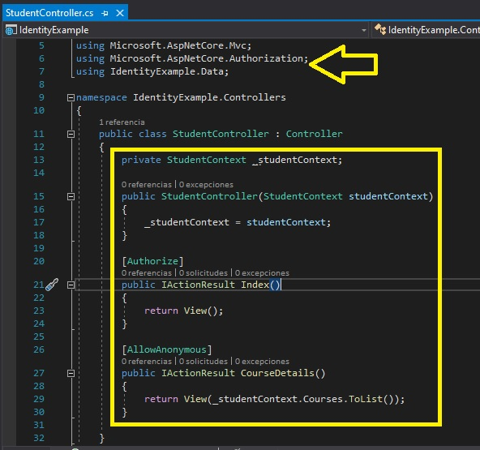

# Módulo 11: Gestión de la seguridad

# Laboratorio: Cifrado del informe de calificaciones

Fichero de Instrucciones: Instructions\20483C_MOD11_DEMO.md

Entregar el url de GitHub con la solución y un readme con las siguiente información:

1. **Nombres y apellidos:** José René Fuentes Cortez
2. **Fecha:** 24 de Diciembre 2020.
3. **Resumen del Modulo 11:** Este módulo consta de dos ejercicios:
    -  En el primer ejercio nos ayuda a entender como usar la metodología del ASP.NET Identity.
    - En el ejercicio 2 la práctica nos ayuda a entender como autorizar el acceso a acciones del Controller.


4. **Dificultad o problemas presentados y como se resolvieron:** Ninguna.

**NOTA**: Si no hay descripcion de problemas o dificultades, y al yo descargar el código para realizar la comprobacion y el código no funcionar, el resultado de la califaciación del laboratorio será afectado.

---

Siempre que la ruta a un archivo comience con *[Raíz del repositorio]*, reemplácela con la ruta absoluta a la carpeta en la que reside el repositorio 20486. Por ejemplo, si clonó o extrajo el repositorio 20486 en **C:\Users\John Doe\Downloads\20486**, cambiar el camino a: **[Repository Root]\AllFiles\20486D\Mod01** al **C:\Users\John Doe\Downloads\20486\AllFiles\20486D\Mod01**


# Lección 1: Autenticación en ASP.NET Core

### Demostración: cómo usar ASP.NET Core Identity

#### Pasos de preparación
 
1. Asegúrese de haber clonado el directorio 20483C de GitHub. Contiene los segmentos de código para los laboratorios y demostraciones de este curso. **(https://github.com/MicrosoftLearning/20486D-DevelopingASPNETMVCWebApplications/tree/master/Allfiles)**


#### Pasos de demostración


1. En el Explorador de archivos, navegue hasta **[Repository Root]\Allfiles\Mod11\Democode\01_IdentityExample_begin\IdentityExample**, y luego, desde la barra de direcciones, copie la dirección.


2. Haga clic en **Inicio** y luego escriba **cmd**.

3. En ** Mejor coincidencia**, haga clic con el botón derecho en **Símbolo del sistema** y luego haga clic en **Ejecutar como administrador**.

4. En el cuadro de diálogo **Control de cuentas de usuario**, haga clic en ** Sí**.

5. En la ventana **Administrador: Símbolo del sistema**, escriba el siguiente comando y luego presione Entrar.
   ```cs
       cd {copied folder path}
   ```

> **Nota**: Si la * {ruta de la carpeta copiada} * es diferente de la unidad de disco donde se encuentra el símbolo del sistema, entonces debe escribir * {unidad de disco}: * antes de escribir ** cd ** * { ruta de carpeta copiada} * comando.

6. En la ventana **Administrador: Símbolo del sistema**, escriba el siguiente comando y luego presione Entrar.
   ```cs
       npm install
   ```
> **Nota**: Si se muestran mensajes de advertencia en el símbolo del sistema, puede ignorarlos.

- La representación visual del codigo del ejercicio se muestra en la siguiente imagen:


7. Cierre la ventana.

8. En el Explorador de archivos, vaya a **[Repository Root]\Allfiles\Mod11\Democode\01_IdentityExample_begin** y, a continuación, haga doble clic en **IdentityExample.sln**.

    > **Nota**: Si aparece un cuadro de diálogo ** Advertencia de seguridad para IdentityExample**, verifique que la casilla de verificación ** Preguntarme por cada proyecto en esta solución ** esté desactivada y luego haga clic en Aceptar.

9. En la ventana **IdentityExample - Microsoft Visual Studio**, en el menú **DEBUG**, haga clic en ** Start Without Debugging**.

      > **Nota**: Examine la página.

- La representación visual del codigo del ejercicio se muestra en la siguiente imagen:


10. En Microsoft Edge, haga clic en ** Cerrar**.

11. En la ventana **IdentityExample - Microsoft Visual Studio**, en el Explorador de soluciones, haga clic en **Startup.cs**.

12. En la ventana de código **Startup.cs**, busque el siguiente código:
      ```cs
      using Microsoft.Extensions.DependencyInjection;
   ```

13. Asegúrese de que el cursor esté al final del espacio de nombres **Microsoft.Extensions.DependencyInjection**, presione Entrar y luego escriba el código siguiente:
      ```cs
      using IdentityExample.Models;
   ```

14. En la ventana de código **Startup.cs**, en el método **ConfigureServices**, coloque el cursor después del signo ** {** (llaves de apertura), presione Entrar, escriba el siguiente código y luego presione Entrar.
      ```cs
       services.AddDefaultIdentity<Student>(options =>
       {
           options.Password.RequireDigit = true;
           options.Password.RequiredLength = 7;
           options.Password.RequireUppercase = true;

           options.User.RequireUniqueEmail = true;
       })
        .AddEntityFrameworkStores<StudentContext>();
    ```
15. En la ventana de código **Startup.cs**, busque el siguiente código:
      ```cs
       app.UseStaticFiles();
    ```

- La representación visual del codigo del ejercicio se muestra en la siguiente imagen:


16. Coloque el cursor al final del código ubicado, presione Entrar dos veces y luego escriba el siguiente código:
      ```cs
       app.UseAuthentication();
    ```
17. En la ventana **IdentityExample - Microsoft Visual Studio**, en el Explorador de soluciones, expanda **Controllers** y luego haga clic en **StudentController.cs**.


18. En la ventana de código **StudentController.cs**, seleccione el siguiente código:
      ```cs
       public IActionResult Index()
       {
          return View();
       }
    ```

19. Reemplace el código seleccionado con el siguiente código:
      ```cs
       public IActionResult Index()
       {
           if (!this.User.Identity.IsAuthenticated)
           {
               return RedirectToAction("Login", "Account");
           }
           return View();
       }
    ```

- La representación visual del codigo del ejercicio se muestra en la siguiente imagen:


20. En la ventana **IdentityExample - Microsoft Visual Studio**, en el Explorador de soluciones, haga clic con el botón derecho en **Controlleres**, seleccione **Agregar** y luego haga clic en **Controller**.

21. En el cuadro de diálogo **Agregar andamio**, haga clic en **Controller MVC - Vacío** y luego haga clic en **Agregar**.

22. En el cuadro de diálogo **Agregar Controller MVC vacío**, en el cuadro **Nombre del Controller**, escriba **AccountController** y luego haga clic en **Agregar**.

23. En la ventana de código **AccountController.cs**, busque el siguiente código:
      ```cs
       using Microsoft.AspNetCore.Mvc;
    ```
24. Asegúrese de que el cursor esté al final del espacio de nombres **Microsoft.AspNetCore.Mvc**, presione Entrar y luego escriba el código siguiente:
    ```cs
       using IdentityExample.Models;
       using IdentityExample.ViewModels;
       using Microsoft.AspNetCore.Identity;
    ```
25. En la ventana de código **AccountController.cs**, seleccione el siguiente código:
    ```cs
       public IActionResult Index()
       {
          return View();
       }
    ```

26. Reemplace el código seleccionado con el siguiente código:
    ```cs
       public IActionResult Login()
       {
           if (this.User.Identity.IsAuthenticated)
           {
               return RedirectToAction("Index", "Student");
           }
           return View();
       }
    ```

27. Asegúrese de que el cursor esté al final del bloque de código del constructor **AccountController**, presione Intro dos veces y luego escriba el siguiente código:
    ```cs
       public IActionResult Login()
       {
           if (this.User.Identity.IsAuthenticated)
           {
               return RedirectToAction("Index", "Student");
           }
           return View();
       }
    ```


28. En la ventana del código **AccountController.cs**, asegúrese de que el cursor está al final del bloque de código de acción **Login**, pulse dos veces Intro y luego escriba el siguiente código:
    ```cs
       [HttpPost]
       public async Task<IActionResult> Login(LoginViewModel loginModel)
       {
           if (ModelState.IsValid)
           {
               var result = await _signInManager.PasswordSignInAsync(loginModel.UserName, loginModel.Password, loginModel.RememberMe, false);
               if (result.Succeeded)
               {
                   return RedirectToAction("Index", "Student");
               }
           }
           ModelState.AddModelError("", "Failed to Login");
           return View();
       }
    ```

29. En la ventana del código **AccountController.cs**, asegúrese de que el cursor está al final del bloque de código de acción **Login**, pulse dos veces Intro y luego escriba el siguiente código:
    ```cs
       public async Task<IActionResult> Logout()
       {
           await _signInManager.SignOutAsync();
           return RedirectToAction("Index", "Student");
       }
    ```

30. En la ventana del código **AccountController.cs**, asegúrese de que el cursor está al final del bloque de código de acción **Logout**, pulse dos veces Intro y luego escriba el siguiente código:
    ```cs
       public IActionResult Register()
       {
           return View();
       }
    ```

31. En la ventana del código **AccountController.cs**, asegúrese de que el cursor está al final del bloque de código de acción **Register**, presione Enter dos veces, y luego escriba el siguiente código:
    ```cs
       [HttpPost]
       public async Task<IActionResult> Register(RegisterViewModel registerModel)
       {
           if (ModelState.IsValid)
           {
               Student student = new Student
               {
                   FirstName = registerModel.FirstName,
                   LastName = registerModel.LastName,
                   UserName = registerModel.UserName,
                   PhoneNumber = registerModel.PhoneNumber,
                   Email = registerModel.Email
               };

               var result = await _userManager.CreateAsync(student, registerModel.Password);
               if (result.Succeeded)
               {
                   return RedirectToAction("Login", "Account");
               }
               foreach (var error in result.Errors)
               {
                   ModelState.AddModelError("", error.Description);
               }
           }
           return View();
       }
    ```

- La representación visual del codigo del ejercicio se muestra en la siguiente imagen:


32. En la ventana **IdentityExample - Microsoft Visual Studio**, en el menú **FILE**, haga clic en **Save All**.

33. En la ventana **Ejemplo de identidad - Microsoft Visual Studio**, en el menú **DEBUG**, haga clic en **Iniciar sin depuración**.

34. En la barra de menú, haga clic en **Portal del Estudiante**.

      >**Nota**: La página **Portal del Estudiante** es sólo para usuarios autorizados; por lo tanto, se le redirige a la página de inicio de sesión.

35. En la página de **Inicio de sesión**, haga clic en **Registro**.

36. En la página **Registrarse**, en la casilla **Nombre**, escriba _&lt;Un nombre de pila de su elección;._

37. En la página **Registrarse**, en el cuadro **Apellido**, escriba _&lt;Un apellido de su elección;._

38. En la página **Registrarse**, en la casilla **Número de teléfono**, escriba _&lt;Un número de teléfono de su elección;._

39. En la página **Registrarse**, en la casilla **Correo electrónico**, escriba _&lt;Una dirección de correo electrónico de su elección;._

40. En la página **Registrarse**, en la casilla **Nombre de usuario**, escriba _&lt;Un nombre de usuario de su elección;._

41. En la página **Registrarse**, en el cuadro **Contraseña**, escriba **123qwe!@#QWE**, y luego haga clic en **Registrarse**.

42. En la página **Entrar**, en la casilla **Nombre de usuario**, escriba _&lt;El nombre de usuario registrado

43. En la página **Entrar**, en la casilla **Contraseña**, escriba **123qwe!@#QWE**, y luego haga clic en **Entrar**.

      > **Nota**: Examine la página; ha sido autorizado a entrar en la página **Portal del Estudiante**.

44.  En Microsoft Edge, haga clic en **Cerrar**.

- La representación visual del codigo del ejercicio se muestra en la siguiente imagen:


45. En la ventana **IdentityExample - Microsoft Visual Studio**, en el menú **FILE**, haga clic en **Salir**.


# Lección 2: Autorización en el núcleo de ASP.NET

### Demonstration: Cómo autorizar el acceso a las acciones del Controller

#### Pasos de preparación 

Asegúrate de que has clonado el directorio **20486D** de GitHub. Contiene los segmentos de código para los laboratorios y demostraciones de este curso. 
**(https://github.com/MicrosoftLearning/20486D-DevelopingASPNETMVCWebApplications/tree/master/Allfiles)**

#### Pasos de demostración

1. En el Explorador de Archivos, navega a **[Repository Root]\Allfiles\Mod11\Democode\02_AuthorizeExample_begin\IdentityExample**, y luego copia la dirección en la barra de direcciones.

2. Haz clic en **Iniciar**, y luego escribe **cmd**.

3. En **Best match**, haz clic con el botón derecho del ratón en **Command Prompt**, y luego haz clic en **Run as administrator**.

4. En el cuadro de diálogo **Control de cuentas de usuario**, haga clic en **Sí**.

5. En el cuadro de diálogo **Administrador: Command Prompt**, escriba el siguiente comando y luego pulse Intro.
      ```cs
       cd {copia de la ruta de la carpeta}
    ```

>**Nota**: Si la *{pista de la carpeta copiada}* es diferente de la unidad de disco en la que se encuentra el símbolo del sistema, deberá escribir *{pista de disco}:* antes de escribir el comando **cd** *{pista de la carpeta copiada}*.

6. En el **Administrador: Command Prompt**, escriba el siguiente comando y, a continuación, pulse Intro.
      ```cs
       npm install
   ```
>**Nota**: Si se muestran mensajes de advertencia en la línea de comandos, puede ignorarlos.

- La representación visual del codigo del ejercicio se muestra en la siguiente imagen:


7. Cierre la ventana.

8. En el Explorador de Archivos, navega a **[Repository Root]\Allfiles\Mod11\Democode\02_AuthorizeExample_begin**, y luego haz doble clic en **IdentityExample.sln**.

    >**Nota**: Si aparece un cuadro de diálogo de **Aviso de seguridad para el IdentityExample**, verifique que la casilla de verificación **Ask me for each project in this solution** esté despejada, y luego haga clic en OK.

9. En la ventana **Ejemplo de identidad - Microsoft Visual Studio**, en el Explorador de soluciones, haga clic en **Startup.cs**.

10. En la ventana del código **Startup.cs**, localice el siguiente código:
      ```cs
      using Microsoft.Extensions.DependencyInjection;
    ```
11. Asegúrate de que el cursor está al final del espacio de nombres **Microsoft.Extensions.DependencyInjection**, presiona Enter y luego escribe el siguiente código:
    ```cs
      using Microsoft.AspNetCore.Identity;
    ```

12. En la ventana del código **Startup.cs**, seleccione el siguiente código:
       ```cs
       services.AddDefaultIdentity<Student>(options =>
    ```

13. Sustituya el código seleccionado por el siguiente código:
       ```cs
       services.AddDefaultIdentity<Student>(options =>
    ```

13. Sustituya el código seleccionado por el siguiente código:
       ```cs
       services.AddIdentity<Student, IdentityRole>(options =>
    ```
- La representación visual del codigo del ejercicio se muestra en la siguiente imagen:


14. En la ventana **IdentityExample - Microsoft Visual Studio**, en el Explorador de Soluciones, expanda **Controlleres**, y luego haga clic en **StudentController.cs**.

15. En la ventana de código **StudentController.cs**, localice el siguiente código:
      ```cs
      using Microsoft.AspNetCore.Mvc;
    ```

16. Asegúrate de que el cursor está al final del espacio de nombres **Microsoft.AspNetCore.Mvc**, presiona Enter, y luego escribe el siguiente código:
      ```cs
      using Microsoft.AspNetCore.Authorization;
      using IdentityExample.Data;
    ```

17. En la ventana del código **StudentController.cs**, seleccione el siguiente código:
      ```cs
       public IActionResult Index()
       {
           if (!this.User.Identity.IsAuthenticated)
           {
               return RedirectToAction("Login", "Account");
           }
           return View();
       }
    ```

18. Reemplazar el código seleccionado por el siguiente código:
       ```cs
       private StudentContext _studentContext;

       public StudentController(StudentContext studentContext)
       {
           _studentContext = studentContext;
       }

       [Authorize]
       public IActionResult Index()
       {
           return View();
       }
    ```

19. En la ventana del código **StudentController.cs**, asegúrese de que el cursor está al final del bloque de código de acción **Index**, pulse dos veces Intro y luego escriba el siguiente código:
      ```cs
       [AllowAnonymous]
       public IActionResult CourseDetails()
       {
           return View(_studentContext.Courses.ToList());
       }
    ```
- La representación visual del codigo del ejercicio se muestra en la siguiente imagen:



20. En la ventana **IdentityExample - Microsoft Visual Studio**, en el menú **FILE**, haga clic en **Save All**.

21. En la ventana **Ejemplo de identidad - Microsoft Visual Studio**, en el menú **DEBUG**, haga clic en **Iniciar sin depuración**.

22. En la barra de menú, haga clic en **Portal del Estudiante**.

    > **Nota**: La página del **Portal del Estudiante** es sólo para usuarios autorizados; por lo tanto, se le redirige a la página de inicio de sesión.

23. En la barra de menú, haga clic en **Nuestros Cursos**.

      >**Nota**: La página **Nuestros Cursos** está autorizada para todos los visitantes del sitio, por lo tanto, puede entrar en la página sin necesidad de registrarse.
      
24. En la barra de menú, haga clic en **Login**.

25. En la página de **Entrar**, haga clic en **Registrarse**.

26. En la página **Registrarse**, en la casilla **Nombre**, escriba _&lt;Un nombre de pila de su elección;._

27. En la página **Registrarse**, en el cuadro **Apellido**, escriba _&lt;Un apellido de su elección;._

28. En la página **Registrarse**, en el cuadro **Número de teléfono**, escriba _&lt;Un número de teléfono de su elección;._

29. En la página **Registrarse**, en la casilla **Correo electrónico**, escriba _&lt;Una dirección de correo electrónico de su elección;._

30. En la página **Registrarse**, en la casilla **Nombre de usuario**, escriba _&lt;Un nombre de usuario de su elección;._

31. En la página **Registrarse**, en el cuadro **Contraseña**, escriba **123qwe!@#QWE**, y luego haga clic en **Registrarse**.

32. 32. En la página **Entrar**, en la casilla **Nombre de usuario**, escriba _&lt;El nombre de usuario registrado

33. 33. En la página **Entrar**, en el cuadro **Contraseña**, escriba **123qwe!@#QWE**, y luego haga clic en **Entrar**.

      >**Nota**: Examina la página; has sido autorizado a entrar en la página **Portal del Estudiante**.

- La representación visual del codigo del ejercicio se muestra en la siguiente imagen:


34.  En Microsoft Edge, haga clic en **Cerrar**.

35. 35. En la ventana **IdentityExample - Microsoft Visual Studio**, en el menú **FILE**, haga clic en **Salir**.


