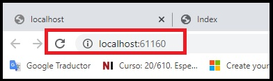
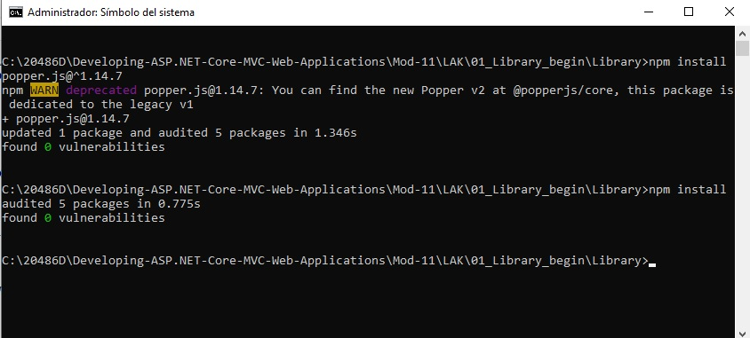

# Module 11: Manejando la seguridad

Siempre cuando un camino comienza con  *[Repository Root]*, reemplacelo con el camino absoluto en el que el repositorio 20486 reside. Por ejemplo, si tu has cloneado o extraido el repositorio 20486 en la carpeta **C:\Users\John Doe\Downloads\20486**, cambiar la ruta de: **[Repository Root]\AllFiles\20486D\Mod01** a **C:\Users\John Doe\Downloads\20486\AllFiles\20486D\Mod01**.

Fichero de Instrucciones: Instructions\20486D_MOD11_LAK.md

**Información:**

1. **Nombres y apellidos:** José René Fuentes Cutz
2. **Fecha:** 24 de Diciembre 2020.
3. **Resumen del Ejercicio:** Este laboratorio consta de 3 ejercicios:
- En el Primer ejercicio nos muestra como configurar la identidad en la aplicación, añadir lógica a las páginas de inicio de sesión y registro, y recuperar los datos de la identidad.
- En el Segundo ejercicio podemos agregar la autorización en la aplicación, y añadir la configuración y el atributo pertinente para la autenticación de políticas basadas en funciones y en reclamaciones.
- En el Tercer ejercicio aprendemos como evitar el Cross Forgery Attack(ataque de falsificación de solicitudes cruzadas).

4. **Dificultad o problemas presentados y como se resolvieron:** Ninguna.

**NOTA**: Si no hay descripcion de problemas o dificultades, y al yo descargar el código para realizar la comprobacion y el código no funcionar, el resultado de la califaciación del laboratorio será afectado.

---

# Módulo 11: Manejo de la seguridad

Dondequiera que la ruta de un archivo comience con *[Raíz del repositorio]*, reemplácela con la ruta absoluta de la carpeta en la que reside el repositorio 20486. Por ejemplo, si clonaste o extrajiste el repositorio 20486 a **C:\Usuarios\John Doe\Descargas\20486**, cambia la ruta: **[Repository Root]\AllFiles\20486D\Mod01** a **C:\Users\John Doe\Downloads\20486\AllFiles\20486D\Mod01** 

# Laboratorio: Gestión de la seguridad

### Lab Setup

Tiempo estimado: **60 minutos**

### Preparation Steps

1. Asegúrate de que has clonado el directorio **20486D** de GitHub. Contiene los segmentos de código para los laboratorios y demostraciones de este curso. 
**(https://github.com/MicrosoftLearning/20486D-DevelopingASPNETMVCWebApplications/tree/master/Allfiles)**

2. Navega a **[Repository Root]\Allfiles\Mod11\Labfiles\01_Library_begin**, y luego abre la **Library.sln**.

    >**Nota**: Si aparece un cuadro de diálogo de **Aviso de Seguridad para la Library**, verifica que la casilla de verificación **Pregúntame por cada proyecto de esta solución** está despejada, y luego haz clic en OK.

3. En la ventana **Library - Microsoft Visual Studio**, en el menú **DEBUG**, haga clic en **Iniciar sin depuración**.

4. En Microsoft Edge, en la barra de direcciones, anote el número de puerto que aparece al final del URL **http://localhost:[port]**. Usarás el número de puerto durante este laboratorio.

- La representación visual de la resolución del ejercicio se muestra en la siguiente imagen:



5. En Microsoft Edge, haz clic en **Cerrar**.

### Ejercicio 1: Usar la identidad

#### Tarea 1: Añadir el contexto de la base de datos del marco de entidades

1. En el Explorador de Archivos, navega a **[Repository Root]\Allfiles\Mod11\Labfiles\01_Library_begin\Library**, y luego desde la barra de direcciones, copia la dirección.

2. Haz clic en **Start**, y luego escribe **cmd**.

3. En **Best match**, haz clic con el botón derecho del ratón en **Command Prompt**, y luego haz clic en **Run as administrator**.

4. En el cuadro de diálogo **Control de cuentas de usuario**, haga clic en **Sí**.

5. En el cuadro de diálogo **Administrador: Command Prompt**, escriba el siguiente comando y luego pulse Intro.
  ```cs
       cd  {copied folder path}
  ```

  > **Nota**: Si la *{pista de la carpeta copiada}* es diferente de la unidad de disco en la que se encuentra el símbolo del sistema, deberá escribir *{unidad de disco}:* antes de escribir el comando **cd** *{pista de la carpeta copiada}*.

6. En el **Administrador: Command Prompt**, escriba el siguiente comando y, a continuación, pulse Intro.
  ```cs
       npm install
  ```
>**Nota**: Si se muestran mensajes de advertencia en la línea de comandos, puede ignorarlos.

- La representación visual de la resolución del ejercicio se muestra en la siguiente imagen:



7. Cierre la ventana.

8. En el Explorador de Archivos, navega a **[Repository Root]\Allfiles\Mod11\Labfiles\01_Library_begin**, y luego haz doble clic en **Library.sln**.

    >**Nota**: Si aparece un cuadro de diálogo de **Aviso de Seguridad para la Library**, verifique que la casilla de verificación **Pregúntame por cada proyecto de esta solución** esté despejada, y luego haga clic en OK.

9. En la ventana **Library - Microsoft Visual Studio**, en el Explorador de soluciones, expanda **Models**, y luego haga clic en **User.cs**.

10. En la ventana de código de **User.cs**, localice el siguiente código:
  ```cs
      using System.Threading.Tasks;
  ```
11. Asegúrate de que el cursor está al final del espacio de nombres **System.Threading.Tasks**, presiona Enter, y luego escribe el siguiente código:
  ```cs
      using Microsoft.AspNetCore.Identity;
  ```

12. En la ventana del código **User.cs**, localice el siguiente código:
  ```cs
      public class User
  ```

13.  Añada el siguiente código a la línea de código existente.
  ```cs
      : IdentityUser
  ```

14. En la ventana **Library - Microsoft Visual Studio**, en el Explorador de Soluciones, expanda **Datos**, y luego haga clic en **LibraryContext.cs**.

15. En la ventana del código **LibraryContext.cs**, localice el siguiente código:
  ```cs
      using System.Threading.Tasks;
  ```
16. Asegúrate de que el cursor está al final del espacio de nombres **System.Threading.Tasks**, presiona Enter, y luego escribe el siguiente código:
  ```cs
      using Microsoft.AspNetCore.Identity.EntityFrameworkCore;
  ```

17. En la ventana del código **LibraryContext.cs**, localice el siguiente código:
  ```cs
      public class LibraryContext : DbContext
  ```

18. Reemplazar el código seleccionado por el siguiente código:
  ```cs
     public class LibraryContext : IdentityDbContext<User>
  ```

#### Tarea 2: Habilitar el uso de la identidad

1. En la ventana **Library - Microsoft Visual Studio**, en el Explorador de Soluciones, haga clic en **Startup.cs**.

2. En la ventana del código **Startup.cs**, localice el siguiente código:
  ```cs
     using Microsoft.Extensions.DependencyInjection;
  ```
3. Asegúrate de que el cursor está al final del espacio de nombres **Microsoft.Extensions.DependencyInjection**, presiona Enter, y luego escribe el siguiente código:

  ```cs
      using Library.Models;
      using Microsoft.AspNetCore.Identity;
  ```

4. En la ventana del código **Startup.cs**, en el método **ConfigureServices**, coloque el cursor después del signo **{** (abrazaderas), presione Enter, escriba el siguiente código y luego presione Enter.
  ```cs
       services.AddIdentity<User, IdentityRole>(options =>
       {
           options.Password.RequireDigit = true;
           options.Password.RequiredLength = 7;
           options.Password.RequireUppercase = true;

           options.User.RequireUniqueEmail = true;
       })
        .AddEntityFrameworkStores<LibraryContext>();
  ```
5. En la ventana del código **Startup.cs**, localice el siguiente código:
  ```cs
       app.UseStaticFiles();
  ```

6. Ponga el cursor al final del código localizado, presione Enter dos veces, y luego escriba el siguiente código:
  ```cs
       app.UseAuthentication();
  ```

#### Tarea 3: Añadir el signo en la lógica

1. En la ventana **Library - Microsoft Visual Studio**, en el Explorador de soluciones, haga clic con el botón derecho del ratón en **Controllers**, apunte a **Agregar**, y luego haga clic en **Controller**.

2. En el cuadro de diálogo **Agregar andamiaje**, haga clic en **Controller MVC - Vaciar**, y luego haga clic en **Agregar**.

3. En el cuadro de diálogo **Añadir Controller MVC vacío**, en el cuadro **Nombre del Controller**, escriba **AccountController** y, a continuación, haga clic en **Añadir**.

4. En la ventana de código **AccountController.cs**, localice el siguiente código:
  ```cs
       using Microsoft.AspNetCore.Mvc;
  ```
5. Asegúrate de que el cursor está al final del espacio de nombres **Microsoft.AspNetCore.Mvc**, presiona Enter, y luego escribe el siguiente código:
  ```cs
       using Library.Models;
       using Library.ViewModels;
       using Microsoft.AspNetCore.Identity;
  ```
6. En la ventana del código **AccountController.cs**, seleccione el siguiente código:
  ```cs
       public IActionResult Index()
       {
          return View();
       }
  ```

7. Reemplazar el código seleccionado por el siguiente código:
  ```cs
       private SignInManager<User> _signInManager;
       private UserManager<User> _userManager;

       public AccountController(SignInManager<User> signInManager, UserManager<User> userManager)
       {
           _signInManager = signInManager;
           _userManager = userManager;
       }
  ```

8. Asegúrate de que el cursor está al final del bloque de código de construcción **AccountController**, pulsa dos veces Intro y luego escribe el siguiente código:
  ```cs
       public IActionResult Login()
       {
           if (this.User.Identity.IsAuthenticated)
           {
               return RedirectToAction("Index", "Library");
           }
           return View();
       }
  ```

9. En la ventana del código **AccountController.cs**, asegúrese de que el cursor está al final del bloque de código de acción **Login**, pulse dos veces Intro y luego escriba el siguiente código:

  ```cs
       [HttpPost, ActionName("Login")]
       public async Task<IActionResult> LoginPost(LoginViewModel loginModel)
       {
           if (ModelState.IsValid)
           {
               var result = await _signInManager.PasswordSignInAsync(loginModel.UserName, loginModel.Password, loginModel.RememberMe, false);
               if (result.Succeeded)
               {
                   return RedirectToAction("Index", "Library");
               }
           }
           ModelState.AddModelError("", "Faild to Login");
           return View();
       }
  ```


10. En la ventana del código **AccountController.cs**, asegúrese de que el cursor esté al final del bloque de código de acción **LoginPost**, pulse dos veces Intro y luego escriba el siguiente código:
  ```cs
       public async Task<IActionResult> Logout()
       {
           await _signInManager.SignOutAsync();
           return RedirectToAction("Index", "Library");
       }
  ```

#### Tarea 4: Añadir la lógica de registro de usuarios

1. En la ventana del código **AccountController.cs**, asegúrese de que el cursor esté al final del bloque de código de acción **Logout**, pulse dos veces Intro y luego escriba el siguiente código:
  ```cs
       public IActionResult Register()
       {
           return View();
       }
  ```

2. En la ventana del código **AccountController.cs**, asegúrese de que el cursor está al final del bloque de código de acción **Register**, presione Enter dos veces, y luego escriba el siguiente código:
  ```cs
       [HttpPost, ActionName("Register")]
       public async Task<IActionResult> RegisterPost(RegisterViewModel registerModel)
       {
           if (ModelState.IsValid)
           {
               User user = new User
               {
                   FirstName = registerModel.FirstName,
                   LastName = registerModel.LastName,
                   UserName = registerModel.UserName,
                   PhoneNumber = registerModel.PhoneNumber,
                   Email = registerModel.Email
               };

               var result = await _userManager.CreateAsync(user, registerModel.Password);
               if (result.Succeeded)
               {
                   var resultSignIn = await _signInManager.PasswordSignInAsync(registerModel.UserName, registerModel.Password,registerModel.RememberMe,false);
                   if (resultSignIn.Succeeded)
                   {
                       return RedirectToAction("Index", "Library");
                   }
               }
               foreach (var error in result.Errors)
               {
                   ModelState.AddModelError("", error.Description);
               }
           }
           return View();
       }
  ```

3. En la ventana del código **AccountController.cs**, asegúrese de que el cursor está al final del bloque de código de acción **RegisterPost**, pulse dos veces Intro y luego escriba el siguiente código:
  ```cs
       public IActionResult AccessDenied()
       {
           return View();
       }
  ```

#### Tarea 5: Recuperar datos de la propiedad Identidad

1.  En la ventana **Library - Microsoft Visual Studio**, en el Explorador de Soluciones, expandir **Vistas**, expandir **Library**, y luego hacer clic en **Libro de Préstamo.cshtml**.

2. En la ventana del código **LendingBook.cshtml**, localice el siguiente código:
  ```cs
       @{
           ViewData["Title"] = "LendingBook";
       }
  ```
3. Ponga el cursor al final del código localizado, presione dos veces la tecla Enter y luego escriba el siguiente código:
  ```cs
       <h1 class="title">Hello @User.Identity.Name - Lending Book Information</h1>
  ```
4. En la ventana **Library - Microsoft Visual Studio**, en el Explorador de Soluciones, en **Vistas**, expandir **Compartido**, y luego hacer clic en **_Disposición.cshtml**.

5. En la ventana de código **_Layout.cshtml**, localice el siguiente código:
  ```cs
       <li class="nav-item">
           <a class="nav-link" href="@Url.Action("GetBooksByGener", "Library")">Our Books</a>
       </li>
  ```
6. Ponga el cursor al final del código localizado, presione Enter dos veces, y luego escriba el siguiente código:

  ```cs
       @if (User.IsInRole("Administrator"))
       {
           <li class="nav-item">
               <a class="nav-link" href="@Url.Action("Index", "Librarian")">Workers Portal</a>
           </li>
       }
       @if (User.Identity.IsAuthenticated)
       {
           <li class="nav-item">
               <a class="nav-link" href="@Url.Action("Logout", "Account")">Logout</a>
           </li>
       }
       else
       {
           <li class="nav-item">
               <a class="nav-link" href="@Url.Action("Login", "Account")">Login</a>
           </li>
       }
  ```

#### Tarea 6: Ejecutar la aplicación

1. En la ventana de **Library - Microsoft Visual Studio**, en el menú **FILE**, haga clic en **Save All**.

2. En la ventana **Library - Microsoft Visual Studio**, en el menú **DEBUG**, haga clic en **Iniciar sin depuración**.

3. En la barra de menú, haga clic en **Nuestros libros**.

    >**Nota**: La página de **Nuestros Libros** es sólo para usuarios autorizados; por lo tanto, se redirigió a la página de inicio de sesión.

4. En la página de **Inicio de sesión**, haga clic en **Registro**.

5. En la página **Registrarse**, en la casilla **Nombre**, escriba _&lt;Un nombre de pila de su elección;._

6. En la página **Registrarse**, en el cuadro **Apellido**, escriba _&lt;Un apellido de su elección;._

7. En la página de **Registro**, en la casilla **Número de teléfono**, escriba _&lt;Un número de teléfono de su elección;._

8. En la página **Registrarse**, en la casilla **Correo electrónico**, escriba _&lt;Una dirección de correo electrónico de su elección;._

9. En la página **Registrarse**, en la casilla **Nombre de usuario**, escriba _&lt;Un nombre de usuario de su elección;._

10. En la página **Registrarse**, en el cuadro **Contraseña**, escriba **123qwe!@#QWE**, y luego haga clic en **Registrarse**.

11. En la barra de menú, haga clic en **Nuestros libros**.

      >**Nota**: Examine la página; se le ha autorizado a entrar en la página de **Nuestros Libros**, y los datos de su nombre de usuario se han recuperado de la propiedad Identidad.

12. En la página **Nuestros Libros**, seleccione un libro de su elección, y luego haga clic en **Prestar un Libro**.

13. Haga clic en **Prestar un libro**.

      >**Nota**: El libro que prestó ya no está disponible.

14.  En Microsoft Edge, haga clic en **Cerrar**.


>**Resultados**: Después de completar este ejercicio, podrá configurar la identidad en la aplicación, añadir lógica a las páginas de inicio de sesión y registro, y recuperar los datos de la identidad.


### Ejercicio 2: Agregar autorización

#### Tarea 1: Agregar un atributo de autorización a una acción

1. En la ventana **Library - Microsoft Visual Studio**, en el Explorador de Soluciones, expanda **Controllers**, y luego haga clic en **LibraryController.cs**.

2. En la ventana de código **LibraryController.cs**, localice el siguiente código:
  ```cs
      using Microsoft.AspNetCore.Mvc;
  ```
3. Asegúrate de que el cursor está al final del espacio de nombres **Microsoft.AspNetCore.Mvc**, presiona Enter, y luego escribe el siguiente código:
  ```cs
      using Microsoft.AspNetCore.Authorization;
  ```
4. En el bloque de código de acción **Index**, localiza el siguiente código:
  ```cs
       public IActionResult Index()
  ```
5. Coloque el cursor antes del código localizado, presione la tecla de flecha hacia arriba y luego escriba el siguiente código:
  ```cs
       [AllowAnonymous]
  ```  

6. En el bloque de código de acción **GetBooksByGener**, localiza el siguiente código:
  ```cs
       public IActionResult GetBooksByGener()
  ```

7. Coloque el cursor antes del código localizado, presione la tecla de flecha hacia arriba y luego escriba el siguiente código:
  ```cs
       [Authorize]
  ```  

8. En el bloque de código de acción **GetBooksByGener**, seleccione el siguiente código:
  ```cs
       if (this.User.Identity.IsAuthenticated)
       {
           var booksGenerQuery = from b in _context.Books
                                 orderby b.Genre.Name
                                 select b;

           return View(booksGenerQuery);
       }
       return RedirectToAction("Login", "Account");
  ```

9. Reemplazar el código seleccionado por el siguiente código:
  ```cs
       var booksGenerQuery = from b in _context.Books
                             orderby b.Genre.Name
                             select b;

       return View(booksGenerQuery);
  ```

10. En el bloque de código de acción **LendingBookPost**, localiza el siguiente código:

  ```cs
       public async Task<IActionResult> LendingBookPost(int id)
  ```


11. Coloque el cursor antes del código localizado, presione la tecla de flecha hacia arriba y luego escriba el siguiente código:
  ```cs
       [Authorize]
  ``` 
#### Tarea 2: Añadir autenticación de políticas basada en funciones

1. En la ventana **Library - Microsoft Visual Studio**, en el Solution Explorer, expande **ViewModels**, y luego haz clic en **RegisterViewModel.cs**.

2. En la ventana de código **RegisterViewModel.cs**, localice el siguiente código:
  ```cs
       [Display(Name = "Last Name")]
       [Required(ErrorMessage = "Please enter your last name")]
       public string LastName { get; set; }
  ```

3. Ponga el cursor al final del código localizado, presione dos veces la tecla Enter y luego escriba el siguiente código:
  ```cs
       [Display(Name = "Role Name")]
       [Required(ErrorMessage = "Please select a role")]
       public string RoleName { get; set; }
  ```

4. En la ventana **Library - Microsoft Visual Studio**, en el Solution Explorer, en **Controllers**, haga clic en **AccountController.cs**.

5. En la ventana de código **AccountController.cs**, seleccione el siguiente código:
  ```cs
       private SignInManager<User> _signInManager;
       private UserManager<User> _userManager;

       public AccountController(SignInManager<User> signInManager, UserManager<User> userManager)
       {
           _signInManager = signInManager;
           _userManager = userManager;
       }
  ```

6. Sustituya el código seleccionado por el siguiente código:
  ```cs
       private SignInManager<User> _signInManager;
       private UserManager<User> _userManager;
       private RoleManager<IdentityRole> _roleManager;

       public AccountController(SignInManager<User> signInManager, UserManager<User> userManager, RoleManager<IdentityRole> roleManager)
       {
           _signInManager = signInManager;
           _userManager = userManager;
           _roleManager = roleManager;
       }
  ```

7. En la ventana del código **AccountController.cs**, en el bloque de código de acción **RegisterPost**, seleccione el siguiente código:
  ```cs
       var result = await _userManager.CreateAsync(user, registerModel.Password);
       if (result.Succeeded)
       {
           var resultSignIn = await _signInManager.PasswordSignInAsync(registerModel.UserName, registerModel.Password, registerModel.RememberMe, false);
           if (resultSignIn.Succeeded)
           {
               return RedirectToAction("Index", "Library");
           }
       }
  ```

8. Reemplazar el código seleccionado por el siguiente código:
  ```cs
        var result = await _userManager.CreateAsync(user, registerModel.Password);
        if (result.Succeeded)
        {
            bool roleExists = await _roleManager.RoleExistsAsync(registerModel.RoleName);
            if (!roleExists)
            {
                await _roleManager.CreateAsync(new IdentityRole(registerModel.RoleName));
            }

            if (!await _userManager.IsInRoleAsync(user, registerModel.RoleName))
            {
                await _userManager.AddToRoleAsync(user, registerModel.RoleName);
            }

            var resultSignIn = await _signInManager.PasswordSignInAsync(registerModel.UserName, registerModel.Password,registerModel.RememberMe,false);
            if (resultSignIn.Succeeded)
            {
                return RedirectToAction("Index", "Library");
            }
        }
  ```

9. En la ventana **Library - Microsoft Visual Studio**, en el Explorador de Soluciones, en **Vistas**, expandir **Cuenta**, y luego hacer clic en **Registro.cshtml**.

10. En la ventana del código **Register.cshtml**, localice el siguiente código:

  ```cs
       <div class="form-group row">
           <label asp-for="Password" class="col-sm-4 col-form-label"></label>
           <div class="col-sm-6">
               <input asp-for="Password" type="password" class="form-control" placeholder="Password" required>
               <span asp-validation-for="Password"></span>
           </div>
       </div>
  ```

11. Ponga el cursor al final del código localizado, presione Enter y luego escriba el siguiente código:
  ```cs
       <div class="form-group row">
           <label asp-for="RoleName" class="col-sm-4 col-form-label"></label>
           <div class="col-sm-6">
               <select asp-for="RoleName" class="form-control">
                   <option selected>Member</option>
                   <option>Administrator</option>
               </select>
           </div>
       </div>
  ```

12. En la ventana **Library - Microsoft Visual Studio**, en el Solution Explorer, en **Controllers**, haga clic en **LibrarianController.cs**.

13. En la ventana de código **LibrarianController.cs**, localice el siguiente código:
  ```cs
      using Microsoft.AspNetCore.Mvc;
  ```

14. Asegúrate de que el cursor está al final del espacio de nombres **Microsoft.AspNetCore.Mvc**, presiona Enter, y luego escribe el siguiente código:
  ```cs
     using Microsoft.AspNetCore.Authorization;
  ```

15. En la ventana del código **LibrarianController.cs**, localice el siguiente código:
  ```cs
     public class LibrarianController : Controller
  ```

16. Coloque el cursor antes del código localizado, presione la tecla de flecha hacia arriba y luego escriba el siguiente código:
  ```cs
       [Authorize(Roles = "Administrator")]
  ``` 

#### Tarea 3: Añadir autenticación de políticas basada en reclamaciones

1. En la ventana **Library - Microsoft Visual Studio**, en el Explorador de Soluciones, haga clic en **Startup.cs**.

2. En la ventana del código **Startup.cs**, localice el siguiente código:
  ```cs
     using Microsoft.Extensions.DependencyInjection;
  ```

3. Asegúrate de que el cursor está al final del espacio de nombres **Microsoft.Extensions.DependencyInjection**, presiona Enter, y luego escribe el siguiente código:
  ```cs
      using System.Security.Claims;
  ```

4. En la ventana del código **Startup.cs**, localiza el siguiente código:
  ```cs
       services.AddMvc();
  ```

5. Ponga el cursor al final del código localizado, presione Enter dos veces, y luego escriba el siguiente código:
  ```cs
       services.AddAuthorization(options =>
       {
           options.AddPolicy("RequireEmail", policy => policy.RequireClaim(ClaimTypes.Email));
       });
  ```

6. En la ventana **Library - Microsoft Visual Studio**, en el Solution Explorer, en **Controllers**, haga clic en **AccountController.cs**.

7. En la ventana del código **AccountController.cs**, localice el siguiente código:
  ```cs
      using Microsoft.AspNetCore.Identity;
  ```

8. Asegúrate de que el cursor está al final del espacio de nombres **Microsoft.AspNetCore.Identity**, presiona Enter y luego escribe el siguiente código:
  ```cs
      using System.Security.Claims;
  ```

9. En la ventana del código **AccountController.cs**, en el bloque de código de acción **RegisterPost**, seleccione el siguiente código:

  ```cs
       var result = await _userManager.CreateAsync(user, registerModel.Password);
        if (result.Succeeded)
        {
            bool roleExists = await _roleManager.RoleExistsAsync(registerModel.RoleName);
            if (!roleExists)
            {
                await _roleManager.CreateAsync(new IdentityRole(registerModel.RoleName));
            }

            if (!await _userManager.IsInRoleAsync(user, registerModel.RoleName))
            {
                await _userManager.AddToRoleAsync(user, registerModel.RoleName);
            }

            var resultSignIn = await _signInManager.PasswordSignInAsync(registerModel.UserName, registerModel.Password,registerModel.RememberMe,false);
            if (resultSignIn.Succeeded)
            {
                return RedirectToAction("Index", "Library");
            }
        }
  ```

10. Reemplace el código seleccionado por el siguiente código:
  ```cs
        var result = await _userManager.CreateAsync(user, registerModel.Password);
        if (result.Succeeded)
        {
            bool roleExists = await _roleManager.RoleExistsAsync(registerModel.RoleName);
            if (!roleExists)
            {
                await _roleManager.CreateAsync(new IdentityRole(registerModel.RoleName));
            }

            if (!await _userManager.IsInRoleAsync(user, registerModel.RoleName))
            {
                await _userManager.AddToRoleAsync(user, registerModel.RoleName);
            }

            if (!string.IsNullOrWhiteSpace(user.Email))
            {
                Claim claim = new Claim(ClaimTypes.Email, user.Email);
                await _userManager.AddClaimAsync(user, claim);
            }

            var resultSignIn = await _signInManager.PasswordSignInAsync(registerModel.UserName, registerModel.Password,registerModel.RememberMe,false);
            if (resultSignIn.Succeeded)
            {
                return RedirectToAction("Index", "Library");
            }
        }
  ```
11. En la ventana **Library - Microsoft Visual Studio**, en el Solution Explorer, en **Controllers**, haga clic en **LibrarianController.cs**.

12. En la ventana de código **LibrarianController.cs**, localice el siguiente código:
  ```cs
       [Authorize(Roles = "Administrator")]
  ```

13. Coloque el cursor antes del código localizado, presione la tecla de flecha hacia arriba y luego escriba el siguiente código:
  ```cs
       [Authorize(Policy = "RequireEmail")]
  ``` 

#### Tarea 4: Ejecutar la aplicación

1. En la ventana de **Library - Microsoft Visual Studio**, en el menú **FILE**, haga clic en **Save All**.

2. En la ventana **Library - Microsoft Visual Studio**, en el menú **DEBUG**, haga clic en **Iniciar sin depuración**.

3. 3. En la barra de menú, haga clic en **Login**.

4. En la página **Entrar**, haga clic en **Registrarse**.

5. En la página **Registrarse**, en la casilla **Nombre**, escriba _&lt;Un nombre de pila de su elección;._

6. En la página **Registrarse**, en el cuadro **Apellido**, escriba _&lt;Un apellido de su elección;._

7. En la página de **Registro**, en la casilla **Número de teléfono**, escriba _&lt;Un número de teléfono de su elección;._

8. En la página **Registrarse**, en la casilla **Correo electrónico**, escriba _&lt;Una dirección de correo electrónico de su elección;._

9. En la página **Registrarse**, en la casilla **Nombre de usuario**, escriba _&lt;Un nombre de usuario de su elección;._

10. En la página **Registrarse**, en el cuadro **Contraseña**, escriba **123qwe!@#QWE**.

11. En la página **Registrarse**, en la lista **Nombre de la función**, seleccione **Administrador**, y luego haga clic en **Registrarse**.

12. En la barra de menú, haga clic en **Portal del Trabajador**.

      >**Nota**: Examine la página; usted ha sido autorizado a entrar en la página **Portal del Trabajador**, porque usted es un administrador.

13. En la página **Añadir Libro a la Library**, haga clic en **Añadir Libro a la Library**.

14. En la página **Agregar Libro a la Library**, en la lista de **Género**, seleccione _&lt;Un género de su elección;._

15. En la página **Agregar Libro a la Library**, en la casilla **Nombre**, escriba _&lt;Un nombre de su elección;._

16. En la página **Agregar Libro a la Library**, en el cuadro **Autor**, escriba _&lt;Un autor de su elección;._

17. En la página **Agregar Libro a la Library**, en la casilla **Fecha de publicación**, escriba _&lt;una fecha de publicación de su elección;._

18. En la página **Agregar Libro a la Library**, en la casilla **Foto**, importa una imagen de **[Raíz del Repositorio]} Allfiles {Mod11}Labfiles\N-Image\Book.jpg**, y luego haz clic en **Agregar un Libro**.

19. Haz clic en **Volver a nuestros libros**.

      >**Nota**: El libro que has añadido está en la lista de libros de la Library.

20. En la barra de menú, haga clic en **Salir**.

21. En la barra de menú, haga clic en **Conexión**.

22. En la página **Entrar**, haga clic en **Registrarse**.

23. En la página **Registrarse**, en la casilla **Nombre**, escriba _&lt;Un nombre de pila de su elección;._

24. En la página **Registrarse**, en el cuadro **Apellido**, escriba _&lt;Un apellido de su elección;._

25. En la página **Registrarse**, en la casilla **Número de teléfono**, escriba _&lt;Un número de teléfono de su elección;._

26. En la página de **Registro**, en la casilla de **Email**, escriba _&lt;Una dirección de correo electrónico de su elección;._

27. En la página **Registrarse**, en la casilla **Nombre de usuario**, escriba _&lt;Un nombre de usuario de su elección;._

28. En la página **Registrarse**, en el cuadro **Contraseña**, escriba **123qwe!@#QWE**.

29. En la página **Registrarse**, en la lista **Nombre de la función**, seleccione **Miembro**, y luego haga clic en **Registrarse**.


30. En Microsoft Edge, en la barra de direcciones, escriba **http://localhost:[port]/Library/Índice**, y luego presione Enter.

      >**Nota**: Se le redirige a la página **acceso denegado**; sólo los administradores pueden ver la página. También tenga en cuenta que la barra de menú no tiene una pestaña de navegación para el **Portal de Trabajadores**.

31.  En Microsoft Edge, haga clic en **Cerrar**.

>**Resultados**: Después de completar este ejercicio, podrá agregar la autorización en la aplicación, y añadir la configuración y el atributo pertinente para la autenticación de políticas basadas en funciones y en reclamaciones.

### Ejercicio 3: Evitar el ataque de falsificación de solicitudes en varios sitios

#### Tarea 1: Escribir el ataque de falsificación de solicitudes en todos los sitios

1. En el Explorador de soluciones, haga clic con el botón derecho del ratón en **CrossSiteRequestForgeryAttack**, apunte a **Add**, y luego haga clic en **New Folder**.

2. En el cuadro **Nueva Carpeta**, escriba **Controllers**, y luego presione Enter.

3. En la ventana **Library - Microsoft Visual Studio**, en el Solution Explorer, en el proyecto **CrossSiteRequestForgeryAttack**, haga clic con el botón derecho del ratón en la carpeta **Controllers**, apunte a **Add**, y luego haga clic en **Controller**.

4. En el cuadro de diálogo **Agregar andamiaje**, haga clic en **Controller MVC - Vaciar**, y luego haga clic en **Agregar**.

5. En el cuadro de diálogo **Añadir Controller MVC vacío**, en el cuadro **Nombre del Controller**, escriba **Controller doméstico** y, a continuación, haga clic en **Añadir**.

6. En la ventana de código **HomeController.cs**, haga clic con el botón derecho del ratón en el siguiente código y, a continuación, haga clic en **Agregar vista**.
  ```cs
    public IActionResult Index()
  ```

7. En el cuadro de diálogo **Añadir vista de MVC**, asegúrate de que el valor en el cuadro **Nombre de la vista** es **Índice**.

8. En el cuadro de diálogo **Agregar vista MVC**, asegúrese de que la plantilla **Vacío (sin modelo)** esté seleccionada.

9. En el cuadro de diálogo **Agregar vista MVC**, asegúrese de que las casillas de verificación **Crear como una vista parcial** y **Utilizar una página de diseño** están desactivadas y, a continuación, haga clic en **Agregar**.

10. En la ventana de código **Index.cshtml**, localice el siguiente código:
  ```cs
    <title>Index</title>
  ```

11. Ponga el cursor al final del código localizado, presione Enter y luego escriba el siguiente código:
  ```cs
    <link href="~/css/style.css" rel="stylesheet" />
  ```

12. En la ventana del código **Index.cshtml**, en el elemento **BODY**, escriba el siguiente código:
  ```cs
    <h1>Cross-Site Request Forgery Attack</h1>
    <h3>Click - Submit to Perform the Attack</h3>
    <form action="http://localhost:[port]/Account/Register?FirstName=Forgery_Attacker&LastName=Cross_Site&PhoneNumber=123&Email=attack@@.com&UserName=Forgery_Attacker&Password=123qwe!!!QWE123&RoleName=Member" method="post">
        <input type="submit" value="Attack">
    </form>
  ```

#### Tarea 2: Ejecutar la aplicación - Ahora el ataque es posible

1. En la ventana de **Library - Microsoft Visual Studio**, en el menú **FILE**, haga clic en **Save All**.

2. En el Explorador de soluciones, haga clic con el botón derecho en **Library**, y luego haga clic en **Configurar como proyecto de inicio**. 

3. En la ventana **Library - Microsoft Visual Studio**, en el menú **DEBUG**, haga clic en **Iniciar sin depuración**.

      >**Nota**: La barra de menú tiene una pestaña de navegación para **Login** lo que significa que no estás conectado.

4. En el Explorador de soluciones, haga clic con el botón derecho del ratón en **CrossSiteRequestForgeryAttack**, apunte a **Debug**, y luego haga clic en **Start new instance**.

5. En la página **Cross-Site Request Forgery Attack**, apunte a **Attack**.

      >**Nota**: La barra de menú tiene una pestaña de navegación para **Desconexión** que significa que estás conectado.

6.  En Microsoft Edge, haz clic en **Cerrar**.

    >**Nota**: Si aparece el cuadro de diálogo **¿Quieres cerrar todas las pestañas?**, haz clic en **Cerrar todo**.

7. En la ventana **Library(Running) - Microsoft Visual Studio**, en el menú Debug, haz clic en **Detener depuración**. 

#### Tarea 3: Evitar el ataque de Falsificación de Peticiones en Sitios Cruzados

1. En la ventana **Library - Microsoft Visual Studio**, en el Solution Explorer, en **Controllers**, haga clic en **AccountController.cs**.

2. En el bloque de código de acción **RegisterPost**, localice el siguiente código:
  ```cs
       public async Task<IActionResult> RegisterPost(RegisterViewModel registerModel)
  ```
3. Coloque el cursor antes del código localizado, presione la tecla de flecha hacia arriba y luego escriba el siguiente código:
  ```cs
       [ValidateAntiForgeryToken]
  ``` 
4. En la ventana **Library - Microsoft Visual Studio**, en el Solution Explorer, en **Controllers**, haga clic en **LibrarianController.cs**.

5. En el bloque de código de acción **AddBookPost**, localice el siguiente código:
  ```cs
       public IActionResult AddBookPost(Book book)
  ```
6. Coloque el cursor antes del código localizado, presione la tecla de flecha hacia arriba y luego escriba el siguiente código:
  ```cs
       [ValidateAntiForgeryToken]
  ``` 
7. En la ventana **Library - Microsoft Visual Studio**, en el Solution Explorer, en **Controllers**, haga clic en **LibraryController.cs**.

8. En el bloque de código de acción **LendingBookPost**, localice el siguiente código:

  ```cs
       public async Task<IActionResult> LendingBookPost(int id)
  ```

9. Coloque el cursor antes del código localizado, presione la tecla de flecha hacia arriba y luego escriba el siguiente código:
  ```cs
       [ValidateAntiForgeryToken]
  ``` 

#### Tarea 4: Ejecutar la aplicación - Ahora el ataque no es posible

1. En la ventana de **Library - Microsoft Visual Studio**, en el menú **FILE**, haga clic en **Save All**.

2. En el Explorador de soluciones, haga clic con el botón derecho en **Library**, y luego haga clic en **Configurar como proyecto de inicio**. 

3. En la ventana **Library - Microsoft Visual Studio**, en el menú **DEBUG**, haga clic en **Iniciar sin depuración**.

      >**Nota**: La barra de menú tiene una pestaña de navegación para **Login**, lo que significa que no estás conectado.

5. En el Explorador de soluciones, haga clic con el botón derecho del ratón en **CrossSiteRequestForgeryAttack**, apunte a **Debug**, y luego haga clic en **Start new instance**.

6. En la página **Cross-Site Request Forgery Attack**, apunte a **Attack**.

      >**Nota**: Un error HTTP 400 es lanzado.

7.  En Microsoft Edge, haz clic en **Cerrar**.

    >**Nota**: Si aparece el cuadro de diálogo **¿Quieres cerrar todas las pestañas?**, haz clic en **Cerrar todas**.

8. En la ventana **Library(Running) - Microsoft Visual Studio**, en el menú Debug, haz clic en **Detener depuración**. 

9. En la ventana **Library - Microsoft Visual Studio**, en el menú **Archivo**, haga clic en **Salir**.

>**Resultados**: Después de completar este ejercicio, podrá evitar el ataque de falsificación de solicitudes cruzadas.


