# Module 12: Performance and Communication

Siempre que la ruta a un archivo comience con *[Raíz del repositorio]*, reemplácela con la ruta absoluta a la carpeta en la que reside el repositorio 20486. Por ejemplo, si clonó o extrajo el repositorio 20486 en **C:\Users\John Doe\Downloads\20486**, cambie el camino: **[Repository Root]\AllFiles\20486D\Mod01** al nuevo **C:\Users\John Doe\Downloads\20486\AllFiles\20486D\Mod01**

# Lección 1: Implementación de una estrategia de almacenamiento en caché

### Demostración: Cómo configurar el almacenamiento en caché

#### Pasos de preparación

Ensure that you have cloned the **20486D** directory from GitHub. It contains the code segments for the labs and demos in this course. (**https://github.com/MicrosoftLearning/20486D-DevelopingASPNETMVCWebApplications/tree/master/Allfiles**)

#### Demonstration Steps


1. Navega a **[Repository Root]\Allfiles\Mod12\Democode\01_CachingExample_begin**, y luego haz doble clic en **CachingExample.sln**.

    >**Nota**: Si aparece un cuadro de diálogo de **Advertencia de seguridad para CachingExample**, verifica que la casilla de verificación **Ask me for every project in this solution** está despejada, y luego haz clic en **OK**. 

2. En la ventana **Ejemplo de Caching - Microsoft Visual Studio**, en el Explorador de soluciones, expanda **Modelos**, y luego haga clic en **Producto.cs**.

3. En la ventana de código **Product.cs**, localiza el siguiente código:
  ```cs
    [Display(Name = "Price")]
    public string FormattedPrice
    {
        get
        {
            return BasePrice.ToString($"C2", CultureInfo.GetCultureInfo("en-US"));
        }
    }
  ```

4. Ponga el cursor al final del código localizado, presione dos veces la tecla Enter y luego escriba el siguiente código:
  ```cs
    [NotMapped]
    [Display(Name = "Last retrieved on")]
    public DateTime LoadedFromDatabase { get; set; }
  ```

- La representación visual de la resolución del ejercicio se muestra en la siguiente imagen:

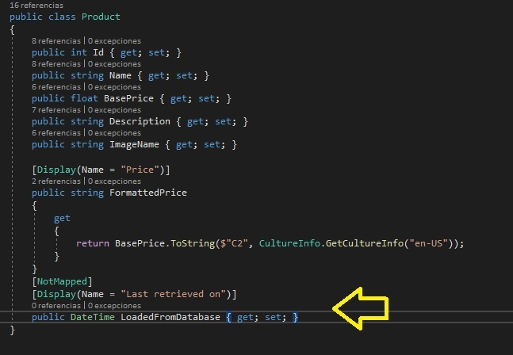

5. En la ventana **Ejemplo de caché - Microsoft Visual Studio**, en el Explorador de Soluciones, expanda **Repositorios**, y luego haga clic en **ProductRepository.cs**.

6. En la ventana de código **ProductRepository.cs**, localiza el siguiente código:
  ```cs
    Product product = _context.Products.Where(p => p.Id == id).FirstOrDefault();
  ```

7. Ponga el cursor al final del código localizado, presione Enter, y luego escriba el siguiente código:
  ```cs
    if (product != null)
    {
        product.LoadedFromDatabase = DateTime.Now;
    }
  ```
- La representación visual de la resolución del ejercicio se muestra en la siguiente imagen:

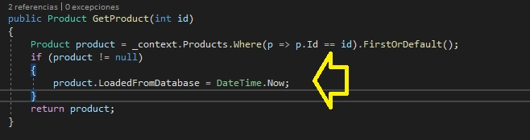

8. En la ventana **Ejemplo de caché - Microsoft Visual Studio**, en el Explorador de soluciones, expandir **Vistas**, expandir **Components**, expandir **Product**, y luego hacer clic en **SelectedProduct.cshtml**.

9. En la ventana de código **SelectedProduct.cshtml**, localice el siguiente código:
  ```cs
    <div>
        <span class="display-label">
            @Html.DisplayNameFor(model => Model.Description)
        </span>
        <span class="display-field">
            @Html.DisplayFor(model => Model.Description)
        </span>
    </div>
  ```

10. Ponga el cursor al final del código localizado, presione Enter y luego escriba el siguiente código:
  ```cs
    <div>
        <span class="display-label">
            @Html.DisplayNameFor(model => Model.LoadedFromDatabase)
        </span>
        <span class="display-field">
            @Model.LoadedFromDatabase.ToString("G")
        </span>
    </div>
  ```

- La representación visual de la resolución del ejercicio se muestra en la siguiente imagen:

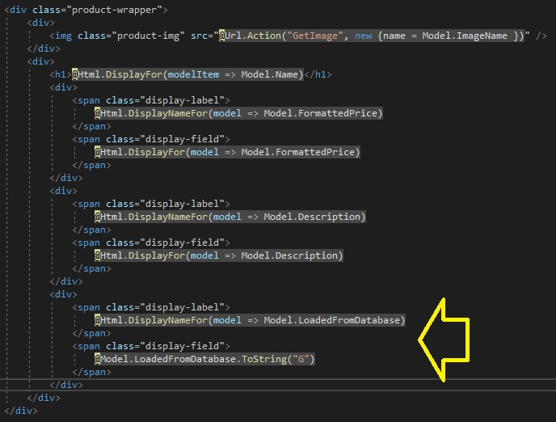

11.  En la ventana **CachingExample - Microsoft Visual Studio**, en el menú **FILE**, haga clic en **Save All**.
        
12. En la ventana **Ejemplo de Caching - Microsoft Visual Studio**, en el menú **DEBUG**, haga clic en **Iniciar sin depuración**.
    >**Nota**: El navegador muestra una lista de productos.

13. En Microsoft Edge, haga clic en **Basketball**.
    >**Nota**: El navegador muestra los detalles del Basketball, y la última vez que el producto fue recuperado de la base de datos.

- La representación visual de la resolución del ejercicio se muestra en la siguiente imagen:

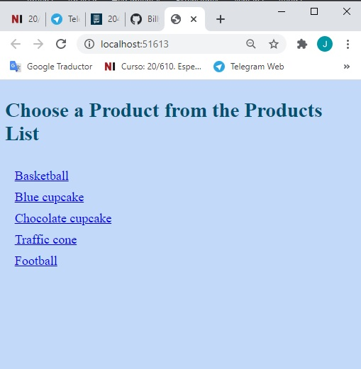

14. En Microsoft Edge, haz clic en **Basketball**.
    >**Nota**: El navegador muestra la misma página, pero la **Última vez que se recuperó en** ha cambiado desde que se recuperó el artículo de la base de datos.

- La representación visual de la resolución del ejercicio se muestra en la siguiente imagen:

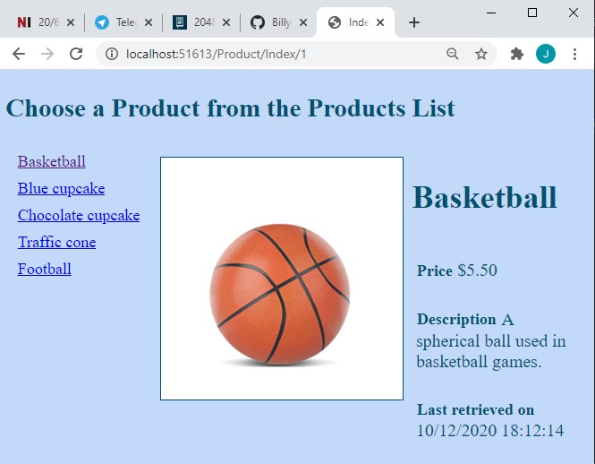

15.  En Microsoft Edge, haz clic en **Cerrar**.
   
16. En la ventana **Ejemplo de caché - Microsoft Visual Studio**, en Solution Explorer, en **Vistas**, expandir **Product**, y luego hacer clic en **Index.cshtml**.

17. En la ventana **index.cshtml** código, seleccione el siguiente código:

  ```cs
    <div>
        @await Component.InvokeAsync("Product", @ViewBag.SelectedProductId)
    </div>
  ```

18. Reemplazar el código seleccionado con el código siguiente:
  ```cs
    <cache vary-by="@ViewBag.SelectedProductId">
        <div>
            @await Component.InvokeAsync("Product", @ViewBag.SelectedProductId)
        </div>
    </cache>
  ```
- La representación visual de la resolución del ejercicio se muestra en la siguiente imagen:


19. En la ventana **CachingExample - Microsoft Visual Studio**, en el menú **FILE**, haga clic en **Save All**.
    
20. En la ventana **Ejemplo de Caching - Microsoft Visual Studio**, en el menú **DEBUG**, haga clic en **Iniciar sin depuración**.

21. En Microsoft Edge, haz clic en **Basketball**.

22. En el borde de Microsoft, haga clic en **Basketball**.
    >**Nota**: El navegador muestra la misma página, pero el **Last retrieved on** no ha cambiado desde que el artículo fue almacenado.

- La representación visual de la resolución del ejercicio se muestra en la siguiente imagen:

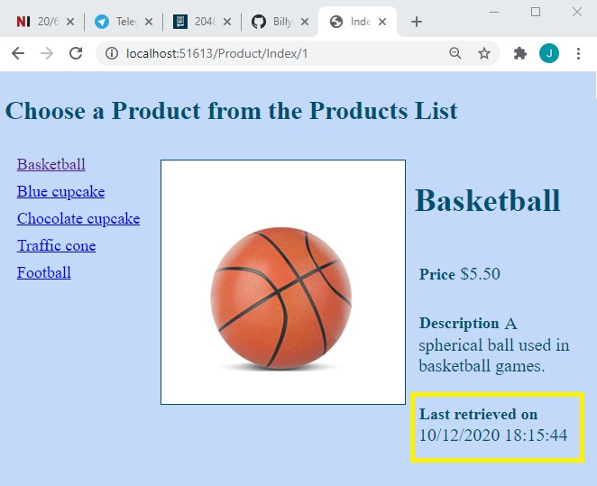

23. En Microsoft Edge, haz clic en **Basketball**.

24. En el borde de Microsoft, haz clic en **Football**.
    >**Nota**: El navegador muestra la misma página, pero el **Last retrieved on** no ha cambiado desde que el elemento fue almacenado en la caché.

25. En Microsoft Edge, haz clic en **Basketball**.
    >**Nota**: El navegador muestra la misma página, pero el **Last retrieved on** no ha cambiado desde que el elemento fue cacheado.

- La representación visual de la resolución del ejercicio se muestra en la siguiente imagen:

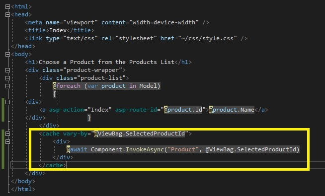

26.  En Microsoft Edge, haz clic en **Cerrar**.

27. En la ventana **Ejemplo de caché - Microsoft Visual Studio**, en el menú **Archivo**, haga clic en **Salir**.

# Lección 2: Administrar el estado

### Demonstration: Cómo almacenar y recuperar la información del estado

#### Pasos de preparación 

1. Asegúrate de que has clonado el directorio **20486D** de GitHub. Contiene los segmentos de código para los laboratorios y demostraciones de este curso.(**https://github.com/MicrosoftLearning/20486D-DevelopingASPNETMVCWebApplications/tree/master/Allfiles**)

2. Navega a **[Repository Root]\Allfiles\Mod12\Democode\02_StateExample_begin**, y luego abre el **StateExample.sln**.

    >**Nota**: Si aparece un cuadro de diálogo de **Aviso de seguridad para StateExample**, verifique que la casilla de verificación **Ask me for every project in this solution** esté despejada, y luego haga clic en OK.

3. En la ventana **StateExample - Microsoft Visual Studio**, en el menú **DEBUG**, haga clic en **Iniciar sin depuración**.

4. En Microsoft Edge, en la barra de direcciones, anote el número de puerto que aparece al final del URL **http://localhost:[port]**. Usará el número de puerto durante esta demostración.

5. En Microsoft Edge, haga clic en **Cerrar**.

#### Pasos de la demostración

1. Navega a **[Repository Root]\Allfiles\Mod12\Democode\02_StateExample_begin**, y luego haz doble clic en **StateExample.sln**.

    >**Nota**: Si aparece un cuadro de diálogo de **Advertencia de seguridad para StateExample**, verifica que la casilla de verificación **Ask me for every project in this solution** está despejada, y luego haz clic en **OK**. 

2. En la ventana **StateExample - Microsoft Visual Studio**, en el Explorador de soluciones, haga clic en **Startup.cs**.

3. En la ventana del código **Startup.cs**, localice el siguiente código:
  ```cs
    public void ConfigureServices(IServiceCollection services)
    {
  ```

4. Ponga el cursor al final del código localizado, presione Enter, y luego escriba el siguiente código:
  ```cs
    services.AddSession();
  ```

5. En la ventana del código **Startup.cs**, localice el siguiente código:
  ```cs
    public void ConfigureServices(IServiceCollection services)
    {
  ```

6. Ponga el cursor al final del código localizado, presione Enter, y luego escriba el siguiente código:
  ```cs
    app.UseSession();
  ```
- La representación visual de la resolución del ejercicio se muestra en la siguiente imagen:

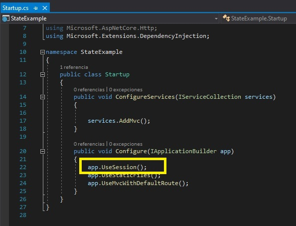

7. En la ventana **StateExample - Microsoft Visual Studio**, en el Explorador de soluciones, expanda **Controladores**, y luego haga clic en **HomeController.cs**.

8. En la ventana de código **HomeController.cs**, localice el siguiente código:
  ```cs
    using Microsoft.AspNetCore.Mvc;
  ```

9. Ponga el cursor al final del código localizado, presione Enter y luego escriba el siguiente código:
  ```cs
    using Microsoft.AspNetCore.Http;
  ```

10. En la ventana del código **HomeController.cs**, localice el siguiente código:

  ```cs
    public IActionResult Index()
    {
  ```

11. Ponga el cursor al final del código localizado, presione Enter y luego escriba el siguiente código:
  ```cs
    int? overallVisitsNumber = HttpContext.Session.GetInt32("Overall");
    int? controllerVisitsNumber = HttpContext.Session.GetInt32("Home");
    int? AnotherControllerVisitsNumber = HttpContext.Session.GetInt32("Another");
    if (overallVisitsNumber == null)
    {
        overallVisitsNumber = 1;
    }
    else
    {
        overallVisitsNumber++;
    }
    if (controllerVisitsNumber == null)
    {
        controllerVisitsNumber = 1;
    }
    else
    {
        controllerVisitsNumber++;
    }
    if (AnotherControllerVisitsNumber == null)
    {
        AnotherControllerVisitsNumber = 0;
    }
    HttpContext.Session.SetInt32("Overall", overallVisitsNumber.Value);
    HttpContext.Session.SetInt32("Home", controllerVisitsNumber.Value);
    HttpContext.Session.SetInt32("Another", AnotherControllerVisitsNumber.Value);
  ```
- La representación visual de la resolución del ejercicio se muestra en la siguiente imagen:

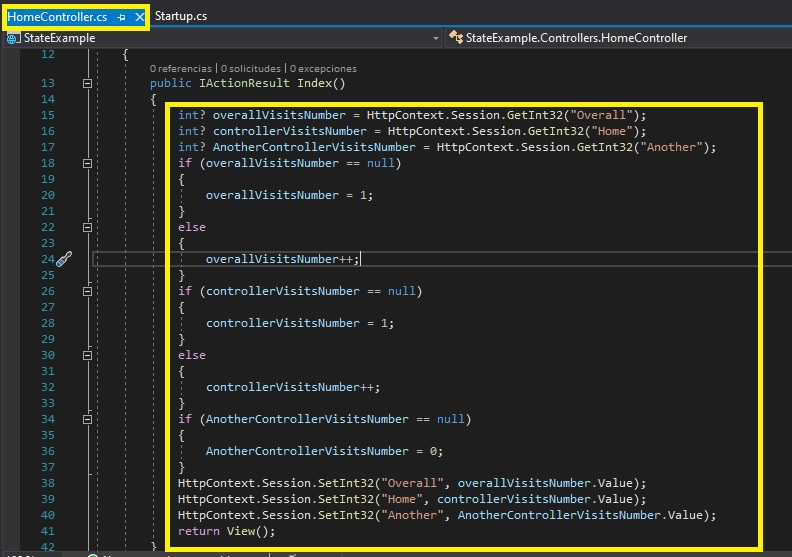

12. En la ventana **StateExample - Microsoft Visual Studio**, en el Explorador de soluciones, en **Controladores**, haga clic en **OtroControlador.cs**.

13. En la ventana de código **AnotherController.cs**, localice el siguiente código:
  ```cs
    using Microsoft.AspNetCore.Mvc;
  ```

14. Ponga el cursor al final del código localizado, presione Enter y luego escriba el siguiente código:
  ```cs
    using Microsoft.AspNetCore.Http;
  ```

15. En la ventana del código **AnotherController.cs**, localice el siguiente código:
  ```cs
    public IActionResult Index()
    {
  ```

16. Ponga el cursor al final del código localizado, presione Enter y luego escriba el siguiente código:
  ```cs
    int? overallVisitsNumber = HttpContext.Session.GetInt32("Overall");
    int? controllerVisitsNumber = HttpContext.Session.GetInt32("Another");
    if (overallVisitsNumber == null)
    {
        overallVisitsNumber = 1;
    }
    else
    {
        overallVisitsNumber++;
    }
    if (controllerVisitsNumber == null)
    {
        controllerVisitsNumber = 1;
    }
    else
    {
        controllerVisitsNumber++;
    }
    HttpContext.Session.SetInt32("Overall", overallVisitsNumber.Value);
    HttpContext.Session.SetInt32("Another", controllerVisitsNumber.Value);
  ```

- La representación visual de la resolución del ejercicio se muestra en la siguiente imagen:

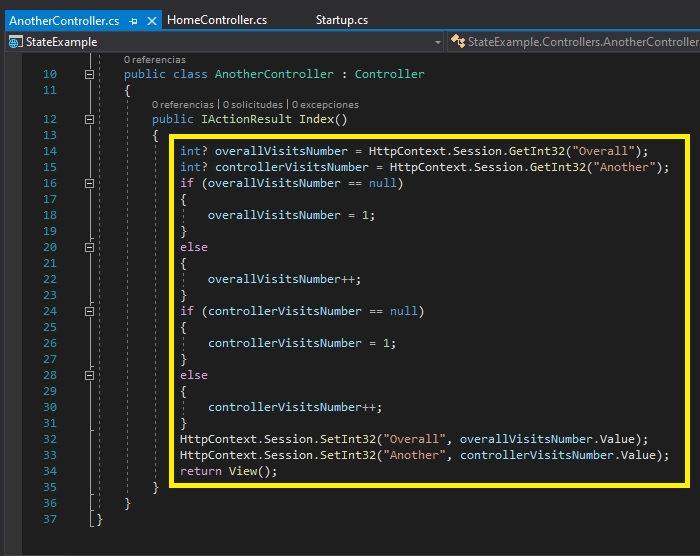

17. En la ventana **StateExample - Microsoft Visual Studio**, en el Explorador de Soluciones, expanda **Vistas**, y luego haga clic en **_ViewImports.cshtml**.

18. En la ventana de código **_ViewImports.cshtml**, localice el siguiente código:
  ```cs
    @addTagHelper *, Microsoft.AspNetCore.Mvc.TagHelpers
  ```

19. Ponga el cursor al final del código localizado, presione Enter y luego escriba el siguiente código:
  ```cs
    @using Microsoft.AspNetCore.Http
  ```

- La representación visual de la resolución del ejercicio se muestra en la siguiente imagen:

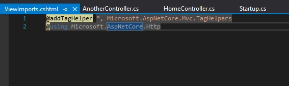

20. En la ventana **StateExample - Microsoft Visual Studio**, en el menú **Archivo**, haga clic en **Guardar todo**.

21. En la ventana **StateExample - Microsoft Visual Studio**, en el Explorador de soluciones, en **Vistas**, expandir **Home**, y luego hacer clic en **Index.cshtml**.

22. En la ventana de código **Index.cshtml**, localice el siguiente código:
  ```cs
    <div class="info-panel">
  ```

23. Ponga el cursor al final del código localizado, presione Enter y luego escriba el siguiente código:
  ```cs
    <div>Number of times that the Home controller was visited during this session: @Context.Session.GetInt32("Home")</div>
    <div>Number of times that the Another controller was visited during this session: @Context.Session.GetInt32("Another")</div>
    <div>Number of times visited overall during this session: @Context.Session.GetInt32("Overall")</div>
  ```

- La representación visual de la resolución del ejercicio se muestra en la siguiente imagen:

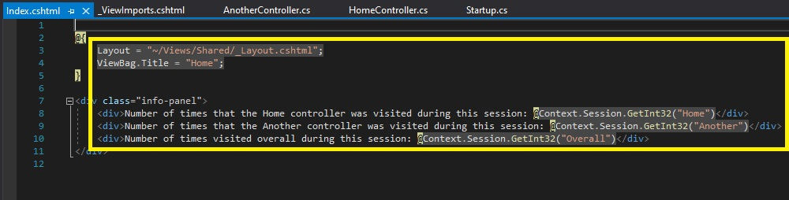

24. En la ventana **StateExample - Microsoft Visual Studio**, en el Explorador de soluciones, en **Vistas**, expandir **Another**, y luego hacer clic en **Index.cshtml**.

25. En la ventana de código **Index.cshtml**, localice el siguiente código:
  ```cs
    <div class="info-panel">
  ```

26. Ponga el cursor al final del código localizado, presione Enter y luego escriba el siguiente código:
  ```cs
    <div>Number of times that this controller was visited during this session: @Context.Session.GetInt32("Home")</div>
    <div>Number of times that this controller was visited during this session: @Context.Session.GetInt32("Another")</div>
    <div>Number of times visited overall during this session: @Context.Session.GetInt32("Overall")</div>
  ```
- La representación visual de la resolución del ejercicio se muestra en la siguiente imagen:

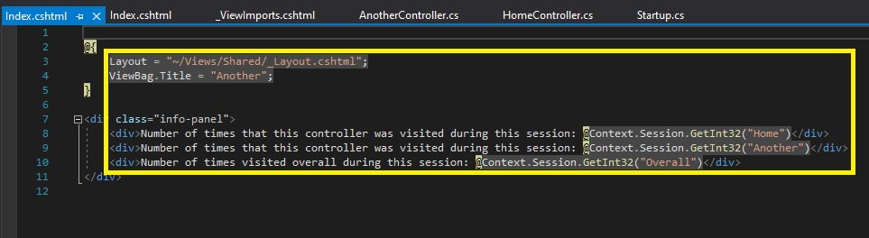

27.  En la ventana **StateExample - Microsoft Visual Studio**, en el menú **Archivo**, haga clic en **Guardar todo**.

28. En la ventana **StateExample - Microsoft Visual Studio**, en el menú **DEBUG**, haga clic en **Iniciar sin depuración**.

29. En Microsoft Edge, haz clic en **Another**.

30. En Microsoft Edge, haz clic en **Home**.

31. En la barra de tareas, haga clic con el botón derecho del ratón en el icono **Edge de Microsoft** y, a continuación, haga clic en **Nueva ventana InPrivate**.

32. En Microsoft Edge, en la barra de direcciones, escriba **http://localhost:[port]**, y luego presione Enter.

>**Nota**: Abrimos un nuevo navegador, por lo que se crea una nueva sesión para el nuevo navegador.

- La representación visual de la resolución del ejercicio se muestra en la siguiente imagen:

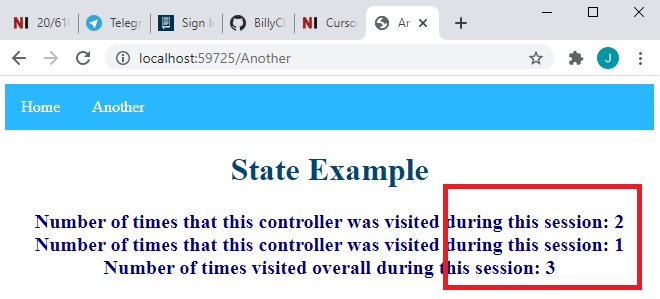

33. En la primera ventana de **Microsoft Edge**, haz clic en **Home**.

34. Cierra todas las ventanas de **Microsoft Edge**.

35. En la ventana **StateExample - Microsoft Visual Studio**, en el menú **Archivo**, haga clic en **Salir**.

# Lección 3: Comunicación de dos vías

### Demonstration: Cómo usar SignalR

#### Pasos de preparación 


1. Asegúrate de que has clonado el directorio **20486D** de GitHub. Contiene los segmentos de código para los laboratorios y demostraciones de este curso. (**https://github.com/MicrosoftLearning/20486D-DevelopingASPNETMVCWebApplications/tree/master/Allfiles**)

2. Navega a **[Repository Root]\Allfiles\Mod12\Democode\03_SignalRExample_begin**, y luego abre el **SignalRExample.sln**.

    >**Nota**: Si aparece un cuadro de diálogo de **Aviso de seguridad para SignalRExample**, verifique que la casilla de verificación **Ask me for each project in this solution** esté despejada, y luego haga clic en OK.

3. En la ventana **SignalRExample - Microsoft Visual Studio**, en el menú **DEBUG**, haga clic en **Iniciar sin depuración**.

4. En Microsoft Edge, en la barra de direcciones, anote el número de puerto que aparece al final del URL **http://localhost:[port]**. Usará el número de puerto durante esta demostración.

- La representación visual de la resolución del ejercicio se muestra en la siguiente imagen:

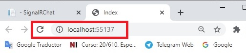

5. En Microsoft Edge, haga clic en **Cerrar**.

#### Pasos de la demostración

1. En el Explorador de Archivos, navega a **[Repository Root]\Allfiles\Mod12\Democode\03_SignalRExample_begin\SignalRExample**, y luego copia la dirección en la barra de direcciones.

    >**Nota**: Si aparece un cuadro de diálogo de **Aviso de seguridad para SignalRExample**, verifica que la casilla de verificación **Pregúntame por cada proyecto de esta solución** está despejada, y luego haz clic en **OK**. 

2. Haga clic en **Iniciar**, y luego escriba **cmd**.

3. En **Mejor coincidencia**, haga clic con el botón derecho del ratón en **Command Prompt**, y luego haga clic en **Ejecutar como administrador**.

4. En el cuadro de diálogo **Control de cuentas de usuario**, haga clic en **Sí**.

5. En el cuadro de diálogo **Administrador: Command Prompt**, escriba el siguiente comando y luego pulse Intro.
  ```cs
       cd *{copied folder path}*
  ```

>**Nota**: Si la *{pista de la carpeta copiada}* es diferente de la unidad de disco en la que se encuentra el símbolo del sistema, deberá escribir *{pista de disco}:* antes de escribir el comando **cd** *{pista de la carpeta copiada}*.

6. En el **Administrador: Command Prompt**, escriba el siguiente comando y, a continuación, pulse Intro.
  ```cs
       npm install
  ```
>**Nota**: Si se muestran mensajes de advertencia en la línea de comandos, puede ignorarlos.

- La representación visual de la resolución del ejercicio se muestra en la siguiente imagen:

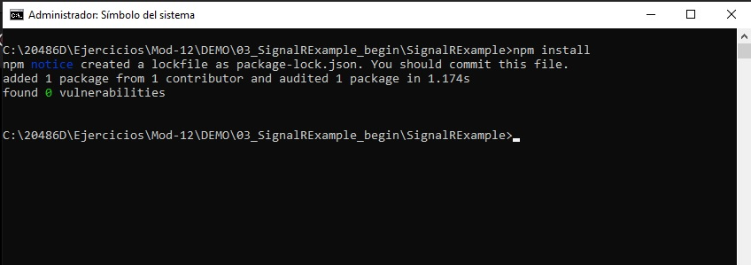

7. Cierre la ventana.

8. En el Explorador de Archivos, navega a **[Repository Root]\Allfiles\Mod12\Democode\03_SignalRExample_begin**, y luego haz doble clic en **SignalRExample.sln**.

    >**Nota**: Si aparece un cuadro de diálogo de **Aviso de seguridad para SignalRExample**, verifica que la casilla de verificación **Ask me for each project in this solution** está despejada, y luego haz clic en **OK**. 

9. En la ventana **SignalRExample - Microsoft Visual Studio**, en el Explorador de soluciones, haga clic en **Startup.cs**.

10. En la ventana del código **Startup.cs**, localice el siguiente código:
  ```cs
    services.AddSingleton<ISquareManager, SquareManager>();
  ```

11. Ponga el cursor al final del código localizado, presione Enter y luego escriba el siguiente código:
  ```cs
    services.AddSignalR();
  ```

12. En la ventana del código **Startup.cs**, localice el siguiente código:
  ```cs
    app.UseNodeModules(env.ContentRootPath);
  ```

13. Ponga el cursor al final del código localizado, presione Enter dos veces, y luego escriba el siguiente código:
  ```cs
    app.UseSignalR(routes =>
    {
    });
  ```

- La representación visual de la resolución del ejercicio se muestra en la siguiente imagen:

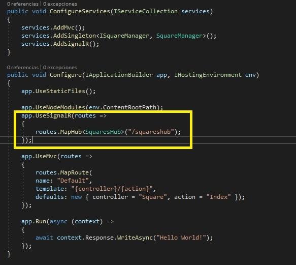

14. En la ventana **SignalRExample - Microsoft Visual Studio**, en el Explorador de soluciones, haga clic con el botón derecho en **SignalRExample**, apunte a **Agregar**, y luego haga clic en **Nueva carpeta**.

15. En el cuadro **Nueva Carpeta**, escriba **Hubs**, y luego presione Enter.

16. En la ventana **SignalRExample - Microsoft Visual Studio**, en el Explorador de soluciones, haga clic con el botón derecho del ratón en **Hubs**, apunte a **Agregar** y, a continuación, haga clic en **Clase**.

17.	En el cuadro de diálogo **Agregar nuevo elemento - Muestra de señal**, en el cuadro **Nombre**, escriba **SquaresHub**, y luego haga clic en **Agregar**.

18. En la ventana del código **SquaresHub.cs**, localice el siguiente código:
  ```cs
    using System.Threading.Tasks;
  ```

19. Ponga el cursor al final del código localizado, presione Enter y luego escriba el siguiente código:
  ```cs
    using Microsoft.AspNetCore.SignalR;
    using SignalRExample.Services;
  ```
20. En la ventana del código **SquaresHub.cs**, seleccione el siguiente código:
  ```cs
    public class SquaresHub
  ```

21. Reemplazar el código seleccionado por el siguiente código:
  ```cs
    public class SquaresHub : Hub
  ```

22. En la ventana del código **SquaresHub.cs**, localiza el siguiente código:
  ```cs
    public class SquaresHub : Hub
    {
  ```

23. Ponga el cursor al final del código localizado, presione Enter y luego escriba el siguiente código:
  ```cs
    private ISquareManager _manager;

    public SquaresHub(ISquareManager manager)
    {
        _manager = manager;
    }

    public async Task SwapColor(int rowIndex, int columnIndex)
    {
        _manager.SwapColor(rowIndex, columnIndex);
        await Clients.Others.SendAsync("SwapSquareColor", rowIndex, columnIndex);
    }
  ```

- La representación visual de la resolución del ejercicio se muestra en la siguiente imagen:

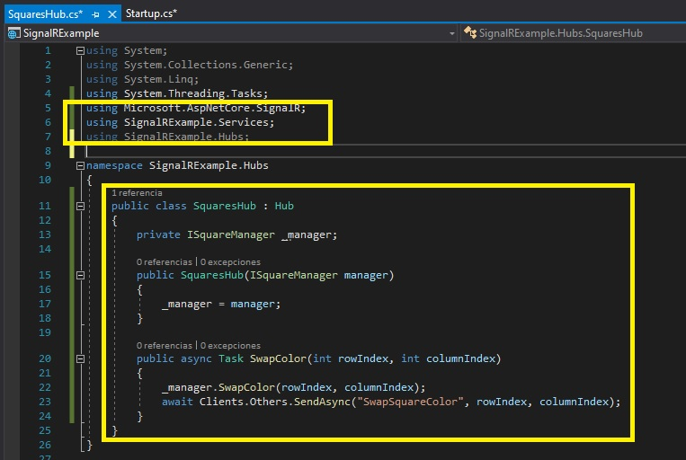

24. En la ventana **SignalRExample - Microsoft Visual Studio**, en el Explorador de soluciones, haga clic en **Startup.cs**.
    
25. En la ventana del código **Startup.cs**, localice el siguiente código:
  ```cs
    using SignalRExample.Services;
  ```

26. Ponga el cursor al final del código localizado, presione Enter y luego escriba el siguiente código:
  ```cs
    using SignalRExample.Hubs;
  ```

27. En la ventana del código **Startup.cs**, localiza el siguiente código:
  ```cs
    app.UseSignalR(routes =>
    {
  ```

28. Ponga el cursor al final del código localizado, presione Enter y luego escriba el siguiente código:
  ```cs
    routes.MapHub<SquaresHub>("/squareshub");
  ```

- La representación visual de la resolución del ejercicio se muestra en la siguiente imagen:

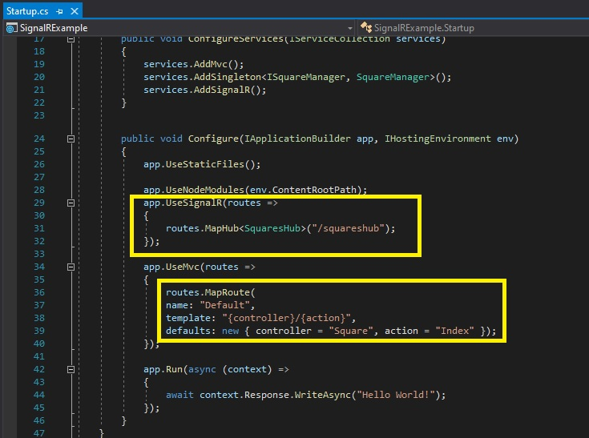

29. En la ventana **SignalRExample - Microsoft Visual Studio**, en el Explorador de Soluciones, haga clic en **package.json**.

30. En la ventana del código **package.json**, localice el siguiente código:
  ```cs
    "dependencies": {
  ```

31. Ponga el cursor al final del código localizado, presione Enter y luego escriba el siguiente código:
  ```cs
    "@aspnet/signalr": "1.0.0",
  ```

- La representación visual de la resolución del ejercicio se muestra en la siguiente imagen:

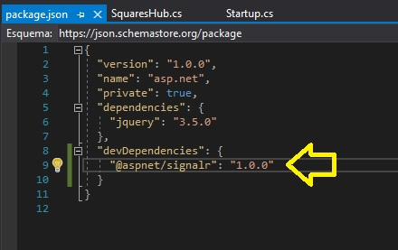

32. En la ventana **SignalRExample - Microsoft Visual Studio**, en el menú **FILE**, haga clic en **Save All**.

33. Si el cuadro de diálogo **Microsoft Visual Studio**, haga clic en **Sí a todo**.

    >**Nota**: En el Explorador de soluciones, en **Dependencias**, en **npm**, se ha añadido una nueva carpeta llamada **@aspnet/signalr** .

34. En la ventana **SignalRExample - Microsoft Visual Studio**, en Solution Explorer, expandir **Views**, expandir **Square**, y luego hacer clic en **index.cshtml**.

35. En la ventana **index.cshtml** código, localice el siguiente código:
  ```cs
    <script src="~/node_modules/jquery/dist/jquery.min.js"></script>
  ```

36. Ponga el cursor al final del código localizado, presione Enter y luego escriba el siguiente código:
  ```cs
    <script src="~/node_modules/@@aspnet/signalr/dist/browser/signalr.min.js"></script>
  ```

- La representación visual de la resolución del ejercicio se muestra en la siguiente imagen:

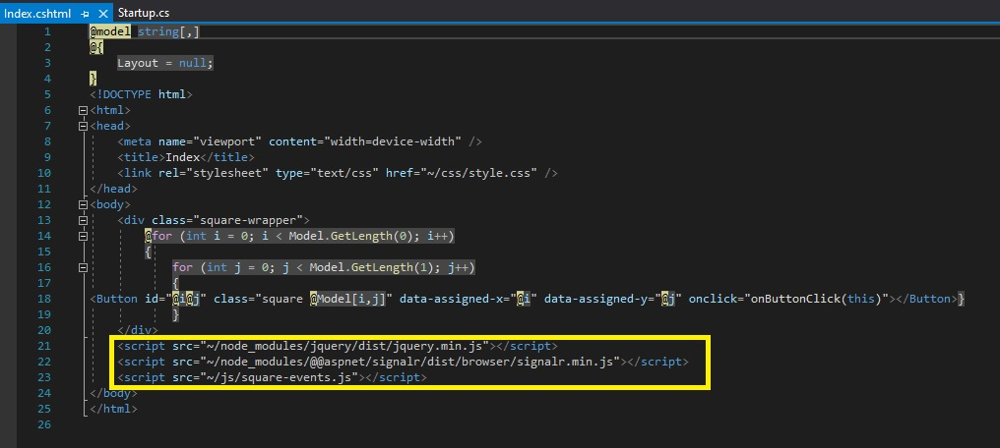

37. En la ventana **SignalRExample - Microsoft Visual Studio**, en el Explorador de Soluciones, expandir **wwwwroot**, expandir **js**, y luego hacer clic en **square-events.js**.

38. En la ventana de código **square-events.js**, coloque el cursor al principio del documento y escriba el siguiente código:

  ```cs
    var connection = new signalR.HubConnectionBuilder()
        .withUrl("squareshub")
        .build();

    connection.on("SwapSquareColor", (x, y) => {
        $('#' + x + y).toggleClass('blue red');
    });
    
    connection.start();
  ```

39. En la ventana del código **square-events.js**, localice el siguiente código:
  ```cs
    $(btn).toggleClass('blue red');
  ```

40. Ponga el cursor al final del código localizado, presione Enter y luego escriba el siguiente código:
  ```cs
    connection.invoke("SwapColor", x, y);
  ```

- La representación visual de la resolución del ejercicio se muestra en la siguiente imagen:

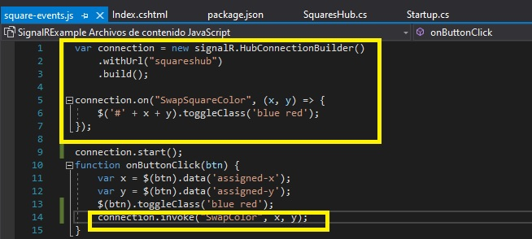

41. En la ventana **SignalRExample - Microsoft Visual Studio**, en el menú **FILE**, haga clic en **Save All**.

42. En la ventana **SignalRExample - Microsoft Visual Studio**, en el menú **DEBUG**, haga clic en **Iniciar sin depuración**.
    >**Nota**: El navegador muestra nueve cuadros azules.

- La representación visual de la resolución del ejercicio se muestra en la siguiente imagen:

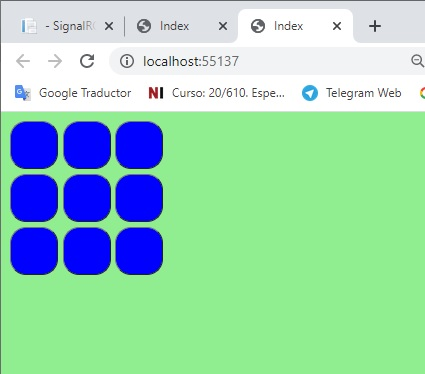


43. En la barra de tareas, haga clic con el botón derecho del ratón en el icono **Microsoft Edge**, y luego haga clic en **Nueva ventana**.

44. En Microsoft Edge, en la barra de direcciones, escriba **http://localhost:[port]**, y luego presione Enter.

45. En Microsoft Edge, haga clic en uno de los cuadros.
    >**Nota**: En ambas ventanas de **Microsoft Edge**, el cuadrado en el que se ha hecho clic es rojo.

- La representación visual de la resolución del ejercicio se muestra en la siguiente imagen:

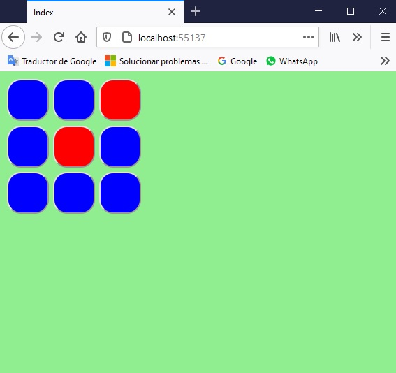


46. En la barra de tareas, haga clic con el botón derecho del ratón en el icono **Borde de Microsoft** y luego haga clic en **Nueva ventana**.

47. En Microsoft Edge, en la barra de direcciones, escriba **http://localhost:[port]**, y luego presione Enter.
    >**Nota**: El navegador muestra ocho cuadrados azules y un cuadrado rojo.

- La representación visual de la resolución del ejercicio se muestra en la siguiente imagen:

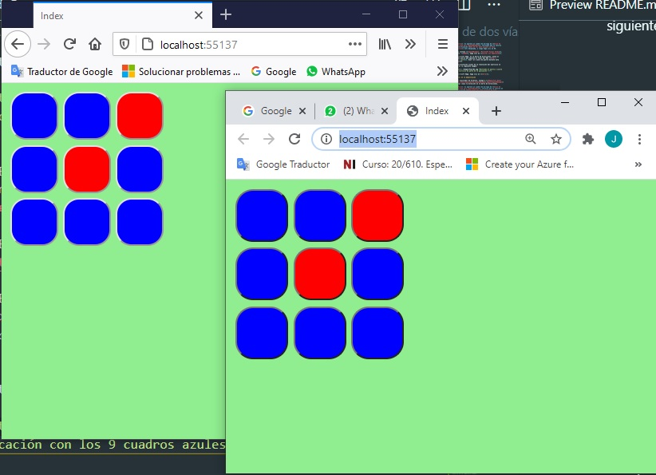

48.  Cierra todas las ventanas de **Microsoft Edge**.

49.  En la ventana **SignalRExample - Microsoft Visual Studio**, en el menú **FILE**, haga clic en **Salir**.
