# Module 13: Implementando Web APIs

Siempre cuando un camino comienza con  *[Repository Root]*, reemplacelo con el camino absoluto en el que el repositorio 20486 reside. Por ejemplo, si tu has cloneado o extraido el repositorio 20486 en la carpeta **C:\Users\John Doe\Downloads\20486**, cambiar la ruta de: **[Repository Root]\AllFiles\20486D\Mod01** a **C:\Users\John Doe\Downloads\20486\AllFiles\20486D\Mod01**.

Fichero de Instrucciones: Instructions\20486D_MOD13_LAK.md

**Información:**

1. **Nombres y apellidos:** José René Fuentes Cortez
2. **Fecha:** 24 de Diciembre 2020.
3. **Resumen del Ejercicio:** Este laboratorio consta de dos lecciones, lecciones dos y tres:
- En la segunda lección desarrollamos un API Web y aprendemos como hacerlo.
- En la tercera lección aprendemos a llamar a un Web API.  De la misma manera aprendemos a llamar a las APIs web utilizando código del lado del servidor.

4. **Dificultad o problemas presentados y como se resolvieron:** Ninguno.

**NOTA**: Si no hay descripcion de problemas o dificultades, y al yo descargar el código para realizar la comprobacion y el código no funcionar, el resultado de la califaciación del laboratorio será afectado.

---


# Lección 2: Desarrollo de una API Web

### Demonstration: Cómo desarrollar una API web

#### Pasos de preparación 

1. Asegúrate de que has clonado el directorio **20486D** de GitHub. Contiene los segmentos de código para los laboratorios y demostraciones de este curso. (**https://github.com/MicrosoftLearning/20486D-DevelopingASPNETMVCWebApplications/tree/master/Allfiles**)

2. Navega a **[Repository Root]\Allfiles\Mod13\Democode\01_WebApiExample_begin**, y luego abre el **WebApiExample.sln**.

    >**Nota**: Si aparece un cuadro de diálogo de **Advertencia de Seguridad para el WebApiExample**, verifica que la casilla de verificación **Pregúntame por cada proyecto de esta solución** esté despejada, y luego haz clic en OK.

3. En la ventana **WebApiExample - Microsoft Visual Studio**, en el menú **DEBUG**, haga clic en **Iniciar sin depuración**.

4. En Microsoft Edge, en la barra de direcciones, anota el número de puerto que aparece al final del URL **http://localhost:[port]**. Usará el número de puerto durante esta demostración.

- La representación visual de la resolución del ejercicio se muestra en la siguiente imagen:

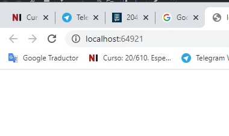

5. En Microsoft Edge, haga clic en **Cerrar**.

#### Pasos de la demostración

1. Navega a **[Repository Root]\Allfiles\Mod13\Democode\01_WebApiExample_begin**, y luego haz doble clic en **WebApiExample.sln**.

    >**Nota**: Si aparece un cuadro de diálogo de **Advertencia de Seguridad para el WebApiExample**, verifique que la casilla de verificación **Pregúnteme por cada proyecto de esta solución** esté desactivada, y luego haga clic en OK.

2. En la ventana **WebApiExample - Microsoft Visual Studio**, en el Explorador de soluciones, en **Propiedades**, haga clic en **launchSettings.json**.

3. En la ventana de código **launchSettings.json**, seleccione el siguiente código:
  ```cs
       "launchUrl": "",
  ```
4. Reemplazar el código seleccionado por el siguiente código:
  ```cs
       "launchUrl": "api/persona",
  ```
5. En la ventana **WebApiExample - Microsoft Visual Studio**, en el menú **DEBUG**, haga clic en **Start Without Debugging**.

    >**Nota**: El navegador muestra el error **HTTP 404**. 

- La representación visual de la resolución del ejercicio se muestra en la siguiente imagen:

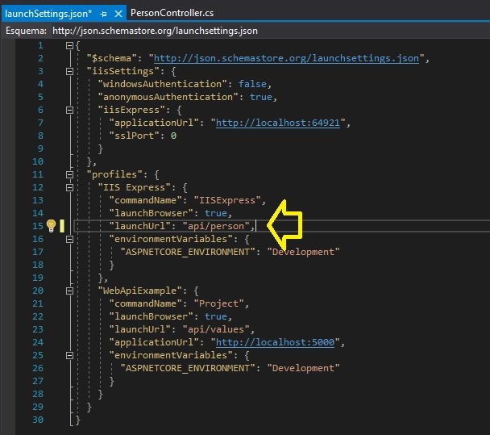

6. En Microsoft Edge, haga clic en **Cerrar**.

7. En Solution Explorer, haga clic con el botón derecho del ratón en **WebApiExample**, apunte a **Agregar**, y luego haga clic en **Nueva Carpeta**.

8. En el cuadro **Nueva Carpeta**, escriba **Controladores**, y luego presione Enter.

9. En la ventana **WebApiExample - Microsoft Visual Studio**, en el Solution Explorer, haga clic con el botón derecho del ratón en **Controladores**, señale a **Agregar**, y luego haga clic en **Controlador**.

10. En el cuadro de diálogo **Agregar andamiaje**, haga clic en **Controlador API - Vaciar**, y luego haga clic en **Agregar**.

- La representación visual de la resolución del ejercicio se muestra en la siguiente imagen:

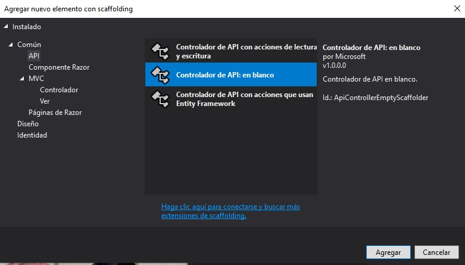

11. En el cuadro de diálogo **Agregar controlador API vacío**, en el cuadro **Nombre del controlador**, escriba **Controlador de persona** y, a continuación, haga clic en **Agregar**.

- La representación visual de la resolución del ejercicio se muestra en la siguiente imagen:

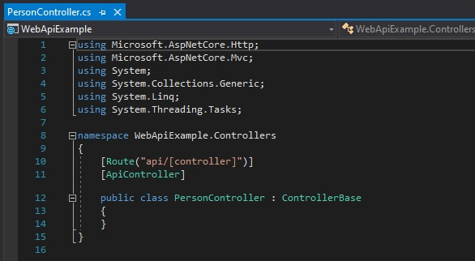

12. En la ventana de código **PersonController.cs**, busque el siguiente código:
  ```cs
       using Microsoft.AspNetCore.Mvc;
  ```
13. Asegúrate de que el cursor está al final del espacio de nombres **Microsoft.AspNetCore.Mvc**, presiona Enter, y luego escribe el siguiente código:
  ```cs
       using WebApiExample.Models;
  ```

14. En la ventana del código **PersonController.cs**, coloque el cursor después del segundo signo **{** (abra las abrazaderas), presione Enter y luego escriba el siguiente código:
  ```cs
       private List<Person> _people = new List<Person>();

       public PersonController()
       {
            _people.Add(new Person() {Id = 1, FirstName = "James", LastName = "Sprayberry" });
            _people.Add(new Person() {Id = 2, FirstName = "Jason", LastName = "Mosley" });
            _people.Add(new Person() {Id = 3, FirstName = "Jennifer", LastName = "Dietz" });
            _people.Add(new Person() {Id = 4, FirstName = "Bessie", LastName = "Duppstadt" });
       }
  ```
15. Asegúrate de que el cursor está al final del bloque de código de construcción **PersonController**, presiona Enter dos veces, y luego escribe el siguiente código:
  ```cs
       [HttpGet]
       public List<Person> GetAll()
       {
       }
  ```
16. En el bloque de código de acción **GetAll**, escriba el siguiente código:
  ```cs
       return _people;
  ```
17. Asegúrate de que el cursor está al final del bloque de código de acción **GetAll**, presiona Enter dos veces, y luego escribe el siguiente código:
  ```cs
       [HttpGet("{id}")]
       public ActionResult<Person> GetPersonById(int id)
       {
       }
  ```
18. En el bloque de código de acción **GetPersonById**, escribe el siguiente código:

  ```cs
       var person = _people.FirstOrDefault(p => p.Id == id);

       if (person == null)
       {
            return NotFound();
       }

       return person;
  ```

- La representación visual de la resolución del ejercicio se muestra en la siguiente imagen:

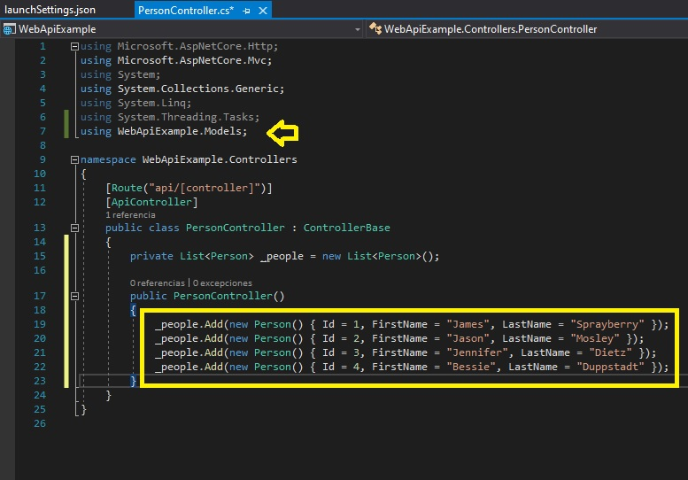

19. En la ventana **WebApiExample - Microsoft Visual Studio**, en el menú **FILE**, haga clic en **Save All**.

20. En la ventana **WebApiExample - Microsoft Visual Studio**, en el menú **DEBUG**, haga clic en **Iniciar sin depuración**.

    >**Nota**: El navegador muestra una lista de personas en el formato JSON.

21. En Microsoft Edge, en la barra de direcciones, escriba **http://localhost:[port]/api/person/1**, y luego presione Enter.

    >**Nota**: El navegador muestra la persona en el formato JSON.

- La representación visual de la resolución del ejercicio se muestra en la siguiente imagen:

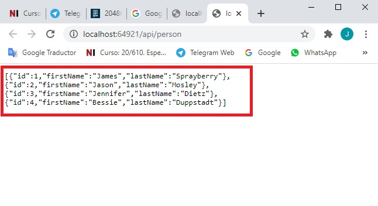

22. En Microsoft Edge, teclea **Cerrar**.

23. En la ventana **WebApiExample - Microsoft Visual Studio**, en Solution Explorer, haga clic con el botón derecho en **WebApiExample**, y luego haga clic en **Manage NuGet Packages**.

24. En el **Gestor de paquetes NuGet: WebApiExample**, haga clic en **Browse**.

25. En el cuadro de búsqueda, escriba **Microsoft.AspNetCore.Mvc.Formatters.Xml**, y luego presione Enter.

26. Haga clic en **Microsoft.AspNetCore.Mvc.Formatters.Xml**, seleccione la versión **2.1.1** y, a continuación, haga clic en **Install.**

27. Si aparece un cuadro de diálogo **Vista previa de los cambios**, haga clic en **OK**.

- La representación visual de la resolución del ejercicio se muestra en la siguiente imagen:


28. Si aparece un cuadro de diálogo de **Aceptación de licencia**, haga clic en **Acepto**.

29. Cierre el Administrador de paquetes **NuGet: WebApiExample**.

30. En la ventana **WebApiExample - Microsoft Visual Studio**, en el Explorador de soluciones, haga clic en **Startup.cs**.

31. En la ventana de código **Startup.cs**, seleccione el siguiente código:
  ```cs
      services.AddMvc();
  ```
32. Sustituya el código seleccionado por el siguiente código:
  ```cs
      services.AddMvc().AddXmlSerializerFormatters();
  ```

- La representación visual de la resolución del ejercicio se muestra en la siguiente imagen:

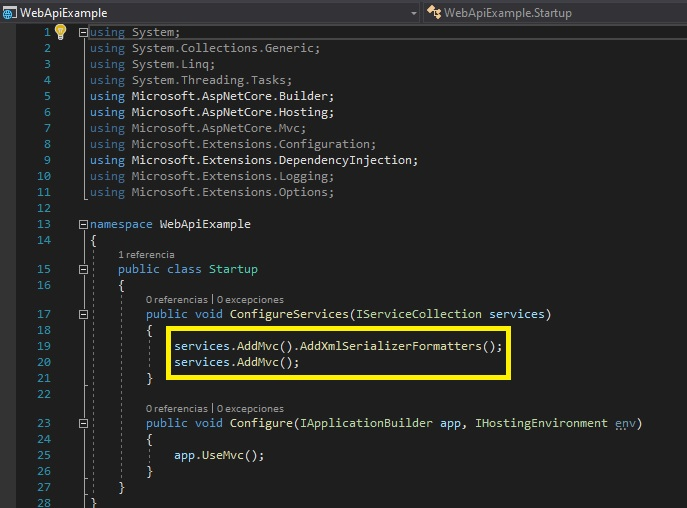

33. En la ventana **WebApiExample - Microsoft Visual Studio**, en el Solution Explorer, en **Controllers**, haga clic en **PersonController.cs**.

34. En el bloque de código de acción **GetAll**, localice el siguiente código:
  ```cs
       [HttpGet]
  ```
35. Ponga el cursor después del código localizado, presione Enter, y luego escriba el siguiente código:
  ```cs
       [Produces("application/xml")]
  ``` 

36. En la ventana **WebApiExample - Microsoft Visual Studio**, en el menú **FILE**, haga clic en **Save All**.

37. En la ventana **WebApiExample - Microsoft Visual Studio**, en el menú **DEBUG**, haga clic en **Iniciar sin depuración**.

    >**Nota**: El navegador muestra una lista de personas en el formato XML.

38. En Microsoft Edge, haga clic en **Cerrar**.

39. En la ventana **WebApiExample - Microsoft Visual Studio**, en el menú **FILE**, haga clic en **Salir**.

# Lección 3: Llamar a un Web API 

### Demonstration: Cómo llamar a las APIs web usando el código jQuery

#### Pasos de preparación 

Asegúrate de que has clonado el directorio **20486D** de GitHub. Contiene los segmentos de código para los laboratorios y demostraciones de este curso. (**https://github.com/MicrosoftLearning/20486D-DevelopingASPNETMVCWebApplications/tree/master/Allfiles**)

#### Pasos de demostración

1. Navega a **[Raíz del Repositorio]\N-Todos los archivos\NMod13\N-Democode\N02_JQueryExample_begin**, y luego haz doble clic en **JQueryExample.sln**.

    >**Nota**: Si aparece un cuadro de diálogo de **Advertencia de seguridad para JQueryExample**, verifique que la casilla de verificación **Ask me for each project in this solution** esté despejada, y luego haga clic en OK.

2. En la ventana **JQueryExample - Microsoft Visual Studio**, en el Explorador de soluciones, haga clic con el botón derecho del ratón en **Controladores**, apunte a **Agregar**, y luego haga clic en **Controlador**.

3. En el cuadro de diálogo **Agregar andamiaje**, haga clic en **Controlador API - Vaciar**, y luego haga clic en **Agregar**.

4. En el cuadro de diálogo **Agregar controlador API vacío**, en el cuadro **Nombre del controlador**, escriba **Controlador Pizza** y, a continuación, haga clic en **Agregar**.

5. En la ventana de código **PizzaController.cs**, localice el siguiente código:
  ```cs
       using Microsoft.AspNetCore.Mvc;
  ```
6. Asegúrate de que el cursor está al final del espacio de nombres **Microsoft.AspNetCore.Mvc**, presiona Enter, y luego escribe el siguiente código:
  ```cs
       using JQueryExample.Models;
  ```

7. En la ventana del código **PizzaController.cs**, coloque el cursor después del segundo signo **{** (abra abrazaderas), presione Enter, y luego escriba el siguiente código:

  ```cs
       private List<Pizza> _pizzas = new List<Pizza>();

       public PizzaController()
       {
            _pizzas.Add(new Pizza() { Id = 1, Toppings = "mushrooms", Price = 10 });
            _pizzas.Add(new Pizza() { Id = 2, Toppings = "extra cheese", Price = 8 });
            _pizzas.Add(new Pizza() { Id = 3, Toppings = "black olives", Price = 9 });
            _pizzas.Add(new Pizza() { Id = 4, Toppings = "pineapple", Price = 12 });
       }
  ```

8. Asegúrate de que el cursor está al final del bloque de código de construcción **PizzaController**, presiona Enter dos veces, y luego escribe el siguiente código:
  ```cs
       [HttpGet("{id}")]
       public ActionResult<Pizza> GetById(int id)
       {
       }
  ```
9. En el bloque de código de acción **GetById**, escriba el siguiente código:
  ```cs
       Pizza pizza = _pizzas.SingleOrDefault(p => p.Id == id);
       if (pizza == null)
       {
            return NotFound();
       }
       return pizza;
  ```
10. Asegúrate de que el cursor está al final del bloque de código del método **GetById**, presiona Enter dos veces, y luego escribe el siguiente código:
  ```cs
       [HttpPost]
       public ActionResult<Pizza> Post(Pizza pizza)
       {
       }
  ```
11. En el bloque de código de acción **Post**, escriba el siguiente código:
  ```cs
       int pizzaMaxId = _pizzas.Max(i => i.Id);
       pizza.Id = ++pizzaMaxId;
       _pizzas.Add(pizza);
       return CreatedAtAction(nameof(GetById), new { id = pizza.Id }, pizza);
  ```

- La representación visual de la resolución del ejercicio se muestra en la siguiente imagen:

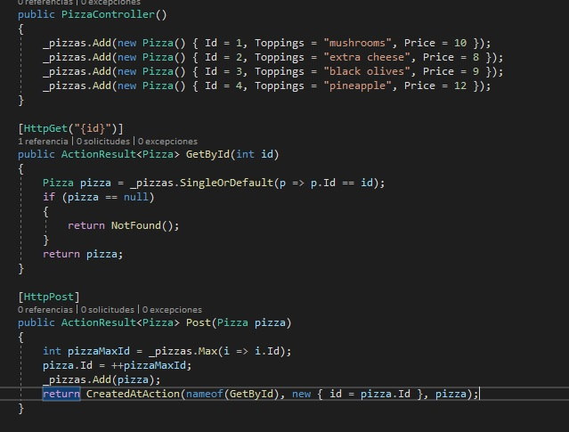

12. En la ventana **JQueryExample - Microsoft Visual Studio**, en el Solution Explorer, haga clic con el botón derecho del ratón **wwwwroot**, apunte a **Add**, y luego haga clic en **New Folder**.

13. En el cuadro **Nueva Carpeta**, escriba **js**, y luego presione Enter.


- La representación visual de la resolución del ejercicio se muestra en la siguiente imagen:


14. En la ventana **JQueryExample - Microsoft Visual Studio**, en el Solution Explorer, en **wwwwroot**, haga clic con el botón derecho **js**, señale **Agregar**, y luego haga clic en **Nuevo elemento**.

15. En el cuadro de diálogo **Agregar nuevo elemento - JQueryExample**, haga clic en **Web** y, a continuación, en el panel de resultados, haga clic en **Archivo JavaScript**.

16. En el cuadro de diálogo **Agregar nuevo elemento - JQueryExample**, en el cuadro **Nombre**, escriba **pizza-get**, y luego haga clic en **Agregar**.

17. En la ventana de código **pizza-get.js**, escriba el siguiente código:
  ```cs
       $(function() {
            $(".btn-get").click(function (e) {
                e.preventDefault();
                $.ajax({
                    type: "GET",
                    url: "http://localhost:59216/api/Pizza/1",
                    contentType: "application/json; charset=utf-8",
                    dataType: "json"
                    }).done(function (response) {
                        $(".result").text('Information for pizza with id 1: ' + 'has the following toppings ' + response.toppings + ' for the price of ' + response.price + '$');
                    }).fail(function () {
                        alert('An error has occurred');
                });
            });
       });
  ```

- La representación visual de la resolución del ejercicio se muestra en la siguiente imagen:

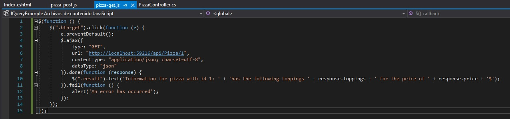


18. En la ventana **JQueryExample - Microsoft Visual Studio**, en el Solution Explorer, en **wwwwroot**, haga clic con el botón derecho **js**, apunte a **Add**, y luego haga clic en **New Item**.

19. En el cuadro de diálogo **Agregar nuevo elemento - JQueryExample**, haga clic en **Web** y, a continuación, en el panel de resultados, haga clic en **Archivo JavaScript**.

20. En el cuadro de diálogo **Agregar nuevo elemento - JQueryExample**, en el cuadro **Nombre**, escriba **pizza-post**, y luego haga clic en **Agregar**.

21. En la ventana de código **pizza-post.js**, escriba el siguiente código:
  ```cs
       $(function () {
            $(".btn-post").click(function (e) {
                e.preventDefault();
                $.ajax({
                    type: "POST",
                    url: "http://localhost:59216/api/Pizza",
                    data: JSON.stringify({
                        toppings: "pineapple",
                        price: 10.99
                    }),
                    contentType: "application/json;charset=utf-8"
                    }).done(function (result) {
                        $(".result").text('Ajax result: pizza object was added successfully with id number ' + result.id + ', and ' + result.toppings + ' topping for the price of ' + result.price + '$');
                    }).fail(function () {
                        alert('An error has occurred');
                });
            });
       });
  ```

- La representación visual de la resolución del ejercicio se muestra en la siguiente imagen:

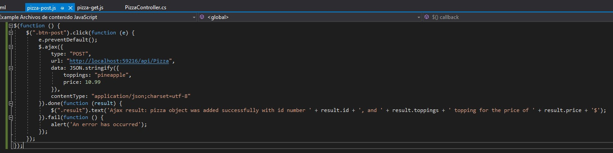

22. En la ventana **JQueryExample - Microsoft Visual Studio**, en el Solution Explorer, expandir **Views**, expandir **Home**, y luego hacer clic en **Index.cshtml**.

23. En la ventana de código **Index.cshtml**, localice el siguiente código:
  ```cs
       <script src="https://stackpath.bootstrapcdn.com/bootstrap/4.1.0/js/bootstrap.min.js"></script>
  ```
24. Coloque el cursor después del signo **>** (mayor que) de la etiqueta **&lt;/script --> **, pulse Intro, y luego escriba el siguiente código: 
  ```cs
       <script src="~/js/pizza-get.js"></script>
       <script src="~/js/pizza-post.js"></script>
  ```
25. En la ventana del código **Index.cshtml**, en el elemento **BODY**, escriba el siguiente código:

  ```cs
       <h1>Welcome to Module 13 - Demo 2</h1>
       <button type="button" class="btn-get btn-outline-info">Get Ajax Function</button>
       <button type="button" class="btn-post btn-outline-info">Post Ajax Function</button>
       <div class="result"></div>
  ```

- La representación visual de la resolución del ejercicio se muestra en la siguiente imagen:

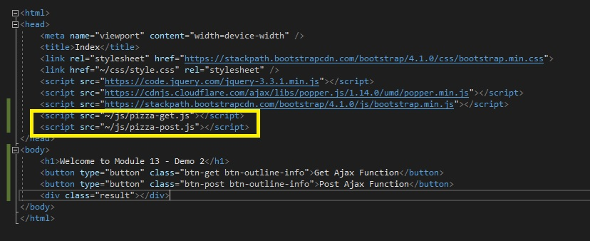

26. En la ventana **JQueryExample - Microsoft Visual Studio**, en el menú **FILE**, haga clic en **Save All**.

27. En la ventana **JQueryExample - Microsoft Visual Studio**, en el menú **DEBUG**, haga clic en **Iniciar sin depuración**.

- La representación visual de la resolución del ejercicio se muestra en la siguiente imagen:

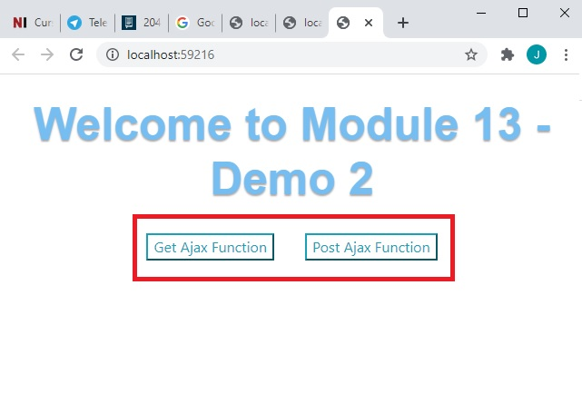

28. En la página **Home**, haga clic en **Get Ajax Function**.

- La representación visual de la resolución del ejercicio se muestra en la siguiente imagen:

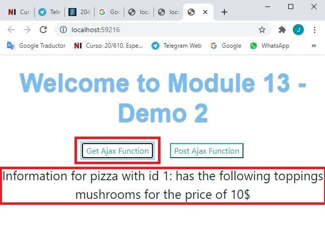

    >**Nota**: El navegador muestra los ingredientes y el precio de la pizza con id=1.

- La representación visual de la resolución del ejercicio se muestra en la siguiente imagen:

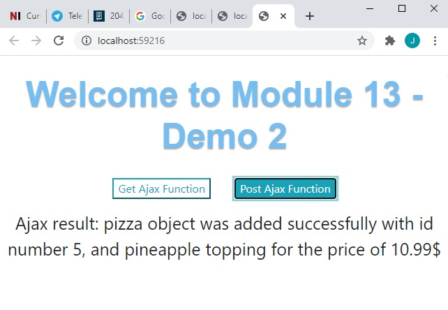

29. En la página de **Home**, haga clic en **Post Ajax Function**.

    >**Nota**: El navegador muestra la nueva información de la pizza.

30. En Microsoft Edge, haz clic en **Cerrar**.

31. En la ventana **JQueryExample - Microsoft Visual Studio**, en el menú **FILE**, haga clic en **Salir**.

# Lección 3: Llamar a un Web API 

### Demonstration: Cómo llamar a las APIs web utilizando código del lado del servidor

#### Pasos de preparación 

1. Asegúrate de que has clonado el directorio **20486D** de GitHub. Contiene los segmentos de código para los laboratorios y demostraciones de este curso. (**https://github.com/MicrosoftLearning/20486D-DevelopingASPNETMVCWebApplications/tree/master/Allfiles**)

2. Navega a **[Repository Root]\Allfiles\Mod13\Democode\01_WebApiExample_begin**, y luego abre el **HttpClientExample.sln**.

    >**Nota**: Si aparece un cuadro de diálogo de **Advertencia de seguridad para HttpClientExample**, verifica que la casilla de verificación **Ask me for each project in this solution** está despejada, y luego haz clic en OK.

3. En la ventana **HttpClientExample - Microsoft Visual Studio**, en el menú **DEBUG**, haga clic en **Start Without Debugging**.

4. En Microsoft Edge, en la barra de direcciones, anota el número de puerto que aparece al final del URL **http://localhost:[port]**. Usará el número de puerto durante esta demostración.

5. En Microsoft Edge, haga clic en **Cerrar**.

- La representación visual de la resolución del ejercicio se muestra en la siguiente imagen:

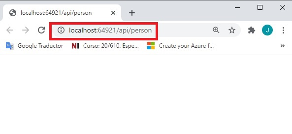


#### Pasos de la demostración

1. Navega a **[Repository Root]\Allfiles\Mod13\Democode\03_HttpClientExample_begin**, y luego haz doble clic en **HttpClientExample.sln**.

    >**Nota**: Si aparece el cuadro de diálogo **Advertencia de seguridad para HttpClientExample**, verifique que la casilla de verificación **Ask me for each project in this solution** esté despejada, y luego haga clic en OK.

2. En la ventana **HttpClientExample - Microsoft Visual Studio**, en el Explorador de soluciones, en **ClientSide**, haga clic en **Startup.cs**.

3. En la ventana del código **Startup.cs**, localice el siguiente código:
  ```cs
      services.AddMvc();
  ```
4. Ponga el cursor al final del código localizado, presione Enter, y luego escriba el siguiente código:
  ```cs
      services.AddHttpClient();
  ```

- La representación visual de la resolución del ejercicio se muestra en la siguiente imagen:

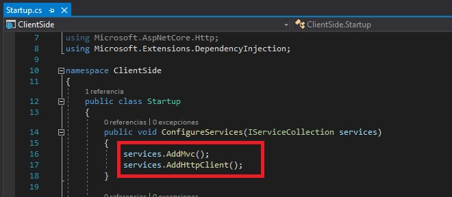

5. En el Explorador de soluciones, haga clic con el botón derecho del ratón en **ClientSide**, apunte a **Add**, y luego haga clic en **New Folder**.

6. En el cuadro **Nueva Carpeta**, escriba **Controladores**, y luego presione Enter.

- La representación visual de la resolución del ejercicio se muestra en la siguiente imagen:

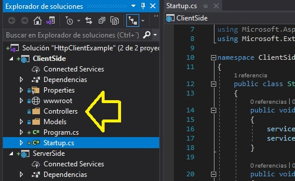

7. En la ventana **HttpClientExample - Microsoft Visual Studio**, en el Explorador de soluciones, en **ClientSide**, haga clic con el botón derecho del ratón en **Controllers**, apunte a **Add**, y luego haga clic en **Controller**.

8. En el cuadro de diálogo **Agregar andamiaje**, haga clic en **Controlador MVC - Vaciar**, y luego haga clic en **Agregar**.

- La representación visual de la resolución del ejercicio se muestra en la siguiente imagen:

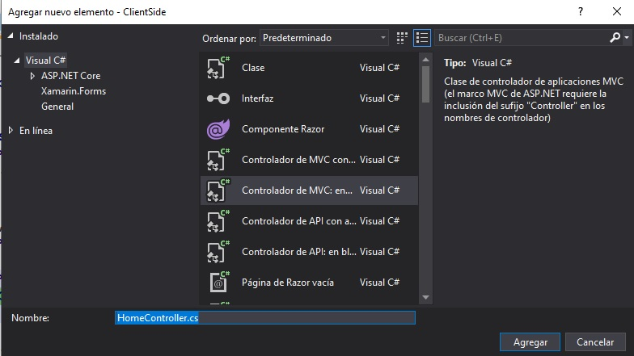

9. En el cuadro de diálogo **Añadir controlador MVC vacío**, en el cuadro **Nombre del controlador**, escriba **Controlador doméstico** y, a continuación, haga clic en **Añadir**.

- La representación visual de la resolución del ejercicio se muestra en la siguiente imagen:

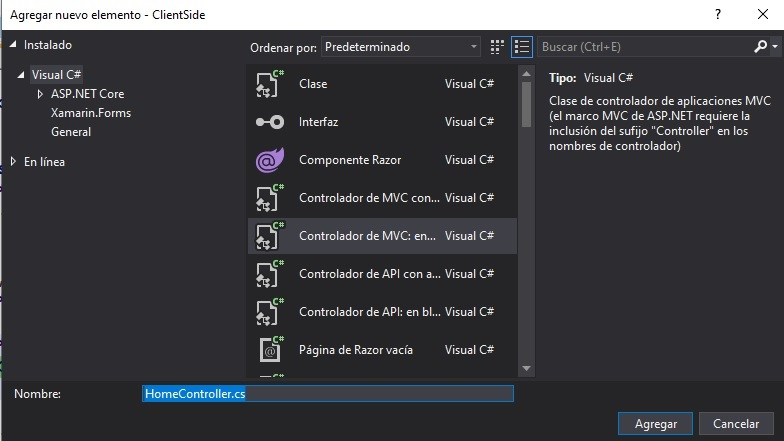

10. En la ventana de código **HomeController.cs**, localice el siguiente código:
  ```cs
      using Microsoft.AspNetCore.Mvc;
  ```
11. Asegúrate de que el cursor está al final del espacio de nombres **Microsoft.AspNetCore.Mvc**, presiona Enter, y luego escribe el siguiente código:
  ```cs
      using ClientSide.Models;
      using System.Net.Http;
      using System.Net.Http.Headers;
  ```

12. En la ventana del código **HomeController.cs**, borre el siguiente código:
  ```cs
       public IActionResult Index()
       {
           return View();
       }
  ```
13. En el bloque de código **HomeController.cs**, coloque el cursor después del segundo signo **{** (abrazaderas), pulse Intro, y luego escriba el siguiente código:
  ```cs
       private IHttpClientFactory _httpClientFactory;

       public HomeController(IHttpClientFactory httpClientFactory)
       {
           _httpClientFactory = httpClientFactory;
       }  
  ``` 

14. Asegúrate de que el cursor está al final del bloque de código de construcción **HomeController**, presiona Enter dos veces, y luego escribe el siguiente código:
  ```cs
       public async Task<IActionResult> GetByIdAsync()
       {
       }
  ```
15. En el bloque de código de acción **GetByIdAsync**, escribe el siguiente código:

  ```cs
       HttpClient httpClient = _httpClientFactory.CreateClient();
       httpClient.BaseAddress = new Uri("http://localhost:61086");
       HttpResponseMessage response = httpClient.GetAsync("http://localhost:61106/api/store/1").Result;
       if (response.IsSuccessStatusCode)
       {
           GroceryStore grocery = await response.Content.ReadAsAsync<GroceryStore>();
           return new ObjectResult(grocery);
       }
       else
       {
           return Content("An error has occurred");
       }
  ```


16. Asegúrate de que el cursor está al final del bloque de código de acción **GetByIdAsync**, presiona Enter dos veces, y luego escribe el siguiente código:
  ```cs
       public async Task<IActionResult> PostAsync()
       {
       }
  ```
17. En el bloque de código de acción **PostAsync**, escriba el siguiente código:
  ```cs
       HttpClient httpClient = _httpClientFactory.CreateClient();
       httpClient.BaseAddress = new Uri("http://localhost:61086");
       GroceryStore newGrocery = new GroceryStore { Name = "Martin General Stores", Address = "4160  Oakwood Avenue" };
       HttpResponseMessage response = await httpClient.PostAsJsonAsync("http://localhost:61106/api/store", newGrocery);
       if (response.IsSuccessStatusCode)
       {
           GroceryStore grocery = await response.Content.ReadAsAsync<GroceryStore>();
           return new ObjectResult(grocery);
       }
       else
       {
           return Content("An error has occurred");
       }
  ```

- La representación visual de la resolución del ejercicio se muestra en la siguiente imagen:

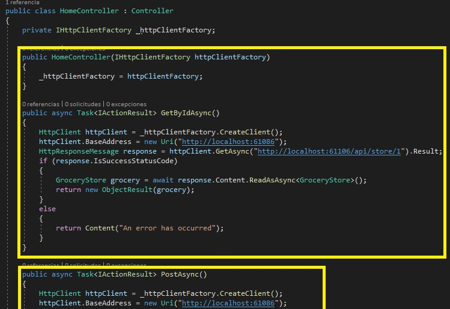

18. En la ventana **HttpClientExample - Microsoft Visual Studio**, en el Explorador de soluciones, expanda **ServerSide**, expanda **Controllers**, y luego haga clic en **StoreController.cs**.

    >**Nota**: Examinar el contenido de la clase **StoreController**.

19. En la ventana **HttpClientExample - Microsoft Visual Studio**, en Solution Explorer, en **ServerSide**, en **Properties**, haga clic en **launchSettings.json**.

20. En la ventana de código **launchSettings.json**, seleccione el siguiente código:
  ```cs
       "profiles": {
          "IIS Express": {
            "commandName": "IISExpress",
            "launchBrowser": true,
            "environmentVariables": {
              "ASPNETCORE_ENVIRONMENT": "Development"
           }
       },
  ```

21. Reemplazar el código seleccionado por el siguiente código:
  ```cs
       "profiles": {
          "IIS Express": {
            "commandName": "IISExpress",
            "launchBrowser": false,
            "environmentVariables": {
              "ASPNETCORE_ENVIRONMENT": "Development"
           }
       },
  ```

- La representación visual de la resolución del ejercicio se muestra en la siguiente imagen:

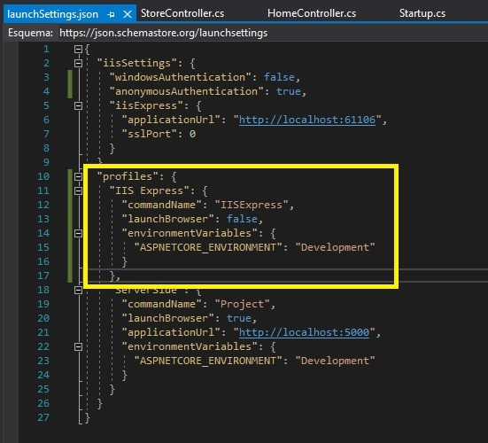

22. En la ventana **HttpClientExample - Microsoft Visual Studio**, en el menú **FILE**, haga clic en **Save All**.

23. En el Explorador de soluciones, haga clic con el botón derecho del ratón en **ServerSide**, y luego haga clic en **Set as StartUp Project**. 

- La representación visual de la resolución del ejercicio se muestra en la siguiente imagen:

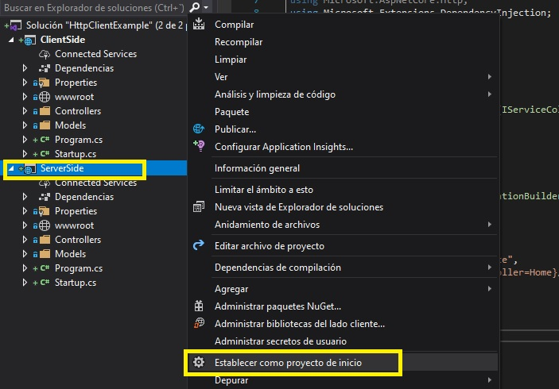

24. En la ventana **HttpClientExample - Microsoft Visual Studio**, en el menú **DEBUG**, haga clic en **Start Without Debugging**.

25. En el Explorador de soluciones, haga clic con el botón derecho del ratón en **ClientSide**, y luego haga clic en **Set as StartUp Project**. 

- La representación visual de la resolución del ejercicio se muestra en la siguiente imagen:

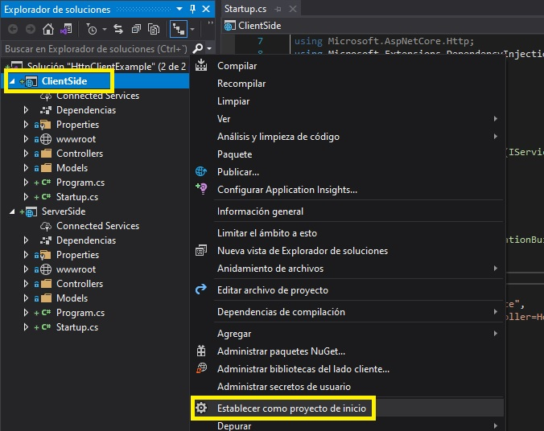

26. En la ventana **HttpClientExample - Microsoft Visual Studio**, en el menú **DEBUG**, haga clic en **Start Without Debugging**.

    >**Nota**: El navegador muestra el objeto de la tienda de comestibles con id=1 en el formato JSON.

- La representación visual de la resolución del ejercicio se muestra en la siguiente imagen:

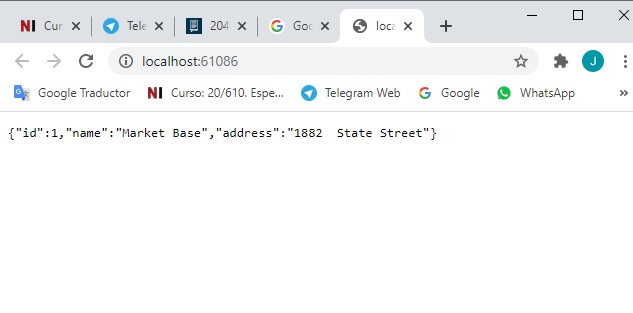

27. En Microsoft Edge, en la barra de direcciones, escribe **http://localhost:[port]/home/PostAsync**, y luego presiona Enter.

    >**Nota**: El navegador muestra la tienda de comestibles recién añadida en el formato JSON.

- La representación visual de la resolución del ejercicio se muestra en la siguiente imagen:

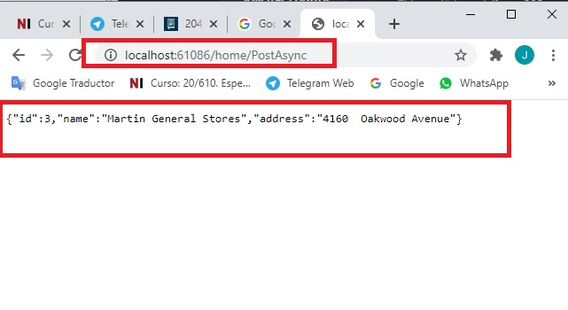

28. En el Microsoft Edge, pulsa **Cerrar**.

29. En la ventana **HttpClientExample - Microsoft Visual Studio**, en el menú **FILE**, haga clic en **Salir**.

