# Module 13: Implementing Web APIs

Siempre cuando un camino comienza con  *[Repository Root]*, reemplacelo con el camino absoluto en el que el repositorio 20486 reside. Por ejemplo, si tu has cloneado o extraido el repositorio 20486 en la carpeta **C:\Users\John Doe\Downloads\20486**, cambiar la ruta de: **[Repository Root]\AllFiles\20486D\Mod01** a **C:\Users\John Doe\Downloads\20486\AllFiles\20486D\Mod01**.

Fichero de Instrucciones: Instructions\20486D_MOD13_LAK.md

**Información:**

1. **Nombres y apellidos:** José René Fuentes Cortez
2. **Fecha:** 24 de Diciembre 2020.
3. **Resumen del Ejercicio:** Este laboratorio consta de 3 ejercicios:
- En el Primer ejercicio nos ayuda a agregar controladorese a una aplicación WEB API, la cual es llamada por el navegador posteriormente.
- En el Segundo ejercicio nos ayuda a llamar una WEB API  usando la clase HttpClient.
- En el Tercer ejercicio habilitamos a los usuarios para ver las posibles posiciones de trabajo y hacemos posible que ellos apliquen por un trabajo definido.

4. **Dificultad o problemas presentados y como se resolvieron:** Ninguno.

**NOTA**: Si no hay descripcion de problemas o dificultades, y al yo descargar el código para realizar la comprobacion y el código no funcionar, el resultado de la califaciación del laboratorio será afectado.

---


# Laboratorio: Implementación de las API de la Web

### Configuración del Lab

Tiempo estimado: **60 minutos**

### Preparation Steps

1. Asegúrate de que has clonado el directorio **20486D** de GitHub. Contiene los segmentos de código para los laboratorios y demostraciones de este curso. 
**(https://github.com/MicrosoftLearning/20486D-DevelopingASPNETMVCWebApplications/tree/master/Allfiles)**

2. En el Explorador de Archivos, navega a **[Repository Root]\Allfiles\Mod13\Labfiles\01_Restaurant_begin\Client**, copia la dirección en la barra de direcciones.

3. Selecciona el botón **Inicio**, y luego escribe **cmd**.

4. En **Best match**, haz clic con el botón derecho del ratón en **Command Prompt**, y luego haz clic en **Run as administrator**.

5. En el cuadro de diálogo **Control de cuentas de usuario**, haga clic en **Sí**.

6. En el cuadro de diálogo **Administrador: Command Prompt**, escriba el siguiente comando y luego pulse Intro.
  ```cs
       cd  {copied folder path}
  ```

>**Nota**: Si la **{pista de la carpeta copiada}** es diferente de la unidad de disco donde se encuentra el **Programa de comandos**, entonces debería escribir **{unidad de disco}:** antes de escribir el **cd {pista de la carpeta copiada}** comando.

7. En el **Administrador: Command Prompt**, escriba el siguiente comando y luego pulse Intro.
  ```cs
       npm install
  ```
>**Nota**: Si se muestran mensajes de advertencia en la línea de comandos, puede ignorarlos.

- La representación visual de la resolución del ejercicio se muestra en la siguiente imagen:

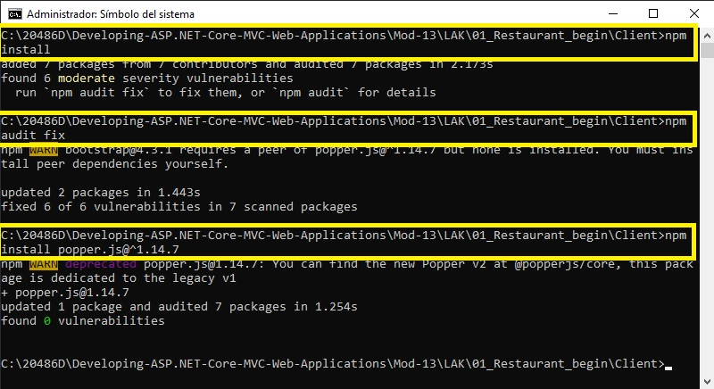

8. Cierre la ventana.

9. Navega a **[Repository Root]\Allfiles\Mod13\Labfiles\01_Restaurant_begin**, y luego abre el **Restaurant.sln**.

    >**Nota**: Si aparece un cuadro de diálogo de **Aviso de Seguridad para el Servidor**, verifique que la casilla de verificación **Pregúnteme por cada proyecto de esta solución** está despejada, y luego haga clic en OK.

10. En la ventana **Servidor - Microsoft Visual Studio**, en el menú **DEBUG**, haga clic en **Iniciar sin depuración**.

11. En Microsoft Edge, en la barra de direcciones, anote el número de puerto que aparece al final del URL **http://localhost:[port]**. Usarás el número de puerto durante este laboratorio.

- La representación visual de la resolución del ejercicio se muestra en la siguiente imagen:

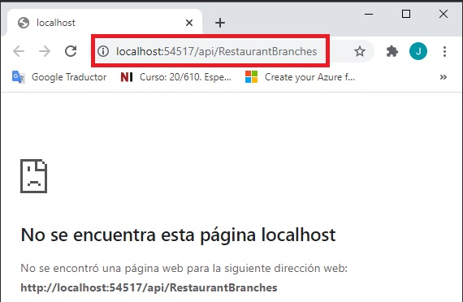

12. En Microsoft Edge, haz clic en **Cerrar**.

### Ejercicio 1: Agregar acciones y llamarlas usando Microsoft Edge

#### Tarea 1: Añadir un Controller y una acción a una aplicación Web API

1. Navega a **[Repository Root]\Allfiles\Mod13\Labfiles\01_Restaurant_begin**, y luego haz doble clic en **Restaurant.sln**.

    >**Nota**: Si aparece un cuadro de diálogo de **Aviso de Seguridad para el Servidor**, verifique que la casilla de verificación **Pregúnteme por cada proyecto de esta solución** esté despejada, y luego haga clic en OK.

2. En la ventana **Restaurante - Microsoft Visual Studio**, en el Explorador de soluciones, en **Servidor**, haga clic con el botón derecho del ratón en **Controllers**, apunte a **Agregar**, y luego haga clic en **Controller**.

3. En el cuadro de diálogo **Agregar andamiaje**, haga clic en **Controller API - Vaciar**, y luego haga clic en **Agregar**.

- La representación visual de la resolución del ejercicio se muestra en la siguiente imagen:

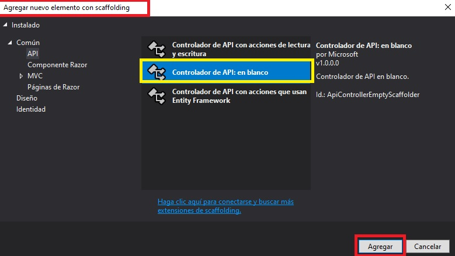

4. En el cuadro de diálogo **Agregar Controller de la API vacío**, en el cuadro **Nombre del Controller**, escriba **RestaurantBranchesController** y, a continuación, haga clic en **Agregar**.

- La representación visual de la resolución del ejercicio se muestra en la siguiente imagen:

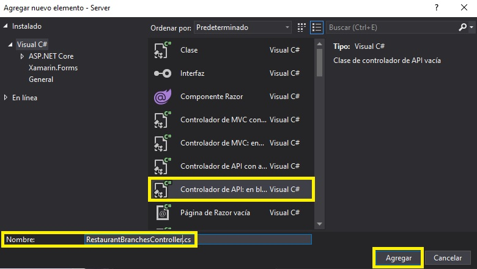

5. En la ventana de código **RestaurantBranchesController.cs**, localice el siguiente código:
  ```cs
       using Microsoft.AspNetCore.Mvc;
  ```
6. Asegúrate de que el cursor está al final del espacio de nombres **Microsoft.AspNetCore.Mvc**, presiona Enter, y luego escribe el siguiente código:
  ```cs
       using Server.Data;
       using Server.Models;
  ```
7. En la ventana del código **RestaurantBranchesController.cs**, coloque el cursor después del segundo signo **{** (abra abrazaderas), presione Enter, y luego escriba el siguiente código:
  ```cs
       private RestaurantContext _context;

       public RestaurantBranchesController(RestaurantContext context)
       {
           _context = context;
       }
  ```
8. Asegúrate de que el cursor está al final del bloque de código de construcción **RestaurantBranchesController**, pulsa dos veces Intro y luego escribe el siguiente código:
  ```cs
       [HttpGet]
       public ActionResult<List<RestaurantBranch>> Get()
       {
       }
  ```
9. En el bloque de código de acción **Get**, escriba el siguiente código:
  ```cs
       var branches = from r in _context.RestaurantBranches
                      orderby r.City
                      select r;
       return branches.ToList();
  ```

- La representación visual de la resolución del ejercicio se muestra en la siguiente imagen:

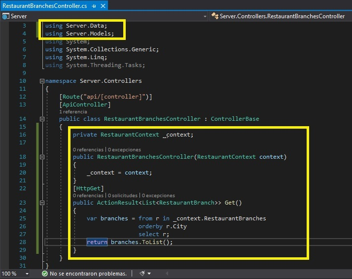

#### Tarea 2: Ejecutar la aplicación

1. En la ventana **Restaurante - Microsoft Visual Studio**, en el menú **Archivo**, haga clic en **Guardar todo**.

2. En el Explorador de soluciones, haga clic con el botón derecho del ratón en **Servidor**, y luego haga clic en **Configurar como proyecto de inicio**. 

3. En la ventana **Restaurante - Microsoft Visual Studio**, en el menú **DEBUG**, haga clic en **Iniciar sin depuración**.

    >**Nota**: El navegador muestra una lista de ramas en el formato JSON.

- La representación visual de la resolución del ejercicio se muestra en la siguiente imagen:

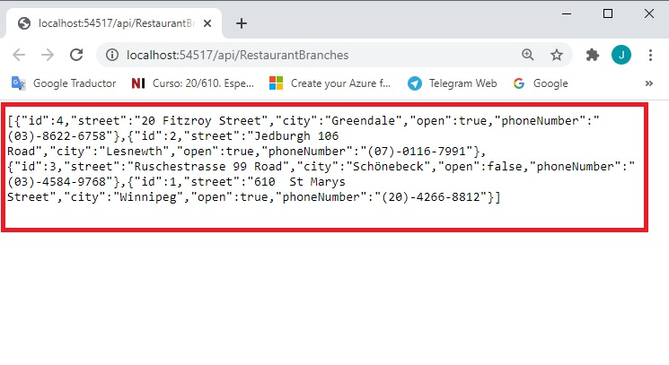

4. En Microsoft Edge, haga clic en **Cerrar**.

#### Tarea 3: Añadir un Controller y una acción que obtiene un parámetro

1. En la ventana **Restaurante - Microsoft Visual Studio**, en el Explorador de soluciones, en **Servidor**, haga clic con el botón derecho del ratón en **Controllers**, apunte a **Agregar**, y luego haga clic en **Controller**.

2. En el cuadro de diálogo **Agregar andamiaje**, haga clic en **Controller API - Vaciar**, y luego haga clic en **Agregar**.

3. En el cuadro de diálogo **Agregar Controller API vacío**, en el cuadro **Nombre del Controller**, escriba **ReservationController** y, a continuación, haga clic en **Agregar**.

- La representación visual de la resolución del ejercicio se muestra en la siguiente imagen:


4. En la ventana de código **ReservationController.cs**, localice el siguiente

  ```cs
       using Microsoft.AspNetCore.Mvc;
  ```

5. Asegúrate de que el cursor está al final del espacio de nombres **Microsoft.AspNetCore.Mvc**, presiona Enter, y luego escribe el siguiente código:
  ```cs
       using Server.Data;
       using Server.Models;
  ```

6. En la ventana del código **ReservationController.cs**, coloque el cursor después del segundo signo **{** (abra las abrazaderas), presione Enter y luego escriba el siguiente código:
  ```cs
       private RestaurantContext _context;

       public ReservationController(RestaurantContext context)
       {
           _context = context;
       }
  ```
7. Asegúrate de que el cursor está al final del bloque de código de construcción **ReservationController**, pulsa dos veces Intro y luego escribe el siguiente código:
  ```cs
       [Route("{id:int}")]
       public ActionResult<OrderTable> GetById(int id)
       {
       }
  ```
8. En el bloque de código de acción **GetById**, escriba el siguiente código:
  ```cs
       var order = _context.ReservationsTables.FirstOrDefault(p => p.Id == id);
       if (order == null)
       {
           return NotFound();
       }

       return order
  ```

- La representación visual de la resolución del ejercicio se muestra en la siguiente imagen:

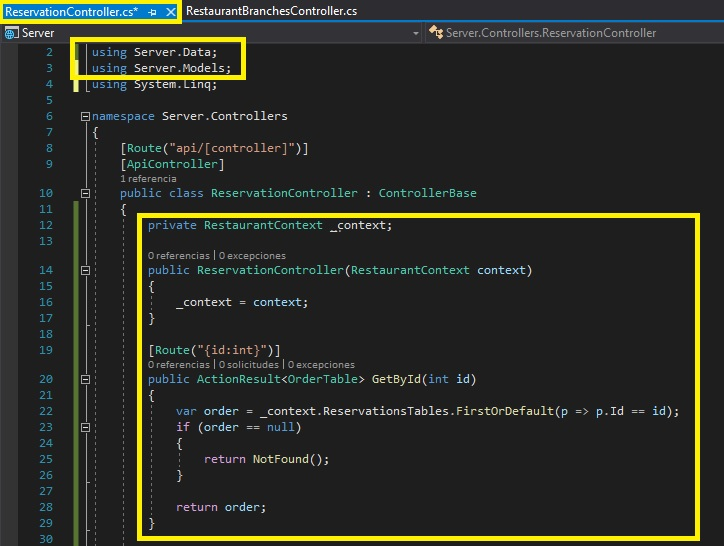

#### Tarea 4: Ejecutar la aplicación

1. En la ventana **Restaurante - Microsoft Visual Studio**, en el menú **Archivo**, haga clic en **Guardar todo**.

2. En la ventana **Restaurante - Microsoft Visual Studio**, en el menú **DEBUG**, haga clic en **Iniciar sin depuración**.

3. En **Microsoft Edge**, en la barra de direcciones, escriba **http://localhost:[port]/api/Reservation/1**, y luego presione Enter.

    >**Nota**: El navegador muestra una orden con id=1 en el formato JSON.

- La representación visual de la resolución del ejercicio se muestra en la siguiente imagen:

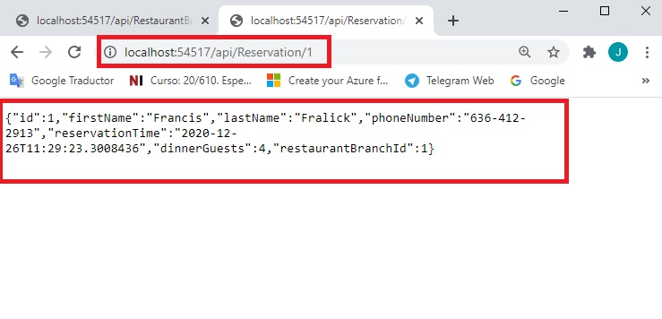

4. En el Microsoft Edge, pulse **Cerrar**.

#### Tarea 5: Agregar una acción de Post a una aplicación Web API

1. En la ventana **Restaurante - Microsoft Visual Studio**, en el Explorador de soluciones, en **Servidor**, amplíe **Controllers**, y luego haga clic en **ReservationController**.

2. En la ventana de código **ReservationController.cs**, asegúrese de que el cursor esté al final del bloque de código de acción **GetById**, presione dos veces la tecla Enter y luego escriba el siguiente código:
  ```cs
       [HttpPost]
       public ActionResult<OrderTable> Create(OrderTable orderTable)
       {
       }
  ```
3. En el bloque de código de acción **Crear**, escriba el siguiente código:
  ```cs
       _context.Add(orderTable);
       _context.SaveChanges();
       return CreatedAtAction(nameof(GetById), new { id = orderTable.Id }, orderTable);
  ```

- La representación visual de la resolución del ejercicio se muestra en la siguiente imagen:

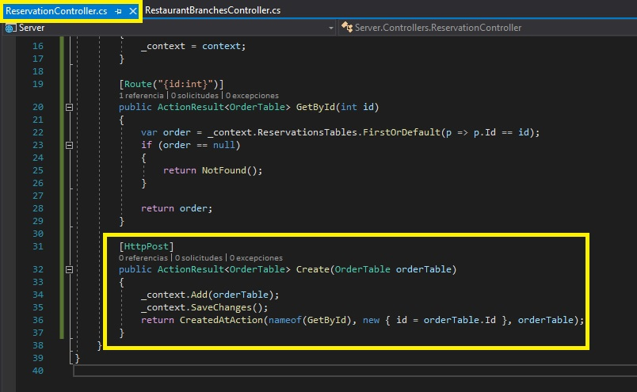

>**Resultados**: En este ejercicio, agregaste Controllers y acciones a una aplicación Web API, y los llamaste usando Microsoft Edge.

### Ejercicio 2: Llamar a una API Web usando código del lado del servidor

#### Tarea 1: Llamar a un método de obtención de la API Web

1. En la ventana **Restaurante - Microsoft Visual Studio**, en el Explorador de soluciones, en **Cliente**, haga clic en **Startup.cs**.

2. En la ventana del código **Startup.cs**, localice el siguiente código:
  ```cs
       services.AddMvc();
  ```

3. Ponga el cursor al final del código localizado, presione dos veces la tecla Enter y luego escriba el siguiente código:
  ```cs
       services.AddHttpClient();
  ```

4. En la ventana **Restaurante - Microsoft Visual Studio**, en el Explorador de soluciones, en **Cliente**, haga clic con el botón derecho del ratón en **Controllers**, apunte a **Agregar**, y luego haga clic en **Controller**.

- La representación visual de la resolución del ejercicio se muestra en la siguiente imagen:

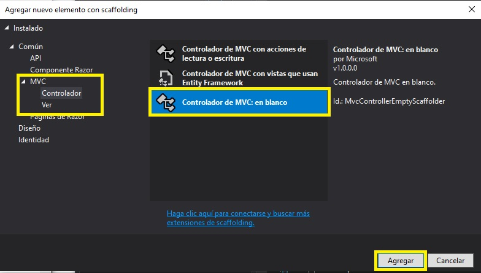

5. En el cuadro de diálogo **Agregar andamiaje**, haga clic en **Controller MVC - Vaciar**, y luego haga clic en **Agregar**.

6. En el cuadro de diálogo **Añadir Controller MVC vacío**, en el cuadro **Nombre del Controller**, escriba **RestaurantBranchesController**, y luego haga clic en **Añadir**.

- La representación visual de la resolución del ejercicio se muestra en la siguiente imagen:

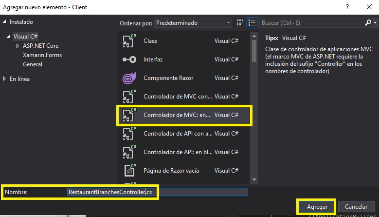

7. En la ventana de código **RestaurantBranchesController.cs**, localice el siguiente código:
  ```cs
       using Microsoft.AspNetCore.Mvc;
  ```
8. Asegúrate de que el cursor está al final del espacio de nombres **Microsoft.AspNetCore.Mvc**, presiona Enter, y luego escribe el siguiente código:
  ```cs
       using System.Net.Http;
       using Client.Models;
  ```
9. En la ventana del código **RestaurantBranchesController.cs**, seleccione el siguiente código:
  ```cs
       public IActionResult Index()
       {
          return View();
       }
  ```

10. Reemplace el código seleccionado por el siguiente código:
  ```cs
       private IHttpClientFactory _httpClientFactory;

       public RestaurantBranchesController(IHttpClientFactory httpClientFactory)
       {
             _httpClientFactory = httpClientFactory;
       }
  ```
11. Asegúrate de que el cursor está al final del bloque de código de construcción **RestaurantBranchesController**, pulsa dos veces Intro y luego escribe el siguiente código:
  ```cs
       public async Task<IActionResult> Index()
       {
       }
  ```
12. En el bloque de código de acción **Index**, escriba el siguiente código:

  ```cs
       HttpClient httpClient = _httpClientFactory.CreateClient();
       httpClient.BaseAddress = new Uri("http://localhost:54517");
       HttpResponseMessage response = await httpClient.GetAsync("api/RestaurantBranches");
       if (response.IsSuccessStatusCode)
       {
           IEnumerable<RestaurantBranch> restaurantBranches = await response.Content.ReadAsAsync<IEnumerable<RestaurantBranch>>();
           return View(restaurantBranches);
       }
       else
       {
           return View("Error");
       }
  ```

- La representación visual de la resolución del ejercicio se muestra en la siguiente imagen:

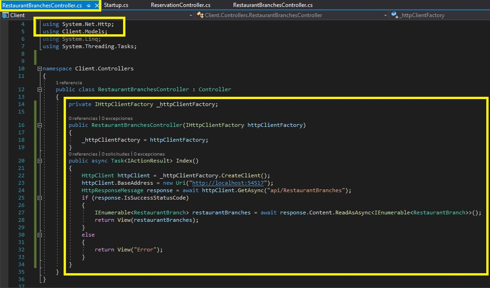


13.  En la ventana **Restaurante - Microsoft Visual Studio**, en el Explorador de Soluciones, en **Cliente**, expandir **Vistas**, expandir **RestaurantBranches**, y luego hacer clic en **Index.cshtml**.

     >**Nota**: Examinar el contenido del archivo.

- La representación visual de la resolución del ejercicio se muestra en la siguiente imagen:

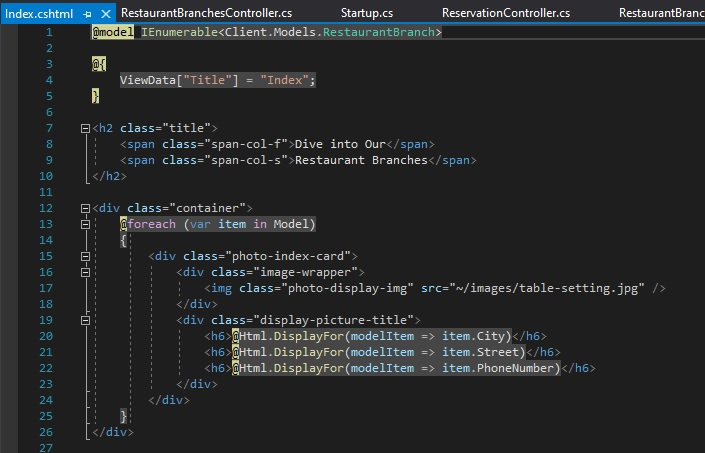


#### Tarea 2: Ejecutar la aplicación

1. En la ventana **Restaurante - Microsoft Visual Studio**, en el Explorador de Soluciones, en **Servidor**, en **Propiedades**, haga clic en **lanzarConfiguración.json**.

2. En la ventana del código **launchSettings.json**, seleccione el siguiente código:
  ```cs
       "profiles": {
          "IIS Express": {
            "csommandName": "IISExpress",
            "launchBrowser": true,
            "environmentVariables": {
              "ASPNETCORE_ENVIRONMENT": "Development"
           }
       }
  ```

3. Reemplazar el código seleccionado por el siguiente código:
  ```cs
       "profiles": {
          "IIS Express": {
            "csommandName": "IISExpress",
            "launchBrowser": false,
            "environmentVariables": {
              "ASPNETCORE_ENVIRONMENT": "Development"
           }
       },
  ```

- La representación visual de la resolución del ejercicio se muestra en la siguiente imagen:

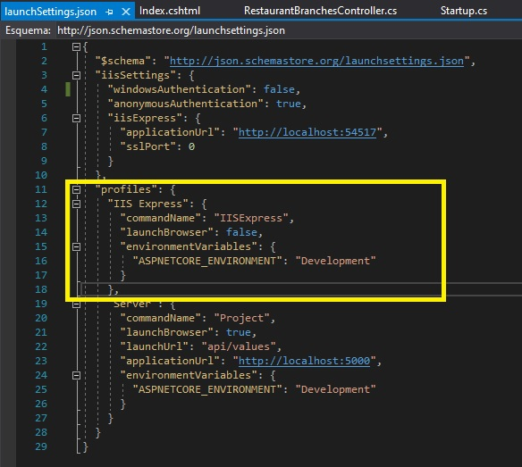

4. En la ventana **Restaurante - Microsoft Visual Studio**, en el menú **Archivo**, haga clic en **Guardar todo**.

5. En el Explorador de soluciones, haga clic con el botón derecho del ratón en **Servidor**, y luego haga clic en **Configurar como proyecto de inicio**. 

6. En la ventana **Restaurante - Microsoft Visual Studio**, en el menú **DEBUG**, haga clic en **Iniciar sin depuración**.

7. En el Explorador de soluciones, haga clic con el botón derecho del ratón en **Cliente**, y luego haga clic en **Configurar como proyecto de inicio**. 

8. En la ventana **Restaurante - Microsoft Visual Studio**, en el menú **DEBUG**, haga clic en **Iniciar sin depuración**.

    >**Nota**: El navegador muestra las sucursales del restaurante. 

- La representación visual de la resolución del ejercicio se muestra en la siguiente imagen:

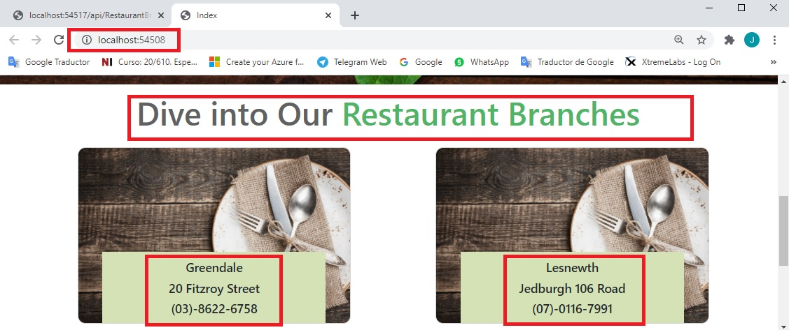

9. En el borde de Microsoft, haga clic en **Cerrar**.
    
#### Tarea 3: Llamar a un método de publicación de la API Web

1. En la ventana **Restaurante - Microsoft Visual Studio**, en el Explorador de soluciones, en **Cliente**, haga clic con el botón derecho del ratón en **Controllers**, apunte a **Agregar**, y luego haga clic en **Controller**.

- La representación visual de la resolución del ejercicio se muestra en la siguiente imagen:

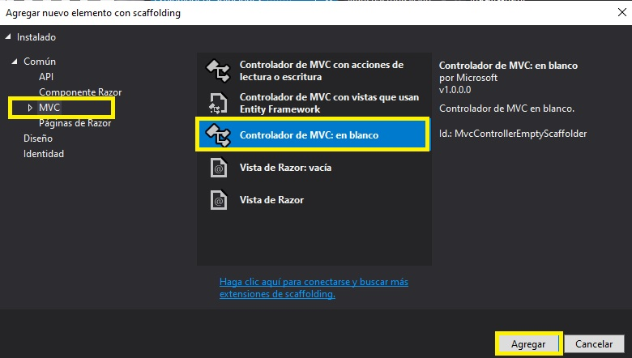

2. En el cuadro de diálogo **Agregar andamiaje**, haga clic en **Controller MVC - Vaciar**, y luego haga clic en **Agregar**.

3. En el cuadro de diálogo **Añadir Controller MVC vacío**, en el cuadro **Nombre del Controller**, escriba **ReservationController** y, a continuación, haga clic en **Añadir**.

- La representación visual de la resolución del ejercicio se muestra en la siguiente imagen:

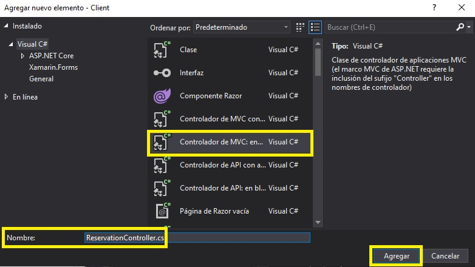

4. En la ventana de código **ReservationController.cs**, localice el siguiente código:
  ```cs
       using Microsoft.AspNetCore.Mvc;
  ```
5. Asegúrate de que el cursor está al final del espacio de nombres **Microsoft.AspNetCore.Mvc**, presiona Enter, y luego escribe el siguiente código:
  ```cs
       using Microsoft.AspNetCore.Mvc.Rendering;
       using System.Net.Http;
       using Client.Models;
  ```
6. En la ventana del código **ReservationController.cs**, seleccione el siguiente código:
  ```cs
       public IActionResult Index()
       {
          return View();
       }
  ```

7. Reemplazar el código seleccionado por el siguiente código:
  ```cs
       private IHttpClientFactory _httpClientFactory;

       public ReservationController(IHttpClientFactory httpClientFactory)
       {
             _httpClientFactory = httpClientFactory;
       }
  ```
8. Asegúrate de que el cursor está al final del bloque de código de construcción **ReservationController**, pulsa dos veces Intro y luego escribe el siguiente código:
  ```cs
       [HttpGet]
       public async Task<IActionResult> Create()
       {
       }
  ```
9. En el bloque de código de acción **Crear**, escriba el siguiente código:
  ```cs
       await PopulateRestaurantBranchesDropDownListAsync();
       return View();
  ```

- La representación visual de la resolución del ejercicio se muestra en la siguiente imagen:

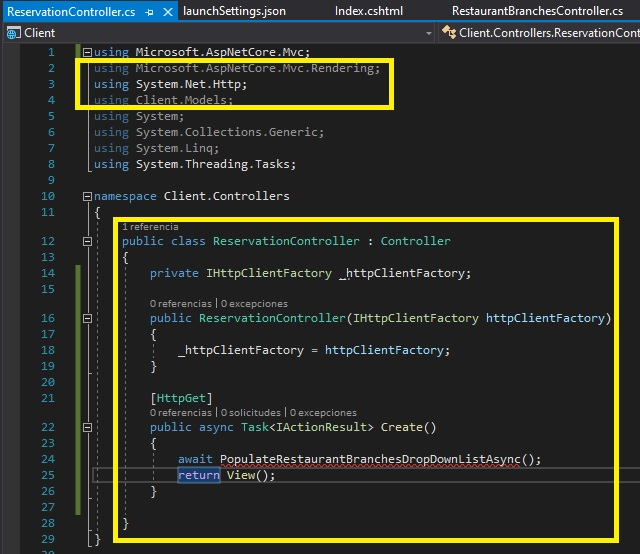

10. En la ventana **Restaurante - Microsoft Visual Studio**, en el Solution Explorer, en **Cliente**, en **Vistas**, expandir **Reserva**, y luego hacer clic en **Crear.cshtml**.

    >**Nota**: Examinar el contenido del archivo.

- La representación visual de la resolución del ejercicio se muestra en la siguiente imagen:

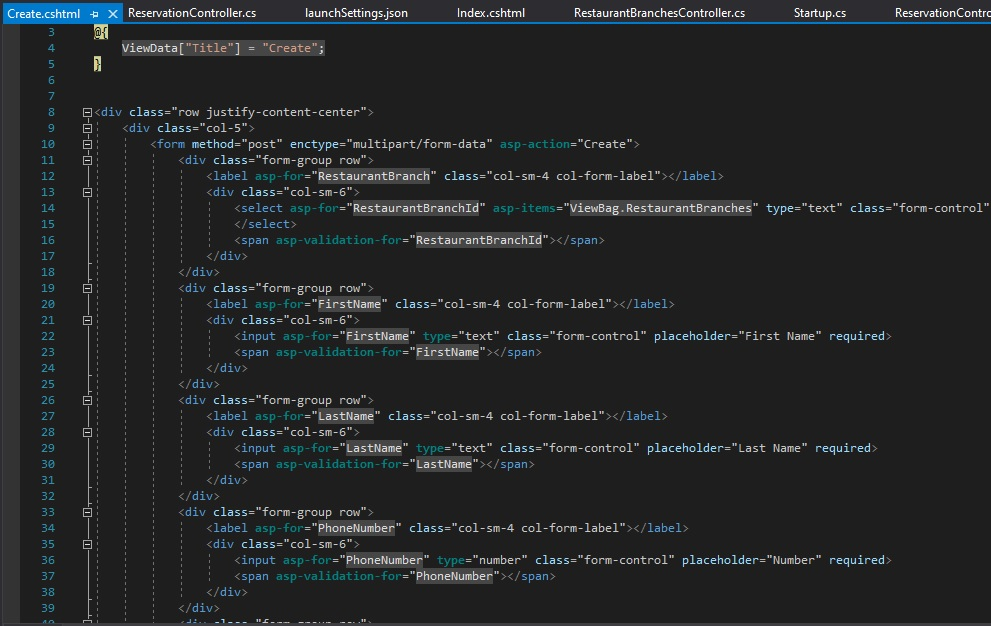

11. En la ventana **Restaurante - Microsoft Visual Studio**, en Solution Explorer, en **Controllers** haga clic en **ReservationController.cs**.

12. En la ventana de código **ReservationController.cs**, asegúrese de que el cursor se encuentra al final del bloque de código de acción **Create**, presione dos veces la tecla Enter y luego escriba el siguiente código:
  ```cs
       [HttpPost, ActionName("Create")]
       public async Task<IActionResult> CreatePostAsync(OrderTable orderTable)
       {
       }
  ```
13. En el bloque de código de acción **CreatePostAsync**, escribe el siguiente código:
  ```cs
       HttpClient httpclient = _httpClientFactory.CreateClient();
       HttpResponseMessage response = await httpclient.PostAsJsonAsync("http://localhost:54517/api/Reservation", orderTable);
       if (response.IsSuccessStatusCode)
       {
           OrderTable order = await response.Content.ReadAsAsync<OrderTable>();
           return RedirectToAction("ThankYouAsync", new { orderId = order.Id});
       }
       else
       {
           return View("Error");
       }
  ```
14. En la ventana del código **ReservationController.cs**, asegúrese de que el cursor esté al final del bloque de código de acción **CreatePostAsync**, pulse dos veces Intro y luego escriba el siguiente código:

  ```cs
       private async Task PopulateRestaurantBranchesDropDownListAsync()
       {
       }
  ```

15. En el bloque de código de acción **PopulateRestaurantBranchesDropDownListAsync**, escribe el siguiente código:
  ```cs
       HttpClient httpClient = _httpClientFactory.CreateClient();
       httpClient.BaseAddress = new Uri("http://localhost:54517");
       HttpResponseMessage response = await httpClient.GetAsync("api/RestaurantBranches");
       if (response.IsSuccessStatusCode)
       {
           IEnumerable<RestaurantBranch> restaurantBranches = await response.Content.ReadAsAsync<IEnumerable<RestaurantBranch>>();
           ViewBag.RestaurantBranches = new SelectList(restaurantBranches, "Id", "City");
       }
  ```

- La representación visual de la resolución del ejercicio se muestra en la siguiente imagen:

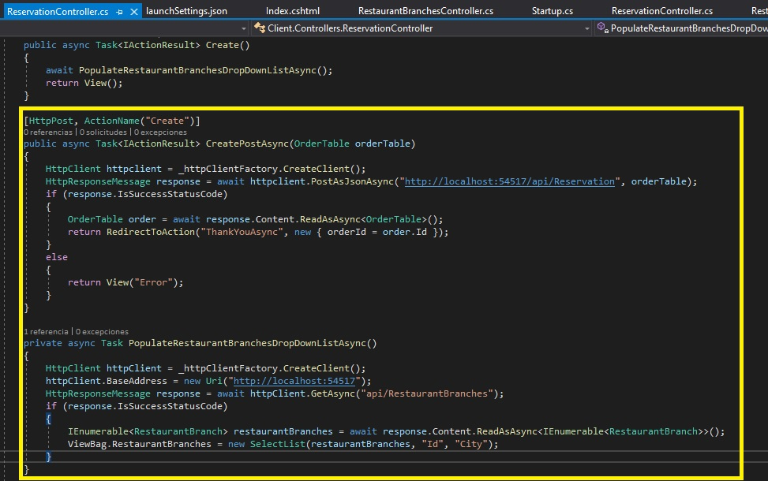

#### Tarea 4: Llamar a un método de obtención de la API Web con parámetro

1. En la ventana de código **ReservationController.cs**, asegúrese de que el cursor esté al final del bloque de código de acción **PopulateRestaurantBranchesDropDownListAsync**, pulse dos veces Intro y luego escriba el siguiente código:
  ```cs
       public async Task<IActionResult> ThankYouAsync(int orderId)
       {
       }
  ```
2. En el bloque de código de acción **Gracias**, escriba el siguiente código:
  ```cs
       HttpClient httpClient = _httpClientFactory.CreateClient();
       httpClient.BaseAddress = new Uri("http://localhost:54517");
       HttpResponseMessage response = await httpClient.GetAsync("api/Reservation/" + orderId);
       if (response.IsSuccessStatusCode)
       {
           OrderTable orderResult = await response.Content.ReadAsAsync<OrderTable>();
           return View(orderResult);
       }
       else
       {
           return View("Error");
       }
  ```

3.  En la ventana **Restaurante - Microsoft Visual Studio**, en el Solution Explorer, en **Cliente**, en **Vistas**, en **Reserva**, haga clic en **ThankYouAsync.cshtml**.

    >**Nota**: Examinar el contenido del archivo.

- La representación visual de la resolución del ejercicio se muestra en la siguiente imagen:

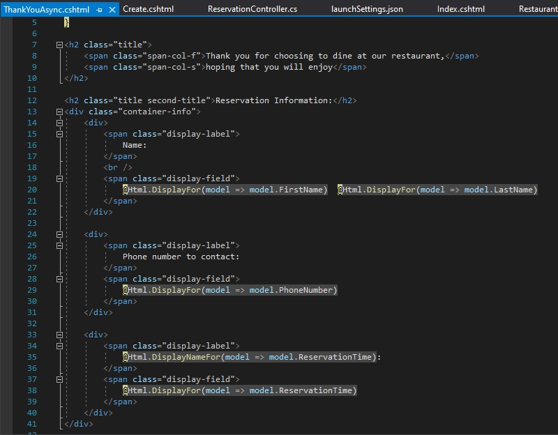

#### Tarea 5: Ejecutar la aplicación

1. En la ventana **Restaurante - Microsoft Visual Studio**, en el menú **Archivo**, haga clic en **Guardar todo**.

2. En el Explorador de soluciones, haga clic con el botón derecho del ratón en **Servidor**, y luego haga clic en **Configurar como proyecto de inicio**. 

3. En la ventana **Restaurante - Microsoft Visual Studio**, en el menú **DEBUG**, haga clic en **Iniciar sin depuración**.

4. En el Explorador de soluciones, haga clic con el botón derecho del ratón en **Cliente**, y luego haga clic en **Configurar como proyecto de inicio**. 

5. En la ventana **Restaurante - Microsoft Visual Studio**, en el menú **DEBUG**, haga clic en **Iniciar sin depuración**.

6. En la primera ventana de **Microsoft Edge**, en la barra de menú, haga clic en **Reserva**.


- La representación visual de la resolución del ejercicio se muestra en la siguiente imagen:

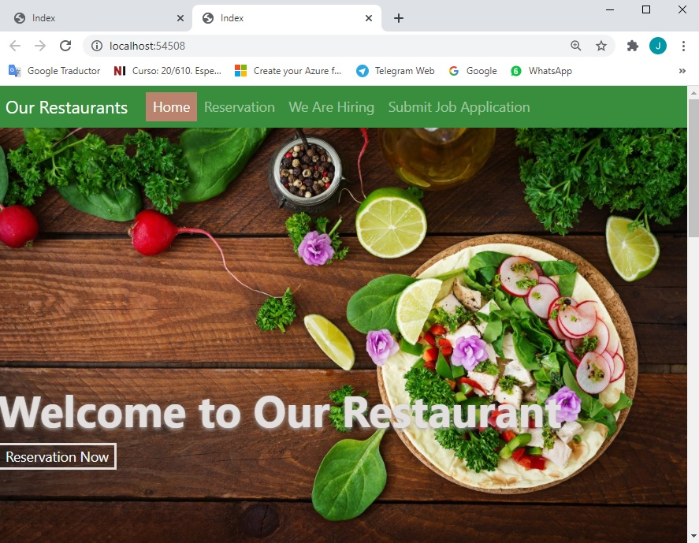

7. En **Reservación**, en el cuadro **Sucursal de un restaurante**, seleccione _&lt;Una sucursal de un restaurante de su elección&gt;,_

8. En **Reservación**, en la casilla **Nombre**, escriba _&lt;Un nombre de pila de su elección&gt;,_

9. En **Reservación**, en la casilla **Apellido**, escriba _&lt;Un apellido de su elección&gt;,_

10. En **Reservación**, en la casilla **Número de teléfono**, escriba _&lt;Un teléfono de su elección&gt;,_

11. En **Reservación**, en la casilla **Hora de la reservación**, elija _&lt;Una hora de la reservación de su elección&gt;,_

12. En **Reservación**, en el cuadro **Huéspedes de la cena**, escriba _&lt;Un huésped de la cena de su elección;,_, y luego haga clic en **Hacer una reservación**.

- La representación visual de la resolución del ejercicio se muestra en la siguiente imagen:

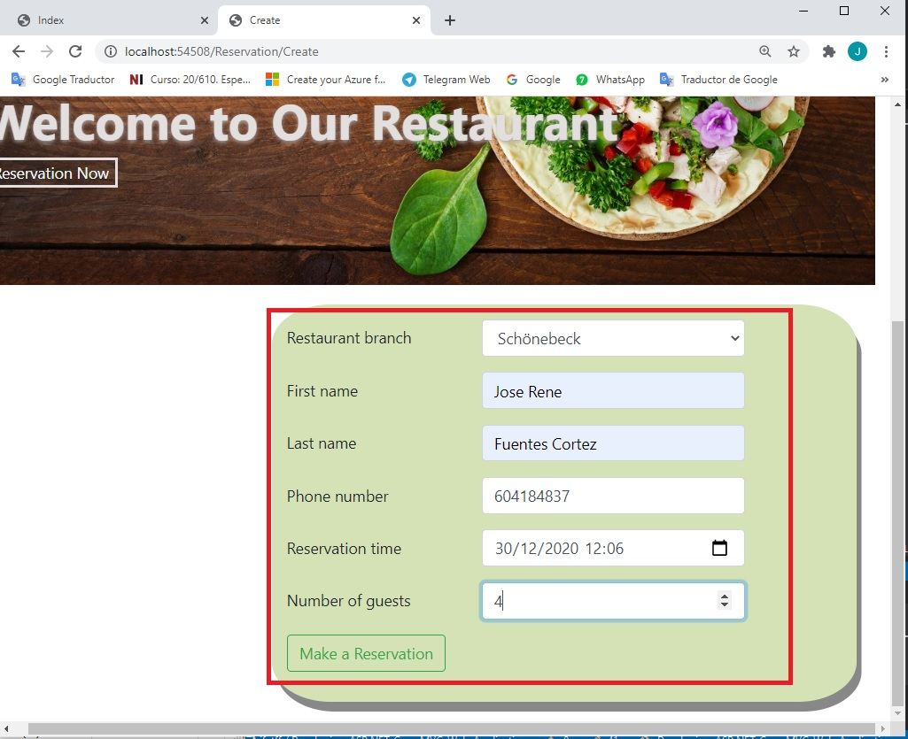

13. En Microsoft Edge, haz clic en **Cerrar**.

>**Resultados**: En este ejercicio, llamaste a un Web API usando la clase HttpClient.

### Ejercicio 3: Llamar a una API Web usando jQuery

#### Tarea 1: Llamar a un método de obtención de la API Web usando jQuery

1. En la ventana **Restaurante - Microsoft Visual Studio**, en el Explorador de Soluciones, en **Cliente**, expandir **wwwwroot**, hacer clic derecho **js**, apuntar a **Agregar**, y luego hacer clic en **Nuevo elemento**.

2. En el cuadro de diálogo **Agregar nuevo elemento - Cliente**, en el panel de navegación, en **Instalado**, expanda **Centro ASP.NET**, y luego haga clic en **Web**.

3. En el cuadro de diálogo **Agregar nuevo elemento - Cliente**, en el panel de resultados, haga clic en **Archivo JavaScript**.

- La representación visual de la resolución del ejercicio se muestra en la siguiente imagen:

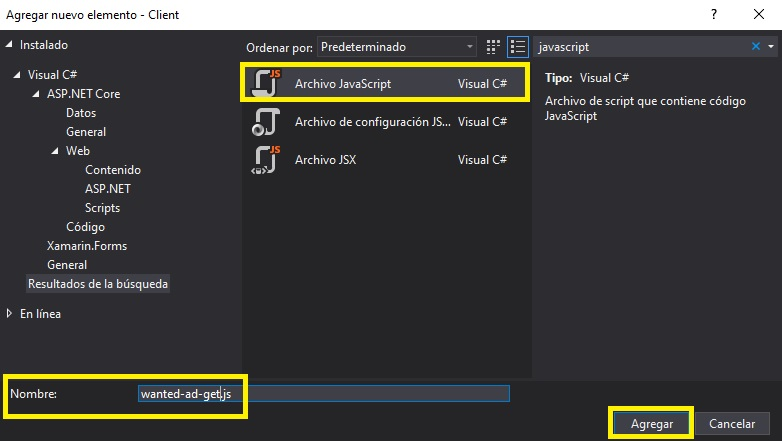

4. En el cuadro de diálogo **Agregar nuevo elemento - Cliente**, en el cuadro **Nombre**, escriba **quiero agregar un cliente**, y luego haga clic en **Agregar**.

5. En la ventana de código **wanted-ad-get.js**, escriba el siguiente código:
  ```cs
       $(function () {
          $.ajax({
              type: "GET",
              url: "http://localhost:54517/api/RestaurantWantedAd",
              contentType: "application/json; charset=utf-8",
              dataType: "json"
              }).done(function (data) {
              }).fail(function () {
                  alert('An error has occurred');
          });
       });
  ```

- La representación visual de la resolución del ejercicio se muestra en la siguiente imagen:

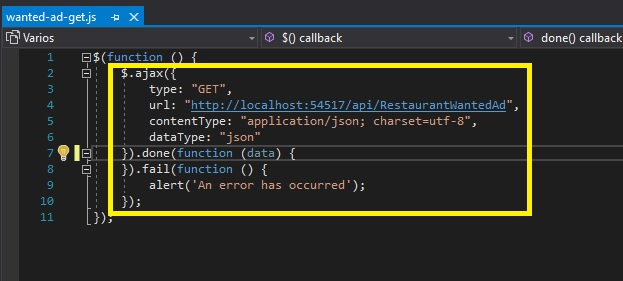

6. En la ventana del código **wanted-ad-get.js**, localiza el siguiente código:
  ```cs
       }).done(function (data) {
  ```

7. Asegúrese de que el cursor está después del signo **{** (abra la abrazadera), pulse Intro, y luego escriba el siguiente código:

  ```cs
        $.each(data, function (index, item) {
              var html = `<div class="photo-index-card-data">
                                <div class="image-wrapper">
                                      
                                </div>
                                <div class="display-picture-data">
                                      <h6 class="display-title">Job title:</h6>
                                      <h6>${item.jobTitle}</h6>
                                      <h6 class="display-title">Hourly payment:</h6>
                                      <h6>$${item.pricePerHour}</h6>
                                      <h6 class="display-title">Job description:</h6>
                                      <h6>${item.jobDescription}</h6>
                                </div>
                          </div>`;
                $('.container').append(html);
        });
        $('.photo-display-img').attr('src', '/images/white-plate.jpg');
  ```

- La representación visual de la resolución del ejercicio se muestra en la siguiente imagen:

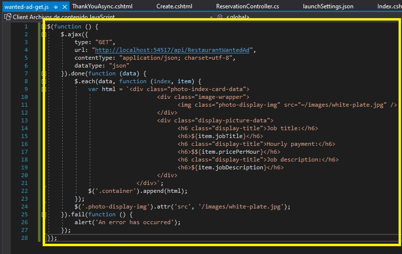

8. En la ventana **Restaurante - Microsoft Visual Studio**, en el Explorador de Soluciones, en **Cliente**, en **Vistas**, expandir **WantedAd**, y luego hacer clic en **Index.cshtml**.

9. En la ventana de código **Index.cshtml**, localice el siguiente código:
  ```cs
       <div class="container">
       </div>
  ```
10. Ponga el cursor al final del código localizado, presione Enter dos veces, y luego escriba el siguiente código:
  ```cs
       @section Scripts {
           <script src="~/js/wanted-ad-get.js"></script>
       }
  ```

- La representación visual de la resolución del ejercicio se muestra en la siguiente imagen:

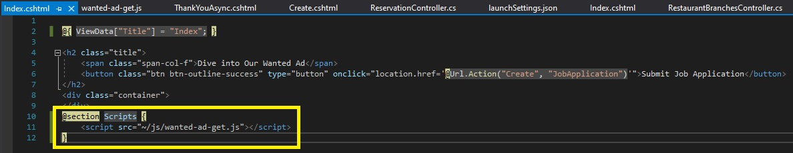

#### Tarea 2: Ejecutar la aplicación

1. En la ventana **Restaurante - Microsoft Visual Studio**, en el menú **Archivo**, haga clic en **Guardar todo**.

2. En el Explorador de soluciones, haga clic con el botón derecho del ratón en **Servidor**, y luego haga clic en **Configurar como proyecto de inicio**. 

- La representación visual de la resolución del ejercicio se muestra en la siguiente imagen:

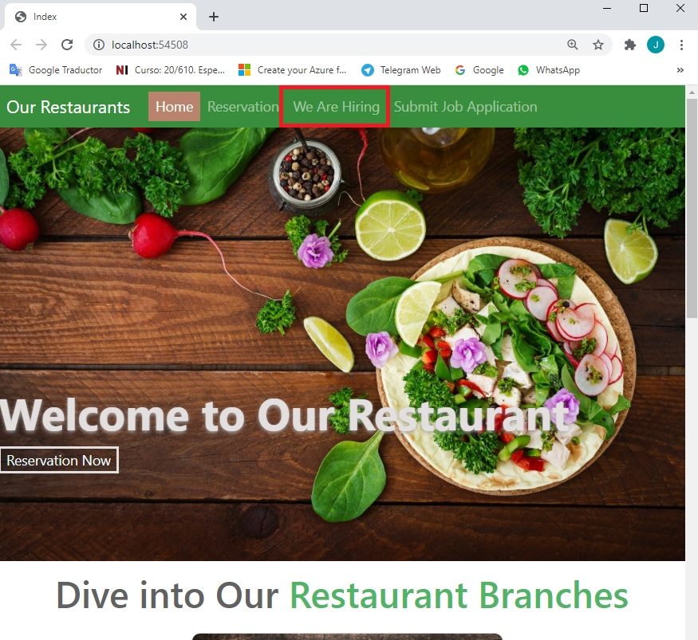

3. En la ventana **Restaurante - Microsoft Visual Studio**, en el menú **DEBUG**, haga clic en **Iniciar sin depuración**.

4. En el Explorador de soluciones, haga clic con el botón derecho del ratón en **Cliente**, y luego haga clic en **Configurar como proyecto de inicio**. 

5. En la ventana **Restaurante - Microsoft Visual Studio**, en el menú **DEBUG**, haga clic en **Iniciar sin depuración**.

6. En la primera ventana de **Microsoft Edge**, en la barra de menú, haga clic en **Estamos contratando**.

    >**Nota**: El navegador muestra los trabajos que se requieren en un restaurante.

- La representación visual de la resolución del ejercicio se muestra en la siguiente imagen:

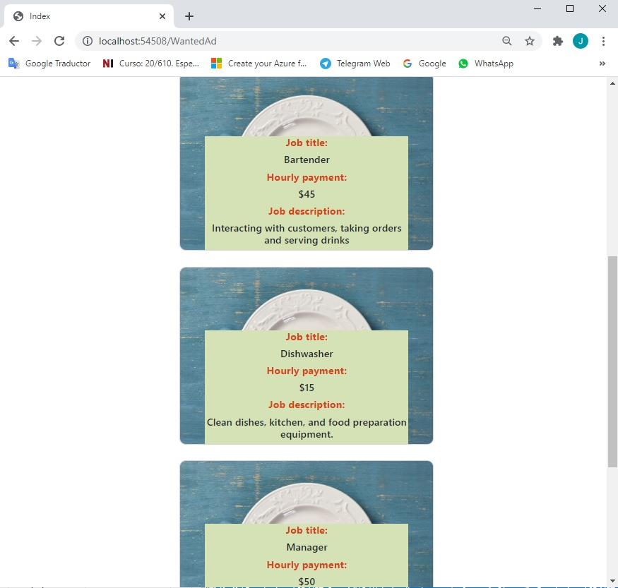

7. En Microsoft Edge, haz clic en **Cerrar**.

#### Tarea 3: Llamar a un método de obtención de la API Web usando HttpClient

1. En la ventana **Restaurante - Microsoft Visual Studio**, en el Explorador de soluciones, en **Cliente**, haga clic con el botón derecho del ratón en **Controllers**, apunte a **Agregar**, y luego haga clic en **Controller**.

2. En el cuadro de diálogo **Agregar andamiaje**, haga clic en **Controller MVC - Vaciar**, y luego haga clic en **Agregar**.

3. En el cuadro de diálogo **Añadir Controller MVC vacío**, en el cuadro **Nombre del Controller**, escriba **Controller de aplicaciones de trabajo** y, a continuación, haga clic en **Añadir**.

- La representación visual de la resolución del ejercicio se muestra en la siguiente imagen:

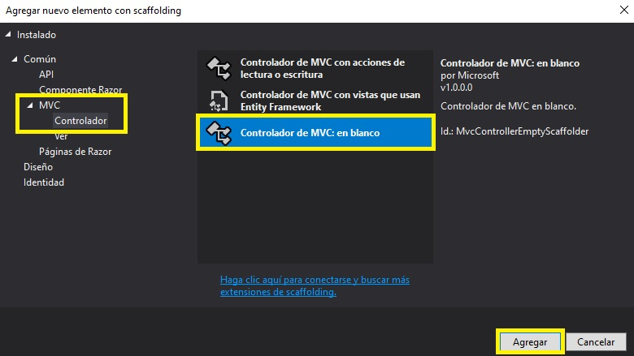

4. En la ventana de código **JobApplicationController.cs**, localice el siguiente código:
  ```cs
       using Microsoft.AspNetCore.Mvc;
  ```
5. Asegúrate de que el cursor está al final del espacio de nombres **Microsoft.AspNetCore.Mvc**, presiona Enter, y luego escribe el siguiente código:
  ```cs
       using Microsoft.AspNetCore.Mvc.Rendering;
       using System.Net.Http;
       using Client.Models;
  ```
6. En la ventana del código **JobApplicationController.cs**, seleccione el siguiente código:
  ```cs
       public IActionResult Index()
       {
          return View();
       }
  ```

- La representación visual de la resolución del ejercicio se muestra en la siguiente imagen:

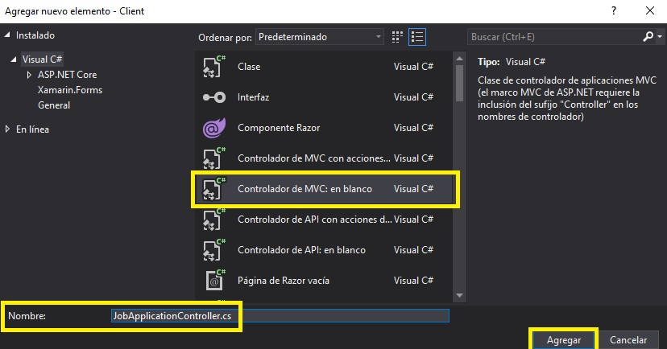


7. Reemplazar el código seleccionado por el siguiente código:
  ```cs
       IHttpClientFactory privado _httpClientFactory;

       public JobApplicationController(IHttpClientFactory httpClientFactory)
       {
             _httpClientFactory = httpClientFactory;
       }
  ```
8. Asegúrate de que el cursor está al final del bloque de código de construcción ****, presiona Enter dos veces, y luego escribe el siguiente código:
  ```cs
       [HttpGet]
       public async Task<IActionResult> Create()
       {JobApplicationController
       }
  ```
9. En el bloque de código de acción **Crear**, escriba el siguiente código:
  ```cs
       await PopulateEmployeeRequirementsDropDownListAsync();
       return View();
  ```

- La representación visual de la resolución del ejercicio se muestra en la siguiente imagen:

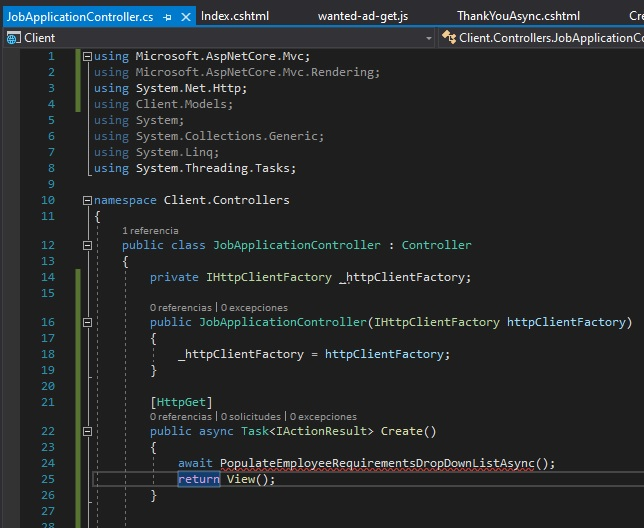


10.  En la ventana **Restaurante - Microsoft Visual Studio**, en el Solution Explorer, en **Cliente**, en **Vistas**, expandir **JobApplication**, y luego hacer clic en **Create.cshtml**.

     >**Nota**: Examinar el contenido del archivo.

- La representación visual de la resolución del ejercicio se muestra en la siguiente imagen:

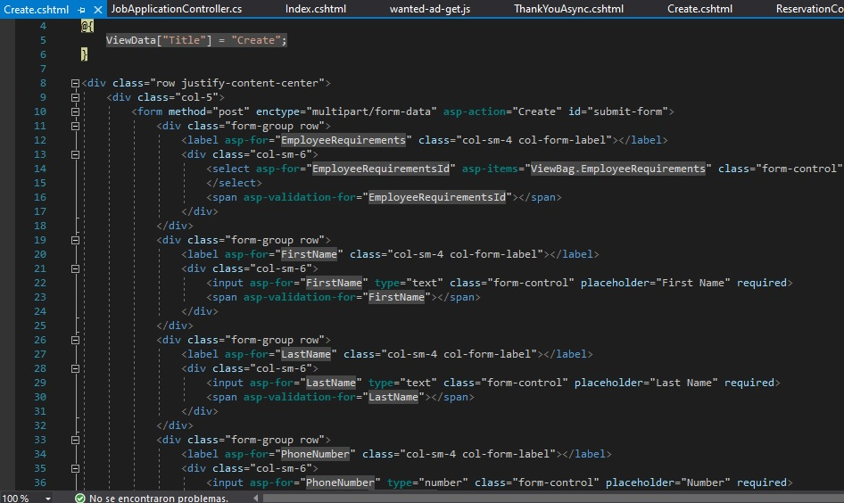

11. En la ventana **Restaurante - Microsoft Visual Studio**, en Solution Explorer, en **Cliente**, en **Controllers** haga clic en **JobApplicationController.cs**.

12. En la ventana de código **JobApplicationController.cs**, asegúrese de que el cursor está al final del bloque de código de acción **Create**, pulse Intro dos veces, y luego escriba el siguiente código:
  ```cs
       private async Task PopulateEmployeeRequiresDropDownListAsync()
       {
       }
  ```

13. En el bloque de código de acción **PopulateRestaurantBranchesDropDownListAsync**, escribe el siguiente código:
  ```cs
       HttpClient httpClient = _httpClientFactory.CreateClient();
       httpClient.BaseAddress = new Uri("http://localhost:54517");
       HttpResponseMessage response = await httpClient.GetAsync("api/RestaurantWantedAd");
       if (response.IsSuccessStatusCode)
       {
           IEnumerable<EmployeeRequirements> employeeRequirements = await response.Content.ReadAsAsync<IEnumerable<EmployeeRequirements>>();
           ViewBag.EmployeeRequirements = new SelectList(employeeRequirements, "Id", "JobTitle");
       }
  ```


14. En la ventana de código **JobApplicationController.cs**, asegúrese de que el cursor esté al final del bloque de código de acción **PopulateEmployeeRequirementsDropDownListAsync**, pulse dos veces Intro y luego escriba el siguiente código:
  ```cs
       public IActionResult ThankYou()
       {
       }
  ```
15. En el bloque de código de acción **Gracias**, escriba el siguiente código:
  ```cs
       return View();
  ```
- La representación visual de la resolución del ejercicio se muestra en la siguiente imagen:

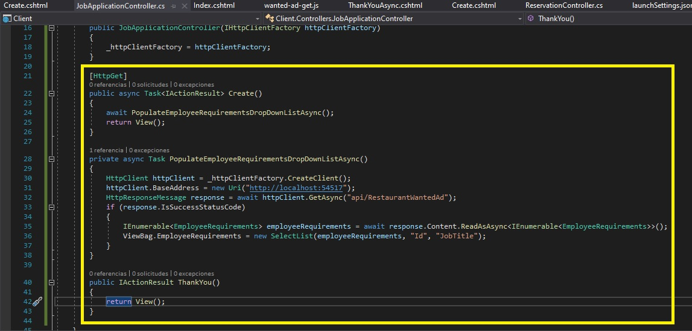

16.  En la ventana **Restaurante - Microsoft Visual Studio**, en el Solution Explorer, en **Cliente**, en **Vistas**, expandir **JobApplication**, y luego hacer clic en **ThankYou.cshtml**.

     >**Nota**: Examinar el contenido del archivo.

- La representación visual de la resolución del ejercicio se muestra en la siguiente imagen:

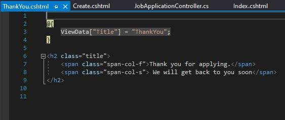

#### Tarea 4: Llamar a un método de Web API Post usando jQuery

1. En la ventana **Restaurante - Microsoft Visual Studio**, en el Explorador de soluciones, en **Cliente**, en **wwwwroot**, haga clic con el botón derecho del ratón en **js**, apunte a **Agregar**, y luego haga clic en **Nuevo elemento**.

2. En el cuadro de diálogo **Agregar nuevo elemento - Cliente**, en el panel de navegación, en **Instalado**, amplíe **Centro ASP.NET**, y luego haga clic en **Web**.

3. En el cuadro de diálogo **Agregar nuevo elemento - Cliente**, en el panel de resultados, haga clic en **Archivo JavaScript**.

- La representación visual de la resolución del ejercicio se muestra en la siguiente imagen:

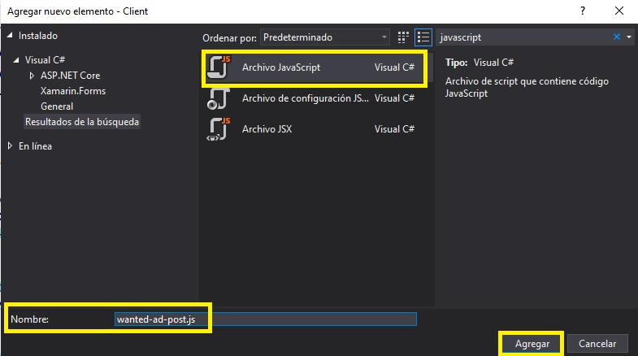

4. En el cuadro de diálogo **Agregar nuevo elemento - Cliente**, en el cuadro **Nombre**, escriba **anuncio de correo**, y luego haga clic en **Agregar**.

5. En la ventana de código **wanted-ad-post.js**, escriba el siguiente código:
  ```cs
       $(function() {
             $("#btn-post").click(function (e) {
                 if ($('#submit-form').valid()) {
                     var formData = {};
                     $('#submit-form').serializeArray().map(function (item) {
                         item.name = item.name[0].toLowerCase() + item.name.slice(1);
                         if (formData[item.name]) {
                             if (formData[item.name] === "string") {
                                 formData[item.name] = [formData[item.name]];
                             }
                             formData[item.name].push(item.value);
                         } else {
                             formData[item.name] = item.value;
                         }
                     });
                     e.preventDefault();
                     $.ajax({
                         type: "POST",
                         url: "http://localhost:54517/api/job",
                         data: JSON.stringify(formData),
                         contentType: "application/json;charset=utf-8"
                     }).done(function () {
                         location.href = 'http://localhost:54508/JobApplication/ThankYou';
                     }).fail(function () {
                         alert('An error has occurred');
                 });
              }
          });
       });
  ```
  
- La representación visual de la resolución del ejercicio se muestra en la siguiente imagen:

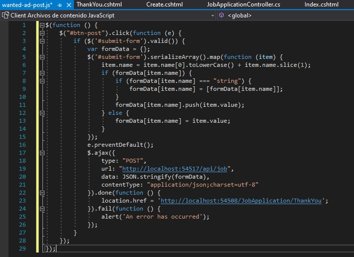

6. En la ventana **Restaurante - Microsoft Visual Studio**, en Solution Explorer, en **Cliente**, en **Vistas**, en **Aplicación de trabajo**, haga clic en **Crear.cshtml**.

7. En la ventana de código **Create.cshtml**, localice el siguiente código:
  ```cs
             </form>
          </div>
       </div>
  ```
8. Ponga el cursor al final del código localizado, presione Enter dos veces, y luego escriba el siguiente código:
  ```cs
       @section Scripts{
             <script src="~/node_modules/jquery-validation/dist/jquery.validate.min.js"></script>
             <script src="~/node_modules/jquery-validation-unobtrusive/dist/jquery.validate.unobtrusive.min.js"></script>
             <script src="~/js/wanted-ad-post.js"></script>
       }
  ```


- La representación visual de la resolución del ejercicio se muestra en la siguiente imagen:

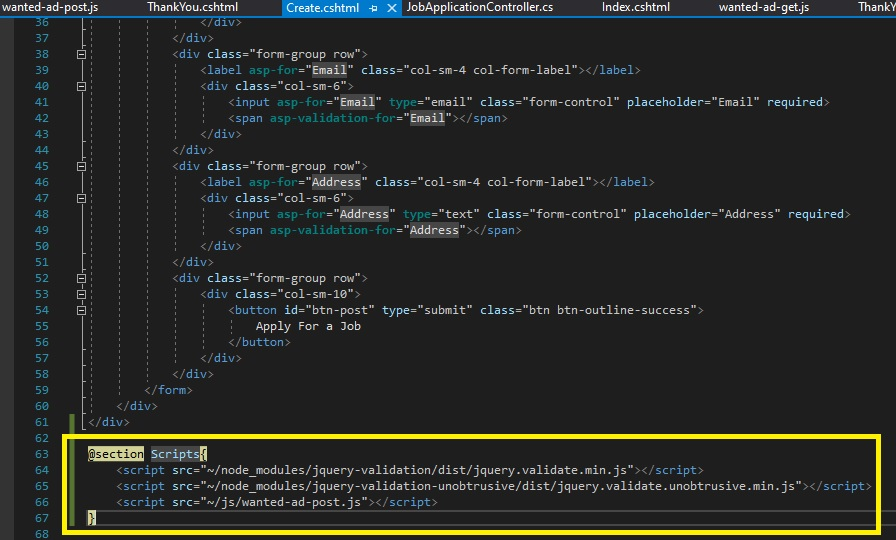

#### Tarea 5: Ejecutar la aplicación

1. En la ventana **Restaurante - Microsoft Visual Studio**, en el menú **Archivo**, haga clic en **Guardar todo**.

2. En el Explorador de soluciones, haga clic con el botón derecho del ratón en **Servidor**, y luego haga clic en **Configurar como proyecto de inicio**. 

3. En la ventana **Restaurante - Microsoft Visual Studio**, en el menú **DEBUG**, haga clic en **Iniciar sin depuración**.

4. En el Explorador de soluciones, haga clic con el botón derecho del ratón en **Cliente**, y luego haga clic en **Configurar como proyecto de inicio**. 

5. En la ventana **Restaurante - Microsoft Visual Studio**, en el menú **DEBUG**, haga clic en **Iniciar sin depuración**.

- La representación visual de la resolución del ejercicio se muestra en la siguiente imagen:


6. En la primera ventana **Microsoft Edge**, en la barra de menú, haga clic en **Submit Job Application**.

7. En **Submit Job Application**, en la casilla **Job title**, seleccione _&lt;Un título de trabajo de su elección&gt;,_

8. En **Submit Job Application**, en la casilla **First name**, escriba _&lt;Un nombre de pila de su elección&gt;,_

9. En **Submit Job Application**, en la casilla **Last name**, escriba _&lt;Un apellido de su elección&gt;,_

10. En **Submit Job Application**, en la casilla **Phone number**, escriba _&lt;Un teléfono de su elección&gt;,_

11. En **Submit Job Application**, en la casilla **Email**, escriba _&lt;Una dirección de correo electrónico de su elección&gt;,_

12. En **Submit Job Application**, en la casilla **Address**, escriba _&lt;Una dirección de su elección&gt;,_ y luego haga clic en **Apply For a Job**.

- La representación visual de la resolución del ejercicio se muestra en la siguiente imagen:

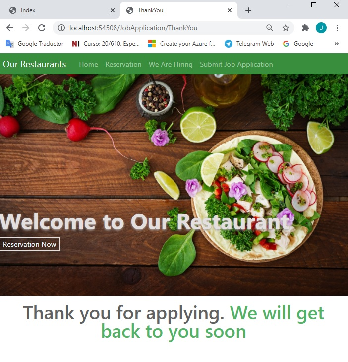

13. En Microsoft Edge, haga clic en **Cerrar**.


14. En la ventana **Restaurante - Microsoft Visual Studio**, en el menú **Archivo**, haga clic en **Salir**.

>**Resultados**: En este ejercicio, permitió a los usuarios ver los anuncios de búsqueda para encontrar un nuevo trabajo, y les permitió solicitar un empleo. 


