# Módulo 14: Alojamiento y Despliegue

Siempre cuando un camino comienza con  *[Repository Root]*, reemplacelo con el camino absoluto en el que el repositorio 20486 reside. Por ejemplo, si tu has cloneado o extraido el repositorio 20486 en la carpeta **C:\Users\John Doe\Downloads\20486**, cambiar la ruta de: **[Repository Root]\AllFiles\20486D\Mod01** a **C:\Users\John Doe\Downloads\20486\AllFiles\20486D\Mod01**.

Fichero de Instrucciones: Instructions\20486D_MOD14_LAK.md

**Información:**

1. **Nombres y apellidos:** José René Fuentes Cutz
2. **Fecha:** 24 de Diciembre 2020.
3. **Resumen del Ejercicio:** Este laboratorio consta de 3 ejercicios:
- En el Primer ejercicio nos ayuda a  crear Controllers MVC que implementen acciones comunes para la clase de modelo **City** de la aplicación.
- En el Segundo ejercicio nos ayuda a entender como podemos registrar nuevas rutas personalizadas en el canal de solicitud de Controllers de la aplicación..
- En el Tercer ejercicio creamos una clase de filtro de acción que registre los detalles de las acciones, los Controllers y los parámetros en un archivo externo cada vez que se llame a una acción..

4. **Dificultad o problemas presentados y como se resolvieron:** Ninguno.

**NOTA**: Si no hay descripcion de problemas o dificultades, y al yo descargar el código para realizar la comprobacion y el código no funcionar, el resultado de la califaciación del laboratorio será afectado.

---


# Lección 2: Despliegue a Microsoft Azure

### Demonstration: Cómo desplegar una aplicación web en Microsoft Azure

#### Pasos de preparación 

1. Asegúrate de que has clonado el directorio **20486D** de GitHub. Contiene los segmentos de código para los laboratorios y demostraciones de este curso. (https://github.com/MicrosoftLearning/20486D-DevelopingASPNETMVCWebApplications/tree/master/Allfiles)

2. Asegúrate de que tienes una cuenta Microsoft Azure.

#### Pasos de demostración 

1. Inicie Microsoft Visual Studio 2017.

2. En la ventana **Página de inicio - Microsoft Visual Studio**, en el menú **Archivo**, apunta a **Nuevo**, y luego haz clic en **Proyecto**.

3. En el cuadro de diálogo **Nuevo Proyecto**, en el panel izquierdo, expandir **Instalado**, expandir **Visual C#**, y luego hacer clic en **Nube**.

- La representación visual de la resolución del ejercicio se muestra en la siguiente imagen:

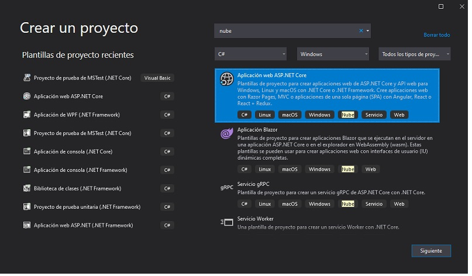

4. En el cuadro de diálogo **Nuevo Proyecto**, en el panel de resultados, haga clic en **Aplicación Web Principal de ASP.NET**.

- La representación visual de la resolución del ejercicio se muestra en la siguiente imagen:

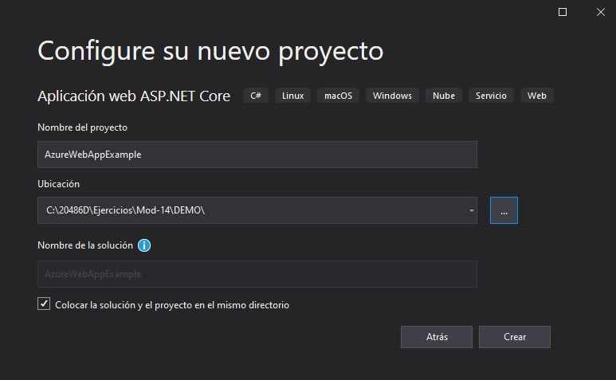


5. En el cuadro **Nombre**, escriba **AzureWebAppApple-Ejemplo**.

- La representación visual de la resolución del ejercicio se muestra en la siguiente imagen:

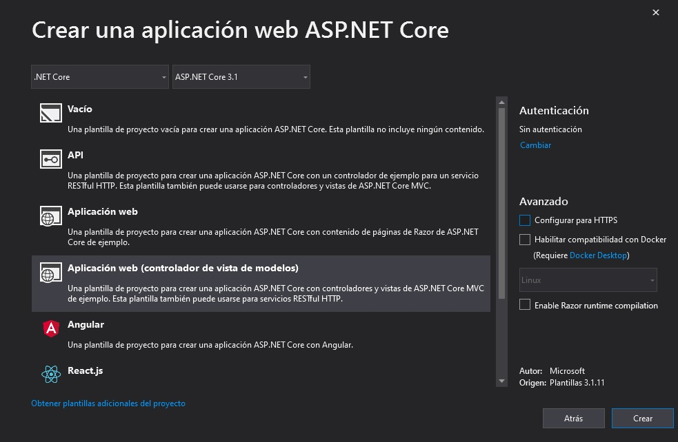

6. En la casilla **Localización**, escriba **[Repository Root]\Allfiles\Mod14\Democode\01_AzureWebAppExample_Begin**, y luego haga clic en **OK**.

7. En el cuadro de diálogo **Nueva Aplicación Web Principal ASP.NET - AzureWebAppExample**, en el panel de resultados, haga clic en **Aplicación Web (Modelo-Vista-Controlador)**, asegúrese de que las casillas de verificación están desmarcadas, y luego haga clic en **OK**.

8. En la ventana **AzureWebAppExample - Microsoft Visual Studio**, en el menú **DEBUG**, haga clic en **Iniciar sin depuración**. 

    >**Nota**: El navegador muestra la página de inicio por defecto.

- La representación visual de la resolución del ejercicio se muestra en la siguiente imagen:

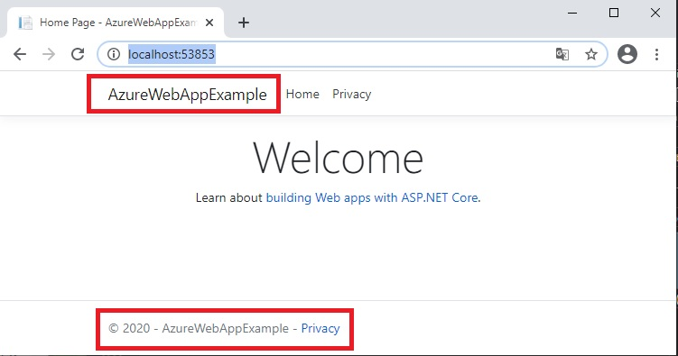

9. En Microsoft Edge, haga clic en **Cerrar**.

10. En la ventana **AzureWebAppExample - Microsoft Visual Studio**, en Solution Explorer, haga clic con el botón derecho **AzureWebAppexample**, y luego haga clic en **Publish.**

- Pasos para la creación de un servicio en Azure. Primero escogemos el tipo, como se muestra a continuación:

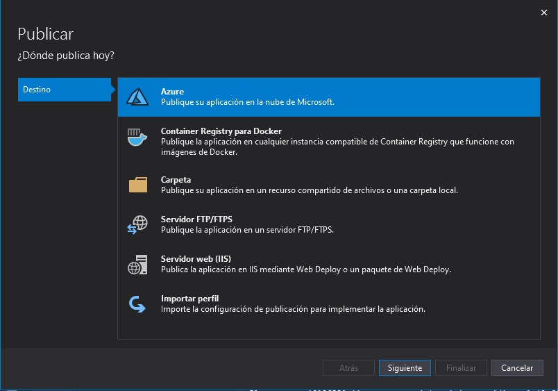

- Escogiendo el destino específico de la aplicación a crear tal como se muestra en la siguiente imagen:

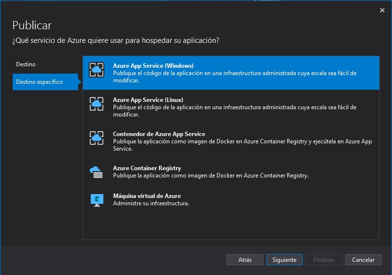

11. En el cuadro de diálogo **Seleccionar un objetivo de publicación**, en el panel izquierdo, haga clic en **Servicio de aplicación**.

- La representación visual de la resolución del ejercicio se muestra en la siguiente imagen:

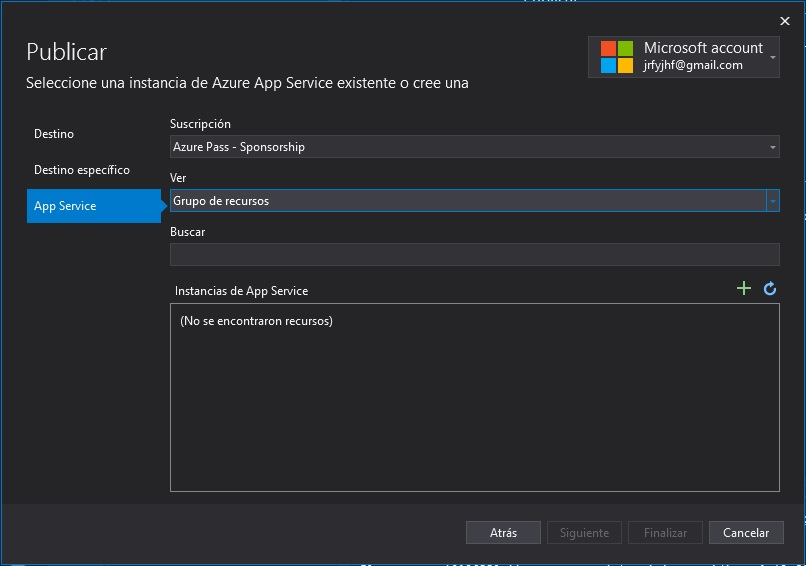

12. En el cuadro de diálogo **Seleccione un objetivo de publicación**, en el panel de resultados, haga clic en **Crear nuevo** y, a continuación, haga clic en **Crear perfil**.

- La representación visual de la resolución del ejercicio se muestra en la siguiente imagen:

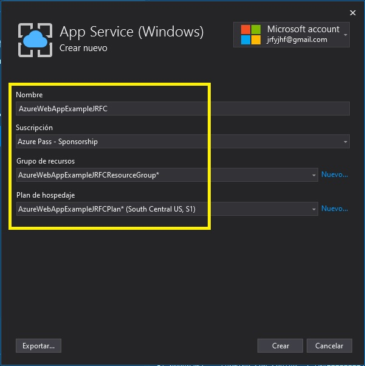

13. En el cuadro de diálogo **Crear servicio de aplicaciones**, haga clic en **Iniciar sesión**.

    >**Nota**: En caso de que ya hayas iniciado sesión, no verás este cuadro de diálogo. En ese caso, ve al paso 16.

- La representación visual de la resolución del ejercicio se muestra en la siguiente imagen:

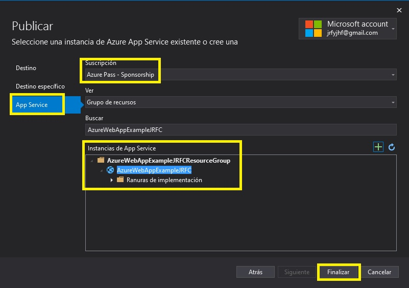

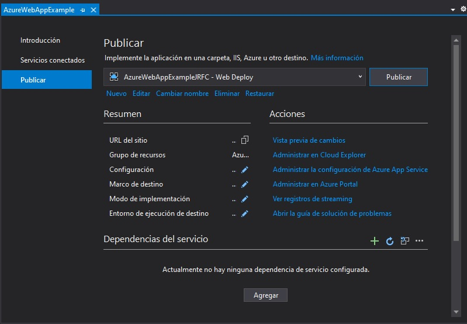

Publicación del servicio en internet por medio del portal Azure:
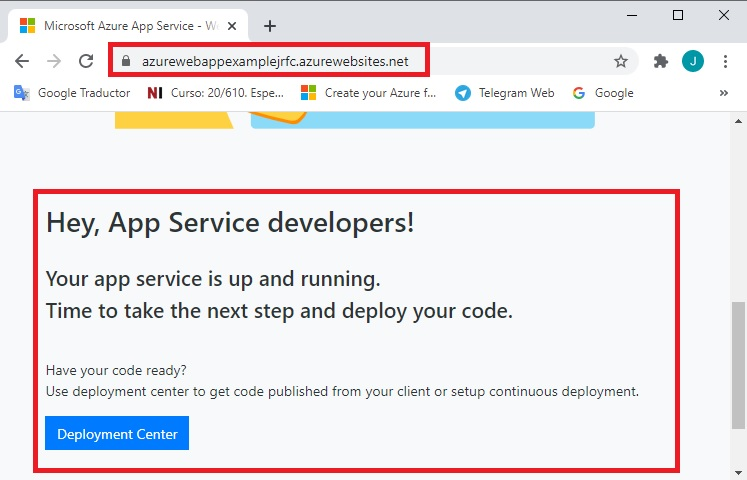

14. En el cuadro de diálogo **Inicie sesión en su cuenta**, introduzca la dirección de correo electrónico, el número de teléfono o la identificación de Skype de su cuenta Azure y, a continuación, haga clic en **Siguiente**. 

15. En el cuadro de diálogo **Inicie sesión en su cuenta**, escriba **Contraseña**, y luego haga clic en **Inicie sesión**.

16. En el cuadro de diálogo **Crear servicio de aplicaciones**, en el cuadro **Nombre de la aplicación**, escriba **AzureWebAppExample{unique name}**.  

>**Nota**: El nombre debe ser único. Puede añadir su nombre, apellido o fecha de nacimiento al nombre actual.

17. En el cuadro de diálogo **Crear servicio de aplicaciones**, debajo del cuadro **Grupo de recursos**, haga clic en **Nuevo**. 

18. En el cuadro **Nombre del grupo de recursos**, escriba **AzureWebAppExample** y, a continuación, haga clic en **OK**.

- La representación visual de la resolución del ejercicio se muestra en la siguiente imagen:

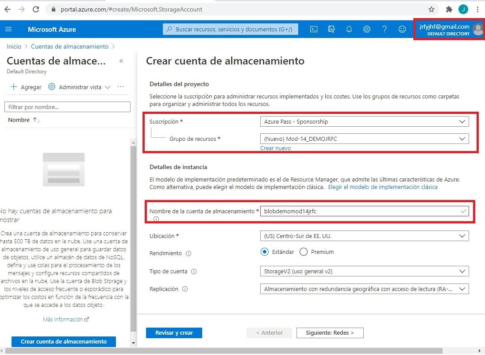

19. En el cuadro de diálogo **Crear servicio de aplicaciones**, debajo del cuadro **Plan de alojamiento**, haga clic en **Nuevo**. 

20. En el cuadro de diálogo **Configurar plan de hospedaje**, en el cuadro **Plan de servicio de aplicación**, escriba **AzureWebAppExample{unique name}**, y luego haga clic en **OK**. 

- La representación visual de la resolución del ejercicio se muestra en la siguiente imagen:

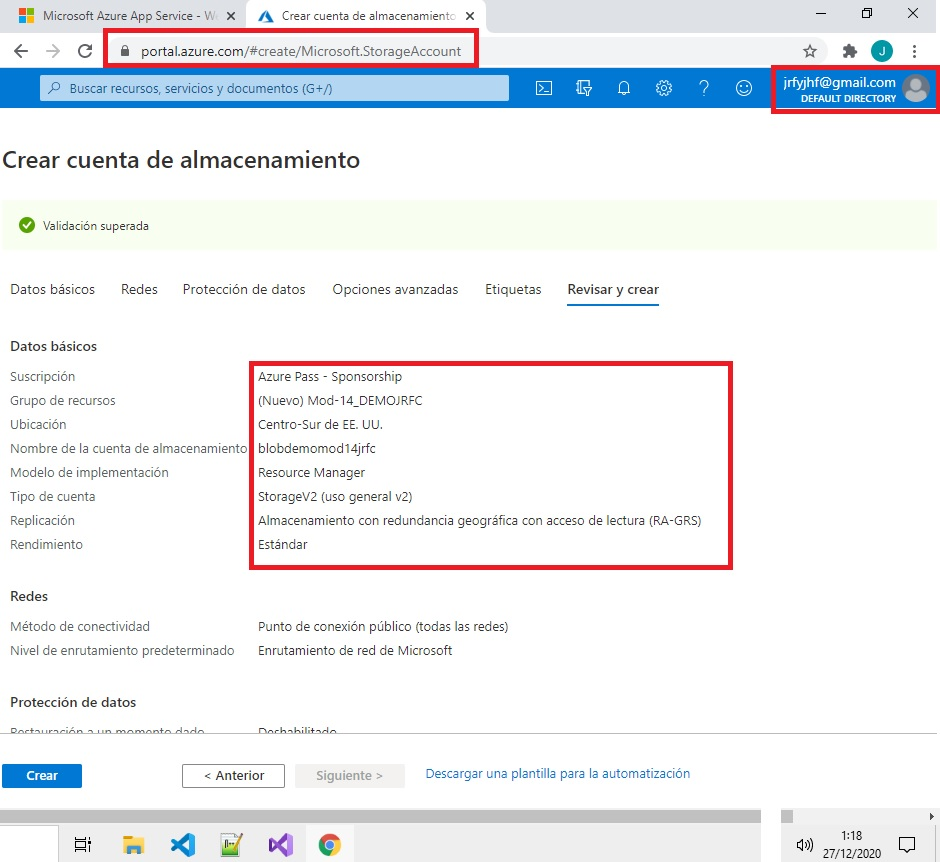

21. En el cuadro de diálogo **Crear servicio de aplicaciones**, haga clic en **Crear**.

- La representación visual de la resolución del ejercicio se muestra en la siguiente imagen:

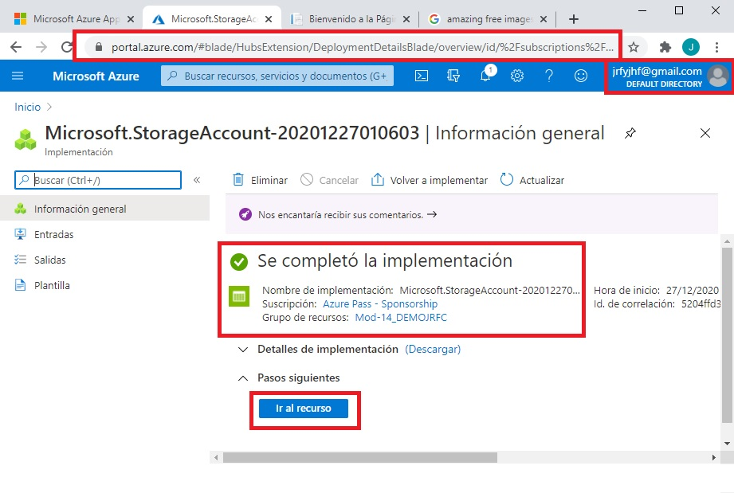

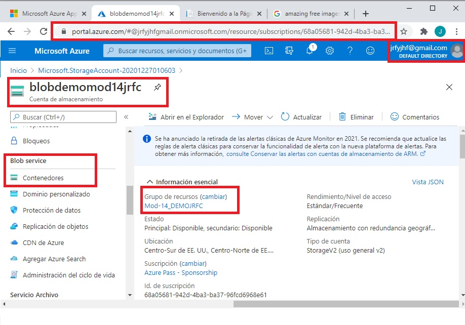

22. En la ventana **Publicar**, haga clic en **Publicar**.

- La representación visual de la resolución del ejercicio se muestra en la siguiente imagen:


    >**Nota**: El navegador muestra la página de inicio, y la URL es: http://azurewebapp{unique name}.azurewebsites.net/

23. En Microsoft Edge, en la barra de direcciones, escriba **http://portal.azure.com**, y luego presione Enter.
    >**Nota**: En caso de que ya hayas iniciado sesión, no verás el cuadro de diálogo **Iniciar sesión**. En ese caso, vaya al paso 26.

- La representación visual de la resolución del ejercicio se muestra en la siguiente imagen:

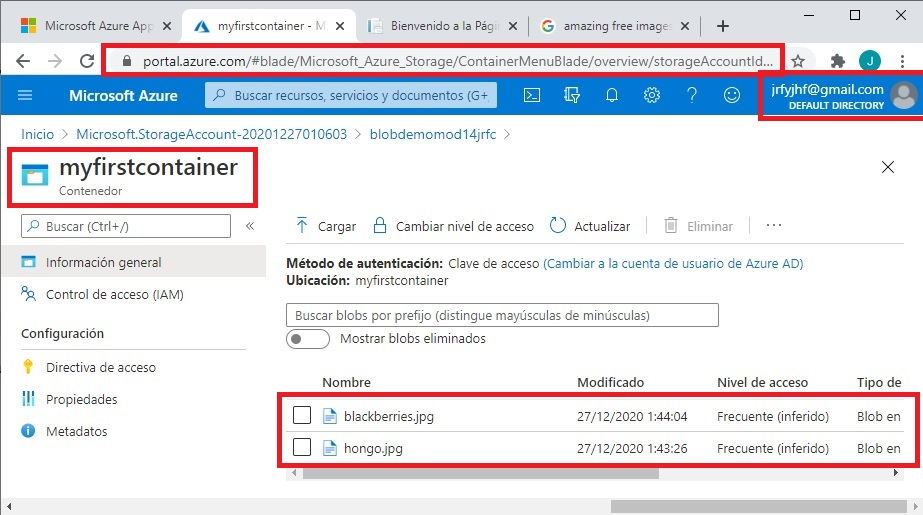

24. En el cuadro de diálogo **Inicie sesión en su cuenta**, escriba la dirección de correo electrónico, el número de teléfono o el ID de Skype de su cuenta Azure, y luego haga clic en **Siguiente**. 

25. En el cuadro de diálogo **Iniciar sesión**, escriba **Contraseña**, y luego haga clic en **Iniciar sesión**. 

    >**Nota**: El explorador muestra el tablero de mandos que contiene el servicio de aplicación y el plan de servicio de aplicación.

26. En Microsoft Edge, haga clic en el servicio de aplicaciones **AzureWebApp{unique name}**.

    >**Nota**: Ver los detalles en la ventana de resumen.

27. En Microsoft Edge, haga clic en **Cerrar**.

28. En **AzureWebAppExample - Microsoft Visual Studio**, en Solution Explorer, expandir **Vistas**, expandir **Casa**, y luego hacer clic en **Index.cshtml**.

29. En la ventana **Index.cshtml**, borra todo el contenido.

30. En la ventana **Index.cshtml**, escriba el siguiente código:

```cs
    @{
        ViewData["Title"] = "Home Page";
    }

    <h2> This is a ASP .NET web application deployed on Azure App Service </h2>
  ```

- La representación visual de la resolución del ejercicio se muestra en la siguiente imagen:

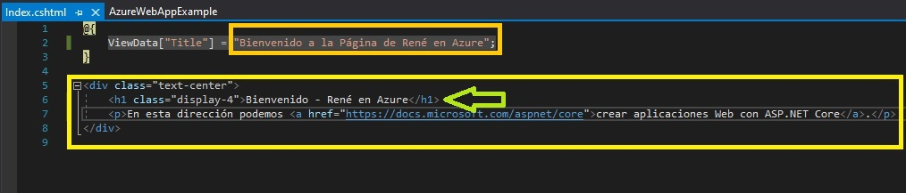

Antes de eso haremos algunos cambios en el código de la aplicación para que tenga un mejor contenido personalizado.
Primero cambiamos el nombre, título y más en la aplicación:


Vizualizamos los cambios hechos en internet:

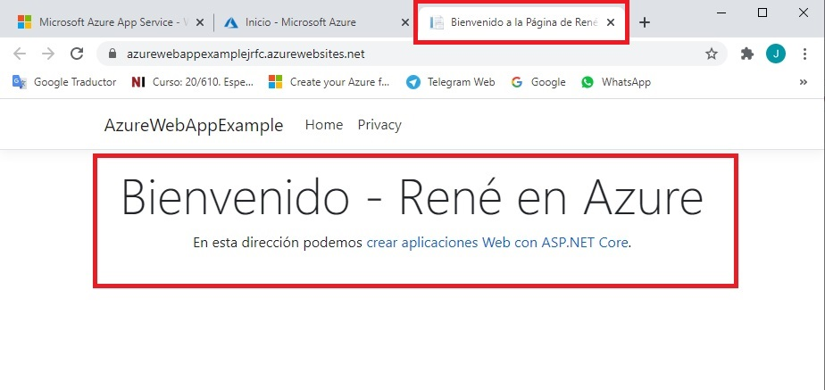

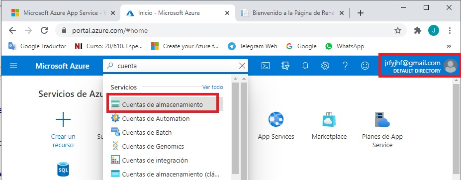

31. En la ventana de **AzureWebAppExample - Microsoft Visual Studio**, en el menú **FILE**, haga clic en **Save All**.

32. En la ventana **AzureWebAppExample - Microsoft Visual Studio**, en Solution Explorer, haga clic con el botón derecho en **AzureWebAppExample**, y luego haga clic en **Publish**.

33. En la ventana **Publicar**, haz clic en **Publicar**.

> **Nota**: El navegador muestra:  **Esta es una aplicación web ASP .NET desplegada en Azure App Service**. 

- Inicio de la aplicación creada en el portal de Azure:


34. En Microsoft Edge, haga clic en **Cerrar**.

35. En la ventana **AzureWebAppExample - Microsoft Visual Studio**, en el menú **ARCHIVO**, haga clic en **Salir**.

# Lección 3: Fundamentos de Microsoft Azure

### Demonstration: Cómo subir una imagen al almacenamiento de Microsoft Azure Blob

#### Pasos de preparación 

1. Asegúrate de que has clonado el directorio **20486D** de GitHub. Contiene los segmentos de código para los laboratorios y demostraciones de este curso. (**https://github.com/MicrosoftLearning/20486D-DevelopingASPNETMVCWebApplications/tree/master/Allfiles**)

2. Asegúrate de que tienes una cuenta Microsoft Azure.

#### Pasos de demostración 

1. Abrir Microsoft Edge.

2. En Microsoft Edge, en la barra de direcciones escriba **http://portal.azure.com**, y luego presione Enter.

3. Inicie sesión, y luego pulse **Cuentas de almacenamiento**.

- Inicio en la creación de la cuenta de almacenamiento en el portal de Azure:


ç
4. En la ventana **Cuentas de almacenamiento**, en la barra de menú, haga clic en **Agregar**.

5. En la ventana **Create storage account**, en el cuadro **Nombre de la cuenta de almacenamiento**, escriba **blobdemo{unique name}**.

    >**Nota**: El nombre debe ser único. Puede añadir su nombre, apellido o fecha de nacimiento al nombre actual.

6. En la ventana **Create storage account**, en **Grupo de recursos**, haga clic en **Crear nuevo**.

7. En la ventana emergente, en el cuadro **Nombre**, escriba **blobdemo{unique name}**, y luego haga clic en **OK**.

    >**Nota**: El nombre debe ser único. Puede añadir su nombre, apellido o fecha de nacimiento al nombre actual.

8. En la ventana **Create storage account**, haga clic en **Revisar + crear**.

9. En la ventana **Create storage account**, haga clic en **Crear**.

- Inicio en la creación de la cuenta de almacenamiento en el portal de Azure:


10. En la ventana **Microsoft.StorageAccount - Overview**, haga clic en **Go to resource**.

- Creando la cuenta de Almacenamiento en el portal de Azure:


11. En la ventana **blobdemo{unique name}**, debajo de **Servicio Blob**, haga clic en **Blobs**.

12. En la ventana **blobdemo{unique name}** **- Blobs**, en la barra de menú, haga clic en **Contenedor**.

- Inicio en la creación  del container en el portal de Azure:


13. En la ventana **Nuevo contenedor**, en el cuadro **Nombre**, escriba **myfirstcontainer**.

- Creando el container 'myfirstcontainer' en el container por el portal de Azure:


14. En la ventana **Nuevo contenedor**, en la lista **Nivel de acceso público**, pulse **Blob(acceso de lectura anónimo sólo para los blobs)**, y luego pulse **OK**.

15. En la ventana **blobdemo{unique name}** **- Blobs**, haga clic en **myfirstcontainer**.

16. En la ventana de **myfirstcontainer**, pulse **subir**.

17. En la ventana **Subir blob**, haga clic en **Seleccionar un archivo**. 

- Subiendo una imagen en el container por el portal de Azure:

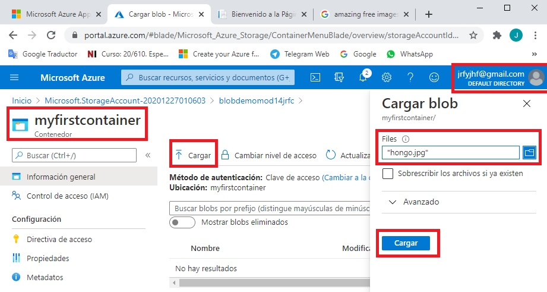


18. En el Explorador de Archivos, navega a **[Repository Root]\Allfiles\Mod14\Democode\02_AzureStorageDemo_Images**, haz clic en **blackberries.jpg**, y luego en **Abrir**.

19. En la ventana de **Subir blob**, pulsa **Subir**.

20. Cierra la ventana de **Subir la gota**.

21. Abra el Explorador de archivos.

22. En el Explorador de Archivos, navega a **[Repository Root]\Allfiles\Mod14\Democode\02_AzureStorageDemo_begin\AzureStorageDemo**, y luego copia la dirección en la barra de direcciones.

23. Pulsa **Iniciar**, y luego escribe **cmd**.

24. En **Best match**, haz clic con el botón derecho del ratón en **Command Prompt**, y luego haz clic en **Run as administrator**.

25. En el cuadro de diálogo **Control de cuentas de usuario**, haga clic en **Sí**.

26. En el cuadro de diálogo **Administrador: Command Prompt**, escriba el siguiente comando y luego pulse Intro.
  ```cs
        cd *{copied folder path}*
  ```
    >**Nota**: Si la *{pista de la carpeta copiada}* es diferente de la unidad de disco en la que se encuentra el símbolo del sistema, deberá escribir *{pista de disco}:* antes de escribir el comando **cd** *{pista de la carpeta copiada}*.

27. En el **Administrador: Command Prompt**, escriba el siguiente comando y, a continuación, pulse Intro.
  ```cs
        npm install
  ```
    >**Nota**: Si se muestran mensajes de advertencia en la línea de comandos, puede ignorarlos.

- Mostrando el resultado al ejecutar 'npm install' :


28. Cierre la ventana.

29. En el Explorador de Archivos, navega a **[Repository Root]\AllFiles\Mod14\Democode\02_AzureStorageDemo_begin**,
y luego haga doble clic en **AzureStorageDemo.sln**.

> **Nota**: Si aparece un cuadro de diálogo de **Aviso de seguridad para AzureStorageDemo**, verifique que la casilla de verificación **Pregúnteme por cada proyecto de esta solución** esté desactivada, y luego haga clic en OK.

30. En la ventana **AzureStorageDemo - Microsoft Visual Studio**, en el Explorador de soluciones, haga clic con el botón derecho del ratón en **AzureStorageDemo**, apunte a **Agregar**, y luego haga clic en **Servicio conectado**.

- Mostrando el resultado al ejecutar 'npm install' :

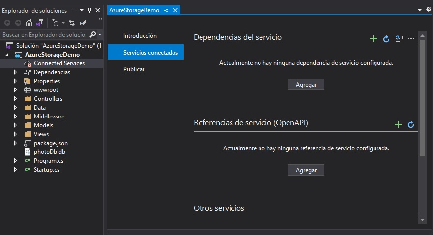

31. En la ventana **Servicio conectado**, haga clic en **Almacenamiento en nube con almacenamiento azul**.

32. En la ventana **Azure Storage**, inicia sesión en la cuenta de Azure.

    >**Nota**: En caso de que ya hayas iniciado sesión, no verás el cuadro de diálogo de inicio de sesión. En ese caso, proceda al siguiente paso.

- Agregando una depedencia de un servicio en la aplicación:

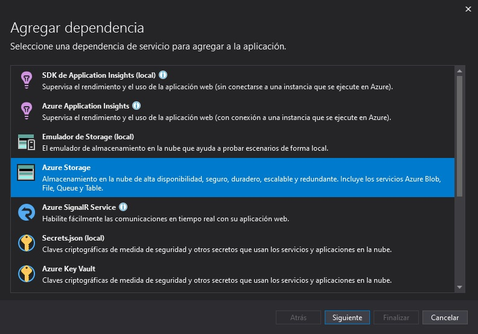

33.	En la ventana **Azure Storage**, haga clic en **blobdemo{unique name}** , y luego haga clic en **Agregar**.


    >**Nota**: Microsoft Edge muestra la siguiente URL: https://docs.microsoft.com/en-us/azure/visual-studio/vs-storage-aspnet-getting-started-blobs.

34. En Microsoft Edge, haz clic en **Cerrar**.

35. En la ventana **AzureStorageDemo - Microsoft Visual Studio**, en Solution Explorer, haz clic en **appsettings.json**.

- Mostrando el archivo de configuración 'appsetting.json' :

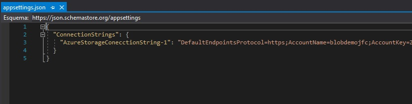

36. En la ventana **appsettings.json**, resalta el siguiente código, y luego haz clic con el botón derecho y haz clic en **Copiar**.
  ```cs
      AzureStorageConnectionString-1
  ```

37.	En la ventana **AzureStorageDemo - Microsoft Visual Studio**, en el Explorador de Soluciones, expandir **Controladores**, y luego hacer clic en **BlobController.cs**.

38.	En la ventana **BlobController.cs**, localiza el siguiente código:
  ```cs
       _connectionString = _configuration.GetConnectionString("{your_connection_string_name}");
  ```

- Mostrando la cadena de conexión copiada en la clase 'BlobController.cs' :

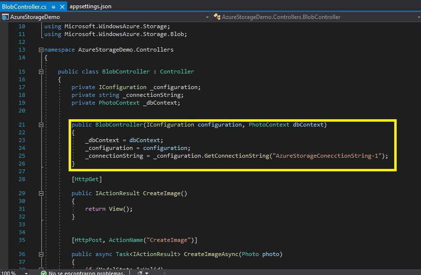

39. Reemplaza **{su_nombre_de_cadena_de_conexión}** con el nombre de la cadena de conexión copiado en el paso 36.

40. En la ventana **AzureStorageDemo - Microsoft Visual Studio**, en el Explorador de soluciones, haga clic con el botón derecho del ratón en **AzureStorageDemo**, y luego haga clic en **Manage NuGet Packages**.

41. En el **Gestor de paquetes NuGet: AzureStorageDemo**, haga clic en **Browse**.

42. En la casilla **Búsqueda**, escribe **WindowsAzure.Storage**, y luego pulsa Intro.

43. Haga clic en **WindowsAzure.Storage**, seleccione la versión **9.3.3**, y luego haga clic en **Install.**

    >**Nota**: Si ya ha instalado una versión anterior de **WindowsAzure.Storage**, el botón mostrará **Actualizar** en lugar de **Instalar**.

- Mostrando el resultado de la instalación del paquete 'WindowsAzure.Storage' :

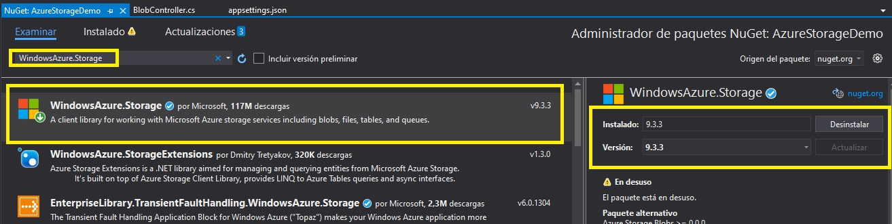

44. Si aparece un cuadro de diálogo de **Vista previa de los cambios**, haga clic en **OK**.

45. Si aparece un cuadro de diálogo de **Aceptación de licencia**, haga clic en **Acepto**.

46. Cierre el Administrador de paquetes **NuGet: AzureStorageDemo**.

47. En la ventana **AzureStorageDemo - Microsoft Visual Studio**, en el Explorador de soluciones, haga clic en **BlobController.cs**.

48. En la ventana del código **BlobController.cs**, localiza el siguiente código:
  ```cs
       using AzureStorageDemo.Data;
  ```
49. Asegúrate de que el cursor está al final del espacio de nombres **AzureStorageDemo.Data**, presiona Enter, y luego escribe el siguiente código:
  ```cs
       using Microsoft.WindowsAzure.Storage;
       using Microsoft.WindowsAzure.Storage.Blob;
  ```

50. Asegúrate de que el cursor está al final del bloque de código **CreateImageAsync**, presiona Enter dos veces, y luego escribe el siguiente código:
  ```cs
       public async Task UploadAsync(IFormFile photo)
       {
           CloudStorageAccount storageAccount = CloudStorageAccount.Parse(_connectionString);
           CloudBlobClient blobClient = storageAccount.CreateCloudBlobClient();
           CloudBlobContainer container = blobClient.GetContainerReference("myimagecontainer");

           if (await container.CreateIfNotExistsAsync())
           {
               await container.SetPermissionsAsync(
               new BlobContainerPermissions
              {
                  PublicAccess = BlobContainerPublicAccessType.Blob
              });
           }
           CloudBlockBlob blob = container.GetBlockBlobReference(Path.GetFileName(photo.FileName));
           await blob.UploadFromStreamAsync(photo.OpenReadStream());
       }
  ```

51. En el bloque de código **BlobController.cs**, localiza el siguiente código:
  ```cs
       using (var memoryStream = new MemoryStream())
       {
           photo.PhotoAvatar.CopyTo(memoryStream);
           photo.PhotoFile = memoryStream.ToArray();
       }
  ```

52. Ponga el cursor al final del código localizado, presione Enter, escriba el siguiente código y luego presione Enter dos veces.
  ```cs
       await UploadAsync(photo.PhotoAvatar);
  ```

- Mostrando el código agregado en la clase 'BlobController.cs' :


53. En la ventana de **AzureStorageDemo - Microsoft Visual Studio**, en el menú **FILE**, haga clic en **Save All**.

54. En la ventana **AzureStorageDemo - Microsoft Visual Studio**, en el menú **DEBUG**, haga clic en **Iniciar sin depuración**.

55. En Microsoft Edge, haga clic en **Subir nueva imagen**.

56. En la página **Agregar foto al álbum**, en la casilla **Título**, escriba _&lt;Un título de foto de su elección&gt;._

57. En la página **Agregar Foto al Álbum**, en la casilla **Descripción**, escriba _&lt;Una descripción de la foto de su elección&gt;._

- Mostrando la subida de una foto en la aplicación:

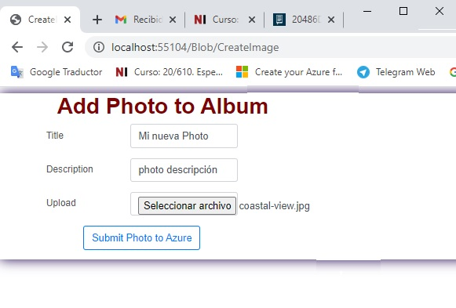

- Mostrando que la foto ha sido subida en la aplicación:


58. En Microsoft Edge, haga clic en **Browse**.

59. En el Explorador de Archivos, navega a **[Repository Root]\Allfiles\Mod14\Democode\02_AzureStorageDemo_Images**, haz clic en **fungi.jpg**, y luego en **Abrir**.

60. En Microsoft Edge, pulsa **Subir foto a Azure**. 

61. En Microsoft Edge, abre una nueva pestaña, escribe **http://portal.azure.com**, y luego presiona Enter.

62. En el portal, en el menú de la izquierda, pulsa **Cuentas de almacenamiento**. 

- Mostrando que la foto ha sido subida en la aplicación:

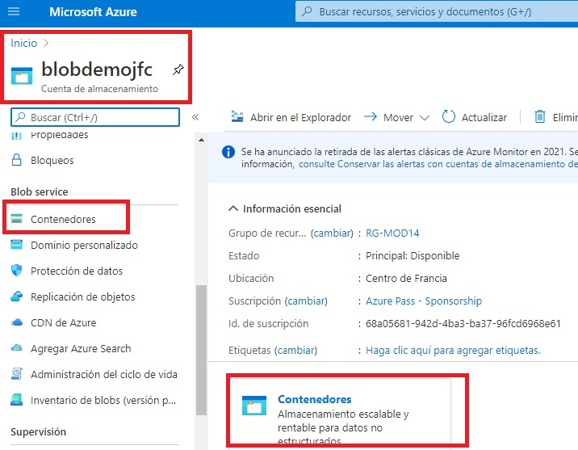

63. En la ventana **Cuentas de almacenamiento**, haga clic en **blobdemo{unique name}**.

64. En la ventana **blobdemo{unique name}**, debajo de **Servicio Blob**, haga clic en **Blobs**.

65. En la ventana de **Blobs**, haga clic en **mi imagen-contenedor**.

    >**Nota**: Verificar la presencia de la imagen cargada.
- Mostrando que la foto ha sido subida en la aplicación:

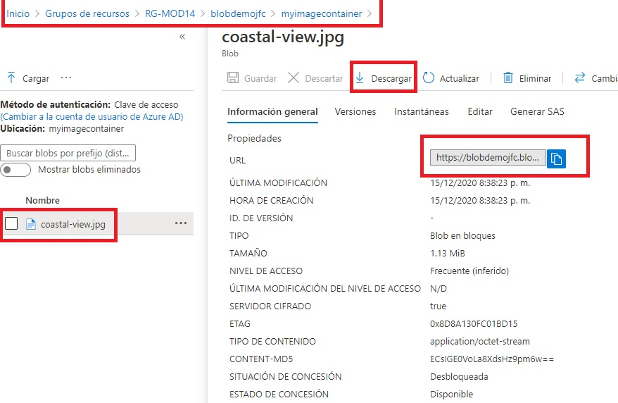

66. Haz clic en **fungi.jpg**.

67. Haz clic en **Edit blob**.

    >**Nota**: La imagen cargada se muestra.

68. Cierra todas las ventanas de Microsoft Edge.

69. En la ventana **AzureStorageDemo - Microsoft Visual Studio**, en el menú **ARCHIVO**, haga clic en **Salir**.


