# Module 14: Hosting and Deployment

Siempre cuando un camino comienza con  *[Repository Root]*, reemplacelo con el camino absoluto en el que el repositorio 20486 reside. Por ejemplo, si tu has cloneado o extraido el repositorio 20486 en la carpeta **C:\Users\John Doe\Downloads\20486**, cambiar la ruta de: **[Repository Root]\AllFiles\20486D\Mod01** a **C:\Users\John Doe\Downloads\20486\AllFiles\20486D\Mod01**.

Fichero de Instrucciones: Instructions\20486D_MOD05_LAK.md

**Información:**

1. **Nombres y apellidos:** José René Fuentes Cutz
2. **Fecha:** 24 de Noviembre 2020.
3. **Resumen del Ejercicio:** Este laboratorio consta de 4 ejercicio:
- En el Primer ejercicio nos ayuda a  crear Controllers MVC que implementen acciones comunes para la clase de modelo **City** de la aplicación.
- En el Segundo ejercicio nos ayuda a entender como podemos registrar nuevas rutas personalizadas en el canal de solicitud de Controllers de la aplicación..
- En el Tercer ejercicio creamos una clase de filtro de acción que registre los detalles de las acciones, los Controllers y los parámetros en un archivo externo cada vez que se llame a una acción..

4. **Dificultad o problemas presentados y como se resolvieron:** Ninguno.

**NOTA**: Si no hay descripcion de problemas o dificultades, y al yo descargar el código para realizar la comprobacion y el código no funcionar, el resultado de la califaciación del laboratorio será afectado.

---


# Laboratorio: Alojamiento y despliegue

### Lab Setup

Tiempo estimado: **90 minutos**

### Preparation Steps

1. Asegúrate de que has clonado el directorio **20486D** de GitHub. Contiene los segmentos de código para los laboratorios y demostraciones de este curso. 
(https://github.com/MicrosoftLearning/20486D-DevelopingASPNETMVCWebApplications/tree/master/Allfiles)

2. En el Explorador de Archivos, navega a **[Raíz del Repositorio]\Ntodos los archivos\NMod14\N-Labfiles\N01_Underwater_begin\NUnderwater**, y luego copia la dirección en la barra de direcciones.

3. Pulsa **Iniciar**, y luego escribe **cmd**.

4. En **Best match**, haz clic con el botón derecho del ratón en **Command Prompt**, y luego haz clic en **Run as administrator**.

5. En el cuadro de diálogo **Control de cuentas de usuario**, haga clic en **Sí**.

6. En el Administrador: Command Prompt, escriba el siguiente comando y luego presione Enter.
  ```cs
       cd {copia de la ruta de la carpeta}
  ```

>**Nota**: Si la *{pista de la carpeta copiada}* es diferente de la unidad de disco en la que se encuentra el símbolo del sistema, deberá escribir *{pista de disco}:* antes de escribir el comando **cd** *{pista de la carpeta copiada}*.

7. En el Administrador: Command Prompt, escriba el siguiente comando y, a continuación, pulse Intro.
  ```cs
       npm install
  ```
>**Nota**: Si se muestran mensajes de advertencia en la línea de comandos, puede ignorarlos.

- La representación visual de la resolución del ejercicio se muestra en la siguiente imagen:

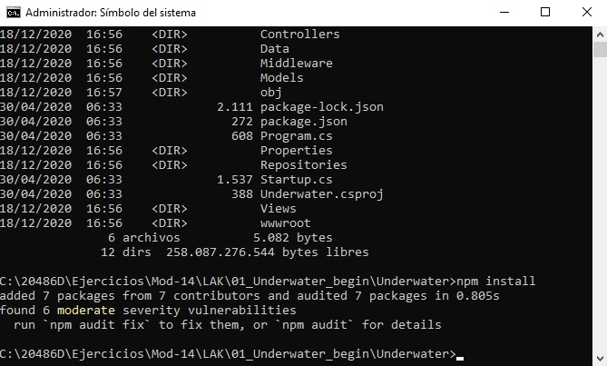

8. Cierre la ventana.

### Ejercicio 1: Desplegando una aplicación web en Microsoft Azure

#### Tarea 1: Explorar y ejecutar la aplicación localmente

1. Navega a **[Raíz del Repositorio]\Ntodos los archivos\NMod14\N-Labfiles\N01_Underwater_begin**, y luego haz doble clic en **Underwater.sln**.

    >**Nota**: Si aparece un cuadro de diálogo de **Aviso de Seguridad para Underwaters**, verifica que la casilla de verificación **Pregúntame por cada proyecto de esta solución** está despejada, y luego haz clic en **OK**. 

2. En la ventana **Underwater - Microsoft Visual Studio**, en el menú **TOOLS**, apunte a **NuGet Package Manager**, y luego haga clic en **Package Manager Console**.

3. En la pestaña **Package Manager Console**, escriba el siguiente comando, y luego presione Enter.
  ```cs
       Add-Migration InitialCreate
  ```

- La representación visual de la resolución del ejercicio se muestra en la siguiente imagen:

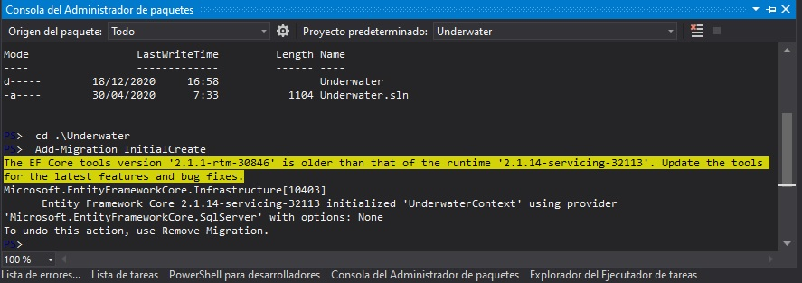

4. En la pestaña **Consola de Administración de Paquetes**, escriba el siguiente comando, y luego presione Enter.
  ```cs
       Update-Databases
  ```

- La representación visual de la resolución del ejercicio se muestra en la siguiente imagen:

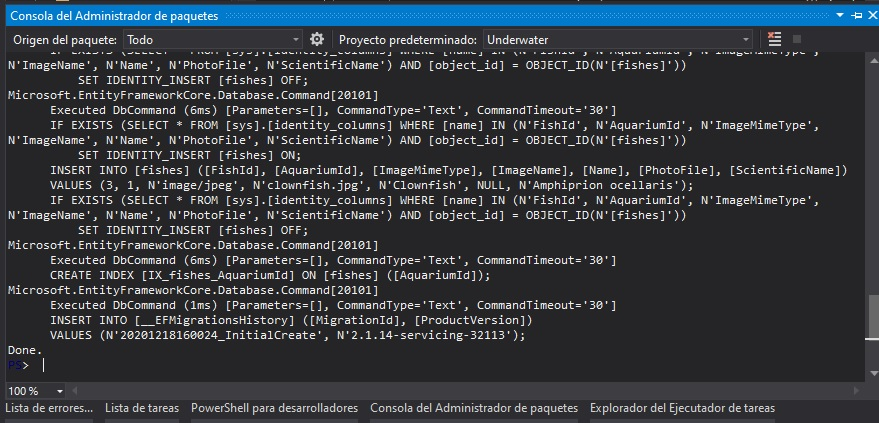

5. En la ventana **Underwater - Microsoft Visual Studio**, en el menú **DEBUG**, haga clic en **Start Without Debugging**.

- La representación visual de la resolución del ejercicio se muestra en la siguiente imagen:

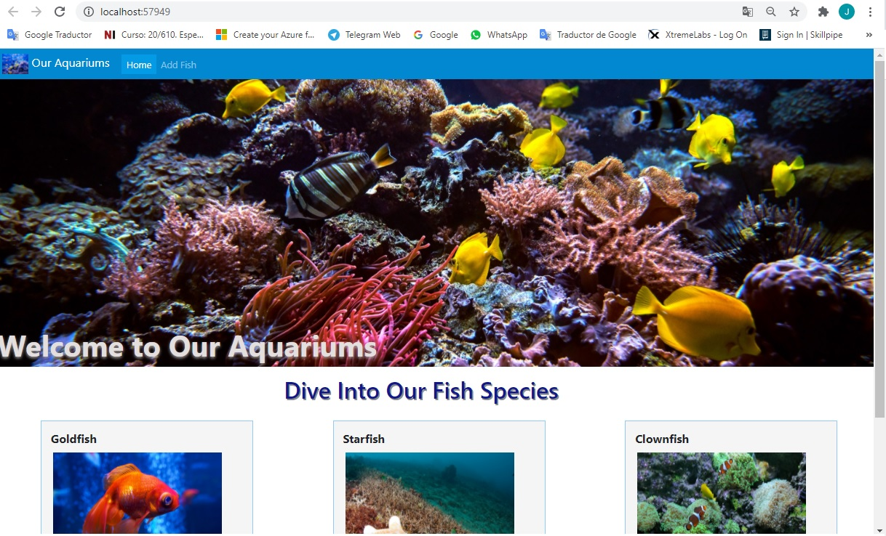

6. En Microsoft Edge, en la barra de menú, haga clic en **Agregar Pez**.

7. En la página **Agregar un pez a un acuario**, en la lista **Acuario**, seleccione **_&lt;Un acuario de su elección&gt;._**.

8. En la página **Agregar un pez al acuario**, en la casilla **Nombre del pez**, escriba **_&lt;Un nombre de pez de su elección&gt;._**.

9. En la página **Agregar un pez al acuario**, en el recuadro **Nombre científico**, escriba **_&lt;Un nombre científico de su elección&gt;._**.

10. En la página **Agregar un pez al acuario**, en el selector de archivos de **Imagen**, ve a **[Raíz del repositorio]}Todos los archivos {Mod14}Labfiles\NImágenes**, haz clic en **koi.jpg**, y luego haz clic en **Abrir**.

11. En la página de **Agregar un pez al acuario**, haz clic en **Agregar**.

- La representación visual de la resolución del ejercicio se muestra en la siguiente imagen:

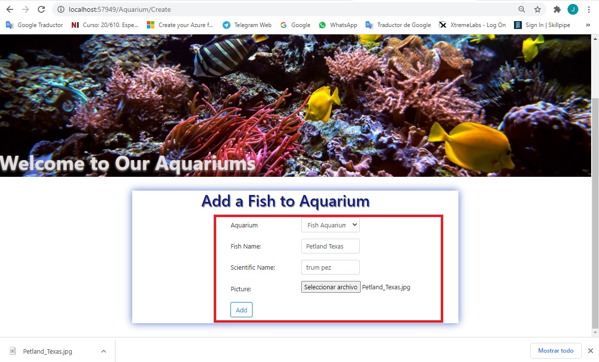

12. En la página **Verificar nuestras especies de peces**, verifique los nuevos detalles enviados.

- La representación visual de la resolución del ejercicio se muestra en la siguiente imagen:

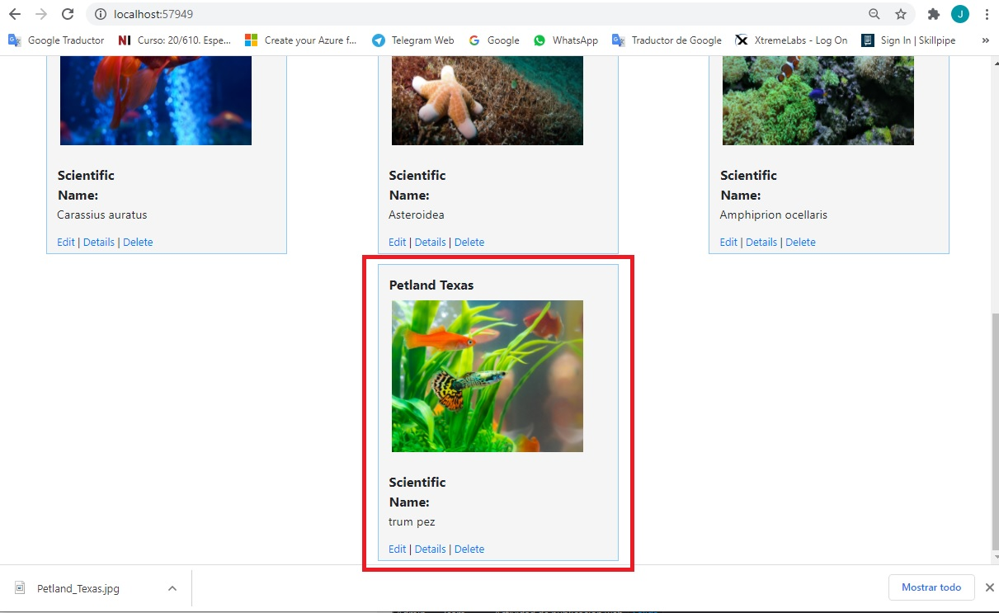

13. En la página **Verificar nuestras especies de peces**, seleccione un pez de su elección y luego haga clic en **Detalles**.

14. Vea los detalles del pez, y luego haga clic en **Volver**.

15. En la página **Inmersión en nuestras especies de peces**, seleccione un pez de su elección y luego haga clic en **Editar**.

- La representación visual de la resolución del ejercicio se muestra en la siguiente imagen:

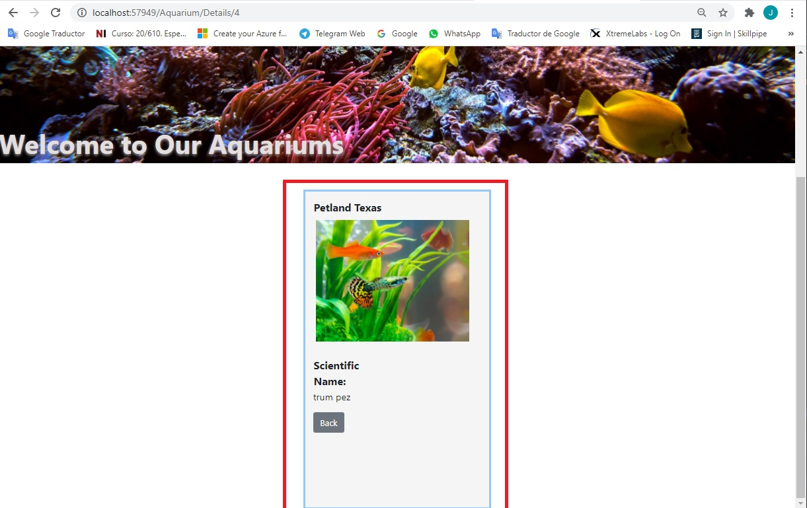

16. En la página **Editar pez**, en el cuadro **Nombre científico**, escriba **_&lt;Un nombre científico de su elección... y luego haga clic en **Guardar**.

- La representación visual de la resolución del ejercicio se muestra en la siguiente imagen:

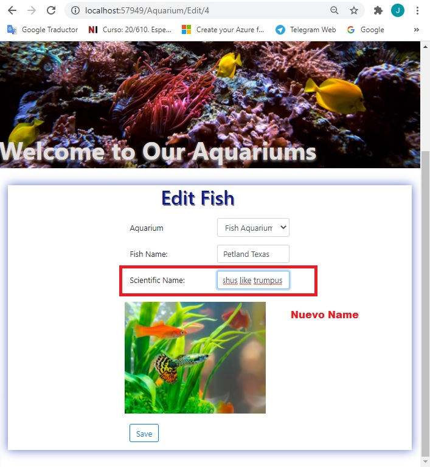

17. 18. En la página **Salir a nuestras especies de peces**, seleccione el pez que ha editado, y luego haga clic en **Detalles**.

18. Vea los detalles del pez, verifique los detalles recién editados, y luego haga clic en **Volver**.

- La representación visual de la resolución del ejercicio se muestra en la siguiente imagen:

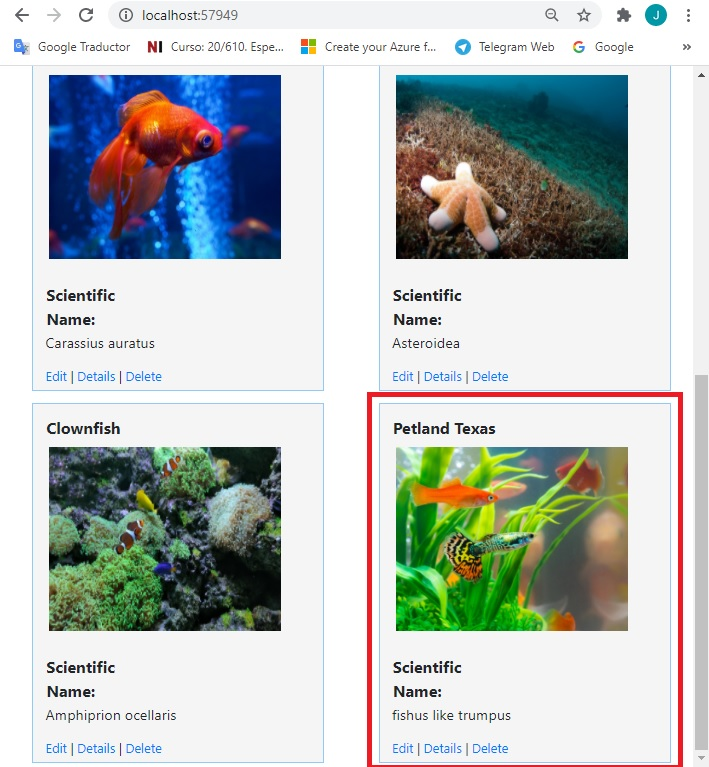

19. En la página **Sumérgete en nuestras especies de peces**, selecciona un pez de tu elección y luego haz clic en **Borrar**.

- La representación visual de la resolución del ejercicio se muestra en la siguiente imagen:

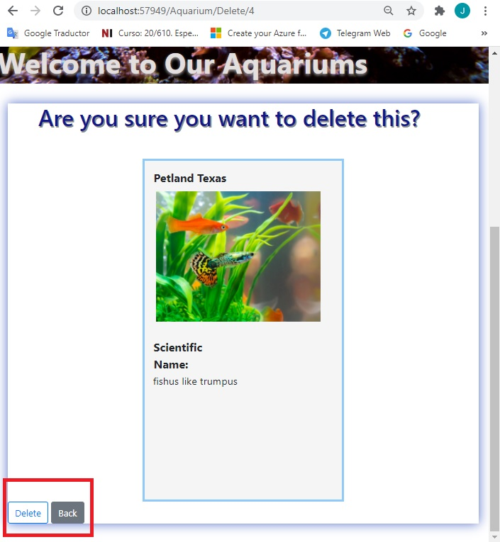

20. En la página **¿Estás seguro de que quieres borrar esto?**, haz clic en **Borrar**.

- La representación visual de la resolución del ejercicio se muestra en la siguiente imagen:

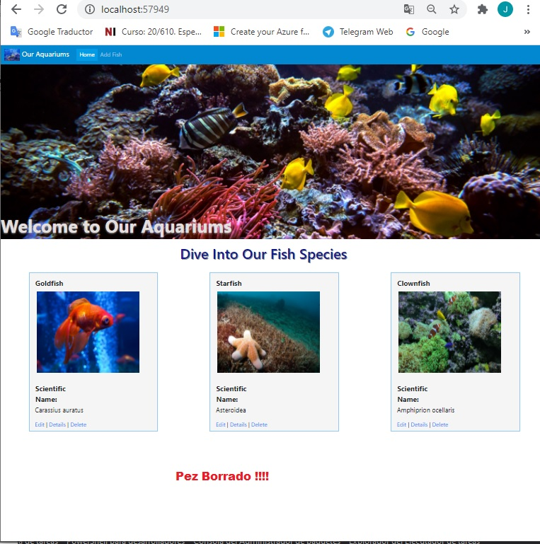

21. En la página **Ir a Nuestras Especies de Peces**, verifique que el pez ha sido eliminado.

- La representación visual de la resolución del ejercicio se muestra en la siguiente imagen:

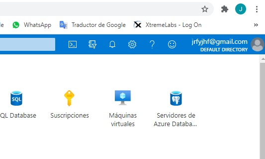

22. En Microsoft Edge, haz clic en **Cerrar**.

#### Tarea 2: Crear una nueva aplicación web en Microsoft Azure

1. Abrir Microsoft Edge.

2. En Microsoft Edge, en la barra de direcciones, escribe **http://portal.azure.com**, y luego presiona Enter.

3. Inicie sesión y luego pulse **Servicios de aplicaciones**.

- La representación visual de la resolución del ejercicio se muestra en la siguiente imagen:


4. En la ventana **Servicios de aplicaciones**, haga clic en **Agregar**.

5. En la ventana **Mercado**, haga clic en **Aplicación Web + SQL**, y luego haga clic en **Crear**.

6. En la ventana **Aplicación web + SQL**, en el cuadro **Nombre de la aplicación**, escriba **Underwater{nombre único}**.


    >**Nota**: El nombre debe ser único. Puedes añadir tu nombre, apellido o fecha de nacimiento al nombre actual.

7. En la ventana **Aplicación Web + SQL**, en **Base de datos SQL**, haga clic en **Configurar los ajustes necesarios**.

8. En la ventana **Base de datos**, haga clic en **Crear una nueva base de datos**.

9. En la ventana **Base de datos SQL**, en el cuadro **Nombre**, escriba **BDD bajo el agua**.

10. En la ventana **Base de datos SQL**, en **Servidor de destino**, haga clic en **Configurar los parámetros necesarios**.

11. En la ventana **Nuevo servidor**, en el cuadro **Nombre del servidor**, escriba **Underwater{nombre único}**.
   
12. En la ventana **Nuevo servidor**, en el cuadro **Inicio de sesión del administrador del servidor**, escriba **Underwateradmin**.

13. En la ventana **Servidor nuevo**, en el cuadro **Contraseña**, escriba **p@@sw0rd**.

14. En la ventana **Servidor nuevo**, en el cuadro **Confirmar contraseña**, escriba **p@@sw0rd**.

15. En la ventana **Nuevo servidor**, haga clic en **Seleccionar**.

16. En la ventana **Base de datos SQL**, haga clic en **Seleccionar**.

17. En la ventana **Aplicación web + SQL**, haga clic en **Crear**.

#### Tarea 3: Preparar la aplicación para el despliegue

1. En la ventana **Underwater - Microsoft Visual Studio**, abra el Solution Explorer, haga clic con el botón derecho del ratón en **Underwater**, y luego haga clic en **Edit Underwater.csproj**.

2. En la ventana de código **Underwater.csproj**, localice el siguiente código:
  ```cs
       <PropertyGroup>
           <TargetFramework>netcoreapp2.1</TargetFramework>
           <TypeScriptToolsVersion>2.8</TypeScriptToolsVersion>
       </PropertyGroup>
  ```

3. Ponga el cursor después del signo **>** (mayor que) de la etiqueta **&lt;/PropertyGroup&gt;**, presione Enter dos veces, y luego escriba el siguiente código:
  ```cs
       <ItemGroup>
           <Content Include="node_modules\**" CopyToPublishDirectory="PreserveNewest" />
       </ItemGroup>
  ```

4. En la ventana **Underwater - Microsoft Visual Studio**, en el menú **FILE**, haga clic en **Save All**.

5. En la ventana **Underwater - Microsoft Visual Studio**, en el Solution Explorer, haga clic con el botón derecho del ratón en **Underwater**, y luego haga clic en **Publish**.

- La representación visual de la resolución del ejercicio se muestra en la siguiente imagen:


6. En el cuadro de diálogo **Seleccionar un objetivo de publicación**, en el panel de navegación, haga clic en **Servicio de aplicación**.

- La representación visual de la resolución del ejercicio se muestra en la siguiente imagen:

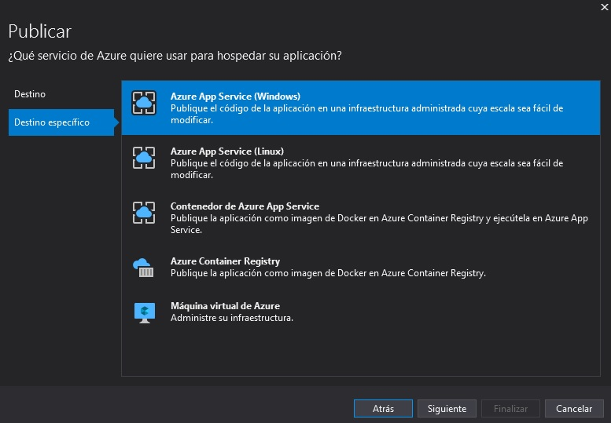

7. En el cuadro de diálogo **Seleccionar un objetivo de publicación**, en el panel de resultados, haga clic en **Seleccionar existente**.

- La representación visual de la resolución del ejercicio se muestra en la siguiente imagen:

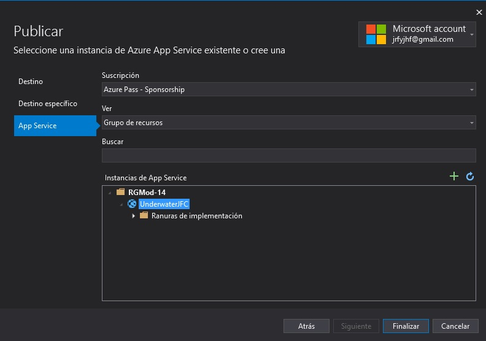

- La representación visual de la resolución del ejercicio se muestra en la siguiente imagen:

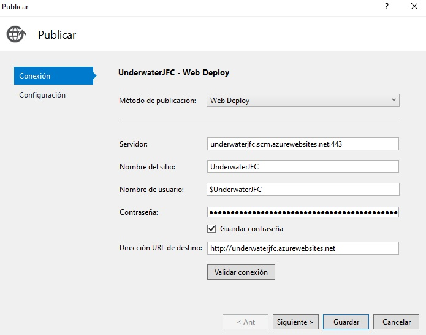

- Hacemos clic en validar la conexión solo para estar seguro que todo está en order:

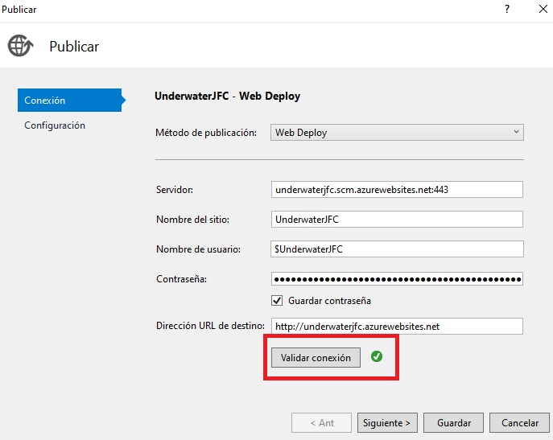

8. Haga clic en la flecha junto a **Publicar** y, a continuación, haga clic en **Crear perfil**.


9. En el cuadro de diálogo **App Service**, haga clic en **Iniciar sesión**.

    >**Nota**: En caso de que ya hayas iniciado sesión, no verás este cuadro de diálogo. En ese caso, vaya al paso 13.

10. En el cuadro de diálogo **Inicie sesión en su cuenta**, introduzca la dirección de correo electrónico, el número de teléfono o el ID de Skype de su cuenta Azure, y luego haga clic en **Siguiente**. 

11. En el cuadro de diálogo **Inicie sesión en su cuenta**, escriba **Contraseña**, y luego haga clic en **Inicie sesión**.

12. En el cuadro de diálogo **App Service**, expanda **Underwater{nombre único}**, haga clic en **Underwater{nombre único}**, y luego haga clic en **OK**.

13. En la ventana **Publicar**, haga clic en **Configue**.

14. En la ventana **Publicar**, haga clic en **Settings**.

15. En la ventana **Publicar**, expandir **Bases de datos**.

16. En la ventana **Publicar**, bajo la casilla **Conexión predeterminada**, seleccione la casilla **Utilizar esta cadena de conexión en tiempo de ejecución**.

17. En la ventana **Publicar**, en la casilla debajo de **Conexión por defecto**, escriba:
  ```cs
        Server=tcp:Underwater{unique name}.database.windows.net,1433;Initial Catalog=UnderwaterDB;Persist Security Info=False;User ID=Underwateradmin;Password=p@@sw0rd;MultipleActiveResultSets=False;Encrypt=True;TrustServerCertificate=False;Connection Timeout=30;
  ```
18. En la ventana **Publicar**, amplíe **Migraciones de Marco de Entidades**, y luego haga clic en **Aplicar esta migración al publicar**.

19. En la ventana **Publish**, amplíe **Entity Framework Migrations**, y en el cuadro bajo **Apply this migration on publish**, escriba:
  ```cs
       Server=tcp:Underwater{unique name}.database.windows.net,1433;Initial Catalog=UnderwaterDB;Persist Security Info=False;User ID=Underwateradmin;Password=p@@sw0rd;MultipleActiveResultSets=False;Encrypt=True;TrustServerCertificate=False;Connection Timeout=30;
  ```

- El resultados de los pasos anterior se muestran visualmente en la siguiente imagen:

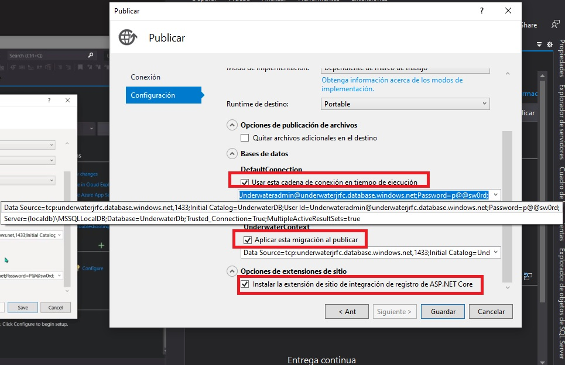

20. En la ventana de **Publicar**, haga clic en **Guardar**.

#### Tarea 4: Desplegar la aplicación

1. En la ventana **Underwater - Microsoft Visual Studio**, en la ventana **Publicar**, haga clic en **Publicar**.

- Publicación de la aplicación visualmente en la siguiente imagen:

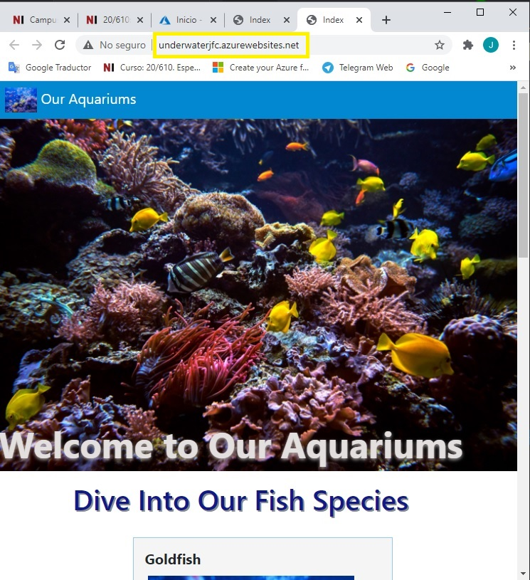

2. En Microsoft Edge, haz clic en **Agregar pez**.

3. En la página **Agregar un pez al acuario**, en la lista **Acuario**, seleccione **_&lt;Un acuario de su elección..._**.

4. En la página **Agregar un pez al acuario**, en la casilla **Nombre del pez**, escriba **_&lt;Un nombre de pez de su elección;._**.

5. En la página **Agregar un pez al acuario**, en la casilla **Nombre científico**, escriba **_&lt;Un nombre científico de su elección..._**.

6. En la página **Agregar un pez al acuario**, en el selector de archivos de **Imagen**, ve a **[Raíz del repositorio]}Todos los archivos {Mod14}Labfiles\N-Imágenes**, haz clic en **salmon.jpg**, y luego haz clic en **Abrir**.

7. En la página de **Agregar un pez al acuario**, haz clic en **Agregar**.

- Agregando un pez en la aplicación al rellenar el formulario dado, tal y como se muestra en la siguiente imagen: 
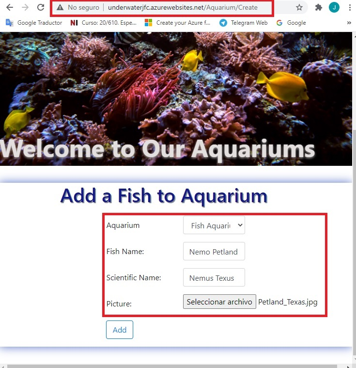

8. En la página **Verificar nuestras especies de peces**, verifique los nuevos detalles enviados.

- Verificamos que el pez ha sido agregado: 

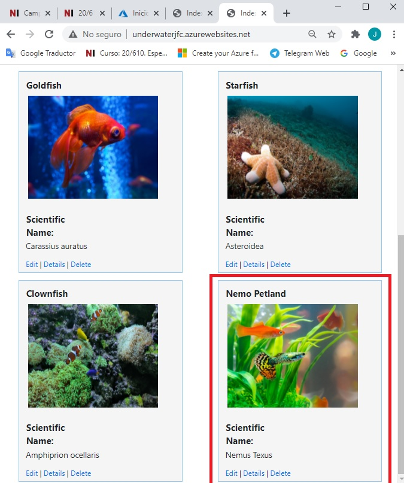

9. En la página **Verificar nuestras especies de peces**, seleccione un pez de su elección, y luego haga clic en **Detalles**.

10. Vea los detalles del pez, y luego haga clic en **Volver**.

11. En la página **Inmersión en nuestras especies de peces**, seleccione un pez de su elección y luego haga clic en **Editar**.

- Página de la edición de un pez: 

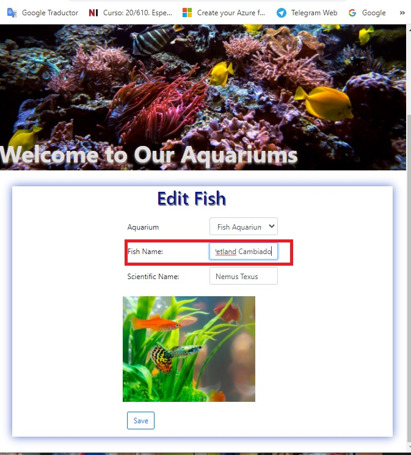

12. En la página **Editar pez**, en el cuadro **Nombre científico**, escriba **_&lt;Un nombre científico de su elección... y luego haga clic en **Guardar**.

13. En la página **Salir a nuestras especies de peces**, seleccione el pez que ha editado, y luego haga clic en **Detalles**.

- Mostrando que la edición de un pez ha sido satisfactoria: 

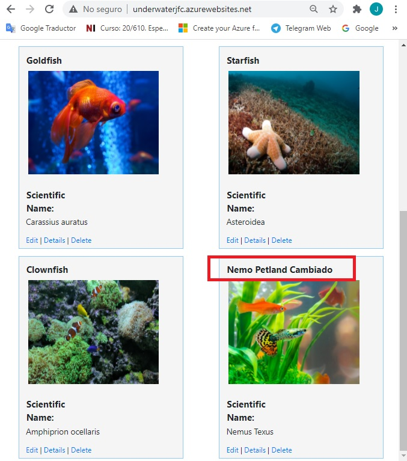

14. Vea los detalles del pez, verifique los detalles del pez recién editado, y luego haga clic en **Volver**.

15. En la página **Inmersión en nuestras especies de peces**, seleccione un pez de su elección y luego haga clic en **Borrar**.

- Página para el borrado de un pez: 

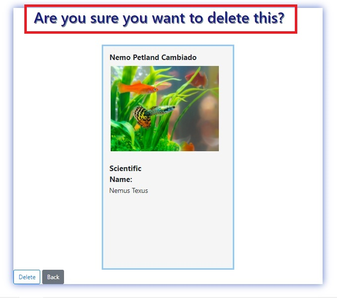

16. En la página **¿Estás seguro de que quieres borrar esto?**, haz clic en **Borrar**.

17. En la página **Verificar nuestras especies de peces**, verifique que el pez ha sido eliminado.

- Verficicación que el pez ha sido borrado: 

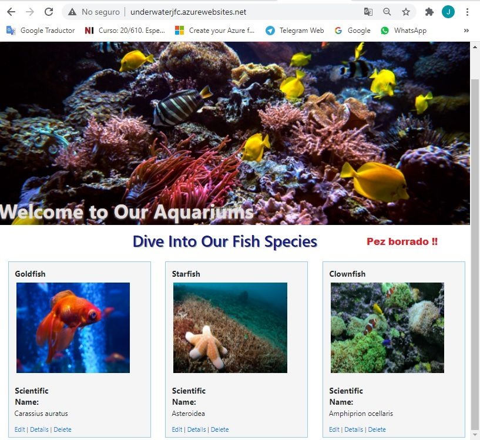

18. En Microsoft Edge, haz clic en **Cerrar**.

#### Tarea 5: Actualizar la aplicación e implementar en Microsoft Azure

1. En la ventana **Underwater - Microsoft Visual Studio**, en el Solution Explorer, expandir **Models**, y luego hacer clic en **Fish.cs**.

2. En el bloque de código **Fish.cs**, localiza el siguiente código:
  ```cs
       [Display(Name = "Scientific Name:")]
       public string ScientificName { get; set; }
  ```

3. Ponga el cursor después de la } (cerrando la abrazadera rizada), presione Enter, y luego escriba el siguiente código:
  ```cs
       [Display(Name = "Common Name:")]
       public string CommonName { get; set; }
  ```

- Agregando el código a la clase 'Fish.cs' mostrado visualmente: 

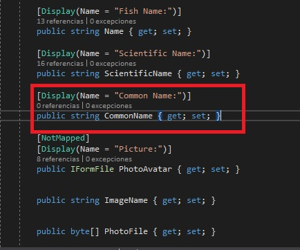

4. En la ventana **Underwater - Microsoft Visual Studio**, en el Solution Explorer, expandir **Views**, expandir **Aquarium**, y luego hacer clic en **Details.cshtml**.

5. En la ventana del código **Details.cshtml**, localice el siguiente código:
  ```cs
       <div>
            <p class="display-label">
                @Html.DisplayNameFor(model => model.ScientificName)
            </p>
            <br />
            <p class="display-field">
                @Html.DisplayFor(model => model.ScientificName)
            </p>
        </div>
  ```
6. Coloque el cursor después del signo **>** (mayor que) de la etiqueta **&lt;/div...**, presione Enter y luego escriba el siguiente código:
  ```cs
       <div>
            <p class="display-label">
                @Html.DisplayNameFor(model => model.CommonName)
            </p>
            <br />
            <p class="display-field">
                @Html.DisplayFor(model => model.CommonName)
            </p>
       </div>
  ```

- Agregando el código en la vista 'Details.cshtml' mostrado visualmente: 

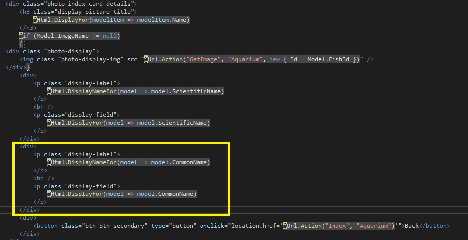

7. En la ventana **Underwater - Microsoft Visual Studio**, en **Solution Explorer**, en **Views**, en **Aquarium**, haga clic en **Edit.cshtml**.

8. En la ventana del código **Edit.cshtml**, localizar el siguiente código:
  ```cs
       <div class="form-group row">
           <label asp-for="ScientificName" class="col-sm-6 col-form-label"></label>
           <div class="col-sm-6">
               <input asp-for="ScientificName" type="text" class="form-control" placeholder="Scientific Name" required>
               <span asp-validation-for="ScientificName"></span>
           </div>
       </div>
  ```
9. Coloque el cursor después del signo **>** (mayor que) de la etiqueta **&lt;/div...**, presione Enter y luego escriba el siguiente código:
  ```cs
       <div class="form-group row">
           <label asp-for="CommonName" class="col-sm-6 col-form-label"></label>
           <div class="col-sm-6">
               <input asp-for="CommonName" type="text" class="form-control" placeholder="Common Name" required>
               <span asp-validation-for="CommonName"></span>
           </div>
       </div>
  ```

- Agregando el código en la vista 'Edit.cshtml' mostrado visualmente: 

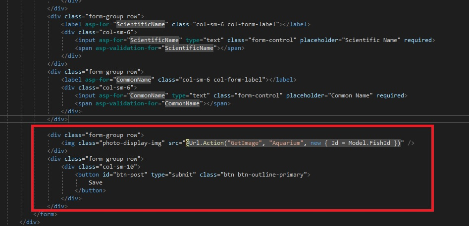

10. En la ventana **Underwater - Microsoft Visual Studio**, en el Solution Explorer, en **Views**, en **Aquarium**, haga clic en **Create.cshtml**.

11. En la ventana del código **Create.cshtml**, localice el siguiente código:

  ```cs
       <div class="form-group row">
           <label asp-for="ScientificName" class="col-sm-6 col-form-label"></label>
           <div class="col-sm-6">
               <input asp-for="ScientificName" type="text" class="form-control" placeholder="Scientific Name" required>
               <span asp-validation-for="ScientificName"></span>
           </div>
       </div>
  ```

12. Coloque el cursor después del signo **>** (mayor que) de la etiqueta **&lt;/div&gt;._**.**, presione Enter y luego escriba el siguiente código:
  ```cs
       <div class="form-group row">
           <label asp-for="CommonName" class="col-sm-6 col-form-label"></label>
           <div class="col-sm-6">
               <input asp-for="CommonName" type="text" class="form-control" placeholder="Common Name" required>
               <span asp-validation-for="CommonName"></span>
           </div>
       </div>
  ```

- Agregando el código en la vista 'Create.cshtml' mostrado visualmente: 

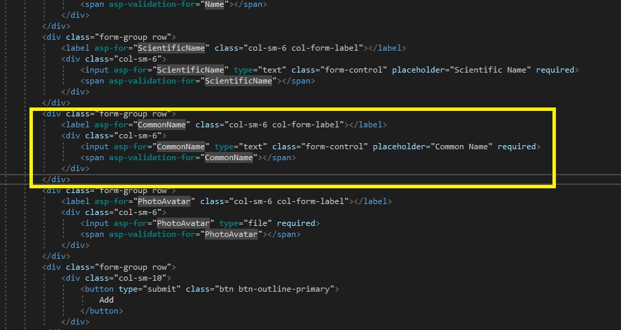

13. En la ventana **Underwater - Microsoft Visual Studio**, en Solution Explorer, en **Views**, en **Aquarium**, haga clic en **Delete.cshtml**.

14. En la ventana del código **Borrar.cshtml**, localice el siguiente código:
  ```cs
       <div>
            <p class="display-label">
                @Html.DisplayNameFor(model => model.ScientificName)
            </p>
            <br />
            <p class="display-field">
                @Html.DisplayFor(model => model.ScientificName)
            </p>
        </div>
  ```
15. Coloque el cursor después del signo **>** (mayor que) de la etiqueta **&lt;/div&gt;._**., presione Enter y luego escriba el siguiente código:
  ```cs
        <div>
            <p class="display-label">
                @Html.DisplayNameFor(model => model.CommonName)
            </p>
            <br />
            <p class="display-field">
                @Html.DisplayFor(model => model.CommonName)
            </p>
        </div>
  ```
- Agregando el código en la vista 'Delete.cshtml' mostrado visualmente: 

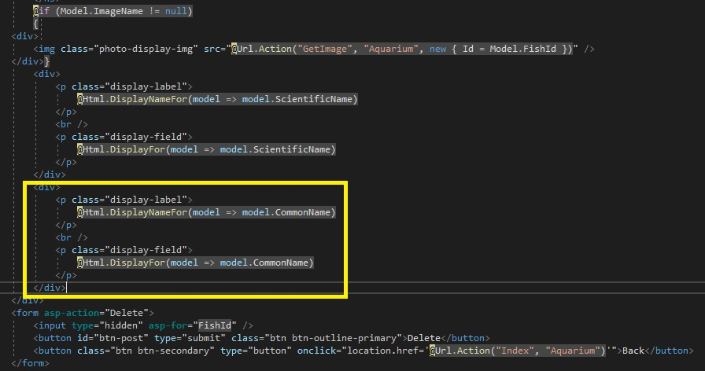

16. En la ventana **Underwater - Microsoft Visual Studio**, en el Explorador de Soluciones, amplíe **Controladores**, y luego haga clic en **AquariumController.cs**.

17. En el bloque de código **AquariumController.cs**, en el método **EditPost**, seleccione el siguiente código:
  ```cs
        var fishToUpdate = _repository.GetFishById(id);
        bool isUpdated = await TryUpdateModelAsync<Fish>(
                            fishToUpdate,
                            "",
                            f => f.AquariumId,
                            f => f.Name,
                            f => f.ScientificName
                            );
  ```

18. Reemplazar el código seleccionado por el siguiente código:
  ```cs
        var fishToUpdate = _repository.GetFishById(id);
        bool isUpdated = await TryUpdateModelAsync<Fish>(
                            fishToUpdate,
                            "",
                            f => f.AquariumId,
                            f => f.Name,
                            f => f.ScientificName,
                            f => f.CommonName
                            );
  ```

- Agregando el código en el controlador 'AquariumController.cs' mostrado visualmente: 

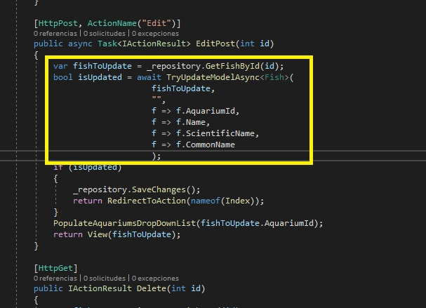

19. En la ventana **Underwater - Microsoft Visual Studio**, en el menú **TOOLS**, apunta a **NuGet Package Manager**, y luego haz clic en **Package Manager Console**.

20. En la pestaña **Package Manager Console**, escriba el siguiente comando y luego presione Enter.
  ```cs
      Add-Migration AddFishCommonName
  ```

- Ejecución del comando 'Add-Migration AddFishCommonName' en la Consola de Administración de paquetes: 

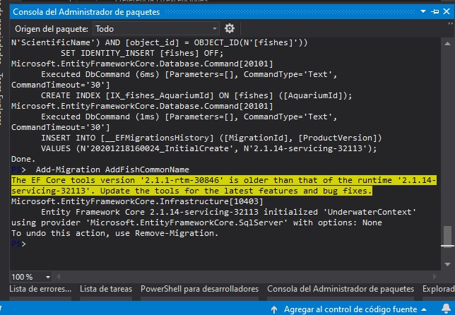

21. En la pestaña **Consola de Administración de Paquetes**, escriba el siguiente comando y luego presione Enter.
  ```cs
      Update-Database
  ```

- Ejecución del comando 'Update-Database' en la Consola de Administración de paquetes: 

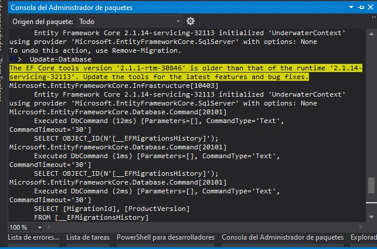

>**Nota**: En la ventana **Underwater - Microsoft Visual Studio**, en el Solution Explorer, en **Migraciones**, se crea un nuevo archivo.

- Creación del archivo 'AddFishCommonName.cs' en la carpeta 'Migraciones' como se muestra en la siguiente imagen: 

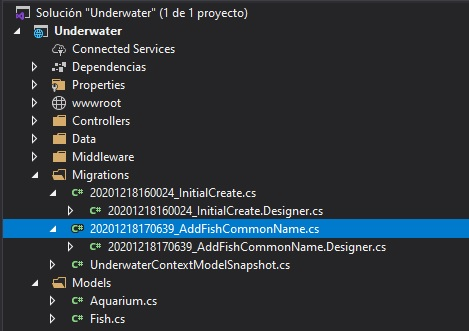

22. En la ventana **Underwater - Microsoft Visual Studio**, abre el Solution Explorer, haz clic con el botón derecho del ratón en **Underwater**, y luego haz clic en **Publicar**.

23. En la ventana **Publicar**, junto al botón **Publicar**, verifique que esté seleccionado **Underwater{nombre único}** en la lista desplegable y, a continuación, haga clic en **Publicar**.

- Publicación de la aplicación después de los cambios hechos como se muestra en la siguiente imagen: 

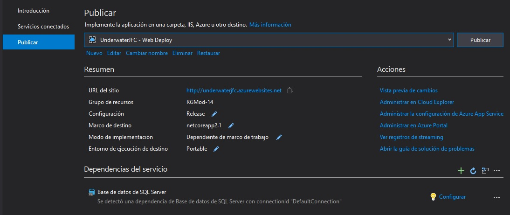

24. En Microsoft Edge, en la barra de menú, haga clic en **Agregar pez**.

- Página de inicio de la aplicación para poder navegar donde se agregará un pez, tal y como se muestra en la siguiente imagen: 

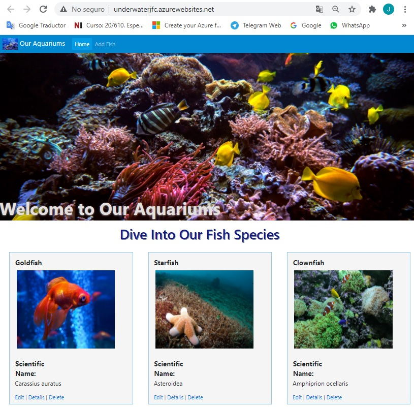

25. En la página **Agregar un pez a un acuario**, en la lista **Acuario**, seleccione **_&lt;Un acuario de su elección&gt;._**.

26. En la página **Agregar un pez al acuario**, en la casilla **Nombre del pez**, escriba **_&lt;Un nombre de pez de su elección&gt;._**.

27. En la página **Agregar un pez al acuario**, en el recuadro **Nombre científico**, escriba **_&lt;Un nombre científico de su elección&gt;._**.

28. En la página **Agregar un pez al acuario**, en el recuadro **Nombre común**, escriba **_&lt;Un nombre común de su elección&gt;._**.

- Página para agregar un pez en la aplicación como se muestra en la siguiente imagen: 

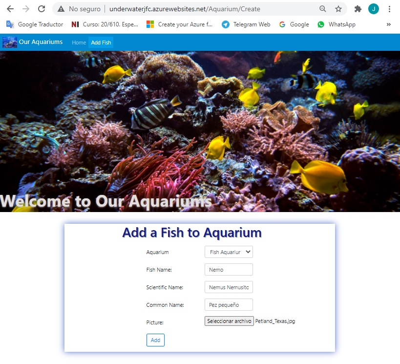

29. En la página **Agregar un pez al acuario**, en el selector de archivos de **Imagen**, ve a **[Repository Root]\Allfiles\Mod14\Labfiles\Images**, haz clic en **tuna.jpg**, y luego haz clic en **Abrir**.

30. En la página de **Agregar un pez al acuario**, haz clic en **Agregar**.

31. En la página **Verificar nuestras especies de peces**, verifique los detalles recién enviados.

- Verificación que el pez ha sido agregado satisfactoriamente como se muestra en la siguiente imagen: 

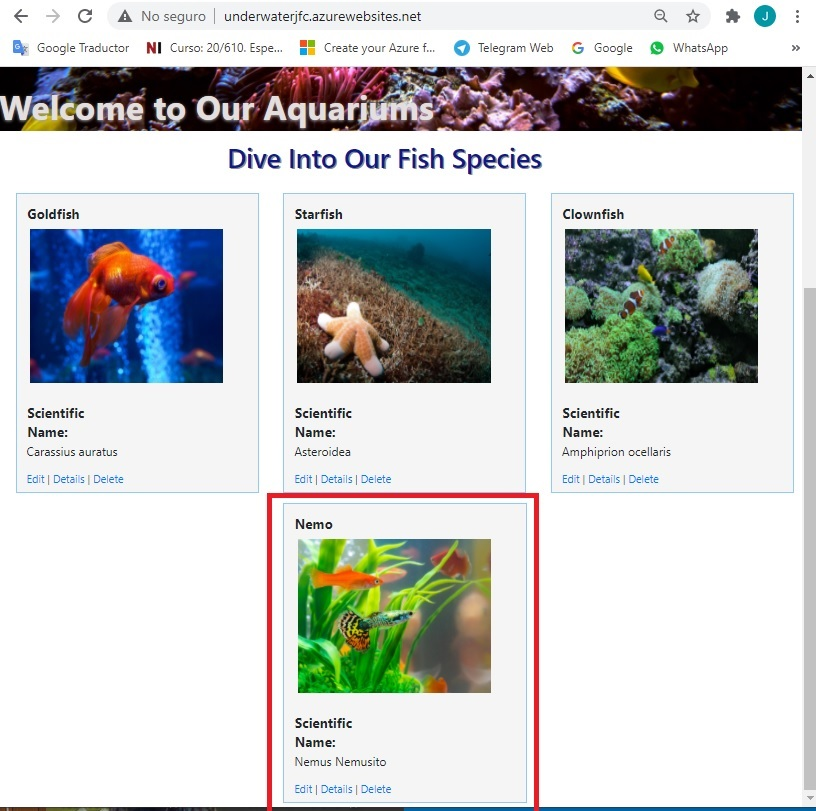

32. En la página **Verificar nuestras especies de peces**, seleccione un pez de su elección y luego haga clic en **Detalles**.

    >**Nota**: El navegador muestra el nombre común del pez.

- Mostrando la página con los detalles de un pez, tal y como se muestra en la siguiente imagen: 

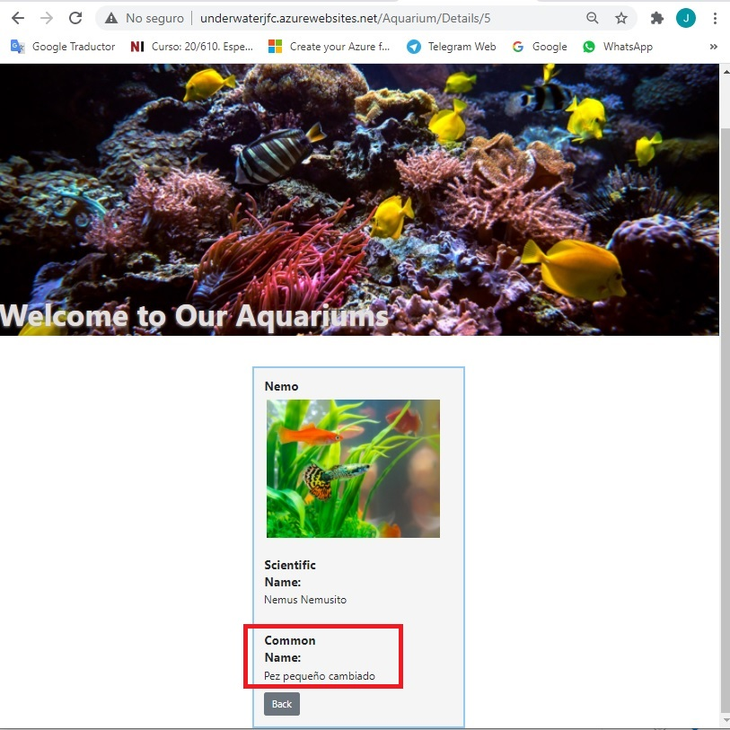

33. Vea los detalles del pez y luego haga clic en **Volver**.

34. En la página **Volver a nuestras especies de peces**, seleccione un pez de su elección y luego haga clic en **Editar**.

35. En la página **Editar pez**, en el cuadro **Nombre científico**, escriba **_&lt;Un nombre científico de su elección... y luego haga clic en **Guardar**.

36. En la página **Ver nuestras especies de peces**, seleccione el pez que ha editado, y luego haga clic en **Detalles**.

37. Vea los detalles del pez, verifique los detalles del pez recién editado y luego haga clic en **Volver**.

38. En la página **Inmersión en nuestras especies de peces**, seleccione un pez de su elección y luego haga clic en **Borrar**.

- Mostrando la página con la que podemos borrar un pez de la aplicación, tal y como se muestra en la siguiente imagen: 

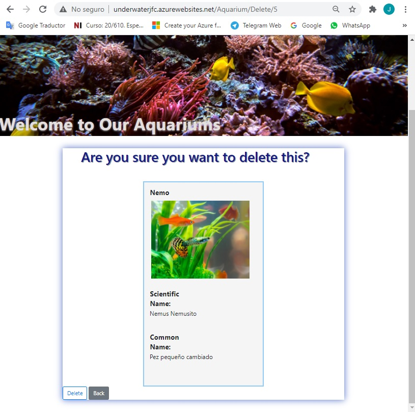

39. En la página **¿Estás seguro de que quieres borrar esto?**, haz clic en **Borrar**.

40. En la página **Verificar nuestras especies de peces**, verifique que el pez ha sido eliminado.

- Mostrando la página donde se verifica que el pez ha sido borrado de la aplicación, tal y como se muestra en la siguiente imagen: 

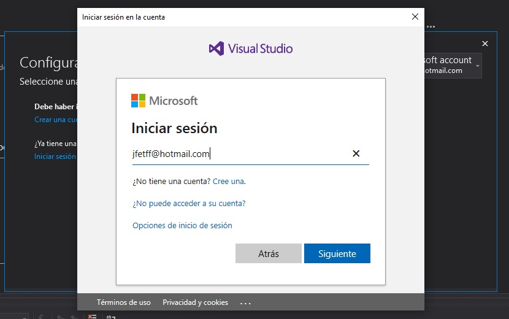

41. En Microsoft Edge, haz clic en **Cerrar**.

>**Resultados**: Después de completar este ejercicio, podrás desplegar tu aplicación en Microsoft Azure.

### Ejercicio 2: Subir una imagen a Azure Blob Storage

#### Tarea 1: Crear una cuenta de almacenamiento blob

1. Abrir Microsoft Edge.

2. En Microsoft Edge, en la barra de direcciones, escribe **http://portal.azure.com**, y luego presiona Enter.

- Mostrando el inicio de seseión para la conexión con el Portal de Azure, tal y como se muestra en la siguiente imagen: 


3. Inicie sesión, y luego pulse **Cuentas de almacenamiento**.

4. En la ventana **Cuentas de almacenamiento**, en la barra de menú, haga clic en **Agregar**.

5. En la ventana **Crear cuenta de almacenamiento** , en el cuadro **Nombre de la cuenta de almacenamiento** , escriba **bajo el agua{nombre único}**.

    >**Nota**: El nombre debe ser único. Puede añadir su nombre, apellido o fecha de nacimiento al nombre actual.

- Mostrando la página donde se define el nombre único del almacenamiento, tal y como se muestra en la siguiente imagen: 

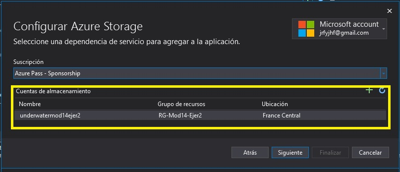

6. En la ventana **Crear cuenta de almacenamiento**, en **Grupo de recursos**, seleccione **Bajo el agua{nombre único}**.

7. En la ventana **Crear cuenta de almacenamiento**, haga clic en **Revisar + crear**.

8. En la ventana **Crear cuenta de almacenamiento**, haga clic en **Crear**.

9. En la ventana **Microsoft.StorageAccount-**{número único} **- Descripción general**, en **Recurso**, haga clic en **bajo el agua{nombre único}**.

10. En la ventana **Underwater{nombre único}**, debajo de **Servicio Blob**, haga clic en **Blobs**.

11. En la ventana **Underwater{nombre único}** **- Blobs**, en la barra de menú, haga clic en **Contenedor**.

- Creando un contenedor bajo la cuenta de almacenamieto 'underwatermod14ejer2', tal y como se muestra en la siguiente imagen: 

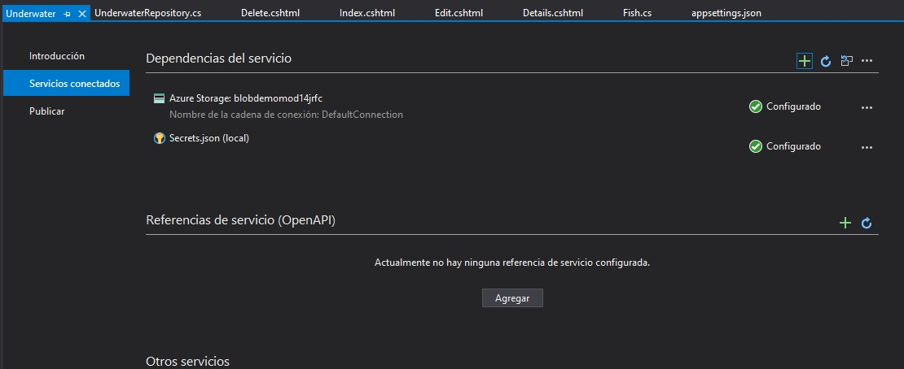

12. En la ventana **Contenedor nuevo**, en la casilla **Nombre**, escriba **acuario**.

- Detalles en la creación del contenedor con su nombre 'Aquarium', tal y como se muestra en la siguiente imagen: 

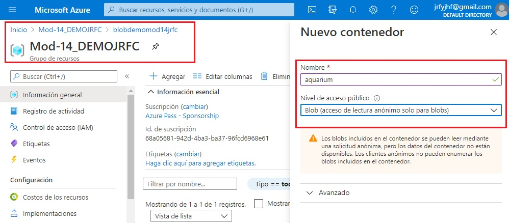

13. En la ventana **Nuevo contenedor**, en la lista desplegable **Nivel de acceso público**, seleccione **Blob(acceso de lectura anónimo sólo para los blobs)**, y luego pulse **OK**.

- Mostrando el resultado de la creación de la cuenta de almacenamiento en el Portal de Azure, tal y como se muestra en la siguiente imagen: 

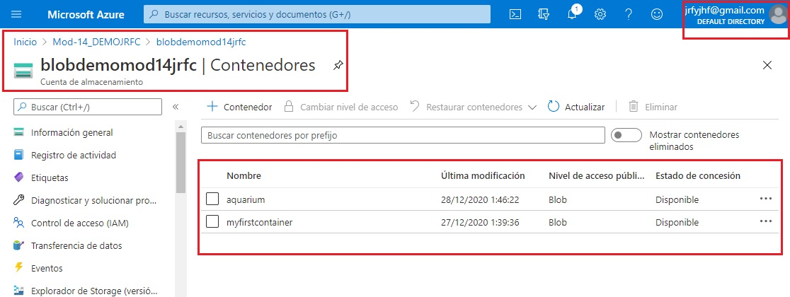

#### Tarea 2: Preparar la aplicación para trabajar con Azure Storage

1. En la ventana **Underwater - Microsoft Visual Studio**, en el Explorador de soluciones, haga clic con el botón derecho del ratón en **Underwater**, apunte a **Agregar**, y luego haga clic en **Servicio conectado**.

- Mostrando la conexión con el servicio conextado con el Portal de Azure, tal y como se muestra en la siguiente imagen: 

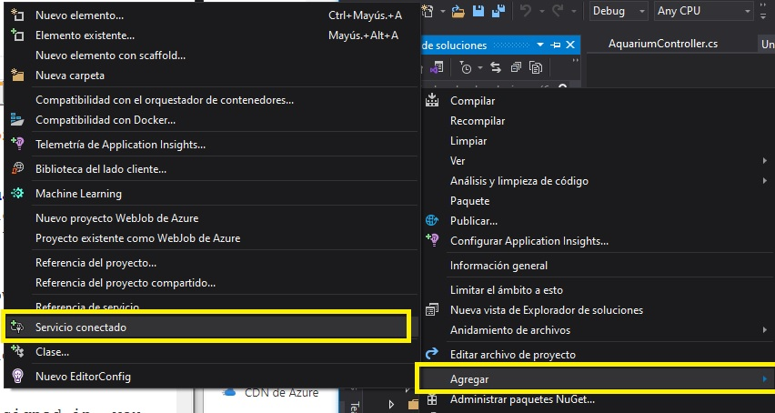

2. En la ventana **Servicios conectados**, haz clic en **Almacenamiento en nube con almacenamiento azul**.

3. En la ventana **Almacenamiento Azure**, inicia sesión en tu cuenta Azure.

    >**Nota**: En caso de que ya hayas iniciado sesión, no verás el cuadro de diálogo **Iniciar sesión**. En ese caso, proceda al siguiente paso.

4. En la ventana **Almacén de Azure**, haga clic en **Almacén de Azure{nombre único}** , y luego haga clic en **Agregar**.

    >Microsoft Edge muestra la siguiente URL: https://docs.microsoft.com/en-us/azure/visual-studio/vs-storage-aspnet-getting-started-blobs.

- Mostrando el Portal de Azure para la creación de un contenedor donde se alojarán los archivos/fotos, tal y como se muestra en la siguiente imagen: 


5. En Microsoft Edge, haga clic en **Cerrar**.

6. En la ventana **Underwater - Microsoft Visual Studio**, en Solution Explorer, haga clic en **appsettings.json**.

7. En **appsettings.json**, localiza el siguiente código:
  ```cs
       "ConnectionStrings": {
  ```

8.  Ponga el cursor antes de **"ConnectionStrings "**, presione Enter, y luego escriba el siguiente código:
  ```cs
       "ContainerSettings": {
           "ContainerName" :  "aquarium"
       },
  ```

- Agregando la configuración del contenedor 'aquarium' en la aplicación, tal y como se muestra en la siguiente imagen: 

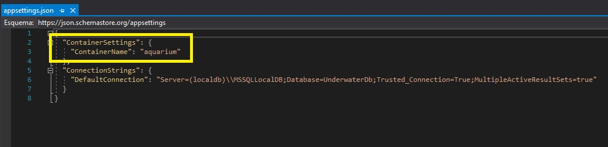

#### Tarea 3: Escribir el código para subir una imagen

1. En la ventana **Underwater - Microsoft Visual Studio**, en el Solution Explorer, amplíe **Models**, y haga clic en **Fish.cs**.

2. En el bloque de código **Fish.cs**, localiza el siguiente código:
  ```cs
       public string ImageMimeType { get; set; }
  ```
3. Ponga el cursor después del signo **}** (cierre de la abrazadera rizada) , presione Enter, y luego escriba el siguiente código:
  ```cs
       public string ImageURL { get; set; }
  ```

- Agregando el código en la clase 'Models/Fish.cs' en la aplicación, tal y como se muestra en la siguiente imagen: 

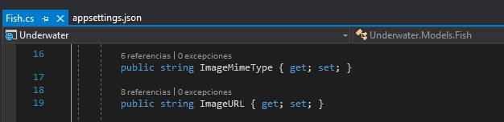

4. En la ventana **Underwater - Microsoft Visual Studio**, en el Solution Explorer, expandir **Views**, expandir **Aquarium**, y luego hacer clic en **Details.cshtml**.

5. En la ventana del código **Details.cshtml**, seleccione el siguiente código:
  ```cs
       @if (Model.ImageName != null)
       {
           <div class="photo-display">
               
           </div>
       }
  ```
6. Sustituya el código seleccionado por el siguiente código:

  ```cs
       @if (Model.ImageName != null)
       {
           @if (Model.ImageURL != null)
           {
               <div class="photo-display">
                   
               </div>
           }
           else
           {
               <div class="photo-display">
                   
               </div>
           }
       }
  ```

Agregando el código en la vista 'Aquarium/Details.cshtml' en la aplicación, tal y como se muestra en la siguiente imagen: 

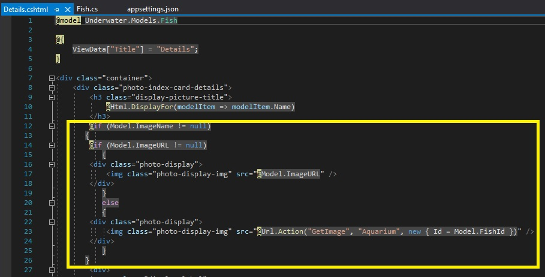

7. En la ventana **Underwater - Microsoft Visual Studio**, en Solution Explorer, en **Views**, en **Aquarium**, haga clic en **Edit.cshtml**.

8. En la ventana **Edit.cshtml** código, seleccione el siguiente código:

  ```cs
       
  ```

9. Reemplazar el código seleccionado por el siguiente código:
  ```cs
       @if (Model.ImageURL != null)
       {
           
       }
       else
       {
           
       }                   
  ```

Agregando el código en la vista 'Aquarium/Edit.cshtml' en la aplicación, tal y como se muestra en la siguiente imagen: 


10. En la ventana **Underwater - Microsoft Visual Studio**, en el Solution Explorer, en **Views**, en **Aquarium**, haga clic en **index.cshtml**.

11. En la ventana **index.cshtml** código, seleccione el siguiente código:
  ```cs
       @if (item.ImageName != null)
       {
           <div>
               
           </div>
       }
  ```
12. Reemplazar el código seleccionado por el siguiente código:
  ```cs
       @if (item.ImageName != null)
       {
           @if (item.ImageURL != null)
           {
               <div class="photo-display">
                   
               </div>
           }
           else
           {
               <div class="photo-display">
                   
               </div>
           }
       }
  ```

Agregando el código en la vista 'Aquarium/Index.cshtml' en la aplicación, tal y como se muestra en la siguiente imagen: 

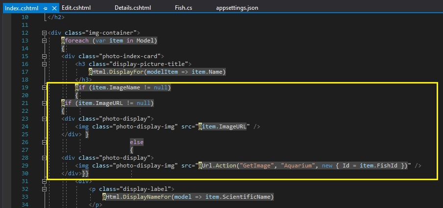

13. En la ventana **Underwater - Microsoft Visual Studio**, en Solution Explorer, en **Views**, en **Aquarium**, haga clic en **delete.cshtml**.

14. En la ventana **delete.cshtml** código, seleccione el siguiente código:
  ```cs
       @if (Model.ImageName != null)
       {
           <div>
               
           </div>
       }
  ```
15. Reemplazar el código seleccionado por el siguiente código:
  ```cs
       @if (Model.ImageName != null)
       {
           @if (Model.ImageURL != null)
           {
                <div>
                    
                </div>
           }
           else
           {
                <div>
                    
                </div>
           }
       }
  ```

Agregando el código en la vista 'Aquarium/Delete.cshtml' en la aplicación, tal y como se muestra en la siguiente imagen: 

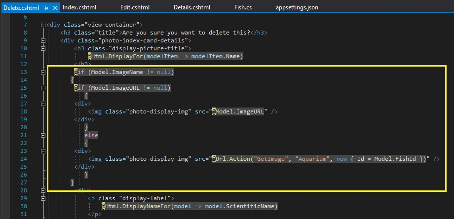

16. En la ventana **Underwater - Microsoft Visual Studio**, en el Explorador de soluciones, haga clic con el botón derecho del ratón en **Underwater**, y luego haga clic en **Manage NuGet Packages**.

17. En el **Gestor de paquetes NuGet: Bajo el agua**, haga clic en **Browse**.

18. En el cuadro **Búsqueda**, escriba **WindowsAzure.Storage**, y luego presione Enter.

19. Haga clic en **WindowsAzure.Storage**, seleccione la versión **9.3.3**, y luego haga clic en **Instalar**.

    >**Nota**: Si ya ha instalado una versión anterior de **WindowsAzure.Storage**, el botón mostrará **Actualizar** en lugar de **Instalar**.

- Instalando el paquete 'WindowsAzure.Storage' por medio del gestor de paquetes NuGet tal y como se muestra en la siguiente imagen: 

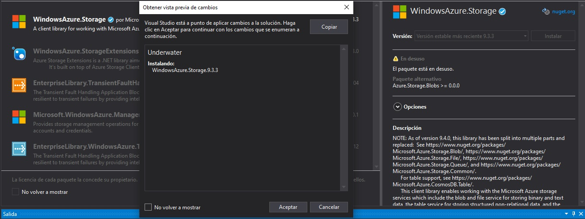

20. Si aparece un cuadro de diálogo de **Vista previa de cambios**, haga clic en **OK**.

21. Si aparece un cuadro de diálogo de **Aceptación de licencia**, haga clic en **Acepto**.

- Resumen de la Instalacion de paquetes 'WindowsAzure.Storage' por medio de la consola de comando de NuGet, tal y como se muestra en la siguiente imagen: 

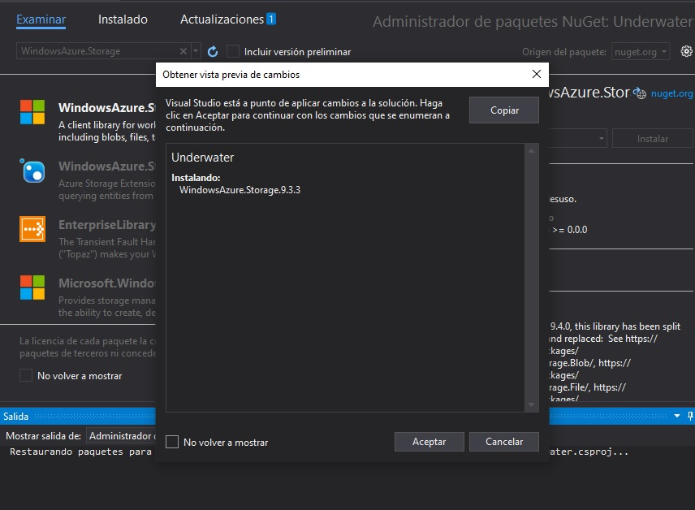

22. Cierre el **Gestor de paquetes NuGet: Bajo el agua**.

23. En la ventana **Underwater - Microsoft Visual Studio**, en el Explorador de soluciones, en **Repositorios**, haga clic en **UnderwaterRepository.cs**.

24. En **UnderwaterRepository.cs**, localice el siguiente código:
  ```cs
       using Underwater.Models;
  ```

25. Asegúrate de que el cursor esté al final del código localizado, pulsa Intro, y luego escribe el siguiente código:
  ```cs
       using Microsoft.WindowsAzure.Storage;
       using Microsoft.WindowsAzure.Storage.Blob;
       using Microsoft.Extensions.Configuration;
       using Microsoft.AspNetCore.Http;
  ```

26. En **UnderwaterRepository.cs**, localiza el siguiente código:
  ```cs
       private UnderwaterContext _context;
  ```

27. Asegúrate de que el cursor esté al final del código localizado, pulsa Intro, y luego escribe el siguiente código:
  ```cs
       private IConfiguration _configuration;
       private CloudBlobContainer _container;
  ```

28. En la ventana del código **UnderwaterRepository.cs**, seleccione el siguiente código:
  ```cs
       public UnderwaterRepository(UnderwaterContext context)
       {
           _context = context;
       }
  ```

29. Reemplazar el código seleccionado por el siguiente código:

  ```cs
       public UnderwaterRepository(UnderwaterContext context, IConfiguration configuration)
       {
           _context = context;
           _configuration = configuration;
           string connectionString = _configuration.GetConnectionString("AzureStorageConnectionString-1");
           string containerName = _configuration.GetValue<string>("ContainerSettings:ContainerName");
           CloudStorageAccount storageAccount = CloudStorageAccount.Parse(connectionString);
           CloudBlobClient blobClient = storageAccount.CreateCloudBlobClient();
           _container = blobClient.GetContainerReference(containerName);
       }
  ```

- Agregando el código en la clase 'UnderwaterRepository.cs' en la aplicación, tal y como se muestra en la siguiente imagen: 

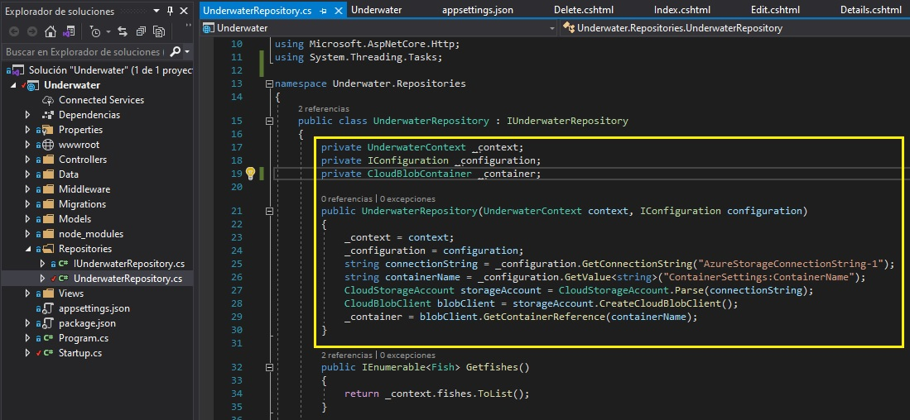

>**Nota**: Asegúrate de que el parámetro *AzureStorageConnectionString-1* es el mismo que el nombre especificado en **appsettings.json**. 

30. Asegúrate de que el cursor está al final del bloque de códigos del método **PopulateAquariumsDropDownList**, presiona Enter dos veces y luego escribe el siguiente código:
  ```cs
       private async Task<string> UploadImageAsync(IFormFile photo)
       {
           CloudBlockBlob blob = _container.GetBlockBlobReference(Path.GetFileName(photo.FileName));
           await blob.UploadFromStreamAsync(photo.OpenReadStream());
           return blob.Uri.ToString();
       }
  ```

31. Asegúrate de que el cursor está al final del bloque de código del método **UploadImageAsync**, presiona Enter dos veces, y luego escribe el siguiente código:
  ```cs
       private async Task<bool> DeleteImageAsync(string PhotoFileName)
       {
           CloudBlockBlob blob = _container.GetBlockBlobReference(PhotoFileName);
           await blob.DeleteAsync();
           return true;
       }
  ```

32. En la ventana del código **UnderwaterRepository.cs**, seleccione el siguiente código:
  ```cs
       public void AddFish(Fish fish)
       {
           if (fish.PhotoAvatar != null && fish.PhotoAvatar.Length > 0)
           {
               fish.ImageMimeType = fish.PhotoAvatar.ContentType;
               fish.ImageName = Path.GetFileName(fish.PhotoAvatar.FileName);
               using (var memoryStream = new MemoryStream())
               {
                   fish.PhotoAvatar.CopyTo(memoryStream);
                   fish.PhotoFile = memoryStream.ToArray();
               }
               _context.Add(fish);
               _context.SaveChanges();
           }
       }
  ```
33. Sustituya el código seleccionado por el siguiente código:
    ```cs
       public void AddFish(Fish fish)
       {
           if (fish.PhotoAvatar != null && fish.PhotoAvatar.Length > 0)
           {
               string imageURL = UploadImageAsync(fish.PhotoAvatar).GetAwaiter().GetResult();
               fish.ImageURL = imageURL;
               fish.ImageMimeType = fish.PhotoAvatar.ContentType;
               fish.ImageName = Path.GetFileName(fish.PhotoAvatar.FileName);
               _context.Add(fish);
               _context.SaveChanges();
           }
       }
  ```

34. En la ventana del código **UnderwaterRepository.cs**, seleccione el siguiente código:
  ```cs
       public void RemoveFish(int id)
       {
           var fish = _context.fishes.SingleOrDefault(f => f.FishId == id);
           _context.fishes.Remove(fish);
           _context.SaveChanges();
       }
  ```
35. Sustituya el código seleccionado por el siguiente código:
    ```cs
       public void RemoveFish(int id)
       {
           var fish = _context.fishes.SingleOrDefault(f => f.FishId == id);
           if (fish.ImageURL != null)
           {
               DeleteImageAsync(fish.ImageName).GetAwaiter().GetResult();
           }
           _context.fishes.Remove(fish);
           _context.SaveChanges();
       }
  ```

- Visualizando el código en la clase 'UnderwaterRepository.cs' en la aplicación, tal y como se muestra en la siguiente imagen: 

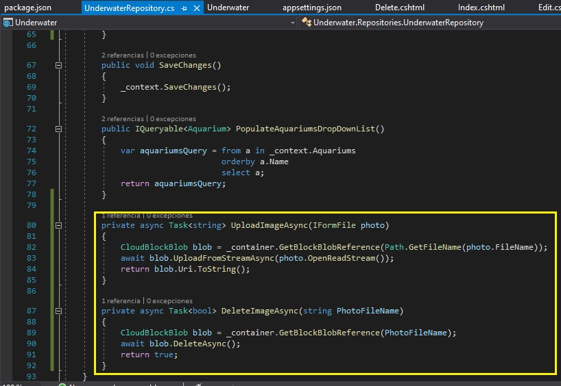

36. En la ventana **Underwater - Microsoft Visual Studio**, en el menú **FILE**, haga clic en **Save All**.

37. En la ventana **Underwater - Microsoft Visual Studio**, en el menú **TOOLS**, apunte a **NuGet Package Manager**, y luego haga clic en **Package Manager Console**.

38. En la pestaña **Package Manager Console**, escriba el siguiente comando y luego presione Enter.
  ```cs
       Add-Migration AddFishImageURL
  ```
- Visualizando la ejecución del comando 'Add-Migration AddFishImageURL' por medio de la consola del Packega Manager de NuGet tal y como se muestra en la siguiente imagen: 


39. En la pestaña **Consola de Administración de Paquetes**, escriba el siguiente comando y luego presione Enter.
  ```cs
       Update-Database
  ```

>**Nota**: En la ventana **Underwater - Microsoft Visual Studio**, en el Solution Explorer, en **Migraciones**, se crea un nuevo archivo.

- Visualizando la ejecución del comando 'Update-Database' por medio de la consola del Packega Manager de NuGet tal y como se muestra en la siguiente imagen: 


#### Tarea 4: Desplegar y ejecutar la aplicación en Azure

1. En la ventana **UnderWater - Microsoft Visual Studio**, abra el Solution Explorer, haga clic con el botón derecho del ratón en **UnderWater**, y luego haga clic en **Publish**.

2. En la ventana **Publicar**, junto al botón **Publicar**, asegúrese de que **Underwater{nombre único}** esté seleccionado en la lista desplegable y, a continuación, haga clic en **Publicar**.

3. En Microsoft Edge, en la barra de menú, haga clic en **Agregar pez**.
 
4. En la página **Agregar un pez a un acuario**, en la lista **Acuario**, seleccione **_&lt;Un acuario de su elección&gt;._**.


5. En la página **Agregar un pez al acuario**, en la casilla **Nombre del pez**, escriba **_&lt;Un nombre de pez de su elección&gt;._**.

6. En la página **Agregar un pez al acuario**, en la casilla **Nombre científico**, escriba **_&lt;Un nombre científico de su elección&gt;._**.

7. En la página **Agregar un pez al acuario**, en el recuadro **Nombre común**, escriba **_&lt;Un nombre común de su elección&gt;._**.

8. En la página **Agregar un pez al acuario**, en el selector de archivos de **Imagen**, ve a **[Repository Root]\Allfiles\Mod14\Labfiles\Images**, haz clic en **Clown-trigger.jpg**, y luego haz clic en **Abrir**.

9.  En la página de **Agregar un pez al acuario**, haz clic en **Agregar**.

10. En la página **Verificar nuestras especies de peces**, verifique los detalles recién enviados.

11. Cierra la ventana de **Microsoft Edge**.

12. En la ventana **UnderWater - Microsoft Visual Studio**, en el menú **FILE**, haga clic en **Salir**.

13. En Microsoft Edge, abre una nueva pestaña, escribe **http://portal.azure.com**, y luego presiona Enter.

14. En el portal, en el menú de la izquierda, haz clic en **Cuentas de almacenamiento**. 
	
15. En la ventana **Cuentas de almacenamiento**, haga clic en **Underwater{nombre único}**.

16. En la ventana **Underwater{nombre único}**, debajo de **Servicios Globales**, haga clic en **Blobos**.

17. En la ventana **Blobs**, haga clic en **acuario**.

    >**Nota**: Verificar la presencia de la imagen cargada.

18. Haz clic en **clown-trigger.jpg**.

19. Haz clic en **Editar mancha**.

    >**Nota**: Se muestra la imagen cargada.

20. Cierra Microsoft Edge.

>**Resultados**: Después de completar este ejercicio, podrás desarrollar aplicaciones que usen el almacenamiento de Azure Blob.


