# Módulo 3: Configuración del middleware y los servicios en el ASP.NET Core


Siempre cuando un camino comienza con  *[Repository Root]*, reemplacelo con el camino absoluto en el que el repositorio 20486 reside. Por ejemplo, si tu has cloneado o extraido el repositorio 20486 en la carpeta **C:\Users\John Doe\Downloads\20486**, cambiar la ruta de: **[Repository Root]\AllFiles\20486D\Mod01** a **C:\Users\John Doe\Downloads\20486\AllFiles\20486D\Mod01**.

Fichero de Instrucciones: Instructions\20486D_MOD03_LAK.md

**Información:**

1. **Nombres y apellidos:** José René Fuentes Cutz
2. **Fecha:** 24 de Noviembre 2020.
3. **Resumen del Ejercicio:** Este laboratorio consta de 4 ejercicio:
- En el Primer ejercicio nos muestra como usar datos de archivos estáticos dentro de un proyecto de Microsoft ASP.NET Core.
- En el Segundo ejercicio crearemos un middleware personalizado, así como la manera de recibir datos que le han sido enviado.
- En el Tercer ejercicio hacemos lo posible para poder registrar un servicio en el método **ConfigureServicces** y utilizar el servicio en el método **Configure** utilizando la inyección de dependencia.
- En el Cuarto ejercicio creamos un Controller, además de  inyectar un servicio en él con inyección de dependencia.


4. **Dificultad o problemas presentados y como se resolvieron:** Errores en la consola del programa, la página web no realizaba los cambios solicitados, etc.

**NOTA**: Si no hay descripcion de problemas o dificultades, y al yo descargar el código para realizar la comprobacion y el código no funcionar, el resultado de la califaciación del laboratorio será afectado.

# Laboratorio: Configuración de middleware y servicios en ASP.NET Core 

### Configuración del Lab 

Tiempo estimado: **75 minutos**

### Pasos de Preparación 

Asegúrate de que has clonado el directorio 20486D de GitHub. Contiene los segmentos de código para los laboratorios y demostraciones de este curso. (**https://github.com/MicrosoftLearning/20486D-DevelopingASPNETMVCWebApplications/tree/master/Allfiles**).

### Ejercicio 1: Trabajando con archivos estáticos

#### Tarea 1: Crear un nuevo proyecto utilizando la plantilla del proyecto ASP.NET Core Empty


1. Inicie Microsoft Visual Studio 2019.

2. En la ventana **Página de inicio - Microsoft Visual Studio**, en el menú **Archivo**, apunta a **Nuevo**, y luego haz clic en **Proyecto**.

3. En el cuadro de diálogo **Nuevo Proyecto**, en el panel de navegación, expanda **Instalado**, y luego haga clic en **Visual C#**.

4. En el cuadro de diálogo **Nuevo Proyecto**, en el panel de resultados, haga clic en **Aplicación Web Principal de ASP.NET**.

5. En el cuadro **Nombre**, introduzca **PollBall**.

6. En el cuadro **Localización**, introduzca **[Raíz del repositorio]Allfiles\Mod03\Labfiles\01_PollBall_begin**, y luego haga clic en **OK**.

7. En el cuadro de diálogo **Nueva Aplicación Web Principal ASP.NET - Poll-Ball**, en el panel de resultados, haz clic en **Vacío**. Asegúrate de que las casillas de verificación están despejadas, y luego haz clic en **OK**.

8. En la ventana **PollBall - Microsoft Visual Studio**, en el menú **DEBUG**, haga clic en **Iniciar sin depuración**.

- La representación visual a la respuesta del último ejercicio se muestra en la siguiente imagen:

 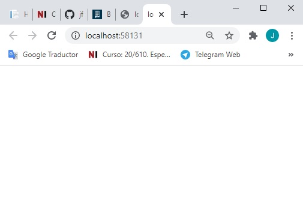

9. En Microsoft Edge, en la barra de direcciones, anota el número de puerto que aparece al final del URL **http://localhost:[port]**. Usarás el número de puerto durante este laboratorio.

10. En Microsoft Edge, haz clic en **Cerrar**.

11. En la ventana **PollBall - Microsoft Visual Studio**, en Solution Explorer, haga clic en **Startup.cs**.

12. En la ventana de código **Startup.cs**, borre cualquier comentario existente en el archivo.

13. En la ventana del código **Startup.cs**, borre el método **Configure** con su contenido.

14. En la ventana del código **Startup.cs**, coloque el cursor debajo del método **ConfigureServices** y escriba el siguiente código:
```cs
    public void Configure(IApplicationBuilder app)
    {
        app.Run(async (context) =>
        {
             await context.Response.WriteAsync("This text was generated by the app.Run middleware.");
        });
    }
```

#### Tarea 2: Ejecutar la aplicación

1. En la ventana **PollBall - Microsoft Visual Studio**, en el menú **FILE**, haga clic en **Save All**.

2. En la ventana **PollBall - Microsoft Visual Studio**, en el menú **DEBUG**, haga clic en **Iniciar sin depuración**.
> **Nota**: El navegador muestra **Este texto fue generado por el app.Run middleware.**

- La representación visual a la respuesta del último ejercicio se muestra en la siguiente imagen:

 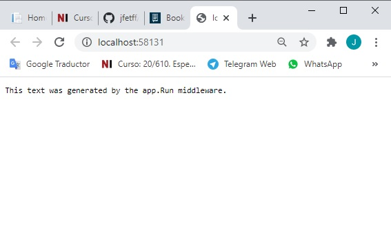

3. En Microsoft Edge, haga clic en **Cerrar**.

#### Tarea 3: Añadir un archivo HTML a la carpeta wwwroot

1. En la ventana **PollBall - Microsoft Visual Studio**, en el Explorador de Soluciones, haga clic con el botón derecho **wwwwroot**, apunte a **Agregar**, y luego haga clic en **Nueva Carpeta**.

2. En el cuadro **Nueva Carpeta**, apunte a **css**, y luego pulse Intro.

3. En el Explorador de Archivos, ve a **[Raíz del Repositorio]Allfiles\Mod03\Labfiles\01_PollBall_begin**.

4. En la ventana **01_PollBall_begin**, haz clic con el botón derecho del ratón en **style.css**, y luego haz clic en **Copy**.

5. En el Explorador de Archivos, navega a **[Repository Root]Allfiles\Mod03\Labfiles\01_PollBall_begin\PollBall\PollBall\wwwroot\css**.

6. En el Explorador de Archivos, haz clic con el botón derecho en un espacio vacío, y luego haz clic en **Pegar**.
    > **Nota**: Verifica que en el Explorador de Soluciones, bajo **wwwwroot**, bajo **css**, se muestra el archivo **style.css**.

- La representación visual a la respuesta del último ejercicio se muestra en la siguiente imagen:

 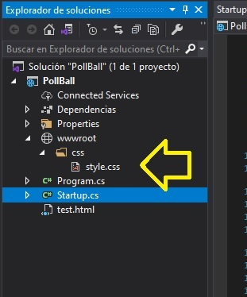

7. En el Explorador de Archivos, busque en **[Raíz del Repositorio]Allfiles\Mod03\Labfiles\01_PollBall_begin**.

8.	En la ventana **01_PollBall_begin**, haz clic con el botón derecho del ratón en **images**, y luego haz clic en **Copiar**.

9. En el Explorador de Archivos, navega a **[Raíz del Repositorio]Allfiles\Mod03\Labfiles\01_PollBall_begin\PollBall\wwwwroot**.

10. En el Explorador de archivos, haz clic con el botón derecho del ratón en un espacio vacío y luego haz clic en **Pegar**.
    > **Nota**: Verifica que en el Explorador de Soluciones, en **wwwwroot**, se muestra la carpeta **imágenes**.

- La representación visual a la respuesta del último ejercicio se muestra en la siguiente imagen:

 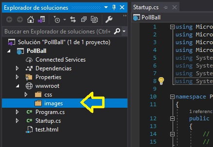

11. En la ventana **PollBall - Microsoft Visual Studio**, en el Explorador de soluciones, haga clic con el botón derecho del ratón en **wwwwroot**, apunte a **Agregar** y luego haga clic en **Nuevo elemento**.

12. En el cuadro de diálogo **Agregar nuevo elemento - Poll-Ball**, expandir **Instalado**, apuntar a **ASP.NET Core**, y luego hacer clic en **Página HTML**.

13. En el cuadro de diálogo **Agregar nuevo elemento - Poll-Ball**, en el cuadro **Nombre**, introduzca **Poll-Ball**, y luego haga clic en **Agregar**.

- La representación visual a la respuesta del último ejercicio se muestra en la siguiente imagen:

 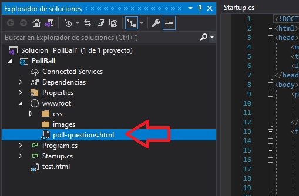

14. En la ventana de código **poll-questions.html**, en el elemento **BODY**, ingrese el siguiente código, y luego presione Enter.
```cs
    <p>
        <h1>Favorite Ball Game Poll</h1>
        Please select your favorite ball game, and then press Submit Poll.
    </p>
  ```

15. En el elemento **BODY**, debajo del elemento **P**, introduzca el siguiente código:
  ```cs
    <form class="submit-form">
        <div class="main-div">

        </div>
        <div class="submit-batch">
            <input type="submit" value="Submit Poll" />
        </div>
    </form>
  ```

16. En el elemento **DIV**, en el atributo de clase **main-div**, introduzca el siguiente código, y luego pulse Intro.

```cs
    <div class="main-batch1">
        <div class="item">
            <div class="img-item"></div>
            <div class="input-item"><input type="radio" name="favorite" value="Basketball"> Basketball</div>
        </div>
        <div class="item">
            <div class="img-item"></div>
            <div class="input-item"><input type="radio" name="favorite" value="Football"> Football</div>
        </div>
        <div class="item">
            <div class="img-item"></div>
            <div class="input-item"><input type="radio" name="favorite" value="Soccer"> Soccer</div>
        </div>
        <div class="item">
            <div class="img-item"></div>
            <div class="input-item"><input type="radio" name="favorite" value="Volleyball"> Volleyball</div>
        </div>
    </div>
```

17. En el elemento **DIV**, en el atributo de la clase **main-div**, abajo del código que recién ha agregado, agregue el siguiente código:

  ```cs
    <div class="main-batch2">
        <div class="item">
            <div class="img-item"></div>
            <div class="input-item"><input type="radio" name="favorite" value="Billiard"> Billiard</div>
        </div>
        <div class="item">
            <div class="img-item"></div>
            <div class="input-item"><input type="radio" name="favorite" value="Golf"> Golf</div>
        </div>
        <div class="item">
            <div class="img-item"></div>
            <div class="input-item"><input type="radio" name="favorite" value="Hockey"> Hockey</div>
        </div>
        <div class="item">
            <div class="img-item"></div>
            <div class="input-item"><input type="radio" name="favorite" value="Tennis"> Tennis</div>
        </div>
    </div>
  ```

- La representación visual a la respuesta del último ejercicio se muestra en la siguiente imagen:

 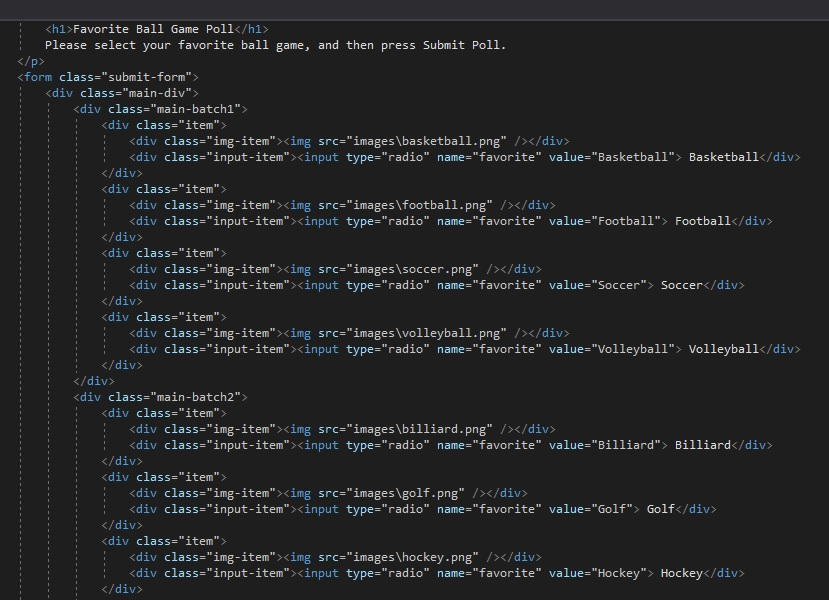

#### Tarea 4: Ejecutar la aplicación - el contenido del archivo HTML no se muestra

1. En la ventana **PollBall - Microsoft Visual Studio**, en el menú **FILE**, haga clic en **Save All**.

2. En la ventana **PollBall - Microsoft Visual Studio**, en el menú **DEBUG**, haga clic en **Iniciar sin depuración**.

3. En Microsoft Edge, en la barra de direcciones, introduce **http://localhost:[port]/poll-questions.html**, y luego pulsa Intro.
    > **Nota**: El navegador muestra **Este texto fue generado por el app.Run middleware.** y no el contenido del archivo **poll-questions.html**.

- La representación visual a la respuesta del último ejercicio se muestra en la siguiente imagen:

 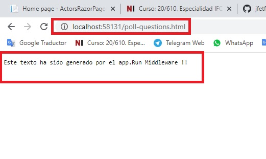

4. En Microsoft Edge, haga clic en **Cerrar**.
 
#### Tarea 5: Habilitar el trabajo con archivos estáticos

1. En la ventana **PollBall - Microsoft Visual Studio**, en el Explorador de Soluciones, haga clic en **Startup.cs**.

2. En la ventana del código **Startup.cs**, localice el siguiente código:
  ```cs
    public void Configure(IApplicationBuilder app)
    {
  ```

3. Ponga el cursor después del signo **{** (abra las abrazaderas), pulse Intro, introduzca el siguiente código y  luego pulse Intro.
```cs
    app.UseStaticFiles();
```

- La representación visual a la respuesta del último ejercicio se muestra en la siguiente imagen:

 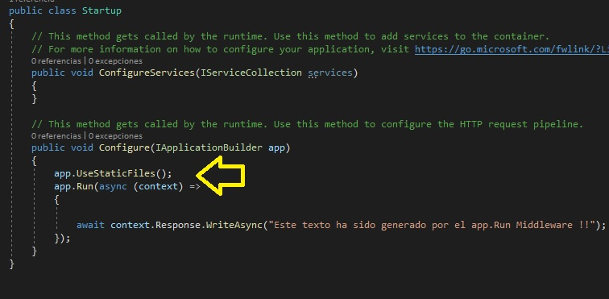

#### Tarea 6: Ejecutar la aplicación - el contenido del archivo HTML se muestra

1. En la ventana **PollBall - Microsoft Visual Studio**, en el menú **FILE**, haga clic en **Save All**.

2. En la ventana **PollBall - Microsoft Visual Studio**, en el menú **DEBUG**, haga clic en **Iniciar sin depuración**.

3. En Microsoft Edge, en la barra de direcciones, introduce **http://localhost:[port]/poll-questions.html**, y luego pulsa Intro.
    >**Nota**: El navegador muestra el contenido del archivo **poll-questions.html**, pero el contenido HTML no está diseñado por un archivo CSS todavía.

- La representación visual a la respuesta del último ejercicio se muestra en la siguiente imagen:

 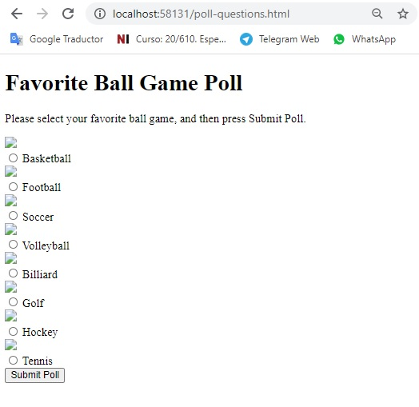

4. En Microsoft Edge, haga clic en **Cerrar**.

5. En el Explorador de soluciones, en **wwwwroot**, haga clic en **poll-questions.html**.

6. En la ventana de código **poll-questions.html**, en el elemento **HEAD**, debajo del elemento **TITLE**, introduzca el siguiente código:
```cs
    <link type="text/css" rel="stylesheet" href=  ```css/style.css" />
```

7. En la ventana **PollBall - Microsoft Visual Studio**, en el menú **FILE**, haga clic en **Save All**.

8. En la ventana **PollBall - Microsoft Visual Studio**, en el menú **DEBUG**, haga clic en **Iniciar sin depuración**.

9. En Microsoft Edge, en la barra de direcciones, introduzca **http://localhost:[port]/poll-questions.html**, y luego presione Enter.
     > **Nota**: El navegador muestra el contenido del archivo **poll-questions.html** que está diseñado usando el archivo **style.css**.

- La representación visual a la respuesta del último ejercicio se muestra en la siguiente imagen:

 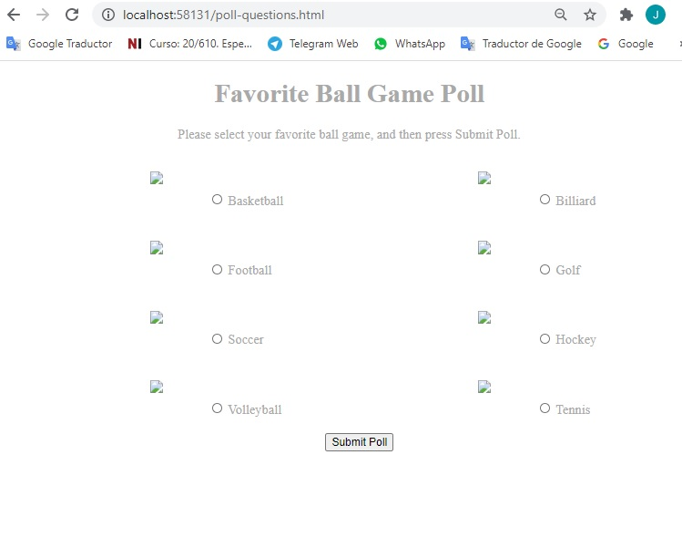

10. En Microsoft Edge, haga clic en **Cerrar**.

#### Tarea 7: Añadir un archivo HTML fuera de la carpeta wwwroot

1. En el Explorador de Archivos, navega a **[Raíz del Repositorio]Allfiles\Mod03\Labfiles\01_PollBall_begin**, haz clic con el botón derecho del ratón en **test.html**, y luego haz clic en **Copiar**. 

2. En el Explorador de Archivos, navega a **[Repository Root]Allfiles\Mod03\Labfiles\01_PollBall_begin\PollBall\PollBall**, haz clic con el botón derecho en un espacio vacío, y luego haz clic en **Pegar**.

- La representación visual a la respuesta del último ejercicio se muestra en la siguiente imagen:

 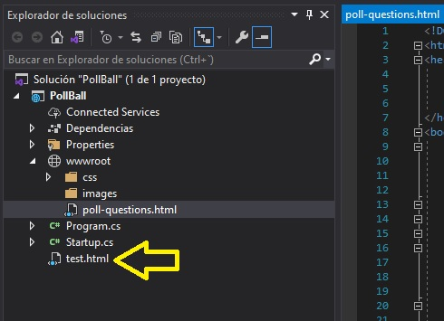

#### Tarea 8: Ejecutar la aplicación - el contenido del archivo HTML fuera de la carpeta wwwroot no se muestra

1. En la ventana **PollBall - Microsoft Visual Studio**, en el menú **DEBUG**, haga clic en **Start Without Debugging**.

2. En Microsoft Edge, en la barra de direcciones, introduce **http://localhost:[port]/test.html**, y luego pulsa Intro.
     >**Nota**: El navegador muestra **Este texto fue generado por la aplicación.Run middleware.** Por defecto, el navegador no puede mostrar archivos estáticos que estén fuera del directorio **wwwwroot**.

- La representación visual a la respuesta del último ejercicio se muestra en la siguiente imagen:

 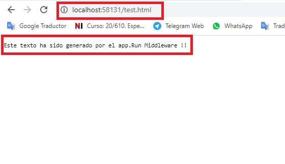

3. En Microsoft Edge, haga clic en **Cerrar**.

>**Resultado**: Al final de este ejercicio, podrá trabajar con archivos estáticos dentro de un proyecto Microsoft ASP.NET Core.

### Ejercicio 2: Creación de un Middleware personalizado

#### Tarea 1: Crear un middleware

1. En la ventana **PollBall - Microsoft Visual Studio**, en el Explorador de Soluciones, haga clic en **Startup.cs**.

2. En la ventana del código **Startup.cs**, localice el siguiente código:
```cs
    public void Configure(IApplicationBuilder app)
    {
```

3. Ponga el cursor después del signo **{** (abra las abrazaderas), pulse Intro, introduzca el siguiente código y luego pulse Intro.
```cs
    app.Use(async (context, next) =>
    {
    
    });
```

4. Ponga el cursor dentro del bloque de código **app.Use**, y luego introduzca el siguiente código:

```cs
    if (context.Request.Query.ContainsKey("favorite"))
    {
    
    }
``` 


5. En el bloque de código de declaración **if**, introduzca el siguiente código y luego presione Enter dos veces.
 ```cs
    string selectedValue = context.Request.Query["favorito"];
 ```

6. En el bloque de código de la declaración **if**, bajo la última declaración que introdujo, introduzca el siguiente código:
  ```cs
      await context.Response.WriteAsync("Selected value is: " + selectedValue);
  ```
7. En el bloque de código **app.Use**, coloque el cursor después del signo **}** (llaves de cierre) de la declaración **if**, presione Enter, y luego introduzca el siguiente código:
```cs
    else 
    {
        await next.Invoke();
    }
 ```

- La representación visual a la respuesta del último ejercicio se muestra en la siguiente imagen:

 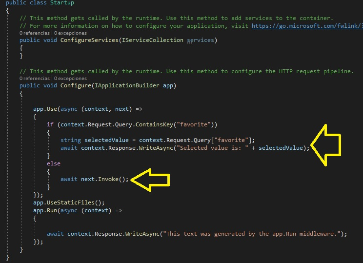

#### Tarea 2: Ejecutar la aplicación

1. En la ventana **PollBall - Microsoft Visual Studio**, en el menú **FILE**, haga clic en **Save All**.

2. En la ventana **PollBall - Microsoft Visual Studio**, en el menú **DEBUG**, haga clic en **Iniciar sin depuración**.

3. En Microsoft Edge, en la barra de direcciones, introduce **http://localhost:[port]/poll-questions.html**, y luego pulsa Intro.

- La representación visual a la respuesta del último ejercicio se muestra en la siguiente imagen:

 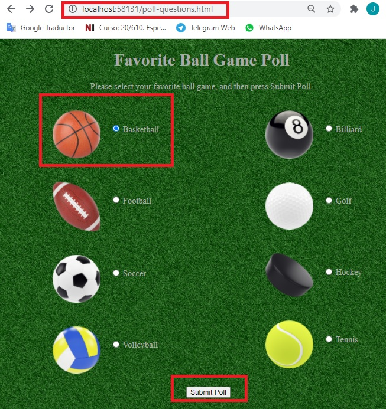

4. En Microsoft Edge, haz clic en **Basketball**, y luego en **Submit Poll**.
     >**Nota**: El navegador muestra **Valor seleccionado es: Baloncesto**, que es generado por el middleware **app.Use**.

- La representación visual a la respuesta del último ejercicio se muestra en la siguiente imagen:

 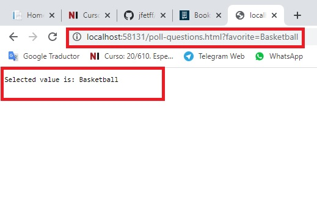

5. En Microsoft Edge, haga clic en **Cerrar**.
 
#### Tarea 3: Cambiar el orden del middleware

1. En la ventana **PollBall - Microsoft Visual Studio**, en el Explorador de Soluciones, haga clic en **Startup.cs**.

2. En la ventana del código **Startup.cs**, seleccione el siguiente código:
```cs
    app.UseStaticFiles();
```

3. Haga clic con el botón derecho del ratón en el código seleccionado y luego haga clic en **Cut**.

4. En la ventana del código **Startup.cs**, localice el siguiente código:
```cs
    public void Configure(IApplicationBuilder app)
    {
```

5. Coloque el cursor después del signo **{** (llaves), pulse Intro, haga clic con el botón derecho del ratón en la ubicación del cursor, haga clic en **Pegar** y, a continuación, pulse Intro.

6. En la ventana **PollBall - Microsoft Visual Studio**, en el menú **ARCHIVO**, haga clic en **Guardar todo**.

- La representación visual a la respuesta del último ejercicio se muestra en la siguiente imagen:

 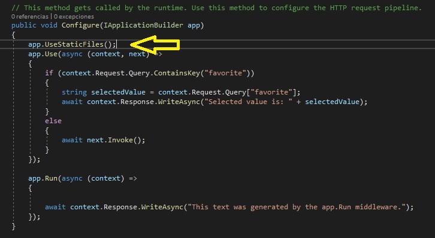

7. En la ventana **PollBall - Microsoft Visual Studio**, en el menú **DEBUG**, haga clic en **Iniciar sin depuración**.

8. En Microsoft Edge, en la barra de direcciones, introduce **http://localhost:[port]/Poll-Ball.html**, y luego pulsa Intro.

9. En Microsoft Edge, haz clic en **Basketball**, y luego en **Submit Poll**.
     >**Nota**: El navegador muestra el contenido del archivo **Poll-Ball.html** ubicado en la carpeta **wwwwroot** porque la solicitud fue capturada por el middleware **UseStaticFiles** sin ejecutar el middleware **app.Use**.

- La representación visual a la respuesta del último ejercicio se muestra en la siguiente imagen:

 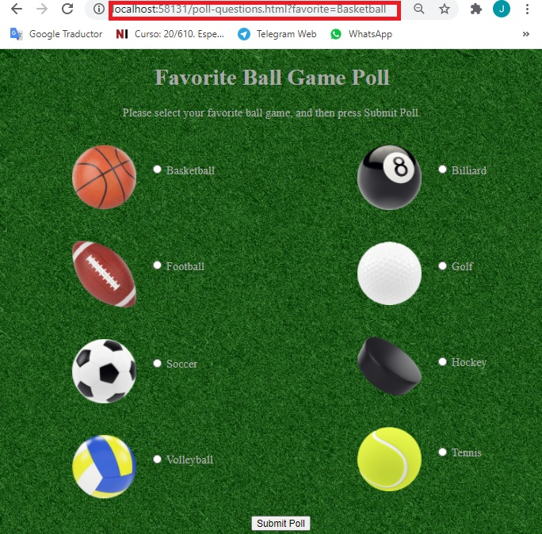

10. En Microsoft Edge, haga clic en **Cerrar**.

11. En la ventana del código **Startup.cs**, seleccione el siguiente código:
```cs
    app.UseStaticFiles();
```

12. Haga clic con el botón derecho del ratón en el código seleccionado y luego haga clic en **Cut**.

13. En la ventana del código **Startup.cs**, localice el siguiente código:
```cs
    app.Use(async (context, next) =>
    {
        if (context.Request.Query.ContainsKey("favorite"))
        {
            string selectedValue = context.Request.Query["favorite"];
            await context.Response.WriteAsync("Selected value is: " + selectedValue);
        }
        else
        {
            await next.Invoke();
        }
    });
```

14. Coloca el cursor al final del código localizado, pulsa Intro dos veces, haz clic con el botón derecho del ratón en el lugar del cursor y luego pulsa **Pegar**. 

15. En la ventana del código **Startup.cs**, seleccione el siguiente código:
```cs
    else 
    {
        await next.Invoke();
    }
```

16. Sustituya el código seleccionado por el siguiente código:
  ```cs
    //else 
    //{
    //    await next.Invoke();
    //}
  ```

- La representación visual a la respuesta del último ejercicio se muestra en la siguiente imagen:

 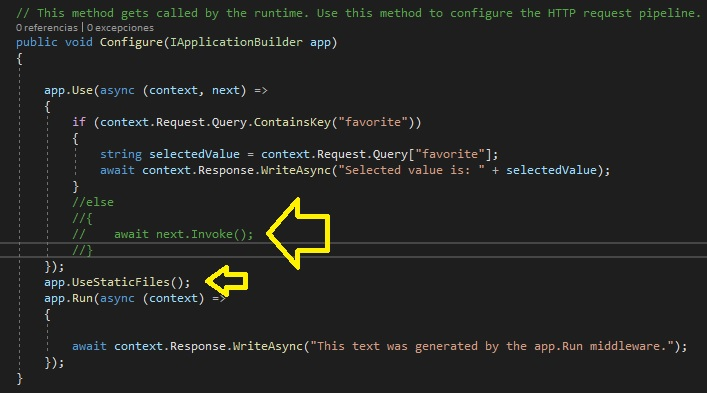

17. En la ventana **PollBall - Microsoft Visual Studio**, en el menú **FILE**, haga clic en **Save All**.

18. En la ventana **PollBall - Microsoft Visual Studio**, en el menú **DEBUG**, haga clic en **Iniciar sin depuración**.

19. En Microsoft Edge, en la barra de direcciones, introduce **http://localhost:[port]/Poll-Ball.html**, y luego pulsa Intro.

    >**Nota**: El navegador muestra una página vacía, comentando la llamada al método **next.Invoke()** que impide la invocación del método **UseStaticFiles**. 

- La representación visual a la respuesta del último ejercicio se muestra en la siguiente imagen:

 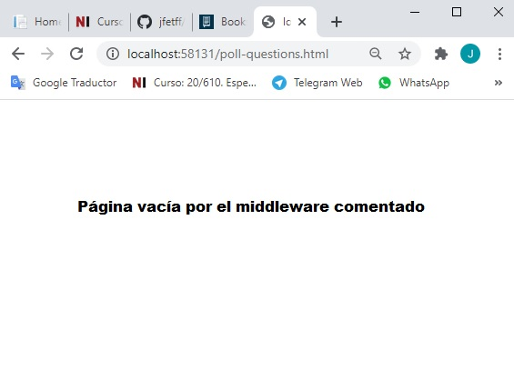

20. En Microsoft Edge, haz clic en **Cerrar**.

21. En la ventana del código **Startup.cs**, seleccione el siguiente código:

  ```cs
    //else 
    //{
    //    await next.Invoke();
    //}
  ```

22. Reemplace el código seleccionado con el siguiente código:
```cs
    else 
    {
        await next.Invoke();
    }
```


>**Resultado**: Al final de este ejercicio, usted será capaz de crear un middleware personalizado y recibir los datos de los formularios enviados a él.

### Ejercicio 3: Usando la inyección de dependencia

#### Tarea 1: Definir una interfaz para un servicio

1. En la ventana **PollBall - Microsoft Visual Studio**, en el Explorador de Soluciones, haga clic con el botón derecho **PollBall**, apunte a **Agregar**, y luego haga clic en **Nueva Carpeta**.

2. En el cuadro **Nueva Carpeta**, apunte a **Servicios**, y luego presione Enter.

3. En la ventana **PollBall - Microsoft Visual Studio**, en el Explorador de soluciones, haga clic con el botón derecho del ratón en **Servicios**, señale a **Agregar**, y luego haga clic en **Clase**.

4. En el cuadro de diálogo **Agregar nuevo elemento - Poll-Ball**, en el cuadro **Nombre**, escriba **Juego Seleccionado**, y luego haga clic en **Agregar**.

5. En la ventana de código **SelectedGame.cs**, seleccione el siguiente código:
```cs
    public class SelectedGame
```

6. Sustituya el código seleccionado por el siguiente código:
  ```cs
    public enum SelectedGame
  ```

7. Ponga el cursor dentro del bloque de código **SelectedGame** enum, pulse Enter, y luego introduzca el siguiente código:
  ```cs
    Basketball,
    Football,
    Soccer,
    Volleyball,
    Billiard,
    Hockey,
    Golf,
    Tennis
  ```
- La representación visual a la respuesta del último ejercicio se muestra en la siguiente imagen:

 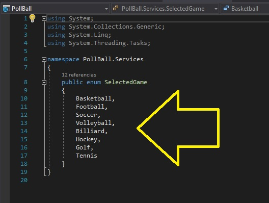

8. En la ventana **PollBall - Microsoft Visual Studio**, en el Explorador de Soluciones, haga clic con el botón derecho en **Servicios**, apunte a **Agregar**, y luego haga clic en **Nuevo elemento**.

9. En el cuadro de diálogo **Agregar nuevo elemento - Poll-Ball**, haga clic en **Interfaz**.

10. En el cuadro de diálogo **Agregar nuevo elemento - Poll-Ball**, en el cuadro **Nombre**, apunte a **IPollResultsService**, y luego haga clic en **Agregar**.

11. En la ventana de código **IPollResultsService.cs**, seleccione el siguiente código:
```cs
    interface IPollResultsService
```

12. Reemplazar el código seleccionado por el siguiente código:
  ```cs
    public interface IPollResultsService
  ```

13. Coloque el cursor dentro del bloque de código de la interfaz **IPollResultsService**, pulse Intro y luego introduzca el siguiente código:
```cs
    void AddVote(SelectedGame game);
    SortedDictionary<SelectedGame, int> GetVoteResult();
``` 
- La representación visual a la respuesta del último ejercicio se muestra en la siguiente imagen:

 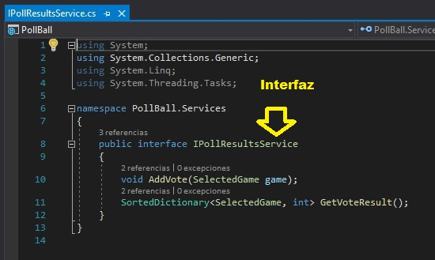


#### Tarea 2: Definir una implementación para el servicio

1. En la ventana **PollBall - Microsoft Visual Studio**, en el Explorador de Soluciones, haga clic con el botón derecho en **Servicios**, apunte a **Agregar**, y luego haga clic en **Clase**.

2. En el cuadro de diálogo **Agregar nuevo elemento - Poll-Ball**, en el cuadro **Nombre**, introduzca **PollResultsService**, y luego haga clic en **Agregar**.

3. En la ventana del código **PollResultsService.cs**, localiza el siguiente código:
```cs
    public class PollResultsService
```

4. Añada el siguiente código a la línea de código existente:
  ```cs
     : IPollResultsService
  ```

5. En la ventana del código **PollResultsService.cs**, localice el siguiente código:
  ```cs
    public class PollResultsService : IPollResultsService
    {
  ```

6. Ponga el cursor al final del código localizado, presione Enter, y luego introduzca el siguiente código:
  ```cs
    private Dictionary<SelectedGame, int> _selectionVotes;
  ```

7. Ponga el cursor al final del campo **_selecciónVotos**, presione Enter dos veces, y luego introduzca el siguiente código:
```cs
    public PollResultsService()
    {
        _selectionVotes = new Dictionary<SelectedGame, int>();
    }
```

8. Ponga el cursor al final del constructor de **PollResultsService**, presione Enter dos veces, y luego introduzca el siguiente código:
  ```cs
    public void AddVote(SelectedGame game)
    {
    
    }
  ```

9. Coloque el cursor dentro del bloque de código del método **AddVote**, y luego introduzca el siguiente código:

```cs
    if (_selectionVotes.ContainsKey(game)) 
    {
        _selectionVotes[game]++;
    } 
    else
    {
        _selectionVotes.Add(game, 1);
    }
``` 


10. Ponga el cursor al final del método **AddVote**, presione Enter dos veces, y luego introduzca el siguiente código:
  ```cs
    public SortedDictionary<SelectedGame, int> GetVoteResult()
    {
    
    }
  ```

11. Coloque el cursor dentro del bloque de código del método **GetVoteResult**, y luego introduzca el siguiente código:
```cs
    return new SortedDictionary<SelectedGame, int>(_selectionVotes);
```

- La representación visual a la respuesta del último ejercicio se muestra en la siguiente imagen:

 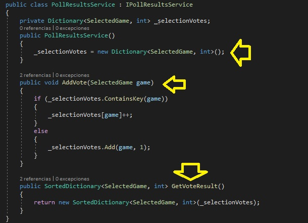

#### Tarea 3: Usar la inyección de dependencia

1. En la ventana **PollBall - Microsoft Visual Studio**, en el Explorador de Soluciones, haga clic en **Startup.cs**.

2. En la ventana del código **Startup.cs**, localice el siguiente código:
```cs
    using Microsoft.Extensions.DependencyInjection;
```

3. Ponga el cursor al final del código localizado, presione Enter, y luego introduzca el siguiente código:
```cs
    using PollBall.Services;
```

4. En la ventana del código **Startup.cs**, localiza el siguiente código:
```cs
    public void ConfigureServices(IServiceCollection services)
```

5. Coloque el cursor dentro del bloque de código del método **ConfigureServicios**, presione Enter, y luego introduzca el siguiente código:
```cs
    services.AddSingleton<IPollResultsService, PollResultsService>();
```

6. En la ventana del código **Startup.cs**, seleccione el siguiente código:
```cs
    public void Configure(IApplicationBuilder app)
```

7. Reemplazar el código seleccionado por el siguiente código:
```cs
    public void Configure(IApplicationBuilder app, IHostingEnvironment env, IPollResultsService pollResults)
```

8. En la ventana del código **Startup.cs**, seleccione el siguiente código:
```cs
    await context.Response.WriteAsync("This text was generated by the app.Run middleware.");
```

9. Reemplazar el código seleccionado por el siguiente código:
```cs
    await context.Response.WriteAsync("This text was generated by the app.Run middleware. wwwroot folder path: " + env.WebRootPath);
```

10. En la ventana del código **Startup.cs**, localiza el siguiente código:
  ```cs
    string selectedValue = context.Request.Query["favorito"];
  ```

11. Ponga el cursor al final del código localizado, presione Enter, y luego introduzca el siguiente código:
```cs
    SelectedGame selectedGame = (SelectedGame)Enum.Parse(typeof(SelectedGame), selectedValue, true);
    pollResults.AddVote(selectedGame);
```

12.	En la ventana del código **Startup.cs**, seleccione el siguiente código:
```cs
    await context.Response.WriteAsync("Selected value is: " + selectedValue);
```

13. Sustituya el código seleccionado por el siguiente código:
```cs
    SortedDictionary<SelectedGame, int> gameVotes = pollResults.GetVoteResult();

    foreach (KeyValuePair<SelectedGame,int> currentVote in gameVotes)
    {
        await context.Response.WriteAsync($"<div> Game name: {currentVote.Key}. Votes: {currentVote.Value} </div>");
    }
```
- La representación visual a la respuesta del último ejercicio se muestra en la siguiente imagen:

 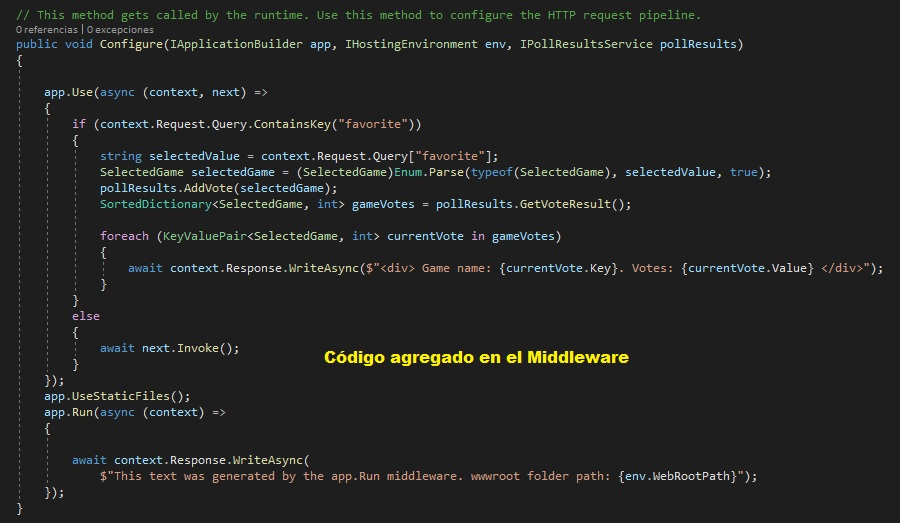

#### Tarea 4: Ejecutar la aplicación

1. En la ventana **PollBall - Microsoft Visual Studio**, en el menú **FILE**, haga clic en **Save All**.

2. En la ventana **PollBall - Microsoft Visual Studio**, en el menú **DEBUG**, haga clic en **Iniciar sin depuración**.
     > **Nota**: El navegador muestra **Este texto fue generado por la app.Run middleware. wwwroot ruta de la carpeta: [ruta local de su carpeta wwwroot]**.<br />

- La representación visual a la respuesta del último ejercicio se muestra en la siguiente imagen:

 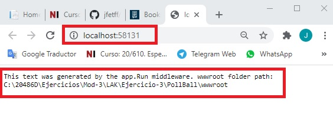

3. En Microsoft Edge, en la barra de direcciones, introduzca **http://localhost:[port]/poll-questions.html**, y luego presione Enter.

4. En Microsoft Edge, haz clic en **Basketball**, y luego en **Submit Poll**.
     > **Nota**: El navegador muestra:<br /> 
     "Nombre del juego: Baloncesto. Votos: 1"<br />

- La representación visual a la respuesta del último ejercicio se muestra en la siguiente imagen:

 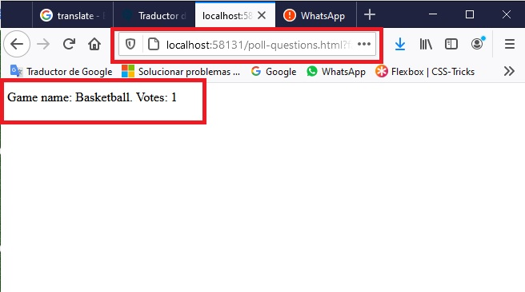

5. En Microsoft Edge, en la barra de direcciones, introduzca **http://localhost:[port]/poll-questions.html**, y luego presione Enter.

6. En Microsoft Edge, haz clic en **Fútbol**, y luego en **Enviar encuesta**.
    > **Nota**: El navegador muestra:<br />
    > **Nombre del juego: Baloncesto. Votos: 1**<br />
    > **Nombre del juego: Fútbol. Votos: 1**<br />

- La representación visual a la respuesta del último ejercicio se muestra en la siguiente imagen:

 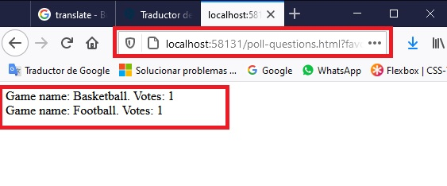

7. En Microsoft Edge, en la barra de direcciones, introduzca **http://localhost:[port]/poll-questions.html**, y luego presione Enter.

8. En Microsoft Edge, haz clic en **Basketball**, y luego en **Submit Poll**.
     > **Nota**: El navegador muestra:<br />
     > **Nombre del juego: Baloncesto. Votos: 2**<br />
     > **Nombre del juego: Fútbol. Votos: 1**<br />

- La representación visual a la respuesta del último ejercicio se muestra en la siguiente imagen:

 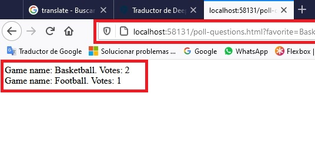

9. En Microsoft Edge, haga clic en **Cerrar**.

>**Resultado**: Al final de este ejercicio, podrá registrar un servicio en el método **ConfigureServicces** y utilizar el servicio en el método **Configure** utilizando la inyección de dependencia.


### Ejercicio 4: Inyección de un servicio a un Controller

#### Tarea 1: Habilitar el trabajo con MVC

1. En la ventana del código **Startup.cs**, localiza el siguiente código:
  ```cs
    services.AddSingleton<IPollResultsService, PollResultsService>();
  ```

2. Ponga el cursor al final del código localizado, presione Enter, y luego introduzca el siguiente código:
  ```cs
    services.AddMvc();
  ```

3. En la ventana del código **Startup.cs**, localiza el siguiente código:
  ```cs
    app.UseStaticFiles();
  ```

4. Ponga el cursor al final del código localizado, presione Enter dos veces, y luego introduzca el siguiente código:

```cs
    app.UseMvcWithDefaultRoute();
```


#### Tarea 2: Añadir un Controller

1. En la ventana **PollBall - Microsoft Visual Studio**, en el Explorador de Soluciones, haga clic con el botón derecho **PollBall**, apunte a **Agregar**, y luego haga clic en **Nueva Carpeta**.

2. En el cuadro **Nueva Carpeta**, apunte a **Controllers**, y luego pulse Intro.

3. En la ventana **PollBall - Microsoft Visual Studio**, en el Explorador de soluciones, haga clic con el botón derecho del ratón en **Controllers**, apunte a **Agregar**, y luego haga clic en **Controller**.

4. En el cuadro de diálogo **Agregar Andamio**, seleccione **Controller MVC - Vaciar**, y luego haga clic en **Agregar**.

5. En el cuadro **Nombre del Controller**, introduzca **Controller de casa**, y luego haga clic en **Agregar**.

6. En la ventana de código **HomeController.cs**, seleccione el siguiente código:
```cs
    return View();
```

7. Reemplazar el código seleccionado por el siguiente código:
  ```cs
      return Content("Hello from controller.");
  ```

#### Tarea 3: Ejecutar la aplicación

1. En la ventana **PollBall - Microsoft Visual Studio**, en el menú **FILE**, haga clic en **Save All**.

2. En la ventana **PollBall - Microsoft Visual Studio**, en el menú **DEBUG**, haga clic en **Iniciar sin depuración**.
     > **Nota**: El navegador muestra **Hola del Controller.**

3. En Microsoft Edge, haga clic en **Cerrar**.

4. En la ventana **PollBall - Microsoft Visual Studio**, en Solution Explorer, haga clic en **Startup.cs**. 

5. En la ventana del código **Startup.cs**, seleccione el siguiente código:
```cs
    app.Run(async (context) =>
    {
        await context.Response.WriteAsync("This text was generated by the app.Run middleware. wwwroot folder path: " + env.WebRootPath);
    });
```

6. Haga clic con el botón derecho del ratón en el código seleccionado y luego haga clic en **Cut**.

7. En la ventana del código **Startup.cs**, localice el siguiente código:
```cs
    public void Configure(IApplicationBuilder app, IHostingEnvironment env, IPollResultsService pollResults)
    {
```

8. Coloque el cursor después del signo **{** (abrazaderas), pulse Intro, haga clic con el botón derecho del ratón en la ubicación del cursor, haga clic en **Pegar** y, a continuación, pulse Intro.

9. En la ventana **PollBall - Microsoft Visual Studio**, en el menú **ARCHIVO**, haga clic en **Guardar todo**.

10. En la ventana **PollBall - Microsoft Visual Studio**, en el menú **DEBUG**, haga clic en **Iniciar sin depuración**.
     > **Nota**: El navegador muestra **Este texto fue generado por la app.Run middleware. wwwroot ruta de la carpeta: [ruta local de su carpeta wwwroot]**.<br />

11. En Microsoft Edge, haga clic en **Cerrar**.

12. En la ventana del código **Startup.cs**, seleccione el siguiente código:
```cs
    app.Run(async (context) =>
    {
        await context.Response.WriteAsync("This text was generated by the app.Run middleware. wwwroot folder path: " + env.WebRootPath);
    });
```

13. Haga clic con el botón derecho del ratón en el código seleccionado y luego haga clic en **Cut**.

14. En la ventana del código **Startup.cs**, localice el siguiente código:
```cs
    app.UseMvcWithDefaultRoute();
```

15. Coloca el cursor al final del código localizado, pulsa Intro dos veces, haz clic con el botón derecho del ratón en el lugar del cursor y luego pulsa **Pegar**.
 
#### Tarea 4: Usar la inyección de dependencia en un Controller

1. En la ventana **PollBall - Microsoft Visual Studio**, en el Explorador de Soluciones, haga clic en **Startup.cs**. 

2. En la ventana del código **Startup.cs**, seleccione el siguiente código:
```cs
    SortedDictionary<SelectedGame, int> gameVotes = pollResults.GetVoteResult();

    foreach (KeyValuePair<SelectedGame, int> currentVote in gameVotes)
    {
        await context.Response.WriteAsync($"<div> Game name: {currentVote.Key}. Votes: {currentVote.Value} </div>");
    }
```

3. Reemplazar el código seleccionado por el siguiente código:
  ```cs
	context.Response.Headers.Add("content-type", "text/html");
    await context.Response.WriteAsync("Thank you for submitting the poll. You may look at the poll results <a href='/?submitted=true'>Here</a>.");
  ```

4. En la ventana **PollBall - Microsoft Visual Studio**, en el Explorador de Soluciones, expanda **Controllers**, y luego haga clic en **HomeController.cs**.

5. En la ventana del código **HomeController.cs**, localice el siguiente código:
```cs
    using Microsoft.AspNetCore.Mvc;
``` 

6. Ponga el cursor al final del código localizado, presione Enter, y luego introduzca el siguiente código:
  ```cs
    using PollBall.Services;
    using System.Text;
  ``` 

7. En la ventana del código **HomeController.cs**, localice el siguiente código:
  ```cs
    public class HomeController : Controller
    {
  ``` 

8. Ponga el cursor después del signo **{** (abra las abrazaderas), pulse Intro y luego introduzca el siguiente código:
```cs
    private IPollResultsService _pollResults;
```

9. Ponga el cursor al final del código de campo **_pollResults**, presione Enter dos veces, introduzca el siguiente código y luego presione Enter.

```cs
    public HomeController(IPollResultsService pollResults)
    {
        _pollResults = pollResults;
    }
```


10. En la ventana del código **HomeController.cs**, seleccione el siguiente código:
  ```cs
    return Content("Hello from controller.");
  ```

11. Reemplazar el código seleccionado por el siguiente código:
  ```cs
    if (Request.Query.ContainsKey("submitted"))
    {
        StringBuilder results = new StringBuilder();
        SortedDictionary<SelectedGame, int> voteList = _pollResults.GetVoteResult();

        foreach (var gameVotes in voteList)
        {
            results.Append($"Game name: {gameVotes.Key}. Votes: {gameVotes.Value}{Environment.NewLine}");
        }

        return Content(results.ToString());
    }
    else
    {
        return Redirect("poll-questions.html");
    }
  ```

#### Tarea 5: Ejecutar la aplicación

1. En la ventana **PollBall - Microsoft Visual Studio**, en el menú **FILE**, haga clic en **Save All**.

2. En la ventana **PollBall - Microsoft Visual Studio**, en el menú **DEBUG**, haga clic en **Iniciar sin depuración**.
    >**Nota**: El navegador muestra la página **http://localhost:[port]/poll-questions.html**.

4. En Microsoft Edge, haga clic en **Basketball**, y luego haga clic en **Subir Encuesta**.
     > **Nota**: El navegador muestra **Gracias por enviar la encuesta. Puede ver los resultados de la encuesta aquí**.

5. En Microsoft Edge, haz clic en **Aquí**.
     > **Nota**: El navegador muestra:<br />
     > **Nombre del juego: Baloncesto. Votos: 1**<br />

6. En Microsoft Edge, abre una nueva ventana.

7. En la barra de direcciones, escribe **http://localhost:[port]/poll-questions.html**, y luego presiona Enter.

8. En Microsoft Edge, haz clic en **Fútbol**, y luego en **Enviar encuesta**.
    >**Nota**: El navegador muestra **Gracias por enviar la encuesta. Puedes ver los resultados de la encuesta aquí**.

9.  En Microsoft Edge, haz clic en **Aquí**.
     > **Nota**: El navegador muestra:<br />
     > **Nombre del juego: Baloncesto. Votos: 1**<br />
     > **Nombre del juego: Fútbol. Votos: 1**<br />

10. Cierra todas las ventanas de Microsoft Edge.

11. En la ventana **PollBall - Microsoft Visual Studio**, en el menú **FILE**, haga clic en **Salir**.

>**Resultado**: Al final de este ejercicio, podrás crear un Controller, e inyectar un servicio en él con inyección de dependencia.


