# Module 4: Developing Controllers

Siempre cuando un camino comienza con  *[Repository Root]*, reemplacelo con el camino absoluto en el que el repositorio 20486 reside. Por ejemplo, si tu has cloneado o extraido el repositorio 20486 en la carpeta **C:\Users\John Doe\Downloads\20486**, cambiar la ruta de: **[Repository Root]\AllFiles\20486D\Mod01** a **C:\Users\John Doe\Downloads\20486\AllFiles\20486D\Mod01**.

Fichero de Instrucciones: Instructions\20486D_MOD04_LAK.md

**Información:**

1. **Nombres y apellidos:** José René Fuentes Cutz
2. **Fecha:** 24 de Noviembre 2020.
3. **Resumen del Ejercicio:** Este laboratorio consta de 4 ejercicio:
- En el Primer ejercicio nos ayuda a  crear Controllers MVC que implementen acciones comunes para la clase de modelo **City** de la aplicación.
- En el Segundo ejercicio nos ayuda a entender como podemos registrar nuevas rutas personalizadas en el canal de solicitud de Controllers de la aplicación..
- En el Tercer ejercicio creamos una clase de filtro de acción que registre los detalles de las acciones, los Controllers y los parámetros en un archivo externo cada vez que se llame a una acción..

4. **Dificultad o problemas presentados y como se resolvieron:** Ninguno.

**NOTA**: Si no hay descripcion de problemas o dificultades, y al yo descargar el código para realizar la comprobacion y el código no funcionar, el resultado de la califaciación del laboratorio será afectado.

---


# Laboratorio: Desarrollo de Controllers

### Lab Setup

Tiempo estimado: **60 minutos**

### Preparation Steps

1. Asegúrate de que has clonado el directorio **20486D** de GitHub (**https://github.com/MicrosoftLearning/20486D-DevelopingASPNETMVCWebApplications/tree/master/Allfiles**). Contiene los segmentos de código para los laboratorios y demostraciones de este curso.

2. Navega a **[Repository Root]\Allfiles\Mod04\LabFiles\01_WorldJourney_begin**, y luego abre el **WorldJourney.sln**.

    > **Nota**: Si aparece un cuadro de diálogo de **Aviso de seguridad para WorldJourney**, verifica que la casilla de verificación **Pregúntame por cada proyecto de esta solución** está despejada, y luego haz clic en OK.

3. En la ventana **WorldJourney - Microsoft Visual Studio**, en el menú **DEBUG**, haga clic en **Iniciar sin depuración**.

4. En Microsoft Edge, en la barra de direcciones, anota el número de puerto que aparece al final del URL **http://localhost:[port]**. Usarás el número de puerto durante este laboratorio.

- La representación visual a la respuesta del último ejercicio se muestra en la siguiente imagen:

 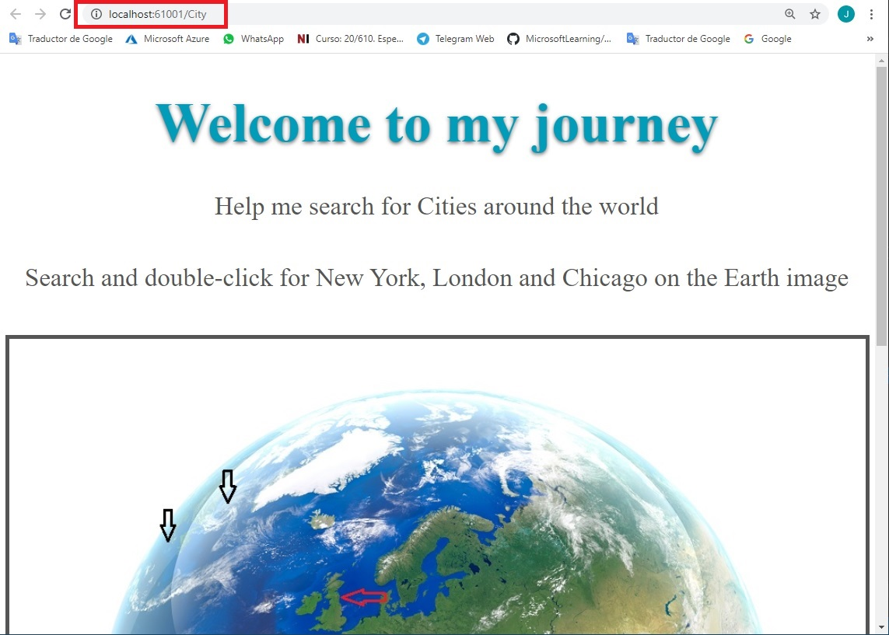

5. En Microsoft Edge, haz clic en **Cerrar**.

### Ejercicio 1: Agregar Controllers y acciones a una aplicación MVC

#### Tarea 1: Añadir Controllers a una aplicación MVC

1. Navega a **[Repository Root]\Allfiles\Mod04\Labfiles\01_WorldJourney_begin** y haz doble clic en **WorldJourney.sln**.

    > **Nota**: Si aparece un cuadro de diálogo de **Aviso de seguridad para WorldJourney**, verifica que la casilla de verificación **Pregúntame por cada proyecto de esta solución** está despejada, y luego haz clic en OK.

2. En el Explorador de soluciones, haga clic con el botón derecho del ratón en **Viaje al mundo**, apunte a **Agregar**, y luego seleccione **Nueva carpeta**.

3. En la casilla **NuevaCarpeta**, escriba **Controllers**, y luego pulse Intro.

4. En la ventana **Viaje al Mundo - Microsoft Visual Studio**, en el Explorador de soluciones, haga clic con el botón derecho del ratón en la carpeta **Controllers**, apunte a **Agregar**, y luego seleccione **Controller**.

5. En el cuadro de diálogo **Agregar andamiaje**, haga clic en **Controller MVC - Empty**, y luego haga clic en **Agregar**.

6. En el cuadro de diálogo **Añadir Controller MVC vacío**, en el cuadro **Nombre del Controller**, escriba **HomeController** y, a continuación, haga clic en **Añadir**.

- La representación visual a la respuesta del último ejercicio se muestra en la siguiente imagen:

 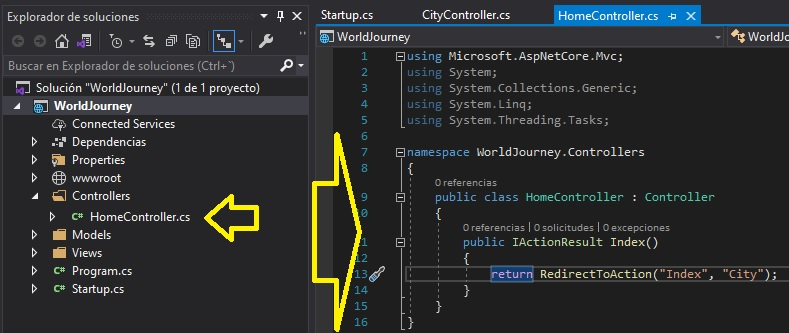

7. En la ventana **WorldJourney - Microsoft Visual Studio**, en el Explorador de soluciones, haga clic con el botón derecho del ratón en la carpeta **Controllers**, apunte a **Agregar**, y luego seleccione **Controller**.

8. En el cuadro de diálogo **Agregar andamiaje**, haga clic en **Controller MVC - Empty**, y luego haga clic en **Agregar**.

9. En el cuadro de diálogo **Añadir Controller MVC vacío**, en el cuadro **Nombre del Controller**, escriba **CityController** y, a continuación, haga clic en **Añadir**.

- La representación visual a la respuesta del último ejercicio se muestra en la siguiente imagen:

 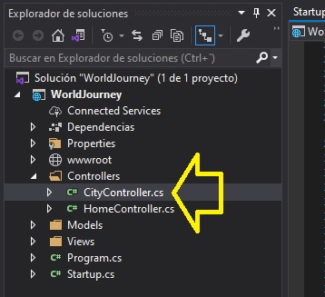

#### Tarea 2: Añadir acciones a un Controller

1. En la ventana del código **CityController.cs**, localice el siguiente código:
   ```cs
       using Microsoft.AspNetCore.Mvc;
   ```
2. Asegúrate de que el cursor está al final del espacio de nombres **Microsoft.AspNetCore.Mvc**, presiona Enter, y luego escribe el siguiente código:
  ```cs
       using System.IO;
       using Microsoft.AspNetCore.Hosting;
       using WorldJourney.Models;
   ```
3. En el bloque de código de clase **CityController**, en el bloque de código de acción **Index**, localiza el siguiente código:
   ```cs
       return View();
   ```
4. Ponga el cursor antes del código localizado, y escriba el siguiente código:
   ```cs
       ViewData["Page"] = "Search city";
   ```
5. En la ventana del código **CityController**, asegúrese de que el cursor está al final del bloque de código de acción **Index**, presione Enter dos veces, y luego escriba el siguiente código:
  ```cs
       public IActionResult Details()
       {
       }
   ```
6. En el bloque de código de acción **Detalles**, escriba el siguiente código:
   ```cs
       ViewData["Page"] = "Selected city";
       City city = null;
       if (city == null)
       {
            return NotFound();
       }
            
       return View(city);
   ```
7. En la ventana del código **CityController**, asegúrese de que el cursor está al final del bloque de código de acción **Detalles**, presione Enter dos veces, y luego escriba el siguiente código:
  ```cs
       public IActionResult GetImage()
       {
       }
   ```
8. En el bloque de código de acción **GetImage**, escriba el siguiente código:

  ```cs
       ViewData["Message"] = "display Image";
       City requestedCity = null;
       if (requestedCity != null)
       {
           string fullPath = "";
           FileStream fileOnDisk = new FileStream(fullPath, FileMode.Open);
           byte[] fileBytes;
           using (BinaryReader br = new BinaryReader(fileOnDisk))
           {
              fileBytes = br.ReadBytes((int)fileOnDisk.Length);
           }
           return File(fileBytes, requestedCity.ImageMimeType);
        }
        else
        {
            return NotFound();
        }
   ```

#### Tarea 3: Cambiar las acciones para obtener un parámetro

1. En el bloque de código de clase **CityController**, seleccione el siguiente código:
  ```cs
       public IActionResult Details()
   ```
2. Reemplazar el código seleccionado por el siguiente código:
   ```cs
       public IActionResult Details(int? id)
   ```
3. En el bloque de código de clase **CityController**, seleccione el siguiente código:
   ```cs
       public IActionResult GetImage()
   ```
4. Reemplaza el código seleccionado por el siguiente código..:
   ```cs
       public IActionResult GetImage(int? cityId)
   ```

- La representación visual a la respuesta del último ejercicio se muestra en la siguiente imagen:

 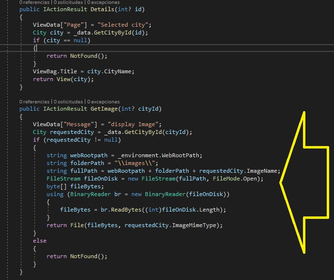


#### Tarea 4: Cambiar una acción para redirigirla a otra acción en otro Controller

1. En la ventana **WorldJourney - Microsoft Visual Studio**, en el Explorador de Soluciones, expandir **Controllers**, y luego hacer clic en **HomeController.cs**.

2. En la ventana de código **HomeController**, en el bloque de código de acción **Index**, seleccione el siguiente código:
   ```cs
       return View();
   ```
3.  Reemplazar el código seleccionado por el siguiente código:
    ```cs
       return RedirectToAction("Index", "City");
   ```

- La representación visual a la respuesta del último ejercicio se muestra en la siguiente imagen:

 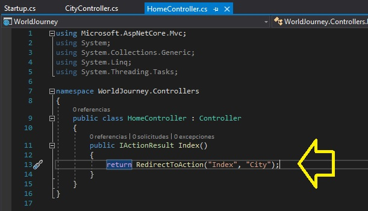

#### Tarea 5: Utilizar un servicio

1. En la ventana **WorldJourney - Microsoft Visual Studio**, en el Solution Explorer, en **Controllers**, haga clic en **CityController.cs**.

2. En el bloque de código de clase **CityController**, localice el siguiente código:
   ```cs
       public IActionResult Index()
   ```
3. Coloque el cursor del ratón antes del código localizado, escriba el siguiente código y luego presione Enter.
   ```cs
       private IData _data;
       private IHostingEnvironment _environment;

       public CityController(IData data, IHostingEnvironment environment)
       {
            _data = data;
            _environment = environment;
            _data.CityInitializeData();
       }
   ```
4. En el bloque de código de acción **Detalles**, seleccione el siguiente código:
    ```cs
       City city = null;
   ```
5. Reemplazar el código seleccionado por el siguiente código:
    ```cs
       City city = _data.GetCityById(id);
   ``` 

6.  En el bloque de código de acción **GetImage**, seleccione el siguiente código:
    ```cs
       City requestedCity = null;
   ```
7. Reemplazar el código seleccionado por el siguiente código:
    ```cs
       City requestedCity = _data.GetCityById(cityId);
   ``` 

8. En el bloque de código de acción **GetImage**, seleccione el siguiente código:
    ```cs
       string fullPath = "";
   ```
9. Reemplazar el código seleccionado por el siguiente código:
    ```cs
       string webRootpath = _environment.WebRootPath;
       string folderPath = "\\images\\";
       string fullPath = webRootpath + folderPath + requestedCity.ImageName;
   ``` 
- La representación visual a la respuesta del último ejercicio se muestra en la siguiente imagen:

 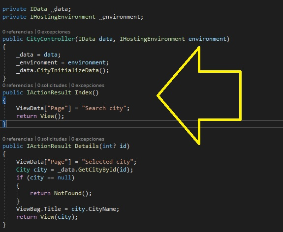

#### Tarea 6: Almacenar el resultado en una propiedad de ViewBag

1. En el bloque de código de clase **CityController**, en el bloque de código de acción **Detalles**, localiza el siguiente código:
    ```cs
       return View(city);
   ```
2. Ponga el cursor del ratón antes del código localizado, y escriba el siguiente código:
    ```cs
       ViewBag.Title = city.CityName;
   ``` 

- La representación visual a la respuesta del último ejercicio se muestra en la siguiente imagen:

 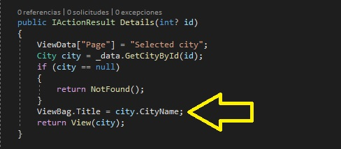

#### Tarea 7: Ejecutar la aplicación

1. En la ventana de **WorldJourney - Microsoft Visual Studio**, en el menú **FILE**, haga clic en **Save All**.

2. En la ventana de **WorldJourney - Microsoft Visual Studio**, en el menú **DEBUG**, haga clic en **Iniciar sin depuración**.

    > **Nota**: El navegador muestra el resultado de la acción **Index** dentro del Controller **City**.

3. En Microsoft Edge, en la imagen **Earth**, haga clic en el área **London**. Noten la flecha roja en el centro de la imagen de **Earth**.

- La representación visual a la respuesta del último ejercicio se muestra en la siguiente imagen:

 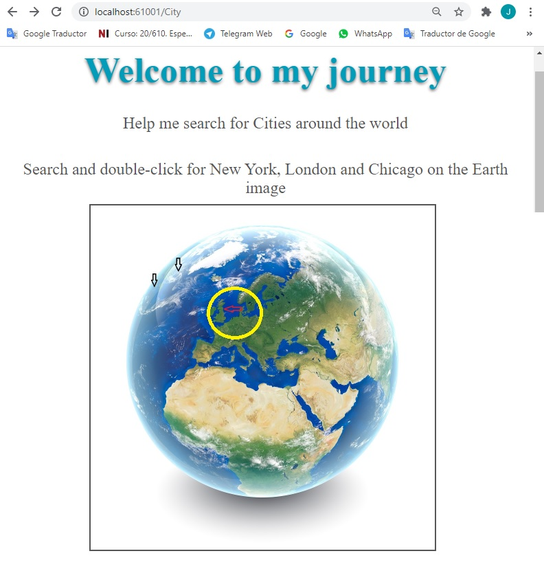

> **Nota**: El navegador muestra el resultado de la acción **Detalles** dentro del Controller **City**.

- La representación visual a la respuesta del último ejercicio se muestra en la siguiente imagen:

 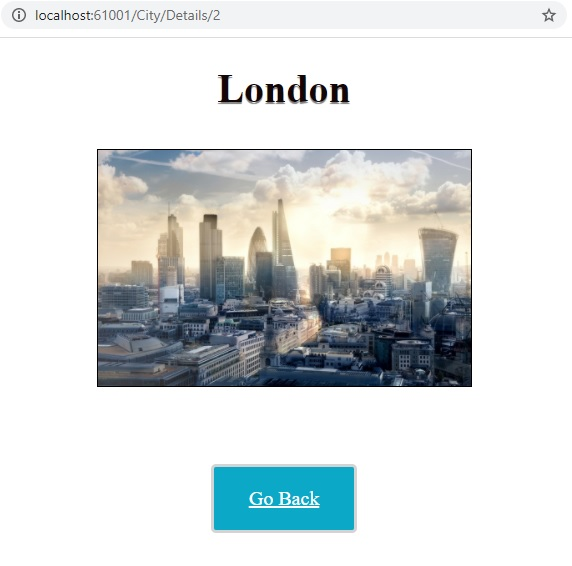

4. En Microsoft Edge, haz clic en **Cerrar**.

> **Resultados**: Después de completar este ejercicio, podrá crear Controllers MVC que implementen acciones comunes para la clase de modelo **City** en la aplicación. 


### Ejercicio 2: Configuración de rutas usando la tabla de rutas

#### Tarea 1: Añadir un Controller con una acción

1. En la ventana **WorldJourney - Microsoft Visual Studio**, en el Explorador de soluciones, haga clic con el botón derecho del ratón en la carpeta **Controllers**, apunte a **Agregar**, y luego seleccione **Controller**.

2. En el cuadro de diálogo **Agregar andamio**, haga clic en **Controller MVC - Empty**, y luego haga clic en **Agregar**.

3. En el cuadro de diálogo **Añadir Controller MVC vacío**, en el cuadro **Nombre del Controller**, escriba **TraverlerController** y, a continuación, haga clic en **Añadir**.

4. En el bloque de código de clase **TravelerController**, seleccione el siguiente código:
   ```cs
       public IActionResult Index()
       {
            return View();
       }
   ```
5. Reemplazar el código seleccionado por el siguiente código:
    ```cs
       public IActionResult Index(string name)
       {
          ViewBag.VisiterName = name;
          return View();
       }
   ```


- La representación visual a la respuesta del último ejercicio se muestra en la siguiente imagen:

 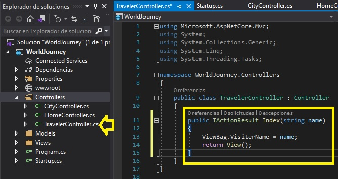

#### Tarea 2: Ejecutar la aplicación

1. En la ventana de **WorldJourney - Microsoft Visual Studio**, en el menú **FILE**, haga clic en **Save All**.

2. En la ventana de **WorldJourney - Microsoft Visual Studio**, en el menú **DEBUG**, haga clic en **Iniciar sin depuración**.

3. En Microsoft Edge, en la barra de direcciones, escribe **http://localhost:[port]/Traveler/Index**, y luego presiona Enter.

- La representación visual a la respuesta del último ejercicio se muestra en la siguiente imagen:

 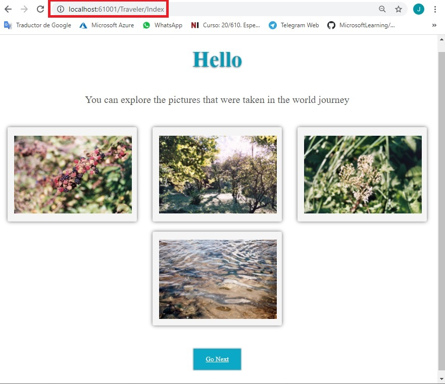

    > **Nota**: En la siguiente tarea registrará una nueva ruta con la tabla de rutas. Entonces, no necesitarás introducir manualmente la URL relativa de **Traveler/Index** en la barra de direcciones.

4. En Microsoft Edge, haz clic en **Cerrar**.

#### Tarea 3: Registrar nuevas rutas en la tabla de rutas

1. En la ventana **WorldJourney - Microsoft Visual Studio**, en el Explorador de soluciones, haga clic en **Startup.cs**.

2. Dentro del bloque de código del método **Configure**, en la clase **Inicio**, seleccione el siguiente código:
   ```cs
       app.UseMvcWithDefaultRoute();
   ```
3. Reemplazar el código seleccionado por el siguiente código:
    ```cs
       app.UseMvc(routes =>
            {
                routes.MapRoute(
                     name: "TravelerRoute",
                     template: "{controller}/{action}/{name}",
                     constraints: new { name = "[A-Za-z ]+" },
                     defaults: new { controller = "Traveler", action = "Index", name = "Katie Bruce" });

                routes.MapRoute(
                    name: "defaultRoute",
                    template: "{controller}/{action}/{id?}",
                    defaults: new { controller = "Home", action = "Index" },
                    constraints: new { id = "[0-9]+" });
            });
    ```
> **Nota**: Puedes reemplazar el nombre predeterminado **Katie Bruce** por tu nombre.

#### Tarea 4: Ejecutar la aplicación y verificar que la nueva ruta funciona

1. En la ventana de **WorldJourney - Microsoft Visual Studio**, en el menú **FILE**, haga clic en **Save All**.

2. En la ventana de **WorldJourney - Microsoft Visual Studio**, en el menú **DEBUG**, haga clic en **Iniciar sin depuración**.

    > **Nota**:  El nombre **"Katie Bruce "** que aparece en el título viene de la nueva ruta **"TravelerRoute "**, registrada en la tabla de rutas.

3. En Microsoft Edge, haz clic en **Cerrar**.

> **Resultados**: Después de completar este ejercicio, podrá registrar nuevas rutas personalizadas en el canal de solicitud de Controllers de la aplicación.

### Ejercicio 3: Configuración de rutas mediante el uso de atributos

#### Tarea 1: Aplicar rutas personalizadas a un Controller mediante el uso de atributos

1. En la ventana **WorldJourney - Microsoft Visual Studio**, en el Solution Explorer, en **Controllers**, haga clic en **CityController.cs**.

2. En el bloque de código de acción **Index**, localice el siguiente código:
   ```cs
       public IActionResult Index()
   ```
3. Ponga el cursor antes del código localizado, presione Enter, y luego escriba el siguiente código:
   ```cs
       [Route("WorldJourney")]
   ```  

4. En el bloque de código de acción **Detalles**, localiza el siguiente código:
    ```cs
       public IActionResult Details(int? id)
   ```
5. Ponga el cursor antes del código localizado, presione Enter, y luego escriba el siguiente código:
   ```cs
       [Route("CityDetails/{id?}")]
   ```     
 
#### Tarea 2: Ejecutar la aplicación y verificar el funcionamiento de las nuevas rutas

1. En la ventana de **WorldJourney - Microsoft Visual Studio**, en el menú **FILE**, haga clic en **Save All**.

2. En la ventana de **WorldJourney - Microsoft Visual Studio**, en el menú **DEBUG**, haga clic en **Iniciar sin depuración**.

3. En Microsoft Edge, haz clic con el botón derecho del ratón en la página, y luego selecciona **View Source**.

4. En **Herramientas para desarrolladores**, haga clic en **Elements**.

5. Presiona Ctrl + B.

6. Coloque el cursor sobre el botón **Siguiente**, y luego haga clic.

    > **Nota**: En **Herramientas de desarrollo**, en la etiqueta **a**, verifique que el atributo **href** es **Viaje al mundo**.

- La representación visual a la respuesta del último ejercicio se muestra en la siguiente imagen:

 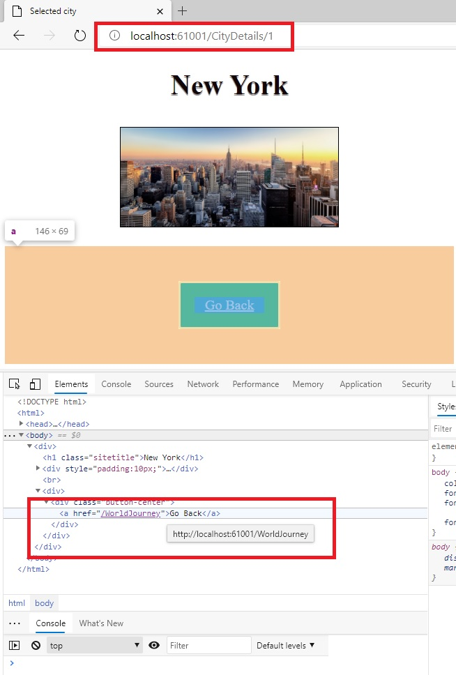

7. En **Herramientas de desarrollo**, haz clic en **Cerrar**.

8. Haga clic en **Seguir**. 

    > **Nota**: Verificar que la nueva ruta funciona. Como resultado de aplicar una ruta personalizada a **CityController** en la acción **Index** mediante el uso de atributos, **http://localhost:[port]/WorldJourney** debería aparecer en la barra de direcciones.

9. En Microsoft Edge, haz clic con el botón derecho del ratón en la página, y luego selecciona **View Source**.


10. En **Herramientas de desarrollo**, haga clic en **Elements**.

11. Presione Ctrl + B.

12. Ponga el cursor sobre la imagen **Earth** y luego presione Enter.

    > **Nota**: En las **Herramientas de desarrollo**, bajo la etiqueta **map**, dentro de la etiqueta **área**, verifique que el valor de **href** para el atributo **London** es **/CityDetails/2**.

- La representación visual a la respuesta del último ejercicio se muestra en la siguiente imagen:

 

13. En Microsoft Edge, en la imagen **Earth**, haz clic en el área **London**. Fíjate en la flecha roja en el centro de la imagen **Earth**.

    > **Nota**: Verifica que la nueva ruta funciona. Como resultado de aplicar una ruta personalizada a un **CityController** en la acción **Detalles** usando atributos, **http://localhost:[port]/CityDetails/2** debería aparecer en la barra de direcciones.

14. En Microsoft Edge, haga clic en **Cerrar**.

> **Resultados**: 15. Después de completar este ejercicio, puede añadir rutas personalizadas al Controller **City** utilizando el atributo **Ruta**.

### Ejercicio 4: Añadir un filtro de acción

#### Tarea 1: Añadir una clase de filtro de acción

1. En el Explorador de Soluciones, haga clic con el botón derecho en **Viaje al Mundo**, apunte a **Agregar**, y luego seleccione **Nueva Carpeta**.

2. En la casilla **NuevaCarpeta**, escriba **Filtros**, y luego presione Enter.

3. En la ventana **Viaje al Mundo - Microsoft Visual Studio**, en el Explorador de soluciones, haga clic con el botón derecho del ratón en **Filtros**, apunte a **Agregar**, y luego seleccione **Clase**.

4. En el cuadro de diálogo **Agregar nuevo elemento - WorldJourney**, en el cuadro **Nombre**, escriba **LogActionFilterAttribute**, y luego haga clic en **Agregar**.

5. En **LogActionFilterAttribute** localiza el siguiente código:
   ```cs
       using System.Threading.Tasks;
   ```
6. Asegúrate de que el cursor está al final del **utilizando el espacio de nombres System.Threading.Tasks**, presiona Enter, y luego escribe el siguiente código:
   ```cs
       using System.IO;
       using Microsoft.AspNetCore.Hosting;
       using Microsoft.AspNetCore.Mvc;
       using Microsoft.AspNetCore.Mvc.Filters;
   ```
7. En la ventana del código de clase **LogActionFilterAttribute**, localice el siguiente código:
   ```cs
       public class LogActionFilterAttribute
   ```
8.  Añada el siguiente código a la línea de código existente:
    ```cs
        : ActionFilterAttribute
   ```
9. En el bloque de código de clase **LogActionFilterAttribute**, presione Enter, y luego escriba el siguiente código:
   ```cs
       private IHostingEnvironment _environment;
       private string _contentRootPath;
       private string _logPath;
       private string _fileName;
       private string _fullPath;

       public LogActionFilterAttribute(IHostingEnvironment environment)
       {
            _environment = environment;
            _contentRootPath = _environment.ContentRootPath;
            _logPath = _contentRootPath + "\\LogFile\\";
            _fileName = $"log {DateTime.Now.ToString("MM-dd-yyyy-H-mm")}.txt";
            _fullPath = _logPath + _fileName;
       }
   ```
#### Tarea 2: Añadir un manejador para el evento OnActionExecuting

1. En el bloque de código de clase **LogActionFilterAttribute**, asegúrese de que el cursor esté al final del bloque de código de método **LogActionFilterAttribute**, presione dos veces la tecla Enter y luego escriba el siguiente código:
   ```cs
       public override void OnActionExecuting(ActionExecutingContext filterContext)
       {
       }
   ```
2. En el bloque de código del método **OnActionExecuting**, presione Enter, escriba el siguiente código y luego presione Enter.
   ```cs
       Directory.CreateDirectory(_logPath);
       string actionName = filterContext.ActionDescriptor.RouteValues["action"];
       string controllerName = filterContext.ActionDescriptor.RouteValues["controller"];
       using (FileStream fs = new FileStream(_fullPath, FileMode.Create))
       {
            using (StreamWriter sw = new StreamWriter(fs))
            {
                sw.WriteLine($"The action {actionName} in {controllerName} controller started, event fired: OnActionExecuting");
            }
       }
   ```
#### Tarea 3: Añadir un manejador para el evento OnActionExecuted

1. En el bloque de código de clase **LogActionFilterAttribute**, asegúrese de que el cursor esté al final del bloque de código de método **OnActionExecuting**, presione dos veces la tecla Enter, y luego escriba el siguiente código:
   ```cs
       public override void OnActionExecuted(ActionExecutedContext filterContext)
       {
       }
   ```
2. En el bloque de código del método **OnActionExecuted**, presione Enter, escriba el siguiente código y luego presione Enter.
   ```cs
       string actionName = filterContext.ActionDescriptor.RouteValues["action"];
       string controllerName = filterContext.ActionDescriptor.RouteValues["controller"];
       using (FileStream fs = new FileStream(_fullPath, FileMode.Append))
       {
            using (StreamWriter sw = new StreamWriter(fs))
            {
                sw.WriteLine($"The action {actionName} in {controllerName} controller finished, event fired: OnActionExecuted");
            }
       }
   ```
#### Tarea 4: Agregar un manejador para el evento OnResultExecuted

1.  En el bloque de código de clase **LogActionFilterAttribute**, asegúrese de que el cursor está al final del bloque de código de método **OnActionExecuted**, presione Enter dos veces, y luego escriba el siguiente código:
   ```cs
       public override void OnResultExecuted(ResultExecutedContext filterContext)
       {     
       }
   ```

2. En el bloque de código del método **OnResultado Ejecutado**, presione Enter, escriba el siguiente código y luego presione Enter.
   ```cs
       string actionName = filterContext.ActionDescriptor.RouteValues["action"];
       string controllerName = filterContext.ActionDescriptor.RouteValues["controller"];
       ViewResult result = (ViewResult)filterContext.Result;
       using (FileStream fs = new FileStream(_fullPath, FileMode.Append))
       {
            using (StreamWriter sw = new StreamWriter(fs))
            {
                sw.WriteLine($"The action {actionName} in {controllerName} controller has the following viewData : {result.ViewData.Values.FirstOrDefault()}, event fired: OnResultExecuted");
            }
       }
   ```

- La representación visual a la respuesta del último ejercicio se muestra en la siguiente imagen:

 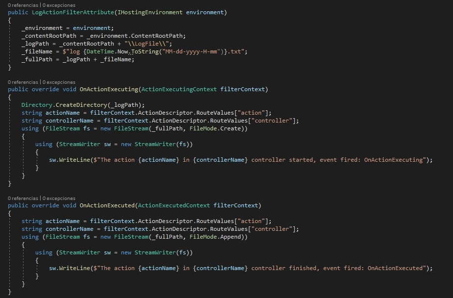

#### Tarea 5: Aplicar el filtro de acción a la acción del Controller

1. En la ventana **WorldJourney - Microsoft Visual Studio**, en el Explorador de soluciones, haga clic en **Startup.cs**.

2. Coloca el cursor al final del código del espacio de nombres de **WorldJourney.Models**, presiona Enter, y luego escribe el siguiente código:
   ```cs
       using WorldJourney.Filters;
   ```
3. En la ventana del código **Startup.cs**, localiza el siguiente código:
    ```cs
       services.AddSingleton<IData, Data>();
   ```
4. Coloque el cursor del ratón después del código localizado, escriba el siguiente código y luego presione Enter.
   ```cs
       services.AddScoped<LogActionFilterAttribute>();
   ``` 

5. En la ventana **WorldJourney - Microsoft Visual Studio**, en el Explorador de Soluciones, expandir **Controllers**, y luego hacer clic en **CityController.cs**.

6. En el bloque de código **CityController.cs**, localice el siguiente código:
   ```cs
       using WorldJourney.Models; 
   ```
7. Asegúrate de que el cursor está al final del espacio de nombres **using WorldJourney.Models;**, presiona Enter, y luego escribe el siguiente código:
   ```cs
       using WorldJourney.Filters;  
   ```
8. En el bloque de código de clase **CityController**, localiza el siguiente código:
    ```cs
       [Route("WorldJourney")]
   ```
9. Coloca el cursor del ratón antes del código localizado, presiona Enter, y luego escribe el siguiente código:
   ```cs
       [ServiceFilter(typeof(LogActionFilterAttribute))]
   ``` 

#### Tarea 6: Ejecutar la aplicación y verificar que el nuevo filtro funciona

1. En la ventana de **WorldJourney - Microsoft Visual Studio**, en el menú **FILE**, haga clic en **Save All**.

2. En la ventana de **WorldJourney - Microsoft Visual Studio**, en el menú **DEBUG**, haga clic en **Iniciar sin depuración**.

3. Haz clic en **Seguir adelante**. 

4. En Microsoft Edge, en la imagen **Earth**, haga clic en el área **London**. Noten la flecha roja en el centro de la imagen **Earth**.

- La representación visual a la respuesta del último ejercicio se muestra en la siguiente imagen:

 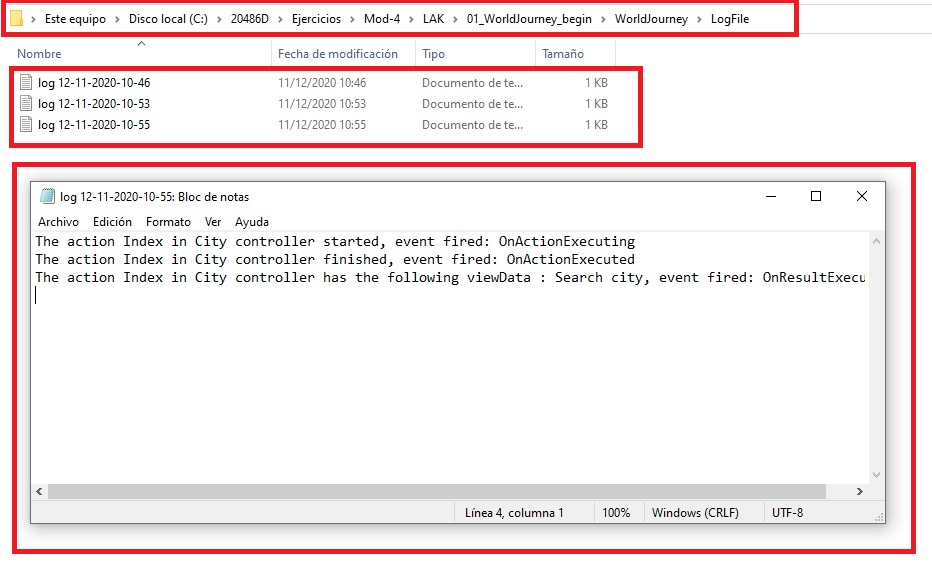

5. Haz clic en **Volver**.

6. En el borde de Microsoft, haz clic en **Cerrar**.

7. En la ventana de **WorldJourney - Microsoft Visual Studio**, en el menú **FILE**, haga clic en **Salir**.

8. Navega a **[Repository Root]\Allfiles\Mod04\Labfiles\01_WorldJourney_begin\WorldJourney\LogFile** y abre **Archivo de texto**. 

    > **Nota**: **El archivo de texto muestra el resultado del nuevo filtro.

> **Resultados**: Después de completar este ejercicio, puedes crear una clase de filtro de acción que registre los detalles de las acciones, los Controllers y los parámetros en un archivo externo cada vez que se llame a una acción.


