# Módulo 4: Desarrollo de Controllers

Tiempo estimado:**75 minutos**

## Pasos de preparación

Entregar el url de GitHub con la solución y un readme con las siguiente información:

1. **Nombres y apellidos:** José René Fuentes Cortez
2. **Fecha:** 15 de Octubre 2020.
3. **Resumen del Modulo 4:** Este módulo consta de tres lecciones:
- En la primera lección nos guía para poder crear y escribir controladores y acciones.
- En la segunda lección hacemos pasos para poder crear y configura rutas de acceso en un aplicación.
- En la tercera lección nos guia para la creación de filtros y como usarlos.


4. **Dificultad o problemas presentados y como se resolvieron:** Ninguna.

**NOTA**: Si no hay descripcion de problemas o dificultades, y al yo descargar el código para realizar la comprobacion y el código no funcionar, el resultado de la califaciación del laboratorio será afectado.

---


Dondequiera que la ruta de un archivo comience con *[Raíz del repositorio]*, reemplácela con la ruta absoluta de la carpeta en la que reside el repositorio 20486. Por ejemplo, si clonaste o extrajiste el repositorio 20486 a **C:\Users\John Doe\Downloads\20486**, cambiar el camino: **[Repository Root]\AllFiles\20486D\Mod01** a **C:\Users\John Doe\Downloads\20486\AllFiles\20486D\Mod01**..

# Lección 1: Escribir Controllers y acciones

### Demonstration: Cómo escribir Controllers y acciones

#### Pasos de preparación

1. Asegúrate de que has clonado el directorio **20486D** de GitHub (**https://github.com/MicrosoftLearning/20486D-DevelopingASPNETMVCWebApplications/tree/master/Allfiles**). Contiene los segmentos de código para los laboratorios y demostraciones de este curso.

2. Navega a **[Repository Root]\Allfiles\Mod04\Democode\01_ControllersExample_begin**, y luego abre el **ControllersExample.sln**.

    > **Nota**: Si aparece un cuadro de diálogo de **Aviso de Seguridad para ControllersExample**, verifique que la casilla de verificación **Pregúntame por cada proyecto de esta solución** esté despejada, y luego haga clic en OK.

3. En la ventana **Ejemplo de controlador - Microsoft Visual Studio**, en el menú **DEBUG**, haga clic en **Iniciar sin depuración**.

4. En Microsoft Edge, en la barra de direcciones, anote el número de puerto que aparece al final del URL **http://localhost:[port]**. Usará el número de puerto durante esta demostración.

- La representación visual a la respuesta del último ejercicio se muestra en la siguiente imagen:

 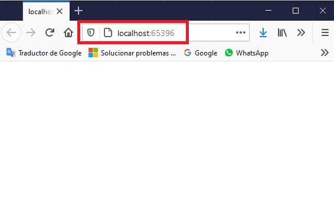

5. En Microsoft Edge, haga clic en **Cerrar**.

#### Pasos de la demostración

1. Navega a **[Repository Root]\Allfiles\Mod04\Democode\01_ControllersExample_begin** y haz doble clic en **ControllersExample.sln**.
    
    > **Nota**: Si aparece un cuadro de diálogo de **Aviso de Seguridad para ControllersExample**, verifique que la casilla de verificación **Pregúntame por cada proyecto de esta solución** esté despejada, y luego haga clic en OK.

2. En el Explorador de soluciones, haga clic con el botón derecho del ratón en **ControllersExample**, apunte a **Agregar**, y luego seleccione **Nueva carpeta**.

3. En la casilla **Nueva Carpeta**, escriba **Controllers**, y luego pulse Intro.

- La representación visual a la respuesta del último ejercicio se muestra en la siguiente imagen:

 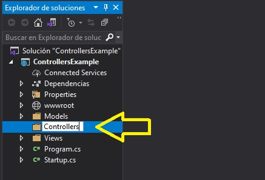

4. En la ventana **Ejemplo de Controllers - Microsoft Visual Studio**, en el Explorador de soluciones, haga clic con el botón derecho del ratón en la carpeta **Controllers**, apunte a **Agregar**, y luego seleccione **Controlador**.

5. En el cuadro de diálogo **Agregar andamiaje**, haga clic en **Controlador MVC - Empty** y, a continuación, haga clic en **Agregar**.

6. En el cuadro de diálogo **Añadir controlador MVC vacío**, en el cuadro **Nombre del controlador**, escriba **HomeController** y, a continuación, haga clic en **Añadir**.

- La representación visual a la respuesta del último ejercicio se muestra en la siguiente imagen:

 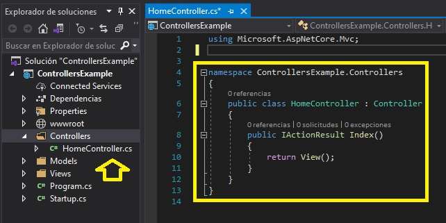

7. En la ventana de código **HomeController.cs**, localice el siguiente código:
  ```cs
       using Microsoft.AspNetCore.Mvc;
  ```

8. Asegúrate de que el cursor está al final del espacio de nombres **Microsoft.AspNetCore.Mvc**, presiona Enter, y luego escribe el siguiente código:
  ```cs
       using ControllersExample.Models;
  ```

9. En el bloque de código de clase **HomeController**, en el bloque de código de acción **Index**, seleccione el siguiente código:
  ```cs
       return View();
  ```

10. Reemplace el código seleccionado por el siguiente código:
  ```cs
       ExampleModel model = new ExampleModel() { Sentence = "Welcome to module 4 demo 1" };
       return View(model);
  ```

11. Asegúrate de que el cursor está al final del bloque de código de acción **Index**, presiona Enter dos veces, y luego escribe el siguiente código:
  ```cs
       public IActionResult ParamExample(string id)
       {
       }
  ```

12. En el bloque de código de acción **Paramexample**, escriba el siguiente código:
  ```cs
        return Content("My param is: " + id);
  ```  

13. Ponga el cursor al final del bloque de código de acción **Param-Ejemplo**, presione Enter dos veces, y luego escriba el siguiente código:
  ```cs
        public IActionResult RouteDataExample()
        {
        }
  ```

14. En el bloque de código de acción **RouteDataExample**, escriba el siguiente código:
  ```cs
        string controller = (string)RouteData.Values["Controller"];
        string action = (string)RouteData.Values["action"];
        string id = (string)RouteData.Values["id"];
        return Content($"Action information: the action is in {controller} controller, the action name is {action} and the id value is {id}");
  ```

15. Ponga el cursor al final del bloque de código de acción **RouteDataExample**, presione Enter dos veces, y luego escriba el siguiente código:
  ```cs
        public IActionResult ViewBagExample()
        {
        }
  ```  
16. En el bloque de código de acción **ViewBagExample**, escriba el siguiente código:
  ```cs
        ViewBag.Message = "ViewBag Example";
        return View();
  ```

17. Coloca el cursor al final del bloque de código de acción **ViewBagExample**, pulsa Enter dos veces, y luego escribe el siguiente código:
  ```cs
        public IActionResult ViewDataExample()
        {
        }
  ```

18. En el bloque de código de acción **ViewDataExample**, escriba el siguiente código:
  ```cs
        ViewData["Message"] = "ViewData Example";
        return View();
  ```

19. En la ventana **ControllersExample - Microsoft Visual Studio**, en el menú **Archivo**, haga clic en **Guardar Controlador.cs**.

20. En la ventana **Ejemplo de Controllers - Microsoft Visual Studio**, en el menú **DEBUG**, haga clic en **Iniciar sin depuración**

      > **Nota**: El texto **Bienvenido al módulo 4 demo 1** es el resultado de la acción que añadió a la acción **Index**.

- La representación visual a la respuesta del último ejercicio se muestra en la siguiente imagen:

 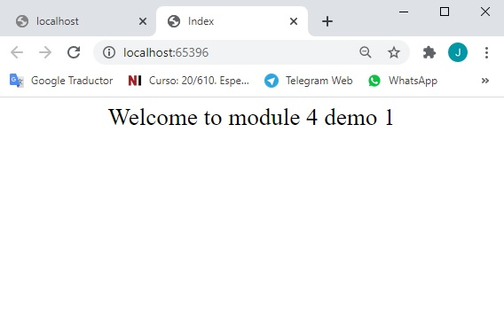

21. En Microsoft Edge, en la barra de direcciones, escriba **http://localhost:[port]/home/ParamExample/2**, y luego presione Enter.

      > **Nota**: El **Mi param es: 2** texto es el resultado del contenido que has añadido en la acción **ParamExample**.

- La representación visual a la respuesta del último ejercicio se muestra en la siguiente imagen:

 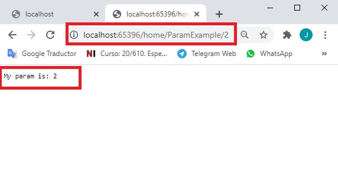

22. En Microsoft Edge, en la barra de direcciones, escribe **http://localhost:[port]/home/RouteDataExample/4**, y luego presiona Enter.

      > **Nota**: La información de **Acción: La acción está en el controlador de inicio, el nombre de la acción es RouteDataExample y el valor de id es 4** texto es el resultado del contenido que has añadido en la acción **RouteDataExample**.

- La representación visual a la respuesta del último ejercicio se muestra en la siguiente imagen:

 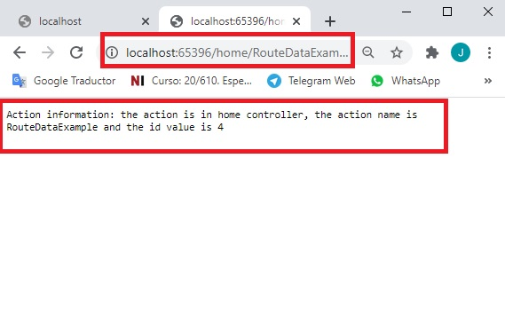

23. En Microsoft Edge, en la barra de direcciones, escribe **http://localhost:[port]/home/ViewBagExample**, y luego pulsa Intro.

      > **Nota**: El **El mensaje es: El texto **ViewBag Example** es el resultado de la acción que agregaste en la acción **ViewBagExample**.

- La representación visual a la respuesta del último ejercicio se muestra en la siguiente imagen:

 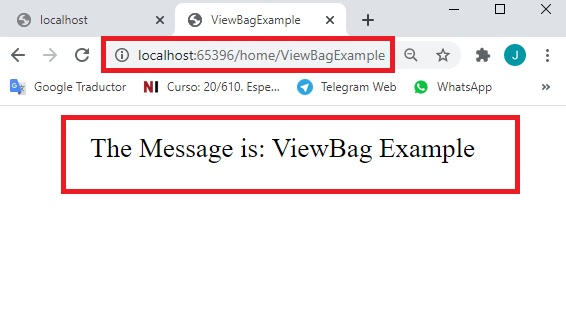

24. En Microsoft Edge, en la barra de direcciones, escribe **http://localhost:[port]/home/ViewDataExample**, y luego presiona Enter.

      > **Nota**: El **El mensaje es: El texto **ViewData Example** es el resultado de la acción que agregaste en la acción **ViewDataExample**.

- La representación visual a la respuesta del último ejercicio se muestra en la siguiente imagen:

 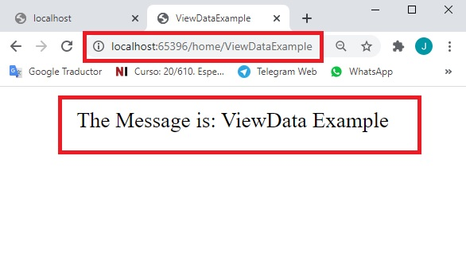

25. En Microsoft Edge, haz clic en **Cerrar**.

26. En la ventana **Ejemplo de controlador - Microsoft Visual Studio**, en el menú **Archivo**, haga clic en **Salir**.

# Lección 2: Configuración de rutas

### Demonstration: Cómo añadir rutas
#### Pasos de preparación

1. Asegúrate de que has clonado el directorio **20486D** de GitHub (**https://github.com/MicrosoftLearning/20486D-DevelopingASPNETMVCWebApplications/tree/master/Allfiles**). Contiene los segmentos de código para los laboratorios y demostraciones de este curso. 

2. Navega a **[Raíz del repositorio]\Ntodos los archivos\NMod04\N-Democode\N02_Rutas-Ejemplo_comienzo**, y luego abre el **Rutas-Ejemplo.sln**.

    > **Nota**: Si aparece un cuadro de diálogo de **Aviso de Seguridad para Rutas-Ejemplo**, verifique que la casilla de verificación **Pregúntame por cada proyecto de esta solución** esté despejada, y luego haga clic en OK.

3. En la ventana **RoutesExample - Microsoft Visual Studio**, en el menú **DEBUG**, haga clic en **Start Without Debugging**.

4. En Microsoft Edge, en la barra de direcciones, anota el número de puerto que aparece al final del URL **http://localhost:[port]**. Usará el número de puerto durante esta demostración.

- La representación visual a la respuesta del último ejercicio se muestra en la siguiente imagen:

 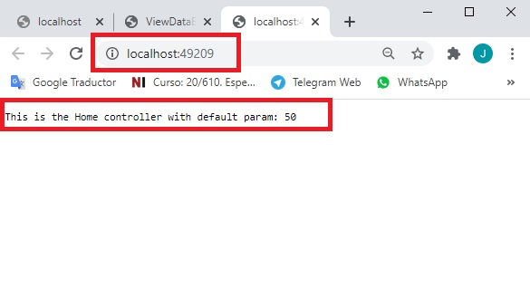

5. En Microsoft Edge, haga clic en **Cerrar**. 


#### Pasos de demostración

1. Navega a **[Repository Root]\Allfiles\Mod04\Democode\02_RoutesExample_begin** y haz doble clic en **Rutas-Ejemplo.sln**.

    > **Nota**: Si aparece un cuadro de diálogo de **Aviso de Seguridad para Rutas-Ejemplo**, verifique que la casilla de verificación **Pregúntame por cada proyecto de esta solución** esté despejada, y luego haga clic en OK.

2. En el Explorador de soluciones, haga clic con el botón derecho del ratón en **RutasEjemplo**, apunte a **Agregar**, y luego haga clic en **Nueva carpeta**.

3. En el cuadro **Nueva Carpeta**, escriba **Controladores** y, a continuación, pulse Intro.

4. En la ventana **Ejemplo de rutas - Microsoft Visual Studio**, en el Explorador de soluciones, haga clic con el botón derecho del ratón en la carpeta **Controladores**, apunte a **Agregar** y, a continuación, haga clic en **Controlador**.

- La representación visual a la respuesta del último ejercicio se muestra en la siguiente imagen:

 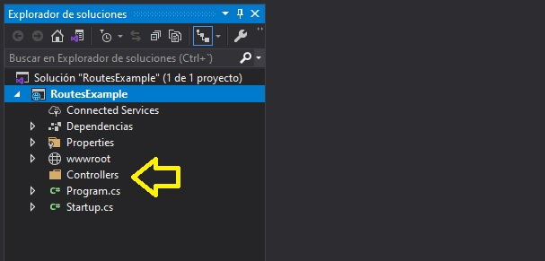

5. En el cuadro de diálogo **Agregar andamiaje**, haga clic en **Controlador MVC - Empty** y, a continuación, haga clic en **Agregar**.

6.  En el cuadro de diálogo **Añadir controlador MVC vacío**, en el cuadro **Nombre del controlador**, escriba **HomeController** y, a continuación, haga clic en **Añadir**.

- La representación visual a la respuesta del último ejercicio se muestra en la siguiente imagen:

 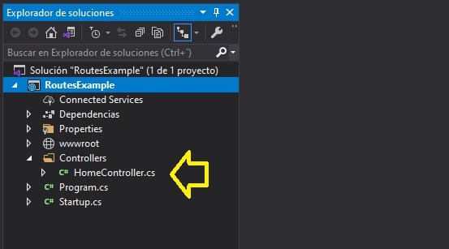

7. En el bloque de código de clase **HomeController**, seleccione el siguiente código:
  ```cs
        public IActionResult Index()
        {
            return View();
        }
  ```

8. Reemplazar el código seleccionado por el siguiente código:
  ```cs
        public IActionResult Index(int id = 50)
        {
            return Content("This is the Home controller with default param: " + id);
        }
  ```

9. Asegúrate de que el cursor está al final del bloque de código de acción **Index**, presiona Enter dos veces, y luego escribe el siguiente código:
  ```cs
        [Route("Hello/{firstName}/{lastName}")]
        public IActionResult Greeting(string firstName, string lastName)
        {
        }
  ```

10. En el bloque de código de acción **Greeting**, escriba el siguiente código:
  ```cs
        return Content($"Hello {firstName} {lastName} from module 4 demo 2");
  ```

- La representación visual a la respuesta del último ejercicio se muestra en la siguiente imagen:

 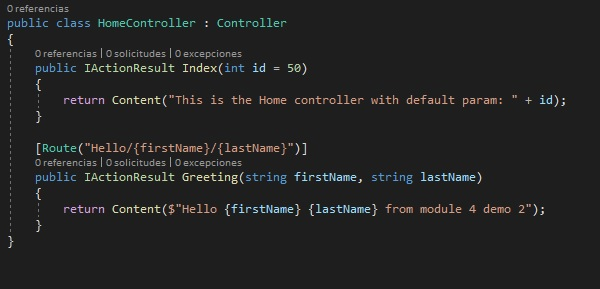

11. En la ventana **Rutas-Ejemplo - Microsoft Visual Studio**, en el Explorador de soluciones, haga clic con el botón derecho en la carpeta **Controladores**, apunte a **Agregar**, y luego haga clic en **Controlador**.

12. En el cuadro de diálogo **Agregar andamiaje**, haga clic en **Controlador MVC - Empty**, y luego haga clic en **Agregar**.

13. En el cuadro de diálogo **Añadir controlador MVC vacío**, en el cuadro **Nombre del controlador**, escriba **CalculatorController** y, a continuación, haga clic en **Añadir**.

- La representación visual a la respuesta del último ejercicio se muestra en la siguiente imagen:

 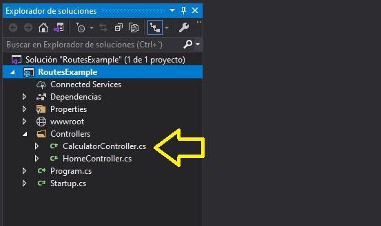

14. En el bloque de código de clase **CalculadorControlador**, seleccione el siguiente código:
  ```cs
        public IActionResult Index()
        {
            return View();
        }
  ```

15. Reemplazar el código seleccionado por el siguiente código:
  ```cs
        public IActionResult MultByTwo(int num)
        {
            int result = num * 2;
            return Content(result.ToString());
        }
  ```

16. Asegúrate de que el cursor está al final del bloque de código de acción **MultiByTwo**, pulsa Intro dos veces, y luego escribe el siguiente código:
  ```cs
        [Ruta("Calc/Mult/{num1:int}/{num2:int}")]
        public IActionResult Mult(int num1, int num2)
        {
        }
  ```

17. En el bloque de código de acción **Mult**, escriba el siguiente código:
  ```cs
        int result = num1 * num2;
        return Content(result.ToString());
  ```

18. Asegúrate de que el cursor está al final del bloque de código de acción **Mult**, presiona Enter dos veces, y luego escribe el siguiente código:
  ```cs
        [HttpGet("Divide/{param?}")]
        public IActionResult DivideByTen(int param)
        {
        }
  ```

19. En el bloque de código de acción **DivideByTen**, escribe el siguiente código:
  ```cs
        int result = param / 10;
        return Content(result.ToString());
  ```

20. En la ventana **Rutas-Ejemplo - Microsoft Visual Studio**, en el Explorador de Soluciones, haga clic en **Startup.cs**.

21. En el bloque de código del método **Configurar**, escriba el siguiente código:
```cs
        app.UseMvc(routes =>
            {
                routes.MapRoute(
                    name: "firstRoute",
                    template: "{controller}/{action}/{num:int}");

                routes.MapRoute(
                    name: "secondRoute",
                    template: "{controller}/{action}/{id?}",
                    defaults: new { controller = "Home", action = "Index" });
            });
  ```

- La representación visual a la respuesta del último ejercicio se muestra en la siguiente imagen:

 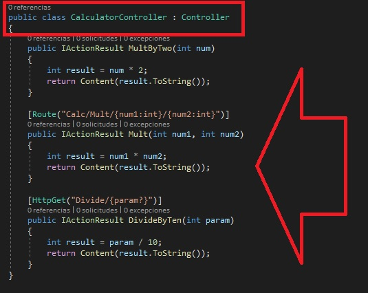

22. En la ventana **Rutas-Ejemplo - Microsoft Visual Studio**, en el menú **Archivo**, haga clic en **Guardar todo**.

23. En la ventana **Ejemplo de rutas - Microsoft Visual Studio**, en el menú **DEBUG**, haga clic en **Iniciar sin depuración**.

      > **Nota**: La ventana del navegador muestra el mensaje **Este es el controlador de casa con el parámetro por defecto: 50**. Llegó a la acción **Index** del controlador **Home** debido a una ruta basada en convenciones.

- La representación visual a la respuesta del último ejercicio se muestra en la siguiente imagen:

 

24. En Microsoft Edge, en la barra de direcciones, escribe **http://localhost:[port]/Hello/Gerald/Tesch**, y luego presiona Enter.

      > **Nota**: La ventana del navegador muestra el mensaje **Hola Gerald Tesch del módulo 4 demo 2**. Ha llegado a la acción **Hello** del controlador **Home** por una ruta basada en atributos.

- La representación visual a la respuesta del último ejercicio se muestra en la siguiente imagen:

 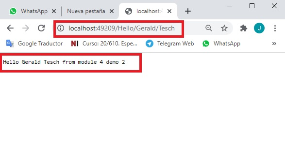

25. En Microsoft Edge, en la barra de direcciones, escribe **http://localhost:[port]/Calculator/MultByTwo/4**, y luego presiona Enter.

      > **Nota**: La ventana del navegador muestra **8**. Ha llegado a la acción **MultByTwo** del controlador **Calculator**

- La representación visual a la respuesta del último ejercicio se muestra en la siguiente imagen:

 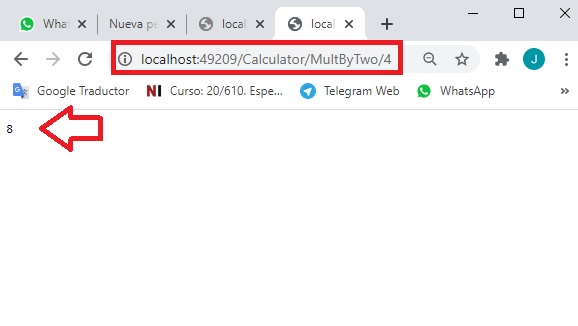

26. En Microsoft Edge, en la barra de direcciones, escriba **http://localhost:[port]/Calc/Mult/5/5**, y luego presione Enter.

      > **Nota**: La ventana del navegador muestra **25**. Has llegado a la acción **Mult** del controlador **Calculator** por una ruta basada en atributos.

- La representación visual a la respuesta del último ejercicio se muestra en la siguiente imagen:

 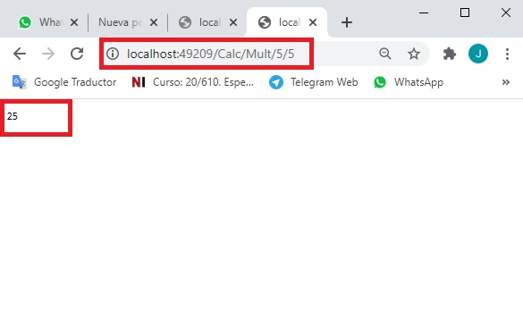

27. En Microsoft Edge, en la barra de direcciones, escribe **http://localhost:[port]/Divide/100**, y luego presiona Enter.

      > **Nota**: La ventana del navegador muestra **10**. Se ha llegado a la acción **DivideByTen** del controlador **Calculator** por una ruta basada en atributos.


- La representación visual a la respuesta del último ejercicio se muestra en la siguiente imagen:

 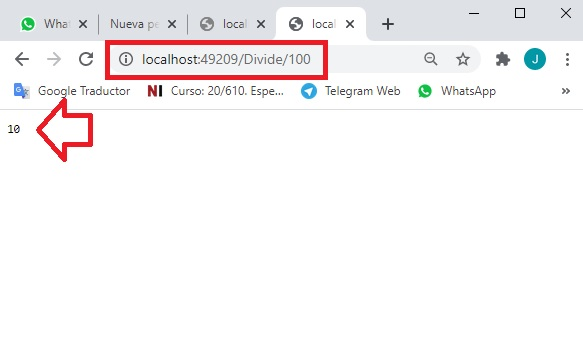

28. En Microsoft Edge, en la barra de direcciones, escribe **http://localhost:[port]/Divide**, y luego presiona Enter.

      > **Nota**: La ventana del navegador muestra **0**. Debido a que no se proporcionó ningún valor a **param**, recibió el valor **0**. 

- La representación visual a la respuesta del último ejercicio se muestra en la siguiente imagen:

 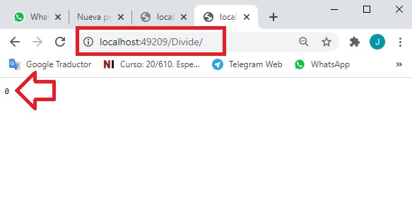

29. En Microsoft Edge, haga clic en **Cerrar**.

30. En la ventana **Rutas-Ejemplo - Microsoft Visual Studio**, en el menú **Archivo**, haga clic en **Salir**.

# Lección 3: Escribir filtros de acción

### Demonstration: Cómo crear y utilizar los filtros de acción 

#### Pasos de preparación

Asegúrate de que has clonado el directorio **20486D** de GitHub (**https://github.com/MicrosoftLearning/20486D-DevelopingASPNETMVCWebApplications/tree/master/Allfiles**). Contiene los segmentos de código para los laboratorios y demostraciones de este curso.

#### Pasos de la demostración

1. Navega a **[Repository Root]\Allfiles\Mod04\Democode\03_FiltersExample_begin** y haz doble clic en **FiltersExample.sln**.

    > **Nota**: Si aparece un cuadro de diálogo de **Aviso de Seguridad para FiltersExample**, verifique que la casilla de verificación **Pregúnteme por cada proyecto de esta solución** esté desactivada, y luego haga clic en OK.

2. En el Explorador de soluciones, haga clic con el botón derecho del ratón en **FiltrosEjemplo**, apunte a **Agregar**, y luego haga clic en **Nueva carpeta**.

3. En la casilla **Nueva Carpeta**, escriba **Filtros** y, a continuación, pulse Intro.

- La representación visual a la respuesta del último ejercicio se muestra en la siguiente imagen:

 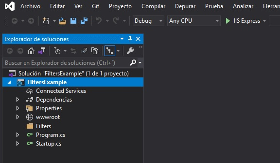

4. En la ventana **FiltrosEjemplo - Microsoft Visual Studio**, en el Explorador de soluciones, haga clic con el botón secundario en **Filtros**, apunte a **Agregar**, y luego haga clic en **Clase**.

5. En el cuadro de diálogo **Agregar nuevo elemento - FiltrosEjemplo**, en el cuadro **Nombre**, escriba **CustomActionFilter**, y luego haga clic en **Agregar**.

- La representación visual a la respuesta del último ejercicio se muestra en la siguiente imagen:

 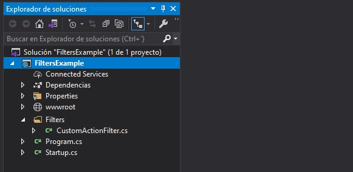

6. En la ventana de código de clase **CustomActionFilter**, localice el siguiente código:
  ```cs
       using System.Threading.Tasks;
  ```

7. Asegúrate de que el cursor está al final del espacio de nombres **System.Threading.Tasks**, presiona Enter, y luego escribe el siguiente código:
  ```cs
      using System.Diagnostics;
      using Microsoft.AspNetCore.Mvc;
      using Microsoft.AspNetCore.Mvc.Filters;
  ```

8. En la ventana del código de clase **CustomActionFilter**, localice el siguiente código:
  ```cs
       public class CustomActionFilter
  ```

9.  Añada el siguiente código a la línea de código existente:
  ```cs
       : ActionFilterAttribute
  ```

10. En el bloque de código de clase **CustomActionFilter**, presione Enter, y luego escriba el siguiente código:
  ```cs
        public override void OnActionExecuting(ActionExecutingContext filterContext)
        {
        }
  ```

11. En el bloque de código de acción **OnActionExecuting**, escriba el siguiente código:
  ```cs
        string actionName = filterContext.ActionDescriptor.RouteValues["action"];
        Debug.WriteLine(">>> " + actionName + " started, event fired: OnActionExecuting");
  ```

12. Asegúrate de que el cursor está al final del bloque de código de acción **Ejecución de la acción**, pulsa dos veces Intro y luego escribe el siguiente código:
  ```cs
        public override void OnActionExecuted(ActionExecutedContext filterContext)
        {            
        }
  ```

13. En el bloque de código de acción **OnActionExecuted**, escriba el siguiente código:
  ```cs
        string actionName = filterContext.ActionDescriptor.RouteValues["action"];
        Debug.WriteLine(">>> " + actionName + " finished, event fired: OnActionExecuted");
  ```

14. Asegúrate de que el cursor está al final del bloque de código de acción **Acción Ejecutada**, pulsa Intro dos veces, y luego escribe el siguiente código:
  ```cs
        public override void OnResultExecuting(ResultExecutingContext filterContext)
        {   
        }
  ```

15. En el bloque de código de acción **OnResultado de la ejecución**, escriba el siguiente código:
  ```cs
        string actionName = filterContext.ActionDescriptor.RouteValues["action"];
        Debug.WriteLine(">>> " + actionName + " before result, event fired: OnResultExecuting");
  ```

16. Asegúrate de que el cursor está al final del bloque de código de acción **Ejecución de resultados**, pulsa dos veces Intro y luego escribe el siguiente código:
  ```cs
        public override void OnResultExecuted(ResultExecutedContext filterContext)
        {            
        }
  ```

17. En el bloque de código de acción **OnResultado Ejecutado**, escriba el siguiente código:
  ```cs
        string actionName = filterContext.ActionDescriptor.RouteValues["action"];
        ContentResult result = (ContentResult)filterContext.Result;
        Debug.WriteLine(">>> " + actionName + " result is: " + result.Content + " , event fired: OnResultExecuted");
  ```

- La representación visual a la respuesta del último ejercicio se muestra en la siguiente imagen:

 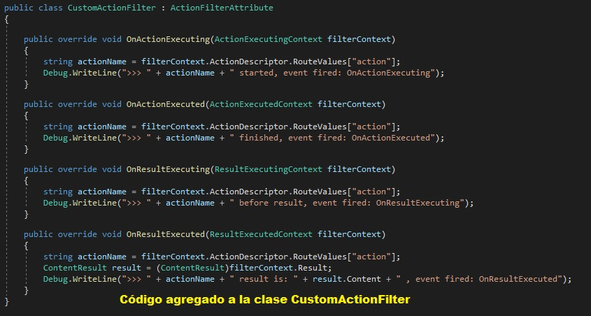

18. En la ventana **FiltersExample - Microsoft Visual Studio**, expanda **Controladores**, y luego haga clic en **HomeController.cs**.

- La representación visual a la respuesta del último ejercicio se muestra en la siguiente imagen:

 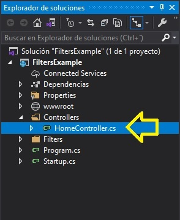

19. En la ventana del código **HomeController**, localiza el siguiente código:
  ```cs
        using Microsoft.AspNetCore.Mvc;
  ```

20. Asegúrate de que el cursor está al final del espacio de nombres **Microsoft.AspNetCore.Mvc**, presiona Enter, y luego escribe el siguiente código:
  ```cs
        using FiltersExample.Filters;
  ```

21. En el bloque de código de clase **HomeController**, seleccione el siguiente código:
  ```cs
        public IActionResult Index()
        {
            return View();
        }
  ```

22. Reemplazar el código seleccionado por el siguiente código:
  ```cs
        [CustomActionFilter]
        public IActionResult Index()
        {
            return Content("Welcome to module 4 demo 3");
        }
  ```

- La representación visual a la respuesta del último ejercicio se muestra en la siguiente imagen:

 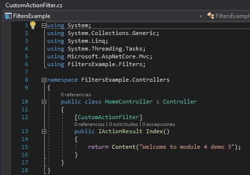

23. En la ventana **FiltersExample - Microsoft Visual Studio**, en el menú **Archivo**, haga clic en **Guardar todo**.

24. En la ventana **FiltersExample - Microsoft Visual Studio**, en el menú **DEBUG**, apunte a **Windows** y, a continuación, haga clic en **Salir**.

- La representación visual a la respuesta del último ejercicio se muestra en la siguiente imagen:

 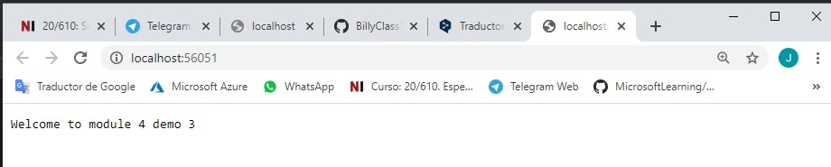

25. En la ventana **FiltersExample - Microsoft Visual Studio**, en el menú **DEBUG**, haga clic en **Iniciar depuración**.

26. En la barra de tareas, haga clic en **FiltersExample - Microsoft Visual Studio**.

27. En la ventana **FiltersExample - Microsoft Visual Studio**, en el panel **Salida**, haga clic en la pestaña **Salida**.

28. En la pestaña **Salida**, en el cuadro **Mostrar salida de**, haga clic en **Debug**.

- La representación visual a la respuesta del último ejercicio se muestra en la siguiente imagen:

 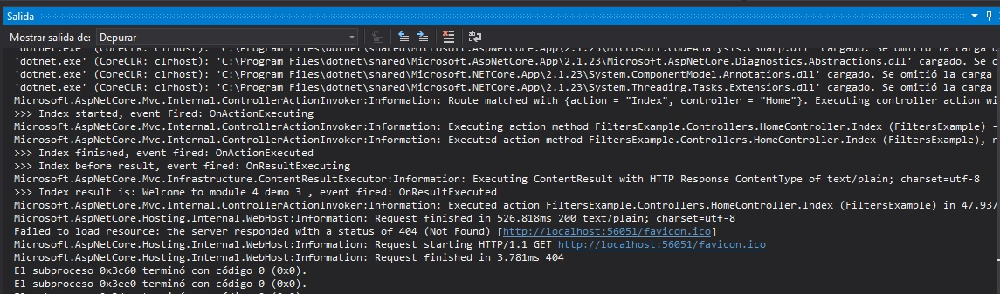

29. En la pestaña **Salida**, localice las siguientes líneas de código:
  ```cs
       >>> Index started, event fired: OnActionExecuting
       >>> Index finished, event fired: OnActionExecuted
       >>> Index before result, event fired: OnResultExecuting
       >>> Index result is: Welcome to module 4 demo 3, event fired: OnResultExecuted
  ```
   > **Nota**: El texto de arriba fue generado por las llamadas al método **Debug.WriteLine** en la clase **CustomActionFilter**.

- La representación visual a la respuesta del último ejercicio se muestra en la siguiente imagen:

 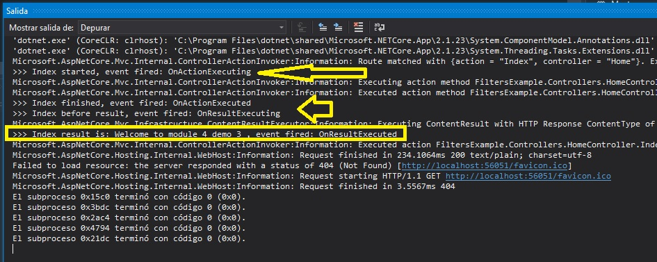

30. En Microsoft Edge, haz clic en **Cerrar**.

31. En la ventana **FiltersExample - Microsoft Visual Studio**, en el menú **Archivo**, haga clic en **Salir**.

