# Módulo 5: Desarrollando Vistas


Fichero de Instrucciones: Instructions\20486D_MOD05_DEMO.md

Entregar el url de GitHub con la solución y un readme con las siguiente información:

1. **Nombres y apellidos:** José René Fuentes Cortez
2. **Fecha:** 24 de Noviembre 2020.
3. **Resumen del Modulo 5:** Este módulo consta de dos ejercicios:
    -  En el primer ejercio nos ayuda a entender como usar la metodología del ASP.NET Identity.
    - En el ejercicio 2 la práctica nos ayuda a entender como autorizar el acceso a aciones del controlador.


4. **Dificultad o problemas presentados y como se resolvieron:** Ninguna.

**NOTA**: Si no hay descripcion de problemas o dificultades, y al yo descargar el código para realizar la comprobacion y el código no funcionar, el resultado de la califaciación del laboratorio será afectado.

---

Siempre que la ruta a un archivo comience con *[Raíz del repositorio]*, reemplácela con la ruta absoluta a la carpeta en la que reside el repositorio 20486. Por ejemplo, si clonó o extrajo el repositorio 20486 en **C:\Users\John Doe\Downloads\20486**, cambiar el camino a: **[Repository Root]\AllFiles\20486D\Mod01** al **C:\Users\John Doe\Downloads\20486\AllFiles\20486D\Mod01**

# Lección 1: Creando vistas con sintaxis Razor

### Demonstration: Cómo usar la sintaxis de Razor

#### Pasos de preparación 


Asegúrese de haber clonado el directorio **20486D** de GitHub. Contiene los segmentos de código para los laboratorios y demostraciones de este curso.
**(https://github.com/MicrosoftLearning/20486D-DevelopingASPNETMVCWebApplications/tree/master/Allfiles)**


#### Pasos de demostración


1. Ve a **[Repository Root]\Allfiles\Mod05\Democode\01_RazorSyntaxExample_begin**,  y luego haz doble clic en **RazorSyntaxExample.sln**.

    >**Nota**: Si aparece un cuadro de diálogo **Security Warning for RazorSyntaxExample**, verifique que la casilla de verificación **Ask me for every project in this solution** (Preguntarme por cada proyecto de esta solución) esté desactivada y luego haga clic en OK.


2. En la ventana **RazorSyntaxExample - Microsoft Visual Studio**, en el Solution Explorer, en **RazorSyntaxExample**, amplíe **Controllers**, y luego haga clic en **ProductController.cs**.

3. En la ventana de código **ProductController.cs**, localice el siguiente código:
  ```cs
    public IActionResult Index()
    {
  ```

4. Ponga el cursor al final del código localizado, presione Enter, y luego escriba el siguiente código:
  ```cs
    ViewBag.ProductPrices = new Dictionary<string, int>();
    ViewBag.ProductPrices.Add("Bread", 5);
    ViewBag.ProductPrices.Add("Rice", 3);
  ```

5. En la ventana del código **ProductController.cs**, localice el siguiente código:
  ```css
    public IActionResult Index()
  ```
- La representación visual a la respuesta del último ejercicio se muestra en la siguiente imagen:

 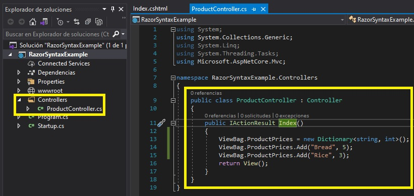

6. Haga clic con el botón derecho del ratón en el nombre del método **Index** y luego haga clic en **Agregar vista**.

7. En el cuadro de diálogo **Agregar Vista MVC**, asegúrese de que el valor del cuadro **Nombre de la vista** sea **Índice**.

8. En el cuadro de diálogo **Agregar vista MVC**, asegúrese de que las casillas de verificación **Crear como una vista parcial** y **Utilizar una página de diseño** estén desactivadas y, a continuación, haga clic en **Agregar**.
    >**Nota**: En el Explorador de soluciones, en **Vistas**, en **Producto**, asegúrate de que se ha creado **Index.cshtml**.
    
9. En la ventana del código **Index.cshtml**, en el elemento **BODY**, presione Enter, y luego escriba el siguiente código:
  ```cs
    @foreach (KeyValuePair<string, int> productPrices in ViewBag.ProductPrices)
    {

    }
  ```

10. En el bloque de código **@foreach**, escriba el siguiente código:
  ```cs
    <p>
       
    </p>
  ```

11. En la ventana del código **Index.cshtml**, en el elemento **P**, escriba el siguiente código, y luego presione Enter.
  ```cs
    <div>
        Product name: @productPrices.Key
    </div>
  ```

12. En el elemento **P**, debajo del elemento **DIV**, escriba el siguiente código:
  ```cs
    <div>
        Product price including tax: @productPrices.Value * 1.2
    </div>
  ```
- La representación visual a la respuesta del último ejercicio se muestra en la siguiente imagen:

 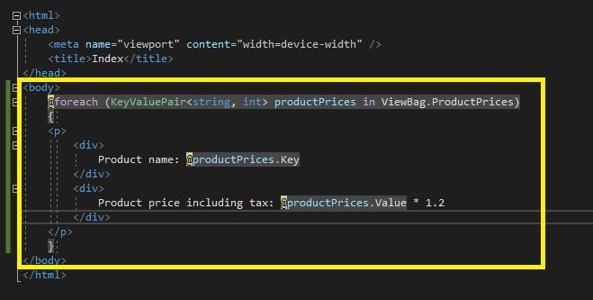

13. En la ventana **RazorSyntaxExample - Microsoft Visual Studio**, en el menú **FILE**, haga clic en **Save All**.

14. En la ventana **RazorSyntaxExample - Microsoft Visual Studio**, en el menú **DEBUG**, haga clic en **Start Without Debugging**.
    >**Nota**: El navegador muestra el siguiente texto:<br>
    > **Nombre del producto: Pan**<br>
    > El precio del producto incluye el impuesto: 5 * 1.2__<br>
    > <br>
    > **Nombre del producto: Arroz**<br>
    > El precio del producto incluye el impuesto: 3 * 1.2__"
  
- La representación visual a la respuesta del último ejercicio se muestra en la siguiente imagen:

 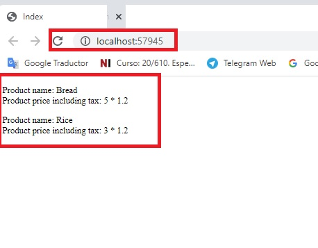

15. En Microsoft Edge, haz clic en **Cerrar**.

16. En la ventana del código **Index.cshtml**, seleccione el siguiente código:
  ```cs
        Product price including tax: @productPrices.Value * 1.2
  ```

17. Reemplazar el código seleccionado por el siguiente código:
  ```cs
        Product price including tax: @(productPrices.Value * 1.2)
  ```

18. En la ventana **RazorSyntaxExample - Microsoft Visual Studio**, en el menú **FILE**, haga clic en **Save All**.

19. En la ventana **RazorSyntaxExample - Microsoft Visual Studio**, en el menú **DEBUG**, haga clic en **Start Without Debugging**.
    >**Nota**: El navegador muestra el siguiente texto:<br>
    > **Product name: Bread**<br>
    > **Product price including tax: 6**<br>
    > <br>
    > **Product name: Rice**<br>
    > **Product price including tax: 3.6**

- La representación visual a la respuesta del último ejercicio se muestra en la siguiente imagen:

 

20. En Microsoft Edge, haga clic en **Cerrar**.

21. En la ventana **RazorSyntaxExample - Microsoft Visual Studio**, en el menú **FILE**, haga clic en **Salir**.

# Lección 2: Uso de HTML helpers y etiquetas helpers

### Demonstration: Cómo usar HTML helpers

#### Pasos de preparación 

Asegúrate de que has clonado el directorio **20486D** de GitHub. Contiene los segmentos de código para los laboratorios y demostraciones de este curso. (**https://github.com/MicrosoftLearning/20486D-DevelopingASPNETMVCWebApplications/tree/master/Allfiles**)

#### Pasos de demostración

1. Navega a **[Repository Root]\Allfiles\Mod05\Democode\02_HTMLHelpersExample_begin**, y luego haz doble clic en **HTMLHelpersExample.sln**.
    >**Nota**: Si aparece un cuadro de diálogo de **Advertencia de seguridad para HTMLHelpersExample**, verifica que la casilla de verificación **Ask me for every project in this solution** está despejada, y luego haz clic en **OK**. 


2. En la ventana **HTMLHelpersExample - Microsoft Visual Studio**, en el Solution Explorer, expandir **Views**, expandir **Home**, y luego hacer clic en **Index.cshtml**.

3. En la ventana **Index.cshtml** código, localiza el siguiente código:
  ```cs
    <nav>
        <span>
            Photos
        </span>
        <span>
  ```

4. Ponga el cursor al final del código localizado, presione Enter, y luego escriba el siguiente código:
  ```cs
    @Html.ActionLink("Employees", "Index", "Employee")
  ```

- La representación visual a la respuesta del último ejercicio se muestra en la siguiente imagen:

 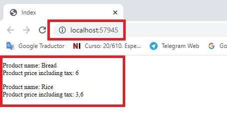

5. En la ventana **HTMLHelpersExample - Microsoft Visual Studio**, en el Explorador de Soluciones, expanda **Controllers**, y luego haga clic en **EmployeeController.cs**.

6. En la ventana de código **EmployeeController.cs**, localice el siguiente código:
  ```cs
    public IActionResult Index()
    {
  ```

7. Ponga el cursor al final del código localizado, presione Enter, y luego escriba el siguiente código:
  ```cs
    ViewBag.EmployeeNames = new string[] { "Michael", "Sarah", "Logan", "Elena", "Nathan" };
  ```

- La representación visual a la respuesta del último ejercicio se muestra en la siguiente imagen:

 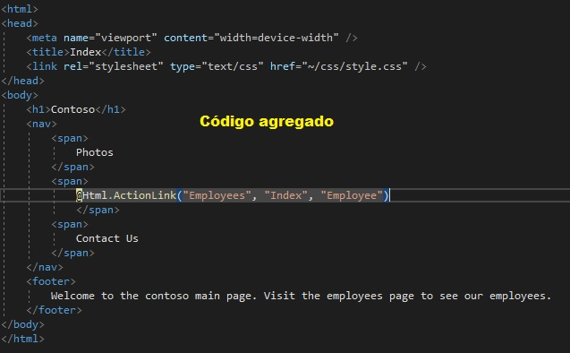

8. En la ventana **HTMLHelpersExample - Microsoft Visual Studio**, en el Solution Explorer, en **Views**, expandir **Empleado**, y luego hacer clic en **Index.cshtml**.

9. En la ventana de código **Index.cshtml**, localice el siguiente código:
  ```cs
    <p>Please select an employee from the list:</p>
  ```

10. Ponga el cursor al final del código localizado, presione Enter y luego escriba el siguiente código:
  ```cs
    @foreach (string currentName in ViewBag.EmployeeNames)
    {
    
    }
  ```

11. Coloca el cursor dentro del bloque de códigos **foreach** que acabas de crear, y luego escribe el siguiente código:
  ```cs
    <div>
        @Html.ActionLink(currentName, "Details", new { employeeName = currentName })
    </div>
  ```

12. En la ventana **HTMLHelpersExample - Microsoft Visual Studio**, en el Solution Explorer, en **Controllers**, haga clic en **EmployeeController.cs**.

13. En la ventana de código **EmployeeController.cs**, localice el siguiente código:
  ```cs
    public IActionResult Details(string employeeName)
    {
  ```

14. Ponga el cursor al final del código localizado, presione Enter y luego escriba el siguiente código:
  ```cs
    ViewBag.SelectedEmployee = employeeName;
  ```

15. En la ventana **HTMLHelpersExample - Microsoft Visual Studio**, en Solution Explorer, en **Views**, en **Empleado**, haga clic en **Details.cshtml**.

16. En la ventana del código **Details.cshtml**, localice el siguiente código:
  ```cs
    </p>
  ```

17. Ponga el cursor al final del código localizado, presione Enter, y luego escriba el siguiente código:
  ```cs
    
    <p>@Html.ActionLink("Back to employee selection list", "Index")</p>
  ```

- La representación visual a la respuesta del último ejercicio se muestra en la siguiente imagen:

 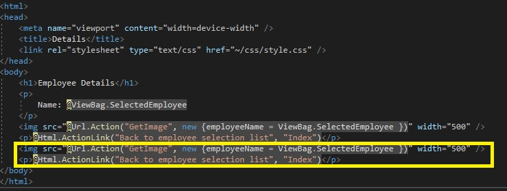

18. En la ventana **HTMLHelpersExample - Microsoft Visual Studio**, en el Solution Explorer, en **Controllers**, haga clic en **EmployeeController.cs**.

19. En la ventana de código **EmployeeController.cs**, en la acción **GetImage**, seleccione el siguiente código:
  ```cs
    return Content("");
  ```

20. Reemplaza el código seleccionado por el siguiente código:
  ```cs
    return File($@"\images\{employeeName.ToLower()}.jpg", "image/jpeg");
  ```


- La representación visual a la respuesta del último ejercicio se muestra en la siguiente imagen:

 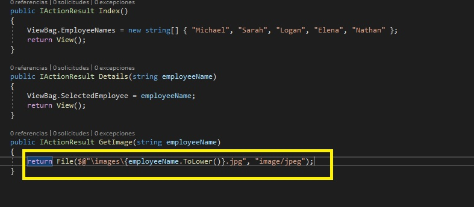

21. En la ventana **HTMLHelpersExample - Microsoft Visual Studio**, en el menú **FILE**, haga clic en **Save All**.

22. En la ventana **HTMLHelpersExample - Microsoft Visual Studio**, en el menú **DEBUG**, haga clic en **Start Without Debugging**.

- La representación visual a la respuesta del último ejercicio se muestra en la siguiente imagen:

 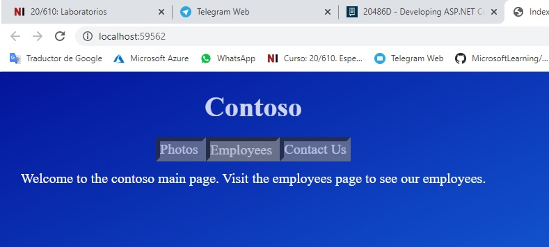

23. En Microsoft Edge, haga clic en **Employees**.
    >**Nota**: El navegador muestra una lista de enlaces, cada enlace es el nombre de un empleado.

- La representación visual a la respuesta del último ejercicio se muestra en la siguiente imagen:

 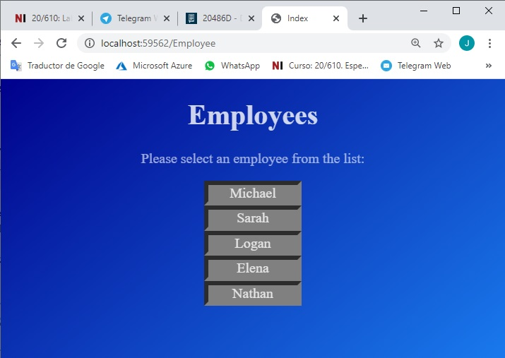

24. En Microsoft Edge, haz clic en **Michael**.
    >**Nota**: El navegador muestra el nombre y la foto de Michael.

- La representación visual a la respuesta del último ejercicio se muestra en la siguiente imagen:

 

25. En Microsoft Edge, haga clic en **Volver a la lista de selección de Employees**.

26. En Microsoft Edge, haz clic en **Elena**.
    >**Nota**: El navegador muestra el nombre y la foto de Elena.

- La representación visual a la respuesta del último ejercicio se muestra en la siguiente imagen:

 

27. En Microsoft Edge, haga clic en **Cerrar**.

28. En la ventana **HTMLHelpersExample - Microsoft Visual Studio**, en el menú **FILE**, haga clic en **Salir**.

# Lección 2: Usando Helpers HTML y etiquetas Helpers 

### Demonstration: Cómo usar las etiquetas Helpers  

#### Pasos de preparación 

Asegúrate de que has clonado el directorio **20486D** de GitHub. Contiene los segmentos de código para los laboratorios y demostraciones de este curso. (**https://github.com/MicrosoftLearning/20486D-DevelopingASPNETMVCWebApplications/tree/master/Allfiles**)

#### Pasos de demostración

1. Navega a **[Repository Root]\Allfiles\Mod05\Democode\03_TagHelpersExample_begin**, y luego haz doble clic en **TagHelpersExample.sln**.
    >**Nota**: Si aparece un cuadro de diálogo de **Aviso de seguridad para TagHelpersExample**, verifique que la casilla de verificación **Ask me for every project in this solution** esté despejada, y luego haga clic en **OK**. 

2. En la ventana **TagHelpersExample - Microsoft Visual Studio**, en el Explorador de soluciones, expanda **Home**, y luego haga clic en **Index.cshtml**.

3. En la ventana de código **Index.cshtml**, localice el siguiente código:
  ```cs
    @{
        Layout = null;
    }
  ```

4. Coloque el cursor antes del código localizado, presione Enter, presione la tecla de flecha hacia arriba, escriba el siguiente código y luego presione Enter.
  ```cs
    @addTagHelper *, Microsoft.AspNetCore.Mvc.TagHelpers
  ```

5. En la ventana del código **Index.cshtml**, seleccione el siguiente código:
  ```cs
    @Html.ActionLink("Employees", "Index", "Employee")
  ```

6. Sustituya el código seleccionado por el siguiente código:
  ```cs
    <a asp-controller="Employee" asp-action="Index">Employees</a>
  ```

7. En la ventana **TagHelpersExample - Microsoft Visual Studio**, en el Solution Explorer, en **Views**, expandir **Empleado**, y luego hacer clic en **Index.cshtml**.

8. En la ventana de código **Index.cshtml**, localice el siguiente código:
  ```cs
    @{
        Layout = null;
    }
  ```

9. Coloca el cursor antes del código localizado, presiona Enter, presiona la tecla de flecha hacia arriba, escribe el siguiente código y luego presiona Enter.
  ```cs
    @addTagHelper *, Microsoft.AspNetCore.Mvc.TagHelpers
  ```

10. En la ventana del código **Index.cshtml**, seleccione el siguiente código:
  ```cs
    @Html.ActionLink(currentName, "Details", new { employeeName = currentName })
  ```

11. Reemplazar el código seleccionado por el siguiente código:
  ```cs
    <a asp-action="Details" asp-route-employeename="@currentName">@currentName</a>
  ```

12. En la ventana **TagHelpersExample - Microsoft Visual Studio**, en Solution Explorer, en **Views**, en **Empleado**, haga clic en **Details.cshtml**.

13. En la ventana del código **Details.cshtml**, localice el siguiente código:
  ```cs
    @{
        Layout = null;
    }
  ```

14. Coloque el cursor antes del código localizado, presione Enter, presione la tecla de flecha hacia arriba, escriba el siguiente código y luego presione Enter.
  ```cs
    @addTagHelper *, Microsoft.AspNetCore.Mvc.TagHelpers
  ```

15. En la ventana del código **Details.cshtml**, seleccione el siguiente código:
  ```cs
    @Html.ActionLink("Back to employee selection list", "Index")
  ```

16. Sustituya el código seleccionado por el siguiente código:
  ```cs
    <a asp-action="Index">Back to employee selection list</a>
  ```

17. En la ventana **TagHelpersExample - Microsoft Visual Studio**, en el menú **FILE**, haga clic en **Save All**.

18. En la ventana **TagHelpersExample - Microsoft Visual Studio**, en el menú **DEBUG**, haga clic en **Start Without Debugging**.

19. En Microsoft Edge, haz clic en **Employees**.

- La representación visual a la respuesta del último ejercicio se muestra en la siguiente imagen:

 

20. En Microsoft Edge, haz clic en **Michael**.

- La representación visual a la respuesta del último ejercicio se muestra en la siguiente imagen:

 

21. En Microsoft Edge, haga clic en **Volver a la lista de selección de Employees**.

22. En Microsoft Edge, haga clic en **Elena**.

- La representación visual a la respuesta del último ejercicio se muestra en la siguiente imagen:

 

23. En Microsoft Edge, haga clic en **Cerrar**.


24. En la ventana **TagHelpersExample - Microsoft Visual Studio**, en el Solution Explorer, haga clic con el botón derecho del ratón en **Views**, apunte a **Add**, y luego haga clic en **New Item**.

25. En el cuadro de diálogo **Agregar nuevo elemento - Ejemplo de TagHelpers**, en el panel de navegación, expandir **Instalado**, y luego expandir **ASP.NET Core**.

26. En el cuadro de diálogo **Add New Item - TagHelpersExample**, en el panel de navegación, en **ASP.NET Core**, haga clic en **Web**.

27. En el cuadro de diálogo **Add New Item - TagHelpersExample**, en el panel de resultados, haga clic en **Razor View Imports**, y luego haga clic en **Add**.

28. En la ventana de código **_ViewImports.cshtml**, escriba el siguiente código:
  ```cs
    @addTagHelper *, Microsoft.AspNetCore.Mvc.TagHelpers
  ```

- La representación visual a la respuesta del último ejercicio se muestra en la siguiente imagen:

 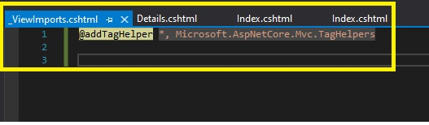

29. En la ventana **TagHelpersExample - Microsoft Visual Studio**, en Solution Explorer, en **Views**, en **Home**, haga clic en **Index.cshtml**.

30. En la ventana del código **Index.cshtml**, borre el siguiente código:
  ```cs
    @addTagHelper *, Microsoft.AspNetCore.Mvc.TagHelpers
  ```

31. En la ventana **TagHelpersExample - Microsoft Visual Studio**, en Solution Explorer, en **Views**, en **Empleado**, haga clic en **Index.cshtml**.

32. En la ventana **Index.cshtml** código, borre el siguiente código:
  ```cs
    @addTagHelper *, Microsoft.AspNetCore.Mvc.TagHelpers
  ```

33. En la ventana **TagHelpersExample - Microsoft Visual Studio**, en Solution Explorer, en **Views**, en **Empleado**, haga clic en **Details.cshtml**.

34. En la ventana del código **Details.cshtml**, borre el siguiente código:
  ```cs
    @addTagHelper *, Microsoft.AspNetCore.Mvc.TagHelpers
  ```

35. En la ventana **TagHelpersExample - Microsoft Visual Studio**, en el menú **FILE**, haga clic en **Save All**.

36. En la ventana **TagHelpersExample - Microsoft Visual Studio**, en el menú **DEBUG**, haga clic en **Start Without Debugging**.


- La representación visual a la respuesta del último ejercicio se muestra en la siguiente imagen:

 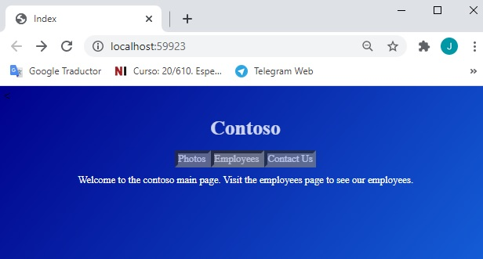

37. En Microsoft Edge, haz clic en **Employees**.

- La representación visual a la respuesta del último ejercicio se muestra en la siguiente imagen:

 

38. En Microsoft Edge, haz clic en **Michael**.

- La representación visual a la respuesta del último ejercicio se muestra en la siguiente imagen:

 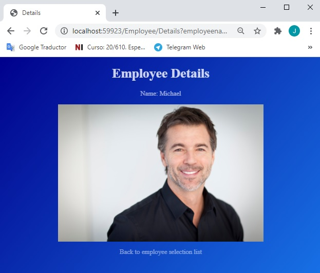

39. En Microsoft Edge, haga clic en **Volver a la lista de selección de Employees**.

40. En Microsoft Edge, haz clic en **Elena**.

- La representación visual a la respuesta del último ejercicio se muestra en la siguiente imagen:

 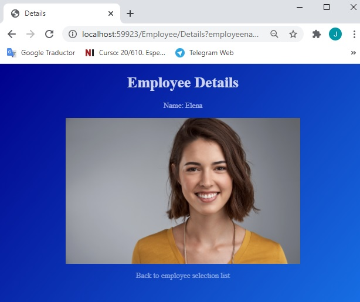

41. En Microsoft Edge, haga clic en **Cerrar**.

42. En la ventana de **TagHelpersExample - Microsoft Visual Studio**, en el menú **FILE**, haga clic en **Salir**.

# Lección 3: Reutilizar el código en las vistas

### Demonstration: Cómo crear y usar vistas parciales

#### Pasos de preparación 

Asegúrate de que has clonado el directorio **20486D** de GitHub. Contiene los segmentos de código para los laboratorios y demostraciones de este curso. (**https://github.com/MicrosoftLearning/20486D-DevelopingASPNETMVCWebApplications/tree/master/Allfiles**)

#### Pasos de demostración

1. Navega a **[Repository Root]\Allfiles\Mod05\Democode\04_PartialViewsExample_begin**, y luego haz doble clic en **PartialViewsExample.sln**.

    >**Nota**: Si aparece el cuadro de diálogo **Advertencia de seguridad para RazorSyntaxExample**, verifique que la casilla de verificación **Ask me for each project in this solution** esté desmarcada, y luego haga clic en OK.
    
2. En la ventana **PartialViewsExample - Microsoft Visual Studio**, en el Explorador de soluciones, expanda **Servicios**, y luego haga clic en **Person.cs**.

3. En la ventana de código **Person.cs**, localice el siguiente código:
  ```cs
    public Person(string firstName, string lastName, string address, string phoneNumber)
    {
  ```

4. Ponga el cursor al final del código localizado, presione Enter, y luego escriba el siguiente código:
  ```cs
    FirstName = firstName;
    LastName = lastName;
    Address = address;
    PhoneNumber = phoneNumber;
  ```

- La representación visual a la respuesta del último ejercicio se muestra en la siguiente imagen:

 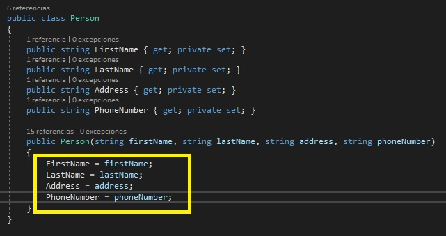

5. En la ventana **PartialViewsExample - Microsoft Visual Studio**, en el Solution Explorer, en **Services**, haga clic en **PersonProvider.cs**.

6. En la ventana del código **PersonProvider.cs**, localice el siguiente código:
  ```cs
    public PersonProvider()
    {
  ```

7. Ponga el cursor al final del código localizado, presione Enter, y luego escriba el siguiente código:
  ```cs
    PersonList = PersonInitializer();
  ```

8. En el Explorador de soluciones, amplíe **Controllers**, y luego haga clic en **HomeController.cs**.

9. En la ventana del código **HomeController.cs**, localice el siguiente código:
  ```cs
    ViewBag.Columns = 3;
  ```

10. Ponga el cursor al final del código localizado, presione Enter y luego escriba el siguiente código:
  ```cs
    ViewBag.People = _personProvider.PersonList;
  ```
- La representación visual a la respuesta del último ejercicio se muestra en la siguiente imagen:

 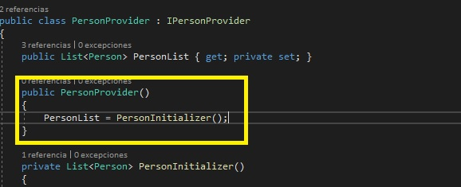

11. En el Explorador de Soluciones, amplíe **Vistas**, amplíe **Home**, y luego haga clic en **Index.cshtml**.

12. En la ventana del código **Index.cshtml**, localice el siguiente código:
  ```cs
    @for (int rowIndex = 0; rowIndex < ViewBag.Rows; rowIndex++)
    {
        <tr>
            @for (int columnIndex = 0; columnIndex < ViewBag.Columns; columnIndex++)
            {
  ```

13. Ponga el cursor al final del código localizado, presione Enter y luego escriba el siguiente código:
  ```cs
    int cardIndex = columnIndex + (rowIndex * ViewBag.Columns);
    @await Html.PartialAsync("_CardDesign", cardIndex);
  ```
- La representación visual a la respuesta del último ejercicio se muestra en la siguiente imagen:

 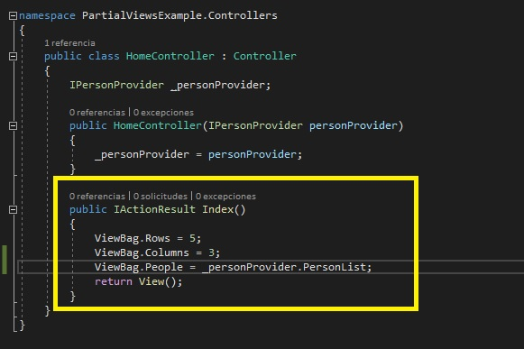

14. En la ventana **PartialViewsExample - Microsoft Visual Studio**, en el Solution Explorer, haga clic con el botón derecho del ratón en **Views**, apunte a **Add**, y luego haga clic en **New Folder**.

15. En el cuadro **Nueva Carpeta**, escriba **Shared**, y luego presione Enter.

16. En la ventana **PartialViewsExample - Microsoft Visual Studio**, en Solution Explorer, haga clic con el botón derecho del ratón en **Shared**, apunte a **Agregar**, y luego haga clic en **Ver**.
    
17. En el cuadro de diálogo **Agregar vista MVC**, en el cuadro **Nombre de la vista**, escriba **_CardDesign**.

18. En el cuadro de diálogo **Agregar vista MVC**, verifique que la casilla de verificación **Crear como vista parcial** esté seleccionada y que la casilla de verificación **Utilizar una página de diseño** esté desactivada y, a continuación, haga clic en **Agregar**.

19. En la ventana de código **_CardDesign.cshtml**, elimine el siguiente código:
  ```
    @*
        Para más información sobre la habilitación de MVC para proyectos vacíos, visite http://go.microsoft.com/fwlink/?LinkID=397860
    *@
  ```

20. En la ventana del código **_CardDesign.cshtml**, coloque el cursor al principio del documento, y luego escriba el siguiente código:
  ```cs
    @model int
    <td>
        <div>First Name: @ViewBag.People[Model].FirstName</div>
        <div>Last Name: @ViewBag.People[Model].LastName</div>
        <div>Residence: @ViewBag.People[Model].Address</div>
        <div>Phone: @ViewBag.People[Model].PhoneNumber</div>
    </td>
  ```

- La representación visual a la respuesta del último ejercicio se muestra en la siguiente imagen:

 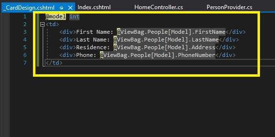

21. En la ventana **PartialViewsExample - Microsoft Visual Studio**, en el menú **FILE**, haga clic en **Save All**.

22. En la ventana **PartialViewsExample - Microsoft Visual Studio**, en el menú **DEBUG**, haga clic en **Start Without Debugging**.
    >**Nota**: El navegador muestra una tabla con las cartas. Cada tarjeta contiene información sobre una persona, incluyendo: Nombre, apellido, residencia y teléfono.

- La representación visual a la respuesta del último ejercicio se muestra en la siguiente imagen:

 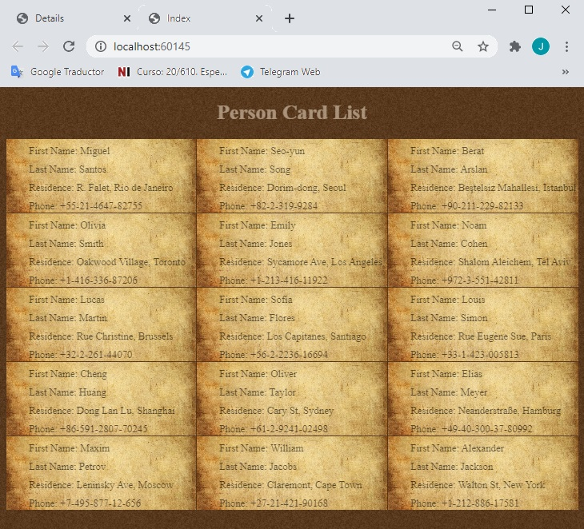

23. En Microsoft Edge, haga clic en **Cerrar**.

24. En la ventana **PartialViewsExample - Microsoft Visual Studio**, en el menú **FILE**, haga clic en **Salir**.

# Lección 3: Reutilizar el código en las vistas

### Demonstration: Cómo crear y utilizar los componentes de la vista

#### Pasos de preparación 

Asegúrate de que has clonado el directorio **20486D** de GitHub. Contiene los segmentos de código para los laboratorios y demostraciones de este curso. (**https://github.com/MicrosoftLearning/20486D-DevelopingASPNETMVCWebApplications/tree/master/Allfiles**)

#### Pasos de demostración

1. Navega a **[Repository Root]\Allfiles\Mod05\Democode\05_ViewComponentsExample_begin**, y luego haz doble clic en **ViewComponentsExample.sln**.

    >**Nota**: Si aparece el cuadro de diálogo **Advertencia de seguridad para RazorSyntaxExample**, verifique que la casilla de verificación **Ask me for each project in this solution** esté desmarcada, y luego haga clic en OK.

2. En la ventana **VerEjemplo de componentes - Microsoft Visual Studio**, en el Explorador de soluciones, haga clic con el botón derecho en **VerEjemplo de componentes**, apunte a **Agregar**, y luego haga clic en **Nueva carpeta**.

3. En el cuadro **Nueva Carpeta**, escriba **Ver Componentes**, y luego presione Enter.

4. En la ventana **VerEjemplo de componentes - Microsoft Visual Studio**, en el Explorador de soluciones, haga clic con el botón derecho del ratón en **Ver componentes**, apunte a **Agregar**, y luego haga clic en **Clase**.

5.	En el cuadro de diálogo **Agregar nuevo elemento - VerComponentesEjemplo**, en el cuadro **Nombre**, escriba **PersonCardVerComponente**, y luego haga clic en **Agregar**.

6. En la ventana de código **PersonCardViewComponent.cs**, localice el siguiente código:
  ```cs
    using System.Threading.Tasks;
  ``` 

7. Ponga el cursor al final del código localizado, presione Enter, y luego escriba el siguiente código:
  ```cs
    using Microsoft.AspNetCore.Mvc;
  ```

8. En la ventana del código **PersonCardViewComponent.cs**, seleccione el siguiente código:
  ```cs
    public class PersonCardViewComponent
  ```

9. Reemplazar el código seleccionado por el siguiente código:
  ```cs
    public class PersonCardViewComponent : ViewComponent
  ```

10. En la ventana del código **PersonCardViewComponent.cs**, localice el siguiente código:
  ```cs
    public class PersonCardViewComponent : ViewComponent
    {
  ```

11. Ponga el cursor al final del código localizado, presione Enter y luego escriba el siguiente código:
  ```cs
    public Task<IViewComponentResult> InvokeAsync(int id)
    {
        return Task.FromResult<IViewComponentResult>(View("CardDesign", id));
    }
  ```
- La representación visual a la respuesta del último ejercicio se muestra en la siguiente imagen:

 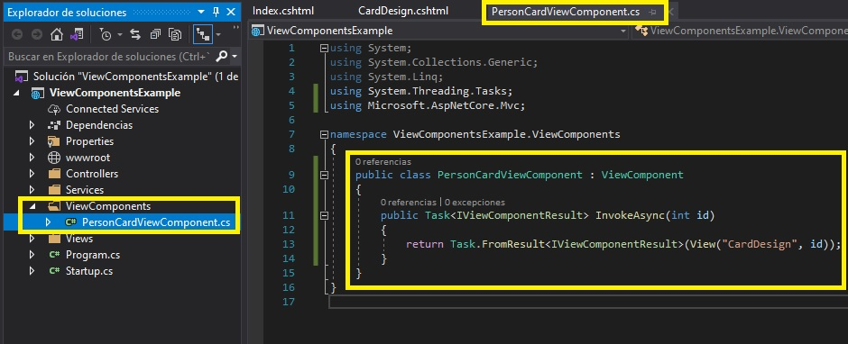

12. En la ventana **ViewComponentsExample - Microsoft Visual Studio**, en el Explorador de Soluciones, expanda **Vistas**, haga clic con el botón derecho **Shared**, apunte a **Agregar**, y luego haga clic en **Nueva Carpeta**.

13. En el cuadro **Nueva Carpeta**, escriba **Componentes**, y luego presione Enter.

14. En la ventana **ViewComponentsExample - Microsoft Visual Studio**, en el Explorador de soluciones, haga clic con el botón derecho del ratón en **Componentes**, apunte a **Agregar**, y luego haga clic en **Nueva Carpeta**.

15. En el cuadro **Nueva Carpeta**, escriba **Tarjeta de Persona**, y luego presione Enter.

16. En la ventana **ViewComponentsExample - Microsoft Visual Studio**, en el Solution Explorer, en **Shared**, haga clic con el botón derecho del ratón en **_CardDesign.cshtml**, y luego haga clic en **Cut**.

17. Haga clic con el botón derecho del ratón en **PersonCard**, y luego haga clic en **Pegar**.

18. Haga clic con el botón derecho del ratón en **_DiseñoTarjeta.cshtml**, y luego haga clic en **Renombrar**.

19. En la casilla **_CardDesign.cshtml**, escriba **CardDesign.cshtml**, y luego presione Enter.

20. En la ventana **ViewComponentsExample - Microsoft Visual Studio**, en Solution Explorer, en **Views**, expanda **Home**, y luego presione **Index.cshtml**.

21. En la ventana **Index.cshtml** código, seleccione el siguiente código:
  ```cs
    @await Html.PartialAsync("_CardDesign", cardIndex);
  ```

22. Reemplazar el código seleccionado por el siguiente código:
  ```cs
    @await Component.InvokeAsync("PersonCard", cardIndex);
  ```
  - La representación visual a la respuesta del último ejercicio se muestra en la siguiente imagen:

 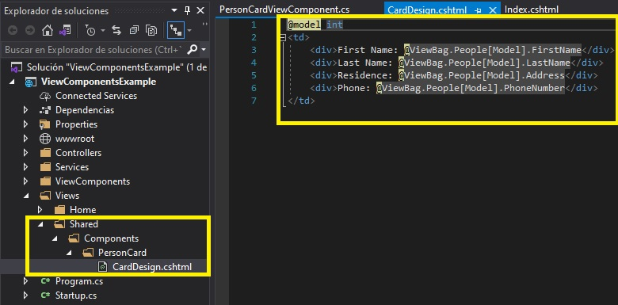


23. En la ventana **ViewComponentsExample - Microsoft Visual Studio**, en el menú **Archivo**, haga clic en **Guardar todo**.

24. En la ventana **ViewComponentsExample - Microsoft Visual Studio**, en el menú **DEBUG**, haga clic en **Iniciar sin depuración**.
    >**Nota**: El navegador muestra una tabla con las cartas. Cada tarjeta contiene información sobre una persona, incluyendo: Nombre, apellido, residencia y un teléfono.

- La representación visual a la respuesta del último ejercicio se muestra en la siguiente imagen:

 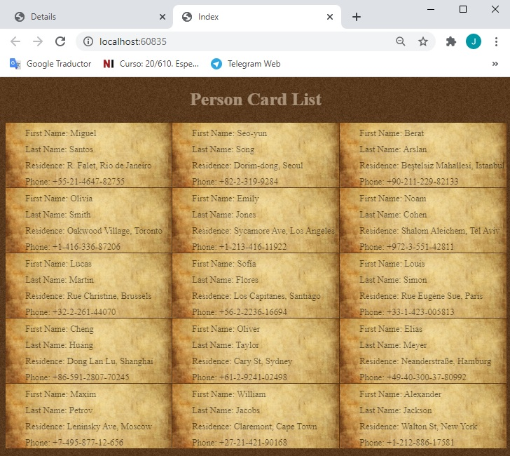

25. En Microsoft Edge, haga clic en **Cerrar**.

26. En la ventana **ViewComponentsExample - Microsoft Visual Studio**, en el menú **Archivo**, haga clic en **Salir**.


