# Módulo 5: Desarrollando Vistas

Siempre cuando un camino comienza con  *[Repository Root]*, reemplacelo con el camino absoluto en el que el repositorio 20486 reside. Por ejemplo, si tu has cloneado o extraido el repositorio 20486 en la carpeta **C:\Users\John Doe\Downloads\20486**, cambiar la ruta de: **[Repository Root]\AllFiles\20486D\Mod01** a **C:\Users\John Doe\Downloads\20486\AllFiles\20486D\Mod01**.

Fichero de Instrucciones: Instructions\20486D_MOD05_LAK.md

**Información:**

1. **Nombres y apellidos:** José René Fuentes Cutz
2. **Fecha:** 24 de Noviembre 2020.
3. **Resumen del Ejercicio:** Este laboratorio consta de 2 ejercicio:
- En el Primer ejercicio nos ayuda a añadir vistas a una aplicación MVC, pasar datos de un controlador a una vista usando **ViewBag**, y navegar entre páginas usando Helpers.
- En el Segundo ejercicio nos ayuda a entender como escribir y usar vistas parciales, y usar servicios dentro de una vista usando la directiva **@Inyección**.
- En el Tercer ejercicio creamos componentes de la vista, para posteriormente incrustarlos en una vista..

4. **Dificultad o problemas presentados y como se resolvieron:** Ninguno.

**NOTA**: Si no hay descripcion de problemas o dificultades, y al yo descargar el código para realizar la comprobacion y el código no funcionar, el resultado de la califaciación del laboratorio será afectado.

---


# Laboratorio: Desarrollando puntos de vista 

### Configuración del Lab 

Tiempo estimado: **60 minutos**

### Preparation Steps

Asegúrate de que has clonado el directorio **20486D** de GitHub. Contiene los segmentos de código para los laboratorios y demostraciones de este curso. (**https://github.com/MicrosoftLearning/20486D-DevelopingASPNETMVCWebApplications/tree/master/Allfiles**)

## Ejercicio 1: Añadir vistas a una aplicación MVC

### Task 1: Añadir una vista para mostrar todas las Cityes

1. Navega a **[Repository Root]\Allfiles\Mod05\Labfiles\01_CitiesWebsite_begin**, y luego haz doble clic en **CitiesWebsite.sln**.

    >**Nota**: Si aparece un cuadro de diálogo de **Aviso de Seguridad para CitiesWebsite**, verifique que la casilla de verificación **Pregúntame para cada proyecto de esta solución** esté despejada, y luego haga clic en OK.
    
2. En la ventana **CitiesWebsite - Microsoft Visual Studio**, en el Explorador de Soluciones, expandir **Servicios**, y luego hacer clic en **CityProvider.cs**.

3. En la ventana del código **CityProvider.cs**, localice el siguiente código:
  ```cs
    public CityProvider()
    {

    }
  ```

4. Ponga el cursor dentro del bloque de código constructor **CityProvider**, y luego escriba el siguiente código:
  ```cs
    _cities = CityInitializer();
  ```

- La representación visual a la respuesta del último ejercicio se muestra en la siguiente imagen:

 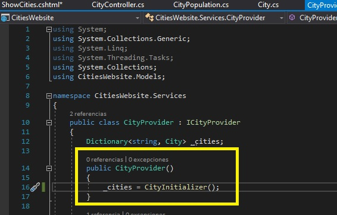

5. En la ventana **CitiesWebsite - Microsoft Visual Studio**, en Solution Explorer, expandir **Models**, y luego hacer clic en **City.cs**.

6.  En la ventana del código **City.cs**, localice el siguiente código:
  ```cs
    public City(string country, string cityName, string timeZone, CityPopulation population)
    {

    }
  ```

7. Ponga el cursor dentro del bloque de código constructor de **City**, y luego escriba el siguiente código:
  ```cs
    Country = country;
    Name = cityName;
    TimeZone = timeZone;
    Population = population;
  ```
- La representación visual a la respuesta del último ejercicio se muestra en la siguiente imagen:

 

8. En la ventana **CitiesWebsite - Microsoft Visual Studio**, en el Solution Explorer, en **Models**, haga clic en **CityPopulation.cs**.

9. En la ventana del código **CityPopulation.cs**, localice el siguiente código:
  ```cs
    Public CityPopulation(int año, int City, int urbano, int metro)
    {

    }
  ```

10. Coloca el cursor dentro del bloque de código de construcción **CityPopulation** y luego escribe el siguiente código:
  ```cs
    Year = year;
    City = city;
    Urban = urban;
    Metro = metro;
  ```
- La representación visual a la respuesta del último ejercicio se muestra en la siguiente imagen:

 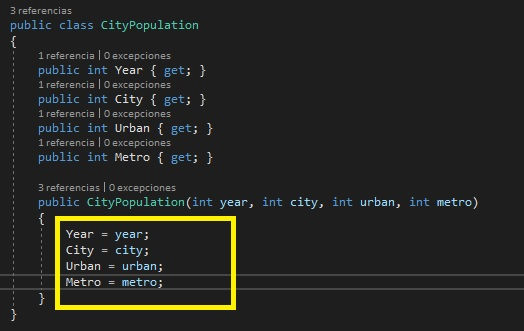

11. En la ventana **CitiesWebsite - Microsoft Visual Studio**, en el Solution Explorer, expanda **Controllers**, y luego haga clic en **CityController.cs**.


12. En la ventana del código **CityController.cs**, localice el siguiente código:
  ```cs
    using Microsoft.AspNetCore.Mvc;
  ```

13. Ponga el cursor al final del código localizado, presione Enter y luego escriba el siguiente código:
  ```cs
    using CitiesWebsite.Services;
  ```

14. En la ventana del código **CityController.cs**, localice el siguiente código:
  ```cs
    public class CityController : Controller
    {
  ```

15. Ponga el cursor al final del código localizado, presione Enter, y luego escriba el siguiente código:
  ```cs
        private ICityProvider _cities;
  ```

16. En la ventana del código **CityController.cs**, seleccione el siguiente código:
  ```cs
    public CityController()
    {

    }
  ```

17. Reemplazar el código seleccionado por el siguiente código:

  ```cs
    public CityController(ICityProvider cities)
    {
        _cities = cities;
    }
  ```

18. En la ventana del código **CityController.cs**, localice el siguiente código:
  ```cs
    public IActionResult ShowCities()
    {
  ```

19. Ponga el cursor después del signo **{** (paréntesis de apertura), pulse Intro y luego escriba el siguiente código:
  ```cs
    ViewBag.Cities = _cities;
  ```
- La representación visual a la respuesta del último ejercicio se muestra en la siguiente imagen:

 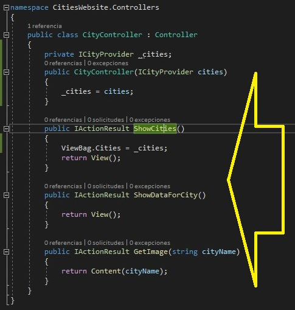

20. En la ventana del código **CityController.cs**, haga clic con el botón derecho del ratón en el siguiente código y luego haga clic en **Add View**.
  ```cs
    public IActionResult ShowCities()
  ```

21. En el cuadro de diálogo **Añadir vista MVC**, asegúrate de que el valor en el cuadro **Nombre de la vista** es **ShowCities**.

22.  En el cuadro de diálogo **Agregar vista MVC**, asegúrese de que esté seleccionada la plantilla **Vacío (sin modelo)**.

23.  En el cuadro de diálogo **Agregar vista MVC**, asegúrese de que las casillas de verificación **Crear como vista parcial** y **Utilizar una página de diseño** están desactivadas y, a continuación, haga clic en **Agregar**.

24.  En la ventana del código **ShowCities.cshtml**, localice el siguiente código:
  ```cs
    <title>ShowCities</title>
  ```

25. Ponga el cursor al final del código localizado, presione Enter, y luego escriba el siguiente código:
  ```cs
    <link rel="hoja de estilo" type="text/css" href="~/css/style.css" />
  ```

26. En la ventana del código **ShowCities.cshtml**, en el elemento **BODY**, escriba el siguiente código:
  ```cs
<h1>Select City</h1>
    @foreach (var item in ViewBag.Cities)
    {
        <p>@item.Key</p>
    }
  ```
- La representación visual a la respuesta del último ejercicio se muestra en la siguiente imagen:

 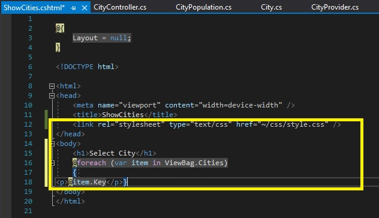

### Tarea 2: Ejecutar la aplicación

1. En la ventana **CitiesWebsite - Microsoft Visual Studio**, en el menú **FILE**, haga clic en **Save All**.

2. En la ventana **CitiesWebsite - Microsoft Visual Studio**, en el menú **DEBUG**, haga clic en **Iniciar sin depuración**.
    >**Nota**: El navegador muestra un título de **Seleccionar City** y una lista de Cities debajo de él: **Madrid**, **Londres**, y **París**.

3. En Microsoft Edge, haz clic en **Cerrar**.

- La representación visual a la respuesta del último ejercicio se muestra en la siguiente imagen:

 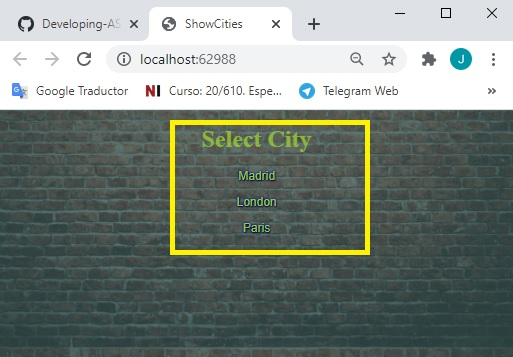

### Tarea 3: Añadir una vista para mostrar los datos de una City

1. En la ventana **CitiesWebsite - Microsoft Visual Studio**, en el Solution Explorer, en **Controllers**, haga clic en **CityController.cs**.

2. En la ventana del código **CityController.cs**, seleccione el siguiente código:
  ```cs
    IActionResultado público ShowDataForCity()
  ```

3. Reemplazar el código seleccionado por el siguiente código:
  ```cs
    public IActionResult ShowDataForCity(string cityName)
  ```

4. En la ventana del código **CityController.cs**, localice el siguiente código:
  ```cs
    public IActionResult ShowDataForCity(string cityName)
    {
  ```

5. Ponga el cursor después del signo **{** (paréntesis de apertura), pulse Intro, y luego escriba el siguiente código:
  ```cs
    ViewBag.City = _Cityes[nombre de la City];
  ```

 

6. En la ventana del código **CityController.cs**, haga clic con el botón derecho del ratón en el siguiente código y luego haga clic en **Add View**.
  ```cs
    public IActionResult ShowDataForCity(string cityName)
  ```

7. En el cuadro de diálogo **Añadir Vista MVC**, asegúrate de que el valor en el cuadro **Nombre de la vista** es **ShowDataForCity**.

8. En el cuadro de diálogo **Agregar vista MVC**, asegúrese de que la plantilla **Vacío (sin modelo)** esté seleccionada.

9. En el cuadro de diálogo **Agregar vista MVC**, asegúrese de que las casillas de verificación **Crear como una vista parcial** y **Utilizar una página de diseño** están desactivadas y, a continuación, haga clic en **Agregar**.

10.  En la ventana de código **ShowDataForCity.cshtml**, localice el siguiente código:
  ```cs
    <title>ShowDataForCity</title>
  ```

11. Ponga el cursor al final del código localizado, presione Enter y luego escriba el siguiente código:
  ```cs
    <link rel="stylesheet" type="text/css" href="~/css/style.css" />
  ```

12. En la ventana del código **ShowDataForCity.cshtml**, en el elemento **BODY**, escriba el siguiente código:

  ```cs
		<div>
        <h2>@ViewBag.City.Name</h2>
        <p>Country: @ViewBag.City.Country</p>
        <p>Time zone: @ViewBag.City.TimeZone</p>
        <span></span>
    </div>
  ```

  - La representación visual a la respuesta del último ejercicio se muestra en la siguiente imagen:
 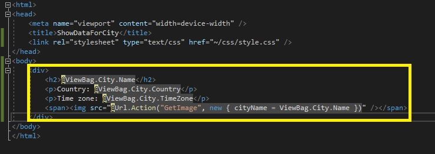

13. En la ventana **CitiesWebsite - Microsoft Visual Studio**, en el Solution Explorer, en **Controllers**, haga clic en **CityController.cs**.

14.  En la ventana del código **CityController.cs**, seleccione el siguiente código:
  ```cs
		return Content(cityName);
  ```

15. Reemplazar el código seleccionado por el siguiente código:
  ```cs
    return File($@"images\{cityName}.jpg", "image/jpeg");
  ```
  - La representación visual a la respuesta del último ejercicio se muestra en la siguiente imagen:
 
 


### Tarea 4: Añadir enlaces a las vistas usando ayudantes de etiquetas

1. En la ventana **CitiesWebsite - Microsoft Visual Studio**, en el Solution Explorer, haga clic con el botón derecho en **Views**, apunte a **Add**, y luego haga clic en **New Item**.

2. En el cuadro de diálogo **Agregar nuevo elemento - CitiesWebsite**, en el panel de navegación, en **Installed**, ampliar **ASP.NET Core**, y luego hacer clic en **Web**.

3. En el cuadro de diálogo **Agregar nuevo elemento - CitiesWebsite**, en el panel de resultados, haga clic en **Razor View Imports**, y luego haga clic en **Agregar**.


 - La representación visual a la respuesta del último ejercicio se muestra en la siguiente imagen:
 
 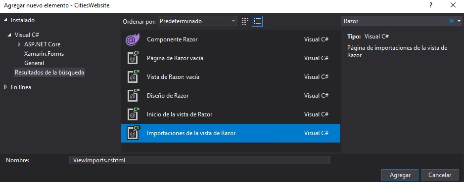

4.  En la ventana de código **_ViewImports.cshtml**, escriba el siguiente código:
  ```cs
		@addTagHelper *, Microsoft.AspNetCore.Mvc.TagHelpers
  ```
 
  - La representación visual a la respuesta del último ejercicio se muestra en la siguiente imagen:
 
 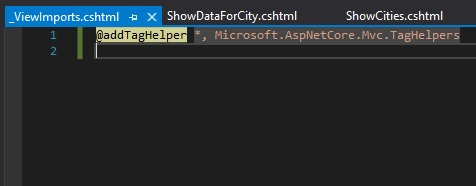

5. En la ventana **CitiesWebsite - Microsoft Visual Studio**, en el Solution Explorer, expandir **Views**, expandir **City**, y luego hacer clic en **ShowDataForCity.cshtml**.

6.  En la ventana del código **ShowDataForCity.cshtml**, localiza el siguiente código:
  ```cs
		<span></span>
  ```

7. Ponga el cursor al final del código localizado, presione Enter, y luego escriba el siguiente código:
  ```cs
		<a asp-action="ShowCities">Atrás</a>
  ```

8. En la ventana **CitiesWebsite - Microsoft Visual Studio**, en Solution Explorer, en **Views**, en **City**, haga clic en **ShowCities.cshtml**.

9. En la ventana del código **ShowCities.cshtml**, seleccione el siguiente código:
  ```cs
		<p>@item.Key</p>
  ```

10. Reemplace el código seleccionado por el siguiente código:
  ```cs
    <h2>
        <a asp-action="ShowDataForCity" asp-route-cityname="@item.Key">@item.Key</a>
    </h2>
  ```


### Tarea 5: Ejecutar la aplicación

1. En la ventana **CitiesWebsite - Microsoft Visual Studio**, en el menú **FILE**, haga clic en **Save All**.

2. En la ventana **CitiesWebsite - Microsoft Visual Studio**, en el menú **DEBUG**, haga clic en **Iniciar sin depuración**.

3. En Microsoft Edge, haga clic en **Londres**.
    >**Nota**: El navegador muestra el nombre de la City, detalles, mini mapa, y un enlace **Volver**.

4. En Microsoft Edge, haz clic en **Volver**.

5.  En Microsoft Edge, haz clic en **Cerrar**.


- La representación visual a la respuesta del último ejercicio se muestra en la siguiente imagen:
 
 

>**Resultado**: Al final de este ejercicio, podrás añadir vistas a una aplicación MVC, pasar datos de un controlador a una vista usando **ViewBag**, y navegar entre páginas usando ayudantes.

## Ejercicio 2: Añadir una vista parcial

### Task 1: Añadir una vista parcial

1. En la ventana **CitiesWebsite - Microsoft Visual Studio**, en el Solution Explorer, haga clic con el botón derecho en **Views**, apunte a **Add**, y luego haga clic en **New Folder**.

2. En el cuadro **Nueva Carpeta**, escriba **Shared**, y luego presione Enter.

3. En el Explorador de soluciones, haga clic con el botón derecho del ratón en **Compartido**, apunte a **Agregar**, y luego haga clic en **Ver**.

4.  En el cuadro de diálogo **Agregar vista de MVC**, en el cuadro **Nombre de la vista**, escriba **_CityPoblación**.

5.  En el cuadro de diálogo **Agregar vista del MVC**, asegúrese de que la plantilla **Vacío (sin modelo)** esté seleccionada.

6.  En el cuadro de diálogo **Agregar vista MVC**, asegúrese de que la casilla de verificación **Crear como vista parcial** esté seleccionada y la casilla de verificación **Utilizar una página de diseño** esté desactivada y, a continuación, haga clic en **Agregar**.


7. En la ventana del código **_CityPopulation.cshtml**, borre todo el contenido.

8. En la ventana del código **_CityPopulation.cshtml**, coloque el cursor al principio del documento y escriba el siguiente código:

  ```cs
		@inject CitiesWebsite.Services.ICityFormatter cityFormatter

    @{
        CitiesWebsite.Models.CityPopulation population = ViewBag.City.Population;
    }

    <h3>City Population (@population.Year)</h3>
    <p>City: @cityFormatter.GetFormattedPopulation(@population.City)</p>
    <p>Urban: @cityFormatter.GetFormattedPopulation(@population.Urban)</p>
    <p>Metro: @cityFormatter.GetFormattedPopulation(@population.Metro)</p>
  ```

- La representación visual a la respuesta del último ejercicio se muestra en la siguiente imagen:
 
 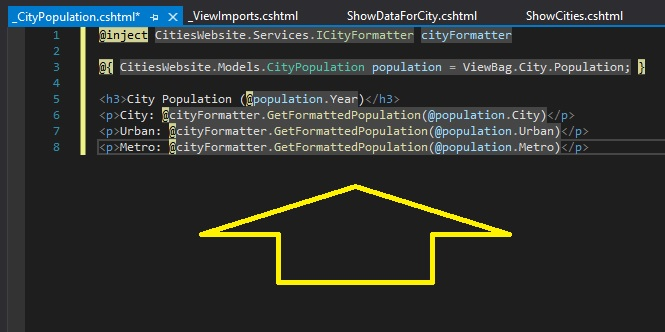


### Tarea 2: Usar la vista parcial en la vista ShowDataForCity

1. En la ventana **CitiesWebsite - Microsoft Visual Studio**, en Solution Explorer, en **Views**, en **City**, haga clic en **ShowDataForCity.cshtml**.

2. En la ventana del código **ShowDataForCity.cshtml**, localice el siguiente código:
  ```cs
   <span></span>
  ```

3. Ponga el cursor al final del código localizado, presione Enter, y luego escriba el siguiente código:
  ```cs
		@await Html.PartialAsync("_CityPopulation")
  ```


### Tarea 3: Ejecutar la aplicación

1. En la ventana **CitiesWebsite - Microsoft Visual Studio**, en el menú **FILE**, haga clic en **Save All**.

2. En la ventana **CitiesWebsite - Microsoft Visual Studio**, en el menú **DEBUG**, haga clic en **Iniciar sin depuración**.

3. En Microsoft Edge, haga clic en **Madrid**.
    >**Nota**: El navegador muestra el nombre de la City, detalles, mini mapa, y un enlace **Volver**.
- La representación visual a la respuesta del último ejercicio se muestra en la siguiente imagen:
 
 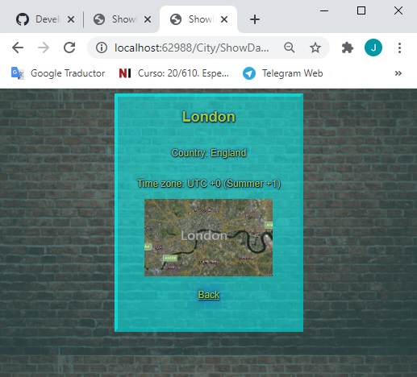

4. En Microsoft Edge, haz clic en **Cerrar**.

>**Resultado**: Al final de este ejercicio, podrás escribir y usar vistas parciales, y usar servicios dentro de una vista usando la directiva **@Inyección**.


## Ejercicio 3: Añadir un componente de la vista

### Task 1: Añadir una clase de componente de vista

1. En la ventana **CitiesWebsite - Microsoft Visual Studio**, en el Solution Explorer, haga clic con el botón derecho en **CitiesWebsite**, apunte a **Add**, y luego haga clic en **New Folder**.

2. En el cuadro **Nueva Carpeta**, escriba **ViewComponents**, y luego presione Enter.

3. En la ventana **CitiesWebsite - Microsoft Visual Studio**, en el Solution Explorer, haga clic con el botón derecho del ratón en **ViewComponents**, señale a **Add**, y luego haga clic en **Class**.

4.  En el cuadro de diálogo **Agregar nuevo elemento - CitiesWebsite**, en el cuadro **Nombre**, escriba **CityViewComponent**, y luego haga clic en **Agregar**.

5.  En la ventana de código **CityViewComponent.cs**, localice el siguiente código:
  ```cs
      using System.Threading.Tasks;
  ```

6. Ponga el cursor al final del código localizado, presione Enter, y luego escriba el siguiente código:
  ```cs
    using Microsoft.AspNetCore.Mvc;
    using CitiesWebsite.Services;
    using CitiesWebsite.Models;
  ```

7. En la ventana del código **CityViewComponent.cs**, seleccione el siguiente código:
  ```cs
	    public class CityViewComponent
  ```

8. Añada el siguiente código a la línea de código existente.
  ```cs
     : ViewComponent
  ```

- La representación visual a la respuesta del último ejercicio se muestra en la siguiente imagen:
 
 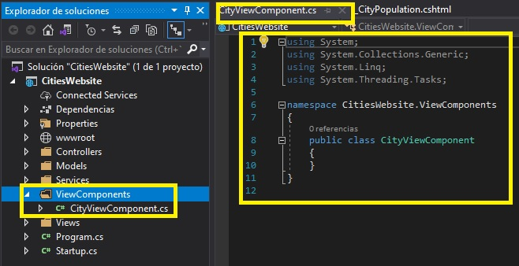

9.	En la ventana de código **CityViewComponent.cs**, coloque el cursor dentro del bloque de código **CityViewComponent.cs**, y luego escriba el siguiente código:
  ```cs
    private ICityProvider _cities;

    public CityViewComponent(ICityProvider cities)
    {
        _cities = cities;
    }

    public async Task<IViewComponentResult> InvokeAsync(string cityName)
    {
        ViewBag.CurrentCity = await GetCity(cityName);
        return View("SelectCity");
    }

    private Task<City> GetCity(string cityName)
    {
        return Task.FromResult<City>(_cities[cityName]);
    }
  ```
- La representación visual a la respuesta del último ejercicio se muestra en la siguiente imagen:
 
 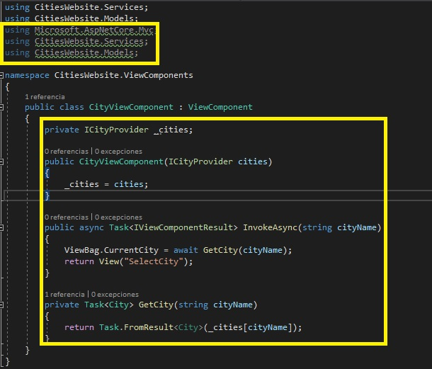

### Tarea 2: Añadir una vista de componente de la vista

1. En la ventana **CitiesWebsite - Microsoft Visual Studio**, en el Solution Explorer, en **Views**, haga clic con el botón derecho en **Shared**, apunte a **Add**, y luego haga clic en **New Folder**.

2. En el cuadro **Nueva Carpeta**, escriba **Componentes**, y luego presione Enter.

3. En la ventana **CitiesWebsite - Microsoft Visual Studio**, en Solution Explorer, haga clic con el botón derecho del ratón en **Componentes**, apunte a **Agregar**, y luego haga clic en **Nueva Carpeta**.

4.  En el cuadro **Nueva Carpeta**, escriba **City**, y luego presione Enter.

5.  En la ventana **CitiesWebsite - Microsoft Visual Studio**, en Solution Explorer, haga clic con el botón derecho del ratón en la carpeta **City** que acaba de crear, señale a **Agregar** y, a continuación, haga clic en **Ver**.
    
6.  En el cuadro de diálogo **Agregar Vista MVC**, en el cuadro **Nombre de la vista**, escribe **City seleccionada**.

7.  En el cuadro de diálogo **Agregar vista del MVC**, asegúrese de que la plantilla **Vacío (sin modelo)** esté seleccionada.

8. En el cuadro de diálogo **Agregar vista MVC**, asegúrese de que la casilla de verificación **Crear como vista parcial** esté seleccionada y la casilla de verificación **Utilizar una página de diseño** esté desactivada y, a continuación, haga clic en **Agregar**.

- La representación visual a la respuesta del último ejercicio se muestra en la siguiente imagen:
 
 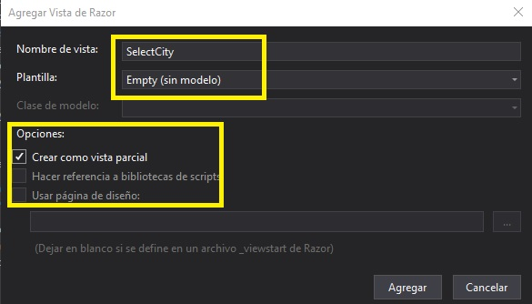

9. En la ventana de código **SelectCity.cshtml**, borre todo el contenido.

10.  En la ventana de código **SelectCity.cshtml**, coloque el cursor al principio del documento y escriba el siguiente código:

  ```cs
	<div>
        <h2>
            <a asp-action="ShowDataForCity" asp-route-cityname=@ViewBag.CurrentCity.Name>@ViewBag.CurrentCity.Name (Capital of @ViewBag.CurrentCity.Country)</a>
        </h2>
        
    </div>
  ```

- La representación visual a la respuesta del último ejercicio se muestra en la siguiente imagen:
 
 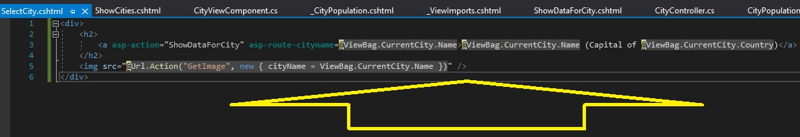

### Tarea 3: Usar el componente de la vista

1. En la ventana **CitiesWebsite - Microsoft Visual Studio**, en Solution Explorer, en **Views**, en **City**, haga clic en **ShowCities.cshtml**.

2. En la ventana del código **ShowCities.cshtml**, seleccione el siguiente código:
  ```cs
	<h2>
        <a asp-action="ShowDataForCity" asp-route-cityname="@item.Key">@item.Key</a>
    </h2>
  ```

3. Reemplazar el código seleccionado por el siguiente código:
  ```cs
    @await Component.InvokeAsync("City", item.Key)
  ```
- La representación visual a la respuesta del último ejercicio se muestra en la siguiente imagen:
 
 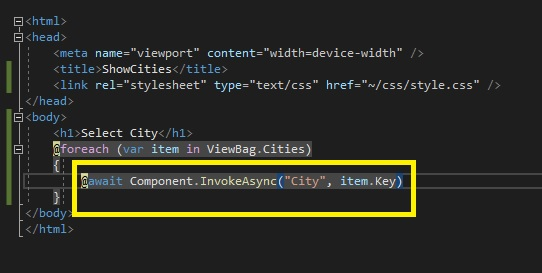

### Tarea 4: Ejecutar la aplicación

1. En la ventana **CitiesWebsite - Microsoft Visual Studio**, en el menú **FILE**, haga clic en **Save All**.

2. En la ventana **CitiesWebsite - Microsoft Visual Studio**, en el menú **DEBUG**, haga clic en **Iniciar sin depuración**.
    >**Nota**: El navegador muestra una lista de Cityes. Cada una tiene un enlace de cabecera y una imagen de mini mapa de la región.

3. En Microsoft Edge, haga clic en **Madrid (Capital de España)**.

- La representación visual a la respuesta del último ejercicio se muestra en la siguiente imagen:
 
 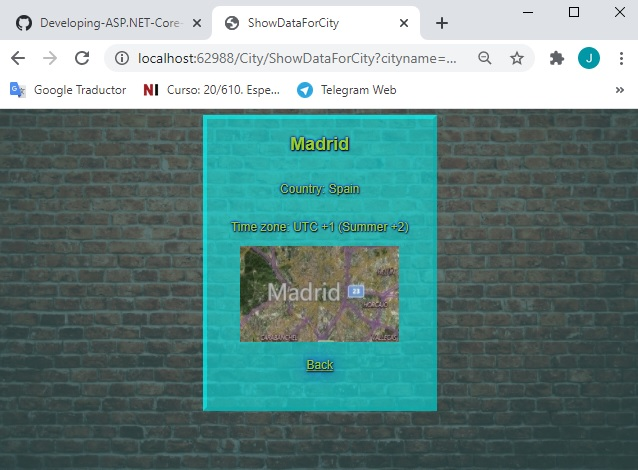

4. En Microsoft Edge, haga clic en **Cerrar**.

5. En la ventana **CitiesWebsite - Microsoft Visual Studio**, en el menú **FILE**, haga clic en **Salir**.

>**Resultado**: Al final de este ejercicio, podrás crear componentes de la vista, e incrustarlos en una vista.


