# Módulo 6: Desarrollo de Modelos

Siempre cuando un camino comienza con  *[Repository Root]*, reemplacelo con el camino absoluto en el que el repositorio 20486 reside. Por ejemplo, si tu has cloneado o extraido el repositorio 20486 en la carpeta **C:\Users\John Doe\Downloads\20486**, cambiar la ruta de: **[Repository Root]\AllFiles\20486D\Mod01** a **C:\Users\John Doe\Downloads\20486\AllFiles\20486D\Mod01**.

Fichero de Instrucciones: Instructions\20486D_MOD05_LAK.md

**Información:**

1. **Nombres y apellidos:** José René Fuentes Cutz
2. **Fecha:** 24 de Noviembre 2020.
3. **Resumen del Ejercicio:** Este laboratorio consta de 3 ejercicios:
- En el Primer ejercicio nos ayuda a  crear un Módelo, pasar el módelo de una acción a una vista y a usar el módelo en la vista de la aplicación.
- En el Segundo ejercicio nos ayuda a agregar anotaciones de datos al modelo de la clase **Butterfly** en la aplicación y agregar tag helpers a las vistas.
- En el Tercer ejercicio creamos la aplicación **ButterfliesShop** en la cual los usuarios puede hacer peticiones para comprar variedades de Mariposas.

4. **Dificultad o problemas presentados y como se resolvieron:** Ninguno.

**NOTA**: Si no hay descripcion de problemas o dificultades, y al yo descargar el código para realizar la comprobacion y el código no funcionar, el resultado de la califaciación del laboratorio será afectado.

---


# Laboratorio: Desarrollo de modelos

### Lab Setup

Tiempo estimado: **60 minutos**

### Preparation Steps

Asegúrate de que has clonado el directorio **20486D** de GitHub (**https://github.com/MicrosoftLearning/20486D-DevelopingASPNETMVCWebApplications/tree/master/Allfiles**). Contiene los segmentos de código para los laboratorios y demostraciones de este curso.


### Ejercicio 1: Añadir un modelo

#### Tarea 1: Crear un nuevo modelo

1. Ve a **[Repository Root]\Allfiles\Mod06\Labfiles\01_ButterfliesShop_begin**, y luego haz doble clic en **ButterfliesShop.sln**.

    >**Nota**: Si aparece un cuadro de diálogo de **Aviso de Seguridad para la Tienda de Mariposas**, verifica que la casilla de verificación **Pregúntame por cada proyecto de esta solución** esté despejada, y luego haz clic en OK.

2. En la ventana **ButterfliesShop - Microsoft Visual Studio**, en **Solution Explorer**, expande **Models**, y luego haz clic en **Butterfly.cs**.

3. En la ventana del código **Butterfly.cs**, localiza el siguiente código:
  ```cs
       using System.Threading.Tasks;
  ```
4. Asegúrate de que el cursor está al final del espacio de nombres **System.Threading.Tasks**, presiona Enter, y luego escribe el siguiente código:
  ```cs
       using Microsoft.AspNetCore.Http;
  ```

5. En el bloque de código **Butterfly.cs**, coloque el cursor después del segundo signo **{** (abra las abrazaderas), pulse Intro, y luego escriba el siguiente código:
  ```cs
       public int Id { get; set; }
       public string CommonName { get; set; }
       public Family? ButterflyFamily { get; set; }
       public int? Quantity { get; set; }
       public string Characteristics { get; set; }
       public DateTime CreatedDate { get; set; }
       public IFormFile PhotoAvatar { get; set; }
       public string ImageName { get; set; }
       public byte[] PhotoFile { get; set; }
       public string ImageMimeType { get; set; }
  ```
- La representación visual del codigo del ejercicio se muestra en la siguiente imagen:

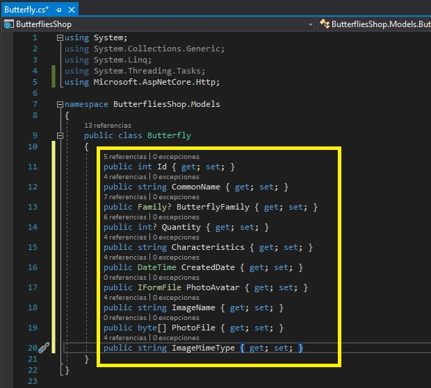

6. En la ventana de **ButterfliesShop - Microsoft Visual Studio**, en **Solution Explorer**, haz clic con el botón derecho del ratón en **Models**, apunta a **Add**, y luego haz clic en **Class**.

7. En el cuadro de diálogo **Agregar nuevo elemento - Tienda de mariposas**, en el cuadro **Nombre**, escriba **IndexViewModel**, y luego haga clic en **Agregar**.

8. En el bloque de código **IndexViewModel.cs**, coloque el cursor del ratón después del segundo signo **{** (abrazaderas), pulse Intro, y luego escriba el siguiente código:
  ```cs
       public List<Butterfly> Butterflies { get; set; }
  ```

- La representación visual del codigo del ejercicio se muestra en la siguiente imagen:

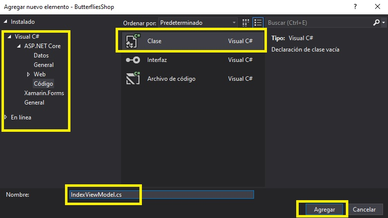

#### Tarea 2: Usar el modelo en una vista

1. En la ventana de **ButterfliesShop - Microsoft Visual Studio**, en **Solution Explorer**, expandir **Views**, y luego expandir **Butterfly**.

2. En la ventana **ButterfliesShop - Microsoft Visual Studio**, en **Solution Explorer**, en **Views**, en **Butterfly**, haga clic en **Index.cshtml**.

3. En la ventana **Index.cshtml** código, coloque el cursor al principio del documento, escriba el siguiente código y luego presione Enter.
  ```cs
       @model ButterfliesShop.Models.IndexViewModel
  ```

4. En el elemento **BODY** de la ventana de códigos **Index.cshtml**, escriba el siguiente código:
  ```cs
       <div class="container">
           <h1 class="main-title">Butterflies Shop</h1>
           <p class="into">Welcome to our Web Store, Enjoy a Wide Variety of Butterflies</p>
           <p class="into">Our Butterflies in the Shop</p>
           <button type="button" onclick="location.href='@Url.Action("Create", "Butterfly")'">Add Butterflies</button>
       </div>       
  ```
5. Ponga el cursor al final del elemento **BOTÓN** que acaba de crear, pulse Intro, y luego escriba el siguiente código:
  ```cs
       <div class="img-container">
          @foreach (var item in Model.Butterflies)
          {
          }
       </div>      
  ```

6. Ponga el cursor en el bloque de código **FOREACH**, presione Enter, y luego escriba el siguiente código:

  ```cs
       <div class="photo-index-card">
            <p>@item.CommonName</p>
            <p>@item.ButterflyFamily</p>
            <p>@item.Quantity</p>
            <p>@item.CreatedDate</p>
       </div>
  ```
- La representación visual del codigo del ejercicio se muestra en la siguiente imagen:

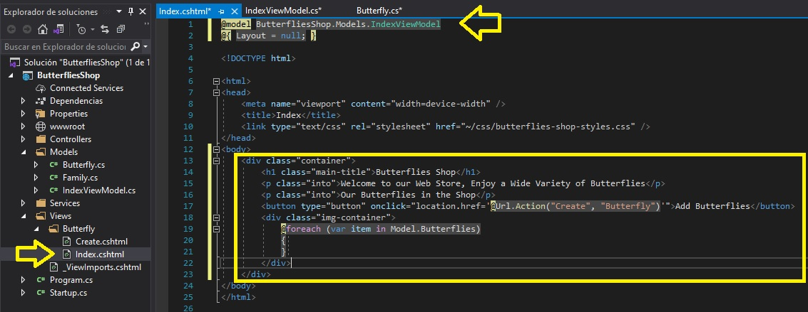

#### Tarea 3: Pasar el modelo del controlador a una vista

1. En la ventana **ButterfliesShop - Microsoft Visual Studio**, en **Solution Explorer**, expandir **Controllers**, y luego hacer clic en **ButterflyController.cs**.

2. En la ventana de código **ButterflyController.cs**, localice el siguiente código:
  ```cs
       using Microsoft.AspNetCore.Mvc;
  ```
3. Asegúrate de que el cursor está al final del espacio de nombres **Microsoft.AspNetCore.Mvc**, presiona Enter, y luego escribe el siguiente código:
  ```cs
       using System.IO;
  ```

4. Coloque el cursor al final del bloque de código del método **InitializeButterfliesData**, presione Enter dos veces, y luego escriba el siguiente código:
  ```cs
       public IActionResult Index()
       {
       }
  ```

5. En el bloque de código de acción **Index**, escriba el siguiente código:
  ```cs
       IndexViewModel indexViewModel = new IndexViewModel();
       indexViewModel.Butterflies = _data.ButterfliesList;
       return View(indexViewModel);
  ```
- La representación visual del codigo del ejercicio se muestra en la siguiente imagen:

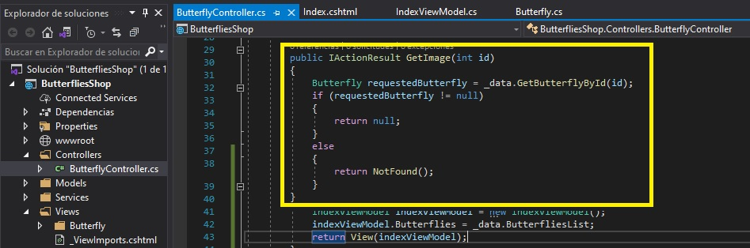

#### Tarea 4: Ejecutar la aplicación

1. En la ventana de **ButterfliesShop - Microsoft Visual Studio**, en el menú **FILE**, haga clic en **Save All**.

2. En la ventana **ButterfliesShop - Microsoft Visual Studio**, en el menú **DEBUG**, haga clic en **Iniciar sin depuración**.

    >**Nota**: El navegador muestra el resultado de la acción **Index** dentro del controlador **Butterfly**.

- La representación visual del codigo del ejercicio se muestra en la siguiente imagen:

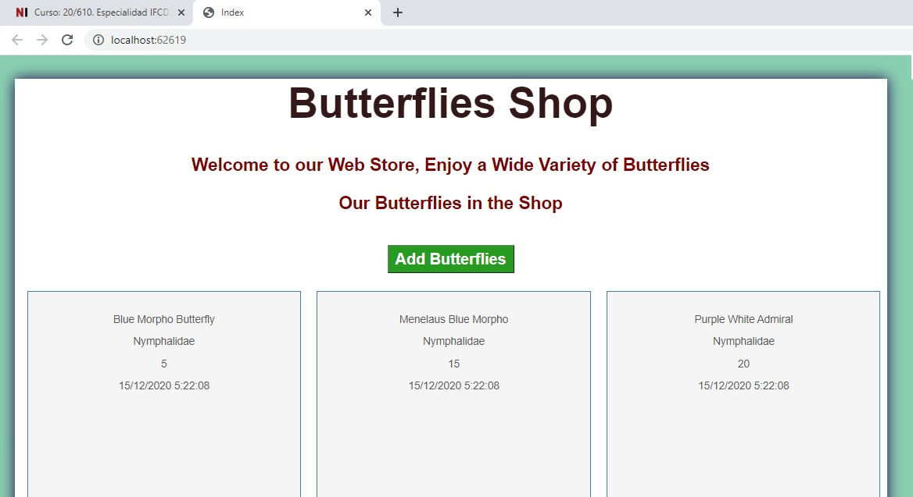

3. En Microsoft Edge, haz clic en **Cerrar**.

#### Tarea 5: Escribir una acción GET

1. En la ventana **ButterfliesShop - Microsoft Visual Studio**, en **Solution Explorer**, en **Controllers**, haga clic en **ButterflyController.cs**.

2. Coloque el cursor al final del bloque de código de acción **GetImage**, presione Enter dos veces, y luego escriba el siguiente código:
  ```cs
       [HttpGet]
       public IActionResult Create()
       {
       }
  ``` 
3. En el bloque de código de acción **Crear**, escriba el siguiente código:
  ```cs
       return View();
  ```
- La representación visual del codigo del ejercicio se muestra en la siguiente imagen:

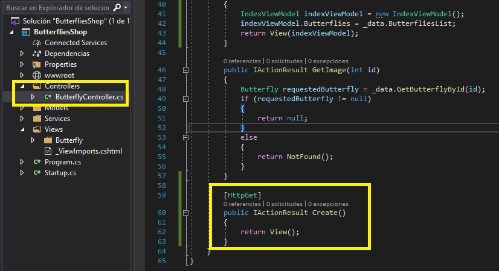

#### Tarea 6: Escribir una acción POST que acepte el modelo

1. En la ventana de código **ButterflyController.cs**, asegúrese de que el cursor está al final del bloque de código de acción **Create** con el verbo **HTTP GET**, presione Enter, y luego escriba el siguiente código:
  ```cs
       [HttpPost]
       public IActionResult Create(Butterfly butterfly)
       {
       }
  ```

2. En el bloque de código de acción **Crear** creado con el verbo **HTTP POST**, escriba el siguiente código y luego presione Enter.
  ```cs
       Butterfly lastButterfly = _data.ButterfliesList.LastOrDefault();
       butterfly.CreatedDate = DateTime.Today;
       if (butterfly.PhotoAvatar != null && butterfly.PhotoAvatar.Length > 0)
       {
            butterfly.ImageMimeType = butterfly.PhotoAvatar.ContentType;
            butterfly.ImageName = Path.GetFileName(butterfly.PhotoAvatar.FileName);
            butterfly.Id = lastButterfly.Id + 1;
            _butterfliesQuantityService.AddButterfliesQuantityData(butterfly);
            using (var memoryStream = new MemoryStream())
            {
                butterfly.PhotoAvatar.CopyTo(memoryStream);
                butterfly.PhotoFile = memoryStream.ToArray();
            }
            _data.AddButterfly(butterfly);
            return RedirectToAction("Index");
       }
  ```
3. En el bloque de código de acción **Crear** creado con el verbo **HTTP POST**, inmediatamente después del código que acabas de añadir, pulsa Intro, y luego escribe el siguiente código:
  ```cs
       return View(butterfly);
  ```
- La representación visual del codigo del ejercicio se muestra en la siguiente imagen:

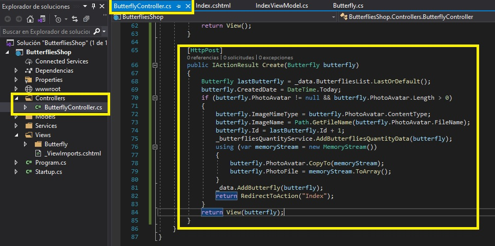


>**Resultados**: Después de completar este ejercicio, podrás crear un modelo, pasar el modelo de una acción a una vista y utilizar el modelo en la vista. 

### Ejercicio 2: Trabajando con las formas

#### Tarea 1: Añadir anotaciones de datos de visualización y edición a un modelo

1. En la ventana de **ButterfliesShop - Microsoft Visual Studio**, en **Solution Explorer**, en **Models**, haga clic en **Butterfly.cs**.

2. En la ventana del código **Butterfly.cs**, localiza el siguiente código:
  ```cs
      using Microsoft.AspNetCore.Http;
  ```
3. Asegúrate de que el cursor está al final del espacio de nombres **Microsoft.AspNetCore.Http**, presiona Enter, y luego escribe el siguiente código:
  ```cs
      using System.ComponentModel.DataAnnotations;
  ```

4. En la ventana del código **Butterfly.cs**, coloque el cursor al final del código de propiedad **Id**, presione Enter dos veces, y luego escriba el siguiente código:

  ```cs
      [Display(Name = "Common Name:")]
  ```

5. En la ventana del código **Butterfly.cs**, coloque el cursor al final del código de propiedad **CommonName**, presione Enter dos veces, y luego escriba el siguiente código:
  ```cs
      [Display(Name = "Butterfly Family:")]
  ```

6. En la ventana del código **Butterfly.cs**, coloca el cursor al final del código de propiedad **ButterflyFamily**, presiona Enter dos veces, y luego escribe el siguiente código:
  ```cs
      [Display(Name = "Butterflies Quantity:")]
  ```

7. En la ventana del código **Butterfly.cs**, coloque el cursor al final del código de propiedad **Cantidad**, presione Enter dos veces, y luego escriba el siguiente código:
  ```cs
      [Display(Name = "Characteristics:")]
  ```

8. En la ventana del código **Butterfly.cs**, coloque el cursor al final del código de propiedad **Características**, presione Enter dos veces, y luego escriba el siguiente código:
  ```cs
      [DataType(DataType.DateTime)]
      [Display(Name = "Updated on:")]
      [DisplayFormat(DataFormatString = "{0:dd/MM/yy}")]
  ```

9. En la ventana del código **Butterfly.cs**, coloque el cursor al final del código de propiedad **CreatedDate**, presione Enter dos veces, y luego escriba el siguiente código:
  ```cs
      [Display(Name = "Butterflies Picture:")]
  ```
- La representación visual del codigo del ejercicio se muestra en la siguiente imagen:

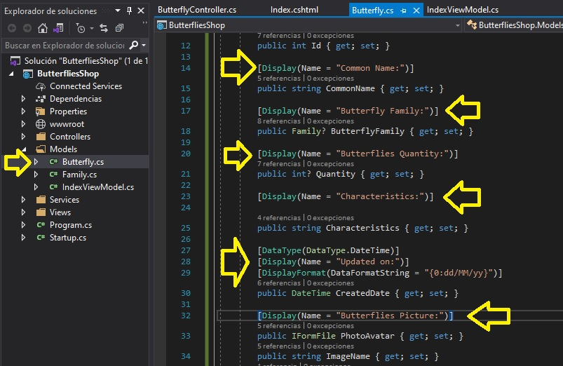

#### Tarea 2: Actualizar una acción para devolver FileContentResult

1. En la ventana **ButterfliesShop - Microsoft Visual Studio**, en **Solution Explorer**, en **Controllers**, haga clic en **ButterflyController.cs**.

2. En el bloque de código de acción **GetImage**, localiza el siguiente código:
  ```cs
       Butterfly requestedButterfly = _data.GetButterflyById(id);
       if (requestedButterfly != null)
       {
          return null;
       }
       else
       {
          return NotFound();
       }
  ```

3. En el bloque de código de declaración **IF**, seleccione el siguiente código:
  ```cs
       return null;
  ```

4. Reemplazar el código seleccionado por el siguiente código:
  ```cs
       string webRootpath = _environment.WebRootPath;
       string folderPath = "\\images\\";
       string fullPath = webRootpath + folderPath + requestedButterfly.ImageName;
       if (System.IO.File.Exists(fullPath))
       {
            FileStream fileOnDisk = new FileStream(fullPath, FileMode.Open);
            byte[] fileBytes;
            using (BinaryReader br = new BinaryReader(fileOnDisk))
            {
                fileBytes = br.ReadBytes((int)fileOnDisk.Length);
            }
            return File(fileBytes, requestedButterfly.ImageMimeType);
       }
       else
       {
            if (requestedButterfly.PhotoFile.Length > 0)
            {
                return File(requestedButterfly.PhotoFile, requestedButterfly.ImageMimeType);
            }
            else
            {
                return NotFound();
            }
       }
  ```
- La representación visual del codigo del ejercicio se muestra en la siguiente imagen:

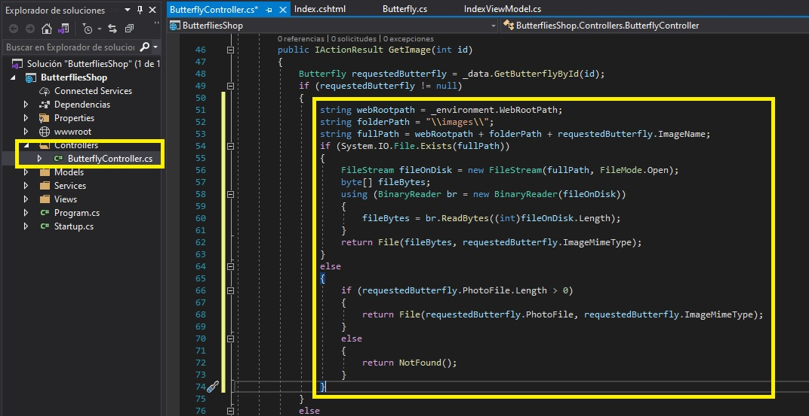

#### Tarea 3: Agregar ayudantes de exhibición

1. En la ventana **ButterfliesShop - Microsoft Visual Studio**, en **Solution Explorer**, en **Views**, en **Butterfly**, haga clic en **Index.cshtml**.

2. En la ventana **Index.cshtml** código, seleccione el siguiente código:
  ```cs
       <p>@item.CommonName</p>
       <p>@item.ButterflyFamily</p>
       <p>@item.Quantity</p>
       <p>@item.CreatedDate</p>
  ```

3. Reemplazar el código seleccionado por el siguiente código:
  ```cs
       <h3 class="display-picture-title">
           "@Html.DisplayFor(modelItem => item.CommonName)"
       </h3>
       @if (item.ImageName != null)
       {     
       }
  ```
4. En el bloque de código **IF**, escriba el siguiente código:
  ```cs
       <div class="photo-display">
             
       </div>
  ```

5. Ponga el cursor al final del bloque de código **IF**, pulse Intro, y luego escriba el siguiente código:

  ```cs
       <div>
            <p class="display-label">
                @Html.DisplayNameFor(model => item.ButterflyFamily)
            </p>
            <br />
            <p class="display-field">
                @Html.DisplayFor(model => item.ButterflyFamily)
            </p>
       </div>
       <div class="display-info">
            <p class="display-label">
                @Html.DisplayNameFor(model => item.Characteristics)
            </p>
            <p class="display-field">
                @Html.DisplayFor(model => item.Characteristics)
            </p>
       </div>
       <div>
            <p class="display-label">
                @Html.DisplayNameFor(model => item.Quantity)
            </p>
            <p class="display-field">
                @Html.DisplayFor(model => item.Quantity)
            </p>
       </div>
       <div>
            <p class="display-label">
                 @Html.DisplayNameFor(model => item.CreatedDate)
            </p>
            <p class="display-field">
                @Html.DisplayFor(model => item.CreatedDate)
            </p>
       </div>
  ```
- La representación visual del codigo del ejercicio se muestra en la siguiente imagen:

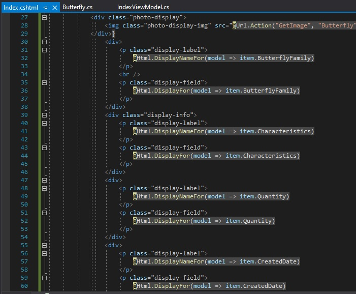

#### Tarea 4: Añadir ayudantes de formulario

1. En la ventana **ButterfliesShop - Microsoft Visual Studio**, en **Solution Explorer**, en **Views**, en **Butterfly**, haga clic en **Create.cshtml**.

2. En la ventana **Create.cshtml** code, coloque el cursor al principio del documento, escriba el siguiente código y luego pulse Intro.
  ```cs
       @using ButterfliesShop.Models
       @model ButterfliesShop.Models.Butterfly
  ```

3. En el elemento **BODY** de la ventana del código **Create.cshtml**, escriba el siguiente código:
  ```cs
       <div class="container">
           <h1 class="main-title">Add Butterflies to the Shop</h1>
           <form method="post" enctype="multipart/form-data" asp-action="Create">  
           </form>
       </div>
  ```
- La representación visual del codigo del ejercicio se muestra en la siguiente imagen:

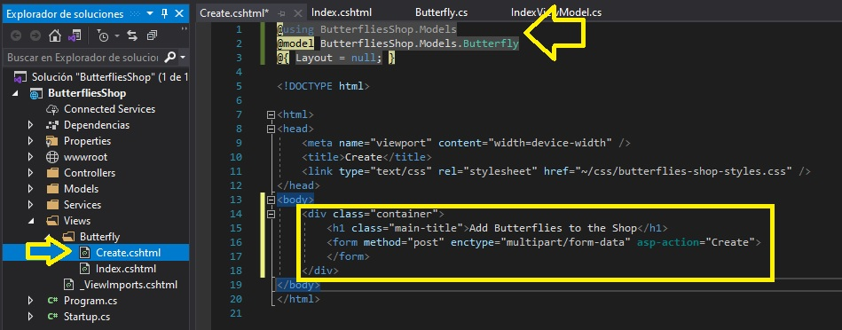

#### Tarea 5: Añadir ayudantes de edición

1. En el elemento **FORM** de la ventana del código **Create.cshtml**, escriba el siguiente código:
  ```cs
       <div class="form-field">
            <label asp-for="CommonName"></label>
            <input asp-for="CommonName" />
        </div>
        <div class="form-field">
            <label asp-for="ButterflyFamily"></label>
            <select asp-for="ButterflyFamily" asp-items="Html.GetEnumSelectList<Family>()">
                <option selected="selected" value="">Select</option>
            </select>
        </div>
        <div class="form-field">
            <label asp-for="Characteristics"></label>
            <textarea asp-for="Characteristics"></textarea>
        </div>
        <div class="form-field">
            <label asp-for="Quantity"></label>
            <input asp-for="Quantity" />
        </div>
        <div class="form-field">
            <label asp-for="PhotoAvatar"></label>
            <input asp-for="PhotoAvatar" type="file" />
        </div> 
        <div class="form-field">
            <input type="submit" value="Submit" />
        </div>
  ```

- La representación visual del codigo del ejercicio se muestra en la siguiente imagen:

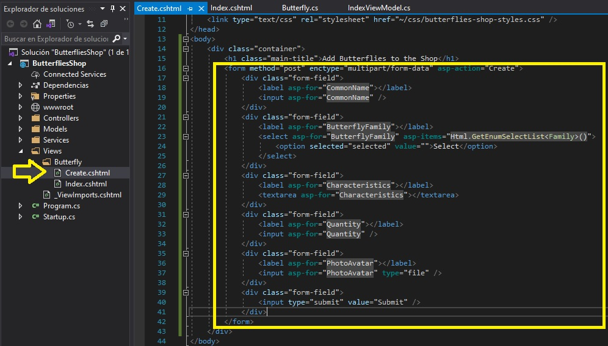

#### Tarea 6: Ejecutar la aplicación

1. En la ventana de **ButterfliesShop - Microsoft Visual Studio**, en el menú **FILE**, haga clic en **Save All**.

2. En la ventana **ButterfliesShop - Microsoft Visual Studio**, en el menú **DEBUG**, haga clic en **Iniciar sin depuración**.

- La representación visual del codigo del ejercicio se muestra en la siguiente imagen:

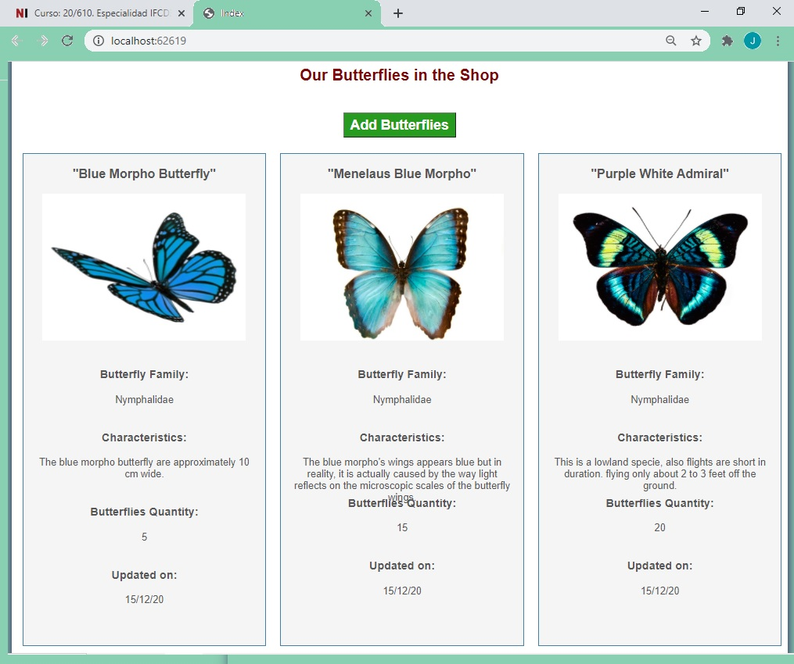

  > **Nota**: El navegador muestra el resultado de la acción **Index** dentro del controlador **Butterfly**.

3. En Microsoft Edge, haz clic en **Add Butterflies**.
 
    >**Nota**: El navegador muestra la acción **Crear** con el resultado del verbo **HTTP GET** dentro del Controlador **Butterfly**.

- La representación visual del codigo del ejercicio se muestra en la siguiente imagen:

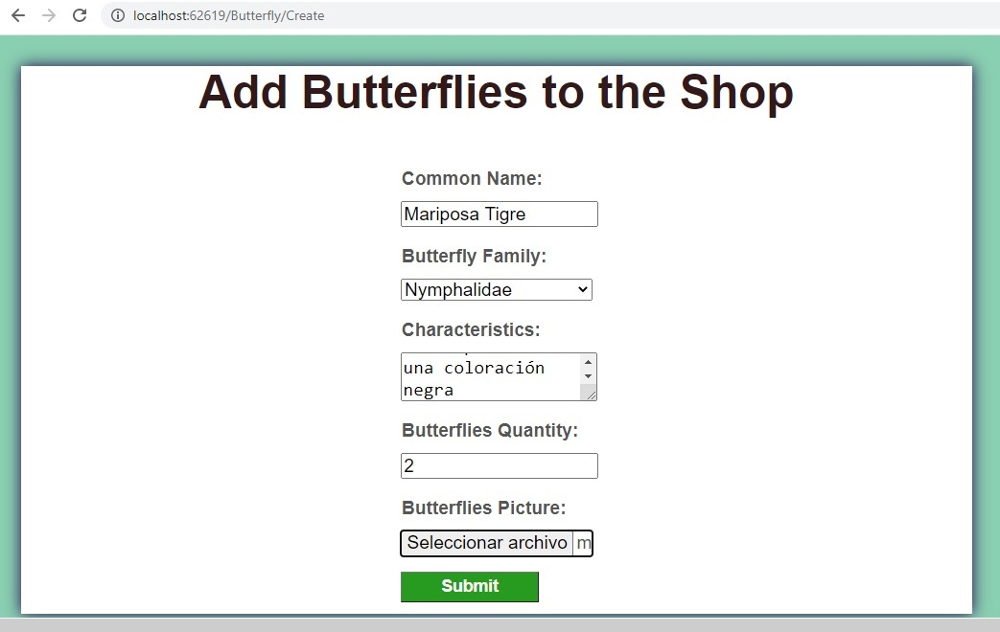

4. En la página **Add Butterflies to The Shop**, en la casilla **Nombre común**, escriba _&lt;Un nombre común de mariposa de su elección&gt;._

5. En la página **Add Butterflies to The Shop**, en la casilla **Butterfly Family**, seleccione _&lt;Una familia de mariposas de su elección&gt;._

6. En la página **Add Butterflies to The Shop**, en la casilla **Características**, escriba _&lt;Una característica de mariposa de su elección&gt;._

7. En la página **Add Butterflies to The Shop**, en la casilla **Butterflies Quantity**, escriba _&lt;Una cantidad de mariposas de su elección&gt;._

8. En la página **Add Butterflies to The Shop**, en la casilla **Butterflies Picture**, seleccione _&lt;Una foto de mariposa de su elección de [Raíz del repositorio]\AllFiles\Mod06\Labfiles de Imágenes&gt;._, y luego haga clic en **Enviar**.

      >**Nota**: Verifica que los detalles de la mariposa enviada son válidos y que una nueva mariposa fue añadida a la página principal.

- La representación visual del codigo del ejercicio se muestra en la siguiente imagen:

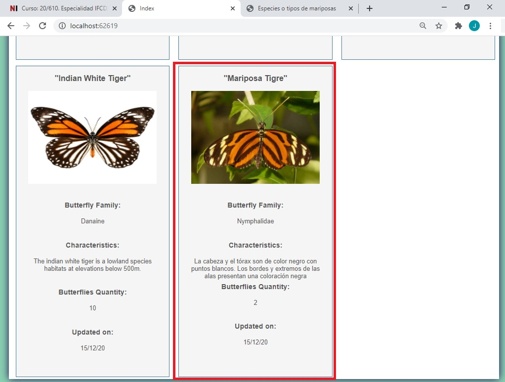

9. En Microsoft Edge, haga clic en **Cerrar**.

>**Resultados**: Después de completar este ejercicio, podrá agregar anotaciones de datos a la clase de modelo **Mariposa** de la aplicación y agregar ayudantes de etiquetas a las vistas. 

### Ejercicio 3: Agregar validación

#### Tarea 1: Añadir anotaciones de datos de validación a un modelo

1. En la ventana de **ButterfliesShop - Microsoft Visual Studio**, en **Solution Explorer**, en **Models**, haga clic en **Butterfly.cs**.

2. En la ventana **Butterfly.cs** code, en el código de propiedad **CommonName**, coloca el cursor al final de la anotación de datos **Display**, pulsa Intro, y luego escribe el siguiente código:
  ```cs
      [Required(ErrorMessage = "Please enter the butterfly name")]
  ```
3. En la ventana del código **Butterfly.cs**, en el código de propiedad **ButterflyFamily**, coloque el cursor al final de la anotación de datos **Display**, presione Enter, y luego escriba el siguiente código:
  ```cs
      [Required(ErrorMessage = "Please select the butterfly family")]
  ```

4. En la ventana del código **Butterfly.cs**, en el código de propiedad **Cantidad**, coloque el cursor al final de la anotación de datos **Display**, pulse Intro, y luego escriba el siguiente código:
  ```cs
      [Required(ErrorMessage = "Please select the butterfly quantity")]
  ```

5. En la ventana del código **Butterfly.cs**, en el código de propiedad **Características**, coloque el cursor al final de la anotación de datos **Display**, presione Enter, y luego escriba el siguiente código:
  ```cs
      [Required(ErrorMessage = "Please type the characteristics")]
      [StringLength(50)]
  ```

6. En la ventana del código **Butterfly.cs**, coloca el cursor al final del código de propiedad **Características**, y luego presiona Enter dos veces.

7. En la ventana del código **Butterfly.cs**, en el código de propiedad **PhotoAvatar**, coloque el cursor al final de la anotación de datos **Display**, presione Enter, y luego escriba el siguiente código:
  ```cs
      [Required(ErrorMessage = "Please select the butterflies picture")]
  ```
8.  En la ventana del código **Butterfly.cs**, coloca el cursor al final del código de propiedad **PhotoAvatar**, y luego presiona Enter.

- La representación visual del codigo del ejercicio se muestra en la siguiente imagen:

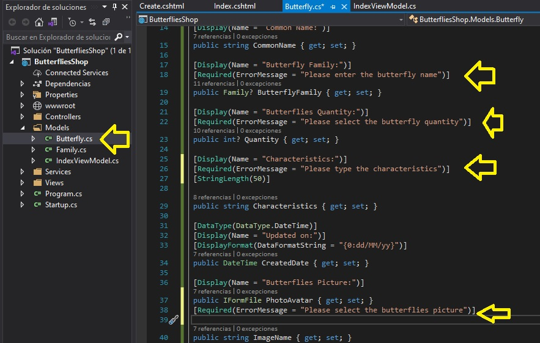

#### Tarea 2: Añadir ayudantes de validación a una vista

1. En la ventana **ButterfliesShop - Microsoft Visual Studio**, en **Solution Explorer**, en **Views**, en **Butterfly**, haga clic en **Create.cshtml**.

2. En la ventana del código **Create.cshtml**, localiza el siguiente código:
  ```cs
      <form method="post" enctype="multipart/form-data" asp-action="Create">
  ```
3. Ponga el cursor al final del código localizado, presione Enter, y luego escriba el siguiente código:
  ```cs
      <div asp-validation-summary="All"></div>
  ```

4. En la ventana del código **Create.cshtml**, localiza el siguiente código:
  ```cs
      <input asp-for="CommonName" />
  ```
5. En la ventana del código **Create.cshtml**, coloque el cursor al final del código localizado, presione Enter, y luego escriba el siguiente código:
  ```cs
      <span asp-validation-for="CommonName"></span>
  ```
6. En la ventana del código **Create.cshtml**, localiza el siguiente código:
  ```cs
      <select asp-for="ButterflyFamily" asp-items="Html.GetEnumSelectList<Family>()">
        <option selected="selected" value="">Select</option>
      </select>
  ```
7. En la ventana del código **Create.cshtml**, coloque el cursor al final del código localizado, presione Enter, y luego escriba el siguiente código:
  ```cs
      <span asp-validation-for="ButterflyFamily"></span>
  ```
8. En la ventana del código **Create.cshtml**, localiza el siguiente código:
  ```cs
      <textarea asp-for="Characteristics"></textarea>
  ```
9. En la ventana del código **Create.cshtml**, coloque el cursor al final del código localizado, presione Enter, y luego escriba el siguiente código:
  ```cs
      <span asp-validation-for="Characteristics"></span>
  ```
10. En la ventana del código **Create.cshtml**, localiza el siguiente código:
  ```cs
       <input asp-for="Quantity" />
  ```
11. En la ventana del código **Create.cshtml**, coloque el cursor al final del código localizado, presione Enter, y luego escriba el siguiente código:
  ```cs
      <span asp-validation-for="Quantity"></span>
  ```

12. En la ventana del código **Create.cshtml**, localiza el siguiente código:
  ```cs
       <input asp-for="PhotoAvatar" type="file" />
  ```
13. En la ventana del código **Create.cshtml**, coloque el cursor al final del código localizado, presione Enter, y luego escriba el siguiente código:
  ```cs
      <span asp-validation-for="PhotoAvatar"></span>
  ```

- La representación visual del codigo del ejercicio se muestra en la siguiente imagen:

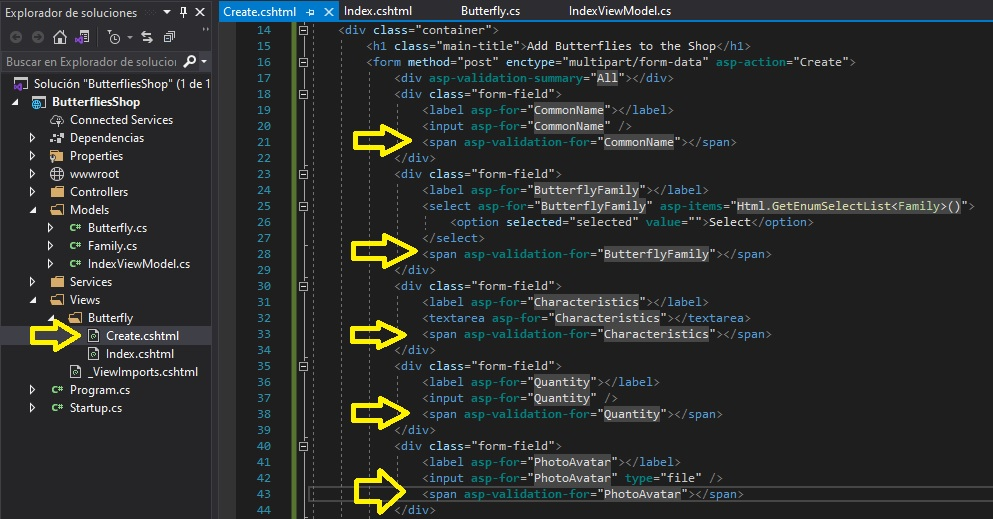

#### Tarea 3: Usar la propiedad ModelState.IsValid en un controlador

1. En la ventana **ButterfliesShop - Microsoft Visual Studio**, en **Solution Explorer**, en **Controllers**, haga clic en **ButterflyController.cs**.

2. En el bloque de código de acción **Crear** creado con el verbo **HTTP POST**, localiza el siguiente código:
  ```cs
       [HttpPost]
       public IActionResult Create(Butterfly butterfly)
       {
  ```
3. Ponga el cursor después del signo **{** (abra las abrazaderas), pulse Intro, y luego escriba el siguiente código:
  ```cs
       if (ModelState.IsValid)
       {
  ```
4. En el bloque de código de acción **Crear** creado con el verbo **HTTP POST**, localiza el siguiente código:
  ```cs
       return View(butterfly);
  ```
5. En el bloque de código de acción **Crear** creado con el verbo **HTTP POST**, inmediatamente después del código localizado, presione Enter, y luego escriba el siguiente código:
  ```cs
       }
       return View(butterfly);
  ```
- La representación visual del codigo del ejercicio se muestra en la siguiente imagen:

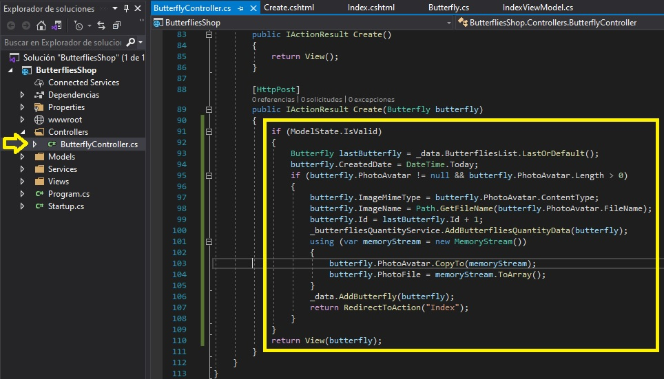

#### Tarea 4: Ejecutar la aplicación

1. En la ventana de **ButterfliesShop - Microsoft Visual Studio**, en el menú **FILE**, haga clic en **Save All**.

2. En la ventana **ButterfliesShop - Microsoft Visual Studio**, en el menú **DEBUG**, haga clic en **Iniciar sin depuración**.

    >**Nota**: El navegador muestra el resultado de la acción **Index** dentro del controlador **Butterfly**.

- La representación visual del codigo del ejercicio se muestra en la siguiente imagen:

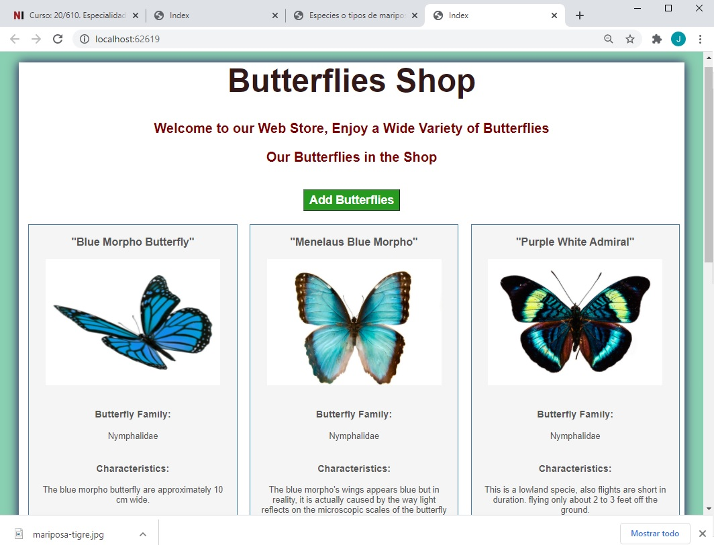

3. En Microsoft Edge, haz clic en **Add Butterflies**.
 
    >**Nota**: El navegador muestra la acción **Crear** con el resultado del verbo **HTTP GET** dentro del Controlador **Butterfly**.

4. En la página de **Add Butterflies to The Shop**, deja todas las casillas en blanco, y luego haz clic en **Subir**.

      >**Nota**: La ventana del navegador muestra la vista **Create.cshtml** con mensajes de validación debajo de todas las casillas.
- La representación visual del codigo del ejercicio se muestra en la siguiente imagen:

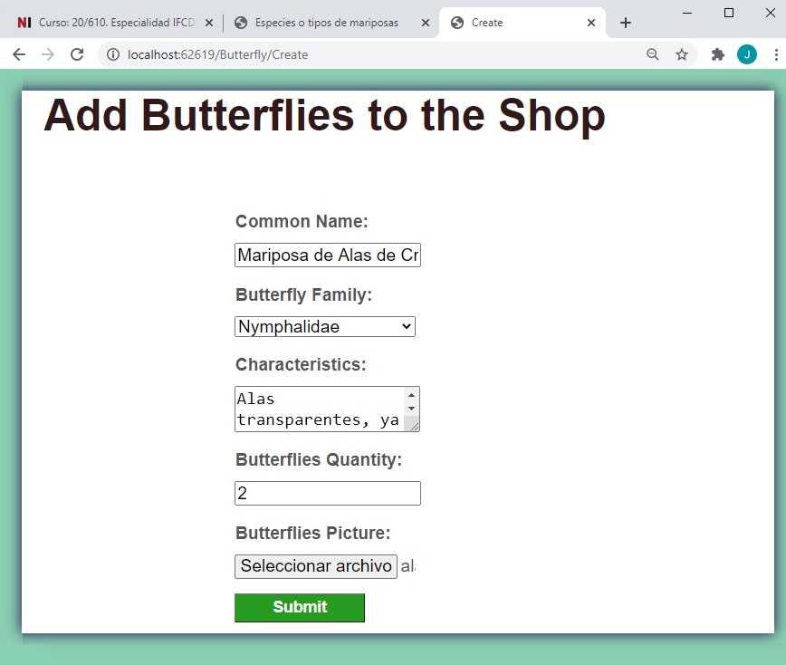

5. En la página **Add Butterflies to The Shop**, en la casilla **Nombre común**, escriba _&lt;Un nombre común de mariposa de su elección&gt;._.

6. En la página **Add Butterflies to The Shop**, en la casilla **Butterfly Family**, seleccione _&lt;Una familia de mariposas de su elección&gt;._.

7. En la página **Add Butterflies to The Shop**, en la casilla **Características**, escriba _&lt;Una característica de mariposa de su elección&gt;._.

8. En la página **Add Butterflies to The Shop**, en la casilla **Butterflies Quantity**, escriba **5**.

9. En la página **Add Butterflies to The Shop**, en la casilla **Cuadro de mariposas**, seleccione _&lt;Una imagen de mariposa de su elección de [Raíz del repositorio]\AllFiles\Mod06\LabfilesImages;,_ y luego haga clic en **Enviar**.
- La representación visual del codigo del ejercicio se muestra en la siguiente imagen:


      >**Nota**: Verifica que los detalles de la mariposa enviada son válidos y que una nueva mariposa fue añadida a la página principal.

- La representación visual del codigo del ejercicio se muestra en la siguiente imagen:

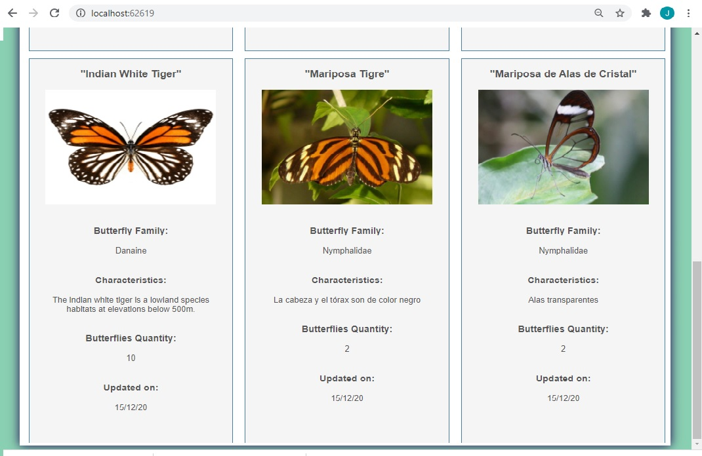

10. En Microsoft Edge, haga clic en **Cerrar**.

#### Tarea 5: Agregar validación personalizada

1. En **Explorador de soluciones**, haga clic con el botón derecho en **Tienda de mariposas**, apunte a **Agregar**, y luego haga clic en **Nueva carpeta**.

2. En la casilla **Nueva Carpeta**, escribe **Validadores**, y luego pulsa Intro.

3. En la ventana **ButterfliesShop - Microsoft Visual Studio**, en **Solution Explorer**, haz clic con el botón derecho del ratón en **Validators**, apunta a **Add**, y luego haz clic en **Class**.

4. En el cuadro de diálogo **Agregar nuevo elemento - Tienda de mariposas**, en el cuadro **Nombre**, escriba **MaxButterflyQuantityValidation**, y luego haga clic en **Agregar**.

5. En la ventana de código **MaxButterflyQuantityValidation.cs**, localiza el siguiente código:
  ```cs
      using System.Threading.Tasks;
  ```
6. Asegúrate de que el cursor está al final del espacio de nombres **System.Threading.Tasks**, presiona Enter, y luego escribe el siguiente código:
  ```cs
      using ButterfliesShop.Models;
      using ButterfliesShop.Services;
      using System.ComponentModel.DataAnnotations;
  ```
7. En la ventana del código **MaxButterflyQuantityValidation.cs**, localiza el siguiente código:
  ```cs
      public class MaxButterflyQuantityValidation
  ```
8.  Añada el siguiente código a la línea de código existente.
  ```cs
      : ValidationAttribute
  ```
9. En el bloque de código **MaxButterflyQuantityValidation.cs**, coloque el cursor después del segundo signo **{** (abrazaderas), pulse Intro, y luego escriba el siguiente código:
  ```cs
      private int _maxAmount;
      public MaxButterflyQuantityValidation(int maxAmount)
      {
         _maxAmount = maxAmount;
      }
  ```

10. Coloque el cursor al final del bloque de código **constructor**, presione Enter dos veces, escriba el siguiente código y luego presione Enter.
  ```cs
      protected override ValidationResult IsValid(object value, ValidationContext validationContext)
      {
      }
  ```

11. En el bloque de código del método **IsValid**, presione Enter, y luego escriba el siguiente código:
  ```cs
      var service = (IButterfliesQuantityService)validationContext.GetService(typeof(IButterfliesQuantityService));
      Butterfly butterfly = (Butterfly)validationContext.ObjectInstance;
      if (butterfly.ButterflyFamily != null)
      {
            int? quantity = service.GetButterflyFamilyQuantity(butterfly.ButterflyFamily.Value);
            int? sumQuantity = quantity + butterfly.Quantity;
            if (sumQuantity > _maxAmount)
            {
                return new ValidationResult(string.Format("Limit of butterflies from the same family in the store is {0} butterflies. Currently there are {1}", _maxAmount, quantity));
            }
            return ValidationResult.Success;
      }
      return ValidationResult.Success;
  ```

- La representación visual del codigo del ejercicio se muestra en la siguiente imagen:

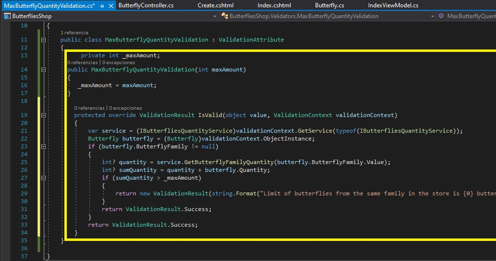

12. En la ventana de **ButterfliesShop - Microsoft Visual Studio**, en **Solution Explorer**, expandir **Models**, y luego hacer clic en **Butterfly.cs**.

13. En la ventana del código **Butterfly.cs**, localiza el siguiente código:
  ```cs
       using System.ComponentModel.DataAnnotations;
  ```
14. Asegúrate de que el cursor está al final del espacio de nombres **System.ComponentModel.DataAnnotations**, presiona Enter, y luego escribe el siguiente código:
  ```cs
       using ButterfliesShop.Validators;
  ```
15. En la ventana del código **Butterfly.cs**, localiza el siguiente código:
  ```cs
      [Required(ErrorMessage = "Please select the butterfly quantity")]
  ```
16.  Ponga el cursor debajo del código localizado, presione Enter, y luego escriba el siguiente código:

  ```cs
      [MaxButterflyQuantityValidation(50)]
  ```
- La representación visual del codigo del ejercicio se muestra en la siguiente imagen:

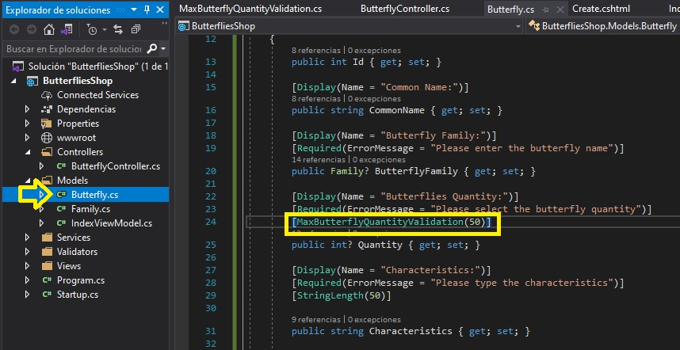

#### Tarea 6: Ejecutar la aplicación

1. En la ventana de **ButterfliesShop - Microsoft Visual Studio**, en el menú **FILE**, haga clic en **Save All**.

2. En la ventana **ButterfliesShop - Microsoft Visual Studio**, en el menú **DEBUG**, haga clic en **Iniciar sin depuración**.

    >**Nota**: El navegador muestra el resultado de la acción **Index** dentro del controlador **Butterfly**.

- La representación visual del codigo del ejercicio se muestra en la siguiente imagen:

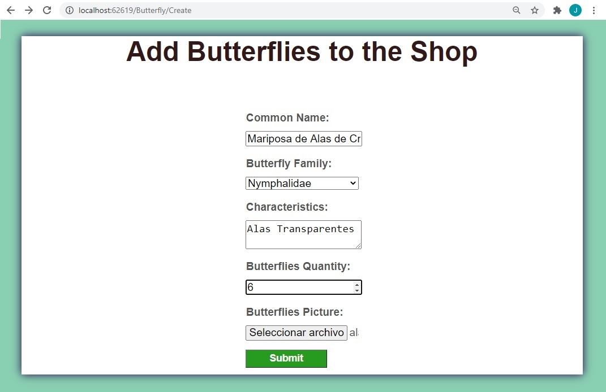

3. En Microsoft Edge, haz clic en **Add Butterflies**.
 
    >**Nota**: El navegador muestra la acción **Crear** con el resultado del verbo **HTTP GET** dentro del Controlador **Butterfly**.

4. En la página **Add Butterflies to The Shop**, en la casilla **Nombre común**, escriba _&lt;Un nombre común de mariposa de su elección&gt;._

5. En la página **Add Butterflies to The Shop**, en la casilla **Butterfly Family**, seleccione _&lt;Una familia de mariposas de su elección&gt;._

6. En la página **Add Butterflies to The Shop**, en la casilla **Características**, escriba _&lt;Una característica de mariposa de su elección&gt;._

7. En la página **Add Butterflies to The Shop**, en la casilla **Butterflies Quantity**, escriba **60**.

8. En la página **Add Butterflies to The Shop**, en la casilla **Cuadro de mariposas**, seleccione _&lt;Una imagen de mariposa de su elección de [Raíz del repositorio]\AllFiles\Mod06\Labfiles\Images&gt;,_ y luego haga clic en **Enviar**.

- La representación visual del codigo del ejercicio se muestra en la siguiente imagen:

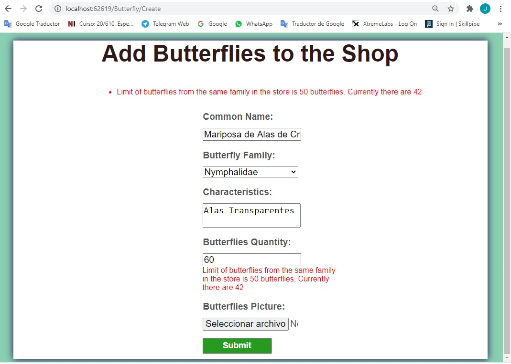

  > **Nota**: La ventana del navegador muestra la vista **Create.cshtml** con un mensaje de validación personalizado debajo de la casilla **Butterflies Quantity**.

9. En la página **Add Butterflies to The Shop**, en la casilla **Butterflies Quantity**, escriba **2**.

10. En la página **Add Butterflies to The Shop**, en la casilla **Cuadro de mariposas**, seleccione _&lt;Una imagen de mariposa de su elección de [Raíz del repositorio]\AllFiles\Mod06\Labfiles\Images&gt;,_ y luego haga clic en **Enviar**.

      >**Nota**: Verifica que los detalles de la mariposa enviada son válidos y que una nueva mariposa fue añadida a la página principal.


- La representación visual del codigo del ejercicio se muestra en la siguiente imagen:

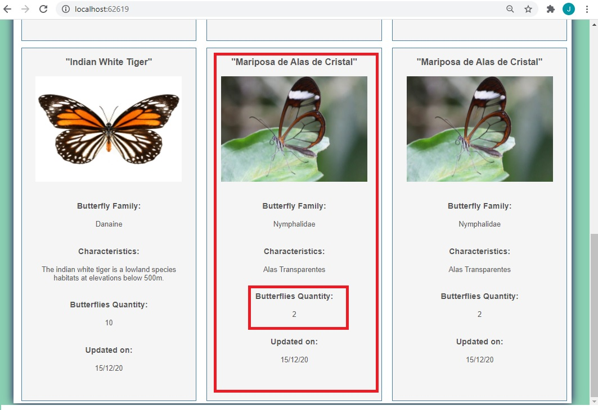

11. En Microsoft Edge, haga clic en **Cerrar**.

12. En la ventana de **ButterfliesShop - Microsoft Visual Studio**, en el menú **FILE**, haga clic en **Salir**.

>**Resultados**: Al final de este ejercicio, has creado una aplicación **ButterfliesShop** en la que los usuarios pueden enviar a la tienda una variedad de mariposas.

