# Module 7: Usando Entity Framework Core en ASP.NET Core

Siempre cuando un camino comienza con  *[Repository Root]*, reemplacelo con el camino absoluto en el que el repositorio 20486 reside. Por ejemplo, si tu has cloneado o extraido el repositorio 20486 en la carpeta **C:\Users\John Doe\Downloads\20486**, cambiar la ruta de: **[Repository Root]\AllFiles\20486D\Mod01** a **C:\Users\John Doe\Downloads\20486\AllFiles\20486D\Mod01**.

Fichero de Instrucciones: Instructions\20486D_MOD07_LAK.md

**Información:**

1. **Nombres y apellidos:** José René Fuentes Cortez
2. **Fecha:** 24 de Noviembre 2020.
3. **Resumen del Ejercicio:** Este laboratorio consta de 4 ejercicio:
- En el Primer ejercicio nos ayuda a añadir el Entity Framework Core a la aplicación de la tienda de cupcakes.
- En el Segundo ejercicio nos ayuda a usar Entity Framework Core para recuperar y almacenar datos a través de un repositorio en el **CupcakeController**.
- En el Tercer ejercicio creamos una aplicación de tienda de cupcakes en la que los usuarios puedan agregar un nuevo cupcake, editar un cupcake, borrar un cupcake y ver los detalles de un cupcake.

4. **Dificultad o problemas presentados y como se resolvieron:** Ninguno.

**NOTA**: Si no hay descripcion de problemas o dificultades, y al yo descargar el código para realizar la comprobacion y el código no funcionar, el resultado de la califaciación del laboratorio será afectado.

---


# Laboratorio: Usando Entity Framework Core en ASP.NET Core

### Configuración del Lab

Tiempo estimado: **60 minutos**

### Pasos de Preparación

Asegúrate de que has clonado el directorio 20486D de GitHub (**https://github.com/MicrosoftLearning/20486D-DevelopingASPNETMVCWebApplications/tree/master/Allfiles**). Contiene los segmentos de código para los laboratorios y demostraciones de este curso. 

### Ejercicio 1: Agregar el núcleo del marco de entidades 

#### Tarea 1: Crear clases modelo

1. Ve a **[Repository Root]\Allfiles\Mod07\Labfiles\01_Cupcakes_begin**, y luego haz doble clic en **Cupcakes.sln**.

    >**Nota**: Si aparece un cuadro de diálogo de **Aviso de Seguridad para Cupcakes**, verifica que la casilla de verificación **Pregúntame por cada proyecto de esta solución** está despejada, y luego haz clic en OK.

2. En la ventana **Cupcakes - Microsoft Visual Studio**, en **Solution Explorer**, haz clic con el botón derecho del ratón en **Models**, apunta a **Add**, y luego haz clic en **Class**.

3. En el cuadro de diálogo **Agregar nuevo elemento - Cupcakes**, en el cuadro **Nombre**, escriba **Cupcake**, y luego haga clic en **Agregar**.

- La representación visual del codigo del ejercicio se muestra en la siguiente imagen:

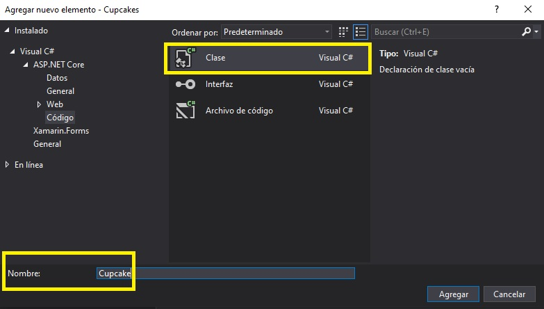

4. En la ventana de código **Cupcake.cs**, localiza el siguiente código:
  ```cs
       using System.Threading.Tasks;
  ```
5. Asegúrate de que el cursor está al final del espacio de nombres **System.Threading.Tasks**, presiona Enter, y luego escribe el siguiente código:
  ```cs
       using Microsoft.AspNetCore.Http;
       using System.ComponentModel.DataAnnotations;
       using System.ComponentModel.DataAnnotations.Schema;
  ```

6. En el bloque de código **Cupcake.cs**, coloque el cursor después del segundo signo **{** (abrazaderas), pulse Intro, y luego escriba el siguiente código:
  ```cs
       [Key]
       public int CupcakeId { get; set; }

       [Required(ErrorMessage = "Please select a cupcake type")]
       [Display(Name = "Cupcake Type:")]
       public CupcakeType? CupcakeType { get; set; }

       [Required(ErrorMessage = "Please enter a cupcake description")]
       [Display(Name = "Description:")]
       public string Description { get; set; }

       [Display(Name = "Gluten Free:")]
       public bool GlutenFree { get; set; }

       [Range(1, 15)]
       [Required(ErrorMessage = "Please enter a cupcake price")]
       [DataType(DataType.Currency)]
       [Display(Name = "Price:")]
       public double? Price { get; set; }

       [NotMapped]
       [Display(Name = "Cupcake Picture:")]
       public IFormFile PhotoAvatar { get; set; }

       public string ImageName { get; set; }

       public byte[] PhotoFile { get; set; }

       public string ImageMimeType { get; set; }

       [Required(ErrorMessage = "Please select a bakery")]
       public int? BakeryId { get; set; }

       public virtual Bakery Bakery { get; set; }
  ```
- La representación visual del codigo del ejercicio se muestra en la siguiente imagen:

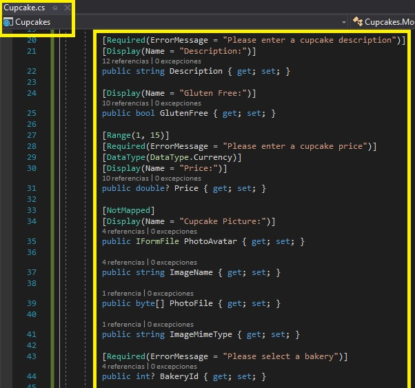

7. En la ventana de **Cupcakes - Microsoft Visual Studio**, en **Solution Explorer**, haz clic con el botón derecho del ratón en **Models**, apunta a **Add**, y luego haz clic en **Class**.

8. En el cuadro de diálogo **Agregar nuevo elemento - Cupcakes**, en el cuadro **Nombre**, escriba **Bakery**, y luego haga clic en **Agregar**.

- La representación visual del codigo del ejercicio se muestra en la siguiente imagen:

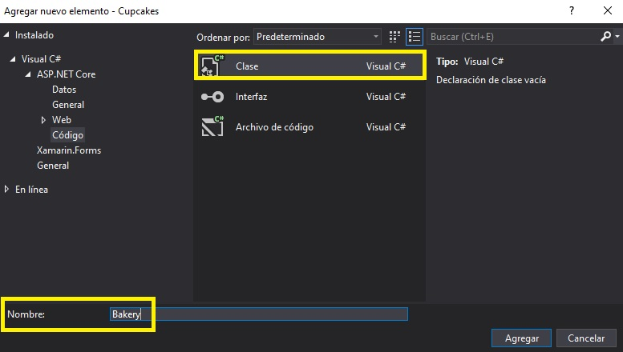 

9. En la ventana de código **Bakery.cs**, localice el siguiente código:
  ```cs
       using System.Threading.Tasks;
  ```
10. Asegúrate de que el cursor está al final del espacio de nombres **System.Threading.Tasks**, presiona Enter, y luego escribe el siguiente código:
  ```cs
       using System.ComponentModel.DataAnnotations;
  ```

11. En el bloque de código **Bakery.cs**, coloque el cursor después del segundo signo **{** (abrazaderas), pulse Intro, y luego escriba el siguiente código:
  ```cs
       [Key]
       public int BakeryId { get; set; }

       [StringLength(50, MinimumLength = 4)]
       public string BakeryName { get; set; }

       [Range(1, 40)]
       public int Quantity { get; set; }

       [StringLength(50, MinimumLength = 4)]
       public string Address { get; set; }

       public virtual ICollection<Cupcake> Cupcakes { get; set; }
  ```

- La representación visual del codigo del ejercicio se muestra en la siguiente imagen:

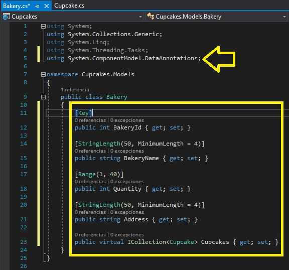

#### Tarea 2: Crear una clase que derive del DbContexto

1. En **Explorador de soluciones**, haga clic con el botón derecho en **Cupcakes**, apunte a **Agregar**, y luego haga clic en **Nueva carpeta**.

2. En el cuadro **Nueva Carpeta**, escriba **Datos**, y luego presione Enter.

3. En la ventana **Cupcakes - Microsoft Visual Studio**, en **Solution Explorer**, haz clic con el botón derecho del ratón en **Datos**, apunta a **Agregar**, y luego haz clic en **Clase**.

4. En el cuadro de diálogo **Agregar nuevo elemento - Cupcakes**, en el cuadro **Nombre**, escriba **CupcakeContext**, y luego haga clic en **Agregar**.

- La representación visual del codigo del ejercicio se muestra en la siguiente imagen:

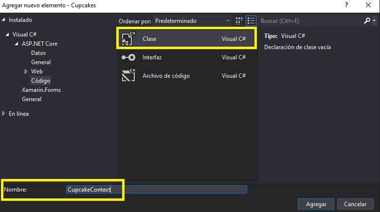 

5. En la ventana de código de **CupcakeContext.cs**, localiza el siguiente código:
  ```cs
      using System.Threading.Tasks;
  ```
6. Asegúrate de que el cursor está al final del espacio de nombres **System.Threading.Tasks**, presiona Enter, y luego escribe el siguiente código:
  ```cs
      using Cupcakes.Models;
      using Microsoft.EntityFrameworkCore;
  ```

7. En la ventana del código **CupcakeContext.cs**, localiza el siguiente código:
  ```cs
      public class CupcakeContext
  ```

8.  Añada el siguiente código a la línea de código existente.
  ```cs
      : DbContext
  ```
9. En el bloque de código **CupcakeContext.cs**, coloque el cursor después del segundo signo **{** (abra abrazaderas), pulse Intro, y luego escriba el siguiente código:

  ```cs
      public CupcakeContext(DbContextOptions<CupcakeContext> options) : base(options)
      {
      }

      public DbSet<Cupcake> Cupcakes { get; set; }
      public DbSet<Bakery> Bakeries { get; set; }
  ```

- La representación visual del codigo del ejercicio se muestra en la siguiente imagen:

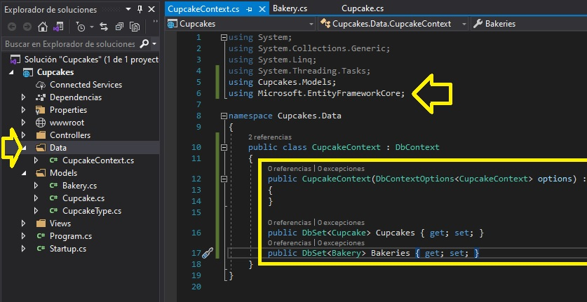

#### Tarea 3: Establecer el núcleo del marco de entidades para usar SQLite

1. En la ventana de **Cupcakes - Microsoft Visual Studio**, en **Solution Explorer**, haga clic con el botón derecho del ratón en **Cupcakes**, y luego seleccione **Manage NuGet Packages**.

2. En el **Gestor de Paquetes NuGet: Cupcakes**, en la ventana **Browse**.

3. En la casilla **Búsqueda**, escribe **Microsoft.EntityFrameworkCore.Sqlite**, y luego pulsa Intro.

4. Haga clic en **Microsoft.EntityFrameworkCore.Sqlit**, seleccione la versión **2.1.0**, y luego haga clic en **Instalar**.

5. Si aparece un cuadro de diálogo **Vista previa de cambios**, haga clic en **OK**.

6. Si aparece un cuadro de diálogo **Aceptación de licencia**, haga clic en **Acepto**.

- La representación visual del codigo del ejercicio se muestra en la siguiente imagen:

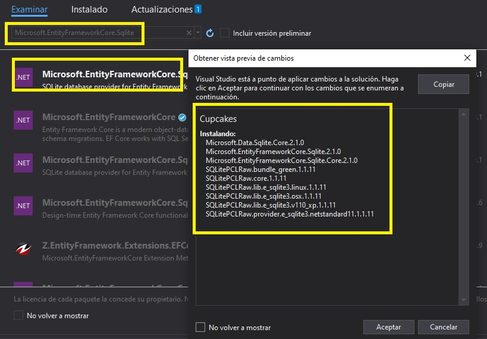

7. Cierre el Administrador de paquetes **NuGet: Cupcakes**.

8. En la ventana **Cupcakes - Microsoft Visual Studio**, en **Solution Explorer**, haz clic en **Startup.cs**.

9. En la ventana del código **Startup.cs**, localiza el siguiente código:
  ```cs
      using Microsoft.Extensions.DependencyInjection;
  ```
10. Asegúrate de que el cursor está al final del espacio de nombres **Microsoft.Extensions.DependencyInjection**, presiona Enter y luego escribe el siguiente código:
  ```cs
      using Microsoft.Extensions.Configuration;
      using Cupcakes.Data;
      using Microsoft.EntityFrameworkCore;  
  ```

11. En la ventana del código **Startup.cs**, localiza el siguiente código:
  ```cs
      public void ConfigureServices(IServiceCollection services)
      
  ```
- La representación visual del codigo del ejercicio se muestra en la siguiente imagen:

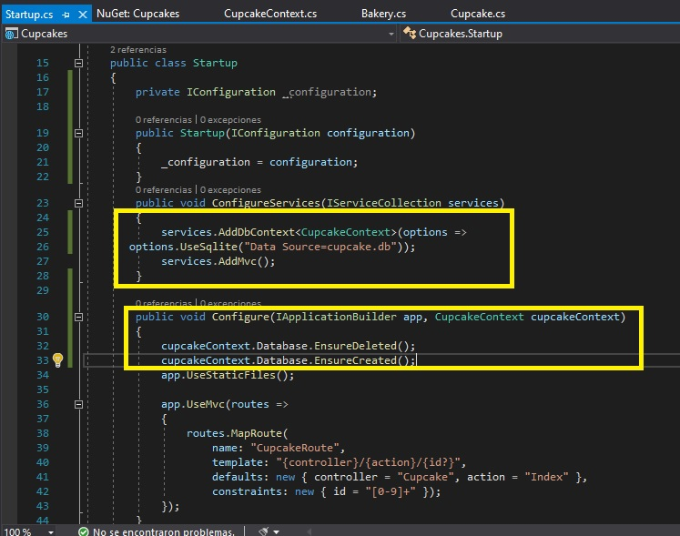

12. Coloca el cursor antes del código localizado, pulsa Intro, pulsa la tecla de flecha arriba, escribe el siguiente código y luego pulsa Intro.
  ```cs
      private IConfiguration _configuration;

      public Startup(IConfiguration configuration)
      {
          _configuration = configuration;
      }
  ```

13. En la ventana del código **Startup.cs**, en el método **ConfigureServices**, coloque el cursor después del signo **{** (abrazaderas), presione Enter, escriba el siguiente código y luego presione Enter.
  ```cs
      services.AddDbContext<CupcakeContext>(options =>
             options.UseSqlite("Data Source=cupcake.db"));
  ```

14. En la ventana del código **Startup.cs**, seleccione el siguiente código:
  ```cs
      public void Configure(IApplicationBuilder app)
  ```
15. Reemplazar el código seleccionado por el siguiente código:
  ```cs
       public void Configure(IApplicationBuilder app, CupcakeContext cupcakeContext)
  ```
   
16. En la ventana del código **Startup.cs**, coloque el cursor después del primer signo **{** (llaves de apertura) del método **Configurar**, pulse Intro, escriba el siguiente código y luego pulse Intro.
  ```cs
      cupcakeContext.Database.EnsureDeleted();
      cupcakeContext.Database.EnsureCreated();
  ```


#### Tarea 4: Usar OnModelCreating para poblar la base de datos

1. En la ventana de **Cupcakes - Microsoft Visual Studio**, en **Solution Explorer**, en **Data**, haga clic en **CupcakeContext.cs**.

2. En la ventana del código **CupcakeContext.cs**, localiza el siguiente código:
  ```cs
      public DbSet<Cupcake> Cupcakes { get; set; }
      public DbSet<Bakery> Bakeries { get; set; }
  ```

3. Ponga el cursor inmediatamente después del último signo **}** (llaves de cierre), presione Enter dos veces, y luego escriba el siguiente código:
  ```cs
      protected override void OnModelCreating(ModelBuilder modelBuilder)
      {
      }
  ```
4. En el bloque de código del método **OnModelCreating**, escriba el siguiente código:
  ```cs
      modelBuilder.Entity<Bakery>().HasData(
          new Bakery
          {
              BakeryId = 1,
              BakeryName = "Gluteus Free",
              Address = "635 Brighton Circle Road",
              Quantity = 8
          },
          new Bakery
          {
              BakeryId = 2,
              BakeryName = "Cupcakes Break",
              Address = "4323 Jerome Avenue",
              Quantity = 22
          },
          new Bakery
          {
              BakeryId = 3,
              BakeryName = "Cupcakes Ahead",
              Address = "2553 Pin Oak Drive",
              Quantity = 18
          },
          new Bakery
          {
              BakeryId = 4,
              BakeryName = "Sugar",
              Address = "1608 Charles Street",
              Quantity = 30
          }
      );
  ```

5. En el bloque de código del método **OnModelCreating**, inmediatamente después del código que acabas de añadir, pulsa Intro, y luego escribe el siguiente código:
  ```cs
      modelBuilder.Entity<Cupcake>().HasData(
          new Cupcake
          {
              CupcakeId = 1,
              CupcakeType = CupcakeType.Birthday,
              Description = "Vanilla cupcake with coconut cream",
              GlutenFree = true,
              Price = 2.5,
              BakeryId = 1,
              ImageMimeType = "image/jpeg",
              ImageName = "birthday-cupcake.jpg"
          },
          new Cupcake
          {
              CupcakeId = 2,
              CupcakeType = CupcakeType.Chocolate,
              Description = "Chocolate cupcake with caramel filling and chocolate butter cream",
              GlutenFree = false,
              Price = 3.2,
              BakeryId = 2,
              ImageMimeType = "image/jpeg",
              ImageName = "chocolate-cupcake.jpg"
          },
          new Cupcake
          {
              CupcakeId = 3,
              CupcakeType = CupcakeType.Strawberry,
              Description = "Chocolate cupcake with straberry cream filling",
              GlutenFree = false,
              Price = 4,
              BakeryId = 3,
              ImageMimeType = "image/jpeg",
              ImageName = "pink-cupcake.jpg"
          },
          new Cupcake
          {
              CupcakeId = 4,
              CupcakeType = CupcakeType.Turquoise,
              Description = "Vanilla cupcake with butter cream",
              GlutenFree = true,
              Price = 1.5,
              BakeryId = 4,
              ImageMimeType = "image/jpeg",
              ImageName = "turquoise-cupcake.jpg"
          }
      );
  ```

>**Resultados**: Después de completar este ejercicio, podrás añadir el núcleo del marco de entidades a la aplicación de la tienda de cupcakes. 

### Ejercicio 2: Usar Entity Framework Core para recuperar y almacenar datos

#### Tarea 1: Crear un repositorio

1. En **Explorador de soluciones**, haga clic con el botón derecho en **Cupcakes**, apunte a **Agregar**, y luego haga clic en **Nueva carpeta**.

2. En la casilla **Nueva Carpeta**, escriba **Repositorios**, y luego presione Enter.

3. En la ventana **Tupcakes - Microsoft Visual Studio**, en **Solution Explorer**, haga clic con el botón derecho del ratón en **Repositorios**, apunte a **Agregar**, y luego haga clic en **Nuevo elemento**.

4. En Navegación, en **Núcleo ASP.NET**, haga clic en **Código**, y luego, en el panel de resultados, haga clic en **Interfaz**.

5. En la casilla **Nombre**, escriba **CupcakeRepository**, y luego haga clic en **Agregar**.

- La representación visual del codigo del ejercicio se muestra en la siguiente imagen:

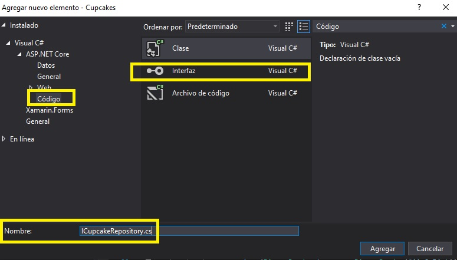

6. En la ventana del código **ICupcakeRepository.cs**, localice el siguiente código:
  ```cs
      using System.Threading.Tasks;
  ```
7. Asegúrate de que el cursor está al final del espacio de nombres **System.Threading.Tasks**, presiona Enter, y luego escribe el siguiente código:
  ```cs
      using Cupcakes.Models;
  ```
8. En la ventana del código **ICupcakeRepository.cs**, seleccione el siguiente código:
  ```cs
    interface ICupcakeRepository
  ```
9. Reemplazar el código seleccionado por el siguiente código:
  ```cs
    public interface ICupcakeRepository
  ```
10. En el bloque de código **ICupcakeRepository.cs**, coloque el cursor después del segundo signo **{** (abrazaderas), pulse Intro, y luego escriba el siguiente código:
  ```cs
      IEnumerable<Cupcake> GetCupcakes();
      Cupcake GetCupcakeById(int id);
      void CreateCupcake(Cupcake cupcake);
      void DeleteCupcake(int id);
      void SaveChanges();
      IQueryable<Bakery> PopulateBakeriesDropDownList();
  ```


11. En la ventana de **Cupcakes - Microsoft Visual Studio**, en **Solution Explorer**, haz clic con el botón derecho del ratón en **Repositorios**, apunta a **Agregar**, y luego haz clic en **Clase**.

12. En el cuadro de diálogo **Agregar nuevo elemento - Cupcakes**, en el cuadro **Nombre**, escribe **Repositorio de cupcakes**, y luego haz clic en **Agregar**.

- La representación visual del codigo del ejercicio se muestra en la siguiente imagen:

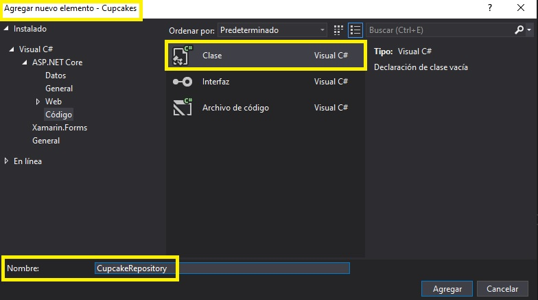

13. En la ventana de código **CupcakeRepository.cs**, localiza el siguiente código:
  ```cs
       using System.Threading.Tasks;
  ```
14. Asegúrate de que el cursor está al final del espacio de nombres **System.Threading.Tasks**, presiona Enter, y luego escribe el siguiente código:
  ```cs
       using System.IO;
       using Cupcakes.Data;
       using Cupcakes.Models;
       using Microsoft.EntityFrameworkCore;
  ```
15. En la ventana del código **CupcakeRepository.cs**, localiza el siguiente código:
  ```cs
      public class CupcakeRepository
  ```
16. Añada el siguiente código a la línea de código existente:
  ```cs
      : ICupcakeRepository
  ```

17. En el bloque de código **CupcakeRepository.cs**, coloque el cursor después del segundo signo **{** (abrazaderas), pulse Intro, y luego escriba el siguiente código:
  ```cs
      private CupcakeContext _context;

      public CupcakeRepository(CupcakeContext context)
      {
          _context = context;
      }
  ```

18. Asegúrate de que el cursor está al final del bloque de código **constructor**, presiona Enter dos veces, y luego escribe el siguiente código:
  ```cs
      public IEnumerable<Cupcake> GetCupcakes()
      {
          return _context.Cupcakes.ToList();
      }
  ```
19. Asegúrate de que el cursor está al final del bloque de código del método **GetCupcakes**, presiona Enter dos veces, y luego escribe el siguiente código:
  ```cs
      public Cupcake GetCupcakeById(int id)
      {
          return _context.Cupcakes.Include(b => b.Bakery)
               .SingleOrDefault(c => c.CupcakeId == id);
      }
  ```

20. Asegúrate de que el cursor está al final del bloque de código del método **GetCupcakeById**, presiona Enter dos veces, y luego escribe el siguiente código:
  ```cs
      public void CreateCupcake(Cupcake cupcake)
      {
         if (cupcake.PhotoAvatar != null && cupcake.PhotoAvatar.Length > 0)
         {
            cupcake.ImageMimeType = cupcake.PhotoAvatar.ContentType;
            cupcake.ImageName = Path.GetFileName(cupcake.PhotoAvatar.FileName);
            using (var memoryStream = new MemoryStream())
            {
                cupcake.PhotoAvatar.CopyTo(memoryStream);
                cupcake.PhotoFile = memoryStream.ToArray();
            }
             _context.Add(cupcake);
            _context.SaveChanges();
         }
      }
  ```

21. Asegúrate de que el cursor está al final del bloque de código del método **CreateCupcake**, presiona Enter dos veces, y luego escribe el siguiente código:
  ```cs
      public void DeleteCupcake(int id)
      {
          var cupcake = _context.Cupcakes.SingleOrDefault(c => c.CupcakeId == id);
          _context.Cupcakes.Remove(cupcake);
          _context.SaveChanges();
      }
  ```

22. Asegúrate de que el cursor está al final del bloque de código del método **BorrarTarta**, pulsa dos veces Intro y luego escribe el siguiente código:
  ```cs
      public void SaveChanges()
      {  
          _context.SaveChanges();
      }         
  ```
23. Asegúrate de que el cursor está al final del bloque de código del método **SaveChanges**, presiona Enter dos veces, y luego escribe el siguiente código:


  ```cs
      public IQueryable<Bakery> PopulateBakeriesDropDownList()
      {
          var bakeriesQuery = from b in _context.Bakeries
                                orderby b.BakeryName
                                select b;
          return bakeriesQuery;
      }
  ```

- La representación visual del codigo del ejercicio se muestra en la siguiente imagen:

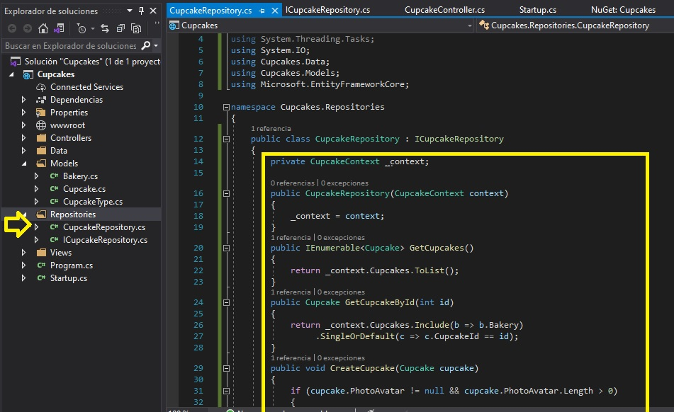

24. En la ventana de **Cupcakes - Microsoft Visual Studio**, en **Solution Explorer**, haga clic en **Startup.cs**.

25. En la ventana del código **Startup.cs**, localiza el siguiente código:
  ```cs
      using Microsoft.EntityFrameworkCore;
  ```

26. Asegúrese de que el cursor esté al final del espacio de nombres **Microsoft.EntityFrameworkCore**, pulse Intro y luego escriba el siguiente código:
  ```cs
      using Cupcakes.Repositories;
  ```

27. En la ventana del código **Startup.cs**, en el método **ConfigureServices**, coloque el cursor después del signo **{** (abrazaderas), presione Enter, escriba el siguiente código y luego presione Enter.
  ```cs
      services.AddTransient<ICupcakeRepository, CupcakeRepository>();
  ```


#### Tarea 2: Actualizar un controlador para usar un repositorio

1. En la ventana de **Cupcakes - Microsoft Visual Studio**, en **Solution Explorer**, expandir **Controladores**, y luego hacer clic en **CupcakeController.cs**.

2. En la ventana del código **CupcakeController.cs**, localice el siguiente código:
  ```cs
      using Microsoft.AspNetCore.Mvc;
  ```
3. Asegúrate de que el cursor está al final del espacio de nombres **Microsoft.AspNetCore.Mvc**, presiona Enter, y luego escribe el siguiente código:
  ```cs
      using Microsoft.AspNetCore.Hosting;
      using Cupcakes.Models;
      using Cupcakes.Repositories;
      using Microsoft.AspNetCore.Mvc.Rendering;
      using Microsoft.EntityFrameworkCore;
  ```
4. En el bloque de código **CupcakeController.cs**, localiza el siguiente código:
  ```cs
      public IActionResult Index()
      {
           return View();
      }
  ```

5. Coloque el cursor antes del código localizado, presione Enter, presione la tecla de flecha hacia arriba, escriba el siguiente código y luego presione Enter.
  ```cs
      private ICupcakeRepository _repository;
      private IHostingEnvironment _environment;

      public CupcakeController(ICupcakeRepository repository, IHostingEnvironment environment)
      {
           _repository = repository;
           _environment = environment;
      }
  ```
 - La representación visual del codigo del ejercicio se muestra en la siguiente imagen:

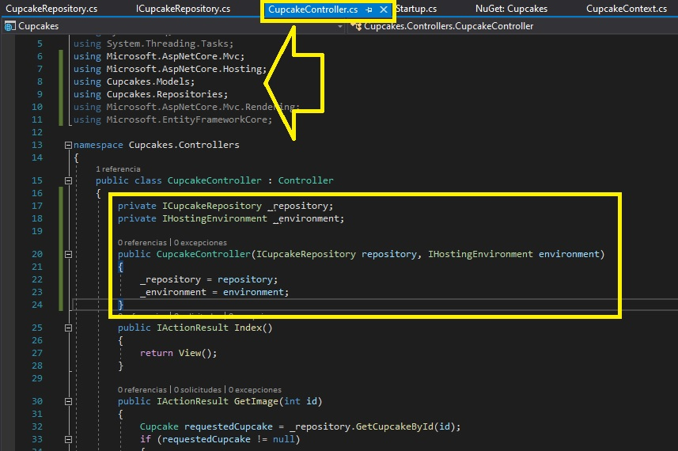

#### Tarea 3: Utilizar el núcleo del marco de entidades para recuperar datos

1. En el bloque de código **CupcakeController.cs**, en el bloque de código de acción **Index**, seleccione el siguiente código:
  ```cs
       return View();
  ```
2. Reemplazar el código seleccionado por el siguiente código:
  ```cs
       return View(_repository.GetCupcakes());
  ```

3. Asegúrate de que el cursor está al final del bloque de código de acción **Index**, presiona Enter dos veces, y luego escribe el siguiente código:
  ```cs
       public IActionResult Details(int id)
       {
       }
  ```
4. En el bloque de código de acción **Detalles**, escriba el siguiente código:
  ```cs
       var cupcake = _repository.GetCupcakeById(id);
       if (cupcake == null)
       {
           return NotFound();
       }
       return View(cupcake);
  ```

5. Asegúrate de que el cursor está al final del bloque de código de acción **Detalles**, pulsa Intro dos veces, y luego escribe el siguiente código:
  ```cs
       private void PopulateBakeriesDropDownList(int? selectedBakery = null)
       {
       }
  ```
6. En el bloque de código del método **PopulateBakeriesDropDownList**, escriba el siguiente código:
  ```cs
       var bakeries = _repository.PopulateBakeriesDropDownList();
       ViewBag.BakeryID = new SelectList(bakeries.AsNoTracking(), "BakeryId", "BakeryName", selectedBakery);
  ```

#### Tarea 4: Manipular los datos utilizando el núcleo del marco de entidades

1. En el bloque de código **CupcakeController.cs**, localiza el siguiente código:
  ```cs
       public IActionResult Details(int id)
       {
            var cupcake = _repository.GetCupcakeById(id);
            if (cupcake == null)
            {
                return NotFound();
            }
            return View(cupcake);
       }
  ```

2. Ponga el cursor al final del código localizado, presione Enter, escriba el siguiente código y luego presione Enter dos veces.
  ```cs
       [HttpGet]
       public IActionResult Create()
       {
       }
  ```

3. En el bloque de código de acción **Crear**, escriba el siguiente código:
  ```cs
       PopulateBakeriesDropDownList();
       return View();
  ```
4. Asegúrate de que el cursor está al final del bloque de código de acción **Crear**, pulsa Intro dos veces, y luego escribe el siguiente código:
  ```cs
       [HttpPost, ActionName("Create")]
       public IActionResult CreatePost(Cupcake cupcake)
       {
       }
  ```

5. En el bloque de código del método **CreatePost**, escriba el siguiente código:

  ```cs
       if (ModelState.IsValid)
       {
            _repository.CreateCupcake(cupcake);
            return RedirectToAction(nameof(Index));
       }
       PopulateBakeriesDropDownList(cupcake.BakeryId);
       return View(cupcake);
  ```


6. Asegúrate de que el cursor está al final del bloque de código del método **CreatePost**, presiona Enter dos veces, y luego escribe el siguiente código:
  ```cs
       [HttpGet]
       public IActionResult Edit(int id)
       {
       }
  ```

7. En el bloque de código de acción **Editar**, escriba el siguiente código:
  ```cs
       Cupcake cupcake = _repository.GetCupcakeById(id);
       if (cupcake == null)
       {
            return NotFound();
       }
       PopulateBakeriesDropDownList(cupcake.BakeryId);
       return View(cupcake);
  ```

8. Asegúrate de que el cursor está al final del bloque de código de acción **Editar**, pulsa Intro dos veces, y luego escribe el siguiente código:
  ```cs
       [HttpPost, ActionName("Edit")]
       public async Task<IActionResult> EditPost(int id)
       {
       }
  ```
9. En el bloque de código del método **EditPost**, escriba el siguiente código:
  ```cs
       var cupcakeToUpdate = _repository.GetCupcakeById(id);
       bool isUpdated = await TryUpdateModelAsync<Cupcake>(
                                cupcakeToUpdate,
                                "",
                                c => c.BakeryId, 
                                c => c.CupcakeType, 
                                c => c.Description, 
                                c => c.GlutenFree,
                                c => c.Price);
       if (isUpdated == true)
       {
            _repository.SaveChanges();
            return RedirectToAction(nameof(Index));
       }
       PopulateBakeriesDropDownList(cupcakeToUpdate.BakeryId);
       return View(cupcakeToUpdate);
  ```

10. Asegúrate de que el cursor está al final del bloque de código de acción **EditPost**, presiona Enter dos veces, y luego escribe el siguiente código:
  ```cs
       [HttpGet]
       public IActionResult Delete(int id)
       {
       }
  ```

11. En el bloque de código del método **Borrar**, escriba el siguiente código:
  ```cs
       var cupcake = _repository.GetCupcakeById(id);
       if (cupcake == null)
       {
            return NotFound();
       }
       return View(cupcake);
  ```

12. Asegúrate de que el cursor está al final del bloque de código de acción **Borrar**, pulsa Intro dos veces, y luego escribe el siguiente código:
  ```cs
       [HttpPost, ActionName("Delete")]
       public IActionResult DeleteConfirmed(int id)
       {
       }
  ```
13. En el bloque de código del método **BorrarConfirmado**, escriba el siguiente código:
  ```cs
       _repository.DeleteCupcake(id);
       return RedirectToAction(nameof(Index));
  ```

#### Tarea 5: Ejecutar la aplicación

1. En la ventana de **Cupcakes - Microsoft Visual Studio**, en el menú **FILE**, haga clic en **Save All**.

2. En el menú **DEBUG**, haga clic en **Iniciar sin depuración**.

 - La representación visual del codigo del ejercicio se muestra en la siguiente imagen:

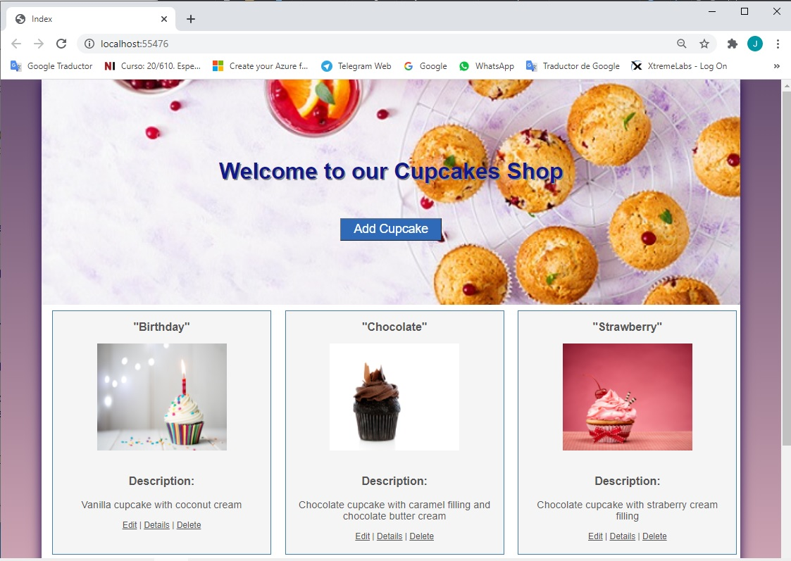

3. En el borde de Microsoft, haz clic en **Agregar Cupcake**.
 
    >**Nota**: El navegador muestra la acción **Crear** dentro del **CupcakesController**.

4. En la página **Añadir un Cupcake a la tienda**, en la lista de **Bakery**, seleccione **&lt;Una Bakery de su elección&gt;**.

5. En la lista de **Tipo de Cupcake**, seleccione **&lt;Un tipo de Cupcake de su elección&gt;**.

6. En la casilla **Descripción**, seleccione **&lt;Una descripción de cupcake de su elección&gt;**.

7. En la casilla **Sin gluten**, marque **&lt;Elegir si el cupcake es un libre de gluten&gt;**.

8. En la casilla **Precio**, marque **&lt;Un precio de cupcake de su elección entre 1 y 15&gt;**.

9. En la casilla **Cupcake Picture**, importa una imagen de **[Repository Root]\Allfiles\Mod07\Labfiles\Image\strawberry-cupcake.jpg**, y luego haz clic en **Submit**.


 - La representación visual del codigo del ejercicio se muestra en la siguiente imagen:

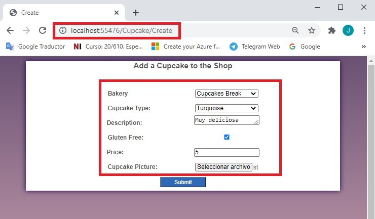

10. En la página de **Bienvenido a nuestra tienda de cupcakes**, verifica los detalles del cupcake recién enviado.

 - La representación visual del codigo del ejercicio se muestra en la siguiente imagen:

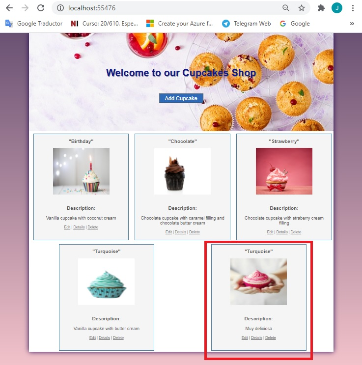

11. Seleccione un cupcake de su elección, y luego haga clic en **Detalles**.

 - La representación visual del codigo del ejercicio se muestra en la siguiente imagen:

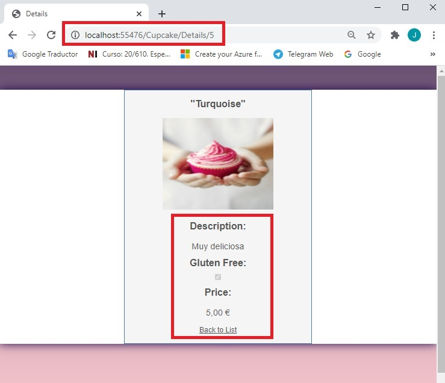

12. Vea los detalles de la Cupcake, y luego haga clic en **Volver a la lista**.

13. En la página **Bienvenido a nuestra tienda de cupcakes**, seleccione un cupcake de su elección, y luego haga clic en **Editar**.

 - La representación visual del codigo del ejercicio se muestra en la siguiente imagen:

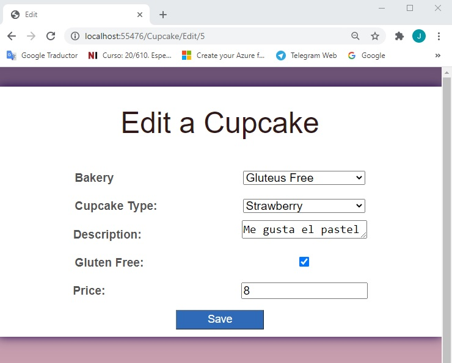

14. En la página **Editar una Cupcake**, en la casilla **Precio**, escriba **&lt;Un precio de Cupcake de su elección entre 1 y 15

15. En la página **Bienvenido a nuestra tienda de cupcakes**, seleccione el cupcake que ha editado, y luego haga clic en **Detalles**.

 - La representación visual del codigo del ejercicio se muestra en la siguiente imagen:

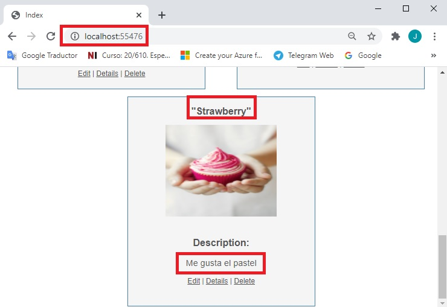

16. En la página **Detalles de la Cupcake**, verifique los detalles de la Cupcake recién editada, y luego haga clic en **Volver a la lista**.

17. En la página de **Bienvenida a nuestra tienda de cupcakes**, seleccione un cupcake de su elección, y luego haga clic en **Borrar**.

 - La representación visual del codigo del ejercicio se muestra en la siguiente imagen:

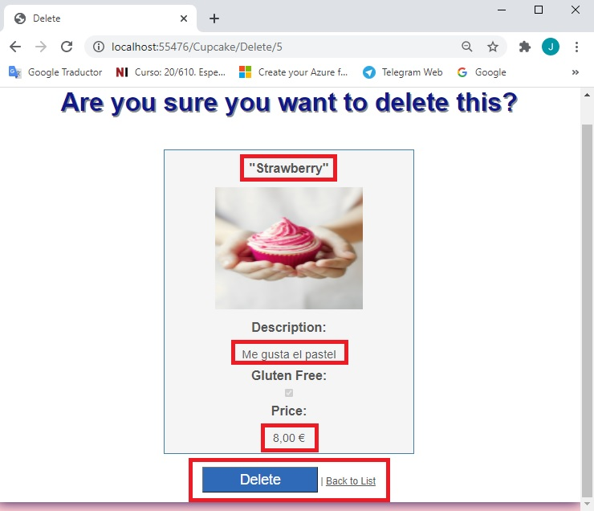

18. En la página de **¿Estás segura de que quieres borrar?**, haz clic en **Borrar**.

19. En la página de **Bienvenida a nuestra tienda de cupcakes**, verifique que el cupcake sea borrado.

 - La representación visual del codigo del ejercicio se muestra en la siguiente imagen:

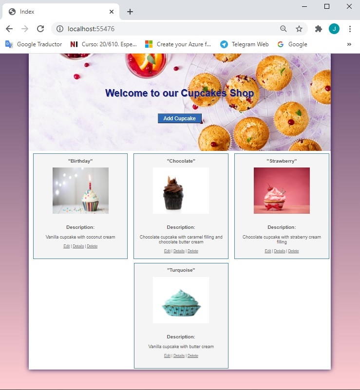

20. En el borde de Microsoft, haz clic en **Cerrar**.

>**Resultados**: Después de completar este ejercicio, podrás usar Entity Framework Core para recuperar y almacenar datos a través de un repositorio en el **CupcakeController**. 

### Ejercicio 3: Usar Entity Framework Core para conectarse a Microsoft SQL Server

#### Tarea 1: Conectarse a un servidor Microsoft SQL Server

1. En la ventana de **Cupcakes - Microsoft Visual Studio**, en **Solution Explorer**, haga clic en **Startup.cs**.

2. En la ventana del código **Startup.cs**, seleccione el siguiente código:

  ```cs
      services.AddDbContext<CupcakeContext>(options =>
                 options.UseSqlite("Data Source=cupcake.db"));
  ```

3. Reemplazar el código seleccionado por el siguiente código:
  ```cs
      string connectionString = "Server=(localdb)\\MSSQLLocalDB;Database=BakeriesDb;Trusted_Connection=True;MultipleActiveResultSets=true";
      services.AddDbContext<CupcakeContext>(options =>
                 options.UseSqlServer(connectionString));
  ```

4. En la ventana del código **Startup.cs**, seleccione el siguiente código:
  ```cs
       public void Configure(IApplicationBuilder app, CupcakeContext cupcakeContext)
  ```
5. Reemplazar el código seleccionado por el siguiente código:
  ```cs
       public void Configure(IApplicationBuilder app)      
  ```

6. En la ventana del código **Startup.cs**, borre el siguiente código:
  ```cs
      cupcakeContext.Database.EnsureDeleted();
      cupcakeContext.Database.EnsureCreated();
  ```

 - La representación visual del codigo del ejercicio se muestra en la siguiente imagen:

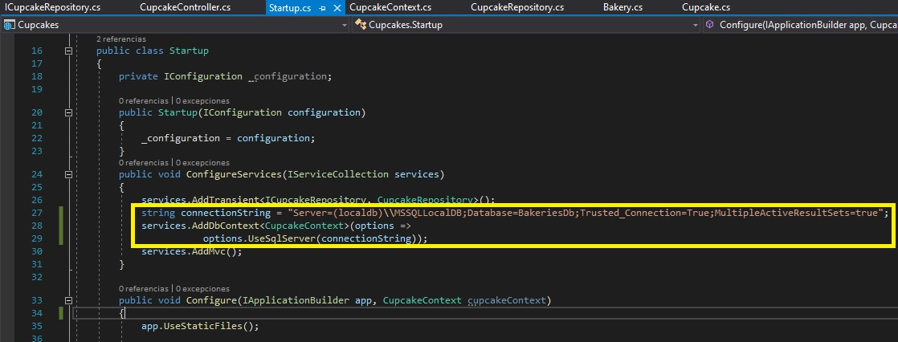

#### Tarea 2: Especificar una cadena de conexión en un archivo de configuración

1. En la ventana de **Cupcakes - Microsoft Visual Studio**, en **Solution Explorer**, haga clic con el botón derecho en **Cupcakes**, apunte a **Add**, y luego haga clic en **New Item**.

2. En el cuadro de diálogo **Agregar nuevo elemento - Cupcakes**, en el panel de navegación, en **Instalado**, haz clic en **Centro ASP.NET**. 3. En el panel de resultados, haga clic en **Archivo de configuración de la aplicación**, y luego haga clic en **Agregar**.

 - La representación visual del codigo del ejercicio se muestra en la siguiente imagen:

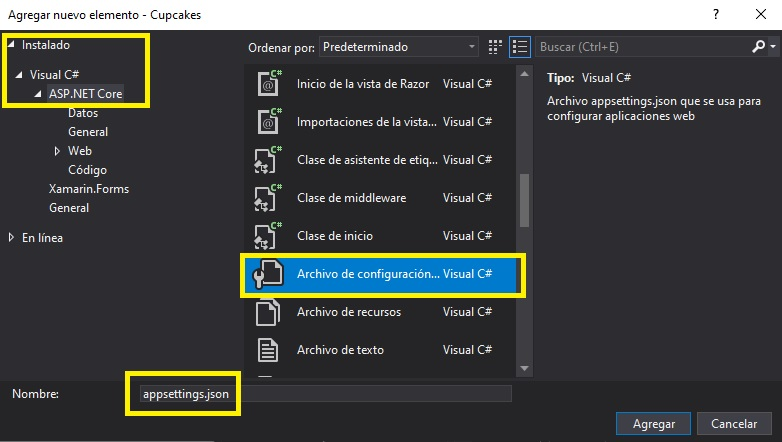

3. En la ventana de código **appsettings.json**, seleccione el siguiente código:
  ```cs
      "DefaultConnection": "Server=(localdb)\\MSSQLLocalDB;Database=_CHANGE_ME;Trusted_Connection=True;MultipleActiveResultSets=true"
  ```

4. Reemplazar el código seleccionado por el siguiente código:
  ```cs
      "DefaultConnection": "Server=(localdb)\\MSSQLLocalDB;Database=BakeriesDb;Trusted_Connection=True;MultipleActiveResultSets=true"
  ``` 

 - La representación visual del codigo del ejercicio se muestra en la siguiente imagen:

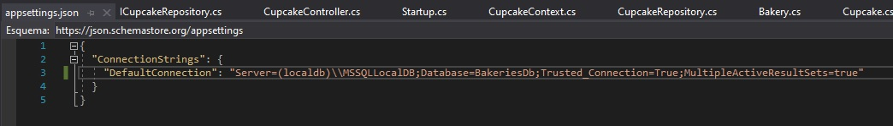

5. En la ventana del código **Startup.cs**, seleccione el siguiente código:
  ```cs
      string connectionString = "Server=(localdb)\\MSSQLLocalDB;Database=BakeriesDb;Trusted_Connection=True;MultipleActiveResultSets=true";
      services.AddDbContext<CupcakeContext>(options =>
                 options.UseSqlServer(connectionString));
  ```
6. Sustituya el código seleccionado por el siguiente código:
  ```cs
      services.AddDbContext<CupcakeContext>(options =>
                 options.UseSqlServer(_configuration.GetConnectionString("DefaultConnection")));
  ```
 - La representación visual del codigo del ejercicio se muestra en la siguiente imagen:

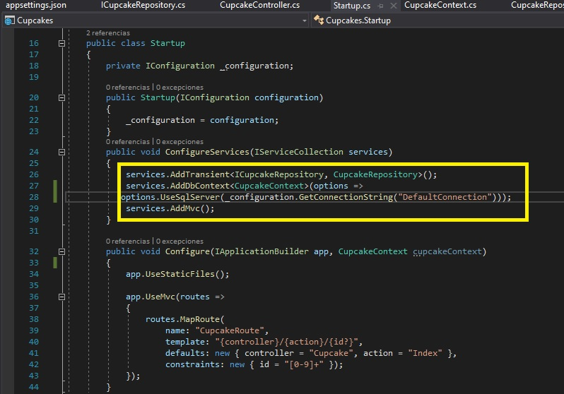

#### Tarea 3: Utilizar Migraciones para crear una base de datos

1. En la ventana **Cupcakes - Microsoft Visual Studio**, en el menú **TOOLS**, apunta a **NuGet Package Manager**, y luego haz clic en **Package Manager Console**.

2. En la pestaña **Package Manager Console**, escriba el siguiente comando y luego presione Enter.
  ```cs
      Add-Migration InitialCreate
  ```
>**Nota**: En **Solution Explorer**, verifica si una nueva carpeta llamada **Migraciones** se crea con múltiples archivos.

 - La representación visual del codigo del ejercicio se muestra en la siguiente imagen:

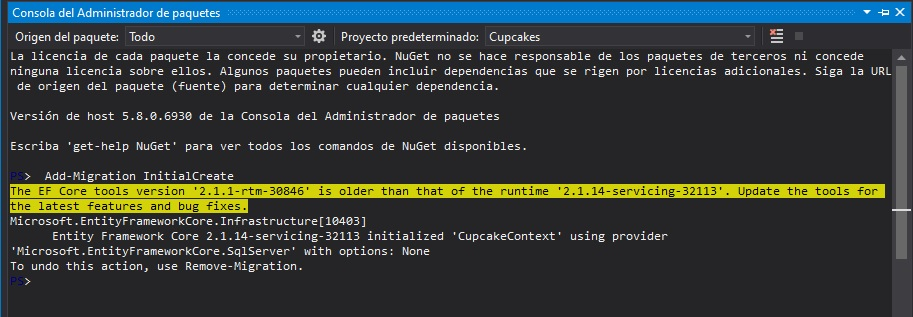

3. En la pestaña **Consola del Administrador de Paquetes**, escriba el siguiente comando y luego presione Enter.
  ```cs
      Update-Database
  ```
 - La representación visual del codigo del ejercicio se muestra en la siguiente imagen:

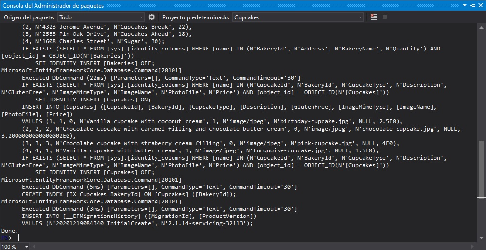

 - La representación visual del codigo del ejercicio se muestra en la siguiente imagen:

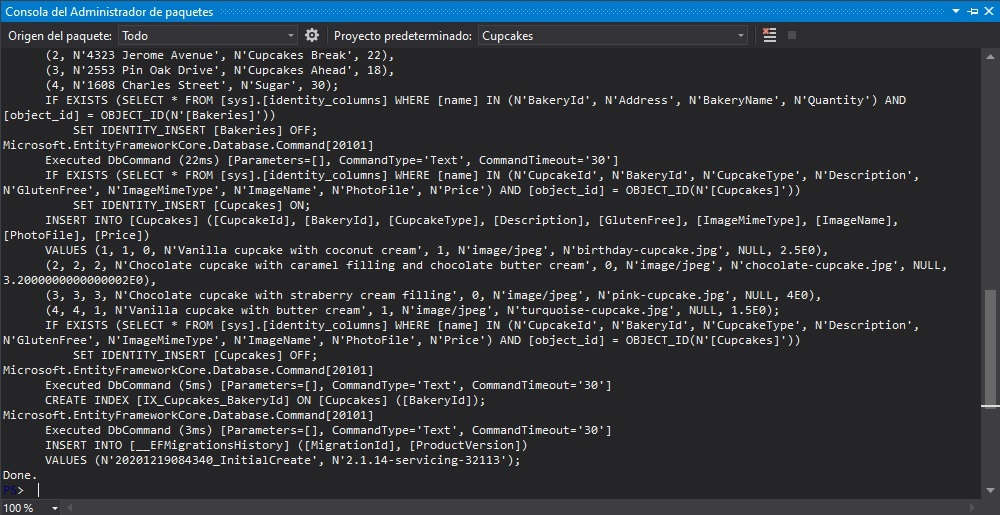

4. En la ventana **Cupcakes - Microsoft Visual Studio**, en el menú **VIEW**, haga clic en **SQL Server Object Explorer**.

5. En **SQL Server Object Explorer**, expandir **(localdb)\MSSQLLocalDB**, expandir **Bases de datos**, y luego expandir **BakeriesDb**.

>**Nota**: Ver las tablas de **BakeriesDb**.

 - La representación visual del codigo del ejercicio se muestra en la siguiente imagen:

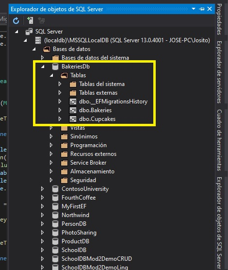


#### Tarea 4: Ejecutar la aplicación

1. En la ventana de **Cupcakes - Microsoft Visual Studio**, en el menú **FILE**, haga clic en **Save All**.

2. En el menú **DEBUG**, haga clic en **Iniciar sin depuración**.

 - La representación visual del codigo del ejercicio se muestra en la siguiente imagen:

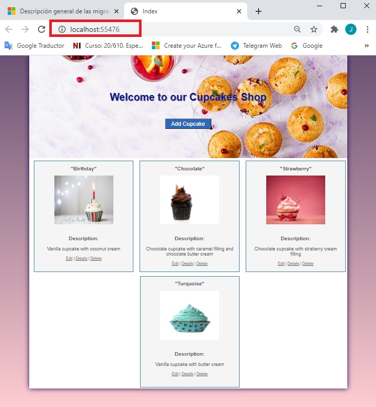

3. En el borde de Microsoft, haz clic en **Agregar Cupcake**.
 
    >**Nota**: El navegador muestra la acción **Crear** dentro del **CupcakesController**.

4. En la página **Añadir un Cupcake a la tienda**, en la lista de **Bakery**, seleccione **&lt;Una Bakery de su elección&gt;**.

5. En la lista de **Tipo de Cupcake**, seleccione **&lt;Un tipo de Cupcake de su elección&gt;**.

6. En la casilla **Descripción**, seleccione **&lt;Una descripción de cupcake de su elección&gt;**.

7. En la casilla **Sin gluten**, marque **&lt;Elegir si el cupcake es un libre de gluten&gt;**.

8. En la casilla **Precio**, marque **&lt;Un precio de cupcake de su elección entre 1 y 15&gt;**.

 - La representación visual del codigo del ejercicio se muestra en la siguiente imagen:

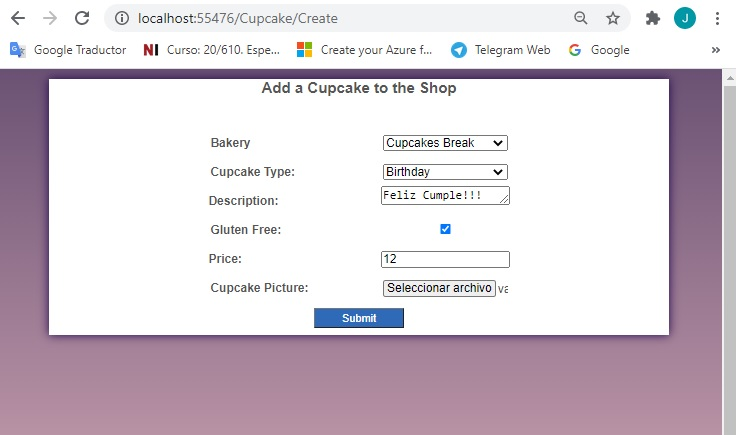

9. En la casilla **Cupcake Picture**, importa una imagen de **[Repository Root]\Allfiles\Mod07\Labfiles\Image\strawberry-cupcake.jpg**, y luego haz clic en **Submit**.

10. En la página de **Bienvenido a nuestra tienda de cupcakes**, verifica los detalles del cupcake recién enviado.

 - La representación visual del codigo del ejercicio se muestra en la siguiente imagen:

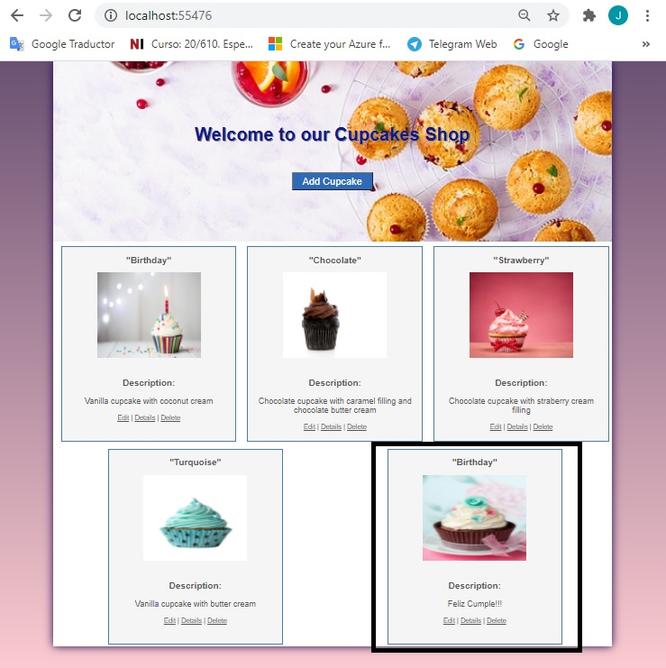

11. Seleccione un cupcake de su elección, y luego haga clic en **Detalles**.

12. Vea los detalles de la Cupcake, y luego haga clic en **Volver a la lista**.

 - La representación visual del codigo del ejercicio se muestra en la siguiente imagen:

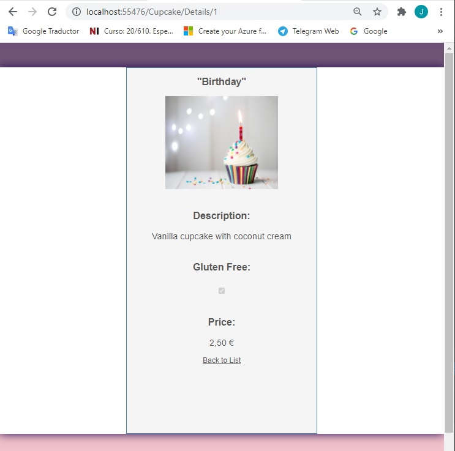

13. En la página **Bienvenido a nuestra tienda de cupcakes**, seleccione un cupcake de su elección, y luego haga clic en **Editar**.

 - La representación visual del codigo del ejercicio se muestra en la siguiente imagen:

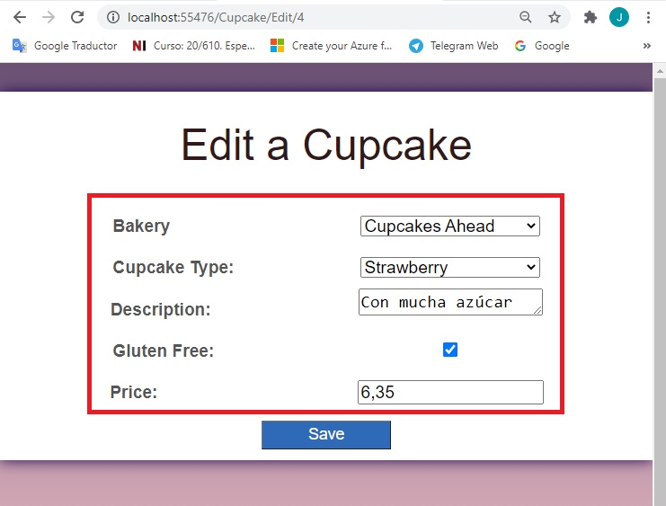

14. En la página **Editar una Cupcake**, en la casilla **Precio**, escriba **&lt;Un precio de Cupcake de su elección entre 1 y 15&gt;** haz clic en **Save**.

 - La representación visual del codigo del ejercicio se muestra en la siguiente imagen:

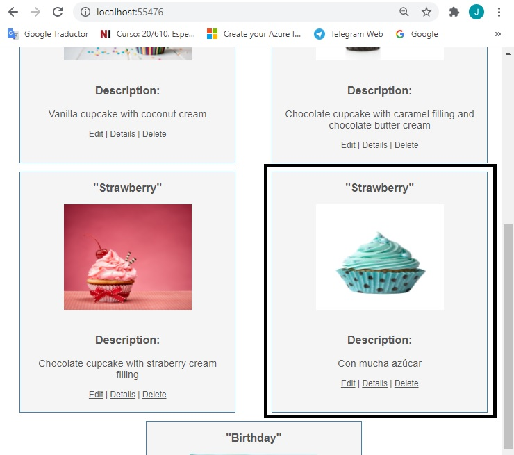

15. En la página **Bienvenido a nuestra tienda de cupcakes**, seleccione el cupcake que ha editado, y luego haga clic en **Detalles**.

16. En la página **Detalles de la Cupcake**, verifique los detalles de la Cupcake recién editada, y luego haga clic en **Volver a la lista**.

 - La representación visual del codigo del ejercicio se muestra en la siguiente imagen:

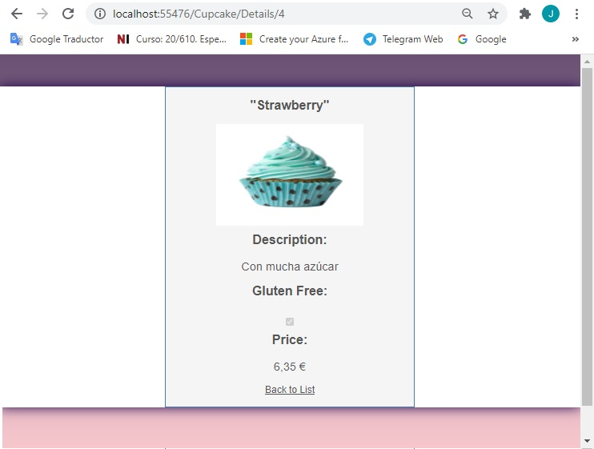

17. En la página de **Bienvenida a nuestra tienda de cupcakes**, seleccione un cupcake de su elección, y luego haga clic en **Borrar**.

 - La representación visual del codigo del ejercicio se muestra en la siguiente imagen:

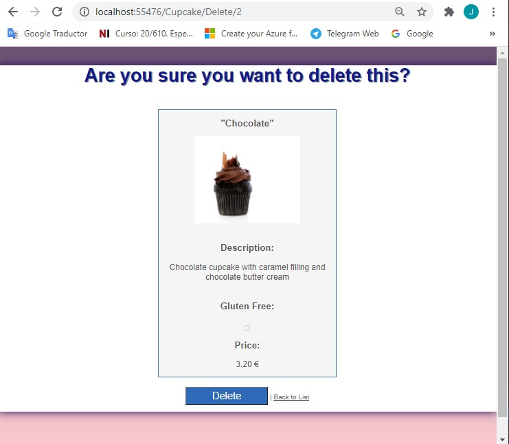

18. En la página de **¿Estás segura de que quieres borrar?**, haz clic en **Borrar**.

19. En la página de **Bienvenida a nuestra tienda de cupcakes**, verifique que el cupcake sea borrado.

 - La representación visual del codigo del ejercicio se muestra en la siguiente imagen:

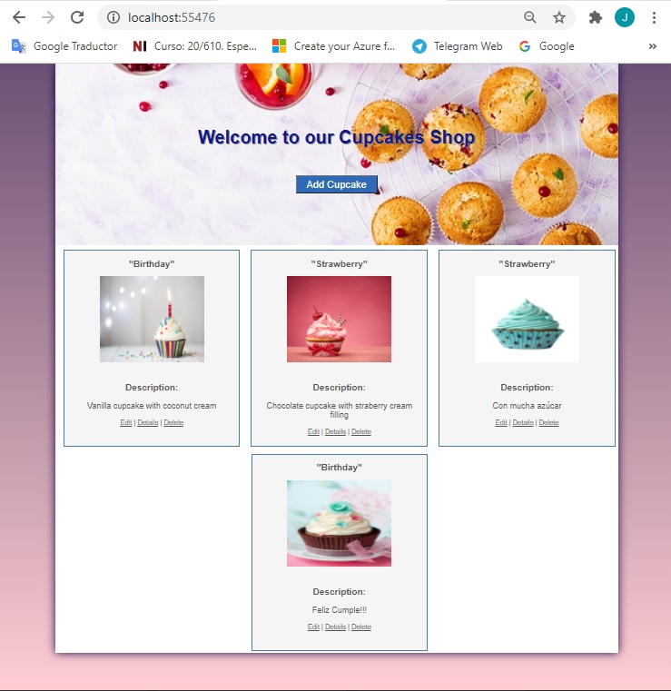

20. En Microsoft Edge, haga clic en **Cerrar**.

#### Tarea 5: Usar Migraciones para actualizar el esquema de la base de datos 

1. En la ventana de **Cupcakes - Microsoft Visual Studio**, en **Solution Explorer**, en **Models**, haga clic en **Cupcake.cs**.

2. En la ventana del código de **Cupcake.cs**, localiza el siguiente código:
  ```cs
      [Display(Name = "Gluten Free:")]
      public bool GlutenFree { get; set; }
  ```
3. Ponga el cursor al final del código localizado, presione dos veces la tecla Enter y luego escriba el siguiente código:
  ```cs
      [Display(Name = "Caloric Value:")]
      public int CaloricValue { get; set; }
  ```
4. En la ventana de **Cupcakes - Microsoft Visual Studio**, en **Solution Explorer**, en **Data**, haga clic en **CupcakeContext.cs**.

 - La representación visual del codigo del ejercicio se muestra en la siguiente imagen:

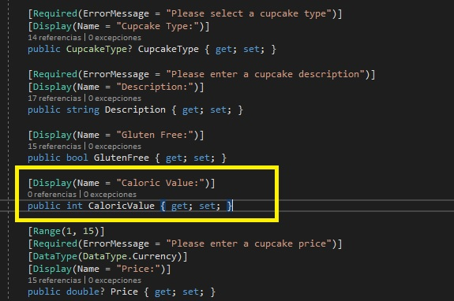

5. En la ventana de código **CupcakeContext.cs**, en el bloque de código del método **OnModelCreating**, seleccione el siguiente código:
  ```cs
      ImageName = "birthday-cupcake.jpg"
  ```
6. Sustituya el código seleccionado por el siguiente código:
  ```cs
      ImageName = "birthday-cupcake.jpg",
      CaloricValue = 355
  ```

7. En el bloque de código del método **OnModelCreating**, seleccione el siguiente código:
  ```cs
      ImageName = "chocolate-cupcake.jpg"
  ```

8. Reemplazar el código seleccionado por el siguiente código:
  ```cs
      ImageName = "chocolate-cupcake.jpg",
      CaloricValue = 195
  ```

9. En el bloque de código del método **OnModelCreating**, seleccione el siguiente código:
  ```cs
      ImageName = "pink-cupcake.jpg"
  ```

10. Reemplace el código seleccionado por el siguiente código:
  ```cs
      ImageName = "pink-cupcake.jpg",
      CaloricValue = 295
  ```
11. En el bloque de código del método **OnModelCreating**, seleccione el siguiente código:
  ```cs
      ImageName = "turquoise-cupcake.jpg"
  ```

12. Reemplazar el código seleccionado por el siguiente código:
  ```cs
      ImageName = "turquoise-cupcake.jpg",
      CaloricValue = 360
  ```


 - La representación visual del codigo del ejercicio se muestra en la siguiente imagen:

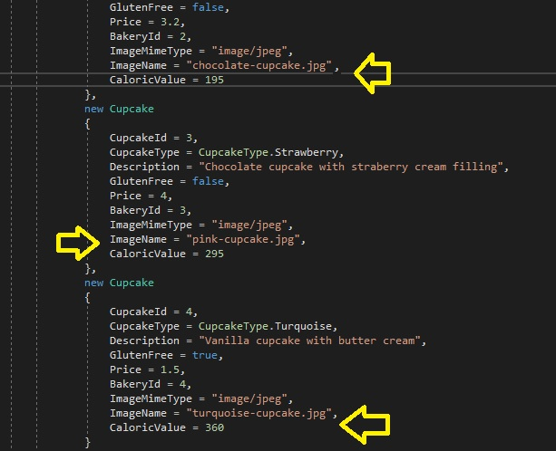

13. En la ventana de **Cupcakes - Microsoft Visual Studio**, en **Solution Explorer**, expandir **Views**, expandir **Cupcake**, y luego hacer clic en **Details.cshtml**.

14. En la ventana de código **Details.cshtml**, localice el siguiente código:
  ```cs
      <div>
          <p class="display-label">
                @Html.DisplayNameFor(model => model.Price)
          </p>
          <p class="display-field">
                @Html.DisplayFor(model => model.Price)
          </p>
      </div>
  ```
15. Coloque el cursor después del signo **>** (mayor que) de la etiqueta **&lt;/div&gt;**, presione Enter y luego escriba el siguiente código:
  ```cs
      <div>
          <p class="display-label">
                @Html.DisplayNameFor(model => model.CaloricValue)
          </p>
          <p class="display-field">
                @Html.DisplayFor(model => model.CaloricValue)
          </p>
      </div>
  ```

 - La representación visual del codigo del ejercicio se muestra en la siguiente imagen:

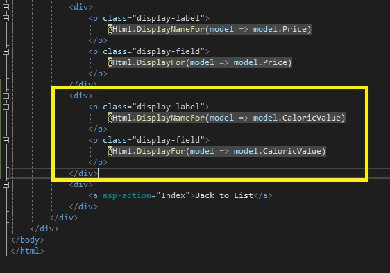

16. En la ventana de **Cupcakes - Microsoft Visual Studio**, en **Solution Explorer**, en **Views**, en **Cupcake**, haga clic en **Edit.cshtml**.

17. En la ventana de **Edit.cshtml** código, localiza el siguiente código:
  ```cs
      <div class="form-field">
          <label asp-for="Price"></label>
          <input asp-for="Price" />
          <span asp-validation-for="Price"></span>
      </div>
  ```
18. Coloque el cursor después del signo **>** (mayor que) de la etiqueta **&lt;/div&gt;**, presione Enter y luego escriba el siguiente código:
  ```cs
      <div class="form-field">
          <label asp-for="CaloricValue"></label>
          <input asp-for="CaloricValue" />
          <span asp-validation-for="CaloricValue"></span>
      </div>
  ```

 - La representación visual del codigo del ejercicio se muestra en la siguiente imagen:

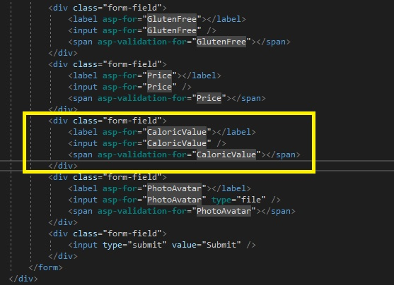


19. En la ventana de **Cupcakes - Microsoft Visual Studio**, en **Solution Explorer**, en **Views**, en **Cupcake**, haga clic en **Create.cshtml**.

20. En la ventana de **Create.cshtml** código, localiza el siguiente código:
  ```cs
      <div class="form-field">
          <label asp-for="Price"></label>
          <input asp-for="Price" />
          <span asp-validation-for="Price"></span>
      </div>
  ```
21. Coloque el cursor después del signo **>** (mayor que) de la etiqueta **&lt;/div&gt;**, pulse Intro y luego escriba el siguiente código:
  ```cs
      <div class="form-field">
          <label asp-for="CaloricValue"></label>
          <input asp-for="CaloricValue" />
          <span asp-validation-for="CaloricValue"></span>
      </div>
  ```

22. En la ventana de **Cupcakes - Microsoft Visual Studio**, en el menú **TOOLS**, apunta a **NuGet Package Manager**, y luego haz clic en **Package Manager Console**.


23. En la pestaña **Package Manager Console**, escriba el siguiente comando y luego presione Enter.
  ```cs
      Add-Migration AddCupcakeCaloricValue
  ```
>**Nota**: En **Solution Explorer**, en **Migraciones**, verifica si se crea un nuevo archivo.

 - La representación visual del codigo del ejercicio se muestra en la siguiente imagen:

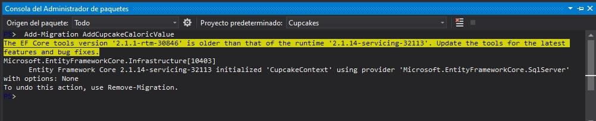


 - La representación visual del codigo del ejercicio se muestra en la siguiente imagen:

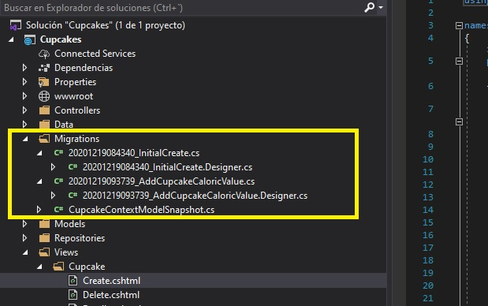

24. En la pestaña **Package Manager Console**, escriba el siguiente comando y luego presione Enter.
  ```cs
      Update-Database
  ```

 - La representación visual del codigo del ejercicio se muestra en la siguiente imagen:

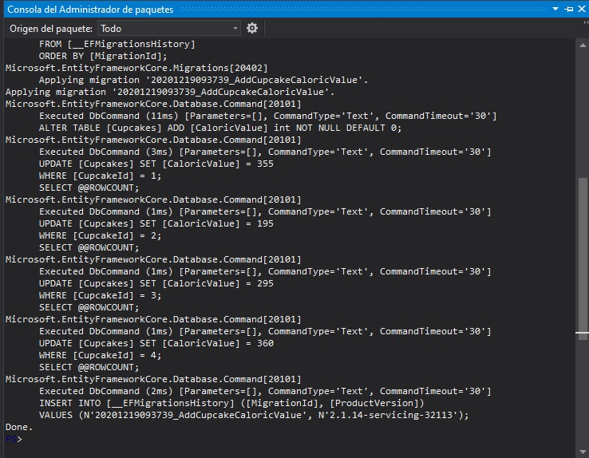

#### Tarea 6: Ejecutar la aplicación

1. En la ventana de **Cupcakes - Microsoft Visual Studio**, en el menú **FILE**, haga clic en **Save All**.

2. En el menú **DEBUG**, haga clic en **Iniciar sin depuración**.

3. Selecciona un cupcake de tu elección, y luego haz clic en **Detalles**.

    >**Nota**: El navegador muestra el valor calórico de la Cupcake. 

 - La representación visual del codigo del ejercicio se muestra en la siguiente imagen:

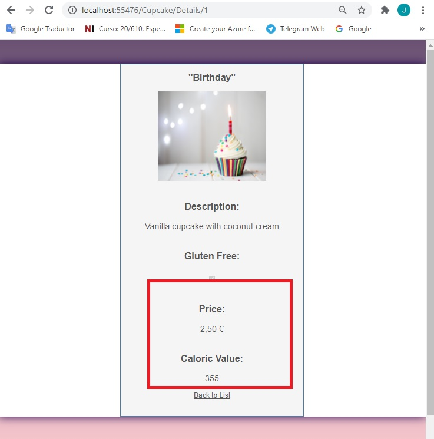

#### Tarea 6: Ejecutar la aplicación

4. Ver los detalles de la Cupcake y luego hacer clic en **Volver a la lista**.

5. En Microsoft Edge, haz clic en **Cerrar**.

6. En la ventana de **Cupcakes - Microsoft Visual Studio**, en el menú **Archivo**, haga clic en **Salir**.

>**Resultados**: Después de completar este ejercicio, deberías haber creado una aplicación de tienda de cupcakes en la que los usuarios puedan agregar un nuevo cupcake, editar un cupcake, borrar un cupcake y ver los detalles de un cupcake.


