# Módulo 8: Usando diseños, CSS y JavaScript en ASP.NET Core MVC


Fichero de Instrucciones: Instructions\20483C_MOD08_DEMO.md

Entregar el url de GitHub con la solución y un readme con las siguiente información:

1. **Nombres y apellidos:** José René Fuentes Cortez
2. **Fecha:** 24 de Noviembre 2020.
3. **Resumen del Modulo 8:** Este módulo consta de tres ejercicios:
    -  En el primer ejercio usamos layouts para vincularlos con vistas en el modelo MVCde ASP.NET Core.
    - En el ejercicio 2 la práctica nos ayuda a aplicar estilos CSS y JavaScript, además de agregar las librerias por medio de 'npm'.
    - En el tercer ejercicio hacemos uso de JQuery para modificar los elementos HTML.


4. **Dificultad o problemas presentados y como se resolvieron:** Ninguna.

**NOTA**: Si no hay descripcion de problemas o dificultades, y al yo descargar el código para realizar la comprobacion y el código no funcionar, el resultado de la califaciación del laboratorio será afectado.

---

Siempre que la ruta a un archivo comience con *[Raíz del repositorio]*, reemplácela con la ruta absoluta a la carpeta en la que reside el repositorio 20486. Por ejemplo, si clonó o extrajo el repositorio 20486 en **C:\Users\John Doe\Downloads\20486**, cambiar el camino a: **[Repository Root]\AllFiles\20486D\Mod01** al **C:\Users\John Doe\Downloads\20486\AllFiles\20486D\Mod01**

# Lección 1: Usando diseños

### Demonstration: Cómo crear un diseño y vincularlo a una vista

#### Pasos de preparación 

Asegúrese de haber clonado el directorio **20486D** de GitHub. Contiene los segmentos de código para los laboratorios y demostraciones de este curso.
**(https://github.com/MicrosoftLearning/20486D-DevelopingASPNETMVCWebApplications/tree/master/Allfiles)**


#### Pasos de demostración


1. Navega hasta **[Repository Root]\Allfiles\Mod08\Democode\01_LayoutExample_begin** y luego haga doble clic en **LayoutExample.sln**.

> ** Nota **: Si aparece un cuadro de diálogo ** Advertencia de seguridad para el sitio web de productos **, verifique que la casilla de verificación ** Preguntarme por cada proyecto en esta solución ** esté desactivada y luego haga clic en ** Aceptar **.


2. En la ventana **Ejemplo de diseño - Microsoft Visual Studio**, en el Explorador de soluciones, haga clic con el botón derecho del ratón en **Vistas**, apunte a **Agregar**, y luego haga clic en **Nuevo elemento**.

3. En el cuadro de diálogo **Agregar nuevo elemento - Ejemplo de diseño**, en el panel de navegación, en **Instalado**, amplíe **Núcleo ASP.NET**, y luego haga clic en **Web**.

4. En el cuadro de diálogo **Agregar nuevo elemento - Ejemplo de diseño**, en el panel de resultados, haga clic en **Inicio de la Razor view**, y luego haga clic en **Agregar**.

5. En la ventana **Ejemplo de diseño - Microsoft Visual Studio**, en el Explorador de soluciones, haga clic con el botón derecho del ratón en **Vistas**, apunte a **Agregar** y, a continuación, haga clic en **Nueva carpeta**.

6. En el cuadro **Nueva Carpeta**, escriba **Shared**, y luego presione Enter.

7. En la ventana **Ejemplo de diseño - Microsoft Visual Studio**, en el Explorador de soluciones, en **Vistas**, haga clic con el botón derecho del ratón en **Shared**, apunte a **Añadir**, y luego haga clic en **Nuevo elemento**.

- La representación visual del codigo del ejercicio se muestra en la siguiente imagen:

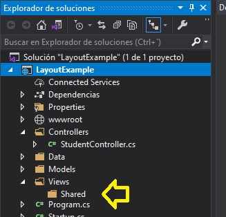

8. En el cuadro de diálogo **Agregar nuevo elemento - LayoutExample**, en el panel de navegación, en **Instalado**, expanda **ASP.NET Core**, y luego haga clic en **Web**.

9. En el cuadro de diálogo **Agregar nuevo elemento - Ejemplo de diseño**, en el panel de resultados, haga clic en **Diseño de la afeitadora**, y luego haga clic en **Agregar**.

10. En el archivo **_Layout.cshtml**, busque el siguiente código:
  ```cs
       <title>@ViewBag.Title</title>
  ```

11. Coloque el cursor después del signo **>** (mayor que) de la etiqueta **&lt;/título**, pulse Intro y luego escriba el siguiente código: 
  ```cs
       <link type="text/css" rel="stylesheet" href="~/css/style-layout-example.css" />
  ```

12. En el archivo **_Layout.cshtml**, localice el siguiente código:
  ```cs
       <div>
           @RenderBody()
       </div>
  ```

13. Coloque el cursor antes del signo **<** (menos de) de la etiqueta **&lt;div&gt;**, pulse Intro, pulse la tecla de flecha hacia arriba y escriba el siguiente código:
  ```cs
       <h1>Welcome to the University</h1>
  ```

14. En el archivo **_Layout.cshtml**, localice el siguiente código:
  ```cs
       <div>
           @RenderBody()
       </div>
  ```

15. Coloque el cursor después del signo **>** (mayor que) de la etiqueta **&lt;/div...**, presione Enter y luego escriba el siguiente código: 
  ```cs
      @RenderSection("footer", false)
  ```

- La representación visual del codigo del ejercicio se muestra en la siguiente imagen:

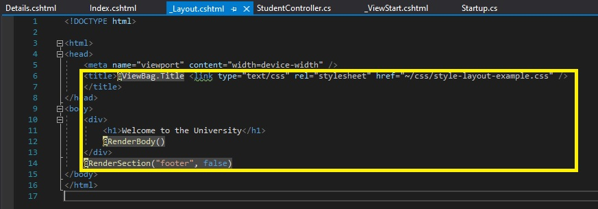

16. En el Explorador de soluciones, amplíe **Controllers**, y luego haga clic en **StudentController.cs**.

17. En la ventana de código **StudentController.cs**, haga clic con el botón derecho del ratón en el siguiente código y luego haga clic en **Add View**.
  ```cs
       public IActionResult Index()
  ```

18. En el cuadro de diálogo **Añadir vista de MVC**, asegúrese de que el valor en el cuadro **Nombre de la vista** es **Index**.  

19. En el cuadro de diálogo **Add View MVC**, asegúrese de que la plantilla **Vacío (sin modelo)** esté seleccionada.

20. En el cuadro de diálogo **Add View MVC**, asegúrese de que la casilla de verificación **Crear como una vista parcial** está desactivada y la casilla de verificación **Utilizar una página de diseño** está seleccionada y, a continuación, haga clic en **Agregar**.

- La representación visual del codigo del ejercicio se muestra en la siguiente imagen:

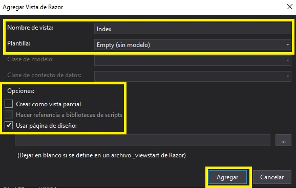 

21. En la ventana de código **Index.cshtml**, coloque el cursor al principio del documento, escriba el siguiente código y, a continuación, pulse Intro.
  ```cs
       @model IEnumerable<Student>
  ```
22. En la ventana del código **Index.cshtml**, seleccione el siguiente código:
  ```cs
       <h2>Index</h2>
  ```

23. Sustituya el código seleccionado por el siguiente código:

  ```cs
       <h2>Students list</h2>
       <div>
           <table class="table">
               <thead>
                   <tr>
                       <th>
                           @Html.DisplayNameFor(model => model.FirstName)
                       </th>
                       <th>
                           @Html.DisplayNameFor(model => model.LastName)
                       </th>
                       <th></th>
                   </tr>
               </thead>
               <tbody>
                   @foreach (var item in Model)
                   {
                       <tr>
                           <td>
                                @Html.DisplayFor(modelItem => item.FirstName)
                           </td>
                           <td>
                                @Html.DisplayFor(modelItem => item.LastName)
                           </td>
                           <td>
                                <a asp-action="Details" asp-route-id="@item.StudentId">Details</a>
                           </td>
                       </tr>
                   }
               </tbody>
           </table>
       </div>
  ```

- La representación visual del codigo del ejercicio se muestra en la siguiente imagen:

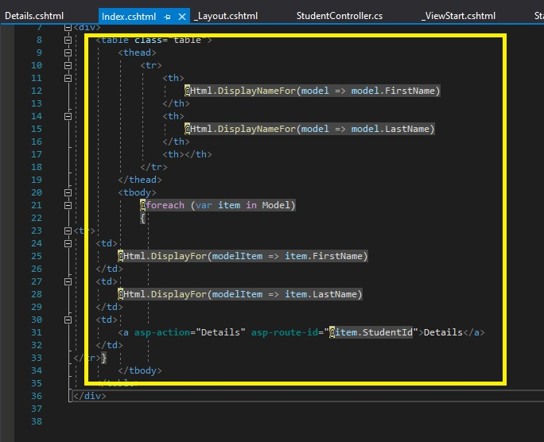

24. En el Explorador de soluciones, en **Controllers**, haga clic en **StudentController.cs**.

25. En la ventana del código **StudentController.cs**, haga clic con el botón derecho del ratón en el siguiente código y luego haga clic en **Add View**.
  ```cs
       public IActionResult Details(int? id)
  ```

26. En el cuadro de diálogo **Añadir vista de MVC**, asegúrese de que el valor en el cuadro **Nombre de la vista** es **Details**.  

27. En el cuadro de diálogo **Add View MVC**, asegúrese de que la plantilla **Vacío (sin modelo)** esté seleccionada.

28. En el cuadro de diálogo **Add View MVC**, asegúrese de que la casilla de verificación **Crear como una vista parcial** está desactivada y la casilla de verificación **Utilizar una página de diseño** está seleccionada y, a continuación, haga clic en **Agregar**.

29. En la ventana de código **Details.cshtml**, coloque el cursor al principio del documento, escriba el siguiente código y, a continuación, pulse Intro.
  ```cs
       @model Student
  ```

30. En la ventana del código **Details.cshtml**, seleccione el siguiente código:
  ```cs
       <h2>Details</h2>
  ```

31. Sustituya el código seleccionado por el siguiente código: 
  ```cs
       @section footer {
            <div>
                <a asp-action="Index">Back to List</a>
            </div>
       }
  ```

32. En la ventana del código **Details.cshtml**, localice el siguiente código:
  ```cs
       @section footer {
            <div>
                <a asp-action="Index">Back to List</a>
            </div>
       }
  ```

33. Ponga el cursor después del signo **}** (corchete de cierre), presione Enter dos veces, y luego escriba el siguiente código: 
  ```cs
       <h2>Student details</h2>

       <div>
            <dl>
                <dt>
                    @Html.DisplayNameFor(model => model.FirstName)
                </dt>
                <dd>
                    @Html.DisplayFor(model => model.FirstName)
                </dd>
                <dt>
                    @Html.DisplayNameFor(model => model.LastName)
                </dt>
                <dd>
                    @Html.DisplayFor(model => model.LastName)
                </dd>
                <dt>
                    @Html.DisplayNameFor(model => model.Birthdate)
                </dt>
                <dd>
                    @Html.DisplayFor(model => model.Birthdate)
                </dd>
                <dt>
                    @Html.DisplayNameFor(model => model.City)
                </dt>
                <dd>
                    @Html.DisplayFor(model => model.City)
                </dd>
                <dt>
                    @Html.DisplayNameFor(model => model.Address)
                </dt>
                <dd>
                    @Html.DisplayFor(model => model.Address)
                </dd>
                <dt>
                    @Html.DisplayNameFor(model => model.Course)
                </dt>
                <dd>
                    @Html.DisplayFor(model => model.Course)
                </dd>
                <dt>
                    @Html.DisplayNameFor(model => model.StartedUniversityDate)
                </dt>
                <dd>
                    @Html.DisplayFor(model => model.StartedUniversityDate)
                </dd>
            </dl>
       </div>
   ```

- La representación visual del codigo del ejercicio se muestra en la siguiente imagen:

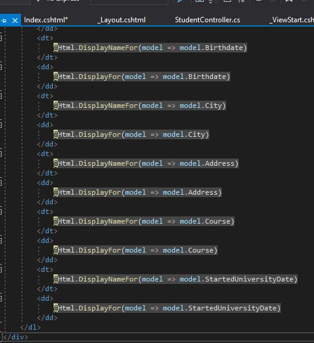

34. En la ventana **Ejemplo de diseño - Microsoft Visual Studio**, en el menú **Archivo**, haga clic en **Guardar todo**.

35. En la ventana **Ejemplo de diseño - Microsoft Visual Studio**, en el menú **DEBUG**, haga clic en **Iniciar sin depuración**.

   > **Nota**: El navegador muestra el archivo **Index.cshtml** combinado con el archivo **_Layout.cshtml**.

- La representación visual del codigo del ejercicio se muestra en la siguiente imagen:

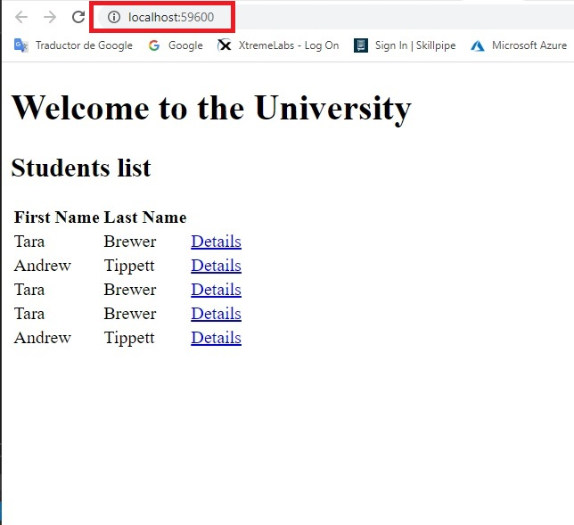

36. En la página **Bienvenido a la Universidad**, seleccione un estudiante de su elección, y luego haga clic en **Details**.

37. En la página **Details del estudiante**, examine los Details del estudiante, y luego haga clic en **Volver a la lista**.

- La representación visual del codigo del ejercicio se muestra en la siguiente imagen:

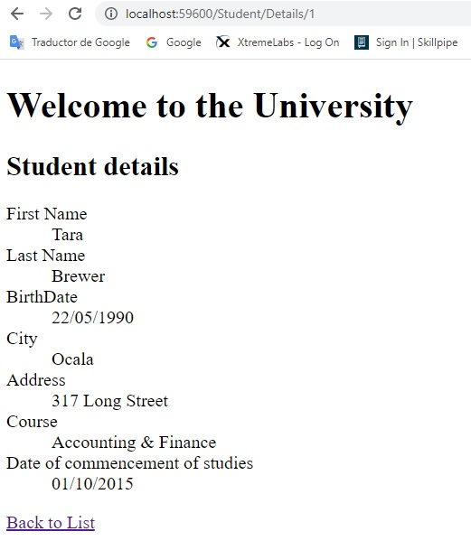

38. En Microsoft Edge, haga clic en **Cerrar**.

39. En la ventana **Ejemplo de diseño - Microsoft Visual Studio**, en el menú **Archivo**, haga clic en **Salir**.


# Lección 2: Usando CSS y JavaScript

### Demonstration: Cómo usar npm para agregar una biblioteca

#### Pasos de preparación 

Asegúrate de que has clonado el directorio **20486D** de GitHub. Contiene los segmentos de código para los laboratorios y demostraciones de este curso. (**https://github.com/MicrosoftLearning/20486D-DevelopingASPNETMVCWebApplications/tree/master/Allfiles**)

#### Pasos de demostración

1. Navega a **[Repository Root]\Allfiles\Mod08\Democode\02_NpmExample_begin**, y luego haz doble clic en **NpmEjemplo.sln**.

   > **Nota**: Si aparece un cuadro de diálogo de **Advertencia de seguridad para NpmExample**, verifique que la casilla de verificación **Pregúnteme por cada proyecto de esta solución** esté desactivada, y luego haga clic en OK.

2. En la ventana **NpmEjemplo - Microsoft Visual Studio**, en el Explorador de soluciones, haga clic con el botón derecho del ratón en **NpmEjemplo**, apunte a **Agregar**, y luego haga clic en **Nuevo elemento**.

3. En el cuadro de diálogo **Agregar nuevo elemento - NpmEjemplo**, en el cuadro de búsqueda, escriba **npm**, y luego presione Intro.

4. En el cuadro de diálogo **Agregar nuevo elemento - NpmExample**, haga clic en **Archivo de configuración de npm**, y luego haga clic en **Agregar**.

- La representación visual del codigo del ejercicio se muestra en la siguiente imagen:

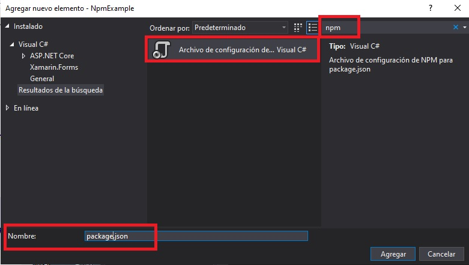

5. En el archivo **package.json**, localice el siguiente código:
  ```cs
        "devDependencies": {
        }
  ```
6. Ponga el cursor después del signo **}** (corchete de cierre), y luego escriba el siguiente código:
  ```cs
        ,
        "dependencias": {
            "jquery": "3.3.1"
        }
  ```
- La representación visual del codigo del ejercicio se muestra en la siguiente imagen:

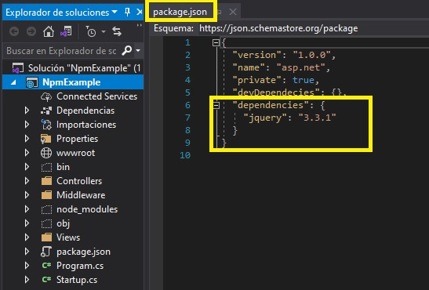

7. En la ventana **NpmExample - Microsoft Visual Studio**, en el menú **Archivo**, haga clic en **Guardar paquete.json**.

8. Espere a que aparezca el cuadro de diálogo de **Microsoft Visual Studio**, y luego haga clic en **Sí a todo**.

   > **Nota**: En el Explorador de Soluciones, en **Dependencias**, se ha añadido una nueva carpeta llamada **npm**, que contiene el paquete **jquery**.

- La representación visual del codigo del ejercicio se muestra en la siguiente imagen:

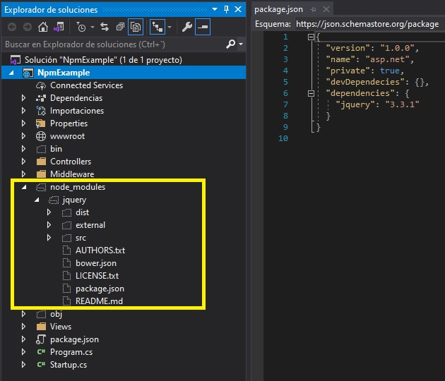

9. En la barra de menú del Explorador de soluciones, haga clic en **Mostrar todos los archivos**.

   > **Nota**: En la ventana **NpmExample - Microsoft Visual Studio**, en el Explorador de soluciones, se ha agregado una nueva carpeta llamada **node_modules**, que contiene el paquete **jquery**.

- La representación visual del codigo del ejercicio se muestra en la siguiente imagen:


10. En el Solution Explorer, haga clic con el botón derecho del ratón en **NpmExample**, apunte a **Add**, y luego haga clic en **New Folder**.

11. En el cuadro **Nueva Carpeta**, escriba **Middleware**, y luego presione Enter.

- La representación visual del codigo del ejercicio se muestra en la siguiente imagen:

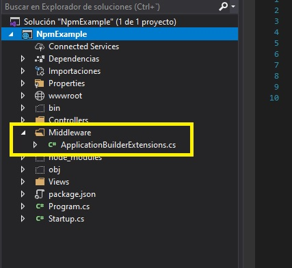

12. En el Explorador de soluciones, haga clic con el botón derecho del ratón en **Middleware**, apunte a **Agregar**, y luego haga clic en **Clase**.

13. En el cuadro de diálogo **Agregar nuevo elemento - NpmEjemplo**, en el cuadro **Nombre**, escriba **ApplicationBuilderExtensions**, y luego haga clic en **Agregar**.

- La representación visual del codigo del ejercicio se muestra en la siguiente imagen:


14. En la ventana del código **ApplicationBuilderExtensions.cs**, localice el siguiente código:
  ```cs
       using System.Threading.Tasks;
  ```
15. Asegúrate de que el cursor está al final del espacio de nombres **System.Threading.Tasks**, presiona Enter, y luego escribe el siguiente código:
  ```cs
       using System.IO;
       using Microsoft.AspNetCore.Builder;
       using Microsoft.Extensions.FileProviders;
  ```

16. En la ventana del código **ApplicationBuilderExtensions.cs**, seleccione el siguiente código:
  ```cs
      public class ApplicationBuilderExtensions
  ```

17.  Reemplazar el código seleccionado por el siguiente código:
  ```cs
      public static class ApplicationBuilderExtensions
  ```

18. En el bloque de código **ApplicationBuilderExtensions.cs**, coloque el cursor después del segundo signo **{** (abrazadera), pulse Intro, y luego escriba el siguiente código:
  ```cs
       public static IApplicationBuilder UseNodeModules(this IApplicationBuilder applicationBuilder, string root)
       {
          var path = Path.Combine(root, "node_modules");
          var fileProvider = new PhysicalFileProvider(path);

          var options = new StaticFileOptions();
          options.RequestPath = "/node_modules";
          options.FileProvider = fileProvider;

          applicationBuilder.UseStaticFiles(options);
          return applicationBuilder;
       }
  ```

- La representación visual del codigo del ejercicio se muestra en la siguiente imagen:

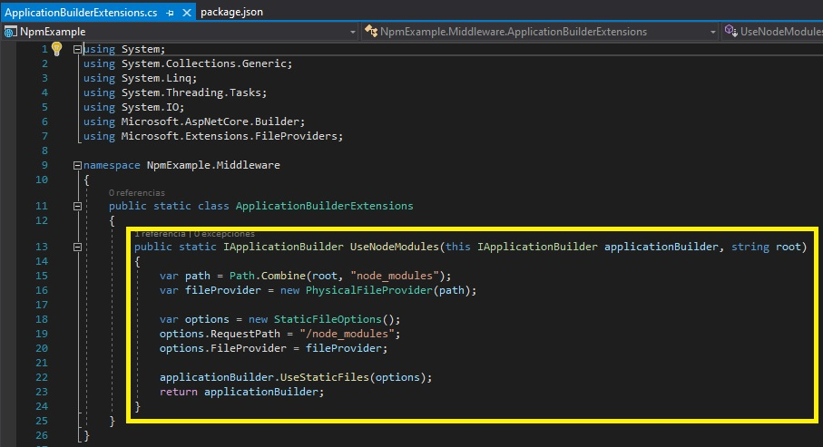

19. En la ventana **NpmExample - Microsoft Visual Studio**, en el Explorador de Soluciones, haga clic en **Startup.cs**.

20. En la ventana del código **Startup.cs**, localice el siguiente código:
  ```cs
       using Microsoft.Extensions.DependencyInjection;
  ```
21. Asegúrate de que el cursor está al final del espacio de nombres **Microsoft.Extensions.DependencyInjection**, presiona Enter y luego escribe el siguiente código:
  ```cs
       usando NpmExample.Middleware;
  ```

22. En la ventana del código **Startup.cs**, localice el siguiente código: 
  ```cs
       public void Configure(IApplicationBuilder app, IHostingEnvironment env)
       {
  ```

23. Coloca el cursor después del código localizado, pulsa Intro, escribe el siguiente código y luego pulsa Intro.
  ```cs
       app.UseStaticFiles();

       app.UseNodeModules(env.ContentRootPath);
  ```

- La representación visual del codigo del ejercicio se muestra en la siguiente imagen:

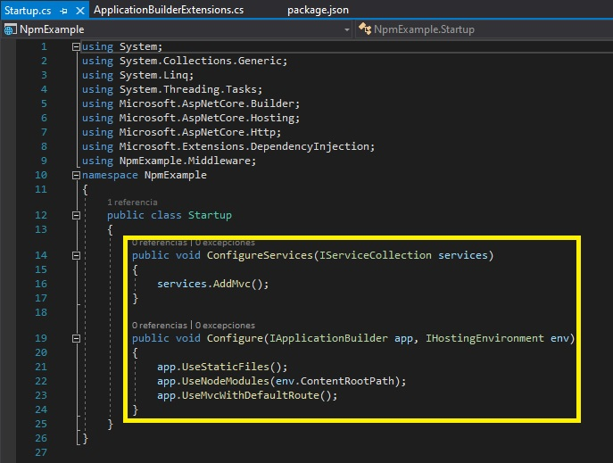

24. En la ventana **NpmExample - Microsoft Visual Studio**, en el Explorador de Soluciones, expanda **Vistas**, expanda **Shared**, y luego haga clic en **_Layout.cshtml**.

25. En el archivo **_Layout.cshtml**, localice el siguiente código:
  ```cs
       <título>@ViewBag.Title</title>
  ```

26. Coloque el cursor después del signo **>** (mayor que) de la etiqueta **&lt;/title&gt;**, pulse Intro y luego escriba el siguiente código: 

  ```cs
       <script src="~/node_modules/jquery/dist/jquery.min.js"></script>
       <script src="~/js/jquery-function.js"></script>
  ```

- La representación visual del codigo del ejercicio se muestra en la siguiente imagen:

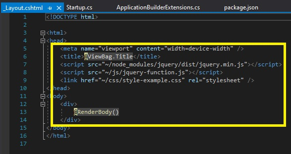

27. En la ventana **NpmExample - Microsoft Visual Studio**, en el Explorador de Soluciones, expanda **Controllers**, y luego haga clic en **HomeController.cs**.

28. En la ventana de código **HomeController.cs**, haga clic con el botón derecho del ratón en el siguiente código y luego haga clic en **Add View**.
  ```cs
       public IActionResult Index()
  ```

29. En el cuadro de diálogo **Añadir vista de MVC**, asegúrese de que el valor en el cuadro **Nombre de la vista** es **Índice**.  

30. En el cuadro de diálogo **Add View MVC**, asegúrese de que la plantilla **Vacío (sin modelo)** esté seleccionada.

31. En el cuadro de diálogo **Add View MVC**, asegúrese de que la casilla de verificación **Crear como una vista parcial** está desactivada y la casilla de verificación **Utilizar una página de diseño** está seleccionada y, a continuación, haga clic en **Agregar**.

- La representación visual del codigo del ejercicio se muestra en la siguiente imagen:

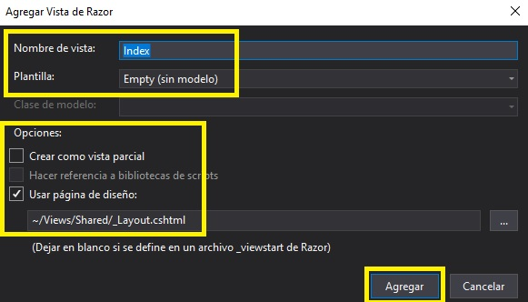

32. En la ventana de código **Index.cshtml**, seleccione el siguiente código:
  ```cs
       <h2>Index</h2>
  ```

33. Sustituya el código seleccionado por el siguiente código: 
  ```cs
       <div>
            <h1>Use npm to Add a Library</h1>
            <button id="btn-jquery-func">Run jQuery Function</button>
            <div class="box"></div>
       </div>
  ```

- La representación visual del codigo del ejercicio se muestra en la siguiente imagen:

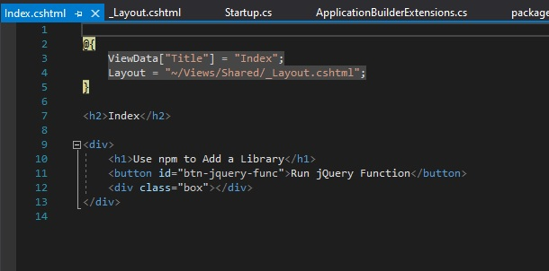

34. En la ventana **NpmExample - Microsoft Visual Studio**, en el Solution Explorer, haga clic con el botón derecho **wwwwroot**, apunte a **Add**, y luego haga clic en **New Folder**.

35. En el cuadro **Nueva Carpeta**, escriba **css**, y luego pulse Intro.


- La representación visual del codigo del ejercicio se muestra en la siguiente imagen:

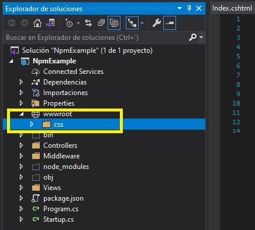

36. En la ventana **NpmExample - Microsoft Visual Studio**, en el Solution Explorer, en **wwwwroot**, haga clic con el botón derecho **css**, apunte a **Agregar**, y luego haga clic en **Nuevo elemento**.

37. En el cuadro de diálogo **Agregar nuevo elemento - NpmExample**, haga clic en **Web** y, a continuación, en el panel de resultados, haga clic en **Hoja de estilo**.

38. En el cuadro de diálogo **Agregar nuevo elemento - NpmExample**, en el cuadro **Nombre**, escriba **style-example**, y luego haga clic en **Agregar**.

39. En la ventana de código **style-example.css**, seleccione el siguiente código: 
  ```cs
       body {
       }
  ```

40. Reemplaza el código seleccionado por el siguiente código:
  ```cs
       body {
          text-align: center;
       }

       h1 {
          color: #1B5E20;
          font-family: "Libre Baskerville", serif;
          font-size: 45px;
          font-weight: bolder;
          text-align: center;
       }

       #btn-jquery-func {
          font-size: 20px;
       }

       .box {
          width: 150px;
          height: 150px;
          background: #81C784;
          margin-top: 30px;
          margin-left: 150px;
          margin-right: auto;
          border-style: solid;
          border-color: #388E3C;
          font-size: x-large;
          font-weight: bold;
       }
  ```

- La representación visual del codigo del ejercicio se muestra en la siguiente imagen:

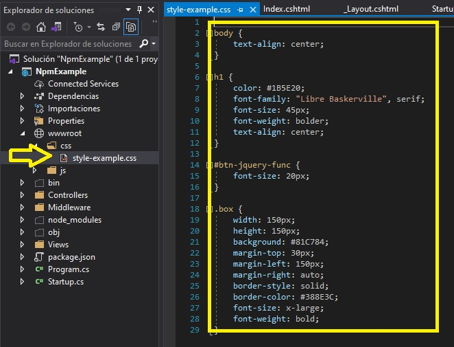

41. En la ventana **NpmExample - Microsoft Visual Studio**, en el Explorador de Soluciones, en **Vistas**, en **Shared**, haga clic en **_Layout.cshtml**.

42. En el archivo **_Layout.cshtml**, localice el siguiente código:
  ```cs
       <script src="~/js/jquery-function.js"></script>
  ```

43. Coloque el cursor después del signo **>** (mayor que) de la etiqueta **&lt;/script --> **, pulse Intro, y luego escriba el siguiente código: 
  ```cs
       <link href="~/css/style-example.css" rel="stylesheet" />
  ```

44. En la ventana **NpmExample - Microsoft Visual Studio**, en el menú **Archivo**, haga clic en **Guardar todo**.

45. En la ventana **NpmExample - Microsoft Visual Studio**, en el menú **DEBUG**, haga clic en **Iniciar sin depuración**.

- La representación visual del codigo del ejercicio se muestra en la siguiente imagen:

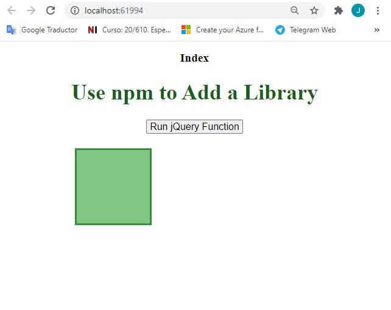

46. En Microsoft Edge, haga clic en **Run jQuery Function**.

- La representación visual del codigo del ejercicio se muestra en la siguiente imagen:

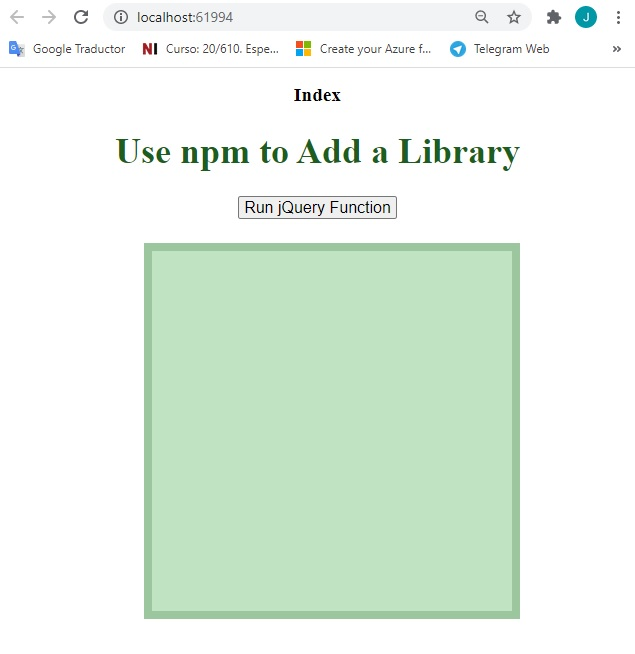

47. En Microsoft Edge, haga clic en **Cerrar**.

48. En la ventana **NpmExample - Microsoft Visual Studio**, en el menú **Archivo**, haga clic en **Salir**.

# Lección 3: Usando jQuery

### Demonstration: Cómo modificar elementos HTML usando jQuery

#### Pasos de preparación 


Asegúrate de que has clonado el directorio **20486D** de GitHub. Contiene los segmentos de código para los laboratorios y demostraciones de este curso. (**https://github.com/MicrosoftLearning/20486D-DevelopingASPNETMVCWebApplications/tree/master/Allfiles**)

#### Pasos de demostración

1. En el **Explorador de Archivos**, navegar a **[Repository Root]\Allfiles\Mod08\Democode\03_JQueryExample_begin\JQueryExample**, copiar la dirección en la barra de direcciones.

2. Ve a **Start** escribe **cmd**, y luego pulsa Intro.

3. En **Best match**, haz clic con el botón derecho del ratón en **Command Prompt**, y luego haz clic en **Run as administrator**.

4. En el cuadro de diálogo **Control de cuentas de usuario**, haga clic en **Sí**.

5. En el cuadro de diálogo **Administrador: Command Prompt**, escriba el siguiente comando y luego pulse Intro.
  ```cs
       cd {copied folder path}
  ```

  >  **Nota**: Si la *{pista de la carpeta copiada}* es diferente de la unidad de disco en la que se encuentra el símbolo del sistema, deberá escribir *{pista de disco}:* antes de escribir el comando **cd** *{pista de la carpeta copiada}*.

6. En el **Administrador: Command Prompt**, escriba el siguiente comando y, a continuación, pulse Intro.
  ```cs
       npm install
  ```
  >  **Nota**: Si se muestran mensajes de advertencia en la línea de comandos, puede ignorarlos.

- La representación visual del codigo del ejercicio se muestra en la siguiente imagen:

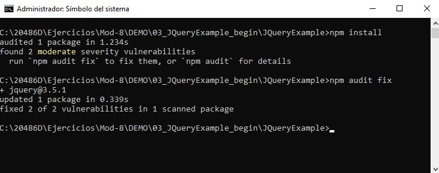

7. Cierre la ventana.

8. En el **Explorador de Archivos**, navega a **[Repository Root]\Allfiles\Mod08\Democode\03_JQueryExample_begin** y luego haz doble clic en **JQueryExample.sln**.

   > **Nota**: Si aparece un cuadro de diálogo de **Advertencia de seguridad para JQueryExample**, verifique que la casilla de verificación **Ask me for each project in this solution** esté despejada, y luego haga clic en OK.

9. En la ventana **JQueryExample - Microsoft Visual Studio**, en el Explorador de soluciones, haga clic con el botón derecho del ratón en **wwwwroot**, apunte a **Agregar**, y luego haga clic en **Nueva carpeta**.

    >**Nota:** En **Solution Explorer**, en **Dependencias**, se ha añadido una nueva carpeta llamada **npm** que contiene el paquete **jquery** como resultado de la ejecución del comando **npm install**.


- La representación visual del codigo del ejercicio se muestra en la siguiente imagen:

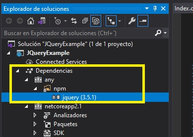

10. En el cuadro de texto **NewFolder**, escriba **js**, y luego presione Enter.


- La representación visual del codigo del ejercicio se muestra en la siguiente imagen:

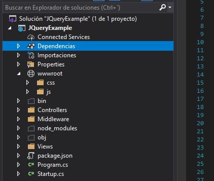

11. En la ventana **JQueryExample - Microsoft Visual Studio**, en el Solution Explorer, en **wwwwroot**, haga clic con el botón derecho **js**, apunte a **Add**, y luego haga clic en **New Item**.

12. En el cuadro de diálogo **Agregar nuevo elemento - JQueryExample**, haga clic en **Web** y, a continuación, en el panel de resultados, haga clic en **Archivo JavaScript**.

13. En el cuadro de diálogo **Agregar nuevo elemento - JQueryExample**, en el cuadro **Nombre**, escriba **funciones de consulta**, y luego haga clic en **Agregar**.


- La representación visual del codigo del ejercicio se muestra en la siguiente imagen:

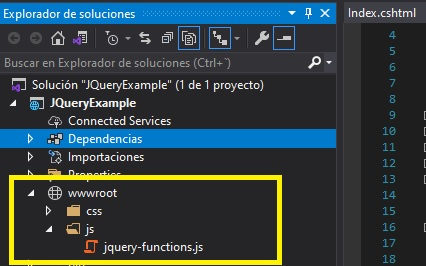

14. En la ventana **jquery-functions.js** code, escriba el siguiente código: 
  ```cs
       var passingGrade = 55;
       $(function() {
           $("#jqueryButton").click(function (event) {
                var firstGrade = parseInt($("#studentGrade1").text());
                var secondGrade = parseInt($("#studentGrade2").text());
                var thirdGrade = parseInt($("#studentGrade3").text());

                if (firstGrade > passingGrade) {
                    $("#studentGrade1").addClass("goodGrade");
                } 
                else {
                    $("#studentGrade1").addClass("badGrade");
                }

                if (secondGrade > passingGrade) {
                    $("#studentGrade2").addClass("goodGrade");
                } 
                else {
                    $("#studentGrade2").addClass("badGrade");
                }

                if (thirdGrade > passingGrade) {
                    $("#studentGrade3").addClass("goodGrade");
                } 
                else {
                    $("#studentGrade3").addClass("badGrade");
                }
           });
       });
  ```


- La representación visual del codigo del ejercicio se muestra en la siguiente imagen:

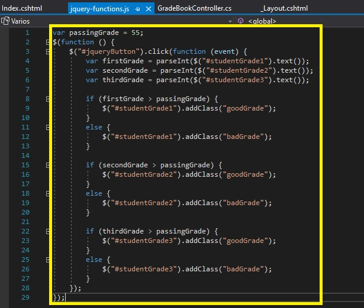


15. En la ventana **JQueryExample - Microsoft Visual Studio**, en el Solution Explorer, expanda **Views**, expanda **Shared**, y luego haga clic en **_Layout.cshtml**.

16. En el archivo **_Layout.cshtml**, localice el siguiente código:
  ```cs
       <link href="~/css/style-example.css" rel="stylesheet" />
  ```

17. Ponga el cursor después del signo **>** (mayor que) de la etiqueta **link**, presione Enter, y luego escriba el siguiente código: 
  ```cs
       <script src="~/js/jquery-functions.js"></script>
  ```

18. En la ventana **JQueryExample - Microsoft Visual Studio**, en el Solution Explorer, expanda **Controllers**, y luego haga clic en **GradeBookController.cs**.

19. En la ventana del código **GradeBookController.cs**, haga clic con el botón derecho del ratón en el siguiente código y luego haga clic en **Add View**.
  ```cs
       public IActionResult Index()
  ```

- La representación visual del codigo del ejercicio se muestra en la siguiente imagen:

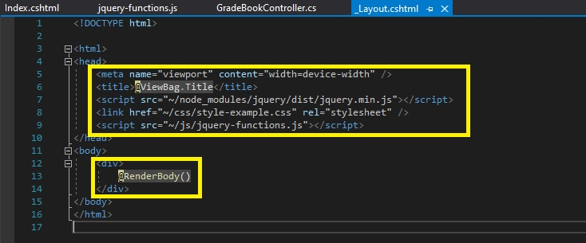

20. En el cuadro de diálogo **Añadir vista de MVC**, asegúrate de que el valor en el cuadro **Nombre de la vista** es **Index**.  

21. En el cuadro de diálogo **Add View MVC**, asegúrese de que la plantilla **Vacío (sin modelo)** esté seleccionada.

22. En el cuadro de diálogo **Add View MVC**, asegúrese de que la casilla **Crear como una vista parcial** está desactivada y la casilla de verificación **Utilizar una página de diseño** está seleccionada y, a continuación, haga clic en **Agregar**.

23. En la ventana de código **Index.cshtml**, seleccione el siguiente código:

  ```cs
       <h2>Index</h2>
  ```

24. Sustituya el código seleccionado por el siguiente código: 
  ```cs
       <h1>Students GradeBook</h1>
       <h2>Course Name: Mathematics and Computer Science</h2>

       <div>
          <table>
             <thead>
             </thead>
             <tbody>
             </tbody>
          </table>
       </div>
       <button id="jqueryButton">Apply JQuery</button>
  ```

25. Ponga el cursor en el elemento **THEAD**, presione Enter, y luego escriba el siguiente código: 
  ```cs
       <tr>
           <th>
              Student Name
           </th>
           <th>
              Mid-Term
           </th>
           <th>
              Performance
           </th>
           <th>
              Final Grade
           </th>
       </tr>
  ```

26. Ponga el cursor en el elemento **TBODY**, presione Enter, y luego escriba el siguiente código: 
  ```cs
       <tr>
           <td>Thomas M. Hacker</td>
           <td>93</td>
           <td>95%</td>
           <td id="studentGrade1">90</td>
       </tr>
       <tr>
           <td>Patrick J. Lazo</td>
           <td>53</td>
           <td>51%</td>
           <td id="studentGrade2">50</td>
       </tr>
       <tr>
           <td>Helen D. Miller</td>
           <td>91</td>
           <td>95%</td>
           <td id="studentGrade3">85</td>
       </tr>
  ```

- La representación visual del codigo del ejercicio se muestra en la siguiente imagen:

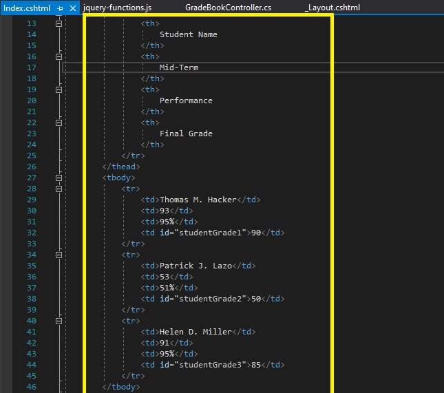

27. En la ventana **JQueryExample - Microsoft Visual Studio**, en el menú **FILE**, haga clic en **Save All**.

28. En la ventana **JQueryExample - Microsoft Visual Studio**, en el menú **DEBUG**, haga clic en **Iniciar sin depuración**.

- La representación visual del codigo del ejercicio se muestra en la siguiente imagen:

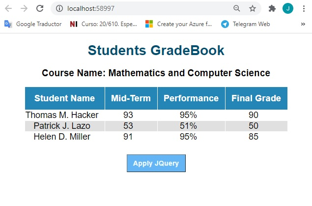

29. En Microsoft Edge, haz clic en **Aplicar JQuery**.

- La representación visual del codigo del ejercicio se muestra en la siguiente imagen:

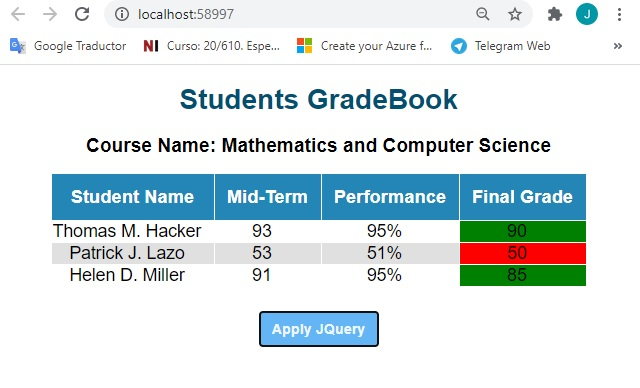

30. En Microsoft Edge, haga clic en **Cerrar**.

31. En la ventana **JQueryExample - Microsoft Visual Studio**, en el menú **FILE**, haga clic en **Salir**.


