# Módulo 8: Usando diseños, CSS y JavaScript en ASP.NET Core MVC

Siempre cuando un camino comienza con  *[Repository Root]*, reemplacelo con el camino absoluto en el que el repositorio 20486 reside. Por ejemplo, si tu has cloneado o extraido el repositorio 20486 en la carpeta **C:\Users\John Doe\Downloads\20486**, cambiar la ruta de: **[Repository Root]\AllFiles\20486D\Mod01** a **C:\Users\John Doe\Downloads\20486\AllFiles\20486D\Mod01**.

Fichero de Instrucciones: Instructions\20486D_MOD08_LAK.md

**Información:**

1. **Nombres y apellidos:** José René Fuentes Cortez
2. **Fecha:** 24 de Noviembre 2020.
3. **Resumen del Ejercicio:** Este laboratorio consta de 4 ejercicios:
- En el Primer ejercicio nos ayuda a poder agregar diseño y vínculo de vistas a estos. En esta parte estaremos hábil para usar el archivo **_ViewStart** de la aplicación Web.
- En el Segundo ejercicio nos ayuda a incluir un archivo css existente y agregar un link de un diseño a un archivo css. También seremos capaz de agregar nuevos selectores a un archivo css de la aplicación..
- En el Tercer ejercicio aprendemos  a como agregar un archivo JavaScript y escribir código JavaScript.
- En el último ejercicio podemos agregar jQuery a una aplicación web usando npm, además de modificar elementos HTML usando jQuery, realizar validación del lado del cliente, y manejar eventos de JavaScript.

4. **Dificultad o problemas presentados y como se resolvieron:** Ninguno.

**NOTA**: Si no hay descripcion de problemas o dificultades, y al yo descargar el código para realizar la comprobacion y el código no funcionar, el resultado de la califaciación del laboratorio será afectado.

---

# Laboratorio: Usando diseños, CSS y JavaScript en ASP.NET Core MVC

### Configuración del Lab

Tiempo estimado: **60 minutos**

### Pasos de Preparación

Asegúrate de que has clonado el directorio **20486D** de GitHub. Contiene los segmentos de código para los laboratorios y demostraciones de este curso. 
**(https://github.com/MicrosoftLearning/20486D-DevelopingASPNETMVCWebApplications/tree/master/Allfiles)**

### Ejercicio 1: Aplicando un diseño y vinculando las vistas al mismo 

#### Tarea 1: Crear un diseño

1. Navega a **[Repository Root]\Allfiles\Mod08\Labfiles\01_ZooSite_begin**, y luego haz doble clic en **ZooSite.sln**.

    >**Nota**: Si aparece un cuadro de diálogo de **Aviso de Seguridad para ZooSite**, verifica que la casilla de verificación **Pregúntame por cada proyecto de esta solución** esté despejada, y luego haz clic en OK.

- La representación visual del codigo del ejercicio se muestra en la siguiente imagen:

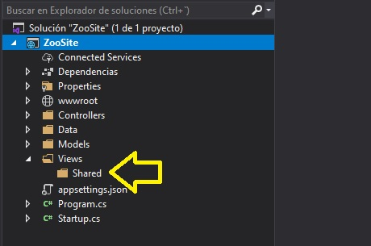

2. En la ventana **ZooSite - Microsoft Visual Studio**, en el Explorador de soluciones, haga clic con el botón derecho del ratón en **Views**, apunte a **Agregar**, y luego haga clic en **Nueva carpeta**.

3. En el cuadro **Nueva Carpeta**, escriba **Shared**, y luego presione Enter.

4. En la ventana **ZooSite - Microsoft Visual Studio**, en el Explorador de soluciones, en **Views**, haga clic con el botón derecho del ratón en **Shared**, apunte a **Agregar**, y luego haga clic en **Nuevo elemento**.

5. En el cuadro de diálogo **Agregar nuevo elemento - ZooSite**, en el panel de navegación, en **Instalado**, amplíe **ASP.NET Core**, y luego haga clic en **Web**.

6. En el cuadro de diálogo **Agregar nuevo elemento - ZooSite**, en el panel de resultados, haga clic en **Diseño de la afeitadora**, y luego haga clic en **Agregar**.

- La representación visual del codigo del ejercicio se muestra en la siguiente imagen:

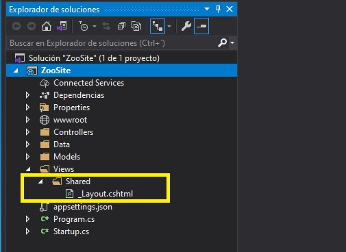

7. En la ventana de código **_Layout.cshtml**, coloque el cursor después del signo **>** (mayor que) de la etiqueta **&lt;cuerpo**;**, pulse Intro y luego escriba el siguiente código: 
  ```cs
       <ul class="nav">
          <li><a href="@Url.Action("Index", "Zoo")">Attractions</a></li>
          <li><a href="@Url.Action("VisitorDetails", "Zoo")">Visitor Info</a></li>
          <li><a href="@Url.Action("BuyTickets", "Zoo")">Tickets</a></li>
       </ul>
  ```
8. Coloque el cursor después del signo **>** (mayor que) de la etiqueta **&lt;/ul&gt;**, pulse Intro, y luego escriba el siguiente código: 
  ```cs
       <div class="header-container">
          <h1 class="content">Welcome to Zoo Center</h1>
          <div class="slider-buttons">
              
              
          </div>
       </div>
  ```
- La representación visual del codigo del ejercicio se muestra en la siguiente imagen:


#### Tarea 2: Añadir una vista y vincularla a un diseño

1. En la ventana **ZooSite - Microsoft Visual Studio**, en el Explorador de Soluciones, expanda **Controllers**, y luego haga clic en **ZooController.cs**.

2. En la ventana de código **ZooController.cs**, haga clic con el botón derecho del ratón en el siguiente código y luego haga clic en **Agregar vista**.
  ```cs
       public IActionResult Index()
  ```
3. En el cuadro de diálogo **Añadir vista de MVC**, asegúrate de que el valor en el cuadro **Nombre de la vista** es **Index**.

4. En el cuadro de diálogo **Agregar vista MVC**, asegúrese de que la plantilla **Vacío (sin modelo)** esté seleccionada.

5. En el cuadro de diálogo **Agregar vista MVC**, asegúrese de que la casilla de verificación **Crear como una vista parcial** está desactivada y la casilla de verificación **Utilizar una página de diseño** está seleccionada y, a continuación, haga clic en el botón **...** (explorar).

- La representación visual del codigo del ejercicio se muestra en la siguiente imagen:

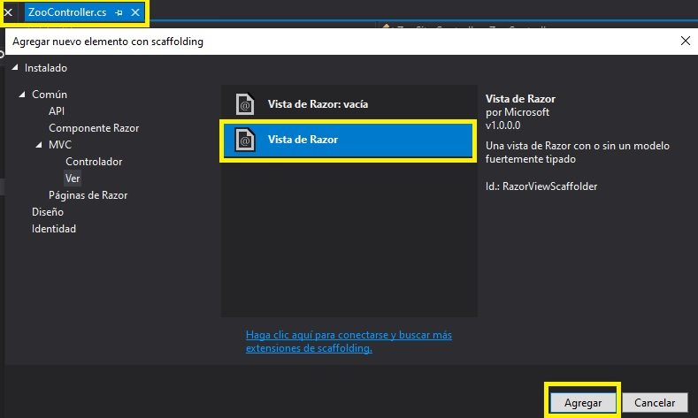

6. En el cuadro de diálogo **Seleccionar una página de diseño**, en **Carpetas de proyecto**, amplíe **Views** y, a continuación, haga clic en **Shared**.

7. En el cuadro de diálogo **Seleccionar una página de diseño**, en **Contenido de la carpeta**, haga clic en **_Layout.cshtml**, y luego haga clic en **OK**.

8. En el cuadro de diálogo **Añadir vista MVC**, haga clic en **Añadir**.

- La representación visual del codigo del ejercicio se muestra en la siguiente imagen:

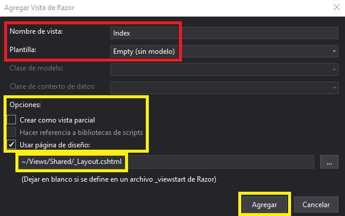

9. En la ventana de código **Index.cshtml**, coloque el cursor al principio del documento, escriba el siguiente código y, a continuación, pulse Intro.
  ```cs
       @model IEnumerable<ZooSite.Models.Photo>
  ```

10. En la ventana del código **Index.cshtml**, seleccione el siguiente código:
  ```cs
       <h2>Index</h2>
  ```

11. Reemplazar el código seleccionado por el siguiente código:
  ```cs
       <h1 class="main-title">Zoo Attractions</h1>
       <div class="container">
       </div>
  ```

12. En la ventana del código **Index.cshtml**, en el elemento **DIV**, escriba el siguiente código:
  ```cs
       @foreach (var item in Model)
       {
       }
  ```

13. Ponga el cursor en el bloque de código **FOREACH**, presione Enter, y luego escriba el siguiente código:

  ```cs
       <div class="photo-index-card">
            @if (item.PhotoFileName != null)
            {
                <div class="image-wrapper">
                    
                </div>
            }
            <h3 class="display-picture-title">
                @Html.DisplayFor(modelItem => item.Title)
            </h3>
            <div>
                <span class="display">
                    @Html.DisplayFor(model => item.Description)
                </span>
            </div>
       </div>
  ```
- La representación visual del codigo del ejercicio se muestra en la siguiente imagen:

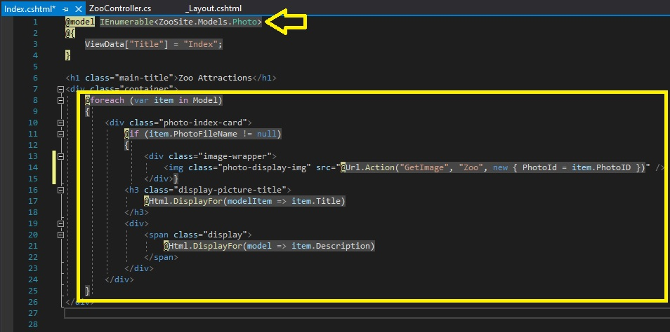

#### Tarea 3: Añadir _ViewStart.cshtml

1. En la ventana **ZooSite - Microsoft Visual Studio**, en el Explorador de Soluciones, haga clic con el botón derecho del ratón en **Views**, apunte a **Agregar**, y luego haga clic en **Nuevo elemento**.

2. En el cuadro de diálogo **Agregar nuevo elemento - ZooSite**, en el panel de navegación, en **Instalado**, expandir **ASP.NET Core**, y luego hacer clic en **Web**.

3. En el cuadro de diálogo **Agregar nuevo elemento - ZooSite**, en el panel de resultados, haz clic en **Inicio de la Razor View**, y luego haz clic en **Agregar**.

4. En la ventana **ZooSite - Microsoft Visual Studio**, en el Explorador de soluciones, en **Views**, expanda **Zoo**, y luego haga clic en **Index.cshtml**.

5. En la ventana de código **Index.cshtml**, borre el siguiente código:
  ```cs
       Layout = "~/Views/Shared/_Layout.cshtml";
  ```

- La representación visual del codigo del ejercicio se muestra en la siguiente imagen:


#### Tarea 4: Añadir las vistas existentes a la aplicación web

1. En la ventana **ZooSite - Microsoft Visual Studio**, en el Explorador de soluciones, en **Views**, haga clic con el botón derecho en **Zoo**, apunte a **Agregar**, y luego haga clic en **Artículo existente**.

2. En el cuadro de diálogo **Agregar elemento existente - ZooSite**, ve a **[Raíz del repositorio]\Todos los archivos\Mod08\Labfiles\ZooViews**, selecciona todos los archivos **.cshtml**, y luego haz clic en **Agregar**.

- La representación visual del codigo del ejercicio se muestra en la siguiente imagen:

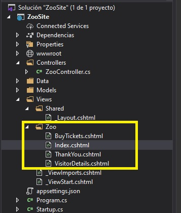

#### Tarea 5: Añadir una sección al diseño
1. En la ventana **ZooSite - Microsoft Visual Studio**, en el Explorador de Soluciones, en **Views**, en **Shared**, haga clic en **_Layout.cshtml**.

2. En la ventana de código **_Layout.cshtml**, localice el siguiente código:
  ```cs
       <div>
           @RenderBody()
       </div>
  ```
3. Coloque el cursor después del signo **>** (mayor que) de la etiqueta **&lt;/div...**, presione Enter y luego escriba el siguiente código: 
  ```cs
       @RenderSection("Scripts", false)
  ```
- La representación visual del codigo del ejercicio se muestra en la siguiente imagen:

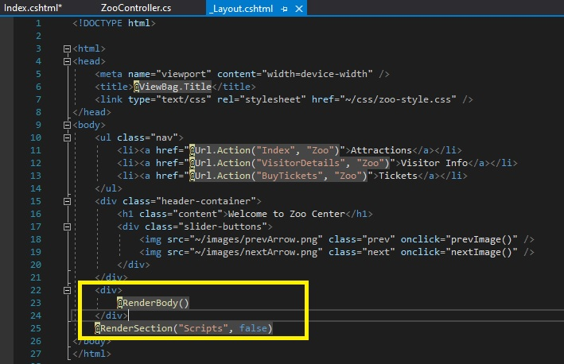


#### Tarea 6: Ejecutar la aplicación

1. En la ventana **ZooSite - Microsoft Visual Studio**, en el menú **FILE**, haga clic en **Save All**.

2. En la ventana **ZooSite - Microsoft Visual Studio**, en el menú **DEBUG**, haga clic en **Iniciar sin depuración**.

    >**Nota**: El navegador muestra el contenido del archivo **Index.cshtml**, pero el contenido HTML no está diseñado por un archivo CSS todavía.

- La representación visual del codigo del ejercicio se muestra en la siguiente imagen:

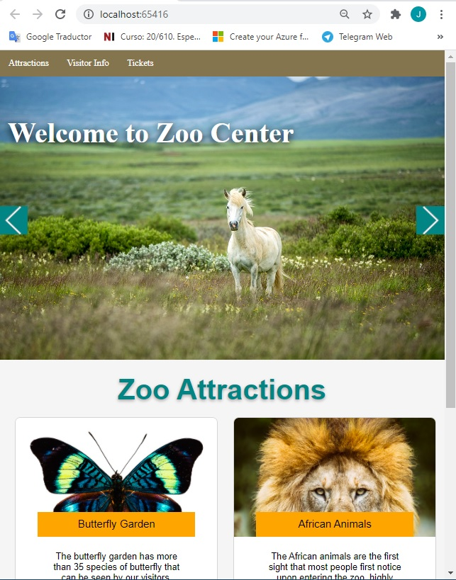

3. En la barra de menú, haga clic en **Información para el visitante**.

    >**Nota**: Examinar el contenido del navegador.

- La representación visual del codigo del ejercicio se muestra en la siguiente imagen:

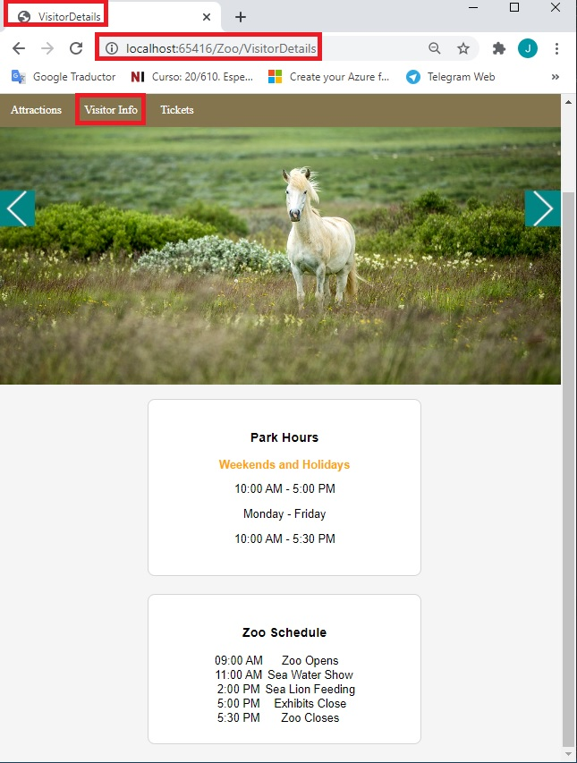

4. En la barra de menú, haz clic en **Tickets**.

    >**Nota**: Examinar el contenido del navegador.

- La representación visual del codigo del ejercicio se muestra en la siguiente imagen:

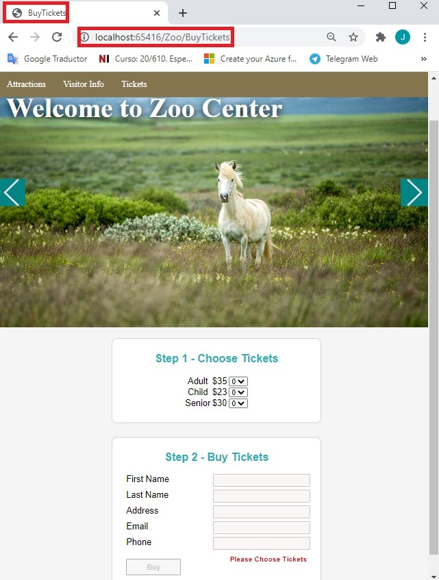

5. En Microsoft Edge, haz clic en **Cerrar**.

>**Resultados**: Después de completar este ejercicio, podrás añadir un diseño y vincular las vistas al mismo. También podrás usar el archivo **_ViewStart** en la aplicación web.  

### Ejercicio 2: Uso de CSS 

#### Tarea 1: Añadir un archivo CSS existente al proyecto

1. En la ventana **ZooSite - Microsoft Visual Studio**, en el Explorador de soluciones, haga clic con el botón derecho **wwwwroot**, apunte a **Agregar**, y luego haga clic en **Nueva carpeta**.

2. En el cuadro **Nueva Carpeta**, escriba **css**, y luego presione Enter.

- La representación visual del codigo del ejercicio se muestra en la siguiente imagen:

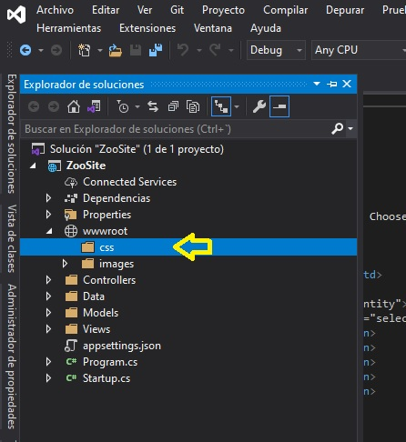

3. En la ventana **ZooSite - Microsoft Visual Studio**, en el Explorador de soluciones, en **wwwroot**, haga clic con el botón derecho **css**, señale a **Agregar** y, a continuación, haga clic en **Artículo existente**.

4. En el cuadro de diálogo **Agregar elemento existente - ZooSite**, ve a **[Repository Root]\Allfiles\Mod08\Labfiles\ZooCSS**, apunta a **zoo-style.css**, y luego haz clic en **Agregar**.

5. En la ventana **ZooSite - Microsoft Visual Studio**, en el Solution Explorer, en **wwwwroot**, en **css**, haz clic en **zoo-style.css**.

    >**Nota**: Examinar el contenido del archivo.

- La representación visual del codigo del ejercicio se muestra en la siguiente imagen:

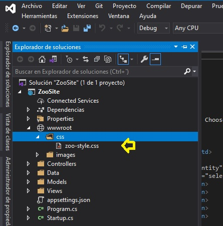

6. En la ventana **ZooSite - Microsoft Visual Studio**, en el Explorador de soluciones, haga clic en **Startup.cs**.

7. En la ventana del código **Startup.cs**, localice el siguiente código:
  ```cs
       zooContext.Database.EnsureDeleted();
       zooContext.Database.EnsureCreated()
  ```

8. Coloca el cursor después del código localizado, presiona Enter dos veces, y luego escribe el siguiente código:
  ```cs
       app.UseStaticFiles();
  ```

#### Tarea 2: Vincular el diseño al archivo CSS

1. En la ventana **ZooSite - Microsoft Visual Studio**, en el Explorador de Soluciones, en **Views**, en **Shared**, haga clic en **_Layout.cshtml**.

2. En la ventana de código **_Layout.cshtml**, localice el siguiente código:
  ```cs
       <title>@ViewBag.Title</title>
  ```
3. Coloque el cursor después del signo **>** (mayor que) de la etiqueta **&lt;/título**, presione Enter y luego escriba el siguiente código: 
  ```cs
       <link type="text/css" rel="stylesheet" href="~/css/zoo-style.css"/>
  ```

- La representación visual del codigo del ejercicio se muestra en la siguiente imagen:

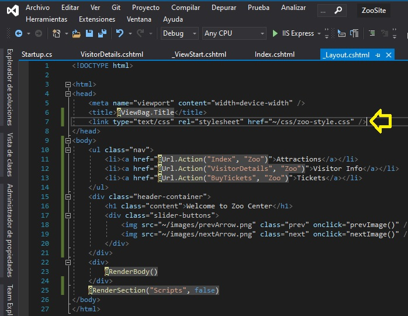

#### Tarea 3: Estilizar el menú

1. En la ventana **ZooSite - Microsoft Visual Studio**, en el Explorador de soluciones, en **wwwwroot**, en **css**, haga clic en **zoo-style.css**.

2. En la ventana del código **zoo-style.css**, localice el siguiente código:

  ```cs
       .slider-buttons img {
          width: 50px;
          height: 50px;
       }
  ```

3. Ponga el cursor después del signo **}** (corchete de cierre), presione Enter dos veces, y luego escriba el siguiente código:
  ```cs
       .nav {
          list-style-type: none;
          margin: 0;
          padding: 0;
          overflow: hidden;
          background-color: #85754e;
          position: fixed;
          top: 0;
          left: 0;
          width: 100%;
       }

       .nav li {
          float: left;
       }
  ```
4. Ponga el cursor inmediatamente después del último signo escrito **}** (llave de cierre), presione Enter dos veces, y luego escriba el siguiente código:
  ```cs
       .nav li a {
          display: block;
          color: white;
          text-align: center;
          padding: 14px 16px;
          text-decoration: none;
       }

       .nav li a:hover:not(.active) {
          background-color: #016b6b;
       }

       .active {
          background-color: #008484;
          color: #fff;
       }
  ```

- La representación visual del codigo del ejercicio se muestra en la siguiente imagen:

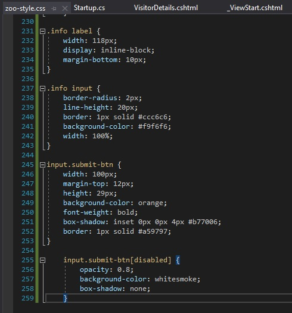

#### Tarea 4: Estilizar la sección de fotos en Index.cshtml

1. En la ventana del código **zoo-style.css**, localiza el siguiente código:
  ```cs
       .active {
          background-color: #008484;
          color: #fff;
       }
  ```
2. Ponga el cursor después del signo **}** (corchete de cierre), presione Enter dos veces, y luego escriba el siguiente código:
  ```cs
       .photo-index-card {
          background-color: #ffffff;
          padding: 0;
          margin: 10px 5px 15px 18px;
          padding-bottom: 25px;
          width: 355px;
          border: 1px solid #d6d4d4;
          border-radius: 10px;
          overflow: hidden;
       }
  ```
#### Tarea 5: Estilizar un formulario en BuyTickets.cshtml

1. En la ventana del código **zoo-style.css**, localiza el siguiente código:
  ```cs
       .photo-index-card {
          background-color: #ffffff;
          padding: 0;
          margin: 10px 5px 15px 18px;
          padding-bottom: 25px;
          width: 355px;
          border: 1px solid #d6d4d4;
          border-radius: 10px;
          overflow: hidden;
       }
  ```

2. Ponga el cursor después del signo **}** (corchete de cierre), presione Enter dos veces, y luego escriba el siguiente código:
  ```cs
       .info .form-field {
          text-align:left;
          clear: both;
       }

       .info .form-field div {
          width: 172px;
          text-align: right;
          float: right;
       }

       .info label {
          width: 118px;
          display: inline-block;
          margin-bottom: 10px;
       }

       .info input{
          border-radius: 2px;
          line-height: 20px;
          border: 1px solid #ccc6c6;
          background-color: #f9f6f6;
          width: 100%;
       }
  ```

3. Ponga el cursor inmediatamente después del último signo escrito **}** (llave de cierre), presione Enter dos veces, y luego escriba el siguiente código:
  ```cs
       input.submit-btn {
          width: 100px;
          margin-top: 12px;
          height: 29px;
          background-color: orange;
          font-weight: bold;
          box-shadow: inset 0px 0px 4px #b77006;
          border: 1px solid #a59797;
       }

       input.submit-btn[disabled] {
          opacity: 0.8;
          background-color: whitesmoke;
          box-shadow: none;
       }
  ```

- La representación visual del codigo del ejercicio se muestra en la siguiente imagen:


#### Tarea 6: Ejecutar la aplicación

1. En la ventana **ZooSite - Microsoft Visual Studio**, en el menú **FILE**, haga clic en **Save All**.

2. En la ventana **ZooSite - Microsoft Visual Studio**, en el menú **DEBUG**, haga clic en **Iniciar sin depuración**.

    >**Nota**: El navegador muestra el contenido del archivo **Index.cshtml**, con contenido HTML diseñado por un archivo CSS.

- La representación visual del codigo del ejercicio se muestra en la siguiente imagen:


3. En la página **Atracciones del zoológico**, en el encabezado **Bienvenido al Centro del Zoológico**, haga clic en la **flecha derecha**.

    >**Nota**: Actualmente, pulsar el botón no tiene ningún efecto ya que no se ha añadido ningún código JavaScript a la aplicación web todavía.

4. En la barra de menú, haga clic en **Información para el visitante**.

    >**Nota**: Examinar el contenido del navegador.

- La representación visual del codigo del ejercicio se muestra en la siguiente imagen:


5. En la barra de menú, haga clic en **Tickets**.

6. En **Paso 1 - Elegir Entradas**, en la casilla **Adulto**, seleccione _&lt;tantas entradas como desee;_,_ en la casilla **Niño**, seleccione _&lt;tantas entradas como desee;_ y luego en la casilla **Senior**, seleccione _&lt;tantas entradas como desee&gt;._

    >**Nota**: Actualmente el costo total de los boletos no se muestra en la página ya que aún no se ha agregado código JavaScript a la aplicación web.

- La representación visual del codigo del ejercicio se muestra en la siguiente imagen:


7. En **Paso 2 - Comprar entradas**, en la casilla **Nombre**, escriba _&lt;Un nombre de pila de su elección&gt;._

8. En **Paso 2 - Comprar entradas**, en la casilla **Apellido**, escriba _&lt;Un apellido de su elección&gt;._

9. En **Paso 2 - Comprar Entradas**, en la casilla **Dirección**, escriba _&lt;Una dirección de su elección&gt;._

10. En **Paso 2 - Comprar entradas**, en la casilla **Email**, escriba **abcd**.

11. En **Paso 2 - Comprar Entradas**, en la casilla **Teléfono**, escriba _&lt;Un teléfono de su elección&gt;._ y luego haga clic en **Comprar**.

    >**Nota**: Actualmente no se pueden comprar las entradas y no hay validación ya que la funcionalidad no se ha aplicado todavía.

- La representación visual del codigo del ejercicio se muestra en la siguiente imagen:  


12. En Microsoft Edge, haga clic en **Cerrar**.

>**Resultados**: Después de completar este ejercicio, podrás agregar un archivo CSS existente a una aplicación web, y añadir un enlace de un diseño al archivo CSS. También podrás agregar nuevos selectores CSS a un archivo CSS.

### Ejercicio 3: Uso de JavaScript

#### Tarea 1: Añadir un archivo JavaScript

1. En la ventana **ZooSite - Microsoft Visual Studio**, en el Explorador de soluciones, haga clic con el botón derecho **wwwwroot**, apunte a **Agregar**, y luego haga clic en **Nueva carpeta**.

2. En el cuadro **Nueva Carpeta**, escriba **js**, y luego presione Enter.

- La representación visual del codigo del ejercicio se muestra en la siguiente imagen:  

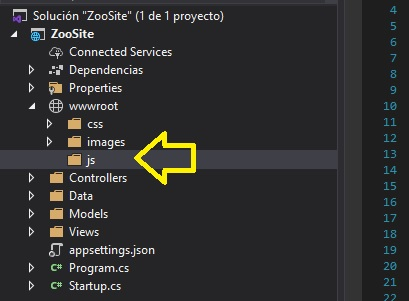

3. En la ventana **ZooSite - Microsoft Visual Studio**, en el Explorador de soluciones, en **wwwwroot**, haga clic con el botón derecho **js**, apunte a **Agregar** y, a continuación, haga clic en **Nuevo elemento**.

4. En el cuadro de diálogo **Agregar nuevo elemento - ZooSite**, en el panel de navegación, en **Instalado**, amplíe **ASP.NET Core**, y luego haga clic en **Web**.

5. En el cuadro de diálogo **Agregar nuevo elemento - ZooSite**, en el panel de resultados, haz clic en **Archivo JavaScript**.

6. En el cuadro de diálogo **Agregar nuevo elemento - ZooSite**, en el cuadro **Nombre**, escriba **form-functions**, y luego haga clic en **Agregar**.

- La representación visual del codigo del ejercicio se muestra en la siguiente imagen:  

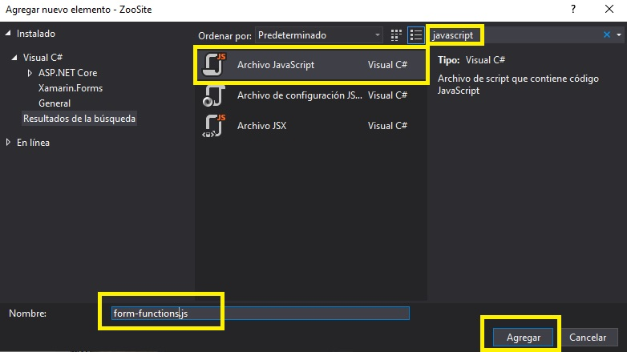

#### Tarea 2: Vincular una vista al archivo JavaScript

1. En la ventana **ZooSite - Microsoft Visual Studio**, en el Explorador de soluciones, en **Views**, en **Zoo**, haga clic en **BuyTickets.cshtml**.

2. En la ventana del código **BuyTickets.cshtml**, localice el siguiente código:
  ```cs
       @section Scripts {
       }
  ```
3.  Ponga el cursor después del signo **{** (abra la abrazadera), pulse Intro, y luego escriba el siguiente código: 
  ```cs
       <script src="~/js/form-functions.js"></script>
  ```
- La representación visual del codigo del ejercicio se muestra en la siguiente imagen:  

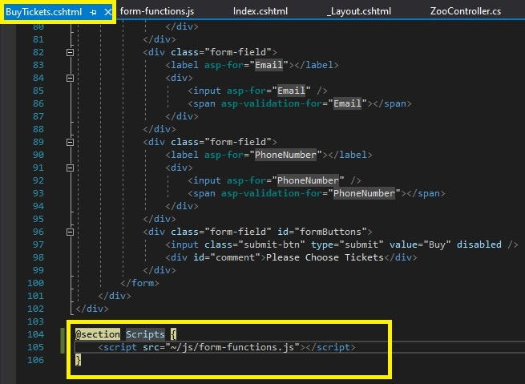

#### Tarea 3: Escribir el código del archivo JavaScript

1. En la ventana **ZooSite - Microsoft Visual Studio**, en el Explorador de soluciones, en **wwwwroot**, en **js**, haga clic en **form-functions.js**.

2. En la ventana del código **form-functions.js**, escriba el siguiente código:
  ```cs
       function calculateSum() {
          var rows = document.querySelectorAll("#totalAmount tr .sum");
          var sum = 0;

          for (var i = 0; i < rows.length; i++) {
              sum = sum + parseFloat(parseFloat(rows[i].innerHTML.substring(1, rows[i].innerHTML.length)).toFixed(2));
          }

          document.getElementById("sum").innerHTML = "Total: $" + sum;
       }
  ```

>**Resultados**: Después de completar este ejercicio, podrás añadir un archivo JavaScript y escribir el código JavaScript. 

- La representación visual del codigo del ejercicio se muestra en la siguiente imagen:  


### Ejercicio 4: Usando jQuery

#### Tarea 1: Usar npm para añadir jQuery

1. En la ventana **ZooSite - Microsoft Visual Studio**, en el Explorador de soluciones, haga clic con el botón derecho **ZooSite**, apunte a **Agregar**, y luego haga clic en **Nuevo elemento**.

2. En el cuadro de diálogo **Agregar nuevo elemento - ZooSite**, en el cuadro de búsqueda, escriba **npm**, y luego presione Intro.

- La representación visual del codigo del ejercicio se muestra en la siguiente imagen:  

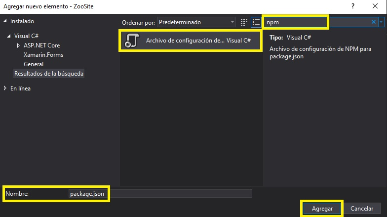

3. En el cuadro de diálogo **Agregar nuevo elemento - ZooSite**, en el panel de resultados, haga clic en **Archivo de configuración de npm** y luego en **Agregar**.

4. En la ventana de código **package.json**, localice el siguiente código:
  ```cs
       "devDependencies": {
       }
  ```
5. Ponga el cursor después del signo **}** (corchete de cierre), y luego escriba el siguiente código:

  ```cs
       "dependencies": {
           "jquery": "3.3.1"
       }
  ```
- La representación visual del codigo del ejercicio se muestra en la siguiente imagen:  

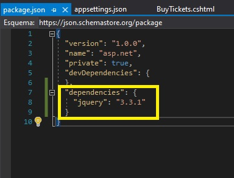

6. En la ventana **ZooSite - Microsoft Visual Studio**, en el menú **FILE**, haga clic en **Save package.json**.

7. Espera a que aparezca el cuadro de diálogo de **Microsoft Visual Studio**, y luego haz clic en **Sí a todo**.

    >**Nota**: En el Explorador de Soluciones, en **Dependencias**, se ha añadido una nueva carpeta llamada **npm**, que contiene el paquete **jquery**.

8. En la ventana **ZooSite - Microsoft Visual Studio**, en el Solution Explorer, en **Explorer Toolbar Options** haga clic en **Mostrar todos los archivos**.

      >**Nota**: 9. En la ventana **ZooSite - Microsoft Visual Studio**, en el Explorador de soluciones, se ha añadido una nueva carpeta llamada **node_modules**, que contiene el paquete **jquery**.

- La representación visual del codigo del ejercicio se muestra en la siguiente imagen:  

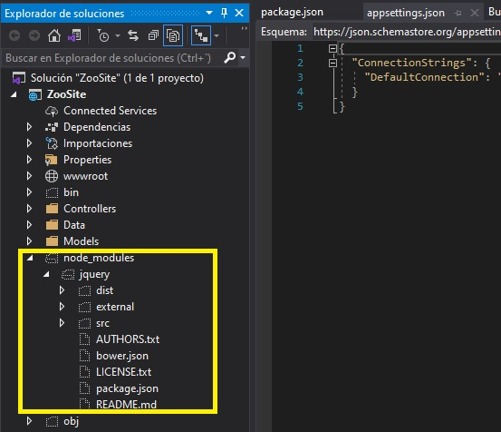

9. En la ventana **ZooSite - Microsoft Visual Studio**, en el Explorador de soluciones, haga clic con el botón derecho del ratón en **ZooSite**, apunte a **Agregar**, y luego haga clic en **Nueva carpeta**.

10. En el cuadro **Nueva Carpeta**, escriba **Middleware**, y luego presione Enter.

- La representación visual del codigo del ejercicio se muestra en la siguiente imagen:  

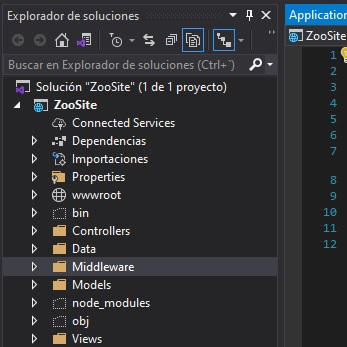

11. En la ventana **ZooSite - Microsoft Visual Studio**, en el Explorador de soluciones, haga clic con el botón derecho del ratón en **Middleware**, apunte a **Agregar**, y luego haga clic en **Clase**.

12. En el cuadro de diálogo **Agregar nuevo elemento - ZooSite**, en el cuadro **Nombre**, escriba **ApplicationBuilderExtensions**, y luego haga clic en **Agregar**.

- La representación visual del codigo del ejercicio se muestra en la siguiente imagen:  


13. En la ventana de código **ApplicationBuilderExtensions.cs**, localice el siguiente código:
  ```cs
       using System.Threading.Tasks;
  ```
14. Asegúrate de que el cursor está al final del espacio de nombres **System.Threading.Tasks**, presiona Enter, y luego escribe el siguiente código:
  ```cs
       using System.IO;
       using Microsoft.AspNetCore.Builder;
       using Microsoft.Extensions.FileProviders;
  ```

15. En la ventana del código **ApplicationBuilderExtensions.cs**, seleccione el siguiente código:
  ```cs
      public class ApplicationBuilderExtensions
  ```

16. Sustituya el código seleccionado por el siguiente código:
  ```cs
      public static class ApplicationBuilderExtensions
  ```

17. En el bloque de código **ApplicationBuilderExtensions.cs**, coloque el cursor después del segundo signo **{** (abrazadera), pulse Intro, y luego escriba el siguiente código:
  ```cs
       public static IApplicationBuilder UseNodeModules(this IApplicationBuilder applicationBuilder, string root)
       {
          var path = Path.Combine(root, "node_modules");
          var fileProvider = new PhysicalFileProvider(path);

          var options = new StaticFileOptions();
          options.RequestPath = "/node_modules";
          options.FileProvider = fileProvider;

          applicationBuilder.UseStaticFiles(options);
          return applicationBuilder;
       }
  ```

- La representación visual del codigo del ejercicio se muestra en la siguiente imagen:  

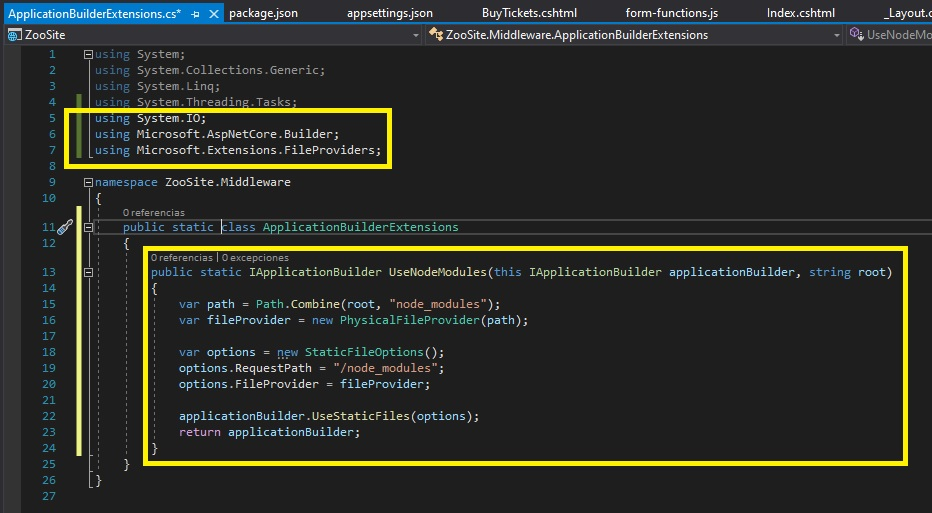

18. En la ventana **ZooSite - Microsoft Visual Studio**, en el Explorador de soluciones, haga clic en **Startup.cs**.

19. En la ventana del código **Startup.cs**, localice el siguiente código:
  ```cs
       using ZooSite.Data;
  ```
20. Asegúrate de que el cursor está al final del espacio de nombres **ZooSite.Data**, presiona Enter, y luego escribe el siguiente código:
  ```cs
       using ZooSite.Middleware;
  ```

21. En la ventana del código **Startup.cs**, localice el siguiente código:
  ```css
       app.UseStaticFiles();
  ```

22. Coloca el cursor después del código localizado, presiona Enter dos veces, y luego escribe el siguiente código:
  ```cs
       app.UseNodeModules(env.ContentRootPath);
  ```
- La representación visual del codigo del ejercicio se muestra en la siguiente imagen:  

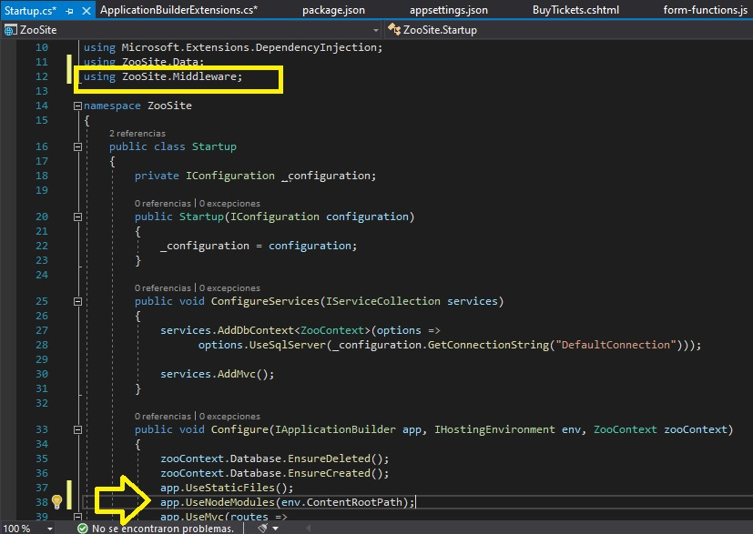

23. En la ventana **ZooSite - Microsoft Visual Studio**, en el Explorador de Soluciones, en **Views**, en **Shared**, haga clic en **_Layout.cshtml**.

24. En la ventana del código **_Layout.cshtml**, localice el siguiente código:
  ```cs
       <link type="text/css" rel="stylesheet" href="~/css/zoo-style.css"/>
  ```

25. Ponga el cursor después del signo **>** (mayor que), presione Enter, y luego escriba el siguiente código: 
  ```cs
       <script src="~/node_modules/jquery/dist/jquery.min.js"></script>
  ```

- La representación visual del codigo del ejercicio se muestra en la siguiente imagen:  

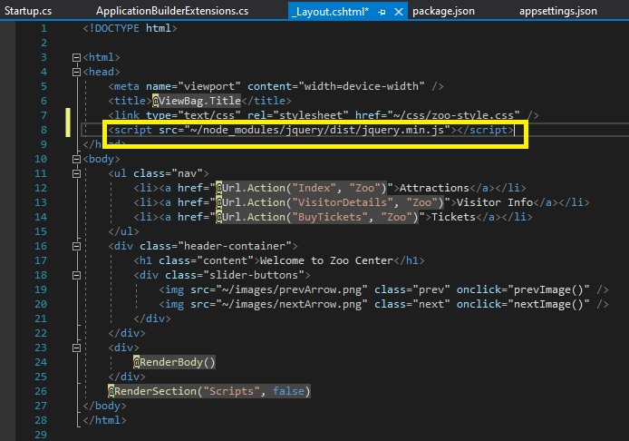

#### Tarea 2: Usar jQuery para añadir manejadores de eventos

1. En la ventana **ZooSite - Microsoft Visual Studio**, en el Explorador de soluciones, en **wwwwroot**, en **js**, haga clic en **form-functions.js**.

2. En la ventana del código **form-functions.js**, localice el siguiente código:
  ```cs
          document.getElementById("sum").innerHTML = "Total: $" + sum ;
       }
  ```
3. Ponga el cursor después del signo **}** (corchete de cierre), pulse Intro, y luego escriba el siguiente código: 
  ```cs
       $(function() {

       });
  ```
4. En la ventana del código **form-functions.js**, seleccione el siguiente código, y luego haga clic en **Cut**.
  ```cs
       function calculateSum() {
          var rows = document.querySelectorAll("#totalAmount tr .sum");
          var sum = 0;

          for (var i = 0; i < rows.length; i++) {
              sum = sum + parseFloat(parseFloat(rows[i].innerHTML.substring(1, rows[i].innerHTML.length)).toFixed(2));
          }

          document.getElementById("sum").innerHTML = "Total: $" + sum ;
       }
  ```


5. En la ventana del código **form-functions.js**, localice el siguiente código:
  ```cs
       $(function() {
  ```

6. Asegúrese de que el cursor está después del signo **{** (abra la abrazadera), pulse Intro y luego haga clic en **Pegar**.

7. En la ventana del código **form-functions.js**, localice el siguiente código:
  ```cs
       $(function() {
  ```

8. Asegúrese de que el cursor está después del signo **{** (abra la abrazadera), pulse Intro, y luego escriba el siguiente código:
  ```cs
       $('.pricing select').change(function(event) {
       });
  ``` 

9. En la ventana del código **form-functions.js**, localice el siguiente código:
  ```cs
       $('.pricing select').change(function(event) {
  ```

10. Ponga el cursor después del signo **{** (abra la abrazadera) del código tecleado, pulse Intro, y luego teclee el siguiente código: 
  ```cs
       var target = $(event.target);
       var value = parseInt(target.val());
       var container = target.parent();
       var price = container.prev();
       var label = price.prev();
 
       $("#" + label.text()).remove();
  ```

#### Tarea 3: Usar jQuery para modificar elementos

1. En la ventana del código **form-functions.js**, localice el siguiente código:
  ```cs
       $("#" + label.text()).remove();
  ```
2. Ponga el cursor al final del código localizado, presione Enter dos veces, y luego escriba el siguiente código:
  ```cs
       if (value) {
       }
  ```

3. Ponga el cursor dentro del bloque de código **IF**, y luego escriba el siguiente código:
  ```cs
      $("#summery").addClass("display-div").removeClass("hidden-div");

            var correctCost = (price.text().substring(1, price.text().length));
            var calc = parseInt(value * correctCost);

            var msg = label.text() + " ticket - " + value.toString() + "x" + price.text() + " = <span class='sum'>" +'$' + calc + '</span>';
            var row = $("<tr id='" + label.text() +"'>");
            row.append($("<td>").html(msg));
            $("#totalAmount").append(row);
  ```

4. En la ventana del código **form-functions.js**, localice el siguiente código:
  ```cs
           $("#totalAmount").append(row);
       }
  ```

5. Ponga el cursor después del signo **}** (corchete de cierre), pulse Intro, y luego escriba el siguiente código: 
  ```cs
       if ($("#totalAmount tr").length === 0) {
           $("#summery").addClass("hidden-div").removeClass("display-div");
           $("#formButtons input").attr('disabled', 'disabled');
           $("#comment").show();
       } 
       else {
           $("#formButtons input").removeAttr('disabled');
           $("#comment").hide();
       }
        
       calculateSum();
  ```

- La representación visual del codigo del ejercicio se muestra en la siguiente imagen:  

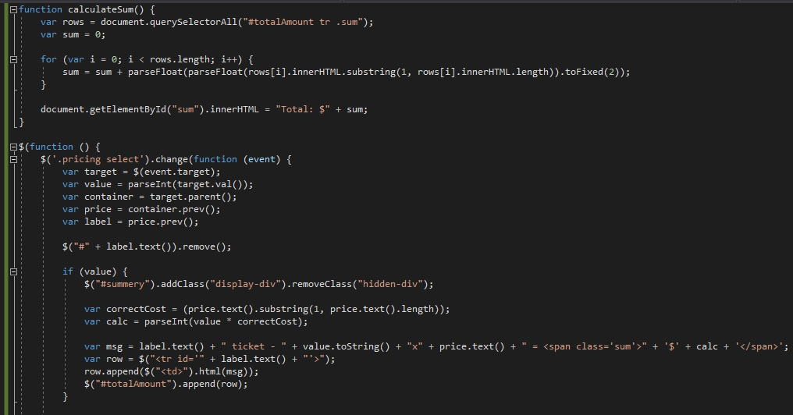

6. En la ventana **ZooSite - Microsoft Visual Studio**, en el Explorador de Soluciones, en **wwwwroot**, haga clic con el botón derecho del ratón en **js**, apunte a **Agregar**, y luego haga clic en **Nuevo elemento**.

7. En el cuadro de diálogo **Agregar nuevo elemento - ZooSite**, haga clic en **Web** y, a continuación, en el panel de resultados, haga clic en **Archivo JavaScript**.

8. En el cuadro de diálogo **Agregar nuevo elemento - ZooSite**, en el cuadro **Nombre**, escriba **menubar-functions**, y luego haga clic en **Agregar**.

- La representación visual del codigo del ejercicio se muestra en la siguiente imagen:  

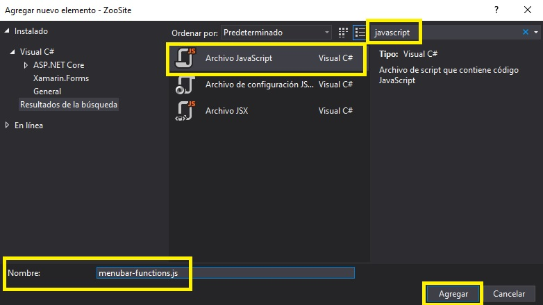

9. En la ventana de código **menubar-functions.js**, escriba el siguiente código:
  ```cs
       $(function() {
          var path = ventana.ubicación.pathname;

          $(".nav li a").each(function (index, value) {
              var href = $(valor).attr('href');
              if (path === href) {
                  $(esto).closest('li').addClass('active');
              }
          });
       });
  ```
- La representación visual del codigo del ejercicio se muestra en la siguiente imagen:  

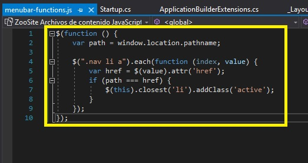

10. En la ventana **ZooSite - Microsoft Visual Studio**, en el Solution Explorer, bajo **wwwwroot**, haga clic con el botón derecho **js**, apunte a **Add**, y luego haga clic en **New Item**.

11. 12. En el cuadro de diálogo **Agregar nuevo elemento - ZooSite**, haga clic en **Web**, y luego en el panel de resultados, haga clic en **Archivo JavaScript**.

12. En el cuadro de diálogo **Agregar nuevo elemento - ZooSite**, en el cuadro **Nombre**, escriba **funciones deslizantes**, y luego haga clic en **Agregar**.

- La representación visual del codigo del ejercicio se muestra en la siguiente imagen:  

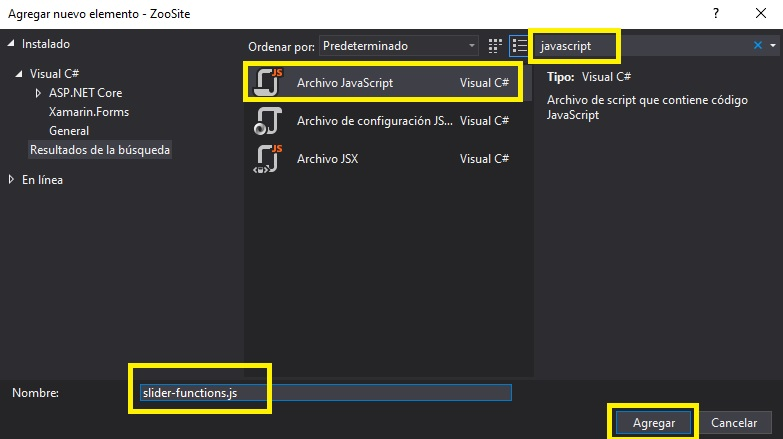

13. En la ventana de código **slider-functions.js**, escriba el siguiente código:

  ```cs
      var images = ['/images/header.jpg', '/images/waters.jpg'];
      var current = 0;

      function nextImage() {
          current++;
          if (current === images.length) {
              current = 0;
          }
          $('.header-container').css('background-image', 'url(' + images[current] + ')');
      }

      function prevImage() {
          current--;
          if (current < 0) {
              current = images.length-1;
          }
          $('.header-container').css('background-image', 'url(' + images[current] + ')');
      }
  ```
- La representación visual del codigo del ejercicio se muestra en la siguiente imagen:  

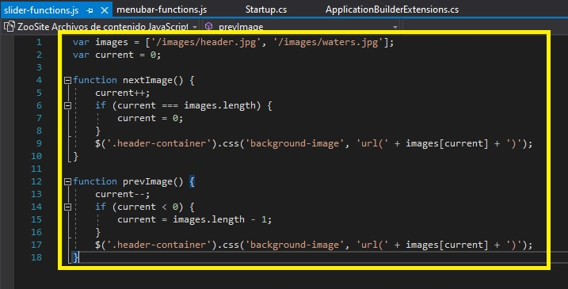

14. En la ventana **ZooSite - Microsoft Visual Studio**, en el Explorador de Soluciones, en **Views**, en **Shared**, haga clic en **_Layout.cshtml**.

15. En la ventana del código **_Layout.cshtml**, localice el siguiente código:
  ```cs
       <script src="~/node_modules/jquery/dist/jquery.min.js"></script>
  ```

16. Coloque el cursor después del signo **>** (mayor que) de la etiqueta **&lt;/script --> **, pulse Intro, y luego escriba el siguiente código: 
  ```cs
       <script src="~/js/menubar-functions.js"></script>
       <script src="~/js/slider-functions.js"></script>
  ```

- La representación visual del codigo del ejercicio se muestra en la siguiente imagen:  

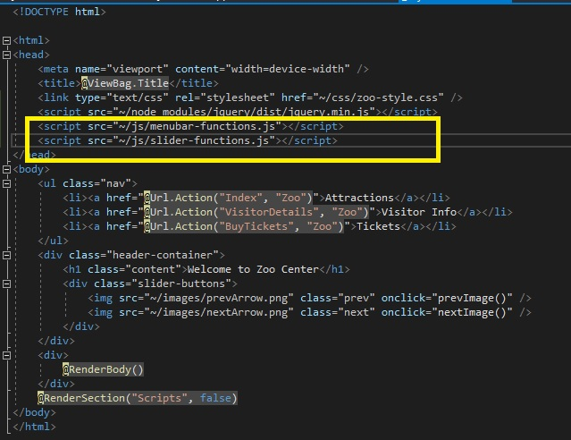


#### Tarea 4: Validación del lado del cliente usando jQuery

1. En la ventana **ZooSite - Microsoft Visual Studio**, en el Explorador de Soluciones, haga clic en **package.json**.

2. En la ventana del código **package.json**, localice el siguiente código:
  ```cs
       "dependencies": {
         "jquery": "3.3.1"
       }
  ```
3. Reemplazar el código seleccionado por el siguiente código:
  ```cs
       "dependencies": {
         "jquery": "3.3.1",
         "jquery-validation": "1.17.0",
         "jquery-validation-unobtrusive": "3.2.10"
       }
  ```
4. En la ventana **ZooSite - Microsoft Visual Studio**, en el menú **FILE**, haga clic en **Save package.json**.

- La representación visual del codigo del ejercicio se muestra en la siguiente imagen:  

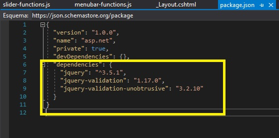

5. Espera a que aparezca el cuadro de diálogo **Microsoft Visual Studio**, y luego haz clic en **Sí a todo**.

    >**Nota**: En el Explorador de Soluciones, en **Dependencias**, en **npm**, se han añadido nuevos paquetes llamados **jquery-validation** y **jquery-validation-unobtrusive**.

6. En la ventana **ZooSite - Microsoft Visual Studio**, en el Solution Explorer, en **Views**, en **Zoo**, haga clic en **BuyTickets.cshtml**.

7. En la ventana del código **BuyTickets.cshtml**, localice el siguiente código:
  ```cs
       @section Scripts {
           <script src="~/js/form-functions.js"></script>
       }
  ```
8. Ponga el cursor después del signo **{** (abra la abrazadera), pulse Intro, y luego escriba el siguiente código: 
  ```cs
       <script src="~/node_modules/jquery-validation/dist/jquery.validate.min.js"></script>
       <script src="~/node_modules/jquery-validation-unobtrusive/dist/jquery.validate.unobtrusive.min.js"></script>
  ```
- La representación visual del codigo del ejercicio se muestra en la siguiente imagen:  

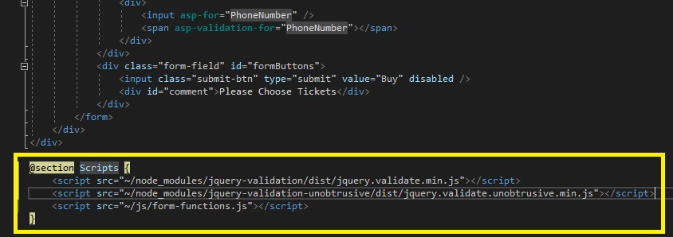

#### Tarea 5: Ejecutar la aplicación

1. En la ventana **ZooSite - Microsoft Visual Studio**, en el menú **FILE**, haga clic en **Save All**.

2. En la ventana **ZooSite - Microsoft Visual Studio**, en el menú **DEBUG**, haga clic en **Iniciar sin depuración**.

3. En la página **Zoo Attractions**, en el encabezado **Welcome to Zoo Center**, haga clic en la **flecha derecha**, y luego en la **flecha izquierda**.

    >**Nota**: El navegador muestra el encabezado con el deslizador, y la funcionalidad del deslizador se aplica mediante el archivo JavaScript **slider-functions.js**.

- La representación visual del codigo del ejercicio se muestra en la siguiente imagen:  

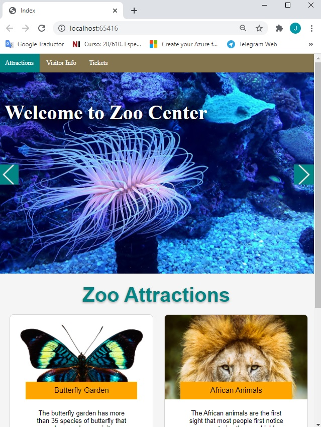

4. En la barra de menú, haga clic en **Información para el visitante**.

    >**Nota**: Examinar el contenido del navegador.
- La representación visual del codigo del ejercicio se muestra en la siguiente imagen:  

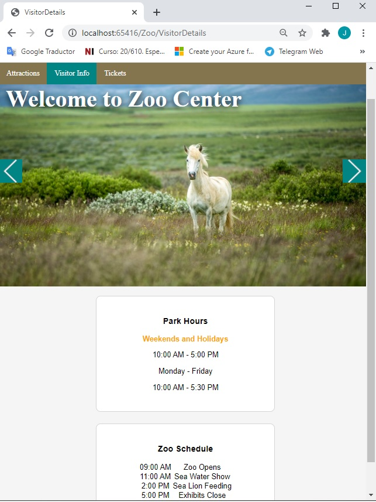

5. En la barra de menú, haga clic en **Tickets**.

    >**Nota**: El botón **Comprar** está desactivado, y hay un mensaje **Por favor, elija entradas** debajo del botón.


6. En **Paso 1 - Elegir Entradas**, en la casilla **Adulto**, seleccione _&lt;tantas entradas como quiera&gt;._ en la casilla **Niño**, seleccione _&lt;tantas entradas como quiera&gt;._ y luego en la casilla **Senior**, seleccione _&lt;tantas entradas como quiera&gt;._

    >**Nota**: El botón **Comprar** está habilitado, y el mensaje **Por favor, elija las entradas** ha desaparecido. Además, se añade una sección de **Resumen del pedido** que muestra el precio de las entradas.

- La representación visual del codigo del ejercicio se muestra en la siguiente imagen:  

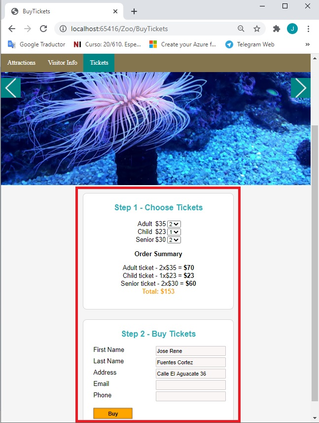

7. En **Paso 2 - Comprar Entradas**, en la casilla **Nombre**, escriba _&lt;Un nombre de pila de su elección&gt;._

8. En **Paso 2 - Comprar Entradas**, en la casilla **Apellido**, escriba _&lt;Un apellido de su elección&gt;._

9. En **Paso 2 - Comprar Entradas**, en la casilla **Dirección**, escriba _&lt;Una dirección de su elección&gt;._

10. En **Paso 2 - Comprar entradas**, en la casilla **Email**, escriba **abcd**, y luego pulse Tab.

>**Nota**: Se aplica la validación del lado del cliente.

11. En **Paso 2 - Comprar Entradas**, en la casilla **Email**, escriba _&lt;Un correo electrónico válido de su elección&gt;._, y luego presione la Pestaña.

>**Nota**: El mensaje de error del navegador desaparece.

- La representación visual del codigo del ejercicio se muestra en la siguiente imagen:  

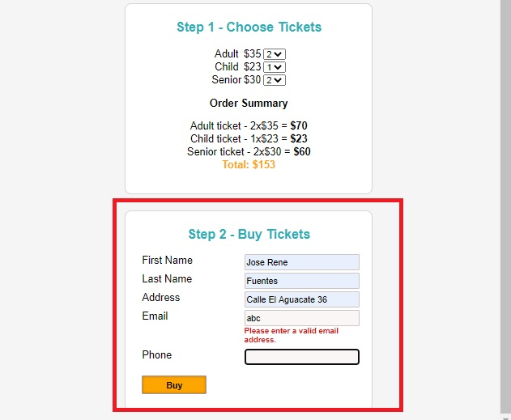

12. En **Paso 2 - Comprar Entradas**, en la casilla **Teléfono**, escriba _&lt;Un teléfono de su elección&gt;._ y luego pulse **Comprar**.

- La representación visual del codigo del ejercicio se muestra en la siguiente imagen:  


13. En Microsoft Edge, haga clic en **Cerrar**.

14. En la ventana **ZooSite - Microsoft Visual Studio**, en el menú **Archivo**, haga clic en **Salir**.

>**Resultados**: Después de completar este ejercicio, podrá agregar jQuery a una aplicación web usando npm, modificar elementos HTML usando jQuery, realizar validación del lado del cliente, y manejar eventos de JavaScript.


