# Módulo 9: Desarrollo del lado del cliente


Fichero de Instrucciones: Instructions\20483C_MOD09_LAK.md

Entregar el url de GitHub con la solución y un readme con las siguiente información:

1. **Nombres y apellidos:** José René Fuentes Cortez
2. **Fecha:** 24 de Diciembre 2020.
3. **Resumen del Modulo 9:** Este módulo consta de tres lecciones:
    - En la primera lección aprendemos a aplicar Estilos y como trabajar con Bootstrap.
    - En la lección 2 la práctica nos ayuda a entender como usar los Task Runner y como compilar SASS y CSS.
    - En la lección tres se muestra el Diseño responsive y además como usar el sistema Bootstrap Grid.


4. **Dificultad o problemas presentados y como se resolvieron:** Ninguna.

**NOTA**: Si no hay descripcion de problemas o dificultades, y al yo descargar el código para realizar la comprobacion y el código no funcionar, el resultado de la califaciación del laboratorio será afectado.

---

Siempre que la ruta a un archivo comience con *[Raíz del repositorio]*, reemplácela con la ruta absoluta a la carpeta en la que reside el repositorio 20486. Por ejemplo, si clonó o extrajo el repositorio 20486 en **C:\Users\John Doe\Downloads\20486**, cambiar el camino a: **[Repository Root]\AllFiles\20486D\Mod01** al **C:\Users\John Doe\Downloads\20486\AllFiles\20486D\Mod01**

# Lección 1: Aplicar estilos

### Demostración: Cómo trabajar con Bootstrap

#### Pasos de preparación

Asegúrese de haber clonado el directorio **20486D** de GitHub. Contiene los segmentos de código para los laboratorios y demostraciones de este curso.
**(https://github.com/MicrosoftLearning/20486D-DevelopingASPNETMVCWebApplications/tree/master/Allfiles)**

#### Pasos de demostración

1. En **Explorador de archivos**, vaya a **[Repository Root]\Allfiles\Mod09\Democode\01_BootstrapExample_begin\BootstrapExample** y luego copie la dirección en la barra de direcciones.

> ** Nota **: Si aparece un cuadro de diálogo ** Advertencia de seguridad para el sitio web de productos **, verifique que la casilla de verificación ** Preguntarme por cada proyecto en esta solución ** esté desactivada y luego haga clic en ** Aceptar **.


2. Seleccione el botón **Inicio**, y luego escriba **cmd**.

3. En **Best match**, haga clic con el botón derecho **Command Prompt**, y luego haga clic en **Run as administrator**.

4. En el cuadro de diálogo **Control de cuentas de usuario**, haga clic en **Sí**.

5. En el cuadro de diálogo **Administrador: Command Prompt**, escriba el siguiente comando y luego pulse Intro.
  ```cs
       cd {copia de la ruta de la carpeta}
  ```

 > **Nota**: Si la **{Ruta de la carpeta copiada}** es diferente de la unidad de disco en la que se encuentra el símbolo del sistema, deberá escribir *{disco}:* antes de escribir el comando **cd** *{Ruta de la carpeta copiada}*.

6. En el **Administrador: Command Prompt**, escriba el siguiente comando y, a continuación, pulse Intro.
  ```cs
       npm install
  ```
>**Nota**: Si se muestran mensajes de advertencia en la línea de comandos, puede ignorarlos.

- La representación visual del código del ejercicio se muestra en la siguiente imagen:

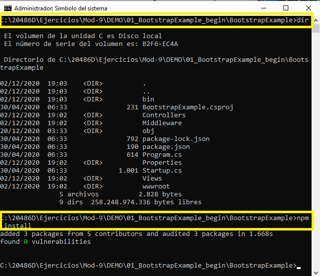

7. Cierre la ventana.

8. En el **Explorador de Archivos**, navega a **[Repository Root]\Allfiles\Mod09\Democode\01_BootstrapExample_begin**, y luego haz doble clic en **BootstrapExample.sln**.

    >**Nota**: Si aparece un cuadro de diálogo de **Aviso de seguridad para BootstrapExample**, verifique que la casilla de verificación **Ask me for each project in this solution** esté despejada, y luego haga clic en OK.

9. En la ventana **BootstrapExample - Microsoft Visual Studio**, en el Explorador de soluciones, haga clic con el botón derecho del ratón en **Vistas**, apunte a **Agregar**, y luego haga clic en **Nueva carpeta**.

10. En el cuadro **Nueva Carpeta**, escriba **Shared**, y luego presione Enter.

- La representación visual del código del ejercicio se muestra en la siguiente imagen:

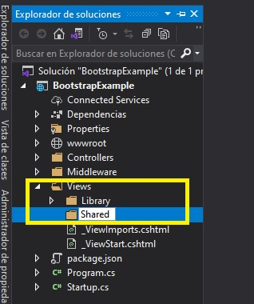

11. En la ventana **BootstrapExample - Microsoft Visual Studio**, en el Solution Explorer, en **Vistas**, haga clic con el botón derecho del ratón en **Compartido**, apunte a **Agregar**, y luego haga clic en **Nuevo elemento**.

12. En el cuadro de diálogo **Agregar nuevo elemento - BootstrapExample**, haga clic en **Web**, en el panel de resultados, haga clic en **Razor Layout**, y luego haga clic en **Agregar**.

- La representación visual del código del ejercicio se muestra en la siguiente imagen:

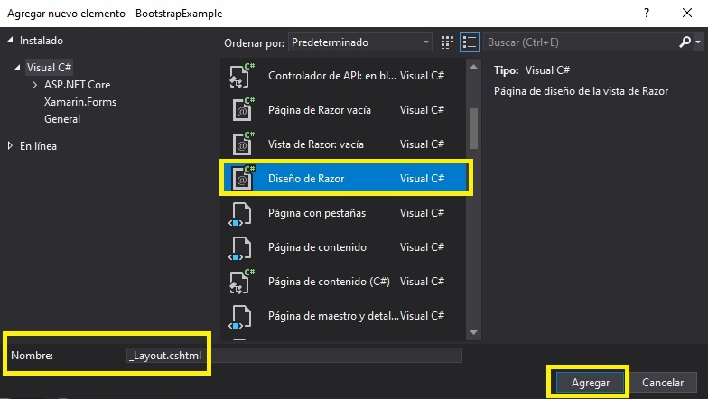

13. En la ventana de código **_Layout.cshtml**, localice el siguiente código:
  ```cs
       <title>@ViewBag.Title</title>
  ```

14. Coloque el cursor después del signo **>** (mayor que) de la etiqueta **&lt;/title&gt;** pulse Intro y luego escriba el siguiente código: 
  ```cs
       <link href="~/node_modules/bootstrap/dist/css/bootstrap.css" rel="stylesheet" />
       <link href="~/css/style.css" rel="stylesheet" />
  ```

15. En la ventana del código **_Layout.cshtml**, localice el siguiente código:
  ```cs
       <body>
             <div>
                @RenderBody()
             </div>
       </body>
  ```

16. En la ventana del código **_Layout.cshtml**, coloque el cursor después del signo **>** (mayor que) de la etiqueta **&lt;body&gt;**
  ```cs
       <div>
           <nav class="navbar navbar-expand-lg navbar-dark bg-dark">
           <span class="navbar-brand mb-0 h1">Your Book Library</span>
           <div class="collapse navbar-collapse" id="navbarNavDropdown">
               <ul class="navbar-nav">
               </ul>
            </div>
        </nav>
       </div>
  ```

17. En la ventana del código **_Layout.cshtml**, en el elemento **UL**, escriba el siguiente código:
  ```cs
       <li class="nav-item active">
           <a class="nav-link" href="@Url.Action("Index", "Library")">Home <span class="sr-only">(current)</span></a>
       </li>
       <li class="nav-item dropdown">
           <a href="#" class="nav-link dropdown-toggle" id="navbarDropdownMenuLink" data-toggle="dropdown" aria-haspopup="true" aria-expanded="false">
               Genres
           </a>
           <div class="dropdown-menu" aria-labelledby="navbarDropdownMenuLink">
               <a class="dropdown-item" href="@Url.Action("GetScienceFictionBooks", "Library")">Science Fiction</a>
               <a class="dropdown-item" href="@Url.Action("GetDramaBooks", "Library")">Drama</a>
           </div>
       </li>
  ```

18. En la ventana del código **_Layout.cshtml**, localice el siguiente código:
  ```cs
       <div>
           @RenderBody()
       </div>
  ```

19. Coloque el cursor después del signo **>** (mayor que) de la etiqueta **&lt;/div&gt;** presione Enter dos veces, y luego escriba el siguiente código: 
  ```cs
       <script src="~/node_modules/jquery/dist/jquery.js"></script>
       <script src="~/node_modules/popper.js/dist/umd/popper.js"></script>
       <script src="~/node_modules/bootstrap/dist/js/bootstrap.js"></script>
       <script src="~/js/alert-function.js"></script>
  ```

20. En la ventana del código **_Layout.cshtml**, seleccione el siguiente código:
  ```cs
       <div>
           @RenderBody()  
       </div>
  ```

21. Reemplazar el código seleccionado por el siguiente código:
  ```cs
       <div class="view-container">
           @RenderBody()
       </div>
  ```

- La representación visual del código del ejercicio se muestra en la siguiente imagen:

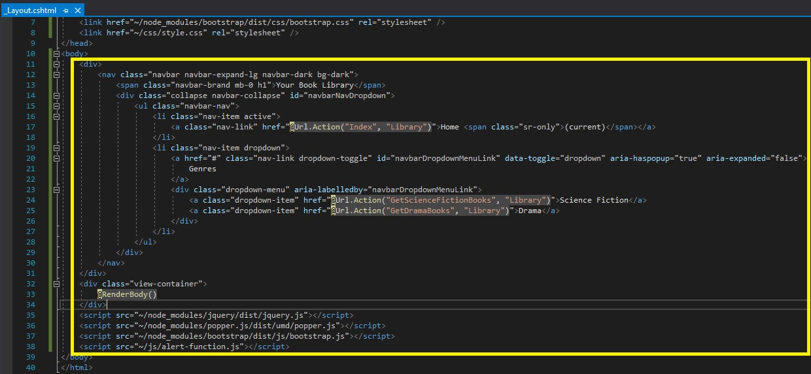


22. En la ventana **BootstrapExample - Microsoft Visual Studio**, en el Explorador de soluciones, amplíe **Controllers**, y luego haga clic en **LibraryController.cs**.

23. En la ventana de código **LibraryController.cs**, haga clic con el botón derecho del ratón en el siguiente código y luego haga clic en **Add View**.
  ```cs
       public IActionResult Index()
  ```

24. En el cuadro de diálogo **Añadir vista de MVC**, asegúrese de que el valor en el cuadro **Nombre de la vista** es **Index**.

25. En el cuadro de diálogo **Agregar vista MVC**, asegúrese de que la plantilla **Vacío (sin modelo)** esté seleccionada.

26. En el cuadro de diálogo **Agregar vista MVC**, asegúrese de que la casilla de verificación **Crear como una vista parcial** está desactivada y la casilla de verificación **Utilizar una página de diseño** está seleccionada y, a continuación, haga clic en **Agregar**.

- La representación visual del código del ejercicio se muestra en la siguiente imagen:

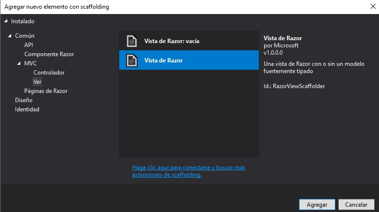

27. En la ventana de código **Index.cshtml**, seleccione el siguiente código:
  ```cs
       <h2>Index</h2>
  ```

28. Reemplazar el código seleccionado por el siguiente código:
  ```cs
       <div class="text-center">
           <h1>Welcome to Open Library </h1>
           <button type="button" class="btn btn-primary" data-toggle="modal" data-target="#exampleModal">
               Launch Modal Example
           </button>
       </div>
  ``` 

29. En la ventana del código **Index.cshtml**, coloque el cursor inmediatamente después del signo **>** (mayor que) de la etiqueta **&lt;/div&gt;**, pulse dos veces Intro y escriba el siguiente código:
  ```cs
       <div class="modal fade" id="exampleModal" tabindex="-1" role="dialog" aria-labelledby="exampleModalLabel" aria-hidden="true">
           <div class="modal-dialog" role="document">
                <div class="modal-content">
                    <div class="modal-header">
                        <h5 class="modal-title" id="exampleModalLabel">Your Book Library</h5>
                        <button type="button" class="close" data-dismiss="modal" aria-label="Close">
                            <span aria-hidden="true">&times;</span>
                        </button>
                    </div>
                    <div class="modal-body">
                        Welcome to the book library
                    </div>
                    <div class="modal-footer">
                        <button type="button" class="btn btn-secondary" data-dismiss="modal">Close</button>
                    </div>
                </div>
           </div>
       </div>
  ```

- La representación visual del código del ejercicio se muestra en la siguiente imagen:

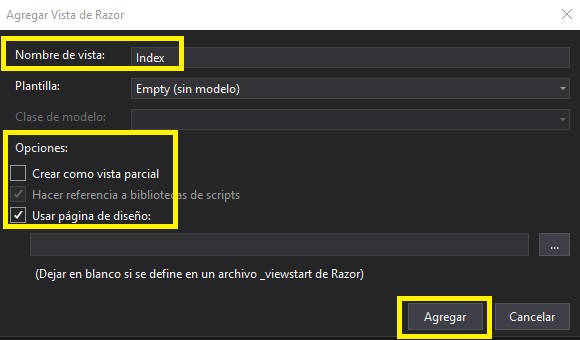

30. En la ventana **BootstrapExample - Microsoft Visual Studio**, en el Solution Explorer, en **Views**, haga clic con el botón derecho del ratón en **Shared**, apunte a **Add**, y luego haga clic en **New Item**.

31. En el cuadro de diálogo **Agregar nuevo elemento - BootstrapExample**, haga clic en **Web** y, a continuación, en el panel de resultados, haga clic en **Razor View**.

32. En el cuadro de diálogo **Agregar nuevo elemento - Ejemplo de arranque**, en el cuadro **Nombre**, escriba **_Alerta**, y luego haga clic en **Agregar**. 

- La representación visual del código del ejercicio se muestra en la siguiente imagen:

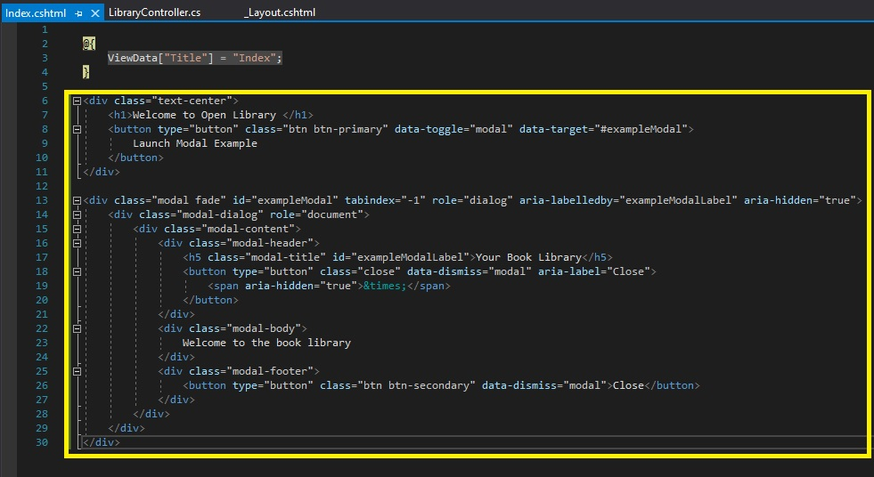


33. En la ventana de código **_Alerta.cshtml**, seleccione el siguiente código:
  ```cs
       @*
          For more information on enabling MVC for empty projects, visit https://go.microsoft.com/fwlink/?LinkID=397860
       *@
       @{
       }
  ```

34. Sustituya el código seleccionado por el siguiente código:
  ```cs
       <section>
           <h2 class="m-2">Did you like the book you borrowed? </h2>
           <button type="button" class="btn btn-outline-success">Yes</button>
           <button type="button" class="btn btn-outline-danger">No</button>
           <div id="alert" class="alert alert-success alert-dismissible fade show m-3" role="alert">
           </div>
       </section>
  ```

35. En la ventana del código **_Alerta.cshtml**, en el elemento **DIV**, escriba el siguiente código:
  ```cs
       <strong>Thank you for the response!</strong>
       We will take this into consideration the next time we recommend you a book.
       <button type="button" class="close" aria-label="Close">
           <span aria-hidden="true">&times;</span>
       </button>
  ```
35. En la ventana de código de **_Alert.cshtml**, en el elemento **DIV**, escriba el siguiente código:
  ```cs
       <strong>Thank you for the response!</strong>
       We will take this into consideration the next time we recommend you a book.
       <button type="button" class="close" aria-label="Close">
           <span aria-hidden="true">&times;</span>
       </button>
  ```

- La representación visual del código del ejercicio se muestra en la siguiente imagen:

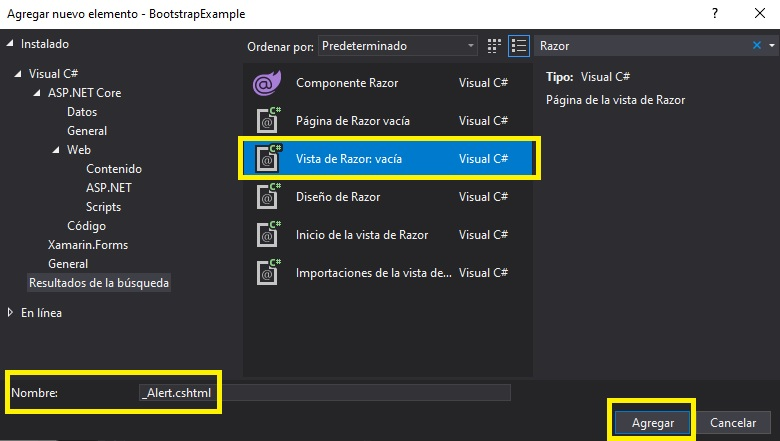

36. En la ventana **BootstrapExample - Microsoft Visual Studio**, en el menú **FILE**, haga clic en **Save All**.

37. En la ventana **BootstrapExample - Microsoft Visual Studio**, en el menú **DEBUG**, haga clic en **Start Without Debugging**.

- La representación visual del código del ejercicio se muestra en la siguiente imagen:

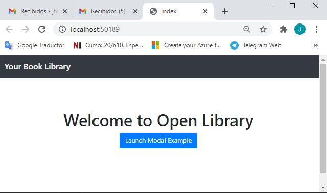

38. En la página **Home**, haga clic en **Launch Modal Example**, y luego haga clic en **Close**.

- La representación visual del código del ejercicio se muestra en la siguiente imagen:

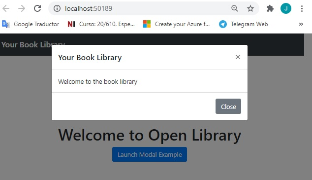

39. En la barra de menú, haga clic en **Géneros**, y luego en **Drama**. 

- La representación visual del código del ejercicio se muestra en la siguiente imagen:

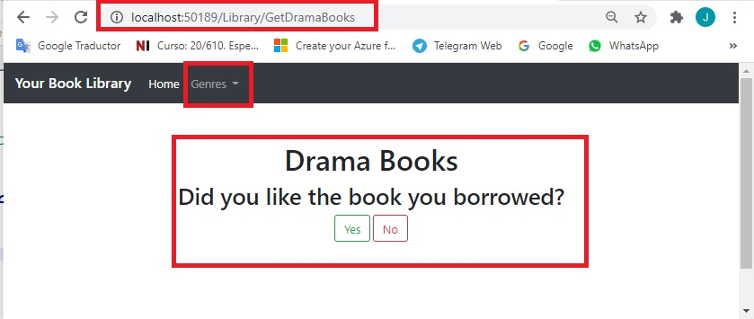

40. En la página **Libros de drama**, haz clic en **Sí**.

    > **Nota**: Examinar la alerta que aparece.

- La representación visual del código del ejercicio se muestra en la siguiente imagen:

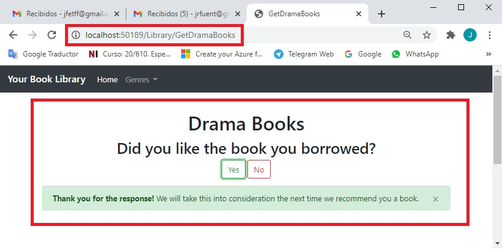

41. Para cerrar la alerta, presione el botón de cierre **X**.

42. En la barra de menú, pulse **Géneros**, y luego pulse **Ciencia Ficción**. 

43. En la página de **Libros de Ciencia Ficción**, pulse **No**.

    > **Nota**: Examinar la alerta que aparece.

- La representación visual del código del ejercicio se muestra en la siguiente imagen:

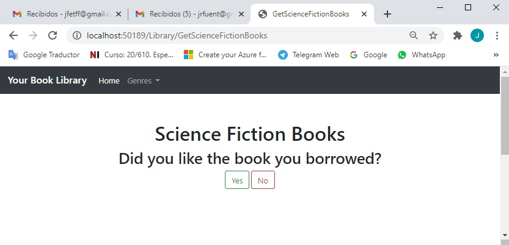

44. Para cerrar la alerta, presione el botón de cierre **X**.

- La representación visual del código del ejercicio se muestra en la siguiente imagen:

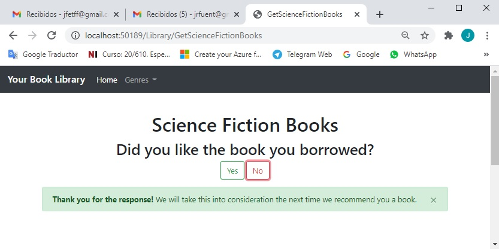

45. En Microsoft Edge, presione el botón **Cerrar**.

46. En la ventana **BootstrapExample - Microsoft Visual Studio**, en el menú **FILE**, haga clic en **Salir**.

# Lección 2: Uso de los Corredores de Tareas

### Demonstration: Cómo usar gulp para compilar Sass a CSS

#### Pasos de preparación 

Asegúrate de que has clonado el directorio **20486D** de GitHub. Contiene los segmentos de código para los laboratorios y demostraciones de este curso. 
**(https://github.com/MicrosoftLearning/20486D-DevelopingASPNETMVCWebApplications/tree/master/Allfiles)**

#### Pasos de demostración

1. En el **Explorador de Archivos**, navega a **[Repository Root]\Allfiles\Mod09\Democode\02_GulpExample_begin\GulpExample**, y luego copia la dirección en la barra de direcciones.

2. Selecciona el botón **Inicio**, y luego escribe **cmd**.

3. En **Best match**, haz clic con el botón derecho **Command Prompt**, y luego haz clic en **Run as administrator**.

4. En el cuadro de diálogo **Control de cuentas de usuario**, haga clic en **Sí**.

5. En el cuadro de diálogo **Administrador: Command Prompt**, escriba el siguiente comando y luego pulse Intro.
  ```cs
       cd {copia de la ruta de la carpeta}
  ```

 > **Nota**: Si la *{Ruta de la carpeta copiada}* es diferente de la unidad de disco en la que se encuentra el símbolo del sistema, deberá escribir *{pista de disco}:* antes de escribir el comando **cd** *{Ruta de la carpeta copiada}*.

6. En el **Administrador: Command Prompt**, escriba el siguiente comando y, a continuación, pulse Intro.
  ```cs
       npm install
  ```
 > **Nota**: Si se muestran mensajes de advertencia en la línea de comandos, puede ignorarlos.

- La representación visual del código del ejercicio se muestra en la siguiente imagen:

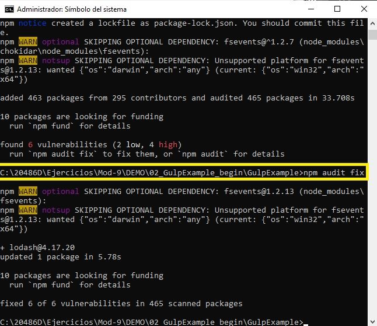

7. Cierre la ventana.

8. Navega a **[Repository Root]\Allfiles\Mod09\Democode\02_GulpExample_begin**, y luego haz doble clic en **GulpExample.sln**.

    > **Nota**: Si aparece un cuadro de diálogo de **Aviso de seguridad para GulpExample**, verifique que la casilla de verificación **Ask me for each project in this solution** esté despejada, y luego haga clic en OK.

9. En la ventana **GulpExample - Microsoft Visual Studio**, en el menú **TOOLS**, haga clic en **Opciones**.

10. En el cuadro de diálogo **Opciones**, en la casilla **Opciones de búsqueda**, escriba **Gestión de paquetes web**, y luego pulse Intro.

11. En el cuadro de lista **Localización de herramientas externas**, seleccione **$(PATH)**, presione el botón de la flecha hacia arriba hasta que **$(PATH)** esté en la parte superior de la lista, y luego haga clic en **OK**.

- La representación visual del código del ejercicio se muestra en la siguiente imagen:

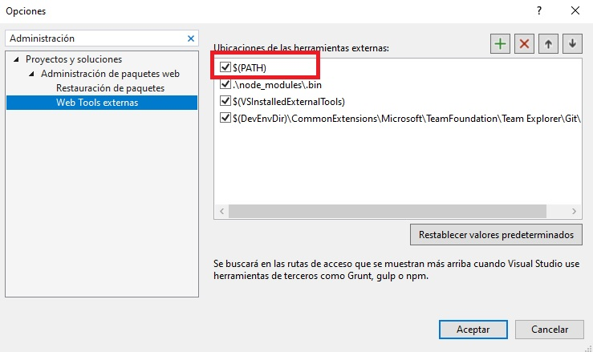

12. En la ventana **GulpExample - Microsoft Visual Studio**, en el menú **DEBUG**, haga clic en **Iniciar sin depuración**.

    > **Nota**: El navegador muestra una página que no está diseñada por un CSS.

- La representación visual del código del ejercicio se muestra en la siguiente imagen:

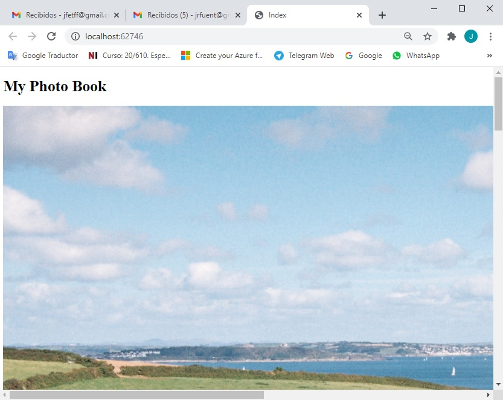

13. En Microsoft Edge, haga clic en **Cerrar**.

14. En la ventana **GulpExample - Microsoft Visual Studio**, en Solution Explorer, haga clic en **package.json**.

15. En la ventana del código **package.json**, examine el código.

    > **Nota**: Los paquetes **gulp** y **gulp-sass** aparecen en la sección **devDependencias**.

- La representación visual del código del ejercicio se muestra en la siguiente imagen:

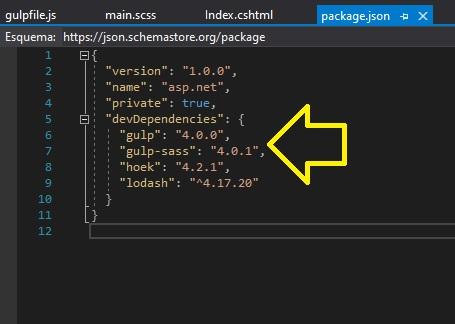

16. En la ventana **GulpExample - Microsoft Visual Studio**, en Solution Explorer, expandir **Views**, expandir **PhotoBook**, y luego hacer clic en **Index.cshtml**.

17. En la ventana de código **Index.cshtml**, examinar el código. 

    > **Nota**: Actualmente no hay enlaces a los archivos CSS.

18. En la ventana **GulpExample - Microsoft Visual Studio**, en el Solution Explorer, haga clic con el botón derecho del ratón en **GulpExample**, apunte a **Add**, y luego haga clic en **New Folder**.

19. En el cuadro **Nueva Carpeta**, escriba **Estilos**, y luego presione Enter.

- La representación visual del código del ejercicio se muestra en la siguiente imagen:

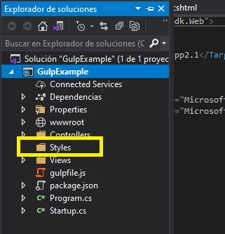

20. En la ventana **GulpExample - Microsoft Visual Studio**, en el Explorador de soluciones, haga clic con el botón derecho del ratón en **Estilos**, apunte a **Agregar**, y luego haga clic en **Nuevo elemento**.

21. En el cuadro de diálogo **Agregar nuevo elemento - GulpExample**, en el cuadro de búsqueda, escriba **scss**, y luego presione Intro.

22. En el cuadro de diálogo **Añadir nuevo elemento - GulpExample**, haga clic en **SCSS Style Sheet (SASS)**.

23. En el cuadro de diálogo **Agregar nuevo elemento - GulpExample**, en el cuadro **Nombre**, escriba **main**, y luego haga clic en **Agregar**. 

- La representación visual del código del ejercicio se muestra en la siguiente imagen:

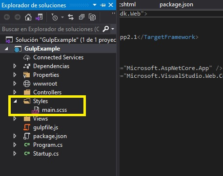

24. En la ventana **código principal.scss**, seleccione el siguiente código: 
  ```cs
       body {
       }
  ```
25. Reemplaza el código seleccionado por el siguiente código:
  ```cs
       $highlights: #124eab;
       $main-color: #1395f4;

       @mixin normalized-text() {
            font-family: Arial;
       }

       h1 {
            color: $highlights;
            @include normalized-text();
            font-size: 40px;
            text-shadow: 0px 2px 5px #aba8a8;
            font-weight: bolder;
            text-align: left;
            margin-left: 55px;
       }
  ```
26. Coloque el cursor inmediatamente después del último signo escrito **}** (corchete de cierre), presione Enter, y luego escriba el siguiente código:
  ```cs
       div {
            color: darken($main-color, 20%);
            margin: 21px 5px 15px 18px;
            padding-bottom: 95px;
            width: 455px;
            border: 5px solid #d6d4d4;
            border-radius: 10px;
            height: 210px;

            img {
                width: 100%;
            }

            h3 {
                @include normalized-text();
                font-size: 25px;
                position: relative;
                margin-top: -43px;
                background-color: lighten($main-color, 35%);
                text-align:center;
            }
       }
  ```

- La representación visual del código del ejercicio se muestra en la siguiente imagen:

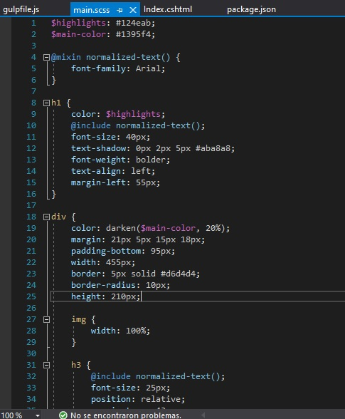

27. En la ventana **GulpExample - Microsoft Visual Studio**, en el Solution Explorer, haga clic con el botón derecho del ratón en **GulpExample**, apunte a **Add**, y luego haga clic en **New Item**.

28. En el cuadro de diálogo **Agregar nuevo elemento - GulpExample**, haga clic en **Web** y, a continuación, en el panel de resultados, haga clic en **Archivo JavaScript**.

29. En el cuadro de diálogo **Agregar nuevo elemento - GulpExample**, en el cuadro **Nombre**, escriba **gulpfile.js**, y luego haga clic en **Agregar**.

- La representación visual del código del ejercicio se muestra en la siguiente imagen:

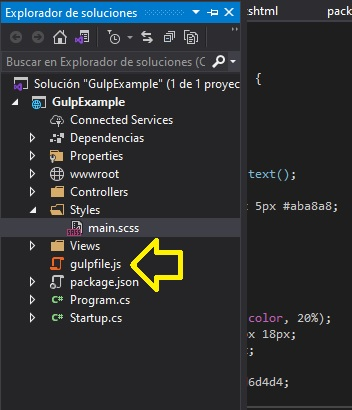

30. En la ventana del código **gulpfile.js**, escriba el siguiente código:
  ```cs
       var gulp = require('gulp');
       var sass = require('gulp-sass');


       gulp.task("sass", function() {
           return gulp.src('Styles/main.scss')
               .pipe(sass())
               .pipe(gulp.dest('wwwroot/css'));
       });
  ```

- La representación visual del código del ejercicio se muestra en la siguiente imagen:

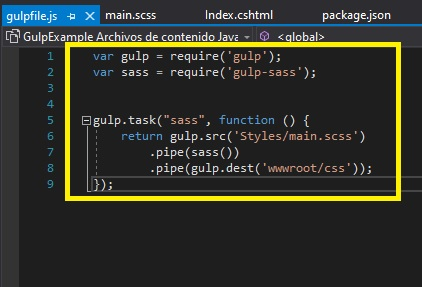

31. En la ventana **GulpExample - Microsoft Visual Studio**, en el menú **FILE**, haga clic en **Save All**.

32. En la ventana **GulpExample - Microsoft Visual Studio**, en Solution Explorer, haga clic con el botón derecho en **gulpfile.js**, y luego haga clic en **Task Runner Explorer**.

    > **Nota**: Si la **tarea** no aparece en la lista de **Tareas**, haga clic en **Actualizar**.

- La representación visual del código del ejercicio se muestra en la siguiente imagen:

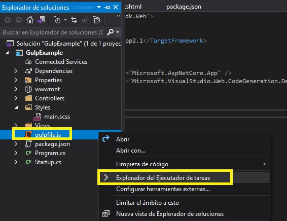

33. En el panel **Task Runner Explorer**, en **Tasks**, haga clic con el botón derecho del ratón en **sass**, y luego haga clic en **Run**.

- La representación visual del código del ejercicio se muestra en la siguiente imagen:

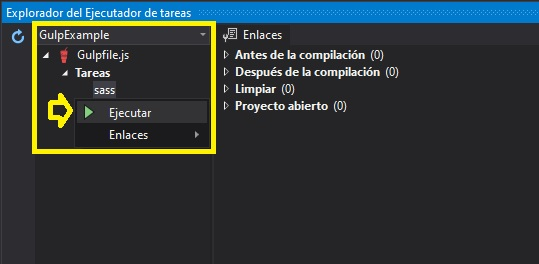

    > **Nota**: 34. En el Explorador de soluciones, en **wwwwroot**, se ha añadido una nueva carpeta llamada **css** que contiene un archivo CSS llamado **main.css**.

- La representación visual del código del ejercicio se muestra en la siguiente imagen:

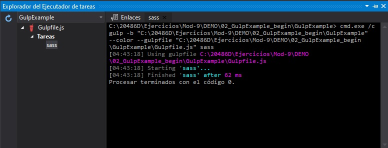

34. En la ventana **GulpExample - Microsoft Visual Studio**, en Solution Explorer, en **Views**, en **PhotoBook**, haga clic en **Index.cshtml**.


35. En la ventana de código **Index.cshtml**, localice el siguiente código:
  ```cs
       <title>Index</title>
  ```
36. Coloque el cursor después del signo **>** (mayor que) de la etiqueta **&lt;/title&gt;** pulse Intro y luego escriba el siguiente código: 
  ```cs
       <link type="text/css" href="~/css/main.css" rel="stylesheet" />
  ```

- La representación visual del código del ejercicio se muestra en la siguiente imagen:

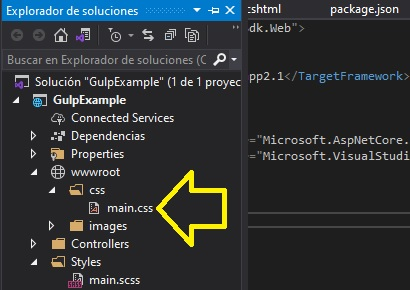

37. En la ventana **GulpExample - Microsoft Visual Studio**, en el menú **FILE**, haga clic en **Save All**.

38. En la ventana **GulpExample - Microsoft Visual Studio**, en el menú **DEBUG**, haga clic en **Start Without Debugging**.

    > **Nota**: El navegador muestra una página que está diseñada usando CSS.

- La representación visual del código del ejercicio se muestra en la siguiente imagen:

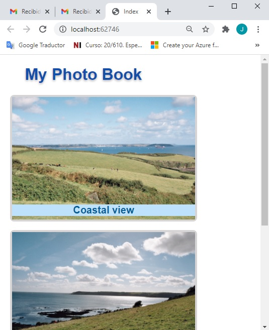

39. En Microsoft Edge, haga clic en **Cerrar**.

40. En la ventana **GulpExample - Microsoft Visual Studio**, en el menú **FILE**, haga clic en **Salir**.

# Lección 3: Diseño Responsive

### Demonstration: Cómo usar el sistema de cuadrícula Bootstrap

#### Pasos de preparación 

Asegúrate de que has clonado el directorio **20486D** de GitHub. Contiene los segmentos de código para los laboratorios y demostraciones de este curso. 
**(https://github.com/MicrosoftLearning/20486D-DevelopingASPNETMVCWebApplications/tree/master/Allfiles)**

#### Pasos de demostración

1. En el **Explorador de Archivos**, navega a **[Repository Root]\Allfiles\Mod09\Democode\03_GridExample_begin\GridExample**, y luego copia la dirección en la barra de direcciones.

2. Selecciona el botón **Index**, y luego escribe **cmd**.

3. En **Best match**, haz clic con el botón derecho del ratón en **Command Prompt**, y luego haz clic en **Run as administrator**.

4. En el cuadro de diálogo **Control de cuentas de usuario**, haga clic en **Sí**.

5. En el cuadro de diálogo **Administrador: Command Prompt**, escriba el siguiente comando y luego pulse Intro.
  ```cs
       cd {copied folder path}
  ```

   > **Nota**: Si la *{Ruta de la carpeta copiada}* es diferente de la unidad de disco en la que se encuentra el símbolo del sistema, deberá escribir *{pista de disco}:* antes de escribir el comando **cd** *{Ruta de la carpeta copiada}*.

6. En el **Administrador: Command Prompt**, escriba el siguiente comando y, a continuación, pulse Intro.
  ```cs
       npm install
  ```
  >  **Nota**: Si se muestran mensajes de advertencia en la línea de comandos, puede ignorarlos.

- La representación visual del código del ejercicio se muestra en la siguiente imagen:

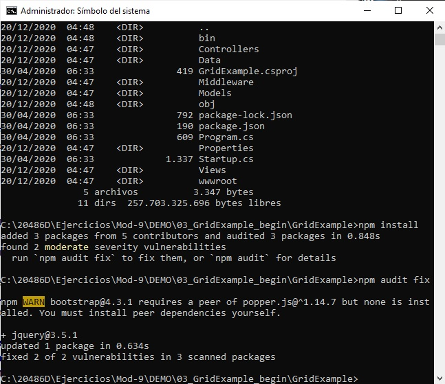

7. Cierre la ventana.

8. Navega a **[Repository Root]\Allfiles\Mod09\Democode\03_GridExample_begin**, y luego haz doble clic en **GridExample.sln**.

    >**Nota**: Si aparece un cuadro de diálogo **Aviso de seguridad para el GridExample**, verifique que la casilla de verificación **Ask me for each project in this solution** esté despejada, y luego haga clic en OK.

9. En la ventana **GridExample - Microsoft Visual Studio**, en el Explorador de soluciones, expanda **Controllers**, y luego haga clic en **ChessController.cs**.

10. En la ventana de código **ChessController.cs**, haga clic con el botón derecho del ratón en el siguiente código y luego haga clic en **Add View**.
  ```cs
       public IActionResult Index()
  ```

11. En el cuadro de diálogo **Añadir vista de MVC**, asegúrese de que el valor en el cuadro **Nombre de la vista** es **Index**.

12. En el cuadro de diálogo **Agregar vista MVC**, asegúrese de que la plantilla **Vacío (sin modelo)** esté seleccionada.

13. En el cuadro de diálogo **Agregar vista MVC**, asegúrese de que las casillas de verificación **Crear como vista parcial** y **Utilizar una página de diseño** están desactivadas y, a continuación, haga clic en **Agregar**.

- La representación visual del código del ejercicio se muestra en la siguiente imagen:


14. En la ventana de código **Index.cshtml**, localice el siguiente código:
  ```cs
       @{
          Layout = null;
       }
  ```

15. Ponga el cursor antes del signo **@** (at), pulse la tecla de flecha arriba, escriba el siguiente código y luego pulse Intro.
  ```cs
       @model IEnumerable<GridExample.Models.Game>
  ```

16. En la ventana del código **Index.cshtml**, localice el siguiente código:
  ```cs
       <title>Index</title>
  ```

17. Coloque el cursor después del signo **>** (mayor que) de la etiqueta **&lt;/title&gt;** pulse Intro y luego escriba el siguiente código: 
  ```cs
       <link href="~/node_modules/bootstrap/dist/css/bootstrap.css" rel="stylesheet" />
       <link href="~/css/style.css" rel="stylesheet" />
  ```

18. En la ventana del código **Index.cshtml** en el elemento **BODY**, escriba el siguiente código:
  ```cs
       <div class="title">
           <h1>Chess League</h1>
           <p>Hey, These are the Results</p>
       </div>  
  ```

19. Coloque el cursor inmediatamente después del signo **>** (mayor que) de la etiqueta **&lt;/div&gt;**, presione Enter dos veces, y luego escriba el siguiente código:
  ```cs
       <div class="container">
           <div class="row grid-header align-items-center">
                <div class="col-2">
                </div>
                <div class="col-4">
                    Competitors
                </div>
                <div class="col-3">
                    Quantity
                </div>
                <div class="col-3">
                    Results
                </div>
           </div>
           <div class="row align-items-center">
                @foreach (var item in Model)
                {
                }
           </div>
       </div>
  ```

20. Ponga el cursor en el bloque de código **FOREACH**, presione Enter, y luego escriba el siguiente código:
  ```cs
       <div class="col-2">
           <div class="row justify-content-center">
                
           </div>
           <div class="row justify-content-center">
                
           </div>
       </div>
       <div class="col-4">
           <div class="row">
                @Html.DisplayFor(model => item.FirstCompetitorName)
           </div>
           <div class="row">
                @Html.DisplayFor(model => item.SecondCompetitorName)
           </div>
       </div>
       <div class="col-3">
           @Html.DisplayFor(model => item.GamesQuantity)
       </div>
       <div class="col-3">
           @Html.DisplayFor(model => item.FinalScore)
       </div>  
  ```

21. Ponga el cursor antes del signo **<** (menos de) de la etiqueta **&lt;/body&gt;**
  ```cs
       <script src="~/node_modules/jquery/dist/jquery.js"></script>
       <script src="~/node_modules/popper.js/dist/umd/popper.js"></script>
       <script src="~/node_modules/bootstrap/dist/js/bootstrap.js"></script>
  ```

- La representación visual del código del ejercicio se muestra en la siguiente imagen:

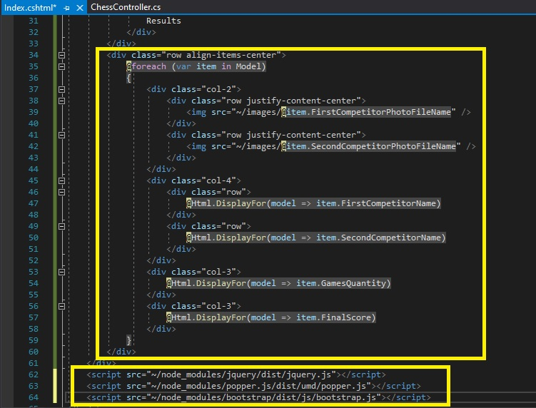

22. En la ventana **GridExample - Microsoft Visual Studio**, en el menú **FILE**, haga clic en **Save All**.

23. En la ventana **GridExample - Microsoft Visual Studio**, en el menú **DEBUG**, haga clic en **Start Without Debugging**.

      >**Nota**: El navegador muestra una página que está diseñada utilizando el sistema de **Bootstrap grid system**.

- La representación visual del código del ejercicio se muestra en la siguiente imagen:

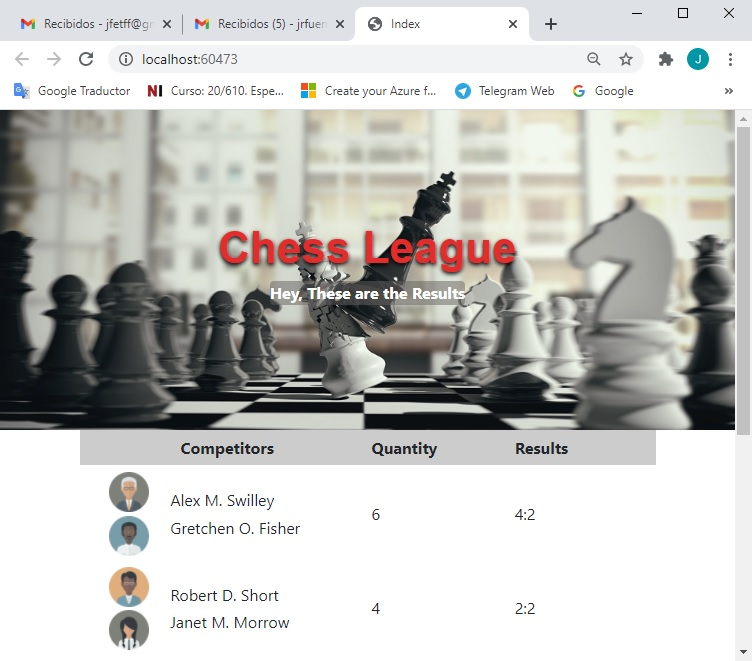

24. En Microsoft Edge, haga clic en **Cerrar**.

25. En la ventana **GridExample - Microsoft Visual Studio**, en el menú **FILE**, haga clic en **Salir**.

